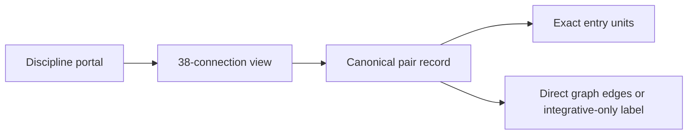

# Cross-Disciplinary Connection Atlas

This atlas contains one canonical record for every unordered pair of the 39
disciplines: `39 × 38 ÷ 2 = 741`. A discipline-specific `connections.md` file
is a navigational view over these records rather than a second editable account.

A direct graph relation means that at least one Phase 1 unit in one discipline
declares a unit in the other as a prerequisite. “Integrative only” means that
the fields still illuminate one another, but no direct prerequisite edge is
currently asserted.

In prose: each discipline portal opens its 38-connection index; every index row
resolves to one canonical pair record; that record names exact units and states
whether the relationship is encoded as a prerequisite edge.

## Pair index

| First discipline | Pair records |
|---|---:|
| Architecture and Design | 38 |
| Art | 37 |
| Artificial Intelligence | 36 |
| Astronomy | 35 |
| Biology | 34 |
| Business and Management | 33 |
| Chemistry | 32 |
| Cognitive Science | 31 |
| Communication | 30 |
| Computer Science | 29 |
| Earth, Climate, and Energy | 28 |
| Economics | 27 |
| Education | 26 |
| Engineering | 25 |
| Finance | 24 |
| Foundations | 23 |
| Geography | 22 |
| Health and Medicine | 21 |
| History | 20 |
| Islamic Studies | 19 |
| Law | 18 |
| Learning | 17 |
| Life Skills | 16 |
| Linguistics | 15 |
| Literature | 14 |
| Logic | 13 |
| Mathematics | 12 |
| Music | 11 |
| Philosophy | 10 |
| Physics | 9 |
| Political Science | 8 |
| Psychology | 7 |
| Research | 6 |
| Security | 5 |
| Sociology and Anthropology | 4 |
| Statistics and Data | 3 |
| Systems Science | 2 |
| Theology and Comparative Religion | 1 |
| Writing | 0 |

## Architecture and Design

### `CONN-ARC-ART` — Architecture and Design ↔ Art

**Relationship.** Architecture and Design contributes spatial synthesis, iterative design, representation, and evaluation under constraints to questions about images, objects, aesthetic experience, patronage, and visual cultures; Art contributes visual analysis, material practice, composition, and critical interpretation to questions about built environments, artifacts, services, users, and material culture. Their integration makes assumptions, scales, and standards of evidence visible instead of treating either field as a complete explanation.

**Entry units.** Architecture and Design: [`ARC-B01`](Architecture-and-Design/roadmap.md), [`ARC-B02`](Architecture-and-Design/roadmap.md), [`ARC-I04`](Architecture-and-Design/roadmap.md). Art: [`ART-B01`](Art/roadmap.md), [`ART-B02`](Art/roadmap.md), [`ART-I02`](Art/roadmap.md).

**Integration prompt.** Construct a case study or artifact that uses Architecture and Design's spatial synthesis, iterative design, representation, and evaluation under constraints and Art's visual analysis, material practice, composition, and critical interpretation to investigate a real problem involving built environments, artifacts, services, users, and material culture and images, objects, aesthetic experience, patronage, and visual cultures. State where the methods agree, conflict, or cannot be combined.

**Graph relation.** Direct prerequisite edges: `ART-B01` → `ARC-B01`, `ART-B02` → `ARC-B02`, `ART-I02` → `ARC-I04`

### `CONN-ARC-AIX` — Architecture and Design ↔ Artificial Intelligence

**Relationship.** Architecture and Design contributes spatial synthesis, iterative design, representation, and evaluation under constraints to questions about intelligent systems, automated decisions, models, data, and human agency; Artificial Intelligence contributes machine learning, search, representation, evaluation, and sociotechnical governance to questions about built environments, artifacts, services, users, and material culture. Their integration makes assumptions, scales, and standards of evidence visible instead of treating either field as a complete explanation.

**Entry units.** Architecture and Design: [`ARC-B01`](Architecture-and-Design/roadmap.md). Artificial Intelligence: [`AIX-B01`](Artificial-Intelligence/roadmap.md).

**Integration prompt.** Construct a case study or artifact that uses Architecture and Design's spatial synthesis, iterative design, representation, and evaluation under constraints and Artificial Intelligence's machine learning, search, representation, evaluation, and sociotechnical governance to investigate a real problem involving built environments, artifacts, services, users, and material culture and intelligent systems, automated decisions, models, data, and human agency. State where the methods agree, conflict, or cannot be combined.

**Graph relation.** Integrative only: Phase 1 declares no direct prerequisite edge between these disciplines.

### `CONN-ARC-AST` — Architecture and Design ↔ Astronomy

**Relationship.** Architecture and Design contributes spatial synthesis, iterative design, representation, and evaluation under constraints to questions about planetary systems, stars, galaxies, cosmic history, and astrobiological conditions; Astronomy contributes remote observation, physical inference, scale reasoning, and cosmological modeling to questions about built environments, artifacts, services, users, and material culture. Their integration makes assumptions, scales, and standards of evidence visible instead of treating either field as a complete explanation.

**Entry units.** Architecture and Design: [`ARC-B01`](Architecture-and-Design/roadmap.md). Astronomy: [`AST-B01`](Astronomy/roadmap.md).

**Integration prompt.** Construct a case study or artifact that uses Architecture and Design's spatial synthesis, iterative design, representation, and evaluation under constraints and Astronomy's remote observation, physical inference, scale reasoning, and cosmological modeling to investigate a real problem involving built environments, artifacts, services, users, and material culture and planetary systems, stars, galaxies, cosmic history, and astrobiological conditions. State where the methods agree, conflict, or cannot be combined.

**Graph relation.** Integrative only: Phase 1 declares no direct prerequisite edge between these disciplines.

### `CONN-ARC-BIO` — Architecture and Design ↔ Biology

**Relationship.** Architecture and Design contributes spatial synthesis, iterative design, representation, and evaluation under constraints to questions about cells, organisms, heredity, evolution, ecosystems, and biotechnology; Biology contributes evolutionary reasoning, experiment, comparative analysis, and multiscale living-systems modeling to questions about built environments, artifacts, services, users, and material culture. Their integration makes assumptions, scales, and standards of evidence visible instead of treating either field as a complete explanation.

**Entry units.** Architecture and Design: [`ARC-B01`](Architecture-and-Design/roadmap.md). Biology: [`BIO-B01`](Biology/roadmap.md).

**Integration prompt.** Construct a case study or artifact that uses Architecture and Design's spatial synthesis, iterative design, representation, and evaluation under constraints and Biology's evolutionary reasoning, experiment, comparative analysis, and multiscale living-systems modeling to investigate a real problem involving built environments, artifacts, services, users, and material culture and cells, organisms, heredity, evolution, ecosystems, and biotechnology. State where the methods agree, conflict, or cannot be combined.

**Graph relation.** Integrative only: Phase 1 declares no direct prerequisite edge between these disciplines.

### `CONN-ARC-BUS` — Architecture and Design ↔ Business and Management

**Relationship.** Architecture and Design contributes spatial synthesis, iterative design, representation, and evaluation under constraints to questions about firms, teams, ventures, value creation, stakeholders, and organizational change; Business and Management contributes organizational analysis, accounting, operations, strategy, and responsible execution to questions about built environments, artifacts, services, users, and material culture. Their integration makes assumptions, scales, and standards of evidence visible instead of treating either field as a complete explanation.

**Entry units.** Architecture and Design: [`ARC-I02`](Architecture-and-Design/roadmap.md). Business and Management: [`BUS-I05`](Business-and-Management/roadmap.md).

**Integration prompt.** Construct a case study or artifact that uses Architecture and Design's spatial synthesis, iterative design, representation, and evaluation under constraints and Business and Management's organizational analysis, accounting, operations, strategy, and responsible execution to investigate a real problem involving built environments, artifacts, services, users, and material culture and firms, teams, ventures, value creation, stakeholders, and organizational change. State where the methods agree, conflict, or cannot be combined.

**Graph relation.** Direct prerequisite edges: `ARC-I02` → `BUS-I05`

### `CONN-ARC-CHM` — Architecture and Design ↔ Chemistry

**Relationship.** Architecture and Design contributes spatial synthesis, iterative design, representation, and evaluation under constraints to questions about atoms, molecules, reactions, materials, energy transformations, and chemical environments; Chemistry contributes molecular explanation, quantitative experiment, synthesis, analysis, and laboratory reasoning to questions about built environments, artifacts, services, users, and material culture. Their integration makes assumptions, scales, and standards of evidence visible instead of treating either field as a complete explanation.

**Entry units.** Architecture and Design: [`ARC-B01`](Architecture-and-Design/roadmap.md). Chemistry: [`CHM-B01`](Chemistry/roadmap.md).

**Integration prompt.** Construct a case study or artifact that uses Architecture and Design's spatial synthesis, iterative design, representation, and evaluation under constraints and Chemistry's molecular explanation, quantitative experiment, synthesis, analysis, and laboratory reasoning to investigate a real problem involving built environments, artifacts, services, users, and material culture and atoms, molecules, reactions, materials, energy transformations, and chemical environments. State where the methods agree, conflict, or cannot be combined.

**Graph relation.** Integrative only: Phase 1 declares no direct prerequisite edge between these disciplines.

### `CONN-ARC-COG` — Architecture and Design ↔ Cognitive Science

**Relationship.** Architecture and Design contributes spatial synthesis, iterative design, representation, and evaluation under constraints to questions about perception, memory, language, reasoning, consciousness, and intelligent behavior; Cognitive Science contributes computational modeling, cognitive experimentation, representational analysis, and interdisciplinary synthesis to questions about built environments, artifacts, services, users, and material culture. Their integration makes assumptions, scales, and standards of evidence visible instead of treating either field as a complete explanation.

**Entry units.** Architecture and Design: [`ARC-B01`](Architecture-and-Design/roadmap.md). Cognitive Science: [`COG-B01`](Cognitive-Science/roadmap.md).

**Integration prompt.** Construct a case study or artifact that uses Architecture and Design's spatial synthesis, iterative design, representation, and evaluation under constraints and Cognitive Science's computational modeling, cognitive experimentation, representational analysis, and interdisciplinary synthesis to investigate a real problem involving built environments, artifacts, services, users, and material culture and perception, memory, language, reasoning, consciousness, and intelligent behavior. State where the methods agree, conflict, or cannot be combined.

**Graph relation.** Integrative only: Phase 1 declares no direct prerequisite edge between these disciplines.

### `CONN-ARC-COM` — Architecture and Design ↔ Communication

**Relationship.** Architecture and Design contributes spatial synthesis, iterative design, representation, and evaluation under constraints to questions about messages, audiences, relationships, institutions, media, and public deliberation; Communication contributes audience analysis, rhetoric, dialogue, presentation, negotiation, and media criticism to questions about built environments, artifacts, services, users, and material culture. Their integration makes assumptions, scales, and standards of evidence visible instead of treating either field as a complete explanation.

**Entry units.** Architecture and Design: [`ARC-A02`](Architecture-and-Design/roadmap.md), [`ARC-I07`](Architecture-and-Design/roadmap.md). Communication: [`COM-A03`](Communication/roadmap.md), [`COM-I04`](Communication/roadmap.md).

**Integration prompt.** Construct a case study or artifact that uses Architecture and Design's spatial synthesis, iterative design, representation, and evaluation under constraints and Communication's audience analysis, rhetoric, dialogue, presentation, negotiation, and media criticism to investigate a real problem involving built environments, artifacts, services, users, and material culture and messages, audiences, relationships, institutions, media, and public deliberation. State where the methods agree, conflict, or cannot be combined.

**Graph relation.** Direct prerequisite edges: `COM-A03` → `ARC-A02`, `COM-I04` → `ARC-I07`

### `CONN-ARC-CSC` — Architecture and Design ↔ Computer Science

**Relationship.** Architecture and Design contributes spatial synthesis, iterative design, representation, and evaluation under constraints to questions about programs, algorithms, data structures, operating systems, databases, and networks; Computer Science contributes abstraction, algorithm design, programming, systems analysis, and computational experimentation to questions about built environments, artifacts, services, users, and material culture. Their integration makes assumptions, scales, and standards of evidence visible instead of treating either field as a complete explanation.

**Entry units.** Architecture and Design: [`ARC-I02`](Architecture-and-Design/roadmap.md). Computer Science: [`CSC-I11`](Computer-Science/roadmap.md).

**Integration prompt.** Construct a case study or artifact that uses Architecture and Design's spatial synthesis, iterative design, representation, and evaluation under constraints and Computer Science's abstraction, algorithm design, programming, systems analysis, and computational experimentation to investigate a real problem involving built environments, artifacts, services, users, and material culture and programs, algorithms, data structures, operating systems, databases, and networks. State where the methods agree, conflict, or cannot be combined.

**Graph relation.** Direct prerequisite edges: `CSC-I11` → `ARC-I02`

### `CONN-ARC-ECS` — Architecture and Design ↔ Earth, Climate, and Energy

**Relationship.** Architecture and Design contributes spatial synthesis, iterative design, representation, and evaluation under constraints to questions about geosphere, atmosphere, oceans, climate, resources, hazards, and energy systems; Earth, Climate, and Energy contributes Earth-system observation, energy accounting, climate modeling, risk analysis, and scenario evaluation to questions about built environments, artifacts, services, users, and material culture. Their integration makes assumptions, scales, and standards of evidence visible instead of treating either field as a complete explanation.

**Entry units.** Architecture and Design: [`ARC-I03`](Architecture-and-Design/roadmap.md), [`ARC-I06`](Architecture-and-Design/roadmap.md). Earth, Climate, and Energy: [`ECS-B03`](Earth-Climate-and-Energy/roadmap.md), [`ECS-I01`](Earth-Climate-and-Energy/roadmap.md).

**Integration prompt.** Construct a case study or artifact that uses Architecture and Design's spatial synthesis, iterative design, representation, and evaluation under constraints and Earth, Climate, and Energy's Earth-system observation, energy accounting, climate modeling, risk analysis, and scenario evaluation to investigate a real problem involving built environments, artifacts, services, users, and material culture and geosphere, atmosphere, oceans, climate, resources, hazards, and energy systems. State where the methods agree, conflict, or cannot be combined.

**Graph relation.** Direct prerequisite edges: `ECS-B03` → `ARC-I03`, `ECS-I01` → `ARC-I06`

### `CONN-ARC-ECO` — Architecture and Design ↔ Economics

**Relationship.** Architecture and Design contributes spatial synthesis, iterative design, representation, and evaluation under constraints to questions about households, firms, markets, public goods, inequality, development, and macroeconomic systems; Economics contributes incentive analysis, equilibrium and causal modeling, institutional comparison, and welfare evaluation to questions about built environments, artifacts, services, users, and material culture. Their integration makes assumptions, scales, and standards of evidence visible instead of treating either field as a complete explanation.

**Entry units.** Architecture and Design: [`ARC-B01`](Architecture-and-Design/roadmap.md). Economics: [`ECO-B01`](Economics/roadmap.md).

**Integration prompt.** Construct a case study or artifact that uses Architecture and Design's spatial synthesis, iterative design, representation, and evaluation under constraints and Economics' incentive analysis, equilibrium and causal modeling, institutional comparison, and welfare evaluation to investigate a real problem involving built environments, artifacts, services, users, and material culture and households, firms, markets, public goods, inequality, development, and macroeconomic systems. State where the methods agree, conflict, or cannot be combined.

**Graph relation.** Integrative only: Phase 1 declares no direct prerequisite edge between these disciplines.

### `CONN-ARC-EDU` — Architecture and Design ↔ Education

**Relationship.** Architecture and Design contributes spatial synthesis, iterative design, representation, and evaluation under constraints to questions about learners, classrooms, curricula, assessment, educational systems, and human development; Education contributes learning design, formative assessment, curriculum alignment, teaching, and institutional evaluation to questions about built environments, artifacts, services, users, and material culture. Their integration makes assumptions, scales, and standards of evidence visible instead of treating either field as a complete explanation.

**Entry units.** Architecture and Design: [`ARC-I01`](Architecture-and-Design/roadmap.md). Education: [`EDU-I05`](Education/roadmap.md).

**Integration prompt.** Construct a case study or artifact that uses Architecture and Design's spatial synthesis, iterative design, representation, and evaluation under constraints and Education's learning design, formative assessment, curriculum alignment, teaching, and institutional evaluation to investigate a real problem involving built environments, artifacts, services, users, and material culture and learners, classrooms, curricula, assessment, educational systems, and human development. State where the methods agree, conflict, or cannot be combined.

**Graph relation.** Direct prerequisite edges: `ARC-I01` → `EDU-I05`

### `CONN-ARC-ENG` — Architecture and Design ↔ Engineering

**Relationship.** Architecture and Design contributes spatial synthesis, iterative design, representation, and evaluation under constraints to questions about structures, machines, circuits, processes, infrastructure, and engineered systems; Engineering contributes requirements analysis, modeling, prototyping, testing, optimization, and safety engineering to questions about built environments, artifacts, services, users, and material culture. Their integration makes assumptions, scales, and standards of evidence visible instead of treating either field as a complete explanation.

**Entry units.** Architecture and Design: [`ARC-A01`](Architecture-and-Design/roadmap.md), [`ARC-A04`](Architecture-and-Design/roadmap.md), [`ARC-B01`](Architecture-and-Design/roadmap.md). Engineering: [`ENG-A03`](Engineering/roadmap.md), [`ENG-A05`](Engineering/roadmap.md), [`ENG-B01`](Engineering/roadmap.md).

**Integration prompt.** Construct a case study or artifact that uses Architecture and Design's spatial synthesis, iterative design, representation, and evaluation under constraints and Engineering's requirements analysis, modeling, prototyping, testing, optimization, and safety engineering to investigate a real problem involving built environments, artifacts, services, users, and material culture and structures, machines, circuits, processes, infrastructure, and engineered systems. State where the methods agree, conflict, or cannot be combined.

**Graph relation.** Direct prerequisite edges: `ENG-A03` → `ARC-A01`, `ENG-A05` → `ARC-A04`, `ENG-B01` → `ARC-B01`, `ENG-I01` → `ARC-I03`, `ENG-I04` → `ARC-A03`

### `CONN-ARC-FIN` — Architecture and Design ↔ Finance

**Relationship.** Architecture and Design contributes spatial synthesis, iterative design, representation, and evaluation under constraints to questions about household finances, assets, firms, markets, credit, uncertainty, and financial institutions; Finance contributes cash-flow reasoning, valuation, portfolio analysis, risk measurement, and institutional scrutiny to questions about built environments, artifacts, services, users, and material culture. Their integration makes assumptions, scales, and standards of evidence visible instead of treating either field as a complete explanation.

**Entry units.** Architecture and Design: [`ARC-B01`](Architecture-and-Design/roadmap.md). Finance: [`FIN-B01`](Finance/roadmap.md).

**Integration prompt.** Construct a case study or artifact that uses Architecture and Design's spatial synthesis, iterative design, representation, and evaluation under constraints and Finance's cash-flow reasoning, valuation, portfolio analysis, risk measurement, and institutional scrutiny to investigate a real problem involving built environments, artifacts, services, users, and material culture and household finances, assets, firms, markets, credit, uncertainty, and financial institutions. State where the methods agree, conflict, or cannot be combined.

**Graph relation.** Integrative only: Phase 1 declares no direct prerequisite edge between these disciplines.

### `CONN-ARC-FND` — Architecture and Design ↔ Foundations

**Relationship.** Architecture and Design contributes spatial synthesis, iterative design, representation, and evaluation under constraints to questions about ordinary claims, quantities, texts, tools, places, institutions, and daily decisions; Foundations contributes basic literacy, numeracy, observation, digital operation, measurement, and self-orientation to questions about built environments, artifacts, services, users, and material culture. Their integration makes assumptions, scales, and standards of evidence visible instead of treating either field as a complete explanation.

**Entry units.** Architecture and Design: [`ARC-B01`](Architecture-and-Design/roadmap.md). Foundations: [`FND-B01`](Foundations/roadmap.md).

**Integration prompt.** Construct a case study or artifact that uses Architecture and Design's spatial synthesis, iterative design, representation, and evaluation under constraints and Foundations' basic literacy, numeracy, observation, digital operation, measurement, and self-orientation to investigate a real problem involving built environments, artifacts, services, users, and material culture and ordinary claims, quantities, texts, tools, places, institutions, and daily decisions. State where the methods agree, conflict, or cannot be combined.

**Graph relation.** Integrative only: Phase 1 declares no direct prerequisite edge between these disciplines.

### `CONN-ARC-GEO` — Architecture and Design ↔ Geography

**Relationship.** Architecture and Design contributes spatial synthesis, iterative design, representation, and evaluation under constraints to questions about places, landscapes, populations, movement, regions, territories, and spatial inequality; Geography contributes spatial reasoning, field observation, cartography, geographic information systems, and regional comparison to questions about built environments, artifacts, services, users, and material culture. Their integration makes assumptions, scales, and standards of evidence visible instead of treating either field as a complete explanation.

**Entry units.** Architecture and Design: [`ARC-I05`](Architecture-and-Design/roadmap.md). Geography: [`GEO-A01`](Geography/roadmap.md), [`GEO-B04`](Geography/roadmap.md).

**Integration prompt.** Construct a case study or artifact that uses Architecture and Design's spatial synthesis, iterative design, representation, and evaluation under constraints and Geography's spatial reasoning, field observation, cartography, geographic information systems, and regional comparison to investigate a real problem involving built environments, artifacts, services, users, and material culture and places, landscapes, populations, movement, regions, territories, and spatial inequality. State where the methods agree, conflict, or cannot be combined.

**Graph relation.** Direct prerequisite edges: `ARC-I05` → `GEO-A01`, `GEO-B04` → `ARC-I05`

### `CONN-ARC-HLT` — Architecture and Design ↔ Health and Medicine

**Relationship.** Architecture and Design contributes spatial synthesis, iterative design, representation, and evaluation under constraints to questions about human bodies, illness, diagnosis, treatment, prevention, care systems, and populations; Health and Medicine contributes physiological reasoning, clinical evidence appraisal, risk communication, prevention, and public-health analysis to questions about built environments, artifacts, services, users, and material culture. Their integration makes assumptions, scales, and standards of evidence visible instead of treating either field as a complete explanation.

**Entry units.** Architecture and Design: [`ARC-B01`](Architecture-and-Design/roadmap.md). Health and Medicine: [`HLT-B01`](Health-and-Medicine/roadmap.md).

**Integration prompt.** Construct a case study or artifact that uses Architecture and Design's spatial synthesis, iterative design, representation, and evaluation under constraints and Health and Medicine's physiological reasoning, clinical evidence appraisal, risk communication, prevention, and public-health analysis to investigate a real problem involving built environments, artifacts, services, users, and material culture and human bodies, illness, diagnosis, treatment, prevention, care systems, and populations. State where the methods agree, conflict, or cannot be combined.

**Graph relation.** Integrative only: Phase 1 declares no direct prerequisite edge between these disciplines.

### `CONN-ARC-HST` — Architecture and Design ↔ History

**Relationship.** Architecture and Design contributes spatial synthesis, iterative design, representation, and evaluation under constraints to questions about past societies, institutions, events, ideas, material remains, memory, and historical change; History contributes source criticism, chronology, contextualization, comparison, and causal narrative to questions about built environments, artifacts, services, users, and material culture. Their integration makes assumptions, scales, and standards of evidence visible instead of treating either field as a complete explanation.

**Entry units.** Architecture and Design: [`ARC-I04`](Architecture-and-Design/roadmap.md). History: [`HST-I01`](History/roadmap.md).

**Integration prompt.** Construct a case study or artifact that uses Architecture and Design's spatial synthesis, iterative design, representation, and evaluation under constraints and History's source criticism, chronology, contextualization, comparison, and causal narrative to investigate a real problem involving built environments, artifacts, services, users, and material culture and past societies, institutions, events, ideas, material remains, memory, and historical change. State where the methods agree, conflict, or cannot be combined.

**Graph relation.** Direct prerequisite edges: `HST-I01` → `ARC-I04`

### `CONN-ARC-ISL` — Architecture and Design ↔ Islamic Studies

**Relationship.** Architecture and Design contributes spatial synthesis, iterative design, representation, and evaluation under constraints to questions about Qur'an, Sunnah, law, theology, spirituality, Muslim societies, and Islamic civilizations; Islamic Studies contributes textual interpretation, source criticism, legal and theological reasoning, and civilizational history to questions about built environments, artifacts, services, users, and material culture. Their integration makes assumptions, scales, and standards of evidence visible instead of treating either field as a complete explanation.

**Entry units.** Architecture and Design: [`ARC-B01`](Architecture-and-Design/roadmap.md). Islamic Studies: [`ISL-B01`](Islamic-Studies/roadmap.md).

**Integration prompt.** Construct a case study or artifact that uses Architecture and Design's spatial synthesis, iterative design, representation, and evaluation under constraints and Islamic Studies' textual interpretation, source criticism, legal and theological reasoning, and civilizational history to investigate a real problem involving built environments, artifacts, services, users, and material culture and Qur'an, Sunnah, law, theology, spirituality, Muslim societies, and Islamic civilizations. State where the methods agree, conflict, or cannot be combined.

**Graph relation.** Integrative only: Phase 1 declares no direct prerequisite edge between these disciplines.

### `CONN-ARC-LAW` — Architecture and Design ↔ Law

**Relationship.** Architecture and Design contributes spatial synthesis, iterative design, representation, and evaluation under constraints to questions about constitutions, statutes, cases, rights, duties, procedures, remedies, and legal institutions; Law contributes doctrinal analysis, case reasoning, statutory interpretation, institutional comparison, and rights-based argument to questions about built environments, artifacts, services, users, and material culture. Their integration makes assumptions, scales, and standards of evidence visible instead of treating either field as a complete explanation.

**Entry units.** Architecture and Design: [`ARC-A02`](Architecture-and-Design/roadmap.md). Law: [`LAW-I03`](Law/roadmap.md).

**Integration prompt.** Construct a case study or artifact that uses Architecture and Design's spatial synthesis, iterative design, representation, and evaluation under constraints and Law's doctrinal analysis, case reasoning, statutory interpretation, institutional comparison, and rights-based argument to investigate a real problem involving built environments, artifacts, services, users, and material culture and constitutions, statutes, cases, rights, duties, procedures, remedies, and legal institutions. State where the methods agree, conflict, or cannot be combined.

**Graph relation.** Direct prerequisite edges: `LAW-I03` → `ARC-A02`

### `CONN-ARC-LRN` — Architecture and Design ↔ Learning

**Relationship.** Architecture and Design contributes spatial synthesis, iterative design, representation, and evaluation under constraints to questions about attention, memory, skill, misconceptions, study systems, motivation, and long-term development; Learning contributes retrieval practice, metacognition, deliberate practice, planning, feedback, and self-regulation to questions about built environments, artifacts, services, users, and material culture. Their integration makes assumptions, scales, and standards of evidence visible instead of treating either field as a complete explanation.

**Entry units.** Architecture and Design: [`ARC-B01`](Architecture-and-Design/roadmap.md). Learning: [`LRN-B01`](Learning/roadmap.md).

**Integration prompt.** Construct a case study or artifact that uses Architecture and Design's spatial synthesis, iterative design, representation, and evaluation under constraints and Learning's retrieval practice, metacognition, deliberate practice, planning, feedback, and self-regulation to investigate a real problem involving built environments, artifacts, services, users, and material culture and attention, memory, skill, misconceptions, study systems, motivation, and long-term development. State where the methods agree, conflict, or cannot be combined.

**Graph relation.** Integrative only: Phase 1 declares no direct prerequisite edge between these disciplines.

### `CONN-ARC-LIF` — Architecture and Design ↔ Life Skills

**Relationship.** Architecture and Design contributes spatial synthesis, iterative design, representation, and evaluation under constraints to questions about households, emergencies, careers, relationships, civic life, leadership, and vocation; Life Skills contributes practical planning, decision-making, relationship skills, leadership, and reflective action to questions about built environments, artifacts, services, users, and material culture. Their integration makes assumptions, scales, and standards of evidence visible instead of treating either field as a complete explanation.

**Entry units.** Architecture and Design: [`ARC-B01`](Architecture-and-Design/roadmap.md). Life Skills: [`LIF-B01`](Life-Skills/roadmap.md).

**Integration prompt.** Construct a case study or artifact that uses Architecture and Design's spatial synthesis, iterative design, representation, and evaluation under constraints and Life Skills' practical planning, decision-making, relationship skills, leadership, and reflective action to investigate a real problem involving built environments, artifacts, services, users, and material culture and households, emergencies, careers, relationships, civic life, leadership, and vocation. State where the methods agree, conflict, or cannot be combined.

**Graph relation.** Integrative only: Phase 1 declares no direct prerequisite edge between these disciplines.

### `CONN-ARC-LIN` — Architecture and Design ↔ Linguistics

**Relationship.** Architecture and Design contributes spatial synthesis, iterative design, representation, and evaluation under constraints to questions about sounds, words, grammar, meaning, discourse, language change, variation, and multilingualism; Linguistics contributes phonological, grammatical, semantic, historical, sociolinguistic, and corpus analysis to questions about built environments, artifacts, services, users, and material culture. Their integration makes assumptions, scales, and standards of evidence visible instead of treating either field as a complete explanation.

**Entry units.** Architecture and Design: [`ARC-B01`](Architecture-and-Design/roadmap.md). Linguistics: [`LIN-B01`](Linguistics/roadmap.md).

**Integration prompt.** Construct a case study or artifact that uses Architecture and Design's spatial synthesis, iterative design, representation, and evaluation under constraints and Linguistics' phonological, grammatical, semantic, historical, sociolinguistic, and corpus analysis to investigate a real problem involving built environments, artifacts, services, users, and material culture and sounds, words, grammar, meaning, discourse, language change, variation, and multilingualism. State where the methods agree, conflict, or cannot be combined.

**Graph relation.** Integrative only: Phase 1 declares no direct prerequisite edge between these disciplines.

### `CONN-ARC-LIT` — Architecture and Design ↔ Literature

**Relationship.** Architecture and Design contributes spatial synthesis, iterative design, representation, and evaluation under constraints to questions about poetry, narrative, drama, essays, oral traditions, translation, and world literary cultures; Literature contributes close reading, genre analysis, comparison, contextual interpretation, and literary creation to questions about built environments, artifacts, services, users, and material culture. Their integration makes assumptions, scales, and standards of evidence visible instead of treating either field as a complete explanation.

**Entry units.** Architecture and Design: [`ARC-B01`](Architecture-and-Design/roadmap.md). Literature: [`LIT-B01`](Literature/roadmap.md).

**Integration prompt.** Construct a case study or artifact that uses Architecture and Design's spatial synthesis, iterative design, representation, and evaluation under constraints and Literature's close reading, genre analysis, comparison, contextual interpretation, and literary creation to investigate a real problem involving built environments, artifacts, services, users, and material culture and poetry, narrative, drama, essays, oral traditions, translation, and world literary cultures. State where the methods agree, conflict, or cannot be combined.

**Graph relation.** Integrative only: Phase 1 declares no direct prerequisite edge between these disciplines.

### `CONN-ARC-LOG` — Architecture and Design ↔ Logic

**Relationship.** Architecture and Design contributes spatial synthesis, iterative design, representation, and evaluation under constraints to questions about claims, inferences, proofs, explanations, decisions, paradoxes, and formal systems; Logic contributes argument reconstruction, deduction, induction, formalization, counterexample, and fallacy diagnosis to questions about built environments, artifacts, services, users, and material culture. Their integration makes assumptions, scales, and standards of evidence visible instead of treating either field as a complete explanation.

**Entry units.** Architecture and Design: [`ARC-B01`](Architecture-and-Design/roadmap.md). Logic: [`LOG-B01`](Logic/roadmap.md).

**Integration prompt.** Construct a case study or artifact that uses Architecture and Design's spatial synthesis, iterative design, representation, and evaluation under constraints and Logic's argument reconstruction, deduction, induction, formalization, counterexample, and fallacy diagnosis to investigate a real problem involving built environments, artifacts, services, users, and material culture and claims, inferences, proofs, explanations, decisions, paradoxes, and formal systems. State where the methods agree, conflict, or cannot be combined.

**Graph relation.** Integrative only: Phase 1 declares no direct prerequisite edge between these disciplines.

### `CONN-ARC-MAT` — Architecture and Design ↔ Mathematics

**Relationship.** Architecture and Design contributes spatial synthesis, iterative design, representation, and evaluation under constraints to questions about number, structure, space, change, symmetry, infinity, and mathematical models; Mathematics contributes proof, abstraction, quantitative modeling, calculation, optimization, and structural reasoning to questions about built environments, artifacts, services, users, and material culture. Their integration makes assumptions, scales, and standards of evidence visible instead of treating either field as a complete explanation.

**Entry units.** Architecture and Design: [`ARC-A03`](Architecture-and-Design/roadmap.md). Mathematics: [`MAT-A04`](Mathematics/roadmap.md).

**Integration prompt.** Construct a case study or artifact that uses Architecture and Design's spatial synthesis, iterative design, representation, and evaluation under constraints and Mathematics' proof, abstraction, quantitative modeling, calculation, optimization, and structural reasoning to investigate a real problem involving built environments, artifacts, services, users, and material culture and number, structure, space, change, symmetry, infinity, and mathematical models. State where the methods agree, conflict, or cannot be combined.

**Graph relation.** Direct prerequisite edges: `MAT-A04` → `ARC-A03`

### `CONN-ARC-MUS` — Architecture and Design ↔ Music

**Relationship.** Architecture and Design contributes spatial synthesis, iterative design, representation, and evaluation under constraints to questions about rhythm, melody, harmony, timbre, musical works, performances, technologies, and traditions; Music contributes aural analysis, performance, composition, notation, production, and historical interpretation to questions about built environments, artifacts, services, users, and material culture. Their integration makes assumptions, scales, and standards of evidence visible instead of treating either field as a complete explanation.

**Entry units.** Architecture and Design: [`ARC-B01`](Architecture-and-Design/roadmap.md). Music: [`MUS-B01`](Music/roadmap.md).

**Integration prompt.** Construct a case study or artifact that uses Architecture and Design's spatial synthesis, iterative design, representation, and evaluation under constraints and Music's aural analysis, performance, composition, notation, production, and historical interpretation to investigate a real problem involving built environments, artifacts, services, users, and material culture and rhythm, melody, harmony, timbre, musical works, performances, technologies, and traditions. State where the methods agree, conflict, or cannot be combined.

**Graph relation.** Integrative only: Phase 1 declares no direct prerequisite edge between these disciplines.

### `CONN-ARC-PHI` — Architecture and Design ↔ Philosophy

**Relationship.** Architecture and Design contributes spatial synthesis, iterative design, representation, and evaluation under constraints to questions about knowledge, reality, mind, value, science, action, justice, and meaning; Philosophy contributes conceptual analysis, argument, thought experiment, ethical reasoning, and critical comparison to questions about built environments, artifacts, services, users, and material culture. Their integration makes assumptions, scales, and standards of evidence visible instead of treating either field as a complete explanation.

**Entry units.** Architecture and Design: [`ARC-B01`](Architecture-and-Design/roadmap.md). Philosophy: [`PHI-B01`](Philosophy/roadmap.md).

**Integration prompt.** Construct a case study or artifact that uses Architecture and Design's spatial synthesis, iterative design, representation, and evaluation under constraints and Philosophy's conceptual analysis, argument, thought experiment, ethical reasoning, and critical comparison to investigate a real problem involving built environments, artifacts, services, users, and material culture and knowledge, reality, mind, value, science, action, justice, and meaning. State where the methods agree, conflict, or cannot be combined.

**Graph relation.** Integrative only: Phase 1 declares no direct prerequisite edge between these disciplines.

### `CONN-ARC-PHY` — Architecture and Design ↔ Physics

**Relationship.** Architecture and Design contributes spatial synthesis, iterative design, representation, and evaluation under constraints to questions about matter, motion, forces, fields, energy, waves, spacetime, and quantum phenomena; Physics contributes mathematical modeling, experiment, measurement, symmetry reasoning, and theory testing to questions about built environments, artifacts, services, users, and material culture. Their integration makes assumptions, scales, and standards of evidence visible instead of treating either field as a complete explanation.

**Entry units.** Architecture and Design: [`ARC-B01`](Architecture-and-Design/roadmap.md). Physics: [`PHY-B01`](Physics/roadmap.md).

**Integration prompt.** Construct a case study or artifact that uses Architecture and Design's spatial synthesis, iterative design, representation, and evaluation under constraints and Physics' mathematical modeling, experiment, measurement, symmetry reasoning, and theory testing to investigate a real problem involving built environments, artifacts, services, users, and material culture and matter, motion, forces, fields, energy, waves, spacetime, and quantum phenomena. State where the methods agree, conflict, or cannot be combined.

**Graph relation.** Integrative only: Phase 1 declares no direct prerequisite edge between these disciplines.

### `CONN-ARC-POL` — Architecture and Design ↔ Political Science

**Relationship.** Architecture and Design contributes spatial synthesis, iterative design, representation, and evaluation under constraints to questions about power, states, regimes, elections, public policy, collective action, conflict, and international order; Political Science contributes institutional analysis, comparative method, policy evaluation, political theory, and strategic reasoning to questions about built environments, artifacts, services, users, and material culture. Their integration makes assumptions, scales, and standards of evidence visible instead of treating either field as a complete explanation.

**Entry units.** Architecture and Design: [`ARC-B01`](Architecture-and-Design/roadmap.md). Political Science: [`POL-B01`](Political-Science/roadmap.md).

**Integration prompt.** Construct a case study or artifact that uses Architecture and Design's spatial synthesis, iterative design, representation, and evaluation under constraints and Political Science's institutional analysis, comparative method, policy evaluation, political theory, and strategic reasoning to investigate a real problem involving built environments, artifacts, services, users, and material culture and power, states, regimes, elections, public policy, collective action, conflict, and international order. State where the methods agree, conflict, or cannot be combined.

**Graph relation.** Integrative only: Phase 1 declares no direct prerequisite edge between these disciplines.

### `CONN-ARC-PSY` — Architecture and Design ↔ Psychology

**Relationship.** Architecture and Design contributes spatial synthesis, iterative design, representation, and evaluation under constraints to questions about behavior, emotion, personality, development, relationships, mental health, and individual differences; Psychology contributes behavioral experiment, psychometrics, developmental and social analysis, and clinical evidence appraisal to questions about built environments, artifacts, services, users, and material culture. Their integration makes assumptions, scales, and standards of evidence visible instead of treating either field as a complete explanation.

**Entry units.** Architecture and Design: [`ARC-I01`](Architecture-and-Design/roadmap.md). Psychology: [`PSY-B02`](Psychology/roadmap.md).

**Integration prompt.** Construct a case study or artifact that uses Architecture and Design's spatial synthesis, iterative design, representation, and evaluation under constraints and Psychology's behavioral experiment, psychometrics, developmental and social analysis, and clinical evidence appraisal to investigate a real problem involving built environments, artifacts, services, users, and material culture and behavior, emotion, personality, development, relationships, mental health, and individual differences. State where the methods agree, conflict, or cannot be combined.

**Graph relation.** Direct prerequisite edges: `PSY-B02` → `ARC-I01`

### `CONN-ARC-RSH` — Architecture and Design ↔ Research

**Relationship.** Architecture and Design contributes spatial synthesis, iterative design, representation, and evaluation under constraints to questions about evidence, methods, data, archives, experiments, interpretations, and scholarly claims; Research contributes question formation, study design, source evaluation, measurement, synthesis, and transparent reporting to questions about built environments, artifacts, services, users, and material culture. Their integration makes assumptions, scales, and standards of evidence visible instead of treating either field as a complete explanation.

**Entry units.** Architecture and Design: [`ARC-E01`](Architecture-and-Design/roadmap.md), [`ARC-I01`](Architecture-and-Design/roadmap.md). Research: [`RSH-E01`](Research/roadmap.md), [`RSH-I06`](Research/roadmap.md).

**Integration prompt.** Construct a case study or artifact that uses Architecture and Design's spatial synthesis, iterative design, representation, and evaluation under constraints and Research's question formation, study design, source evaluation, measurement, synthesis, and transparent reporting to investigate a real problem involving built environments, artifacts, services, users, and material culture and evidence, methods, data, archives, experiments, interpretations, and scholarly claims. State where the methods agree, conflict, or cannot be combined.

**Graph relation.** Direct prerequisite edges: `RSH-E01` → `ARC-E01`, `RSH-I06` → `ARC-I01`

### `CONN-ARC-SEC` — Architecture and Design ↔ Security

**Relationship.** Architecture and Design contributes spatial synthesis, iterative design, representation, and evaluation under constraints to questions about people, information, devices, software, organizations, infrastructure, and strategic conflict; Security contributes threat modeling, adversarial reasoning, control design, incident analysis, privacy, and resilience planning to questions about built environments, artifacts, services, users, and material culture. Their integration makes assumptions, scales, and standards of evidence visible instead of treating either field as a complete explanation.

**Entry units.** Architecture and Design: [`ARC-B01`](Architecture-and-Design/roadmap.md). Security: [`SEC-B01`](Security/roadmap.md).

**Integration prompt.** Construct a case study or artifact that uses Architecture and Design's spatial synthesis, iterative design, representation, and evaluation under constraints and Security's threat modeling, adversarial reasoning, control design, incident analysis, privacy, and resilience planning to investigate a real problem involving built environments, artifacts, services, users, and material culture and people, information, devices, software, organizations, infrastructure, and strategic conflict. State where the methods agree, conflict, or cannot be combined.

**Graph relation.** Integrative only: Phase 1 declares no direct prerequisite edge between these disciplines.

### `CONN-ARC-SOC` — Architecture and Design ↔ Sociology and Anthropology

**Relationship.** Architecture and Design contributes spatial synthesis, iterative design, representation, and evaluation under constraints to questions about cultures, groups, institutions, inequality, identity, kinship, organizations, and social change; Sociology and Anthropology contributes ethnography, social theory, institutional analysis, comparison, and reflexive fieldwork to questions about built environments, artifacts, services, users, and material culture. Their integration makes assumptions, scales, and standards of evidence visible instead of treating either field as a complete explanation.

**Entry units.** Architecture and Design: [`ARC-B01`](Architecture-and-Design/roadmap.md). Sociology and Anthropology: [`SOC-B01`](Sociology-and-Anthropology/roadmap.md).

**Integration prompt.** Construct a case study or artifact that uses Architecture and Design's spatial synthesis, iterative design, representation, and evaluation under constraints and Sociology and Anthropology's ethnography, social theory, institutional analysis, comparison, and reflexive fieldwork to investigate a real problem involving built environments, artifacts, services, users, and material culture and cultures, groups, institutions, inequality, identity, kinship, organizations, and social change. State where the methods agree, conflict, or cannot be combined.

**Graph relation.** Integrative only: Phase 1 declares no direct prerequisite edge between these disciplines.

### `CONN-ARC-STA` — Architecture and Design ↔ Statistics and Data

**Relationship.** Architecture and Design contributes spatial synthesis, iterative design, representation, and evaluation under constraints to questions about variation, samples, populations, uncertainty, data-generating processes, estimates, and decisions; Statistics and Data contributes probability, measurement, statistical inference, causal analysis, computation, and data visualization to questions about built environments, artifacts, services, users, and material culture. Their integration makes assumptions, scales, and standards of evidence visible instead of treating either field as a complete explanation.

**Entry units.** Architecture and Design: [`ARC-B01`](Architecture-and-Design/roadmap.md). Statistics and Data: [`STA-B01`](Statistics-and-Data/roadmap.md).

**Integration prompt.** Construct a case study or artifact that uses Architecture and Design's spatial synthesis, iterative design, representation, and evaluation under constraints and Statistics and Data's probability, measurement, statistical inference, causal analysis, computation, and data visualization to investigate a real problem involving built environments, artifacts, services, users, and material culture and variation, samples, populations, uncertainty, data-generating processes, estimates, and decisions. State where the methods agree, conflict, or cannot be combined.

**Graph relation.** Integrative only: Phase 1 declares no direct prerequisite edge between these disciplines.

### `CONN-ARC-SYS` — Architecture and Design ↔ Systems Science

**Relationship.** Architecture and Design contributes spatial synthesis, iterative design, representation, and evaluation under constraints to questions about interacting components, stocks, flows, networks, adaptation, risk, and complex interventions; Systems Science contributes boundary selection, feedback modeling, simulation, network analysis, scenario design, and decision theory to questions about built environments, artifacts, services, users, and material culture. Their integration makes assumptions, scales, and standards of evidence visible instead of treating either field as a complete explanation.

**Entry units.** Architecture and Design: [`ARC-B01`](Architecture-and-Design/roadmap.md). Systems Science: [`SYS-B01`](Systems-Science/roadmap.md).

**Integration prompt.** Construct a case study or artifact that uses Architecture and Design's spatial synthesis, iterative design, representation, and evaluation under constraints and Systems Science's boundary selection, feedback modeling, simulation, network analysis, scenario design, and decision theory to investigate a real problem involving built environments, artifacts, services, users, and material culture and interacting components, stocks, flows, networks, adaptation, risk, and complex interventions. State where the methods agree, conflict, or cannot be combined.

**Graph relation.** Integrative only: Phase 1 declares no direct prerequisite edge between these disciplines.

### `CONN-ARC-REL` — Architecture and Design ↔ Theology and Comparative Religion

**Relationship.** Architecture and Design contributes spatial synthesis, iterative design, representation, and evaluation under constraints to questions about religious texts, beliefs, practices, institutions, experiences, communities, and traditions; Theology and Comparative Religion contributes textual interpretation, doctrinal reasoning, ritual analysis, comparison, and religion-sensitive history to questions about built environments, artifacts, services, users, and material culture. Their integration makes assumptions, scales, and standards of evidence visible instead of treating either field as a complete explanation.

**Entry units.** Architecture and Design: [`ARC-B01`](Architecture-and-Design/roadmap.md). Theology and Comparative Religion: [`REL-B01`](Theology-and-Comparative-Religion/roadmap.md).

**Integration prompt.** Construct a case study or artifact that uses Architecture and Design's spatial synthesis, iterative design, representation, and evaluation under constraints and Theology and Comparative Religion's textual interpretation, doctrinal reasoning, ritual analysis, comparison, and religion-sensitive history to investigate a real problem involving built environments, artifacts, services, users, and material culture and religious texts, beliefs, practices, institutions, experiences, communities, and traditions. State where the methods agree, conflict, or cannot be combined.

**Graph relation.** Integrative only: Phase 1 declares no direct prerequisite edge between these disciplines.

### `CONN-ARC-WRT` — Architecture and Design ↔ Writing

**Relationship.** Architecture and Design contributes spatial synthesis, iterative design, representation, and evaluation under constraints to questions about sentences, documents, arguments, evidence, genres, audiences, and published discourse; Writing contributes composition, revision, argument, explanation, narrative, citation, and editorial judgment to questions about built environments, artifacts, services, users, and material culture. Their integration makes assumptions, scales, and standards of evidence visible instead of treating either field as a complete explanation.

**Entry units.** Architecture and Design: [`ARC-B01`](Architecture-and-Design/roadmap.md). Writing: [`WRT-B01`](Writing/roadmap.md).

**Integration prompt.** Construct a case study or artifact that uses Architecture and Design's spatial synthesis, iterative design, representation, and evaluation under constraints and Writing's composition, revision, argument, explanation, narrative, citation, and editorial judgment to investigate a real problem involving built environments, artifacts, services, users, and material culture and sentences, documents, arguments, evidence, genres, audiences, and published discourse. State where the methods agree, conflict, or cannot be combined.

**Graph relation.** Integrative only: Phase 1 declares no direct prerequisite edge between these disciplines.

## Art

### `CONN-ART-AIX` — Art ↔ Artificial Intelligence

**Relationship.** Art contributes visual analysis, material practice, composition, and critical interpretation to questions about intelligent systems, automated decisions, models, data, and human agency; Artificial Intelligence contributes machine learning, search, representation, evaluation, and sociotechnical governance to questions about images, objects, aesthetic experience, patronage, and visual cultures. Their integration makes assumptions, scales, and standards of evidence visible instead of treating either field as a complete explanation.

**Entry units.** Art: [`ART-B01`](Art/roadmap.md). Artificial Intelligence: [`AIX-B01`](Artificial-Intelligence/roadmap.md).

**Integration prompt.** Construct a case study or artifact that uses Art's visual analysis, material practice, composition, and critical interpretation and Artificial Intelligence's machine learning, search, representation, evaluation, and sociotechnical governance to investigate a real problem involving images, objects, aesthetic experience, patronage, and visual cultures and intelligent systems, automated decisions, models, data, and human agency. State where the methods agree, conflict, or cannot be combined.

**Graph relation.** Integrative only: Phase 1 declares no direct prerequisite edge between these disciplines.

### `CONN-ART-AST` — Art ↔ Astronomy

**Relationship.** Art contributes visual analysis, material practice, composition, and critical interpretation to questions about planetary systems, stars, galaxies, cosmic history, and astrobiological conditions; Astronomy contributes remote observation, physical inference, scale reasoning, and cosmological modeling to questions about images, objects, aesthetic experience, patronage, and visual cultures. Their integration makes assumptions, scales, and standards of evidence visible instead of treating either field as a complete explanation.

**Entry units.** Art: [`ART-B01`](Art/roadmap.md). Astronomy: [`AST-B01`](Astronomy/roadmap.md).

**Integration prompt.** Construct a case study or artifact that uses Art's visual analysis, material practice, composition, and critical interpretation and Astronomy's remote observation, physical inference, scale reasoning, and cosmological modeling to investigate a real problem involving images, objects, aesthetic experience, patronage, and visual cultures and planetary systems, stars, galaxies, cosmic history, and astrobiological conditions. State where the methods agree, conflict, or cannot be combined.

**Graph relation.** Integrative only: Phase 1 declares no direct prerequisite edge between these disciplines.

### `CONN-ART-BIO` — Art ↔ Biology

**Relationship.** Art contributes visual analysis, material practice, composition, and critical interpretation to questions about cells, organisms, heredity, evolution, ecosystems, and biotechnology; Biology contributes evolutionary reasoning, experiment, comparative analysis, and multiscale living-systems modeling to questions about images, objects, aesthetic experience, patronage, and visual cultures. Their integration makes assumptions, scales, and standards of evidence visible instead of treating either field as a complete explanation.

**Entry units.** Art: [`ART-B01`](Art/roadmap.md). Biology: [`BIO-B01`](Biology/roadmap.md).

**Integration prompt.** Construct a case study or artifact that uses Art's visual analysis, material practice, composition, and critical interpretation and Biology's evolutionary reasoning, experiment, comparative analysis, and multiscale living-systems modeling to investigate a real problem involving images, objects, aesthetic experience, patronage, and visual cultures and cells, organisms, heredity, evolution, ecosystems, and biotechnology. State where the methods agree, conflict, or cannot be combined.

**Graph relation.** Integrative only: Phase 1 declares no direct prerequisite edge between these disciplines.

### `CONN-ART-BUS` — Art ↔ Business and Management

**Relationship.** Art contributes visual analysis, material practice, composition, and critical interpretation to questions about firms, teams, ventures, value creation, stakeholders, and organizational change; Business and Management contributes organizational analysis, accounting, operations, strategy, and responsible execution to questions about images, objects, aesthetic experience, patronage, and visual cultures. Their integration makes assumptions, scales, and standards of evidence visible instead of treating either field as a complete explanation.

**Entry units.** Art: [`ART-B01`](Art/roadmap.md). Business and Management: [`BUS-B01`](Business-and-Management/roadmap.md).

**Integration prompt.** Construct a case study or artifact that uses Art's visual analysis, material practice, composition, and critical interpretation and Business and Management's organizational analysis, accounting, operations, strategy, and responsible execution to investigate a real problem involving images, objects, aesthetic experience, patronage, and visual cultures and firms, teams, ventures, value creation, stakeholders, and organizational change. State where the methods agree, conflict, or cannot be combined.

**Graph relation.** Integrative only: Phase 1 declares no direct prerequisite edge between these disciplines.

### `CONN-ART-CHM` — Art ↔ Chemistry

**Relationship.** Art contributes visual analysis, material practice, composition, and critical interpretation to questions about atoms, molecules, reactions, materials, energy transformations, and chemical environments; Chemistry contributes molecular explanation, quantitative experiment, synthesis, analysis, and laboratory reasoning to questions about images, objects, aesthetic experience, patronage, and visual cultures. Their integration makes assumptions, scales, and standards of evidence visible instead of treating either field as a complete explanation.

**Entry units.** Art: [`ART-B01`](Art/roadmap.md). Chemistry: [`CHM-B01`](Chemistry/roadmap.md).

**Integration prompt.** Construct a case study or artifact that uses Art's visual analysis, material practice, composition, and critical interpretation and Chemistry's molecular explanation, quantitative experiment, synthesis, analysis, and laboratory reasoning to investigate a real problem involving images, objects, aesthetic experience, patronage, and visual cultures and atoms, molecules, reactions, materials, energy transformations, and chemical environments. State where the methods agree, conflict, or cannot be combined.

**Graph relation.** Integrative only: Phase 1 declares no direct prerequisite edge between these disciplines.

### `CONN-ART-COG` — Art ↔ Cognitive Science

**Relationship.** Art contributes visual analysis, material practice, composition, and critical interpretation to questions about perception, memory, language, reasoning, consciousness, and intelligent behavior; Cognitive Science contributes computational modeling, cognitive experimentation, representational analysis, and interdisciplinary synthesis to questions about images, objects, aesthetic experience, patronage, and visual cultures. Their integration makes assumptions, scales, and standards of evidence visible instead of treating either field as a complete explanation.

**Entry units.** Art: [`ART-B01`](Art/roadmap.md). Cognitive Science: [`COG-B01`](Cognitive-Science/roadmap.md).

**Integration prompt.** Construct a case study or artifact that uses Art's visual analysis, material practice, composition, and critical interpretation and Cognitive Science's computational modeling, cognitive experimentation, representational analysis, and interdisciplinary synthesis to investigate a real problem involving images, objects, aesthetic experience, patronage, and visual cultures and perception, memory, language, reasoning, consciousness, and intelligent behavior. State where the methods agree, conflict, or cannot be combined.

**Graph relation.** Integrative only: Phase 1 declares no direct prerequisite edge between these disciplines.

### `CONN-ART-COM` — Art ↔ Communication

**Relationship.** Art contributes visual analysis, material practice, composition, and critical interpretation to questions about messages, audiences, relationships, institutions, media, and public deliberation; Communication contributes audience analysis, rhetoric, dialogue, presentation, negotiation, and media criticism to questions about images, objects, aesthetic experience, patronage, and visual cultures. Their integration makes assumptions, scales, and standards of evidence visible instead of treating either field as a complete explanation.

**Entry units.** Art: [`ART-A02`](Art/roadmap.md). Communication: [`COM-I05`](Communication/roadmap.md).

**Integration prompt.** Construct a case study or artifact that uses Art's visual analysis, material practice, composition, and critical interpretation and Communication's audience analysis, rhetoric, dialogue, presentation, negotiation, and media criticism to investigate a real problem involving images, objects, aesthetic experience, patronage, and visual cultures and messages, audiences, relationships, institutions, media, and public deliberation. State where the methods agree, conflict, or cannot be combined.

**Graph relation.** Direct prerequisite edges: `COM-I05` → `ART-A02`

### `CONN-ART-CSC` — Art ↔ Computer Science

**Relationship.** Art contributes visual analysis, material practice, composition, and critical interpretation to questions about programs, algorithms, data structures, operating systems, databases, and networks; Computer Science contributes abstraction, algorithm design, programming, systems analysis, and computational experimentation to questions about images, objects, aesthetic experience, patronage, and visual cultures. Their integration makes assumptions, scales, and standards of evidence visible instead of treating either field as a complete explanation.

**Entry units.** Art: [`ART-B01`](Art/roadmap.md). Computer Science: [`CSC-B01`](Computer-Science/roadmap.md).

**Integration prompt.** Construct a case study or artifact that uses Art's visual analysis, material practice, composition, and critical interpretation and Computer Science's abstraction, algorithm design, programming, systems analysis, and computational experimentation to investigate a real problem involving images, objects, aesthetic experience, patronage, and visual cultures and programs, algorithms, data structures, operating systems, databases, and networks. State where the methods agree, conflict, or cannot be combined.

**Graph relation.** Integrative only: Phase 1 declares no direct prerequisite edge between these disciplines.

### `CONN-ART-ECS` — Art ↔ Earth, Climate, and Energy

**Relationship.** Art contributes visual analysis, material practice, composition, and critical interpretation to questions about geosphere, atmosphere, oceans, climate, resources, hazards, and energy systems; Earth, Climate, and Energy contributes Earth-system observation, energy accounting, climate modeling, risk analysis, and scenario evaluation to questions about images, objects, aesthetic experience, patronage, and visual cultures. Their integration makes assumptions, scales, and standards of evidence visible instead of treating either field as a complete explanation.

**Entry units.** Art: [`ART-B01`](Art/roadmap.md). Earth, Climate, and Energy: [`ECS-B01`](Earth-Climate-and-Energy/roadmap.md).

**Integration prompt.** Construct a case study or artifact that uses Art's visual analysis, material practice, composition, and critical interpretation and Earth, Climate, and Energy's Earth-system observation, energy accounting, climate modeling, risk analysis, and scenario evaluation to investigate a real problem involving images, objects, aesthetic experience, patronage, and visual cultures and geosphere, atmosphere, oceans, climate, resources, hazards, and energy systems. State where the methods agree, conflict, or cannot be combined.

**Graph relation.** Integrative only: Phase 1 declares no direct prerequisite edge between these disciplines.

### `CONN-ART-ECO` — Art ↔ Economics

**Relationship.** Art contributes visual analysis, material practice, composition, and critical interpretation to questions about households, firms, markets, public goods, inequality, development, and macroeconomic systems; Economics contributes incentive analysis, equilibrium and causal modeling, institutional comparison, and welfare evaluation to questions about images, objects, aesthetic experience, patronage, and visual cultures. Their integration makes assumptions, scales, and standards of evidence visible instead of treating either field as a complete explanation.

**Entry units.** Art: [`ART-B01`](Art/roadmap.md). Economics: [`ECO-B01`](Economics/roadmap.md).

**Integration prompt.** Construct a case study or artifact that uses Art's visual analysis, material practice, composition, and critical interpretation and Economics' incentive analysis, equilibrium and causal modeling, institutional comparison, and welfare evaluation to investigate a real problem involving images, objects, aesthetic experience, patronage, and visual cultures and households, firms, markets, public goods, inequality, development, and macroeconomic systems. State where the methods agree, conflict, or cannot be combined.

**Graph relation.** Integrative only: Phase 1 declares no direct prerequisite edge between these disciplines.

### `CONN-ART-EDU` — Art ↔ Education

**Relationship.** Art contributes visual analysis, material practice, composition, and critical interpretation to questions about learners, classrooms, curricula, assessment, educational systems, and human development; Education contributes learning design, formative assessment, curriculum alignment, teaching, and institutional evaluation to questions about images, objects, aesthetic experience, patronage, and visual cultures. Their integration makes assumptions, scales, and standards of evidence visible instead of treating either field as a complete explanation.

**Entry units.** Art: [`ART-B01`](Art/roadmap.md). Education: [`EDU-B01`](Education/roadmap.md).

**Integration prompt.** Construct a case study or artifact that uses Art's visual analysis, material practice, composition, and critical interpretation and Education's learning design, formative assessment, curriculum alignment, teaching, and institutional evaluation to investigate a real problem involving images, objects, aesthetic experience, patronage, and visual cultures and learners, classrooms, curricula, assessment, educational systems, and human development. State where the methods agree, conflict, or cannot be combined.

**Graph relation.** Integrative only: Phase 1 declares no direct prerequisite edge between these disciplines.

### `CONN-ART-ENG` — Art ↔ Engineering

**Relationship.** Art contributes visual analysis, material practice, composition, and critical interpretation to questions about structures, machines, circuits, processes, infrastructure, and engineered systems; Engineering contributes requirements analysis, modeling, prototyping, testing, optimization, and safety engineering to questions about images, objects, aesthetic experience, patronage, and visual cultures. Their integration makes assumptions, scales, and standards of evidence visible instead of treating either field as a complete explanation.

**Entry units.** Art: [`ART-B01`](Art/roadmap.md). Engineering: [`ENG-B01`](Engineering/roadmap.md).

**Integration prompt.** Construct a case study or artifact that uses Art's visual analysis, material practice, composition, and critical interpretation and Engineering's requirements analysis, modeling, prototyping, testing, optimization, and safety engineering to investigate a real problem involving images, objects, aesthetic experience, patronage, and visual cultures and structures, machines, circuits, processes, infrastructure, and engineered systems. State where the methods agree, conflict, or cannot be combined.

**Graph relation.** Integrative only: Phase 1 declares no direct prerequisite edge between these disciplines.

### `CONN-ART-FIN` — Art ↔ Finance

**Relationship.** Art contributes visual analysis, material practice, composition, and critical interpretation to questions about household finances, assets, firms, markets, credit, uncertainty, and financial institutions; Finance contributes cash-flow reasoning, valuation, portfolio analysis, risk measurement, and institutional scrutiny to questions about images, objects, aesthetic experience, patronage, and visual cultures. Their integration makes assumptions, scales, and standards of evidence visible instead of treating either field as a complete explanation.

**Entry units.** Art: [`ART-B01`](Art/roadmap.md). Finance: [`FIN-B01`](Finance/roadmap.md).

**Integration prompt.** Construct a case study or artifact that uses Art's visual analysis, material practice, composition, and critical interpretation and Finance's cash-flow reasoning, valuation, portfolio analysis, risk measurement, and institutional scrutiny to investigate a real problem involving images, objects, aesthetic experience, patronage, and visual cultures and household finances, assets, firms, markets, credit, uncertainty, and financial institutions. State where the methods agree, conflict, or cannot be combined.

**Graph relation.** Integrative only: Phase 1 declares no direct prerequisite edge between these disciplines.

### `CONN-ART-FND` — Art ↔ Foundations

**Relationship.** Art contributes visual analysis, material practice, composition, and critical interpretation to questions about ordinary claims, quantities, texts, tools, places, institutions, and daily decisions; Foundations contributes basic literacy, numeracy, observation, digital operation, measurement, and self-orientation to questions about images, objects, aesthetic experience, patronage, and visual cultures. Their integration makes assumptions, scales, and standards of evidence visible instead of treating either field as a complete explanation.

**Entry units.** Art: [`ART-B01`](Art/roadmap.md), [`ART-B03`](Art/roadmap.md). Foundations: [`FND-B03`](Foundations/roadmap.md), [`FND-B08`](Foundations/roadmap.md), [`FND-B09`](Foundations/roadmap.md).

**Integration prompt.** Construct a case study or artifact that uses Art's visual analysis, material practice, composition, and critical interpretation and Foundations' basic literacy, numeracy, observation, digital operation, measurement, and self-orientation to investigate a real problem involving images, objects, aesthetic experience, patronage, and visual cultures and ordinary claims, quantities, texts, tools, places, institutions, and daily decisions. State where the methods agree, conflict, or cannot be combined.

**Graph relation.** Direct prerequisite edges: `FND-B03` → `ART-B01`, `FND-B08` → `ART-B03`, `FND-B09` → `ART-B01`

### `CONN-ART-GEO` — Art ↔ Geography

**Relationship.** Art contributes visual analysis, material practice, composition, and critical interpretation to questions about places, landscapes, populations, movement, regions, territories, and spatial inequality; Geography contributes spatial reasoning, field observation, cartography, geographic information systems, and regional comparison to questions about images, objects, aesthetic experience, patronage, and visual cultures. Their integration makes assumptions, scales, and standards of evidence visible instead of treating either field as a complete explanation.

**Entry units.** Art: [`ART-B01`](Art/roadmap.md). Geography: [`GEO-B01`](Geography/roadmap.md).

**Integration prompt.** Construct a case study or artifact that uses Art's visual analysis, material practice, composition, and critical interpretation and Geography's spatial reasoning, field observation, cartography, geographic information systems, and regional comparison to investigate a real problem involving images, objects, aesthetic experience, patronage, and visual cultures and places, landscapes, populations, movement, regions, territories, and spatial inequality. State where the methods agree, conflict, or cannot be combined.

**Graph relation.** Integrative only: Phase 1 declares no direct prerequisite edge between these disciplines.

### `CONN-ART-HLT` — Art ↔ Health and Medicine

**Relationship.** Art contributes visual analysis, material practice, composition, and critical interpretation to questions about human bodies, illness, diagnosis, treatment, prevention, care systems, and populations; Health and Medicine contributes physiological reasoning, clinical evidence appraisal, risk communication, prevention, and public-health analysis to questions about images, objects, aesthetic experience, patronage, and visual cultures. Their integration makes assumptions, scales, and standards of evidence visible instead of treating either field as a complete explanation.

**Entry units.** Art: [`ART-B01`](Art/roadmap.md). Health and Medicine: [`HLT-B01`](Health-and-Medicine/roadmap.md).

**Integration prompt.** Construct a case study or artifact that uses Art's visual analysis, material practice, composition, and critical interpretation and Health and Medicine's physiological reasoning, clinical evidence appraisal, risk communication, prevention, and public-health analysis to investigate a real problem involving images, objects, aesthetic experience, patronage, and visual cultures and human bodies, illness, diagnosis, treatment, prevention, care systems, and populations. State where the methods agree, conflict, or cannot be combined.

**Graph relation.** Integrative only: Phase 1 declares no direct prerequisite edge between these disciplines.

### `CONN-ART-HST` — Art ↔ History

**Relationship.** Art contributes visual analysis, material practice, composition, and critical interpretation to questions about past societies, institutions, events, ideas, material remains, memory, and historical change; History contributes source criticism, chronology, contextualization, comparison, and causal narrative to questions about images, objects, aesthetic experience, patronage, and visual cultures. Their integration makes assumptions, scales, and standards of evidence visible instead of treating either field as a complete explanation.

**Entry units.** Art: [`ART-I07`](Art/roadmap.md), [`ART-I02`](Art/roadmap.md), [`ART-I03`](Art/roadmap.md). History: [`HST-A02`](History/roadmap.md), [`HST-B05`](History/roadmap.md), [`HST-I01`](History/roadmap.md).

**Integration prompt.** Construct a case study or artifact that uses Art's visual analysis, material practice, composition, and critical interpretation and History's source criticism, chronology, contextualization, comparison, and causal narrative to investigate a real problem involving images, objects, aesthetic experience, patronage, and visual cultures and past societies, institutions, events, ideas, material remains, memory, and historical change. State where the methods agree, conflict, or cannot be combined.

**Graph relation.** Direct prerequisite edges: `HST-A02` → `ART-I07`, `HST-B05` → `ART-I02`, `HST-I01` → `ART-I03`, `HST-I02` → `ART-I04`, `HST-I04` → `ART-I05`, `HST-I06` → `ART-I06`

### `CONN-ART-ISL` — Art ↔ Islamic Studies

**Relationship.** Art contributes visual analysis, material practice, composition, and critical interpretation to questions about Qur'an, Sunnah, law, theology, spirituality, Muslim societies, and Islamic civilizations; Islamic Studies contributes textual interpretation, source criticism, legal and theological reasoning, and civilizational history to questions about images, objects, aesthetic experience, patronage, and visual cultures. Their integration makes assumptions, scales, and standards of evidence visible instead of treating either field as a complete explanation.

**Entry units.** Art: [`ART-I03`](Art/roadmap.md). Islamic Studies: [`ISL-A04`](Islamic-Studies/roadmap.md).

**Integration prompt.** Construct a case study or artifact that uses Art's visual analysis, material practice, composition, and critical interpretation and Islamic Studies' textual interpretation, source criticism, legal and theological reasoning, and civilizational history to investigate a real problem involving images, objects, aesthetic experience, patronage, and visual cultures and Qur'an, Sunnah, law, theology, spirituality, Muslim societies, and Islamic civilizations. State where the methods agree, conflict, or cannot be combined.

**Graph relation.** Direct prerequisite edges: `ART-I03` → `ISL-A04`

### `CONN-ART-LAW` — Art ↔ Law

**Relationship.** Art contributes visual analysis, material practice, composition, and critical interpretation to questions about constitutions, statutes, cases, rights, duties, procedures, remedies, and legal institutions; Law contributes doctrinal analysis, case reasoning, statutory interpretation, institutional comparison, and rights-based argument to questions about images, objects, aesthetic experience, patronage, and visual cultures. Their integration makes assumptions, scales, and standards of evidence visible instead of treating either field as a complete explanation.

**Entry units.** Art: [`ART-B01`](Art/roadmap.md). Law: [`LAW-B01`](Law/roadmap.md).

**Integration prompt.** Construct a case study or artifact that uses Art's visual analysis, material practice, composition, and critical interpretation and Law's doctrinal analysis, case reasoning, statutory interpretation, institutional comparison, and rights-based argument to investigate a real problem involving images, objects, aesthetic experience, patronage, and visual cultures and constitutions, statutes, cases, rights, duties, procedures, remedies, and legal institutions. State where the methods agree, conflict, or cannot be combined.

**Graph relation.** Integrative only: Phase 1 declares no direct prerequisite edge between these disciplines.

### `CONN-ART-LRN` — Art ↔ Learning

**Relationship.** Art contributes visual analysis, material practice, composition, and critical interpretation to questions about attention, memory, skill, misconceptions, study systems, motivation, and long-term development; Learning contributes retrieval practice, metacognition, deliberate practice, planning, feedback, and self-regulation to questions about images, objects, aesthetic experience, patronage, and visual cultures. Their integration makes assumptions, scales, and standards of evidence visible instead of treating either field as a complete explanation.

**Entry units.** Art: [`ART-B01`](Art/roadmap.md). Learning: [`LRN-B01`](Learning/roadmap.md).

**Integration prompt.** Construct a case study or artifact that uses Art's visual analysis, material practice, composition, and critical interpretation and Learning's retrieval practice, metacognition, deliberate practice, planning, feedback, and self-regulation to investigate a real problem involving images, objects, aesthetic experience, patronage, and visual cultures and attention, memory, skill, misconceptions, study systems, motivation, and long-term development. State where the methods agree, conflict, or cannot be combined.

**Graph relation.** Integrative only: Phase 1 declares no direct prerequisite edge between these disciplines.

### `CONN-ART-LIF` — Art ↔ Life Skills

**Relationship.** Art contributes visual analysis, material practice, composition, and critical interpretation to questions about households, emergencies, careers, relationships, civic life, leadership, and vocation; Life Skills contributes practical planning, decision-making, relationship skills, leadership, and reflective action to questions about images, objects, aesthetic experience, patronage, and visual cultures. Their integration makes assumptions, scales, and standards of evidence visible instead of treating either field as a complete explanation.

**Entry units.** Art: [`ART-B01`](Art/roadmap.md). Life Skills: [`LIF-A03`](Life-Skills/roadmap.md).

**Integration prompt.** Construct a case study or artifact that uses Art's visual analysis, material practice, composition, and critical interpretation and Life Skills' practical planning, decision-making, relationship skills, leadership, and reflective action to investigate a real problem involving images, objects, aesthetic experience, patronage, and visual cultures and households, emergencies, careers, relationships, civic life, leadership, and vocation. State where the methods agree, conflict, or cannot be combined.

**Graph relation.** Direct prerequisite edges: `ART-B01` → `LIF-A03`

### `CONN-ART-LIN` — Art ↔ Linguistics

**Relationship.** Art contributes visual analysis, material practice, composition, and critical interpretation to questions about sounds, words, grammar, meaning, discourse, language change, variation, and multilingualism; Linguistics contributes phonological, grammatical, semantic, historical, sociolinguistic, and corpus analysis to questions about images, objects, aesthetic experience, patronage, and visual cultures. Their integration makes assumptions, scales, and standards of evidence visible instead of treating either field as a complete explanation.

**Entry units.** Art: [`ART-B01`](Art/roadmap.md). Linguistics: [`LIN-B01`](Linguistics/roadmap.md).

**Integration prompt.** Construct a case study or artifact that uses Art's visual analysis, material practice, composition, and critical interpretation and Linguistics' phonological, grammatical, semantic, historical, sociolinguistic, and corpus analysis to investigate a real problem involving images, objects, aesthetic experience, patronage, and visual cultures and sounds, words, grammar, meaning, discourse, language change, variation, and multilingualism. State where the methods agree, conflict, or cannot be combined.

**Graph relation.** Integrative only: Phase 1 declares no direct prerequisite edge between these disciplines.

### `CONN-ART-LIT` — Art ↔ Literature

**Relationship.** Art contributes visual analysis, material practice, composition, and critical interpretation to questions about poetry, narrative, drama, essays, oral traditions, translation, and world literary cultures; Literature contributes close reading, genre analysis, comparison, contextual interpretation, and literary creation to questions about images, objects, aesthetic experience, patronage, and visual cultures. Their integration makes assumptions, scales, and standards of evidence visible instead of treating either field as a complete explanation.

**Entry units.** Art: [`ART-I01`](Art/roadmap.md). Literature: [`LIT-B01`](Literature/roadmap.md).

**Integration prompt.** Construct a case study or artifact that uses Art's visual analysis, material practice, composition, and critical interpretation and Literature's close reading, genre analysis, comparison, contextual interpretation, and literary creation to investigate a real problem involving images, objects, aesthetic experience, patronage, and visual cultures and poetry, narrative, drama, essays, oral traditions, translation, and world literary cultures. State where the methods agree, conflict, or cannot be combined.

**Graph relation.** Direct prerequisite edges: `LIT-B01` → `ART-I01`

### `CONN-ART-LOG` — Art ↔ Logic

**Relationship.** Art contributes visual analysis, material practice, composition, and critical interpretation to questions about claims, inferences, proofs, explanations, decisions, paradoxes, and formal systems; Logic contributes argument reconstruction, deduction, induction, formalization, counterexample, and fallacy diagnosis to questions about images, objects, aesthetic experience, patronage, and visual cultures. Their integration makes assumptions, scales, and standards of evidence visible instead of treating either field as a complete explanation.

**Entry units.** Art: [`ART-B01`](Art/roadmap.md). Logic: [`LOG-B01`](Logic/roadmap.md).

**Integration prompt.** Construct a case study or artifact that uses Art's visual analysis, material practice, composition, and critical interpretation and Logic's argument reconstruction, deduction, induction, formalization, counterexample, and fallacy diagnosis to investigate a real problem involving images, objects, aesthetic experience, patronage, and visual cultures and claims, inferences, proofs, explanations, decisions, paradoxes, and formal systems. State where the methods agree, conflict, or cannot be combined.

**Graph relation.** Integrative only: Phase 1 declares no direct prerequisite edge between these disciplines.

### `CONN-ART-MAT` — Art ↔ Mathematics

**Relationship.** Art contributes visual analysis, material practice, composition, and critical interpretation to questions about number, structure, space, change, symmetry, infinity, and mathematical models; Mathematics contributes proof, abstraction, quantitative modeling, calculation, optimization, and structural reasoning to questions about images, objects, aesthetic experience, patronage, and visual cultures. Their integration makes assumptions, scales, and standards of evidence visible instead of treating either field as a complete explanation.

**Entry units.** Art: [`ART-B02`](Art/roadmap.md). Mathematics: [`MAT-B07`](Mathematics/roadmap.md).

**Integration prompt.** Construct a case study or artifact that uses Art's visual analysis, material practice, composition, and critical interpretation and Mathematics' proof, abstraction, quantitative modeling, calculation, optimization, and structural reasoning to investigate a real problem involving images, objects, aesthetic experience, patronage, and visual cultures and number, structure, space, change, symmetry, infinity, and mathematical models. State where the methods agree, conflict, or cannot be combined.

**Graph relation.** Direct prerequisite edges: `MAT-B07` → `ART-B02`

### `CONN-ART-MUS` — Art ↔ Music

**Relationship.** Art contributes visual analysis, material practice, composition, and critical interpretation to questions about rhythm, melody, harmony, timbre, musical works, performances, technologies, and traditions; Music contributes aural analysis, performance, composition, notation, production, and historical interpretation to questions about images, objects, aesthetic experience, patronage, and visual cultures. Their integration makes assumptions, scales, and standards of evidence visible instead of treating either field as a complete explanation.

**Entry units.** Art: [`ART-B01`](Art/roadmap.md). Music: [`MUS-B01`](Music/roadmap.md).

**Integration prompt.** Construct a case study or artifact that uses Art's visual analysis, material practice, composition, and critical interpretation and Music's aural analysis, performance, composition, notation, production, and historical interpretation to investigate a real problem involving images, objects, aesthetic experience, patronage, and visual cultures and rhythm, melody, harmony, timbre, musical works, performances, technologies, and traditions. State where the methods agree, conflict, or cannot be combined.

**Graph relation.** Integrative only: Phase 1 declares no direct prerequisite edge between these disciplines.

### `CONN-ART-PHI` — Art ↔ Philosophy

**Relationship.** Art contributes visual analysis, material practice, composition, and critical interpretation to questions about knowledge, reality, mind, value, science, action, justice, and meaning; Philosophy contributes conceptual analysis, argument, thought experiment, ethical reasoning, and critical comparison to questions about images, objects, aesthetic experience, patronage, and visual cultures. Their integration makes assumptions, scales, and standards of evidence visible instead of treating either field as a complete explanation.

**Entry units.** Art: [`ART-B01`](Art/roadmap.md), [`ART-I07`](Art/roadmap.md). Philosophy: [`PHI-I07`](Philosophy/roadmap.md).

**Integration prompt.** Construct a case study or artifact that uses Art's visual analysis, material practice, composition, and critical interpretation and Philosophy's conceptual analysis, argument, thought experiment, ethical reasoning, and critical comparison to investigate a real problem involving images, objects, aesthetic experience, patronage, and visual cultures and knowledge, reality, mind, value, science, action, justice, and meaning. State where the methods agree, conflict, or cannot be combined.

**Graph relation.** Direct prerequisite edges: `ART-B01` → `PHI-I07`, `PHI-I07` → `ART-I07`

### `CONN-ART-PHY` — Art ↔ Physics

**Relationship.** Art contributes visual analysis, material practice, composition, and critical interpretation to questions about matter, motion, forces, fields, energy, waves, spacetime, and quantum phenomena; Physics contributes mathematical modeling, experiment, measurement, symmetry reasoning, and theory testing to questions about images, objects, aesthetic experience, patronage, and visual cultures. Their integration makes assumptions, scales, and standards of evidence visible instead of treating either field as a complete explanation.

**Entry units.** Art: [`ART-B01`](Art/roadmap.md). Physics: [`PHY-B01`](Physics/roadmap.md).

**Integration prompt.** Construct a case study or artifact that uses Art's visual analysis, material practice, composition, and critical interpretation and Physics' mathematical modeling, experiment, measurement, symmetry reasoning, and theory testing to investigate a real problem involving images, objects, aesthetic experience, patronage, and visual cultures and matter, motion, forces, fields, energy, waves, spacetime, and quantum phenomena. State where the methods agree, conflict, or cannot be combined.

**Graph relation.** Integrative only: Phase 1 declares no direct prerequisite edge between these disciplines.

### `CONN-ART-POL` — Art ↔ Political Science

**Relationship.** Art contributes visual analysis, material practice, composition, and critical interpretation to questions about power, states, regimes, elections, public policy, collective action, conflict, and international order; Political Science contributes institutional analysis, comparative method, policy evaluation, political theory, and strategic reasoning to questions about images, objects, aesthetic experience, patronage, and visual cultures. Their integration makes assumptions, scales, and standards of evidence visible instead of treating either field as a complete explanation.

**Entry units.** Art: [`ART-B01`](Art/roadmap.md). Political Science: [`POL-B01`](Political-Science/roadmap.md).

**Integration prompt.** Construct a case study or artifact that uses Art's visual analysis, material practice, composition, and critical interpretation and Political Science's institutional analysis, comparative method, policy evaluation, political theory, and strategic reasoning to investigate a real problem involving images, objects, aesthetic experience, patronage, and visual cultures and power, states, regimes, elections, public policy, collective action, conflict, and international order. State where the methods agree, conflict, or cannot be combined.

**Graph relation.** Integrative only: Phase 1 declares no direct prerequisite edge between these disciplines.

### `CONN-ART-PSY` — Art ↔ Psychology

**Relationship.** Art contributes visual analysis, material practice, composition, and critical interpretation to questions about behavior, emotion, personality, development, relationships, mental health, and individual differences; Psychology contributes behavioral experiment, psychometrics, developmental and social analysis, and clinical evidence appraisal to questions about images, objects, aesthetic experience, patronage, and visual cultures. Their integration makes assumptions, scales, and standards of evidence visible instead of treating either field as a complete explanation.

**Entry units.** Art: [`ART-B01`](Art/roadmap.md). Psychology: [`PSY-B01`](Psychology/roadmap.md).

**Integration prompt.** Construct a case study or artifact that uses Art's visual analysis, material practice, composition, and critical interpretation and Psychology's behavioral experiment, psychometrics, developmental and social analysis, and clinical evidence appraisal to investigate a real problem involving images, objects, aesthetic experience, patronage, and visual cultures and behavior, emotion, personality, development, relationships, mental health, and individual differences. State where the methods agree, conflict, or cannot be combined.

**Graph relation.** Integrative only: Phase 1 declares no direct prerequisite edge between these disciplines.

### `CONN-ART-RSH` — Art ↔ Research

**Relationship.** Art contributes visual analysis, material practice, composition, and critical interpretation to questions about evidence, methods, data, archives, experiments, interpretations, and scholarly claims; Research contributes question formation, study design, source evaluation, measurement, synthesis, and transparent reporting to questions about images, objects, aesthetic experience, patronage, and visual cultures. Their integration makes assumptions, scales, and standards of evidence visible instead of treating either field as a complete explanation.

**Entry units.** Art: [`ART-E01`](Art/roadmap.md), [`ART-A03`](Art/roadmap.md). Research: [`RSH-E01`](Research/roadmap.md), [`RSH-I05`](Research/roadmap.md).

**Integration prompt.** Construct a case study or artifact that uses Art's visual analysis, material practice, composition, and critical interpretation and Research's question formation, study design, source evaluation, measurement, synthesis, and transparent reporting to investigate a real problem involving images, objects, aesthetic experience, patronage, and visual cultures and evidence, methods, data, archives, experiments, interpretations, and scholarly claims. State where the methods agree, conflict, or cannot be combined.

**Graph relation.** Direct prerequisite edges: `RSH-E01` → `ART-E01`, `RSH-I05` → `ART-A03`

### `CONN-ART-SEC` — Art ↔ Security

**Relationship.** Art contributes visual analysis, material practice, composition, and critical interpretation to questions about people, information, devices, software, organizations, infrastructure, and strategic conflict; Security contributes threat modeling, adversarial reasoning, control design, incident analysis, privacy, and resilience planning to questions about images, objects, aesthetic experience, patronage, and visual cultures. Their integration makes assumptions, scales, and standards of evidence visible instead of treating either field as a complete explanation.

**Entry units.** Art: [`ART-B01`](Art/roadmap.md). Security: [`SEC-B01`](Security/roadmap.md).

**Integration prompt.** Construct a case study or artifact that uses Art's visual analysis, material practice, composition, and critical interpretation and Security's threat modeling, adversarial reasoning, control design, incident analysis, privacy, and resilience planning to investigate a real problem involving images, objects, aesthetic experience, patronage, and visual cultures and people, information, devices, software, organizations, infrastructure, and strategic conflict. State where the methods agree, conflict, or cannot be combined.

**Graph relation.** Integrative only: Phase 1 declares no direct prerequisite edge between these disciplines.

### `CONN-ART-SOC` — Art ↔ Sociology and Anthropology

**Relationship.** Art contributes visual analysis, material practice, composition, and critical interpretation to questions about cultures, groups, institutions, inequality, identity, kinship, organizations, and social change; Sociology and Anthropology contributes ethnography, social theory, institutional analysis, comparison, and reflexive fieldwork to questions about images, objects, aesthetic experience, patronage, and visual cultures. Their integration makes assumptions, scales, and standards of evidence visible instead of treating either field as a complete explanation.

**Entry units.** Art: [`ART-A02`](Art/roadmap.md). Sociology and Anthropology: [`SOC-I04`](Sociology-and-Anthropology/roadmap.md).

**Integration prompt.** Construct a case study or artifact that uses Art's visual analysis, material practice, composition, and critical interpretation and Sociology and Anthropology's ethnography, social theory, institutional analysis, comparison, and reflexive fieldwork to investigate a real problem involving images, objects, aesthetic experience, patronage, and visual cultures and cultures, groups, institutions, inequality, identity, kinship, organizations, and social change. State where the methods agree, conflict, or cannot be combined.

**Graph relation.** Direct prerequisite edges: `SOC-I04` → `ART-A02`

### `CONN-ART-STA` — Art ↔ Statistics and Data

**Relationship.** Art contributes visual analysis, material practice, composition, and critical interpretation to questions about variation, samples, populations, uncertainty, data-generating processes, estimates, and decisions; Statistics and Data contributes probability, measurement, statistical inference, causal analysis, computation, and data visualization to questions about images, objects, aesthetic experience, patronage, and visual cultures. Their integration makes assumptions, scales, and standards of evidence visible instead of treating either field as a complete explanation.

**Entry units.** Art: [`ART-B01`](Art/roadmap.md). Statistics and Data: [`STA-B01`](Statistics-and-Data/roadmap.md).

**Integration prompt.** Construct a case study or artifact that uses Art's visual analysis, material practice, composition, and critical interpretation and Statistics and Data's probability, measurement, statistical inference, causal analysis, computation, and data visualization to investigate a real problem involving images, objects, aesthetic experience, patronage, and visual cultures and variation, samples, populations, uncertainty, data-generating processes, estimates, and decisions. State where the methods agree, conflict, or cannot be combined.

**Graph relation.** Integrative only: Phase 1 declares no direct prerequisite edge between these disciplines.

### `CONN-ART-SYS` — Art ↔ Systems Science

**Relationship.** Art contributes visual analysis, material practice, composition, and critical interpretation to questions about interacting components, stocks, flows, networks, adaptation, risk, and complex interventions; Systems Science contributes boundary selection, feedback modeling, simulation, network analysis, scenario design, and decision theory to questions about images, objects, aesthetic experience, patronage, and visual cultures. Their integration makes assumptions, scales, and standards of evidence visible instead of treating either field as a complete explanation.

**Entry units.** Art: [`ART-B01`](Art/roadmap.md). Systems Science: [`SYS-B01`](Systems-Science/roadmap.md).

**Integration prompt.** Construct a case study or artifact that uses Art's visual analysis, material practice, composition, and critical interpretation and Systems Science's boundary selection, feedback modeling, simulation, network analysis, scenario design, and decision theory to investigate a real problem involving images, objects, aesthetic experience, patronage, and visual cultures and interacting components, stocks, flows, networks, adaptation, risk, and complex interventions. State where the methods agree, conflict, or cannot be combined.

**Graph relation.** Integrative only: Phase 1 declares no direct prerequisite edge between these disciplines.

### `CONN-ART-REL` — Art ↔ Theology and Comparative Religion

**Relationship.** Art contributes visual analysis, material practice, composition, and critical interpretation to questions about religious texts, beliefs, practices, institutions, experiences, communities, and traditions; Theology and Comparative Religion contributes textual interpretation, doctrinal reasoning, ritual analysis, comparison, and religion-sensitive history to questions about images, objects, aesthetic experience, patronage, and visual cultures. Their integration makes assumptions, scales, and standards of evidence visible instead of treating either field as a complete explanation.

**Entry units.** Art: [`ART-B01`](Art/roadmap.md). Theology and Comparative Religion: [`REL-B01`](Theology-and-Comparative-Religion/roadmap.md).

**Integration prompt.** Construct a case study or artifact that uses Art's visual analysis, material practice, composition, and critical interpretation and Theology and Comparative Religion's textual interpretation, doctrinal reasoning, ritual analysis, comparison, and religion-sensitive history to investigate a real problem involving images, objects, aesthetic experience, patronage, and visual cultures and religious texts, beliefs, practices, institutions, experiences, communities, and traditions. State where the methods agree, conflict, or cannot be combined.

**Graph relation.** Integrative only: Phase 1 declares no direct prerequisite edge between these disciplines.

### `CONN-ART-WRT` — Art ↔ Writing

**Relationship.** Art contributes visual analysis, material practice, composition, and critical interpretation to questions about sentences, documents, arguments, evidence, genres, audiences, and published discourse; Writing contributes composition, revision, argument, explanation, narrative, citation, and editorial judgment to questions about images, objects, aesthetic experience, patronage, and visual cultures. Their integration makes assumptions, scales, and standards of evidence visible instead of treating either field as a complete explanation.

**Entry units.** Art: [`ART-B01`](Art/roadmap.md). Writing: [`WRT-B01`](Writing/roadmap.md).

**Integration prompt.** Construct a case study or artifact that uses Art's visual analysis, material practice, composition, and critical interpretation and Writing's composition, revision, argument, explanation, narrative, citation, and editorial judgment to investigate a real problem involving images, objects, aesthetic experience, patronage, and visual cultures and sentences, documents, arguments, evidence, genres, audiences, and published discourse. State where the methods agree, conflict, or cannot be combined.

**Graph relation.** Integrative only: Phase 1 declares no direct prerequisite edge between these disciplines.

## Artificial Intelligence

### `CONN-AIX-AST` — Artificial Intelligence ↔ Astronomy

**Relationship.** Artificial Intelligence contributes machine learning, search, representation, evaluation, and sociotechnical governance to questions about planetary systems, stars, galaxies, cosmic history, and astrobiological conditions; Astronomy contributes remote observation, physical inference, scale reasoning, and cosmological modeling to questions about intelligent systems, automated decisions, models, data, and human agency. Their integration makes assumptions, scales, and standards of evidence visible instead of treating either field as a complete explanation.

**Entry units.** Artificial Intelligence: [`AIX-B01`](Artificial-Intelligence/roadmap.md). Astronomy: [`AST-B01`](Astronomy/roadmap.md).

**Integration prompt.** Construct a case study or artifact that uses Artificial Intelligence's machine learning, search, representation, evaluation, and sociotechnical governance and Astronomy's remote observation, physical inference, scale reasoning, and cosmological modeling to investigate a real problem involving intelligent systems, automated decisions, models, data, and human agency and planetary systems, stars, galaxies, cosmic history, and astrobiological conditions. State where the methods agree, conflict, or cannot be combined.

**Graph relation.** Integrative only: Phase 1 declares no direct prerequisite edge between these disciplines.

### `CONN-AIX-BIO` — Artificial Intelligence ↔ Biology

**Relationship.** Artificial Intelligence contributes machine learning, search, representation, evaluation, and sociotechnical governance to questions about cells, organisms, heredity, evolution, ecosystems, and biotechnology; Biology contributes evolutionary reasoning, experiment, comparative analysis, and multiscale living-systems modeling to questions about intelligent systems, automated decisions, models, data, and human agency. Their integration makes assumptions, scales, and standards of evidence visible instead of treating either field as a complete explanation.

**Entry units.** Artificial Intelligence: [`AIX-B01`](Artificial-Intelligence/roadmap.md). Biology: [`BIO-B01`](Biology/roadmap.md).

**Integration prompt.** Construct a case study or artifact that uses Artificial Intelligence's machine learning, search, representation, evaluation, and sociotechnical governance and Biology's evolutionary reasoning, experiment, comparative analysis, and multiscale living-systems modeling to investigate a real problem involving intelligent systems, automated decisions, models, data, and human agency and cells, organisms, heredity, evolution, ecosystems, and biotechnology. State where the methods agree, conflict, or cannot be combined.

**Graph relation.** Integrative only: Phase 1 declares no direct prerequisite edge between these disciplines.

### `CONN-AIX-BUS` — Artificial Intelligence ↔ Business and Management

**Relationship.** Artificial Intelligence contributes machine learning, search, representation, evaluation, and sociotechnical governance to questions about firms, teams, ventures, value creation, stakeholders, and organizational change; Business and Management contributes organizational analysis, accounting, operations, strategy, and responsible execution to questions about intelligent systems, automated decisions, models, data, and human agency. Their integration makes assumptions, scales, and standards of evidence visible instead of treating either field as a complete explanation.

**Entry units.** Artificial Intelligence: [`AIX-B01`](Artificial-Intelligence/roadmap.md). Business and Management: [`BUS-B01`](Business-and-Management/roadmap.md).

**Integration prompt.** Construct a case study or artifact that uses Artificial Intelligence's machine learning, search, representation, evaluation, and sociotechnical governance and Business and Management's organizational analysis, accounting, operations, strategy, and responsible execution to investigate a real problem involving intelligent systems, automated decisions, models, data, and human agency and firms, teams, ventures, value creation, stakeholders, and organizational change. State where the methods agree, conflict, or cannot be combined.

**Graph relation.** Integrative only: Phase 1 declares no direct prerequisite edge between these disciplines.

### `CONN-AIX-CHM` — Artificial Intelligence ↔ Chemistry

**Relationship.** Artificial Intelligence contributes machine learning, search, representation, evaluation, and sociotechnical governance to questions about atoms, molecules, reactions, materials, energy transformations, and chemical environments; Chemistry contributes molecular explanation, quantitative experiment, synthesis, analysis, and laboratory reasoning to questions about intelligent systems, automated decisions, models, data, and human agency. Their integration makes assumptions, scales, and standards of evidence visible instead of treating either field as a complete explanation.

**Entry units.** Artificial Intelligence: [`AIX-B01`](Artificial-Intelligence/roadmap.md). Chemistry: [`CHM-B01`](Chemistry/roadmap.md).

**Integration prompt.** Construct a case study or artifact that uses Artificial Intelligence's machine learning, search, representation, evaluation, and sociotechnical governance and Chemistry's molecular explanation, quantitative experiment, synthesis, analysis, and laboratory reasoning to investigate a real problem involving intelligent systems, automated decisions, models, data, and human agency and atoms, molecules, reactions, materials, energy transformations, and chemical environments. State where the methods agree, conflict, or cannot be combined.

**Graph relation.** Integrative only: Phase 1 declares no direct prerequisite edge between these disciplines.

### `CONN-AIX-COG` — Artificial Intelligence ↔ Cognitive Science

**Relationship.** Artificial Intelligence contributes machine learning, search, representation, evaluation, and sociotechnical governance to questions about perception, memory, language, reasoning, consciousness, and intelligent behavior; Cognitive Science contributes computational modeling, cognitive experimentation, representational analysis, and interdisciplinary synthesis to questions about intelligent systems, automated decisions, models, data, and human agency. Their integration makes assumptions, scales, and standards of evidence visible instead of treating either field as a complete explanation.

**Entry units.** Artificial Intelligence: [`AIX-A02`](Artificial-Intelligence/roadmap.md), [`AIX-I02`](Artificial-Intelligence/roadmap.md). Cognitive Science: [`COG-A03`](Cognitive-Science/roadmap.md), [`COG-I05`](Cognitive-Science/roadmap.md).

**Integration prompt.** Construct a case study or artifact that uses Artificial Intelligence's machine learning, search, representation, evaluation, and sociotechnical governance and Cognitive Science's computational modeling, cognitive experimentation, representational analysis, and interdisciplinary synthesis to investigate a real problem involving intelligent systems, automated decisions, models, data, and human agency and perception, memory, language, reasoning, consciousness, and intelligent behavior. State where the methods agree, conflict, or cannot be combined.

**Graph relation.** Direct prerequisite edges: `AIX-A02` → `COG-A03`, `AIX-I02` → `COG-I05`

### `CONN-AIX-COM` — Artificial Intelligence ↔ Communication

**Relationship.** Artificial Intelligence contributes machine learning, search, representation, evaluation, and sociotechnical governance to questions about messages, audiences, relationships, institutions, media, and public deliberation; Communication contributes audience analysis, rhetoric, dialogue, presentation, negotiation, and media criticism to questions about intelligent systems, automated decisions, models, data, and human agency. Their integration makes assumptions, scales, and standards of evidence visible instead of treating either field as a complete explanation.

**Entry units.** Artificial Intelligence: [`AIX-B02`](Artificial-Intelligence/roadmap.md). Communication: [`COM-I06`](Communication/roadmap.md).

**Integration prompt.** Construct a case study or artifact that uses Artificial Intelligence's machine learning, search, representation, evaluation, and sociotechnical governance and Communication's audience analysis, rhetoric, dialogue, presentation, negotiation, and media criticism to investigate a real problem involving intelligent systems, automated decisions, models, data, and human agency and messages, audiences, relationships, institutions, media, and public deliberation. State where the methods agree, conflict, or cannot be combined.

**Graph relation.** Direct prerequisite edges: `COM-I06` → `AIX-B02`

### `CONN-AIX-CSC` — Artificial Intelligence ↔ Computer Science

**Relationship.** Artificial Intelligence contributes machine learning, search, representation, evaluation, and sociotechnical governance to questions about programs, algorithms, data structures, operating systems, databases, and networks; Computer Science contributes abstraction, algorithm design, programming, systems analysis, and computational experimentation to questions about intelligent systems, automated decisions, models, data, and human agency. Their integration makes assumptions, scales, and standards of evidence visible instead of treating either field as a complete explanation.

**Entry units.** Artificial Intelligence: [`AIX-A03`](Artificial-Intelligence/roadmap.md), [`AIX-B01`](Artificial-Intelligence/roadmap.md), [`AIX-I02`](Artificial-Intelligence/roadmap.md). Computer Science: [`CSC-A02`](Computer-Science/roadmap.md), [`CSC-B01`](Computer-Science/roadmap.md), [`CSC-I01`](Computer-Science/roadmap.md).

**Integration prompt.** Construct a case study or artifact that uses Artificial Intelligence's machine learning, search, representation, evaluation, and sociotechnical governance and Computer Science's abstraction, algorithm design, programming, systems analysis, and computational experimentation to investigate a real problem involving intelligent systems, automated decisions, models, data, and human agency and programs, algorithms, data structures, operating systems, databases, and networks. State where the methods agree, conflict, or cannot be combined.

**Graph relation.** Direct prerequisite edges: `CSC-A02` → `AIX-A03`, `CSC-B01` → `AIX-B01`, `CSC-I01` → `AIX-I02`, `CSC-I02` → `AIX-A01`, `CSC-I02` → `AIX-I01`, `CSC-I03` → `AIX-I03`

### `CONN-AIX-ECS` — Artificial Intelligence ↔ Earth, Climate, and Energy

**Relationship.** Artificial Intelligence contributes machine learning, search, representation, evaluation, and sociotechnical governance to questions about geosphere, atmosphere, oceans, climate, resources, hazards, and energy systems; Earth, Climate, and Energy contributes Earth-system observation, energy accounting, climate modeling, risk analysis, and scenario evaluation to questions about intelligent systems, automated decisions, models, data, and human agency. Their integration makes assumptions, scales, and standards of evidence visible instead of treating either field as a complete explanation.

**Entry units.** Artificial Intelligence: [`AIX-B01`](Artificial-Intelligence/roadmap.md). Earth, Climate, and Energy: [`ECS-B01`](Earth-Climate-and-Energy/roadmap.md).

**Integration prompt.** Construct a case study or artifact that uses Artificial Intelligence's machine learning, search, representation, evaluation, and sociotechnical governance and Earth, Climate, and Energy's Earth-system observation, energy accounting, climate modeling, risk analysis, and scenario evaluation to investigate a real problem involving intelligent systems, automated decisions, models, data, and human agency and geosphere, atmosphere, oceans, climate, resources, hazards, and energy systems. State where the methods agree, conflict, or cannot be combined.

**Graph relation.** Integrative only: Phase 1 declares no direct prerequisite edge between these disciplines.

### `CONN-AIX-ECO` — Artificial Intelligence ↔ Economics

**Relationship.** Artificial Intelligence contributes machine learning, search, representation, evaluation, and sociotechnical governance to questions about households, firms, markets, public goods, inequality, development, and macroeconomic systems; Economics contributes incentive analysis, equilibrium and causal modeling, institutional comparison, and welfare evaluation to questions about intelligent systems, automated decisions, models, data, and human agency. Their integration makes assumptions, scales, and standards of evidence visible instead of treating either field as a complete explanation.

**Entry units.** Artificial Intelligence: [`AIX-A05`](Artificial-Intelligence/roadmap.md). Economics: [`ECO-I03`](Economics/roadmap.md).

**Integration prompt.** Construct a case study or artifact that uses Artificial Intelligence's machine learning, search, representation, evaluation, and sociotechnical governance and Economics' incentive analysis, equilibrium and causal modeling, institutional comparison, and welfare evaluation to investigate a real problem involving intelligent systems, automated decisions, models, data, and human agency and households, firms, markets, public goods, inequality, development, and macroeconomic systems. State where the methods agree, conflict, or cannot be combined.

**Graph relation.** Direct prerequisite edges: `ECO-I03` → `AIX-A05`

### `CONN-AIX-EDU` — Artificial Intelligence ↔ Education

**Relationship.** Artificial Intelligence contributes machine learning, search, representation, evaluation, and sociotechnical governance to questions about learners, classrooms, curricula, assessment, educational systems, and human development; Education contributes learning design, formative assessment, curriculum alignment, teaching, and institutional evaluation to questions about intelligent systems, automated decisions, models, data, and human agency. Their integration makes assumptions, scales, and standards of evidence visible instead of treating either field as a complete explanation.

**Entry units.** Artificial Intelligence: [`AIX-B02`](Artificial-Intelligence/roadmap.md). Education: [`EDU-I06`](Education/roadmap.md).

**Integration prompt.** Construct a case study or artifact that uses Artificial Intelligence's machine learning, search, representation, evaluation, and sociotechnical governance and Education's learning design, formative assessment, curriculum alignment, teaching, and institutional evaluation to investigate a real problem involving intelligent systems, automated decisions, models, data, and human agency and learners, classrooms, curricula, assessment, educational systems, and human development. State where the methods agree, conflict, or cannot be combined.

**Graph relation.** Direct prerequisite edges: `AIX-B02` → `EDU-I06`

### `CONN-AIX-ENG` — Artificial Intelligence ↔ Engineering

**Relationship.** Artificial Intelligence contributes machine learning, search, representation, evaluation, and sociotechnical governance to questions about structures, machines, circuits, processes, infrastructure, and engineered systems; Engineering contributes requirements analysis, modeling, prototyping, testing, optimization, and safety engineering to questions about intelligent systems, automated decisions, models, data, and human agency. Their integration makes assumptions, scales, and standards of evidence visible instead of treating either field as a complete explanation.

**Entry units.** Artificial Intelligence: [`AIX-A06`](Artificial-Intelligence/roadmap.md). Engineering: [`ENG-I04`](Engineering/roadmap.md).

**Integration prompt.** Construct a case study or artifact that uses Artificial Intelligence's machine learning, search, representation, evaluation, and sociotechnical governance and Engineering's requirements analysis, modeling, prototyping, testing, optimization, and safety engineering to investigate a real problem involving intelligent systems, automated decisions, models, data, and human agency and structures, machines, circuits, processes, infrastructure, and engineered systems. State where the methods agree, conflict, or cannot be combined.

**Graph relation.** Direct prerequisite edges: `ENG-I04` → `AIX-A06`

### `CONN-AIX-FIN` — Artificial Intelligence ↔ Finance

**Relationship.** Artificial Intelligence contributes machine learning, search, representation, evaluation, and sociotechnical governance to questions about household finances, assets, firms, markets, credit, uncertainty, and financial institutions; Finance contributes cash-flow reasoning, valuation, portfolio analysis, risk measurement, and institutional scrutiny to questions about intelligent systems, automated decisions, models, data, and human agency. Their integration makes assumptions, scales, and standards of evidence visible instead of treating either field as a complete explanation.

**Entry units.** Artificial Intelligence: [`AIX-B01`](Artificial-Intelligence/roadmap.md). Finance: [`FIN-B01`](Finance/roadmap.md).

**Integration prompt.** Construct a case study or artifact that uses Artificial Intelligence's machine learning, search, representation, evaluation, and sociotechnical governance and Finance's cash-flow reasoning, valuation, portfolio analysis, risk measurement, and institutional scrutiny to investigate a real problem involving intelligent systems, automated decisions, models, data, and human agency and household finances, assets, firms, markets, credit, uncertainty, and financial institutions. State where the methods agree, conflict, or cannot be combined.

**Graph relation.** Integrative only: Phase 1 declares no direct prerequisite edge between these disciplines.

### `CONN-AIX-FND` — Artificial Intelligence ↔ Foundations

**Relationship.** Artificial Intelligence contributes machine learning, search, representation, evaluation, and sociotechnical governance to questions about ordinary claims, quantities, texts, tools, places, institutions, and daily decisions; Foundations contributes basic literacy, numeracy, observation, digital operation, measurement, and self-orientation to questions about intelligent systems, automated decisions, models, data, and human agency. Their integration makes assumptions, scales, and standards of evidence visible instead of treating either field as a complete explanation.

**Entry units.** Artificial Intelligence: [`AIX-B01`](Artificial-Intelligence/roadmap.md). Foundations: [`FND-I03`](Foundations/roadmap.md).

**Integration prompt.** Construct a case study or artifact that uses Artificial Intelligence's machine learning, search, representation, evaluation, and sociotechnical governance and Foundations' basic literacy, numeracy, observation, digital operation, measurement, and self-orientation to investigate a real problem involving intelligent systems, automated decisions, models, data, and human agency and ordinary claims, quantities, texts, tools, places, institutions, and daily decisions. State where the methods agree, conflict, or cannot be combined.

**Graph relation.** Direct prerequisite edges: `FND-I03` → `AIX-B01`

### `CONN-AIX-GEO` — Artificial Intelligence ↔ Geography

**Relationship.** Artificial Intelligence contributes machine learning, search, representation, evaluation, and sociotechnical governance to questions about places, landscapes, populations, movement, regions, territories, and spatial inequality; Geography contributes spatial reasoning, field observation, cartography, geographic information systems, and regional comparison to questions about intelligent systems, automated decisions, models, data, and human agency. Their integration makes assumptions, scales, and standards of evidence visible instead of treating either field as a complete explanation.

**Entry units.** Artificial Intelligence: [`AIX-B01`](Artificial-Intelligence/roadmap.md). Geography: [`GEO-B01`](Geography/roadmap.md).

**Integration prompt.** Construct a case study or artifact that uses Artificial Intelligence's machine learning, search, representation, evaluation, and sociotechnical governance and Geography's spatial reasoning, field observation, cartography, geographic information systems, and regional comparison to investigate a real problem involving intelligent systems, automated decisions, models, data, and human agency and places, landscapes, populations, movement, regions, territories, and spatial inequality. State where the methods agree, conflict, or cannot be combined.

**Graph relation.** Integrative only: Phase 1 declares no direct prerequisite edge between these disciplines.

### `CONN-AIX-HLT` — Artificial Intelligence ↔ Health and Medicine

**Relationship.** Artificial Intelligence contributes machine learning, search, representation, evaluation, and sociotechnical governance to questions about human bodies, illness, diagnosis, treatment, prevention, care systems, and populations; Health and Medicine contributes physiological reasoning, clinical evidence appraisal, risk communication, prevention, and public-health analysis to questions about intelligent systems, automated decisions, models, data, and human agency. Their integration makes assumptions, scales, and standards of evidence visible instead of treating either field as a complete explanation.

**Entry units.** Artificial Intelligence: [`AIX-A05`](Artificial-Intelligence/roadmap.md). Health and Medicine: [`HLT-A04`](Health-and-Medicine/roadmap.md).

**Integration prompt.** Construct a case study or artifact that uses Artificial Intelligence's machine learning, search, representation, evaluation, and sociotechnical governance and Health and Medicine's physiological reasoning, clinical evidence appraisal, risk communication, prevention, and public-health analysis to investigate a real problem involving intelligent systems, automated decisions, models, data, and human agency and human bodies, illness, diagnosis, treatment, prevention, care systems, and populations. State where the methods agree, conflict, or cannot be combined.

**Graph relation.** Direct prerequisite edges: `AIX-A05` → `HLT-A04`

### `CONN-AIX-HST` — Artificial Intelligence ↔ History

**Relationship.** Artificial Intelligence contributes machine learning, search, representation, evaluation, and sociotechnical governance to questions about past societies, institutions, events, ideas, material remains, memory, and historical change; History contributes source criticism, chronology, contextualization, comparison, and causal narrative to questions about intelligent systems, automated decisions, models, data, and human agency. Their integration makes assumptions, scales, and standards of evidence visible instead of treating either field as a complete explanation.

**Entry units.** Artificial Intelligence: [`AIX-B01`](Artificial-Intelligence/roadmap.md). History: [`HST-B01`](History/roadmap.md).

**Integration prompt.** Construct a case study or artifact that uses Artificial Intelligence's machine learning, search, representation, evaluation, and sociotechnical governance and History's source criticism, chronology, contextualization, comparison, and causal narrative to investigate a real problem involving intelligent systems, automated decisions, models, data, and human agency and past societies, institutions, events, ideas, material remains, memory, and historical change. State where the methods agree, conflict, or cannot be combined.

**Graph relation.** Integrative only: Phase 1 declares no direct prerequisite edge between these disciplines.

### `CONN-AIX-ISL` — Artificial Intelligence ↔ Islamic Studies

**Relationship.** Artificial Intelligence contributes machine learning, search, representation, evaluation, and sociotechnical governance to questions about Qur'an, Sunnah, law, theology, spirituality, Muslim societies, and Islamic civilizations; Islamic Studies contributes textual interpretation, source criticism, legal and theological reasoning, and civilizational history to questions about intelligent systems, automated decisions, models, data, and human agency. Their integration makes assumptions, scales, and standards of evidence visible instead of treating either field as a complete explanation.

**Entry units.** Artificial Intelligence: [`AIX-B01`](Artificial-Intelligence/roadmap.md). Islamic Studies: [`ISL-B01`](Islamic-Studies/roadmap.md).

**Integration prompt.** Construct a case study or artifact that uses Artificial Intelligence's machine learning, search, representation, evaluation, and sociotechnical governance and Islamic Studies' textual interpretation, source criticism, legal and theological reasoning, and civilizational history to investigate a real problem involving intelligent systems, automated decisions, models, data, and human agency and Qur'an, Sunnah, law, theology, spirituality, Muslim societies, and Islamic civilizations. State where the methods agree, conflict, or cannot be combined.

**Graph relation.** Integrative only: Phase 1 declares no direct prerequisite edge between these disciplines.

### `CONN-AIX-LAW` — Artificial Intelligence ↔ Law

**Relationship.** Artificial Intelligence contributes machine learning, search, representation, evaluation, and sociotechnical governance to questions about constitutions, statutes, cases, rights, duties, procedures, remedies, and legal institutions; Law contributes doctrinal analysis, case reasoning, statutory interpretation, institutional comparison, and rights-based argument to questions about intelligent systems, automated decisions, models, data, and human agency. Their integration makes assumptions, scales, and standards of evidence visible instead of treating either field as a complete explanation.

**Entry units.** Artificial Intelligence: [`AIX-A05`](Artificial-Intelligence/roadmap.md). Law: [`LAW-I06`](Law/roadmap.md).

**Integration prompt.** Construct a case study or artifact that uses Artificial Intelligence's machine learning, search, representation, evaluation, and sociotechnical governance and Law's doctrinal analysis, case reasoning, statutory interpretation, institutional comparison, and rights-based argument to investigate a real problem involving intelligent systems, automated decisions, models, data, and human agency and constitutions, statutes, cases, rights, duties, procedures, remedies, and legal institutions. State where the methods agree, conflict, or cannot be combined.

**Graph relation.** Direct prerequisite edges: `LAW-I06` → `AIX-A05`

### `CONN-AIX-LRN` — Artificial Intelligence ↔ Learning

**Relationship.** Artificial Intelligence contributes machine learning, search, representation, evaluation, and sociotechnical governance to questions about attention, memory, skill, misconceptions, study systems, motivation, and long-term development; Learning contributes retrieval practice, metacognition, deliberate practice, planning, feedback, and self-regulation to questions about intelligent systems, automated decisions, models, data, and human agency. Their integration makes assumptions, scales, and standards of evidence visible instead of treating either field as a complete explanation.

**Entry units.** Artificial Intelligence: [`AIX-B01`](Artificial-Intelligence/roadmap.md). Learning: [`LRN-B01`](Learning/roadmap.md).

**Integration prompt.** Construct a case study or artifact that uses Artificial Intelligence's machine learning, search, representation, evaluation, and sociotechnical governance and Learning's retrieval practice, metacognition, deliberate practice, planning, feedback, and self-regulation to investigate a real problem involving intelligent systems, automated decisions, models, data, and human agency and attention, memory, skill, misconceptions, study systems, motivation, and long-term development. State where the methods agree, conflict, or cannot be combined.

**Graph relation.** Integrative only: Phase 1 declares no direct prerequisite edge between these disciplines.

### `CONN-AIX-LIF` — Artificial Intelligence ↔ Life Skills

**Relationship.** Artificial Intelligence contributes machine learning, search, representation, evaluation, and sociotechnical governance to questions about households, emergencies, careers, relationships, civic life, leadership, and vocation; Life Skills contributes practical planning, decision-making, relationship skills, leadership, and reflective action to questions about intelligent systems, automated decisions, models, data, and human agency. Their integration makes assumptions, scales, and standards of evidence visible instead of treating either field as a complete explanation.

**Entry units.** Artificial Intelligence: [`AIX-B01`](Artificial-Intelligence/roadmap.md). Life Skills: [`LIF-B01`](Life-Skills/roadmap.md).

**Integration prompt.** Construct a case study or artifact that uses Artificial Intelligence's machine learning, search, representation, evaluation, and sociotechnical governance and Life Skills' practical planning, decision-making, relationship skills, leadership, and reflective action to investigate a real problem involving intelligent systems, automated decisions, models, data, and human agency and households, emergencies, careers, relationships, civic life, leadership, and vocation. State where the methods agree, conflict, or cannot be combined.

**Graph relation.** Integrative only: Phase 1 declares no direct prerequisite edge between these disciplines.

### `CONN-AIX-LIN` — Artificial Intelligence ↔ Linguistics

**Relationship.** Artificial Intelligence contributes machine learning, search, representation, evaluation, and sociotechnical governance to questions about sounds, words, grammar, meaning, discourse, language change, variation, and multilingualism; Linguistics contributes phonological, grammatical, semantic, historical, sociolinguistic, and corpus analysis to questions about intelligent systems, automated decisions, models, data, and human agency. Their integration makes assumptions, scales, and standards of evidence visible instead of treating either field as a complete explanation.

**Entry units.** Artificial Intelligence: [`AIX-A02`](Artificial-Intelligence/roadmap.md). Linguistics: [`LIN-A02`](Linguistics/roadmap.md), [`LIN-B03`](Linguistics/roadmap.md).

**Integration prompt.** Construct a case study or artifact that uses Artificial Intelligence's machine learning, search, representation, evaluation, and sociotechnical governance and Linguistics' phonological, grammatical, semantic, historical, sociolinguistic, and corpus analysis to investigate a real problem involving intelligent systems, automated decisions, models, data, and human agency and sounds, words, grammar, meaning, discourse, language change, variation, and multilingualism. State where the methods agree, conflict, or cannot be combined.

**Graph relation.** Direct prerequisite edges: `AIX-A02` → `LIN-A02`, `LIN-B03` → `AIX-A02`

### `CONN-AIX-LIT` — Artificial Intelligence ↔ Literature

**Relationship.** Artificial Intelligence contributes machine learning, search, representation, evaluation, and sociotechnical governance to questions about poetry, narrative, drama, essays, oral traditions, translation, and world literary cultures; Literature contributes close reading, genre analysis, comparison, contextual interpretation, and literary creation to questions about intelligent systems, automated decisions, models, data, and human agency. Their integration makes assumptions, scales, and standards of evidence visible instead of treating either field as a complete explanation.

**Entry units.** Artificial Intelligence: [`AIX-B01`](Artificial-Intelligence/roadmap.md). Literature: [`LIT-B01`](Literature/roadmap.md).

**Integration prompt.** Construct a case study or artifact that uses Artificial Intelligence's machine learning, search, representation, evaluation, and sociotechnical governance and Literature's close reading, genre analysis, comparison, contextual interpretation, and literary creation to investigate a real problem involving intelligent systems, automated decisions, models, data, and human agency and poetry, narrative, drama, essays, oral traditions, translation, and world literary cultures. State where the methods agree, conflict, or cannot be combined.

**Graph relation.** Integrative only: Phase 1 declares no direct prerequisite edge between these disciplines.

### `CONN-AIX-LOG` — Artificial Intelligence ↔ Logic

**Relationship.** Artificial Intelligence contributes machine learning, search, representation, evaluation, and sociotechnical governance to questions about claims, inferences, proofs, explanations, decisions, paradoxes, and formal systems; Logic contributes argument reconstruction, deduction, induction, formalization, counterexample, and fallacy diagnosis to questions about intelligent systems, automated decisions, models, data, and human agency. Their integration makes assumptions, scales, and standards of evidence visible instead of treating either field as a complete explanation.

**Entry units.** Artificial Intelligence: [`AIX-I02`](Artificial-Intelligence/roadmap.md). Logic: [`LOG-I03`](Logic/roadmap.md).

**Integration prompt.** Construct a case study or artifact that uses Artificial Intelligence's machine learning, search, representation, evaluation, and sociotechnical governance and Logic's argument reconstruction, deduction, induction, formalization, counterexample, and fallacy diagnosis to investigate a real problem involving intelligent systems, automated decisions, models, data, and human agency and claims, inferences, proofs, explanations, decisions, paradoxes, and formal systems. State where the methods agree, conflict, or cannot be combined.

**Graph relation.** Direct prerequisite edges: `LOG-I03` → `AIX-I02`

### `CONN-AIX-MAT` — Artificial Intelligence ↔ Mathematics

**Relationship.** Artificial Intelligence contributes machine learning, search, representation, evaluation, and sociotechnical governance to questions about number, structure, space, change, symmetry, infinity, and mathematical models; Mathematics contributes proof, abstraction, quantitative modeling, calculation, optimization, and structural reasoning to questions about intelligent systems, automated decisions, models, data, and human agency. Their integration makes assumptions, scales, and standards of evidence visible instead of treating either field as a complete explanation.

**Entry units.** Artificial Intelligence: [`AIX-I05`](Artificial-Intelligence/roadmap.md), [`AIX-I06`](Artificial-Intelligence/roadmap.md), [`AIX-I04`](Artificial-Intelligence/roadmap.md). Mathematics: [`MAT-A05`](Mathematics/roadmap.md), [`MAT-I06`](Mathematics/roadmap.md).

**Integration prompt.** Construct a case study or artifact that uses Artificial Intelligence's machine learning, search, representation, evaluation, and sociotechnical governance and Mathematics' proof, abstraction, quantitative modeling, calculation, optimization, and structural reasoning to investigate a real problem involving intelligent systems, automated decisions, models, data, and human agency and number, structure, space, change, symmetry, infinity, and mathematical models. State where the methods agree, conflict, or cannot be combined.

**Graph relation.** Direct prerequisite edges: `MAT-A05` → `AIX-I05`, `MAT-A05` → `AIX-I06`, `MAT-I06` → `AIX-I04`

### `CONN-AIX-MUS` — Artificial Intelligence ↔ Music

**Relationship.** Artificial Intelligence contributes machine learning, search, representation, evaluation, and sociotechnical governance to questions about rhythm, melody, harmony, timbre, musical works, performances, technologies, and traditions; Music contributes aural analysis, performance, composition, notation, production, and historical interpretation to questions about intelligent systems, automated decisions, models, data, and human agency. Their integration makes assumptions, scales, and standards of evidence visible instead of treating either field as a complete explanation.

**Entry units.** Artificial Intelligence: [`AIX-B01`](Artificial-Intelligence/roadmap.md). Music: [`MUS-B01`](Music/roadmap.md).

**Integration prompt.** Construct a case study or artifact that uses Artificial Intelligence's machine learning, search, representation, evaluation, and sociotechnical governance and Music's aural analysis, performance, composition, notation, production, and historical interpretation to investigate a real problem involving intelligent systems, automated decisions, models, data, and human agency and rhythm, melody, harmony, timbre, musical works, performances, technologies, and traditions. State where the methods agree, conflict, or cannot be combined.

**Graph relation.** Integrative only: Phase 1 declares no direct prerequisite edge between these disciplines.

### `CONN-AIX-PHI` — Artificial Intelligence ↔ Philosophy

**Relationship.** Artificial Intelligence contributes machine learning, search, representation, evaluation, and sociotechnical governance to questions about knowledge, reality, mind, value, science, action, justice, and meaning; Philosophy contributes conceptual analysis, argument, thought experiment, ethical reasoning, and critical comparison to questions about intelligent systems, automated decisions, models, data, and human agency. Their integration makes assumptions, scales, and standards of evidence visible instead of treating either field as a complete explanation.

**Entry units.** Artificial Intelligence: [`AIX-B01`](Artificial-Intelligence/roadmap.md), [`AIX-A05`](Artificial-Intelligence/roadmap.md). Philosophy: [`PHI-A03`](Philosophy/roadmap.md), [`PHI-I05`](Philosophy/roadmap.md).

**Integration prompt.** Construct a case study or artifact that uses Artificial Intelligence's machine learning, search, representation, evaluation, and sociotechnical governance and Philosophy's conceptual analysis, argument, thought experiment, ethical reasoning, and critical comparison to investigate a real problem involving intelligent systems, automated decisions, models, data, and human agency and knowledge, reality, mind, value, science, action, justice, and meaning. State where the methods agree, conflict, or cannot be combined.

**Graph relation.** Direct prerequisite edges: `AIX-B01` → `PHI-A03`, `PHI-I05` → `AIX-A05`

### `CONN-AIX-PHY` — Artificial Intelligence ↔ Physics

**Relationship.** Artificial Intelligence contributes machine learning, search, representation, evaluation, and sociotechnical governance to questions about matter, motion, forces, fields, energy, waves, spacetime, and quantum phenomena; Physics contributes mathematical modeling, experiment, measurement, symmetry reasoning, and theory testing to questions about intelligent systems, automated decisions, models, data, and human agency. Their integration makes assumptions, scales, and standards of evidence visible instead of treating either field as a complete explanation.

**Entry units.** Artificial Intelligence: [`AIX-B01`](Artificial-Intelligence/roadmap.md). Physics: [`PHY-B01`](Physics/roadmap.md).

**Integration prompt.** Construct a case study or artifact that uses Artificial Intelligence's machine learning, search, representation, evaluation, and sociotechnical governance and Physics' mathematical modeling, experiment, measurement, symmetry reasoning, and theory testing to investigate a real problem involving intelligent systems, automated decisions, models, data, and human agency and matter, motion, forces, fields, energy, waves, spacetime, and quantum phenomena. State where the methods agree, conflict, or cannot be combined.

**Graph relation.** Integrative only: Phase 1 declares no direct prerequisite edge between these disciplines.

### `CONN-AIX-POL` — Artificial Intelligence ↔ Political Science

**Relationship.** Artificial Intelligence contributes machine learning, search, representation, evaluation, and sociotechnical governance to questions about power, states, regimes, elections, public policy, collective action, conflict, and international order; Political Science contributes institutional analysis, comparative method, policy evaluation, political theory, and strategic reasoning to questions about intelligent systems, automated decisions, models, data, and human agency. Their integration makes assumptions, scales, and standards of evidence visible instead of treating either field as a complete explanation.

**Entry units.** Artificial Intelligence: [`AIX-B01`](Artificial-Intelligence/roadmap.md). Political Science: [`POL-B01`](Political-Science/roadmap.md).

**Integration prompt.** Construct a case study or artifact that uses Artificial Intelligence's machine learning, search, representation, evaluation, and sociotechnical governance and Political Science's institutional analysis, comparative method, policy evaluation, political theory, and strategic reasoning to investigate a real problem involving intelligent systems, automated decisions, models, data, and human agency and power, states, regimes, elections, public policy, collective action, conflict, and international order. State where the methods agree, conflict, or cannot be combined.

**Graph relation.** Integrative only: Phase 1 declares no direct prerequisite edge between these disciplines.

### `CONN-AIX-PSY` — Artificial Intelligence ↔ Psychology

**Relationship.** Artificial Intelligence contributes machine learning, search, representation, evaluation, and sociotechnical governance to questions about behavior, emotion, personality, development, relationships, mental health, and individual differences; Psychology contributes behavioral experiment, psychometrics, developmental and social analysis, and clinical evidence appraisal to questions about intelligent systems, automated decisions, models, data, and human agency. Their integration makes assumptions, scales, and standards of evidence visible instead of treating either field as a complete explanation.

**Entry units.** Artificial Intelligence: [`AIX-B01`](Artificial-Intelligence/roadmap.md). Psychology: [`PSY-B01`](Psychology/roadmap.md).

**Integration prompt.** Construct a case study or artifact that uses Artificial Intelligence's machine learning, search, representation, evaluation, and sociotechnical governance and Psychology's behavioral experiment, psychometrics, developmental and social analysis, and clinical evidence appraisal to investigate a real problem involving intelligent systems, automated decisions, models, data, and human agency and behavior, emotion, personality, development, relationships, mental health, and individual differences. State where the methods agree, conflict, or cannot be combined.

**Graph relation.** Integrative only: Phase 1 declares no direct prerequisite edge between these disciplines.

### `CONN-AIX-RSH` — Artificial Intelligence ↔ Research

**Relationship.** Artificial Intelligence contributes machine learning, search, representation, evaluation, and sociotechnical governance to questions about evidence, methods, data, archives, experiments, interpretations, and scholarly claims; Research contributes question formation, study design, source evaluation, measurement, synthesis, and transparent reporting to questions about intelligent systems, automated decisions, models, data, and human agency. Their integration makes assumptions, scales, and standards of evidence visible instead of treating either field as a complete explanation.

**Entry units.** Artificial Intelligence: [`AIX-E01`](Artificial-Intelligence/roadmap.md). Research: [`RSH-E01`](Research/roadmap.md).

**Integration prompt.** Construct a case study or artifact that uses Artificial Intelligence's machine learning, search, representation, evaluation, and sociotechnical governance and Research's question formation, study design, source evaluation, measurement, synthesis, and transparent reporting to investigate a real problem involving intelligent systems, automated decisions, models, data, and human agency and evidence, methods, data, archives, experiments, interpretations, and scholarly claims. State where the methods agree, conflict, or cannot be combined.

**Graph relation.** Direct prerequisite edges: `RSH-E01` → `AIX-E01`

### `CONN-AIX-SEC` — Artificial Intelligence ↔ Security

**Relationship.** Artificial Intelligence contributes machine learning, search, representation, evaluation, and sociotechnical governance to questions about people, information, devices, software, organizations, infrastructure, and strategic conflict; Security contributes threat modeling, adversarial reasoning, control design, incident analysis, privacy, and resilience planning to questions about intelligent systems, automated decisions, models, data, and human agency. Their integration makes assumptions, scales, and standards of evidence visible instead of treating either field as a complete explanation.

**Entry units.** Artificial Intelligence: [`AIX-A04`](Artificial-Intelligence/roadmap.md). Security: [`SEC-A01`](Security/roadmap.md).

**Integration prompt.** Construct a case study or artifact that uses Artificial Intelligence's machine learning, search, representation, evaluation, and sociotechnical governance and Security's threat modeling, adversarial reasoning, control design, incident analysis, privacy, and resilience planning to investigate a real problem involving intelligent systems, automated decisions, models, data, and human agency and people, information, devices, software, organizations, infrastructure, and strategic conflict. State where the methods agree, conflict, or cannot be combined.

**Graph relation.** Direct prerequisite edges: `SEC-A01` → `AIX-A04`

### `CONN-AIX-SOC` — Artificial Intelligence ↔ Sociology and Anthropology

**Relationship.** Artificial Intelligence contributes machine learning, search, representation, evaluation, and sociotechnical governance to questions about cultures, groups, institutions, inequality, identity, kinship, organizations, and social change; Sociology and Anthropology contributes ethnography, social theory, institutional analysis, comparison, and reflexive fieldwork to questions about intelligent systems, automated decisions, models, data, and human agency. Their integration makes assumptions, scales, and standards of evidence visible instead of treating either field as a complete explanation.

**Entry units.** Artificial Intelligence: [`AIX-B01`](Artificial-Intelligence/roadmap.md). Sociology and Anthropology: [`SOC-B01`](Sociology-and-Anthropology/roadmap.md).

**Integration prompt.** Construct a case study or artifact that uses Artificial Intelligence's machine learning, search, representation, evaluation, and sociotechnical governance and Sociology and Anthropology's ethnography, social theory, institutional analysis, comparison, and reflexive fieldwork to investigate a real problem involving intelligent systems, automated decisions, models, data, and human agency and cultures, groups, institutions, inequality, identity, kinship, organizations, and social change. State where the methods agree, conflict, or cannot be combined.

**Graph relation.** Integrative only: Phase 1 declares no direct prerequisite edge between these disciplines.

### `CONN-AIX-STA` — Artificial Intelligence ↔ Statistics and Data

**Relationship.** Artificial Intelligence contributes machine learning, search, representation, evaluation, and sociotechnical governance to questions about variation, samples, populations, uncertainty, data-generating processes, estimates, and decisions; Statistics and Data contributes probability, measurement, statistical inference, causal analysis, computation, and data visualization to questions about intelligent systems, automated decisions, models, data, and human agency. Their integration makes assumptions, scales, and standards of evidence visible instead of treating either field as a complete explanation.

**Entry units.** Artificial Intelligence: [`AIX-A04`](Artificial-Intelligence/roadmap.md), [`AIX-I02`](Artificial-Intelligence/roadmap.md), [`AIX-I03`](Artificial-Intelligence/roadmap.md). Statistics and Data: [`STA-A06`](Statistics-and-Data/roadmap.md), [`STA-I01`](Statistics-and-Data/roadmap.md), [`STA-I04`](Statistics-and-Data/roadmap.md).

**Integration prompt.** Construct a case study or artifact that uses Artificial Intelligence's machine learning, search, representation, evaluation, and sociotechnical governance and Statistics and Data's probability, measurement, statistical inference, causal analysis, computation, and data visualization to investigate a real problem involving intelligent systems, automated decisions, models, data, and human agency and variation, samples, populations, uncertainty, data-generating processes, estimates, and decisions. State where the methods agree, conflict, or cannot be combined.

**Graph relation.** Direct prerequisite edges: `STA-A06` → `AIX-A04`, `STA-I01` → `AIX-I02`, `STA-I04` → `AIX-I03`, `STA-I05` → `AIX-I06`

### `CONN-AIX-SYS` — Artificial Intelligence ↔ Systems Science

**Relationship.** Artificial Intelligence contributes machine learning, search, representation, evaluation, and sociotechnical governance to questions about interacting components, stocks, flows, networks, adaptation, risk, and complex interventions; Systems Science contributes boundary selection, feedback modeling, simulation, network analysis, scenario design, and decision theory to questions about intelligent systems, automated decisions, models, data, and human agency. Their integration makes assumptions, scales, and standards of evidence visible instead of treating either field as a complete explanation.

**Entry units.** Artificial Intelligence: [`AIX-E02`](Artificial-Intelligence/roadmap.md), [`AIX-A06`](Artificial-Intelligence/roadmap.md). Systems Science: [`SYS-A04`](Systems-Science/roadmap.md), [`SYS-I03`](Systems-Science/roadmap.md).

**Integration prompt.** Construct a case study or artifact that uses Artificial Intelligence's machine learning, search, representation, evaluation, and sociotechnical governance and Systems Science's boundary selection, feedback modeling, simulation, network analysis, scenario design, and decision theory to investigate a real problem involving intelligent systems, automated decisions, models, data, and human agency and interacting components, stocks, flows, networks, adaptation, risk, and complex interventions. State where the methods agree, conflict, or cannot be combined.

**Graph relation.** Direct prerequisite edges: `SYS-A04` → `AIX-E02`, `SYS-I03` → `AIX-A06`

### `CONN-AIX-REL` — Artificial Intelligence ↔ Theology and Comparative Religion

**Relationship.** Artificial Intelligence contributes machine learning, search, representation, evaluation, and sociotechnical governance to questions about religious texts, beliefs, practices, institutions, experiences, communities, and traditions; Theology and Comparative Religion contributes textual interpretation, doctrinal reasoning, ritual analysis, comparison, and religion-sensitive history to questions about intelligent systems, automated decisions, models, data, and human agency. Their integration makes assumptions, scales, and standards of evidence visible instead of treating either field as a complete explanation.

**Entry units.** Artificial Intelligence: [`AIX-B01`](Artificial-Intelligence/roadmap.md). Theology and Comparative Religion: [`REL-B01`](Theology-and-Comparative-Religion/roadmap.md).

**Integration prompt.** Construct a case study or artifact that uses Artificial Intelligence's machine learning, search, representation, evaluation, and sociotechnical governance and Theology and Comparative Religion's textual interpretation, doctrinal reasoning, ritual analysis, comparison, and religion-sensitive history to investigate a real problem involving intelligent systems, automated decisions, models, data, and human agency and religious texts, beliefs, practices, institutions, experiences, communities, and traditions. State where the methods agree, conflict, or cannot be combined.

**Graph relation.** Integrative only: Phase 1 declares no direct prerequisite edge between these disciplines.

### `CONN-AIX-WRT` — Artificial Intelligence ↔ Writing

**Relationship.** Artificial Intelligence contributes machine learning, search, representation, evaluation, and sociotechnical governance to questions about sentences, documents, arguments, evidence, genres, audiences, and published discourse; Writing contributes composition, revision, argument, explanation, narrative, citation, and editorial judgment to questions about intelligent systems, automated decisions, models, data, and human agency. Their integration makes assumptions, scales, and standards of evidence visible instead of treating either field as a complete explanation.

**Entry units.** Artificial Intelligence: [`AIX-B01`](Artificial-Intelligence/roadmap.md). Writing: [`WRT-B01`](Writing/roadmap.md).

**Integration prompt.** Construct a case study or artifact that uses Artificial Intelligence's machine learning, search, representation, evaluation, and sociotechnical governance and Writing's composition, revision, argument, explanation, narrative, citation, and editorial judgment to investigate a real problem involving intelligent systems, automated decisions, models, data, and human agency and sentences, documents, arguments, evidence, genres, audiences, and published discourse. State where the methods agree, conflict, or cannot be combined.

**Graph relation.** Integrative only: Phase 1 declares no direct prerequisite edge between these disciplines.

## Astronomy

### `CONN-AST-BIO` — Astronomy ↔ Biology

**Relationship.** Astronomy contributes remote observation, physical inference, scale reasoning, and cosmological modeling to questions about cells, organisms, heredity, evolution, ecosystems, and biotechnology; Biology contributes evolutionary reasoning, experiment, comparative analysis, and multiscale living-systems modeling to questions about planetary systems, stars, galaxies, cosmic history, and astrobiological conditions. Their integration makes assumptions, scales, and standards of evidence visible instead of treating either field as a complete explanation.

**Entry units.** Astronomy: [`AST-I05`](Astronomy/roadmap.md). Biology: [`BIO-I05`](Biology/roadmap.md).

**Integration prompt.** Construct a case study or artifact that uses Astronomy's remote observation, physical inference, scale reasoning, and cosmological modeling and Biology's evolutionary reasoning, experiment, comparative analysis, and multiscale living-systems modeling to investigate a real problem involving planetary systems, stars, galaxies, cosmic history, and astrobiological conditions and cells, organisms, heredity, evolution, ecosystems, and biotechnology. State where the methods agree, conflict, or cannot be combined.

**Graph relation.** Direct prerequisite edges: `BIO-I05` → `AST-I05`

### `CONN-AST-BUS` — Astronomy ↔ Business and Management

**Relationship.** Astronomy contributes remote observation, physical inference, scale reasoning, and cosmological modeling to questions about firms, teams, ventures, value creation, stakeholders, and organizational change; Business and Management contributes organizational analysis, accounting, operations, strategy, and responsible execution to questions about planetary systems, stars, galaxies, cosmic history, and astrobiological conditions. Their integration makes assumptions, scales, and standards of evidence visible instead of treating either field as a complete explanation.

**Entry units.** Astronomy: [`AST-B01`](Astronomy/roadmap.md). Business and Management: [`BUS-B01`](Business-and-Management/roadmap.md).

**Integration prompt.** Construct a case study or artifact that uses Astronomy's remote observation, physical inference, scale reasoning, and cosmological modeling and Business and Management's organizational analysis, accounting, operations, strategy, and responsible execution to investigate a real problem involving planetary systems, stars, galaxies, cosmic history, and astrobiological conditions and firms, teams, ventures, value creation, stakeholders, and organizational change. State where the methods agree, conflict, or cannot be combined.

**Graph relation.** Integrative only: Phase 1 declares no direct prerequisite edge between these disciplines.

### `CONN-AST-CHM` — Astronomy ↔ Chemistry

**Relationship.** Astronomy contributes remote observation, physical inference, scale reasoning, and cosmological modeling to questions about atoms, molecules, reactions, materials, energy transformations, and chemical environments; Chemistry contributes molecular explanation, quantitative experiment, synthesis, analysis, and laboratory reasoning to questions about planetary systems, stars, galaxies, cosmic history, and astrobiological conditions. Their integration makes assumptions, scales, and standards of evidence visible instead of treating either field as a complete explanation.

**Entry units.** Astronomy: [`AST-I01`](Astronomy/roadmap.md), [`AST-I05`](Astronomy/roadmap.md). Chemistry: [`CHM-B02`](Chemistry/roadmap.md), [`CHM-I03`](Chemistry/roadmap.md).

**Integration prompt.** Construct a case study or artifact that uses Astronomy's remote observation, physical inference, scale reasoning, and cosmological modeling and Chemistry's molecular explanation, quantitative experiment, synthesis, analysis, and laboratory reasoning to investigate a real problem involving planetary systems, stars, galaxies, cosmic history, and astrobiological conditions and atoms, molecules, reactions, materials, energy transformations, and chemical environments. State where the methods agree, conflict, or cannot be combined.

**Graph relation.** Direct prerequisite edges: `CHM-B02` → `AST-I01`, `CHM-I03` → `AST-I05`

### `CONN-AST-COG` — Astronomy ↔ Cognitive Science

**Relationship.** Astronomy contributes remote observation, physical inference, scale reasoning, and cosmological modeling to questions about perception, memory, language, reasoning, consciousness, and intelligent behavior; Cognitive Science contributes computational modeling, cognitive experimentation, representational analysis, and interdisciplinary synthesis to questions about planetary systems, stars, galaxies, cosmic history, and astrobiological conditions. Their integration makes assumptions, scales, and standards of evidence visible instead of treating either field as a complete explanation.

**Entry units.** Astronomy: [`AST-B01`](Astronomy/roadmap.md). Cognitive Science: [`COG-B01`](Cognitive-Science/roadmap.md).

**Integration prompt.** Construct a case study or artifact that uses Astronomy's remote observation, physical inference, scale reasoning, and cosmological modeling and Cognitive Science's computational modeling, cognitive experimentation, representational analysis, and interdisciplinary synthesis to investigate a real problem involving planetary systems, stars, galaxies, cosmic history, and astrobiological conditions and perception, memory, language, reasoning, consciousness, and intelligent behavior. State where the methods agree, conflict, or cannot be combined.

**Graph relation.** Integrative only: Phase 1 declares no direct prerequisite edge between these disciplines.

### `CONN-AST-COM` — Astronomy ↔ Communication

**Relationship.** Astronomy contributes remote observation, physical inference, scale reasoning, and cosmological modeling to questions about messages, audiences, relationships, institutions, media, and public deliberation; Communication contributes audience analysis, rhetoric, dialogue, presentation, negotiation, and media criticism to questions about planetary systems, stars, galaxies, cosmic history, and astrobiological conditions. Their integration makes assumptions, scales, and standards of evidence visible instead of treating either field as a complete explanation.

**Entry units.** Astronomy: [`AST-B01`](Astronomy/roadmap.md). Communication: [`COM-B01`](Communication/roadmap.md).

**Integration prompt.** Construct a case study or artifact that uses Astronomy's remote observation, physical inference, scale reasoning, and cosmological modeling and Communication's audience analysis, rhetoric, dialogue, presentation, negotiation, and media criticism to investigate a real problem involving planetary systems, stars, galaxies, cosmic history, and astrobiological conditions and messages, audiences, relationships, institutions, media, and public deliberation. State where the methods agree, conflict, or cannot be combined.

**Graph relation.** Integrative only: Phase 1 declares no direct prerequisite edge between these disciplines.

### `CONN-AST-CSC` — Astronomy ↔ Computer Science

**Relationship.** Astronomy contributes remote observation, physical inference, scale reasoning, and cosmological modeling to questions about programs, algorithms, data structures, operating systems, databases, and networks; Computer Science contributes abstraction, algorithm design, programming, systems analysis, and computational experimentation to questions about planetary systems, stars, galaxies, cosmic history, and astrobiological conditions. Their integration makes assumptions, scales, and standards of evidence visible instead of treating either field as a complete explanation.

**Entry units.** Astronomy: [`AST-B01`](Astronomy/roadmap.md). Computer Science: [`CSC-B01`](Computer-Science/roadmap.md).

**Integration prompt.** Construct a case study or artifact that uses Astronomy's remote observation, physical inference, scale reasoning, and cosmological modeling and Computer Science's abstraction, algorithm design, programming, systems analysis, and computational experimentation to investigate a real problem involving planetary systems, stars, galaxies, cosmic history, and astrobiological conditions and programs, algorithms, data structures, operating systems, databases, and networks. State where the methods agree, conflict, or cannot be combined.

**Graph relation.** Integrative only: Phase 1 declares no direct prerequisite edge between these disciplines.

### `CONN-AST-ECS` — Astronomy ↔ Earth, Climate, and Energy

**Relationship.** Astronomy contributes remote observation, physical inference, scale reasoning, and cosmological modeling to questions about geosphere, atmosphere, oceans, climate, resources, hazards, and energy systems; Earth, Climate, and Energy contributes Earth-system observation, energy accounting, climate modeling, risk analysis, and scenario evaluation to questions about planetary systems, stars, galaxies, cosmic history, and astrobiological conditions. Their integration makes assumptions, scales, and standards of evidence visible instead of treating either field as a complete explanation.

**Entry units.** Astronomy: [`AST-B01`](Astronomy/roadmap.md). Earth, Climate, and Energy: [`ECS-B01`](Earth-Climate-and-Energy/roadmap.md).

**Integration prompt.** Construct a case study or artifact that uses Astronomy's remote observation, physical inference, scale reasoning, and cosmological modeling and Earth, Climate, and Energy's Earth-system observation, energy accounting, climate modeling, risk analysis, and scenario evaluation to investigate a real problem involving planetary systems, stars, galaxies, cosmic history, and astrobiological conditions and geosphere, atmosphere, oceans, climate, resources, hazards, and energy systems. State where the methods agree, conflict, or cannot be combined.

**Graph relation.** Integrative only: Phase 1 declares no direct prerequisite edge between these disciplines.

### `CONN-AST-ECO` — Astronomy ↔ Economics

**Relationship.** Astronomy contributes remote observation, physical inference, scale reasoning, and cosmological modeling to questions about households, firms, markets, public goods, inequality, development, and macroeconomic systems; Economics contributes incentive analysis, equilibrium and causal modeling, institutional comparison, and welfare evaluation to questions about planetary systems, stars, galaxies, cosmic history, and astrobiological conditions. Their integration makes assumptions, scales, and standards of evidence visible instead of treating either field as a complete explanation.

**Entry units.** Astronomy: [`AST-B01`](Astronomy/roadmap.md). Economics: [`ECO-B01`](Economics/roadmap.md).

**Integration prompt.** Construct a case study or artifact that uses Astronomy's remote observation, physical inference, scale reasoning, and cosmological modeling and Economics' incentive analysis, equilibrium and causal modeling, institutional comparison, and welfare evaluation to investigate a real problem involving planetary systems, stars, galaxies, cosmic history, and astrobiological conditions and households, firms, markets, public goods, inequality, development, and macroeconomic systems. State where the methods agree, conflict, or cannot be combined.

**Graph relation.** Integrative only: Phase 1 declares no direct prerequisite edge between these disciplines.

### `CONN-AST-EDU` — Astronomy ↔ Education

**Relationship.** Astronomy contributes remote observation, physical inference, scale reasoning, and cosmological modeling to questions about learners, classrooms, curricula, assessment, educational systems, and human development; Education contributes learning design, formative assessment, curriculum alignment, teaching, and institutional evaluation to questions about planetary systems, stars, galaxies, cosmic history, and astrobiological conditions. Their integration makes assumptions, scales, and standards of evidence visible instead of treating either field as a complete explanation.

**Entry units.** Astronomy: [`AST-B01`](Astronomy/roadmap.md). Education: [`EDU-B01`](Education/roadmap.md).

**Integration prompt.** Construct a case study or artifact that uses Astronomy's remote observation, physical inference, scale reasoning, and cosmological modeling and Education's learning design, formative assessment, curriculum alignment, teaching, and institutional evaluation to investigate a real problem involving planetary systems, stars, galaxies, cosmic history, and astrobiological conditions and learners, classrooms, curricula, assessment, educational systems, and human development. State where the methods agree, conflict, or cannot be combined.

**Graph relation.** Integrative only: Phase 1 declares no direct prerequisite edge between these disciplines.

### `CONN-AST-ENG` — Astronomy ↔ Engineering

**Relationship.** Astronomy contributes remote observation, physical inference, scale reasoning, and cosmological modeling to questions about structures, machines, circuits, processes, infrastructure, and engineered systems; Engineering contributes requirements analysis, modeling, prototyping, testing, optimization, and safety engineering to questions about planetary systems, stars, galaxies, cosmic history, and astrobiological conditions. Their integration makes assumptions, scales, and standards of evidence visible instead of treating either field as a complete explanation.

**Entry units.** Astronomy: [`AST-B01`](Astronomy/roadmap.md). Engineering: [`ENG-B01`](Engineering/roadmap.md).

**Integration prompt.** Construct a case study or artifact that uses Astronomy's remote observation, physical inference, scale reasoning, and cosmological modeling and Engineering's requirements analysis, modeling, prototyping, testing, optimization, and safety engineering to investigate a real problem involving planetary systems, stars, galaxies, cosmic history, and astrobiological conditions and structures, machines, circuits, processes, infrastructure, and engineered systems. State where the methods agree, conflict, or cannot be combined.

**Graph relation.** Integrative only: Phase 1 declares no direct prerequisite edge between these disciplines.

### `CONN-AST-FIN` — Astronomy ↔ Finance

**Relationship.** Astronomy contributes remote observation, physical inference, scale reasoning, and cosmological modeling to questions about household finances, assets, firms, markets, credit, uncertainty, and financial institutions; Finance contributes cash-flow reasoning, valuation, portfolio analysis, risk measurement, and institutional scrutiny to questions about planetary systems, stars, galaxies, cosmic history, and astrobiological conditions. Their integration makes assumptions, scales, and standards of evidence visible instead of treating either field as a complete explanation.

**Entry units.** Astronomy: [`AST-B01`](Astronomy/roadmap.md). Finance: [`FIN-B01`](Finance/roadmap.md).

**Integration prompt.** Construct a case study or artifact that uses Astronomy's remote observation, physical inference, scale reasoning, and cosmological modeling and Finance's cash-flow reasoning, valuation, portfolio analysis, risk measurement, and institutional scrutiny to investigate a real problem involving planetary systems, stars, galaxies, cosmic history, and astrobiological conditions and household finances, assets, firms, markets, credit, uncertainty, and financial institutions. State where the methods agree, conflict, or cannot be combined.

**Graph relation.** Integrative only: Phase 1 declares no direct prerequisite edge between these disciplines.

### `CONN-AST-FND` — Astronomy ↔ Foundations

**Relationship.** Astronomy contributes remote observation, physical inference, scale reasoning, and cosmological modeling to questions about ordinary claims, quantities, texts, tools, places, institutions, and daily decisions; Foundations contributes basic literacy, numeracy, observation, digital operation, measurement, and self-orientation to questions about planetary systems, stars, galaxies, cosmic history, and astrobiological conditions. Their integration makes assumptions, scales, and standards of evidence visible instead of treating either field as a complete explanation.

**Entry units.** Astronomy: [`AST-B01`](Astronomy/roadmap.md). Foundations: [`FND-B07`](Foundations/roadmap.md).

**Integration prompt.** Construct a case study or artifact that uses Astronomy's remote observation, physical inference, scale reasoning, and cosmological modeling and Foundations' basic literacy, numeracy, observation, digital operation, measurement, and self-orientation to investigate a real problem involving planetary systems, stars, galaxies, cosmic history, and astrobiological conditions and ordinary claims, quantities, texts, tools, places, institutions, and daily decisions. State where the methods agree, conflict, or cannot be combined.

**Graph relation.** Direct prerequisite edges: `FND-B07` → `AST-B01`

### `CONN-AST-GEO` — Astronomy ↔ Geography

**Relationship.** Astronomy contributes remote observation, physical inference, scale reasoning, and cosmological modeling to questions about places, landscapes, populations, movement, regions, territories, and spatial inequality; Geography contributes spatial reasoning, field observation, cartography, geographic information systems, and regional comparison to questions about planetary systems, stars, galaxies, cosmic history, and astrobiological conditions. Their integration makes assumptions, scales, and standards of evidence visible instead of treating either field as a complete explanation.

**Entry units.** Astronomy: [`AST-B01`](Astronomy/roadmap.md). Geography: [`GEO-B01`](Geography/roadmap.md).

**Integration prompt.** Construct a case study or artifact that uses Astronomy's remote observation, physical inference, scale reasoning, and cosmological modeling and Geography's spatial reasoning, field observation, cartography, geographic information systems, and regional comparison to investigate a real problem involving planetary systems, stars, galaxies, cosmic history, and astrobiological conditions and places, landscapes, populations, movement, regions, territories, and spatial inequality. State where the methods agree, conflict, or cannot be combined.

**Graph relation.** Direct prerequisite edges: `GEO-B01` → `AST-B01`

### `CONN-AST-HLT` — Astronomy ↔ Health and Medicine

**Relationship.** Astronomy contributes remote observation, physical inference, scale reasoning, and cosmological modeling to questions about human bodies, illness, diagnosis, treatment, prevention, care systems, and populations; Health and Medicine contributes physiological reasoning, clinical evidence appraisal, risk communication, prevention, and public-health analysis to questions about planetary systems, stars, galaxies, cosmic history, and astrobiological conditions. Their integration makes assumptions, scales, and standards of evidence visible instead of treating either field as a complete explanation.

**Entry units.** Astronomy: [`AST-B01`](Astronomy/roadmap.md). Health and Medicine: [`HLT-B01`](Health-and-Medicine/roadmap.md).

**Integration prompt.** Construct a case study or artifact that uses Astronomy's remote observation, physical inference, scale reasoning, and cosmological modeling and Health and Medicine's physiological reasoning, clinical evidence appraisal, risk communication, prevention, and public-health analysis to investigate a real problem involving planetary systems, stars, galaxies, cosmic history, and astrobiological conditions and human bodies, illness, diagnosis, treatment, prevention, care systems, and populations. State where the methods agree, conflict, or cannot be combined.

**Graph relation.** Integrative only: Phase 1 declares no direct prerequisite edge between these disciplines.

### `CONN-AST-HST` — Astronomy ↔ History

**Relationship.** Astronomy contributes remote observation, physical inference, scale reasoning, and cosmological modeling to questions about past societies, institutions, events, ideas, material remains, memory, and historical change; History contributes source criticism, chronology, contextualization, comparison, and causal narrative to questions about planetary systems, stars, galaxies, cosmic history, and astrobiological conditions. Their integration makes assumptions, scales, and standards of evidence visible instead of treating either field as a complete explanation.

**Entry units.** Astronomy: [`AST-A04`](Astronomy/roadmap.md). History: [`HST-I07`](History/roadmap.md).

**Integration prompt.** Construct a case study or artifact that uses Astronomy's remote observation, physical inference, scale reasoning, and cosmological modeling and History's source criticism, chronology, contextualization, comparison, and causal narrative to investigate a real problem involving planetary systems, stars, galaxies, cosmic history, and astrobiological conditions and past societies, institutions, events, ideas, material remains, memory, and historical change. State where the methods agree, conflict, or cannot be combined.

**Graph relation.** Direct prerequisite edges: `HST-I07` → `AST-A04`

### `CONN-AST-ISL` — Astronomy ↔ Islamic Studies

**Relationship.** Astronomy contributes remote observation, physical inference, scale reasoning, and cosmological modeling to questions about Qur'an, Sunnah, law, theology, spirituality, Muslim societies, and Islamic civilizations; Islamic Studies contributes textual interpretation, source criticism, legal and theological reasoning, and civilizational history to questions about planetary systems, stars, galaxies, cosmic history, and astrobiological conditions. Their integration makes assumptions, scales, and standards of evidence visible instead of treating either field as a complete explanation.

**Entry units.** Astronomy: [`AST-B01`](Astronomy/roadmap.md). Islamic Studies: [`ISL-B01`](Islamic-Studies/roadmap.md).

**Integration prompt.** Construct a case study or artifact that uses Astronomy's remote observation, physical inference, scale reasoning, and cosmological modeling and Islamic Studies' textual interpretation, source criticism, legal and theological reasoning, and civilizational history to investigate a real problem involving planetary systems, stars, galaxies, cosmic history, and astrobiological conditions and Qur'an, Sunnah, law, theology, spirituality, Muslim societies, and Islamic civilizations. State where the methods agree, conflict, or cannot be combined.

**Graph relation.** Integrative only: Phase 1 declares no direct prerequisite edge between these disciplines.

### `CONN-AST-LAW` — Astronomy ↔ Law

**Relationship.** Astronomy contributes remote observation, physical inference, scale reasoning, and cosmological modeling to questions about constitutions, statutes, cases, rights, duties, procedures, remedies, and legal institutions; Law contributes doctrinal analysis, case reasoning, statutory interpretation, institutional comparison, and rights-based argument to questions about planetary systems, stars, galaxies, cosmic history, and astrobiological conditions. Their integration makes assumptions, scales, and standards of evidence visible instead of treating either field as a complete explanation.

**Entry units.** Astronomy: [`AST-B01`](Astronomy/roadmap.md). Law: [`LAW-B01`](Law/roadmap.md).

**Integration prompt.** Construct a case study or artifact that uses Astronomy's remote observation, physical inference, scale reasoning, and cosmological modeling and Law's doctrinal analysis, case reasoning, statutory interpretation, institutional comparison, and rights-based argument to investigate a real problem involving planetary systems, stars, galaxies, cosmic history, and astrobiological conditions and constitutions, statutes, cases, rights, duties, procedures, remedies, and legal institutions. State where the methods agree, conflict, or cannot be combined.

**Graph relation.** Integrative only: Phase 1 declares no direct prerequisite edge between these disciplines.

### `CONN-AST-LRN` — Astronomy ↔ Learning

**Relationship.** Astronomy contributes remote observation, physical inference, scale reasoning, and cosmological modeling to questions about attention, memory, skill, misconceptions, study systems, motivation, and long-term development; Learning contributes retrieval practice, metacognition, deliberate practice, planning, feedback, and self-regulation to questions about planetary systems, stars, galaxies, cosmic history, and astrobiological conditions. Their integration makes assumptions, scales, and standards of evidence visible instead of treating either field as a complete explanation.

**Entry units.** Astronomy: [`AST-B01`](Astronomy/roadmap.md). Learning: [`LRN-B01`](Learning/roadmap.md).

**Integration prompt.** Construct a case study or artifact that uses Astronomy's remote observation, physical inference, scale reasoning, and cosmological modeling and Learning's retrieval practice, metacognition, deliberate practice, planning, feedback, and self-regulation to investigate a real problem involving planetary systems, stars, galaxies, cosmic history, and astrobiological conditions and attention, memory, skill, misconceptions, study systems, motivation, and long-term development. State where the methods agree, conflict, or cannot be combined.

**Graph relation.** Integrative only: Phase 1 declares no direct prerequisite edge between these disciplines.

### `CONN-AST-LIF` — Astronomy ↔ Life Skills

**Relationship.** Astronomy contributes remote observation, physical inference, scale reasoning, and cosmological modeling to questions about households, emergencies, careers, relationships, civic life, leadership, and vocation; Life Skills contributes practical planning, decision-making, relationship skills, leadership, and reflective action to questions about planetary systems, stars, galaxies, cosmic history, and astrobiological conditions. Their integration makes assumptions, scales, and standards of evidence visible instead of treating either field as a complete explanation.

**Entry units.** Astronomy: [`AST-B01`](Astronomy/roadmap.md). Life Skills: [`LIF-B01`](Life-Skills/roadmap.md).

**Integration prompt.** Construct a case study or artifact that uses Astronomy's remote observation, physical inference, scale reasoning, and cosmological modeling and Life Skills' practical planning, decision-making, relationship skills, leadership, and reflective action to investigate a real problem involving planetary systems, stars, galaxies, cosmic history, and astrobiological conditions and households, emergencies, careers, relationships, civic life, leadership, and vocation. State where the methods agree, conflict, or cannot be combined.

**Graph relation.** Integrative only: Phase 1 declares no direct prerequisite edge between these disciplines.

### `CONN-AST-LIN` — Astronomy ↔ Linguistics

**Relationship.** Astronomy contributes remote observation, physical inference, scale reasoning, and cosmological modeling to questions about sounds, words, grammar, meaning, discourse, language change, variation, and multilingualism; Linguistics contributes phonological, grammatical, semantic, historical, sociolinguistic, and corpus analysis to questions about planetary systems, stars, galaxies, cosmic history, and astrobiological conditions. Their integration makes assumptions, scales, and standards of evidence visible instead of treating either field as a complete explanation.

**Entry units.** Astronomy: [`AST-B01`](Astronomy/roadmap.md). Linguistics: [`LIN-B01`](Linguistics/roadmap.md).

**Integration prompt.** Construct a case study or artifact that uses Astronomy's remote observation, physical inference, scale reasoning, and cosmological modeling and Linguistics' phonological, grammatical, semantic, historical, sociolinguistic, and corpus analysis to investigate a real problem involving planetary systems, stars, galaxies, cosmic history, and astrobiological conditions and sounds, words, grammar, meaning, discourse, language change, variation, and multilingualism. State where the methods agree, conflict, or cannot be combined.

**Graph relation.** Integrative only: Phase 1 declares no direct prerequisite edge between these disciplines.

### `CONN-AST-LIT` — Astronomy ↔ Literature

**Relationship.** Astronomy contributes remote observation, physical inference, scale reasoning, and cosmological modeling to questions about poetry, narrative, drama, essays, oral traditions, translation, and world literary cultures; Literature contributes close reading, genre analysis, comparison, contextual interpretation, and literary creation to questions about planetary systems, stars, galaxies, cosmic history, and astrobiological conditions. Their integration makes assumptions, scales, and standards of evidence visible instead of treating either field as a complete explanation.

**Entry units.** Astronomy: [`AST-B01`](Astronomy/roadmap.md). Literature: [`LIT-B01`](Literature/roadmap.md).

**Integration prompt.** Construct a case study or artifact that uses Astronomy's remote observation, physical inference, scale reasoning, and cosmological modeling and Literature's close reading, genre analysis, comparison, contextual interpretation, and literary creation to investigate a real problem involving planetary systems, stars, galaxies, cosmic history, and astrobiological conditions and poetry, narrative, drama, essays, oral traditions, translation, and world literary cultures. State where the methods agree, conflict, or cannot be combined.

**Graph relation.** Integrative only: Phase 1 declares no direct prerequisite edge between these disciplines.

### `CONN-AST-LOG` — Astronomy ↔ Logic

**Relationship.** Astronomy contributes remote observation, physical inference, scale reasoning, and cosmological modeling to questions about claims, inferences, proofs, explanations, decisions, paradoxes, and formal systems; Logic contributes argument reconstruction, deduction, induction, formalization, counterexample, and fallacy diagnosis to questions about planetary systems, stars, galaxies, cosmic history, and astrobiological conditions. Their integration makes assumptions, scales, and standards of evidence visible instead of treating either field as a complete explanation.

**Entry units.** Astronomy: [`AST-B01`](Astronomy/roadmap.md). Logic: [`LOG-B01`](Logic/roadmap.md).

**Integration prompt.** Construct a case study or artifact that uses Astronomy's remote observation, physical inference, scale reasoning, and cosmological modeling and Logic's argument reconstruction, deduction, induction, formalization, counterexample, and fallacy diagnosis to investigate a real problem involving planetary systems, stars, galaxies, cosmic history, and astrobiological conditions and claims, inferences, proofs, explanations, decisions, paradoxes, and formal systems. State where the methods agree, conflict, or cannot be combined.

**Graph relation.** Integrative only: Phase 1 declares no direct prerequisite edge between these disciplines.

### `CONN-AST-MAT` — Astronomy ↔ Mathematics

**Relationship.** Astronomy contributes remote observation, physical inference, scale reasoning, and cosmological modeling to questions about number, structure, space, change, symmetry, infinity, and mathematical models; Mathematics contributes proof, abstraction, quantitative modeling, calculation, optimization, and structural reasoning to questions about planetary systems, stars, galaxies, cosmic history, and astrobiological conditions. Their integration makes assumptions, scales, and standards of evidence visible instead of treating either field as a complete explanation.

**Entry units.** Astronomy: [`AST-A02`](Astronomy/roadmap.md). Mathematics: [`MAT-A10`](Mathematics/roadmap.md).

**Integration prompt.** Construct a case study or artifact that uses Astronomy's remote observation, physical inference, scale reasoning, and cosmological modeling and Mathematics' proof, abstraction, quantitative modeling, calculation, optimization, and structural reasoning to investigate a real problem involving planetary systems, stars, galaxies, cosmic history, and astrobiological conditions and number, structure, space, change, symmetry, infinity, and mathematical models. State where the methods agree, conflict, or cannot be combined.

**Graph relation.** Direct prerequisite edges: `MAT-A10` → `AST-A02`

### `CONN-AST-MUS` — Astronomy ↔ Music

**Relationship.** Astronomy contributes remote observation, physical inference, scale reasoning, and cosmological modeling to questions about rhythm, melody, harmony, timbre, musical works, performances, technologies, and traditions; Music contributes aural analysis, performance, composition, notation, production, and historical interpretation to questions about planetary systems, stars, galaxies, cosmic history, and astrobiological conditions. Their integration makes assumptions, scales, and standards of evidence visible instead of treating either field as a complete explanation.

**Entry units.** Astronomy: [`AST-B01`](Astronomy/roadmap.md). Music: [`MUS-B01`](Music/roadmap.md).

**Integration prompt.** Construct a case study or artifact that uses Astronomy's remote observation, physical inference, scale reasoning, and cosmological modeling and Music's aural analysis, performance, composition, notation, production, and historical interpretation to investigate a real problem involving planetary systems, stars, galaxies, cosmic history, and astrobiological conditions and rhythm, melody, harmony, timbre, musical works, performances, technologies, and traditions. State where the methods agree, conflict, or cannot be combined.

**Graph relation.** Integrative only: Phase 1 declares no direct prerequisite edge between these disciplines.

### `CONN-AST-PHI` — Astronomy ↔ Philosophy

**Relationship.** Astronomy contributes remote observation, physical inference, scale reasoning, and cosmological modeling to questions about knowledge, reality, mind, value, science, action, justice, and meaning; Philosophy contributes conceptual analysis, argument, thought experiment, ethical reasoning, and critical comparison to questions about planetary systems, stars, galaxies, cosmic history, and astrobiological conditions. Their integration makes assumptions, scales, and standards of evidence visible instead of treating either field as a complete explanation.

**Entry units.** Astronomy: [`AST-B01`](Astronomy/roadmap.md). Philosophy: [`PHI-B01`](Philosophy/roadmap.md).

**Integration prompt.** Construct a case study or artifact that uses Astronomy's remote observation, physical inference, scale reasoning, and cosmological modeling and Philosophy's conceptual analysis, argument, thought experiment, ethical reasoning, and critical comparison to investigate a real problem involving planetary systems, stars, galaxies, cosmic history, and astrobiological conditions and knowledge, reality, mind, value, science, action, justice, and meaning. State where the methods agree, conflict, or cannot be combined.

**Graph relation.** Integrative only: Phase 1 declares no direct prerequisite edge between these disciplines.

### `CONN-AST-PHY` — Astronomy ↔ Physics

**Relationship.** Astronomy contributes remote observation, physical inference, scale reasoning, and cosmological modeling to questions about matter, motion, forces, fields, energy, waves, spacetime, and quantum phenomena; Physics contributes mathematical modeling, experiment, measurement, symmetry reasoning, and theory testing to questions about planetary systems, stars, galaxies, cosmic history, and astrobiological conditions. Their integration makes assumptions, scales, and standards of evidence visible instead of treating either field as a complete explanation.

**Entry units.** Astronomy: [`AST-A01`](Astronomy/roadmap.md), [`AST-A02`](Astronomy/roadmap.md), [`AST-B03`](Astronomy/roadmap.md). Physics: [`PHY-A04`](Physics/roadmap.md), [`PHY-B03`](Physics/roadmap.md), [`PHY-B05`](Physics/roadmap.md).

**Integration prompt.** Construct a case study or artifact that uses Astronomy's remote observation, physical inference, scale reasoning, and cosmological modeling and Physics' mathematical modeling, experiment, measurement, symmetry reasoning, and theory testing to investigate a real problem involving planetary systems, stars, galaxies, cosmic history, and astrobiological conditions and matter, motion, forces, fields, energy, waves, spacetime, and quantum phenomena. State where the methods agree, conflict, or cannot be combined.

**Graph relation.** Direct prerequisite edges: `PHY-A04` → `AST-A01`, `PHY-A04` → `AST-A02`, `PHY-B03` → `AST-B03`, `PHY-B05` → `AST-B02`, `PHY-I01` → `AST-I02`, `PHY-I04` → `AST-I01`, `PHY-I05` → `AST-I03`, `PHY-I05` → `AST-I04`, `PHY-I08` → `AST-A03`

### `CONN-AST-POL` — Astronomy ↔ Political Science

**Relationship.** Astronomy contributes remote observation, physical inference, scale reasoning, and cosmological modeling to questions about power, states, regimes, elections, public policy, collective action, conflict, and international order; Political Science contributes institutional analysis, comparative method, policy evaluation, political theory, and strategic reasoning to questions about planetary systems, stars, galaxies, cosmic history, and astrobiological conditions. Their integration makes assumptions, scales, and standards of evidence visible instead of treating either field as a complete explanation.

**Entry units.** Astronomy: [`AST-B01`](Astronomy/roadmap.md). Political Science: [`POL-B01`](Political-Science/roadmap.md).

**Integration prompt.** Construct a case study or artifact that uses Astronomy's remote observation, physical inference, scale reasoning, and cosmological modeling and Political Science's institutional analysis, comparative method, policy evaluation, political theory, and strategic reasoning to investigate a real problem involving planetary systems, stars, galaxies, cosmic history, and astrobiological conditions and power, states, regimes, elections, public policy, collective action, conflict, and international order. State where the methods agree, conflict, or cannot be combined.

**Graph relation.** Integrative only: Phase 1 declares no direct prerequisite edge between these disciplines.

### `CONN-AST-PSY` — Astronomy ↔ Psychology

**Relationship.** Astronomy contributes remote observation, physical inference, scale reasoning, and cosmological modeling to questions about behavior, emotion, personality, development, relationships, mental health, and individual differences; Psychology contributes behavioral experiment, psychometrics, developmental and social analysis, and clinical evidence appraisal to questions about planetary systems, stars, galaxies, cosmic history, and astrobiological conditions. Their integration makes assumptions, scales, and standards of evidence visible instead of treating either field as a complete explanation.

**Entry units.** Astronomy: [`AST-B01`](Astronomy/roadmap.md). Psychology: [`PSY-B01`](Psychology/roadmap.md).

**Integration prompt.** Construct a case study or artifact that uses Astronomy's remote observation, physical inference, scale reasoning, and cosmological modeling and Psychology's behavioral experiment, psychometrics, developmental and social analysis, and clinical evidence appraisal to investigate a real problem involving planetary systems, stars, galaxies, cosmic history, and astrobiological conditions and behavior, emotion, personality, development, relationships, mental health, and individual differences. State where the methods agree, conflict, or cannot be combined.

**Graph relation.** Integrative only: Phase 1 declares no direct prerequisite edge between these disciplines.

### `CONN-AST-RSH` — Astronomy ↔ Research

**Relationship.** Astronomy contributes remote observation, physical inference, scale reasoning, and cosmological modeling to questions about evidence, methods, data, archives, experiments, interpretations, and scholarly claims; Research contributes question formation, study design, source evaluation, measurement, synthesis, and transparent reporting to questions about planetary systems, stars, galaxies, cosmic history, and astrobiological conditions. Their integration makes assumptions, scales, and standards of evidence visible instead of treating either field as a complete explanation.

**Entry units.** Astronomy: [`AST-B01`](Astronomy/roadmap.md). Research: [`RSH-B01`](Research/roadmap.md).

**Integration prompt.** Construct a case study or artifact that uses Astronomy's remote observation, physical inference, scale reasoning, and cosmological modeling and Research's question formation, study design, source evaluation, measurement, synthesis, and transparent reporting to investigate a real problem involving planetary systems, stars, galaxies, cosmic history, and astrobiological conditions and evidence, methods, data, archives, experiments, interpretations, and scholarly claims. State where the methods agree, conflict, or cannot be combined.

**Graph relation.** Integrative only: Phase 1 declares no direct prerequisite edge between these disciplines.

### `CONN-AST-SEC` — Astronomy ↔ Security

**Relationship.** Astronomy contributes remote observation, physical inference, scale reasoning, and cosmological modeling to questions about people, information, devices, software, organizations, infrastructure, and strategic conflict; Security contributes threat modeling, adversarial reasoning, control design, incident analysis, privacy, and resilience planning to questions about planetary systems, stars, galaxies, cosmic history, and astrobiological conditions. Their integration makes assumptions, scales, and standards of evidence visible instead of treating either field as a complete explanation.

**Entry units.** Astronomy: [`AST-B01`](Astronomy/roadmap.md). Security: [`SEC-B01`](Security/roadmap.md).

**Integration prompt.** Construct a case study or artifact that uses Astronomy's remote observation, physical inference, scale reasoning, and cosmological modeling and Security's threat modeling, adversarial reasoning, control design, incident analysis, privacy, and resilience planning to investigate a real problem involving planetary systems, stars, galaxies, cosmic history, and astrobiological conditions and people, information, devices, software, organizations, infrastructure, and strategic conflict. State where the methods agree, conflict, or cannot be combined.

**Graph relation.** Integrative only: Phase 1 declares no direct prerequisite edge between these disciplines.

### `CONN-AST-SOC` — Astronomy ↔ Sociology and Anthropology

**Relationship.** Astronomy contributes remote observation, physical inference, scale reasoning, and cosmological modeling to questions about cultures, groups, institutions, inequality, identity, kinship, organizations, and social change; Sociology and Anthropology contributes ethnography, social theory, institutional analysis, comparison, and reflexive fieldwork to questions about planetary systems, stars, galaxies, cosmic history, and astrobiological conditions. Their integration makes assumptions, scales, and standards of evidence visible instead of treating either field as a complete explanation.

**Entry units.** Astronomy: [`AST-B01`](Astronomy/roadmap.md). Sociology and Anthropology: [`SOC-B01`](Sociology-and-Anthropology/roadmap.md).

**Integration prompt.** Construct a case study or artifact that uses Astronomy's remote observation, physical inference, scale reasoning, and cosmological modeling and Sociology and Anthropology's ethnography, social theory, institutional analysis, comparison, and reflexive fieldwork to investigate a real problem involving planetary systems, stars, galaxies, cosmic history, and astrobiological conditions and cultures, groups, institutions, inequality, identity, kinship, organizations, and social change. State where the methods agree, conflict, or cannot be combined.

**Graph relation.** Integrative only: Phase 1 declares no direct prerequisite edge between these disciplines.

### `CONN-AST-STA` — Astronomy ↔ Statistics and Data

**Relationship.** Astronomy contributes remote observation, physical inference, scale reasoning, and cosmological modeling to questions about variation, samples, populations, uncertainty, data-generating processes, estimates, and decisions; Statistics and Data contributes probability, measurement, statistical inference, causal analysis, computation, and data visualization to questions about planetary systems, stars, galaxies, cosmic history, and astrobiological conditions. Their integration makes assumptions, scales, and standards of evidence visible instead of treating either field as a complete explanation.

**Entry units.** Astronomy: [`AST-A03`](Astronomy/roadmap.md), [`AST-I04`](Astronomy/roadmap.md). Statistics and Data: [`STA-A02`](Statistics-and-Data/roadmap.md), [`STA-I03`](Statistics-and-Data/roadmap.md).

**Integration prompt.** Construct a case study or artifact that uses Astronomy's remote observation, physical inference, scale reasoning, and cosmological modeling and Statistics and Data's probability, measurement, statistical inference, causal analysis, computation, and data visualization to investigate a real problem involving planetary systems, stars, galaxies, cosmic history, and astrobiological conditions and variation, samples, populations, uncertainty, data-generating processes, estimates, and decisions. State where the methods agree, conflict, or cannot be combined.

**Graph relation.** Direct prerequisite edges: `STA-A02` → `AST-A03`, `STA-I03` → `AST-I04`

### `CONN-AST-SYS` — Astronomy ↔ Systems Science

**Relationship.** Astronomy contributes remote observation, physical inference, scale reasoning, and cosmological modeling to questions about interacting components, stocks, flows, networks, adaptation, risk, and complex interventions; Systems Science contributes boundary selection, feedback modeling, simulation, network analysis, scenario design, and decision theory to questions about planetary systems, stars, galaxies, cosmic history, and astrobiological conditions. Their integration makes assumptions, scales, and standards of evidence visible instead of treating either field as a complete explanation.

**Entry units.** Astronomy: [`AST-B01`](Astronomy/roadmap.md). Systems Science: [`SYS-B01`](Systems-Science/roadmap.md).

**Integration prompt.** Construct a case study or artifact that uses Astronomy's remote observation, physical inference, scale reasoning, and cosmological modeling and Systems Science's boundary selection, feedback modeling, simulation, network analysis, scenario design, and decision theory to investigate a real problem involving planetary systems, stars, galaxies, cosmic history, and astrobiological conditions and interacting components, stocks, flows, networks, adaptation, risk, and complex interventions. State where the methods agree, conflict, or cannot be combined.

**Graph relation.** Integrative only: Phase 1 declares no direct prerequisite edge between these disciplines.

### `CONN-AST-REL` — Astronomy ↔ Theology and Comparative Religion

**Relationship.** Astronomy contributes remote observation, physical inference, scale reasoning, and cosmological modeling to questions about religious texts, beliefs, practices, institutions, experiences, communities, and traditions; Theology and Comparative Religion contributes textual interpretation, doctrinal reasoning, ritual analysis, comparison, and religion-sensitive history to questions about planetary systems, stars, galaxies, cosmic history, and astrobiological conditions. Their integration makes assumptions, scales, and standards of evidence visible instead of treating either field as a complete explanation.

**Entry units.** Astronomy: [`AST-A04`](Astronomy/roadmap.md). Theology and Comparative Religion: [`REL-I06`](Theology-and-Comparative-Religion/roadmap.md).

**Integration prompt.** Construct a case study or artifact that uses Astronomy's remote observation, physical inference, scale reasoning, and cosmological modeling and Theology and Comparative Religion's textual interpretation, doctrinal reasoning, ritual analysis, comparison, and religion-sensitive history to investigate a real problem involving planetary systems, stars, galaxies, cosmic history, and astrobiological conditions and religious texts, beliefs, practices, institutions, experiences, communities, and traditions. State where the methods agree, conflict, or cannot be combined.

**Graph relation.** Direct prerequisite edges: `REL-I06` → `AST-A04`

### `CONN-AST-WRT` — Astronomy ↔ Writing

**Relationship.** Astronomy contributes remote observation, physical inference, scale reasoning, and cosmological modeling to questions about sentences, documents, arguments, evidence, genres, audiences, and published discourse; Writing contributes composition, revision, argument, explanation, narrative, citation, and editorial judgment to questions about planetary systems, stars, galaxies, cosmic history, and astrobiological conditions. Their integration makes assumptions, scales, and standards of evidence visible instead of treating either field as a complete explanation.

**Entry units.** Astronomy: [`AST-B01`](Astronomy/roadmap.md). Writing: [`WRT-B01`](Writing/roadmap.md).

**Integration prompt.** Construct a case study or artifact that uses Astronomy's remote observation, physical inference, scale reasoning, and cosmological modeling and Writing's composition, revision, argument, explanation, narrative, citation, and editorial judgment to investigate a real problem involving planetary systems, stars, galaxies, cosmic history, and astrobiological conditions and sentences, documents, arguments, evidence, genres, audiences, and published discourse. State where the methods agree, conflict, or cannot be combined.

**Graph relation.** Integrative only: Phase 1 declares no direct prerequisite edge between these disciplines.

## Biology

### `CONN-BIO-BUS` — Biology ↔ Business and Management

**Relationship.** Biology contributes evolutionary reasoning, experiment, comparative analysis, and multiscale living-systems modeling to questions about firms, teams, ventures, value creation, stakeholders, and organizational change; Business and Management contributes organizational analysis, accounting, operations, strategy, and responsible execution to questions about cells, organisms, heredity, evolution, ecosystems, and biotechnology. Their integration makes assumptions, scales, and standards of evidence visible instead of treating either field as a complete explanation.

**Entry units.** Biology: [`BIO-B01`](Biology/roadmap.md). Business and Management: [`BUS-B01`](Business-and-Management/roadmap.md).

**Integration prompt.** Construct a case study or artifact that uses Biology's evolutionary reasoning, experiment, comparative analysis, and multiscale living-systems modeling and Business and Management's organizational analysis, accounting, operations, strategy, and responsible execution to investigate a real problem involving cells, organisms, heredity, evolution, ecosystems, and biotechnology and firms, teams, ventures, value creation, stakeholders, and organizational change. State where the methods agree, conflict, or cannot be combined.

**Graph relation.** Integrative only: Phase 1 declares no direct prerequisite edge between these disciplines.

### `CONN-BIO-CHM` — Biology ↔ Chemistry

**Relationship.** Biology contributes evolutionary reasoning, experiment, comparative analysis, and multiscale living-systems modeling to questions about atoms, molecules, reactions, materials, energy transformations, and chemical environments; Chemistry contributes molecular explanation, quantitative experiment, synthesis, analysis, and laboratory reasoning to questions about cells, organisms, heredity, evolution, ecosystems, and biotechnology. Their integration makes assumptions, scales, and standards of evidence visible instead of treating either field as a complete explanation.

**Entry units.** Biology: [`BIO-B01`](Biology/roadmap.md), [`BIO-A03`](Biology/roadmap.md), [`BIO-B02`](Biology/roadmap.md). Chemistry: [`CHM-A02`](Chemistry/roadmap.md), [`CHM-B03`](Chemistry/roadmap.md), [`CHM-B05`](Chemistry/roadmap.md).

**Integration prompt.** Construct a case study or artifact that uses Biology's evolutionary reasoning, experiment, comparative analysis, and multiscale living-systems modeling and Chemistry's molecular explanation, quantitative experiment, synthesis, analysis, and laboratory reasoning to investigate a real problem involving cells, organisms, heredity, evolution, ecosystems, and biotechnology and atoms, molecules, reactions, materials, energy transformations, and chemical environments. State where the methods agree, conflict, or cannot be combined.

**Graph relation.** Direct prerequisite edges: `BIO-B01` → `CHM-A02`, `CHM-A02` → `BIO-A03`, `CHM-B03` → `BIO-B01`, `CHM-B05` → `BIO-B02`, `CHM-I03` → `BIO-B03`

### `CONN-BIO-COG` — Biology ↔ Cognitive Science

**Relationship.** Biology contributes evolutionary reasoning, experiment, comparative analysis, and multiscale living-systems modeling to questions about perception, memory, language, reasoning, consciousness, and intelligent behavior; Cognitive Science contributes computational modeling, cognitive experimentation, representational analysis, and interdisciplinary synthesis to questions about cells, organisms, heredity, evolution, ecosystems, and biotechnology. Their integration makes assumptions, scales, and standards of evidence visible instead of treating either field as a complete explanation.

**Entry units.** Biology: [`BIO-B04`](Biology/roadmap.md), [`BIO-I07`](Biology/roadmap.md). Cognitive Science: [`COG-A02`](Cognitive-Science/roadmap.md), [`COG-B01`](Cognitive-Science/roadmap.md).

**Integration prompt.** Construct a case study or artifact that uses Biology's evolutionary reasoning, experiment, comparative analysis, and multiscale living-systems modeling and Cognitive Science's computational modeling, cognitive experimentation, representational analysis, and interdisciplinary synthesis to investigate a real problem involving cells, organisms, heredity, evolution, ecosystems, and biotechnology and perception, memory, language, reasoning, consciousness, and intelligent behavior. State where the methods agree, conflict, or cannot be combined.

**Graph relation.** Direct prerequisite edges: `BIO-B04` → `COG-A02`, `BIO-I07` → `COG-B01`

### `CONN-BIO-COM` — Biology ↔ Communication

**Relationship.** Biology contributes evolutionary reasoning, experiment, comparative analysis, and multiscale living-systems modeling to questions about messages, audiences, relationships, institutions, media, and public deliberation; Communication contributes audience analysis, rhetoric, dialogue, presentation, negotiation, and media criticism to questions about cells, organisms, heredity, evolution, ecosystems, and biotechnology. Their integration makes assumptions, scales, and standards of evidence visible instead of treating either field as a complete explanation.

**Entry units.** Biology: [`BIO-B01`](Biology/roadmap.md). Communication: [`COM-B01`](Communication/roadmap.md).

**Integration prompt.** Construct a case study or artifact that uses Biology's evolutionary reasoning, experiment, comparative analysis, and multiscale living-systems modeling and Communication's audience analysis, rhetoric, dialogue, presentation, negotiation, and media criticism to investigate a real problem involving cells, organisms, heredity, evolution, ecosystems, and biotechnology and messages, audiences, relationships, institutions, media, and public deliberation. State where the methods agree, conflict, or cannot be combined.

**Graph relation.** Integrative only: Phase 1 declares no direct prerequisite edge between these disciplines.

### `CONN-BIO-CSC` — Biology ↔ Computer Science

**Relationship.** Biology contributes evolutionary reasoning, experiment, comparative analysis, and multiscale living-systems modeling to questions about programs, algorithms, data structures, operating systems, databases, and networks; Computer Science contributes abstraction, algorithm design, programming, systems analysis, and computational experimentation to questions about cells, organisms, heredity, evolution, ecosystems, and biotechnology. Their integration makes assumptions, scales, and standards of evidence visible instead of treating either field as a complete explanation.

**Entry units.** Biology: [`BIO-A02`](Biology/roadmap.md). Computer Science: [`CSC-I02`](Computer-Science/roadmap.md).

**Integration prompt.** Construct a case study or artifact that uses Biology's evolutionary reasoning, experiment, comparative analysis, and multiscale living-systems modeling and Computer Science's abstraction, algorithm design, programming, systems analysis, and computational experimentation to investigate a real problem involving cells, organisms, heredity, evolution, ecosystems, and biotechnology and programs, algorithms, data structures, operating systems, databases, and networks. State where the methods agree, conflict, or cannot be combined.

**Graph relation.** Direct prerequisite edges: `CSC-I02` → `BIO-A02`

### `CONN-BIO-ECS` — Biology ↔ Earth, Climate, and Energy

**Relationship.** Biology contributes evolutionary reasoning, experiment, comparative analysis, and multiscale living-systems modeling to questions about geosphere, atmosphere, oceans, climate, resources, hazards, and energy systems; Earth, Climate, and Energy contributes Earth-system observation, energy accounting, climate modeling, risk analysis, and scenario evaluation to questions about cells, organisms, heredity, evolution, ecosystems, and biotechnology. Their integration makes assumptions, scales, and standards of evidence visible instead of treating either field as a complete explanation.

**Entry units.** Biology: [`BIO-B05`](Biology/roadmap.md), [`BIO-I05`](Biology/roadmap.md), [`BIO-A01`](Biology/roadmap.md). Earth, Climate, and Energy: [`ECS-I01`](Earth-Climate-and-Energy/roadmap.md), [`ECS-I08`](Earth-Climate-and-Energy/roadmap.md).

**Integration prompt.** Construct a case study or artifact that uses Biology's evolutionary reasoning, experiment, comparative analysis, and multiscale living-systems modeling and Earth, Climate, and Energy's Earth-system observation, energy accounting, climate modeling, risk analysis, and scenario evaluation to investigate a real problem involving cells, organisms, heredity, evolution, ecosystems, and biotechnology and geosphere, atmosphere, oceans, climate, resources, hazards, and energy systems. State where the methods agree, conflict, or cannot be combined.

**Graph relation.** Direct prerequisite edges: `BIO-B05` → `ECS-I01`, `BIO-I05` → `ECS-I08`, `ECS-I08` → `BIO-A01`

### `CONN-BIO-ECO` — Biology ↔ Economics

**Relationship.** Biology contributes evolutionary reasoning, experiment, comparative analysis, and multiscale living-systems modeling to questions about households, firms, markets, public goods, inequality, development, and macroeconomic systems; Economics contributes incentive analysis, equilibrium and causal modeling, institutional comparison, and welfare evaluation to questions about cells, organisms, heredity, evolution, ecosystems, and biotechnology. Their integration makes assumptions, scales, and standards of evidence visible instead of treating either field as a complete explanation.

**Entry units.** Biology: [`BIO-B01`](Biology/roadmap.md). Economics: [`ECO-B01`](Economics/roadmap.md).

**Integration prompt.** Construct a case study or artifact that uses Biology's evolutionary reasoning, experiment, comparative analysis, and multiscale living-systems modeling and Economics' incentive analysis, equilibrium and causal modeling, institutional comparison, and welfare evaluation to investigate a real problem involving cells, organisms, heredity, evolution, ecosystems, and biotechnology and households, firms, markets, public goods, inequality, development, and macroeconomic systems. State where the methods agree, conflict, or cannot be combined.

**Graph relation.** Integrative only: Phase 1 declares no direct prerequisite edge between these disciplines.

### `CONN-BIO-EDU` — Biology ↔ Education

**Relationship.** Biology contributes evolutionary reasoning, experiment, comparative analysis, and multiscale living-systems modeling to questions about learners, classrooms, curricula, assessment, educational systems, and human development; Education contributes learning design, formative assessment, curriculum alignment, teaching, and institutional evaluation to questions about cells, organisms, heredity, evolution, ecosystems, and biotechnology. Their integration makes assumptions, scales, and standards of evidence visible instead of treating either field as a complete explanation.

**Entry units.** Biology: [`BIO-B01`](Biology/roadmap.md). Education: [`EDU-B01`](Education/roadmap.md).

**Integration prompt.** Construct a case study or artifact that uses Biology's evolutionary reasoning, experiment, comparative analysis, and multiscale living-systems modeling and Education's learning design, formative assessment, curriculum alignment, teaching, and institutional evaluation to investigate a real problem involving cells, organisms, heredity, evolution, ecosystems, and biotechnology and learners, classrooms, curricula, assessment, educational systems, and human development. State where the methods agree, conflict, or cannot be combined.

**Graph relation.** Integrative only: Phase 1 declares no direct prerequisite edge between these disciplines.

### `CONN-BIO-ENG` — Biology ↔ Engineering

**Relationship.** Biology contributes evolutionary reasoning, experiment, comparative analysis, and multiscale living-systems modeling to questions about structures, machines, circuits, processes, infrastructure, and engineered systems; Engineering contributes requirements analysis, modeling, prototyping, testing, optimization, and safety engineering to questions about cells, organisms, heredity, evolution, ecosystems, and biotechnology. Their integration makes assumptions, scales, and standards of evidence visible instead of treating either field as a complete explanation.

**Entry units.** Biology: [`BIO-I03`](Biology/roadmap.md), [`BIO-A04`](Biology/roadmap.md). Engineering: [`ENG-I09`](Engineering/roadmap.md), [`ENG-I04`](Engineering/roadmap.md).

**Integration prompt.** Construct a case study or artifact that uses Biology's evolutionary reasoning, experiment, comparative analysis, and multiscale living-systems modeling and Engineering's requirements analysis, modeling, prototyping, testing, optimization, and safety engineering to investigate a real problem involving cells, organisms, heredity, evolution, ecosystems, and biotechnology and structures, machines, circuits, processes, infrastructure, and engineered systems. State where the methods agree, conflict, or cannot be combined.

**Graph relation.** Direct prerequisite edges: `BIO-I03` → `ENG-I09`, `ENG-I04` → `BIO-A04`

### `CONN-BIO-FIN` — Biology ↔ Finance

**Relationship.** Biology contributes evolutionary reasoning, experiment, comparative analysis, and multiscale living-systems modeling to questions about household finances, assets, firms, markets, credit, uncertainty, and financial institutions; Finance contributes cash-flow reasoning, valuation, portfolio analysis, risk measurement, and institutional scrutiny to questions about cells, organisms, heredity, evolution, ecosystems, and biotechnology. Their integration makes assumptions, scales, and standards of evidence visible instead of treating either field as a complete explanation.

**Entry units.** Biology: [`BIO-B01`](Biology/roadmap.md). Finance: [`FIN-B01`](Finance/roadmap.md).

**Integration prompt.** Construct a case study or artifact that uses Biology's evolutionary reasoning, experiment, comparative analysis, and multiscale living-systems modeling and Finance's cash-flow reasoning, valuation, portfolio analysis, risk measurement, and institutional scrutiny to investigate a real problem involving cells, organisms, heredity, evolution, ecosystems, and biotechnology and household finances, assets, firms, markets, credit, uncertainty, and financial institutions. State where the methods agree, conflict, or cannot be combined.

**Graph relation.** Integrative only: Phase 1 declares no direct prerequisite edge between these disciplines.

### `CONN-BIO-FND` — Biology ↔ Foundations

**Relationship.** Biology contributes evolutionary reasoning, experiment, comparative analysis, and multiscale living-systems modeling to questions about ordinary claims, quantities, texts, tools, places, institutions, and daily decisions; Foundations contributes basic literacy, numeracy, observation, digital operation, measurement, and self-orientation to questions about cells, organisms, heredity, evolution, ecosystems, and biotechnology. Their integration makes assumptions, scales, and standards of evidence visible instead of treating either field as a complete explanation.

**Entry units.** Biology: [`BIO-B01`](Biology/roadmap.md). Foundations: [`FND-B01`](Foundations/roadmap.md).

**Integration prompt.** Construct a case study or artifact that uses Biology's evolutionary reasoning, experiment, comparative analysis, and multiscale living-systems modeling and Foundations' basic literacy, numeracy, observation, digital operation, measurement, and self-orientation to investigate a real problem involving cells, organisms, heredity, evolution, ecosystems, and biotechnology and ordinary claims, quantities, texts, tools, places, institutions, and daily decisions. State where the methods agree, conflict, or cannot be combined.

**Graph relation.** Integrative only: Phase 1 declares no direct prerequisite edge between these disciplines.

### `CONN-BIO-GEO` — Biology ↔ Geography

**Relationship.** Biology contributes evolutionary reasoning, experiment, comparative analysis, and multiscale living-systems modeling to questions about places, landscapes, populations, movement, regions, territories, and spatial inequality; Geography contributes spatial reasoning, field observation, cartography, geographic information systems, and regional comparison to questions about cells, organisms, heredity, evolution, ecosystems, and biotechnology. Their integration makes assumptions, scales, and standards of evidence visible instead of treating either field as a complete explanation.

**Entry units.** Biology: [`BIO-B01`](Biology/roadmap.md). Geography: [`GEO-B01`](Geography/roadmap.md).

**Integration prompt.** Construct a case study or artifact that uses Biology's evolutionary reasoning, experiment, comparative analysis, and multiscale living-systems modeling and Geography's spatial reasoning, field observation, cartography, geographic information systems, and regional comparison to investigate a real problem involving cells, organisms, heredity, evolution, ecosystems, and biotechnology and places, landscapes, populations, movement, regions, territories, and spatial inequality. State where the methods agree, conflict, or cannot be combined.

**Graph relation.** Integrative only: Phase 1 declares no direct prerequisite edge between these disciplines.

### `CONN-BIO-HLT` — Biology ↔ Health and Medicine

**Relationship.** Biology contributes evolutionary reasoning, experiment, comparative analysis, and multiscale living-systems modeling to questions about human bodies, illness, diagnosis, treatment, prevention, care systems, and populations; Health and Medicine contributes physiological reasoning, clinical evidence appraisal, risk communication, prevention, and public-health analysis to questions about cells, organisms, heredity, evolution, ecosystems, and biotechnology. Their integration makes assumptions, scales, and standards of evidence visible instead of treating either field as a complete explanation.

**Entry units.** Biology: [`BIO-A02`](Biology/roadmap.md), [`BIO-B05`](Biology/roadmap.md), [`BIO-I03`](Biology/roadmap.md). Health and Medicine: [`HLT-A04`](Health-and-Medicine/roadmap.md), [`HLT-B01`](Health-and-Medicine/roadmap.md), [`HLT-B02`](Health-and-Medicine/roadmap.md).

**Integration prompt.** Construct a case study or artifact that uses Biology's evolutionary reasoning, experiment, comparative analysis, and multiscale living-systems modeling and Health and Medicine's physiological reasoning, clinical evidence appraisal, risk communication, prevention, and public-health analysis to investigate a real problem involving cells, organisms, heredity, evolution, ecosystems, and biotechnology and human bodies, illness, diagnosis, treatment, prevention, care systems, and populations. State where the methods agree, conflict, or cannot be combined.

**Graph relation.** Direct prerequisite edges: `BIO-A02` → `HLT-A04`, `BIO-B05` → `HLT-B01`, `BIO-I03` → `HLT-B02`, `BIO-I06` → `HLT-A01`, `BIO-I06` → `HLT-I01`

### `CONN-BIO-HST` — Biology ↔ History

**Relationship.** Biology contributes evolutionary reasoning, experiment, comparative analysis, and multiscale living-systems modeling to questions about past societies, institutions, events, ideas, material remains, memory, and historical change; History contributes source criticism, chronology, contextualization, comparison, and causal narrative to questions about cells, organisms, heredity, evolution, ecosystems, and biotechnology. Their integration makes assumptions, scales, and standards of evidence visible instead of treating either field as a complete explanation.

**Entry units.** Biology: [`BIO-B04`](Biology/roadmap.md). History: [`HST-B04`](History/roadmap.md).

**Integration prompt.** Construct a case study or artifact that uses Biology's evolutionary reasoning, experiment, comparative analysis, and multiscale living-systems modeling and History's source criticism, chronology, contextualization, comparison, and causal narrative to investigate a real problem involving cells, organisms, heredity, evolution, ecosystems, and biotechnology and past societies, institutions, events, ideas, material remains, memory, and historical change. State where the methods agree, conflict, or cannot be combined.

**Graph relation.** Direct prerequisite edges: `BIO-B04` → `HST-B04`

### `CONN-BIO-ISL` — Biology ↔ Islamic Studies

**Relationship.** Biology contributes evolutionary reasoning, experiment, comparative analysis, and multiscale living-systems modeling to questions about Qur'an, Sunnah, law, theology, spirituality, Muslim societies, and Islamic civilizations; Islamic Studies contributes textual interpretation, source criticism, legal and theological reasoning, and civilizational history to questions about cells, organisms, heredity, evolution, ecosystems, and biotechnology. Their integration makes assumptions, scales, and standards of evidence visible instead of treating either field as a complete explanation.

**Entry units.** Biology: [`BIO-B01`](Biology/roadmap.md). Islamic Studies: [`ISL-B01`](Islamic-Studies/roadmap.md).

**Integration prompt.** Construct a case study or artifact that uses Biology's evolutionary reasoning, experiment, comparative analysis, and multiscale living-systems modeling and Islamic Studies' textual interpretation, source criticism, legal and theological reasoning, and civilizational history to investigate a real problem involving cells, organisms, heredity, evolution, ecosystems, and biotechnology and Qur'an, Sunnah, law, theology, spirituality, Muslim societies, and Islamic civilizations. State where the methods agree, conflict, or cannot be combined.

**Graph relation.** Integrative only: Phase 1 declares no direct prerequisite edge between these disciplines.

### `CONN-BIO-LAW` — Biology ↔ Law

**Relationship.** Biology contributes evolutionary reasoning, experiment, comparative analysis, and multiscale living-systems modeling to questions about constitutions, statutes, cases, rights, duties, procedures, remedies, and legal institutions; Law contributes doctrinal analysis, case reasoning, statutory interpretation, institutional comparison, and rights-based argument to questions about cells, organisms, heredity, evolution, ecosystems, and biotechnology. Their integration makes assumptions, scales, and standards of evidence visible instead of treating either field as a complete explanation.

**Entry units.** Biology: [`BIO-B01`](Biology/roadmap.md). Law: [`LAW-B01`](Law/roadmap.md).

**Integration prompt.** Construct a case study or artifact that uses Biology's evolutionary reasoning, experiment, comparative analysis, and multiscale living-systems modeling and Law's doctrinal analysis, case reasoning, statutory interpretation, institutional comparison, and rights-based argument to investigate a real problem involving cells, organisms, heredity, evolution, ecosystems, and biotechnology and constitutions, statutes, cases, rights, duties, procedures, remedies, and legal institutions. State where the methods agree, conflict, or cannot be combined.

**Graph relation.** Integrative only: Phase 1 declares no direct prerequisite edge between these disciplines.

### `CONN-BIO-LRN` — Biology ↔ Learning

**Relationship.** Biology contributes evolutionary reasoning, experiment, comparative analysis, and multiscale living-systems modeling to questions about attention, memory, skill, misconceptions, study systems, motivation, and long-term development; Learning contributes retrieval practice, metacognition, deliberate practice, planning, feedback, and self-regulation to questions about cells, organisms, heredity, evolution, ecosystems, and biotechnology. Their integration makes assumptions, scales, and standards of evidence visible instead of treating either field as a complete explanation.

**Entry units.** Biology: [`BIO-B01`](Biology/roadmap.md). Learning: [`LRN-B01`](Learning/roadmap.md).

**Integration prompt.** Construct a case study or artifact that uses Biology's evolutionary reasoning, experiment, comparative analysis, and multiscale living-systems modeling and Learning's retrieval practice, metacognition, deliberate practice, planning, feedback, and self-regulation to investigate a real problem involving cells, organisms, heredity, evolution, ecosystems, and biotechnology and attention, memory, skill, misconceptions, study systems, motivation, and long-term development. State where the methods agree, conflict, or cannot be combined.

**Graph relation.** Integrative only: Phase 1 declares no direct prerequisite edge between these disciplines.

### `CONN-BIO-LIF` — Biology ↔ Life Skills

**Relationship.** Biology contributes evolutionary reasoning, experiment, comparative analysis, and multiscale living-systems modeling to questions about households, emergencies, careers, relationships, civic life, leadership, and vocation; Life Skills contributes practical planning, decision-making, relationship skills, leadership, and reflective action to questions about cells, organisms, heredity, evolution, ecosystems, and biotechnology. Their integration makes assumptions, scales, and standards of evidence visible instead of treating either field as a complete explanation.

**Entry units.** Biology: [`BIO-B01`](Biology/roadmap.md). Life Skills: [`LIF-B01`](Life-Skills/roadmap.md).

**Integration prompt.** Construct a case study or artifact that uses Biology's evolutionary reasoning, experiment, comparative analysis, and multiscale living-systems modeling and Life Skills' practical planning, decision-making, relationship skills, leadership, and reflective action to investigate a real problem involving cells, organisms, heredity, evolution, ecosystems, and biotechnology and households, emergencies, careers, relationships, civic life, leadership, and vocation. State where the methods agree, conflict, or cannot be combined.

**Graph relation.** Integrative only: Phase 1 declares no direct prerequisite edge between these disciplines.

### `CONN-BIO-LIN` — Biology ↔ Linguistics

**Relationship.** Biology contributes evolutionary reasoning, experiment, comparative analysis, and multiscale living-systems modeling to questions about sounds, words, grammar, meaning, discourse, language change, variation, and multilingualism; Linguistics contributes phonological, grammatical, semantic, historical, sociolinguistic, and corpus analysis to questions about cells, organisms, heredity, evolution, ecosystems, and biotechnology. Their integration makes assumptions, scales, and standards of evidence visible instead of treating either field as a complete explanation.

**Entry units.** Biology: [`BIO-B01`](Biology/roadmap.md). Linguistics: [`LIN-B01`](Linguistics/roadmap.md).

**Integration prompt.** Construct a case study or artifact that uses Biology's evolutionary reasoning, experiment, comparative analysis, and multiscale living-systems modeling and Linguistics' phonological, grammatical, semantic, historical, sociolinguistic, and corpus analysis to investigate a real problem involving cells, organisms, heredity, evolution, ecosystems, and biotechnology and sounds, words, grammar, meaning, discourse, language change, variation, and multilingualism. State where the methods agree, conflict, or cannot be combined.

**Graph relation.** Integrative only: Phase 1 declares no direct prerequisite edge between these disciplines.

### `CONN-BIO-LIT` — Biology ↔ Literature

**Relationship.** Biology contributes evolutionary reasoning, experiment, comparative analysis, and multiscale living-systems modeling to questions about poetry, narrative, drama, essays, oral traditions, translation, and world literary cultures; Literature contributes close reading, genre analysis, comparison, contextual interpretation, and literary creation to questions about cells, organisms, heredity, evolution, ecosystems, and biotechnology. Their integration makes assumptions, scales, and standards of evidence visible instead of treating either field as a complete explanation.

**Entry units.** Biology: [`BIO-B01`](Biology/roadmap.md). Literature: [`LIT-B01`](Literature/roadmap.md).

**Integration prompt.** Construct a case study or artifact that uses Biology's evolutionary reasoning, experiment, comparative analysis, and multiscale living-systems modeling and Literature's close reading, genre analysis, comparison, contextual interpretation, and literary creation to investigate a real problem involving cells, organisms, heredity, evolution, ecosystems, and biotechnology and poetry, narrative, drama, essays, oral traditions, translation, and world literary cultures. State where the methods agree, conflict, or cannot be combined.

**Graph relation.** Integrative only: Phase 1 declares no direct prerequisite edge between these disciplines.

### `CONN-BIO-LOG` — Biology ↔ Logic

**Relationship.** Biology contributes evolutionary reasoning, experiment, comparative analysis, and multiscale living-systems modeling to questions about claims, inferences, proofs, explanations, decisions, paradoxes, and formal systems; Logic contributes argument reconstruction, deduction, induction, formalization, counterexample, and fallacy diagnosis to questions about cells, organisms, heredity, evolution, ecosystems, and biotechnology. Their integration makes assumptions, scales, and standards of evidence visible instead of treating either field as a complete explanation.

**Entry units.** Biology: [`BIO-B01`](Biology/roadmap.md). Logic: [`LOG-B01`](Logic/roadmap.md).

**Integration prompt.** Construct a case study or artifact that uses Biology's evolutionary reasoning, experiment, comparative analysis, and multiscale living-systems modeling and Logic's argument reconstruction, deduction, induction, formalization, counterexample, and fallacy diagnosis to investigate a real problem involving cells, organisms, heredity, evolution, ecosystems, and biotechnology and claims, inferences, proofs, explanations, decisions, paradoxes, and formal systems. State where the methods agree, conflict, or cannot be combined.

**Graph relation.** Integrative only: Phase 1 declares no direct prerequisite edge between these disciplines.

### `CONN-BIO-MAT` — Biology ↔ Mathematics

**Relationship.** Biology contributes evolutionary reasoning, experiment, comparative analysis, and multiscale living-systems modeling to questions about number, structure, space, change, symmetry, infinity, and mathematical models; Mathematics contributes proof, abstraction, quantitative modeling, calculation, optimization, and structural reasoning to questions about cells, organisms, heredity, evolution, ecosystems, and biotechnology. Their integration makes assumptions, scales, and standards of evidence visible instead of treating either field as a complete explanation.

**Entry units.** Biology: [`BIO-I02`](Biology/roadmap.md). Mathematics: [`MAT-I01`](Mathematics/roadmap.md).

**Integration prompt.** Construct a case study or artifact that uses Biology's evolutionary reasoning, experiment, comparative analysis, and multiscale living-systems modeling and Mathematics' proof, abstraction, quantitative modeling, calculation, optimization, and structural reasoning to investigate a real problem involving cells, organisms, heredity, evolution, ecosystems, and biotechnology and number, structure, space, change, symmetry, infinity, and mathematical models. State where the methods agree, conflict, or cannot be combined.

**Graph relation.** Direct prerequisite edges: `MAT-I01` → `BIO-I02`

### `CONN-BIO-MUS` — Biology ↔ Music

**Relationship.** Biology contributes evolutionary reasoning, experiment, comparative analysis, and multiscale living-systems modeling to questions about rhythm, melody, harmony, timbre, musical works, performances, technologies, and traditions; Music contributes aural analysis, performance, composition, notation, production, and historical interpretation to questions about cells, organisms, heredity, evolution, ecosystems, and biotechnology. Their integration makes assumptions, scales, and standards of evidence visible instead of treating either field as a complete explanation.

**Entry units.** Biology: [`BIO-B01`](Biology/roadmap.md). Music: [`MUS-B01`](Music/roadmap.md).

**Integration prompt.** Construct a case study or artifact that uses Biology's evolutionary reasoning, experiment, comparative analysis, and multiscale living-systems modeling and Music's aural analysis, performance, composition, notation, production, and historical interpretation to investigate a real problem involving cells, organisms, heredity, evolution, ecosystems, and biotechnology and rhythm, melody, harmony, timbre, musical works, performances, technologies, and traditions. State where the methods agree, conflict, or cannot be combined.

**Graph relation.** Integrative only: Phase 1 declares no direct prerequisite edge between these disciplines.

### `CONN-BIO-PHI` — Biology ↔ Philosophy

**Relationship.** Biology contributes evolutionary reasoning, experiment, comparative analysis, and multiscale living-systems modeling to questions about knowledge, reality, mind, value, science, action, justice, and meaning; Philosophy contributes conceptual analysis, argument, thought experiment, ethical reasoning, and critical comparison to questions about cells, organisms, heredity, evolution, ecosystems, and biotechnology. Their integration makes assumptions, scales, and standards of evidence visible instead of treating either field as a complete explanation.

**Entry units.** Biology: [`BIO-A04`](Biology/roadmap.md). Philosophy: [`PHI-I05`](Philosophy/roadmap.md).

**Integration prompt.** Construct a case study or artifact that uses Biology's evolutionary reasoning, experiment, comparative analysis, and multiscale living-systems modeling and Philosophy's conceptual analysis, argument, thought experiment, ethical reasoning, and critical comparison to investigate a real problem involving cells, organisms, heredity, evolution, ecosystems, and biotechnology and knowledge, reality, mind, value, science, action, justice, and meaning. State where the methods agree, conflict, or cannot be combined.

**Graph relation.** Direct prerequisite edges: `PHI-I05` → `BIO-A04`

### `CONN-BIO-PHY` — Biology ↔ Physics

**Relationship.** Biology contributes evolutionary reasoning, experiment, comparative analysis, and multiscale living-systems modeling to questions about matter, motion, forces, fields, energy, waves, spacetime, and quantum phenomena; Physics contributes mathematical modeling, experiment, measurement, symmetry reasoning, and theory testing to questions about cells, organisms, heredity, evolution, ecosystems, and biotechnology. Their integration makes assumptions, scales, and standards of evidence visible instead of treating either field as a complete explanation.

**Entry units.** Biology: [`BIO-I07`](Biology/roadmap.md). Physics: [`PHY-B04`](Physics/roadmap.md).

**Integration prompt.** Construct a case study or artifact that uses Biology's evolutionary reasoning, experiment, comparative analysis, and multiscale living-systems modeling and Physics' mathematical modeling, experiment, measurement, symmetry reasoning, and theory testing to investigate a real problem involving cells, organisms, heredity, evolution, ecosystems, and biotechnology and matter, motion, forces, fields, energy, waves, spacetime, and quantum phenomena. State where the methods agree, conflict, or cannot be combined.

**Graph relation.** Direct prerequisite edges: `PHY-B04` → `BIO-I07`

### `CONN-BIO-POL` — Biology ↔ Political Science

**Relationship.** Biology contributes evolutionary reasoning, experiment, comparative analysis, and multiscale living-systems modeling to questions about power, states, regimes, elections, public policy, collective action, conflict, and international order; Political Science contributes institutional analysis, comparative method, policy evaluation, political theory, and strategic reasoning to questions about cells, organisms, heredity, evolution, ecosystems, and biotechnology. Their integration makes assumptions, scales, and standards of evidence visible instead of treating either field as a complete explanation.

**Entry units.** Biology: [`BIO-B01`](Biology/roadmap.md). Political Science: [`POL-B01`](Political-Science/roadmap.md).

**Integration prompt.** Construct a case study or artifact that uses Biology's evolutionary reasoning, experiment, comparative analysis, and multiscale living-systems modeling and Political Science's institutional analysis, comparative method, policy evaluation, political theory, and strategic reasoning to investigate a real problem involving cells, organisms, heredity, evolution, ecosystems, and biotechnology and power, states, regimes, elections, public policy, collective action, conflict, and international order. State where the methods agree, conflict, or cannot be combined.

**Graph relation.** Integrative only: Phase 1 declares no direct prerequisite edge between these disciplines.

### `CONN-BIO-PSY` — Biology ↔ Psychology

**Relationship.** Biology contributes evolutionary reasoning, experiment, comparative analysis, and multiscale living-systems modeling to questions about behavior, emotion, personality, development, relationships, mental health, and individual differences; Psychology contributes behavioral experiment, psychometrics, developmental and social analysis, and clinical evidence appraisal to questions about cells, organisms, heredity, evolution, ecosystems, and biotechnology. Their integration makes assumptions, scales, and standards of evidence visible instead of treating either field as a complete explanation.

**Entry units.** Biology: [`BIO-B05`](Biology/roadmap.md), [`BIO-I01`](Biology/roadmap.md), [`BIO-I04`](Biology/roadmap.md). Psychology: [`PSY-B01`](Psychology/roadmap.md), [`PSY-B03`](Psychology/roadmap.md), [`PSY-I02`](Psychology/roadmap.md).

**Integration prompt.** Construct a case study or artifact that uses Biology's evolutionary reasoning, experiment, comparative analysis, and multiscale living-systems modeling and Psychology's behavioral experiment, psychometrics, developmental and social analysis, and clinical evidence appraisal to investigate a real problem involving cells, organisms, heredity, evolution, ecosystems, and biotechnology and behavior, emotion, personality, development, relationships, mental health, and individual differences. State where the methods agree, conflict, or cannot be combined.

**Graph relation.** Direct prerequisite edges: `BIO-B05` → `PSY-B01`, `BIO-B05` → `PSY-B03`, `BIO-I01` → `PSY-I02`, `BIO-I04` → `PSY-I01`, `BIO-I07` → `PSY-B02`, `BIO-I07` → `PSY-I06`

### `CONN-BIO-RSH` — Biology ↔ Research

**Relationship.** Biology contributes evolutionary reasoning, experiment, comparative analysis, and multiscale living-systems modeling to questions about evidence, methods, data, archives, experiments, interpretations, and scholarly claims; Research contributes question formation, study design, source evaluation, measurement, synthesis, and transparent reporting to questions about cells, organisms, heredity, evolution, ecosystems, and biotechnology. Their integration makes assumptions, scales, and standards of evidence visible instead of treating either field as a complete explanation.

**Entry units.** Biology: [`BIO-B01`](Biology/roadmap.md), [`BIO-A05`](Biology/roadmap.md). Research: [`RSH-B03`](Research/roadmap.md), [`RSH-I04`](Research/roadmap.md).

**Integration prompt.** Construct a case study or artifact that uses Biology's evolutionary reasoning, experiment, comparative analysis, and multiscale living-systems modeling and Research's question formation, study design, source evaluation, measurement, synthesis, and transparent reporting to investigate a real problem involving cells, organisms, heredity, evolution, ecosystems, and biotechnology and evidence, methods, data, archives, experiments, interpretations, and scholarly claims. State where the methods agree, conflict, or cannot be combined.

**Graph relation.** Direct prerequisite edges: `RSH-B03` → `BIO-B01`, `RSH-I04` → `BIO-A05`

### `CONN-BIO-SEC` — Biology ↔ Security

**Relationship.** Biology contributes evolutionary reasoning, experiment, comparative analysis, and multiscale living-systems modeling to questions about people, information, devices, software, organizations, infrastructure, and strategic conflict; Security contributes threat modeling, adversarial reasoning, control design, incident analysis, privacy, and resilience planning to questions about cells, organisms, heredity, evolution, ecosystems, and biotechnology. Their integration makes assumptions, scales, and standards of evidence visible instead of treating either field as a complete explanation.

**Entry units.** Biology: [`BIO-B01`](Biology/roadmap.md). Security: [`SEC-B01`](Security/roadmap.md).

**Integration prompt.** Construct a case study or artifact that uses Biology's evolutionary reasoning, experiment, comparative analysis, and multiscale living-systems modeling and Security's threat modeling, adversarial reasoning, control design, incident analysis, privacy, and resilience planning to investigate a real problem involving cells, organisms, heredity, evolution, ecosystems, and biotechnology and people, information, devices, software, organizations, infrastructure, and strategic conflict. State where the methods agree, conflict, or cannot be combined.

**Graph relation.** Integrative only: Phase 1 declares no direct prerequisite edge between these disciplines.

### `CONN-BIO-SOC` — Biology ↔ Sociology and Anthropology

**Relationship.** Biology contributes evolutionary reasoning, experiment, comparative analysis, and multiscale living-systems modeling to questions about cultures, groups, institutions, inequality, identity, kinship, organizations, and social change; Sociology and Anthropology contributes ethnography, social theory, institutional analysis, comparison, and reflexive fieldwork to questions about cells, organisms, heredity, evolution, ecosystems, and biotechnology. Their integration makes assumptions, scales, and standards of evidence visible instead of treating either field as a complete explanation.

**Entry units.** Biology: [`BIO-B04`](Biology/roadmap.md). Sociology and Anthropology: [`SOC-I02`](Sociology-and-Anthropology/roadmap.md).

**Integration prompt.** Construct a case study or artifact that uses Biology's evolutionary reasoning, experiment, comparative analysis, and multiscale living-systems modeling and Sociology and Anthropology's ethnography, social theory, institutional analysis, comparison, and reflexive fieldwork to investigate a real problem involving cells, organisms, heredity, evolution, ecosystems, and biotechnology and cultures, groups, institutions, inequality, identity, kinship, organizations, and social change. State where the methods agree, conflict, or cannot be combined.

**Graph relation.** Direct prerequisite edges: `BIO-B04` → `SOC-I02`

### `CONN-BIO-STA` — Biology ↔ Statistics and Data

**Relationship.** Biology contributes evolutionary reasoning, experiment, comparative analysis, and multiscale living-systems modeling to questions about variation, samples, populations, uncertainty, data-generating processes, estimates, and decisions; Statistics and Data contributes probability, measurement, statistical inference, causal analysis, computation, and data visualization to questions about cells, organisms, heredity, evolution, ecosystems, and biotechnology. Their integration makes assumptions, scales, and standards of evidence visible instead of treating either field as a complete explanation.

**Entry units.** Biology: [`BIO-A05`](Biology/roadmap.md), [`BIO-A02`](Biology/roadmap.md), [`BIO-B04`](Biology/roadmap.md). Statistics and Data: [`STA-A01`](Statistics-and-Data/roadmap.md), [`STA-A04`](Statistics-and-Data/roadmap.md), [`STA-B03`](Statistics-and-Data/roadmap.md).

**Integration prompt.** Construct a case study or artifact that uses Biology's evolutionary reasoning, experiment, comparative analysis, and multiscale living-systems modeling and Statistics and Data's probability, measurement, statistical inference, causal analysis, computation, and data visualization to investigate a real problem involving cells, organisms, heredity, evolution, ecosystems, and biotechnology and variation, samples, populations, uncertainty, data-generating processes, estimates, and decisions. State where the methods agree, conflict, or cannot be combined.

**Graph relation.** Direct prerequisite edges: `STA-A01` → `BIO-A05`, `STA-A04` → `BIO-A02`, `STA-B03` → `BIO-B04`, `STA-B03` → `BIO-I01`, `STA-B04` → `BIO-I05`

### `CONN-BIO-SYS` — Biology ↔ Systems Science

**Relationship.** Biology contributes evolutionary reasoning, experiment, comparative analysis, and multiscale living-systems modeling to questions about interacting components, stocks, flows, networks, adaptation, risk, and complex interventions; Systems Science contributes boundary selection, feedback modeling, simulation, network analysis, scenario design, and decision theory to questions about cells, organisms, heredity, evolution, ecosystems, and biotechnology. Their integration makes assumptions, scales, and standards of evidence visible instead of treating either field as a complete explanation.

**Entry units.** Biology: [`BIO-B01`](Biology/roadmap.md). Systems Science: [`SYS-B01`](Systems-Science/roadmap.md).

**Integration prompt.** Construct a case study or artifact that uses Biology's evolutionary reasoning, experiment, comparative analysis, and multiscale living-systems modeling and Systems Science's boundary selection, feedback modeling, simulation, network analysis, scenario design, and decision theory to investigate a real problem involving cells, organisms, heredity, evolution, ecosystems, and biotechnology and interacting components, stocks, flows, networks, adaptation, risk, and complex interventions. State where the methods agree, conflict, or cannot be combined.

**Graph relation.** Integrative only: Phase 1 declares no direct prerequisite edge between these disciplines.

### `CONN-BIO-REL` — Biology ↔ Theology and Comparative Religion

**Relationship.** Biology contributes evolutionary reasoning, experiment, comparative analysis, and multiscale living-systems modeling to questions about religious texts, beliefs, practices, institutions, experiences, communities, and traditions; Theology and Comparative Religion contributes textual interpretation, doctrinal reasoning, ritual analysis, comparison, and religion-sensitive history to questions about cells, organisms, heredity, evolution, ecosystems, and biotechnology. Their integration makes assumptions, scales, and standards of evidence visible instead of treating either field as a complete explanation.

**Entry units.** Biology: [`BIO-B01`](Biology/roadmap.md). Theology and Comparative Religion: [`REL-B01`](Theology-and-Comparative-Religion/roadmap.md).

**Integration prompt.** Construct a case study or artifact that uses Biology's evolutionary reasoning, experiment, comparative analysis, and multiscale living-systems modeling and Theology and Comparative Religion's textual interpretation, doctrinal reasoning, ritual analysis, comparison, and religion-sensitive history to investigate a real problem involving cells, organisms, heredity, evolution, ecosystems, and biotechnology and religious texts, beliefs, practices, institutions, experiences, communities, and traditions. State where the methods agree, conflict, or cannot be combined.

**Graph relation.** Integrative only: Phase 1 declares no direct prerequisite edge between these disciplines.

### `CONN-BIO-WRT` — Biology ↔ Writing

**Relationship.** Biology contributes evolutionary reasoning, experiment, comparative analysis, and multiscale living-systems modeling to questions about sentences, documents, arguments, evidence, genres, audiences, and published discourse; Writing contributes composition, revision, argument, explanation, narrative, citation, and editorial judgment to questions about cells, organisms, heredity, evolution, ecosystems, and biotechnology. Their integration makes assumptions, scales, and standards of evidence visible instead of treating either field as a complete explanation.

**Entry units.** Biology: [`BIO-B01`](Biology/roadmap.md). Writing: [`WRT-B01`](Writing/roadmap.md).

**Integration prompt.** Construct a case study or artifact that uses Biology's evolutionary reasoning, experiment, comparative analysis, and multiscale living-systems modeling and Writing's composition, revision, argument, explanation, narrative, citation, and editorial judgment to investigate a real problem involving cells, organisms, heredity, evolution, ecosystems, and biotechnology and sentences, documents, arguments, evidence, genres, audiences, and published discourse. State where the methods agree, conflict, or cannot be combined.

**Graph relation.** Integrative only: Phase 1 declares no direct prerequisite edge between these disciplines.

## Business and Management

### `CONN-BUS-CHM` — Business and Management ↔ Chemistry

**Relationship.** Business and Management contributes organizational analysis, accounting, operations, strategy, and responsible execution to questions about atoms, molecules, reactions, materials, energy transformations, and chemical environments; Chemistry contributes molecular explanation, quantitative experiment, synthesis, analysis, and laboratory reasoning to questions about firms, teams, ventures, value creation, stakeholders, and organizational change. Their integration makes assumptions, scales, and standards of evidence visible instead of treating either field as a complete explanation.

**Entry units.** Business and Management: [`BUS-B01`](Business-and-Management/roadmap.md). Chemistry: [`CHM-B01`](Chemistry/roadmap.md).

**Integration prompt.** Construct a case study or artifact that uses Business and Management's organizational analysis, accounting, operations, strategy, and responsible execution and Chemistry's molecular explanation, quantitative experiment, synthesis, analysis, and laboratory reasoning to investigate a real problem involving firms, teams, ventures, value creation, stakeholders, and organizational change and atoms, molecules, reactions, materials, energy transformations, and chemical environments. State where the methods agree, conflict, or cannot be combined.

**Graph relation.** Integrative only: Phase 1 declares no direct prerequisite edge between these disciplines.

### `CONN-BUS-COG` — Business and Management ↔ Cognitive Science

**Relationship.** Business and Management contributes organizational analysis, accounting, operations, strategy, and responsible execution to questions about perception, memory, language, reasoning, consciousness, and intelligent behavior; Cognitive Science contributes computational modeling, cognitive experimentation, representational analysis, and interdisciplinary synthesis to questions about firms, teams, ventures, value creation, stakeholders, and organizational change. Their integration makes assumptions, scales, and standards of evidence visible instead of treating either field as a complete explanation.

**Entry units.** Business and Management: [`BUS-B01`](Business-and-Management/roadmap.md). Cognitive Science: [`COG-B01`](Cognitive-Science/roadmap.md).

**Integration prompt.** Construct a case study or artifact that uses Business and Management's organizational analysis, accounting, operations, strategy, and responsible execution and Cognitive Science's computational modeling, cognitive experimentation, representational analysis, and interdisciplinary synthesis to investigate a real problem involving firms, teams, ventures, value creation, stakeholders, and organizational change and perception, memory, language, reasoning, consciousness, and intelligent behavior. State where the methods agree, conflict, or cannot be combined.

**Graph relation.** Integrative only: Phase 1 declares no direct prerequisite edge between these disciplines.

### `CONN-BUS-COM` — Business and Management ↔ Communication

**Relationship.** Business and Management contributes organizational analysis, accounting, operations, strategy, and responsible execution to questions about messages, audiences, relationships, institutions, media, and public deliberation; Communication contributes audience analysis, rhetoric, dialogue, presentation, negotiation, and media criticism to questions about firms, teams, ventures, value creation, stakeholders, and organizational change. Their integration makes assumptions, scales, and standards of evidence visible instead of treating either field as a complete explanation.

**Entry units.** Business and Management: [`BUS-A02`](Business-and-Management/roadmap.md), [`BUS-I06`](Business-and-Management/roadmap.md). Communication: [`COM-A03`](Communication/roadmap.md), [`COM-I07`](Communication/roadmap.md).

**Integration prompt.** Construct a case study or artifact that uses Business and Management's organizational analysis, accounting, operations, strategy, and responsible execution and Communication's audience analysis, rhetoric, dialogue, presentation, negotiation, and media criticism to investigate a real problem involving firms, teams, ventures, value creation, stakeholders, and organizational change and messages, audiences, relationships, institutions, media, and public deliberation. State where the methods agree, conflict, or cannot be combined.

**Graph relation.** Direct prerequisite edges: `COM-A03` → `BUS-A02`, `COM-I07` → `BUS-I06`

### `CONN-BUS-CSC` — Business and Management ↔ Computer Science

**Relationship.** Business and Management contributes organizational analysis, accounting, operations, strategy, and responsible execution to questions about programs, algorithms, data structures, operating systems, databases, and networks; Computer Science contributes abstraction, algorithm design, programming, systems analysis, and computational experimentation to questions about firms, teams, ventures, value creation, stakeholders, and organizational change. Their integration makes assumptions, scales, and standards of evidence visible instead of treating either field as a complete explanation.

**Entry units.** Business and Management: [`BUS-I05`](Business-and-Management/roadmap.md). Computer Science: [`CSC-I10`](Computer-Science/roadmap.md).

**Integration prompt.** Construct a case study or artifact that uses Business and Management's organizational analysis, accounting, operations, strategy, and responsible execution and Computer Science's abstraction, algorithm design, programming, systems analysis, and computational experimentation to investigate a real problem involving firms, teams, ventures, value creation, stakeholders, and organizational change and programs, algorithms, data structures, operating systems, databases, and networks. State where the methods agree, conflict, or cannot be combined.

**Graph relation.** Direct prerequisite edges: `CSC-I10` → `BUS-I05`

### `CONN-BUS-ECS` — Business and Management ↔ Earth, Climate, and Energy

**Relationship.** Business and Management contributes organizational analysis, accounting, operations, strategy, and responsible execution to questions about geosphere, atmosphere, oceans, climate, resources, hazards, and energy systems; Earth, Climate, and Energy contributes Earth-system observation, energy accounting, climate modeling, risk analysis, and scenario evaluation to questions about firms, teams, ventures, value creation, stakeholders, and organizational change. Their integration makes assumptions, scales, and standards of evidence visible instead of treating either field as a complete explanation.

**Entry units.** Business and Management: [`BUS-B01`](Business-and-Management/roadmap.md). Earth, Climate, and Energy: [`ECS-B01`](Earth-Climate-and-Energy/roadmap.md).

**Integration prompt.** Construct a case study or artifact that uses Business and Management's organizational analysis, accounting, operations, strategy, and responsible execution and Earth, Climate, and Energy's Earth-system observation, energy accounting, climate modeling, risk analysis, and scenario evaluation to investigate a real problem involving firms, teams, ventures, value creation, stakeholders, and organizational change and geosphere, atmosphere, oceans, climate, resources, hazards, and energy systems. State where the methods agree, conflict, or cannot be combined.

**Graph relation.** Integrative only: Phase 1 declares no direct prerequisite edge between these disciplines.

### `CONN-BUS-ECO` — Business and Management ↔ Economics

**Relationship.** Business and Management contributes organizational analysis, accounting, operations, strategy, and responsible execution to questions about households, firms, markets, public goods, inequality, development, and macroeconomic systems; Economics contributes incentive analysis, equilibrium and causal modeling, institutional comparison, and welfare evaluation to questions about firms, teams, ventures, value creation, stakeholders, and organizational change. Their integration makes assumptions, scales, and standards of evidence visible instead of treating either field as a complete explanation.

**Entry units.** Business and Management: [`BUS-B01`](Business-and-Management/roadmap.md), [`BUS-I03`](Business-and-Management/roadmap.md). Economics: [`ECO-B01`](Economics/roadmap.md), [`ECO-I01`](Economics/roadmap.md).

**Integration prompt.** Construct a case study or artifact that uses Business and Management's organizational analysis, accounting, operations, strategy, and responsible execution and Economics' incentive analysis, equilibrium and causal modeling, institutional comparison, and welfare evaluation to investigate a real problem involving firms, teams, ventures, value creation, stakeholders, and organizational change and households, firms, markets, public goods, inequality, development, and macroeconomic systems. State where the methods agree, conflict, or cannot be combined.

**Graph relation.** Direct prerequisite edges: `ECO-B01` → `BUS-B01`, `ECO-I01` → `BUS-I03`

### `CONN-BUS-EDU` — Business and Management ↔ Education

**Relationship.** Business and Management contributes organizational analysis, accounting, operations, strategy, and responsible execution to questions about learners, classrooms, curricula, assessment, educational systems, and human development; Education contributes learning design, formative assessment, curriculum alignment, teaching, and institutional evaluation to questions about firms, teams, ventures, value creation, stakeholders, and organizational change. Their integration makes assumptions, scales, and standards of evidence visible instead of treating either field as a complete explanation.

**Entry units.** Business and Management: [`BUS-B01`](Business-and-Management/roadmap.md). Education: [`EDU-B01`](Education/roadmap.md).

**Integration prompt.** Construct a case study or artifact that uses Business and Management's organizational analysis, accounting, operations, strategy, and responsible execution and Education's learning design, formative assessment, curriculum alignment, teaching, and institutional evaluation to investigate a real problem involving firms, teams, ventures, value creation, stakeholders, and organizational change and learners, classrooms, curricula, assessment, educational systems, and human development. State where the methods agree, conflict, or cannot be combined.

**Graph relation.** Integrative only: Phase 1 declares no direct prerequisite edge between these disciplines.

### `CONN-BUS-ENG` — Business and Management ↔ Engineering

**Relationship.** Business and Management contributes organizational analysis, accounting, operations, strategy, and responsible execution to questions about structures, machines, circuits, processes, infrastructure, and engineered systems; Engineering contributes requirements analysis, modeling, prototyping, testing, optimization, and safety engineering to questions about firms, teams, ventures, value creation, stakeholders, and organizational change. Their integration makes assumptions, scales, and standards of evidence visible instead of treating either field as a complete explanation.

**Entry units.** Business and Management: [`BUS-I06`](Business-and-Management/roadmap.md). Engineering: [`ENG-A04`](Engineering/roadmap.md).

**Integration prompt.** Construct a case study or artifact that uses Business and Management's organizational analysis, accounting, operations, strategy, and responsible execution and Engineering's requirements analysis, modeling, prototyping, testing, optimization, and safety engineering to investigate a real problem involving firms, teams, ventures, value creation, stakeholders, and organizational change and structures, machines, circuits, processes, infrastructure, and engineered systems. State where the methods agree, conflict, or cannot be combined.

**Graph relation.** Direct prerequisite edges: `BUS-I06` → `ENG-A04`

### `CONN-BUS-FIN` — Business and Management ↔ Finance

**Relationship.** Business and Management contributes organizational analysis, accounting, operations, strategy, and responsible execution to questions about household finances, assets, firms, markets, credit, uncertainty, and financial institutions; Finance contributes cash-flow reasoning, valuation, portfolio analysis, risk measurement, and institutional scrutiny to questions about firms, teams, ventures, value creation, stakeholders, and organizational change. Their integration makes assumptions, scales, and standards of evidence visible instead of treating either field as a complete explanation.

**Entry units.** Business and Management: [`BUS-B02`](Business-and-Management/roadmap.md), [`BUS-I04`](Business-and-Management/roadmap.md). Finance: [`FIN-I03`](Finance/roadmap.md), [`FIN-B01`](Finance/roadmap.md), [`FIN-I01`](Finance/roadmap.md).

**Integration prompt.** Construct a case study or artifact that uses Business and Management's organizational analysis, accounting, operations, strategy, and responsible execution and Finance's cash-flow reasoning, valuation, portfolio analysis, risk measurement, and institutional scrutiny to investigate a real problem involving firms, teams, ventures, value creation, stakeholders, and organizational change and household finances, assets, firms, markets, credit, uncertainty, and financial institutions. State where the methods agree, conflict, or cannot be combined.

**Graph relation.** Direct prerequisite edges: `BUS-B02` → `FIN-I03`, `FIN-B01` → `BUS-B02`, `FIN-I01` → `BUS-I04`

### `CONN-BUS-FND` — Business and Management ↔ Foundations

**Relationship.** Business and Management contributes organizational analysis, accounting, operations, strategy, and responsible execution to questions about ordinary claims, quantities, texts, tools, places, institutions, and daily decisions; Foundations contributes basic literacy, numeracy, observation, digital operation, measurement, and self-orientation to questions about firms, teams, ventures, value creation, stakeholders, and organizational change. Their integration makes assumptions, scales, and standards of evidence visible instead of treating either field as a complete explanation.

**Entry units.** Business and Management: [`BUS-B01`](Business-and-Management/roadmap.md). Foundations: [`FND-I05`](Foundations/roadmap.md).

**Integration prompt.** Construct a case study or artifact that uses Business and Management's organizational analysis, accounting, operations, strategy, and responsible execution and Foundations' basic literacy, numeracy, observation, digital operation, measurement, and self-orientation to investigate a real problem involving firms, teams, ventures, value creation, stakeholders, and organizational change and ordinary claims, quantities, texts, tools, places, institutions, and daily decisions. State where the methods agree, conflict, or cannot be combined.

**Graph relation.** Direct prerequisite edges: `FND-I05` → `BUS-B01`

### `CONN-BUS-GEO` — Business and Management ↔ Geography

**Relationship.** Business and Management contributes organizational analysis, accounting, operations, strategy, and responsible execution to questions about places, landscapes, populations, movement, regions, territories, and spatial inequality; Geography contributes spatial reasoning, field observation, cartography, geographic information systems, and regional comparison to questions about firms, teams, ventures, value creation, stakeholders, and organizational change. Their integration makes assumptions, scales, and standards of evidence visible instead of treating either field as a complete explanation.

**Entry units.** Business and Management: [`BUS-A01`](Business-and-Management/roadmap.md). Geography: [`GEO-I01`](Geography/roadmap.md).

**Integration prompt.** Construct a case study or artifact that uses Business and Management's organizational analysis, accounting, operations, strategy, and responsible execution and Geography's spatial reasoning, field observation, cartography, geographic information systems, and regional comparison to investigate a real problem involving firms, teams, ventures, value creation, stakeholders, and organizational change and places, landscapes, populations, movement, regions, territories, and spatial inequality. State where the methods agree, conflict, or cannot be combined.

**Graph relation.** Direct prerequisite edges: `GEO-I01` → `BUS-A01`

### `CONN-BUS-HLT` — Business and Management ↔ Health and Medicine

**Relationship.** Business and Management contributes organizational analysis, accounting, operations, strategy, and responsible execution to questions about human bodies, illness, diagnosis, treatment, prevention, care systems, and populations; Health and Medicine contributes physiological reasoning, clinical evidence appraisal, risk communication, prevention, and public-health analysis to questions about firms, teams, ventures, value creation, stakeholders, and organizational change. Their integration makes assumptions, scales, and standards of evidence visible instead of treating either field as a complete explanation.

**Entry units.** Business and Management: [`BUS-B01`](Business-and-Management/roadmap.md). Health and Medicine: [`HLT-B01`](Health-and-Medicine/roadmap.md).

**Integration prompt.** Construct a case study or artifact that uses Business and Management's organizational analysis, accounting, operations, strategy, and responsible execution and Health and Medicine's physiological reasoning, clinical evidence appraisal, risk communication, prevention, and public-health analysis to investigate a real problem involving firms, teams, ventures, value creation, stakeholders, and organizational change and human bodies, illness, diagnosis, treatment, prevention, care systems, and populations. State where the methods agree, conflict, or cannot be combined.

**Graph relation.** Integrative only: Phase 1 declares no direct prerequisite edge between these disciplines.

### `CONN-BUS-HST` — Business and Management ↔ History

**Relationship.** Business and Management contributes organizational analysis, accounting, operations, strategy, and responsible execution to questions about past societies, institutions, events, ideas, material remains, memory, and historical change; History contributes source criticism, chronology, contextualization, comparison, and causal narrative to questions about firms, teams, ventures, value creation, stakeholders, and organizational change. Their integration makes assumptions, scales, and standards of evidence visible instead of treating either field as a complete explanation.

**Entry units.** Business and Management: [`BUS-B01`](Business-and-Management/roadmap.md). History: [`HST-B01`](History/roadmap.md).

**Integration prompt.** Construct a case study or artifact that uses Business and Management's organizational analysis, accounting, operations, strategy, and responsible execution and History's source criticism, chronology, contextualization, comparison, and causal narrative to investigate a real problem involving firms, teams, ventures, value creation, stakeholders, and organizational change and past societies, institutions, events, ideas, material remains, memory, and historical change. State where the methods agree, conflict, or cannot be combined.

**Graph relation.** Integrative only: Phase 1 declares no direct prerequisite edge between these disciplines.

### `CONN-BUS-ISL` — Business and Management ↔ Islamic Studies

**Relationship.** Business and Management contributes organizational analysis, accounting, operations, strategy, and responsible execution to questions about Qur'an, Sunnah, law, theology, spirituality, Muslim societies, and Islamic civilizations; Islamic Studies contributes textual interpretation, source criticism, legal and theological reasoning, and civilizational history to questions about firms, teams, ventures, value creation, stakeholders, and organizational change. Their integration makes assumptions, scales, and standards of evidence visible instead of treating either field as a complete explanation.

**Entry units.** Business and Management: [`BUS-B01`](Business-and-Management/roadmap.md). Islamic Studies: [`ISL-B01`](Islamic-Studies/roadmap.md).

**Integration prompt.** Construct a case study or artifact that uses Business and Management's organizational analysis, accounting, operations, strategy, and responsible execution and Islamic Studies' textual interpretation, source criticism, legal and theological reasoning, and civilizational history to investigate a real problem involving firms, teams, ventures, value creation, stakeholders, and organizational change and Qur'an, Sunnah, law, theology, spirituality, Muslim societies, and Islamic civilizations. State where the methods agree, conflict, or cannot be combined.

**Graph relation.** Integrative only: Phase 1 declares no direct prerequisite edge between these disciplines.

### `CONN-BUS-LAW` — Business and Management ↔ Law

**Relationship.** Business and Management contributes organizational analysis, accounting, operations, strategy, and responsible execution to questions about constitutions, statutes, cases, rights, duties, procedures, remedies, and legal institutions; Law contributes doctrinal analysis, case reasoning, statutory interpretation, institutional comparison, and rights-based argument to questions about firms, teams, ventures, value creation, stakeholders, and organizational change. Their integration makes assumptions, scales, and standards of evidence visible instead of treating either field as a complete explanation.

**Entry units.** Business and Management: [`BUS-B01`](Business-and-Management/roadmap.md), [`BUS-I07`](Business-and-Management/roadmap.md), [`BUS-I08`](Business-and-Management/roadmap.md). Law: [`LAW-I06`](Law/roadmap.md), [`LAW-I04`](Law/roadmap.md).

**Integration prompt.** Construct a case study or artifact that uses Business and Management's organizational analysis, accounting, operations, strategy, and responsible execution and Law's doctrinal analysis, case reasoning, statutory interpretation, institutional comparison, and rights-based argument to investigate a real problem involving firms, teams, ventures, value creation, stakeholders, and organizational change and constitutions, statutes, cases, rights, duties, procedures, remedies, and legal institutions. State where the methods agree, conflict, or cannot be combined.

**Graph relation.** Direct prerequisite edges: `BUS-B01` → `LAW-I06`, `LAW-I04` → `BUS-I07`, `LAW-I06` → `BUS-I08`

### `CONN-BUS-LRN` — Business and Management ↔ Learning

**Relationship.** Business and Management contributes organizational analysis, accounting, operations, strategy, and responsible execution to questions about attention, memory, skill, misconceptions, study systems, motivation, and long-term development; Learning contributes retrieval practice, metacognition, deliberate practice, planning, feedback, and self-regulation to questions about firms, teams, ventures, value creation, stakeholders, and organizational change. Their integration makes assumptions, scales, and standards of evidence visible instead of treating either field as a complete explanation.

**Entry units.** Business and Management: [`BUS-B01`](Business-and-Management/roadmap.md). Learning: [`LRN-B01`](Learning/roadmap.md).

**Integration prompt.** Construct a case study or artifact that uses Business and Management's organizational analysis, accounting, operations, strategy, and responsible execution and Learning's retrieval practice, metacognition, deliberate practice, planning, feedback, and self-regulation to investigate a real problem involving firms, teams, ventures, value creation, stakeholders, and organizational change and attention, memory, skill, misconceptions, study systems, motivation, and long-term development. State where the methods agree, conflict, or cannot be combined.

**Graph relation.** Integrative only: Phase 1 declares no direct prerequisite edge between these disciplines.

### `CONN-BUS-LIF` — Business and Management ↔ Life Skills

**Relationship.** Business and Management contributes organizational analysis, accounting, operations, strategy, and responsible execution to questions about households, emergencies, careers, relationships, civic life, leadership, and vocation; Life Skills contributes practical planning, decision-making, relationship skills, leadership, and reflective action to questions about firms, teams, ventures, value creation, stakeholders, and organizational change. Their integration makes assumptions, scales, and standards of evidence visible instead of treating either field as a complete explanation.

**Entry units.** Business and Management: [`BUS-I01`](Business-and-Management/roadmap.md), [`BUS-I02`](Business-and-Management/roadmap.md). Life Skills: [`LIF-I04`](Life-Skills/roadmap.md), [`LIF-I06`](Life-Skills/roadmap.md).

**Integration prompt.** Construct a case study or artifact that uses Business and Management's organizational analysis, accounting, operations, strategy, and responsible execution and Life Skills' practical planning, decision-making, relationship skills, leadership, and reflective action to investigate a real problem involving firms, teams, ventures, value creation, stakeholders, and organizational change and households, emergencies, careers, relationships, civic life, leadership, and vocation. State where the methods agree, conflict, or cannot be combined.

**Graph relation.** Direct prerequisite edges: `BUS-I01` → `LIF-I04`, `BUS-I02` → `LIF-I06`

### `CONN-BUS-LIN` — Business and Management ↔ Linguistics

**Relationship.** Business and Management contributes organizational analysis, accounting, operations, strategy, and responsible execution to questions about sounds, words, grammar, meaning, discourse, language change, variation, and multilingualism; Linguistics contributes phonological, grammatical, semantic, historical, sociolinguistic, and corpus analysis to questions about firms, teams, ventures, value creation, stakeholders, and organizational change. Their integration makes assumptions, scales, and standards of evidence visible instead of treating either field as a complete explanation.

**Entry units.** Business and Management: [`BUS-B01`](Business-and-Management/roadmap.md). Linguistics: [`LIN-B01`](Linguistics/roadmap.md).

**Integration prompt.** Construct a case study or artifact that uses Business and Management's organizational analysis, accounting, operations, strategy, and responsible execution and Linguistics' phonological, grammatical, semantic, historical, sociolinguistic, and corpus analysis to investigate a real problem involving firms, teams, ventures, value creation, stakeholders, and organizational change and sounds, words, grammar, meaning, discourse, language change, variation, and multilingualism. State where the methods agree, conflict, or cannot be combined.

**Graph relation.** Integrative only: Phase 1 declares no direct prerequisite edge between these disciplines.

### `CONN-BUS-LIT` — Business and Management ↔ Literature

**Relationship.** Business and Management contributes organizational analysis, accounting, operations, strategy, and responsible execution to questions about poetry, narrative, drama, essays, oral traditions, translation, and world literary cultures; Literature contributes close reading, genre analysis, comparison, contextual interpretation, and literary creation to questions about firms, teams, ventures, value creation, stakeholders, and organizational change. Their integration makes assumptions, scales, and standards of evidence visible instead of treating either field as a complete explanation.

**Entry units.** Business and Management: [`BUS-B01`](Business-and-Management/roadmap.md). Literature: [`LIT-B01`](Literature/roadmap.md).

**Integration prompt.** Construct a case study or artifact that uses Business and Management's organizational analysis, accounting, operations, strategy, and responsible execution and Literature's close reading, genre analysis, comparison, contextual interpretation, and literary creation to investigate a real problem involving firms, teams, ventures, value creation, stakeholders, and organizational change and poetry, narrative, drama, essays, oral traditions, translation, and world literary cultures. State where the methods agree, conflict, or cannot be combined.

**Graph relation.** Integrative only: Phase 1 declares no direct prerequisite edge between these disciplines.

### `CONN-BUS-LOG` — Business and Management ↔ Logic

**Relationship.** Business and Management contributes organizational analysis, accounting, operations, strategy, and responsible execution to questions about claims, inferences, proofs, explanations, decisions, paradoxes, and formal systems; Logic contributes argument reconstruction, deduction, induction, formalization, counterexample, and fallacy diagnosis to questions about firms, teams, ventures, value creation, stakeholders, and organizational change. Their integration makes assumptions, scales, and standards of evidence visible instead of treating either field as a complete explanation.

**Entry units.** Business and Management: [`BUS-B01`](Business-and-Management/roadmap.md). Logic: [`LOG-B01`](Logic/roadmap.md).

**Integration prompt.** Construct a case study or artifact that uses Business and Management's organizational analysis, accounting, operations, strategy, and responsible execution and Logic's argument reconstruction, deduction, induction, formalization, counterexample, and fallacy diagnosis to investigate a real problem involving firms, teams, ventures, value creation, stakeholders, and organizational change and claims, inferences, proofs, explanations, decisions, paradoxes, and formal systems. State where the methods agree, conflict, or cannot be combined.

**Graph relation.** Integrative only: Phase 1 declares no direct prerequisite edge between these disciplines.

### `CONN-BUS-MAT` — Business and Management ↔ Mathematics

**Relationship.** Business and Management contributes organizational analysis, accounting, operations, strategy, and responsible execution to questions about number, structure, space, change, symmetry, infinity, and mathematical models; Mathematics contributes proof, abstraction, quantitative modeling, calculation, optimization, and structural reasoning to questions about firms, teams, ventures, value creation, stakeholders, and organizational change. Their integration makes assumptions, scales, and standards of evidence visible instead of treating either field as a complete explanation.

**Entry units.** Business and Management: [`BUS-B01`](Business-and-Management/roadmap.md). Mathematics: [`MAT-B01`](Mathematics/roadmap.md).

**Integration prompt.** Construct a case study or artifact that uses Business and Management's organizational analysis, accounting, operations, strategy, and responsible execution and Mathematics' proof, abstraction, quantitative modeling, calculation, optimization, and structural reasoning to investigate a real problem involving firms, teams, ventures, value creation, stakeholders, and organizational change and number, structure, space, change, symmetry, infinity, and mathematical models. State where the methods agree, conflict, or cannot be combined.

**Graph relation.** Integrative only: Phase 1 declares no direct prerequisite edge between these disciplines.

### `CONN-BUS-MUS` — Business and Management ↔ Music

**Relationship.** Business and Management contributes organizational analysis, accounting, operations, strategy, and responsible execution to questions about rhythm, melody, harmony, timbre, musical works, performances, technologies, and traditions; Music contributes aural analysis, performance, composition, notation, production, and historical interpretation to questions about firms, teams, ventures, value creation, stakeholders, and organizational change. Their integration makes assumptions, scales, and standards of evidence visible instead of treating either field as a complete explanation.

**Entry units.** Business and Management: [`BUS-B01`](Business-and-Management/roadmap.md). Music: [`MUS-B01`](Music/roadmap.md).

**Integration prompt.** Construct a case study or artifact that uses Business and Management's organizational analysis, accounting, operations, strategy, and responsible execution and Music's aural analysis, performance, composition, notation, production, and historical interpretation to investigate a real problem involving firms, teams, ventures, value creation, stakeholders, and organizational change and rhythm, melody, harmony, timbre, musical works, performances, technologies, and traditions. State where the methods agree, conflict, or cannot be combined.

**Graph relation.** Integrative only: Phase 1 declares no direct prerequisite edge between these disciplines.

### `CONN-BUS-PHI` — Business and Management ↔ Philosophy

**Relationship.** Business and Management contributes organizational analysis, accounting, operations, strategy, and responsible execution to questions about knowledge, reality, mind, value, science, action, justice, and meaning; Philosophy contributes conceptual analysis, argument, thought experiment, ethical reasoning, and critical comparison to questions about firms, teams, ventures, value creation, stakeholders, and organizational change. Their integration makes assumptions, scales, and standards of evidence visible instead of treating either field as a complete explanation.

**Entry units.** Business and Management: [`BUS-I08`](Business-and-Management/roadmap.md). Philosophy: [`PHI-I05`](Philosophy/roadmap.md).

**Integration prompt.** Construct a case study or artifact that uses Business and Management's organizational analysis, accounting, operations, strategy, and responsible execution and Philosophy's conceptual analysis, argument, thought experiment, ethical reasoning, and critical comparison to investigate a real problem involving firms, teams, ventures, value creation, stakeholders, and organizational change and knowledge, reality, mind, value, science, action, justice, and meaning. State where the methods agree, conflict, or cannot be combined.

**Graph relation.** Direct prerequisite edges: `PHI-I05` → `BUS-I08`

### `CONN-BUS-PHY` — Business and Management ↔ Physics

**Relationship.** Business and Management contributes organizational analysis, accounting, operations, strategy, and responsible execution to questions about matter, motion, forces, fields, energy, waves, spacetime, and quantum phenomena; Physics contributes mathematical modeling, experiment, measurement, symmetry reasoning, and theory testing to questions about firms, teams, ventures, value creation, stakeholders, and organizational change. Their integration makes assumptions, scales, and standards of evidence visible instead of treating either field as a complete explanation.

**Entry units.** Business and Management: [`BUS-B01`](Business-and-Management/roadmap.md). Physics: [`PHY-B01`](Physics/roadmap.md).

**Integration prompt.** Construct a case study or artifact that uses Business and Management's organizational analysis, accounting, operations, strategy, and responsible execution and Physics' mathematical modeling, experiment, measurement, symmetry reasoning, and theory testing to investigate a real problem involving firms, teams, ventures, value creation, stakeholders, and organizational change and matter, motion, forces, fields, energy, waves, spacetime, and quantum phenomena. State where the methods agree, conflict, or cannot be combined.

**Graph relation.** Integrative only: Phase 1 declares no direct prerequisite edge between these disciplines.

### `CONN-BUS-POL` — Business and Management ↔ Political Science

**Relationship.** Business and Management contributes organizational analysis, accounting, operations, strategy, and responsible execution to questions about power, states, regimes, elections, public policy, collective action, conflict, and international order; Political Science contributes institutional analysis, comparative method, policy evaluation, political theory, and strategic reasoning to questions about firms, teams, ventures, value creation, stakeholders, and organizational change. Their integration makes assumptions, scales, and standards of evidence visible instead of treating either field as a complete explanation.

**Entry units.** Business and Management: [`BUS-I02`](Business-and-Management/roadmap.md), [`BUS-A01`](Business-and-Management/roadmap.md). Political Science: [`POL-I05`](Political-Science/roadmap.md), [`POL-I06`](Political-Science/roadmap.md).

**Integration prompt.** Construct a case study or artifact that uses Business and Management's organizational analysis, accounting, operations, strategy, and responsible execution and Political Science's institutional analysis, comparative method, policy evaluation, political theory, and strategic reasoning to investigate a real problem involving firms, teams, ventures, value creation, stakeholders, and organizational change and power, states, regimes, elections, public policy, collective action, conflict, and international order. State where the methods agree, conflict, or cannot be combined.

**Graph relation.** Direct prerequisite edges: `BUS-I02` → `POL-I05`, `POL-I06` → `BUS-A01`

### `CONN-BUS-PSY` — Business and Management ↔ Psychology

**Relationship.** Business and Management contributes organizational analysis, accounting, operations, strategy, and responsible execution to questions about behavior, emotion, personality, development, relationships, mental health, and individual differences; Psychology contributes behavioral experiment, psychometrics, developmental and social analysis, and clinical evidence appraisal to questions about firms, teams, ventures, value creation, stakeholders, and organizational change. Their integration makes assumptions, scales, and standards of evidence visible instead of treating either field as a complete explanation.

**Entry units.** Business and Management: [`BUS-B03`](Business-and-Management/roadmap.md), [`BUS-I01`](Business-and-Management/roadmap.md). Psychology: [`PSY-B02`](Psychology/roadmap.md), [`PSY-I04`](Psychology/roadmap.md).

**Integration prompt.** Construct a case study or artifact that uses Business and Management's organizational analysis, accounting, operations, strategy, and responsible execution and Psychology's behavioral experiment, psychometrics, developmental and social analysis, and clinical evidence appraisal to investigate a real problem involving firms, teams, ventures, value creation, stakeholders, and organizational change and behavior, emotion, personality, development, relationships, mental health, and individual differences. State where the methods agree, conflict, or cannot be combined.

**Graph relation.** Direct prerequisite edges: `PSY-B02` → `BUS-B03`, `PSY-I04` → `BUS-I01`

### `CONN-BUS-RSH` — Business and Management ↔ Research

**Relationship.** Business and Management contributes organizational analysis, accounting, operations, strategy, and responsible execution to questions about evidence, methods, data, archives, experiments, interpretations, and scholarly claims; Research contributes question formation, study design, source evaluation, measurement, synthesis, and transparent reporting to questions about firms, teams, ventures, value creation, stakeholders, and organizational change. Their integration makes assumptions, scales, and standards of evidence visible instead of treating either field as a complete explanation.

**Entry units.** Business and Management: [`BUS-I04`](Business-and-Management/roadmap.md). Research: [`RSH-I04`](Research/roadmap.md).

**Integration prompt.** Construct a case study or artifact that uses Business and Management's organizational analysis, accounting, operations, strategy, and responsible execution and Research's question formation, study design, source evaluation, measurement, synthesis, and transparent reporting to investigate a real problem involving firms, teams, ventures, value creation, stakeholders, and organizational change and evidence, methods, data, archives, experiments, interpretations, and scholarly claims. State where the methods agree, conflict, or cannot be combined.

**Graph relation.** Direct prerequisite edges: `RSH-I04` → `BUS-I04`

### `CONN-BUS-SEC` — Business and Management ↔ Security

**Relationship.** Business and Management contributes organizational analysis, accounting, operations, strategy, and responsible execution to questions about people, information, devices, software, organizations, infrastructure, and strategic conflict; Security contributes threat modeling, adversarial reasoning, control design, incident analysis, privacy, and resilience planning to questions about firms, teams, ventures, value creation, stakeholders, and organizational change. Their integration makes assumptions, scales, and standards of evidence visible instead of treating either field as a complete explanation.

**Entry units.** Business and Management: [`BUS-B01`](Business-and-Management/roadmap.md). Security: [`SEC-B01`](Security/roadmap.md).

**Integration prompt.** Construct a case study or artifact that uses Business and Management's organizational analysis, accounting, operations, strategy, and responsible execution and Security's threat modeling, adversarial reasoning, control design, incident analysis, privacy, and resilience planning to investigate a real problem involving firms, teams, ventures, value creation, stakeholders, and organizational change and people, information, devices, software, organizations, infrastructure, and strategic conflict. State where the methods agree, conflict, or cannot be combined.

**Graph relation.** Integrative only: Phase 1 declares no direct prerequisite edge between these disciplines.

### `CONN-BUS-SOC` — Business and Management ↔ Sociology and Anthropology

**Relationship.** Business and Management contributes organizational analysis, accounting, operations, strategy, and responsible execution to questions about cultures, groups, institutions, inequality, identity, kinship, organizations, and social change; Sociology and Anthropology contributes ethnography, social theory, institutional analysis, comparison, and reflexive fieldwork to questions about firms, teams, ventures, value creation, stakeholders, and organizational change. Their integration makes assumptions, scales, and standards of evidence visible instead of treating either field as a complete explanation.

**Entry units.** Business and Management: [`BUS-I01`](Business-and-Management/roadmap.md). Sociology and Anthropology: [`SOC-I03`](Sociology-and-Anthropology/roadmap.md).

**Integration prompt.** Construct a case study or artifact that uses Business and Management's organizational analysis, accounting, operations, strategy, and responsible execution and Sociology and Anthropology's ethnography, social theory, institutional analysis, comparison, and reflexive fieldwork to investigate a real problem involving firms, teams, ventures, value creation, stakeholders, and organizational change and cultures, groups, institutions, inequality, identity, kinship, organizations, and social change. State where the methods agree, conflict, or cannot be combined.

**Graph relation.** Direct prerequisite edges: `SOC-I03` → `BUS-I01`

### `CONN-BUS-STA` — Business and Management ↔ Statistics and Data

**Relationship.** Business and Management contributes organizational analysis, accounting, operations, strategy, and responsible execution to questions about variation, samples, populations, uncertainty, data-generating processes, estimates, and decisions; Statistics and Data contributes probability, measurement, statistical inference, causal analysis, computation, and data visualization to questions about firms, teams, ventures, value creation, stakeholders, and organizational change. Their integration makes assumptions, scales, and standards of evidence visible instead of treating either field as a complete explanation.

**Entry units.** Business and Management: [`BUS-A03`](Business-and-Management/roadmap.md). Statistics and Data: [`STA-A01`](Statistics-and-Data/roadmap.md).

**Integration prompt.** Construct a case study or artifact that uses Business and Management's organizational analysis, accounting, operations, strategy, and responsible execution and Statistics and Data's probability, measurement, statistical inference, causal analysis, computation, and data visualization to investigate a real problem involving firms, teams, ventures, value creation, stakeholders, and organizational change and variation, samples, populations, uncertainty, data-generating processes, estimates, and decisions. State where the methods agree, conflict, or cannot be combined.

**Graph relation.** Direct prerequisite edges: `STA-A01` → `BUS-A03`

### `CONN-BUS-SYS` — Business and Management ↔ Systems Science

**Relationship.** Business and Management contributes organizational analysis, accounting, operations, strategy, and responsible execution to questions about interacting components, stocks, flows, networks, adaptation, risk, and complex interventions; Systems Science contributes boundary selection, feedback modeling, simulation, network analysis, scenario design, and decision theory to questions about firms, teams, ventures, value creation, stakeholders, and organizational change. Their integration makes assumptions, scales, and standards of evidence visible instead of treating either field as a complete explanation.

**Entry units.** Business and Management: [`BUS-I06`](Business-and-Management/roadmap.md), [`BUS-A03`](Business-and-Management/roadmap.md), [`BUS-B04`](Business-and-Management/roadmap.md). Systems Science: [`SYS-A02`](Systems-Science/roadmap.md), [`SYS-A04`](Systems-Science/roadmap.md), [`SYS-B01`](Systems-Science/roadmap.md).

**Integration prompt.** Construct a case study or artifact that uses Business and Management's organizational analysis, accounting, operations, strategy, and responsible execution and Systems Science's boundary selection, feedback modeling, simulation, network analysis, scenario design, and decision theory to investigate a real problem involving firms, teams, ventures, value creation, stakeholders, and organizational change and interacting components, stocks, flows, networks, adaptation, risk, and complex interventions. State where the methods agree, conflict, or cannot be combined.

**Graph relation.** Direct prerequisite edges: `SYS-A02` → `BUS-I06`, `SYS-A04` → `BUS-A03`, `SYS-B01` → `BUS-B04`, `SYS-I05` → `BUS-A02`, `SYS-I06` → `BUS-I02`

### `CONN-BUS-REL` — Business and Management ↔ Theology and Comparative Religion

**Relationship.** Business and Management contributes organizational analysis, accounting, operations, strategy, and responsible execution to questions about religious texts, beliefs, practices, institutions, experiences, communities, and traditions; Theology and Comparative Religion contributes textual interpretation, doctrinal reasoning, ritual analysis, comparison, and religion-sensitive history to questions about firms, teams, ventures, value creation, stakeholders, and organizational change. Their integration makes assumptions, scales, and standards of evidence visible instead of treating either field as a complete explanation.

**Entry units.** Business and Management: [`BUS-B01`](Business-and-Management/roadmap.md). Theology and Comparative Religion: [`REL-B01`](Theology-and-Comparative-Religion/roadmap.md).

**Integration prompt.** Construct a case study or artifact that uses Business and Management's organizational analysis, accounting, operations, strategy, and responsible execution and Theology and Comparative Religion's textual interpretation, doctrinal reasoning, ritual analysis, comparison, and religion-sensitive history to investigate a real problem involving firms, teams, ventures, value creation, stakeholders, and organizational change and religious texts, beliefs, practices, institutions, experiences, communities, and traditions. State where the methods agree, conflict, or cannot be combined.

**Graph relation.** Integrative only: Phase 1 declares no direct prerequisite edge between these disciplines.

### `CONN-BUS-WRT` — Business and Management ↔ Writing

**Relationship.** Business and Management contributes organizational analysis, accounting, operations, strategy, and responsible execution to questions about sentences, documents, arguments, evidence, genres, audiences, and published discourse; Writing contributes composition, revision, argument, explanation, narrative, citation, and editorial judgment to questions about firms, teams, ventures, value creation, stakeholders, and organizational change. Their integration makes assumptions, scales, and standards of evidence visible instead of treating either field as a complete explanation.

**Entry units.** Business and Management: [`BUS-B01`](Business-and-Management/roadmap.md). Writing: [`WRT-B01`](Writing/roadmap.md).

**Integration prompt.** Construct a case study or artifact that uses Business and Management's organizational analysis, accounting, operations, strategy, and responsible execution and Writing's composition, revision, argument, explanation, narrative, citation, and editorial judgment to investigate a real problem involving firms, teams, ventures, value creation, stakeholders, and organizational change and sentences, documents, arguments, evidence, genres, audiences, and published discourse. State where the methods agree, conflict, or cannot be combined.

**Graph relation.** Integrative only: Phase 1 declares no direct prerequisite edge between these disciplines.

## Chemistry

### `CONN-CHM-COG` — Chemistry ↔ Cognitive Science

**Relationship.** Chemistry contributes molecular explanation, quantitative experiment, synthesis, analysis, and laboratory reasoning to questions about perception, memory, language, reasoning, consciousness, and intelligent behavior; Cognitive Science contributes computational modeling, cognitive experimentation, representational analysis, and interdisciplinary synthesis to questions about atoms, molecules, reactions, materials, energy transformations, and chemical environments. Their integration makes assumptions, scales, and standards of evidence visible instead of treating either field as a complete explanation.

**Entry units.** Chemistry: [`CHM-B01`](Chemistry/roadmap.md). Cognitive Science: [`COG-B01`](Cognitive-Science/roadmap.md).

**Integration prompt.** Construct a case study or artifact that uses Chemistry's molecular explanation, quantitative experiment, synthesis, analysis, and laboratory reasoning and Cognitive Science's computational modeling, cognitive experimentation, representational analysis, and interdisciplinary synthesis to investigate a real problem involving atoms, molecules, reactions, materials, energy transformations, and chemical environments and perception, memory, language, reasoning, consciousness, and intelligent behavior. State where the methods agree, conflict, or cannot be combined.

**Graph relation.** Integrative only: Phase 1 declares no direct prerequisite edge between these disciplines.

### `CONN-CHM-COM` — Chemistry ↔ Communication

**Relationship.** Chemistry contributes molecular explanation, quantitative experiment, synthesis, analysis, and laboratory reasoning to questions about messages, audiences, relationships, institutions, media, and public deliberation; Communication contributes audience analysis, rhetoric, dialogue, presentation, negotiation, and media criticism to questions about atoms, molecules, reactions, materials, energy transformations, and chemical environments. Their integration makes assumptions, scales, and standards of evidence visible instead of treating either field as a complete explanation.

**Entry units.** Chemistry: [`CHM-B01`](Chemistry/roadmap.md). Communication: [`COM-B01`](Communication/roadmap.md).

**Integration prompt.** Construct a case study or artifact that uses Chemistry's molecular explanation, quantitative experiment, synthesis, analysis, and laboratory reasoning and Communication's audience analysis, rhetoric, dialogue, presentation, negotiation, and media criticism to investigate a real problem involving atoms, molecules, reactions, materials, energy transformations, and chemical environments and messages, audiences, relationships, institutions, media, and public deliberation. State where the methods agree, conflict, or cannot be combined.

**Graph relation.** Integrative only: Phase 1 declares no direct prerequisite edge between these disciplines.

### `CONN-CHM-CSC` — Chemistry ↔ Computer Science

**Relationship.** Chemistry contributes molecular explanation, quantitative experiment, synthesis, analysis, and laboratory reasoning to questions about programs, algorithms, data structures, operating systems, databases, and networks; Computer Science contributes abstraction, algorithm design, programming, systems analysis, and computational experimentation to questions about atoms, molecules, reactions, materials, energy transformations, and chemical environments. Their integration makes assumptions, scales, and standards of evidence visible instead of treating either field as a complete explanation.

**Entry units.** Chemistry: [`CHM-A04`](Chemistry/roadmap.md). Computer Science: [`CSC-B03`](Computer-Science/roadmap.md).

**Integration prompt.** Construct a case study or artifact that uses Chemistry's molecular explanation, quantitative experiment, synthesis, analysis, and laboratory reasoning and Computer Science's abstraction, algorithm design, programming, systems analysis, and computational experimentation to investigate a real problem involving atoms, molecules, reactions, materials, energy transformations, and chemical environments and programs, algorithms, data structures, operating systems, databases, and networks. State where the methods agree, conflict, or cannot be combined.

**Graph relation.** Direct prerequisite edges: `CSC-B03` → `CHM-A04`

### `CONN-CHM-ECS` — Chemistry ↔ Earth, Climate, and Energy

**Relationship.** Chemistry contributes molecular explanation, quantitative experiment, synthesis, analysis, and laboratory reasoning to questions about geosphere, atmosphere, oceans, climate, resources, hazards, and energy systems; Earth, Climate, and Energy contributes Earth-system observation, energy accounting, climate modeling, risk analysis, and scenario evaluation to questions about atoms, molecules, reactions, materials, energy transformations, and chemical environments. Their integration makes assumptions, scales, and standards of evidence visible instead of treating either field as a complete explanation.

**Entry units.** Chemistry: [`CHM-A03`](Chemistry/roadmap.md), [`CHM-B01`](Chemistry/roadmap.md), [`CHM-B05`](Chemistry/roadmap.md). Earth, Climate, and Energy: [`ECS-A02`](Earth-Climate-and-Energy/roadmap.md), [`ECS-I08`](Earth-Climate-and-Energy/roadmap.md), [`ECS-B01`](Earth-Climate-and-Energy/roadmap.md).

**Integration prompt.** Construct a case study or artifact that uses Chemistry's molecular explanation, quantitative experiment, synthesis, analysis, and laboratory reasoning and Earth, Climate, and Energy's Earth-system observation, energy accounting, climate modeling, risk analysis, and scenario evaluation to investigate a real problem involving atoms, molecules, reactions, materials, energy transformations, and chemical environments and geosphere, atmosphere, oceans, climate, resources, hazards, and energy systems. State where the methods agree, conflict, or cannot be combined.

**Graph relation.** Direct prerequisite edges: `CHM-A03` → `ECS-A02`, `CHM-A03` → `ECS-I08`, `CHM-B01` → `ECS-B01`, `CHM-B05` → `ECS-I01`, `CHM-B06` → `ECS-I05`, `ECS-I01` → `CHM-A03`

### `CONN-CHM-ECO` — Chemistry ↔ Economics

**Relationship.** Chemistry contributes molecular explanation, quantitative experiment, synthesis, analysis, and laboratory reasoning to questions about households, firms, markets, public goods, inequality, development, and macroeconomic systems; Economics contributes incentive analysis, equilibrium and causal modeling, institutional comparison, and welfare evaluation to questions about atoms, molecules, reactions, materials, energy transformations, and chemical environments. Their integration makes assumptions, scales, and standards of evidence visible instead of treating either field as a complete explanation.

**Entry units.** Chemistry: [`CHM-B01`](Chemistry/roadmap.md). Economics: [`ECO-B01`](Economics/roadmap.md).

**Integration prompt.** Construct a case study or artifact that uses Chemistry's molecular explanation, quantitative experiment, synthesis, analysis, and laboratory reasoning and Economics' incentive analysis, equilibrium and causal modeling, institutional comparison, and welfare evaluation to investigate a real problem involving atoms, molecules, reactions, materials, energy transformations, and chemical environments and households, firms, markets, public goods, inequality, development, and macroeconomic systems. State where the methods agree, conflict, or cannot be combined.

**Graph relation.** Integrative only: Phase 1 declares no direct prerequisite edge between these disciplines.

### `CONN-CHM-EDU` — Chemistry ↔ Education

**Relationship.** Chemistry contributes molecular explanation, quantitative experiment, synthesis, analysis, and laboratory reasoning to questions about learners, classrooms, curricula, assessment, educational systems, and human development; Education contributes learning design, formative assessment, curriculum alignment, teaching, and institutional evaluation to questions about atoms, molecules, reactions, materials, energy transformations, and chemical environments. Their integration makes assumptions, scales, and standards of evidence visible instead of treating either field as a complete explanation.

**Entry units.** Chemistry: [`CHM-B01`](Chemistry/roadmap.md). Education: [`EDU-B01`](Education/roadmap.md).

**Integration prompt.** Construct a case study or artifact that uses Chemistry's molecular explanation, quantitative experiment, synthesis, analysis, and laboratory reasoning and Education's learning design, formative assessment, curriculum alignment, teaching, and institutional evaluation to investigate a real problem involving atoms, molecules, reactions, materials, energy transformations, and chemical environments and learners, classrooms, curricula, assessment, educational systems, and human development. State where the methods agree, conflict, or cannot be combined.

**Graph relation.** Integrative only: Phase 1 declares no direct prerequisite edge between these disciplines.

### `CONN-CHM-ENG` — Chemistry ↔ Engineering

**Relationship.** Chemistry contributes molecular explanation, quantitative experiment, synthesis, analysis, and laboratory reasoning to questions about structures, machines, circuits, processes, infrastructure, and engineered systems; Engineering contributes requirements analysis, modeling, prototyping, testing, optimization, and safety engineering to questions about atoms, molecules, reactions, materials, energy transformations, and chemical environments. Their integration makes assumptions, scales, and standards of evidence visible instead of treating either field as a complete explanation.

**Entry units.** Chemistry: [`CHM-I02`](Chemistry/roadmap.md), [`CHM-I06`](Chemistry/roadmap.md). Engineering: [`ENG-I08`](Engineering/roadmap.md), [`ENG-I06`](Engineering/roadmap.md).

**Integration prompt.** Construct a case study or artifact that uses Chemistry's molecular explanation, quantitative experiment, synthesis, analysis, and laboratory reasoning and Engineering's requirements analysis, modeling, prototyping, testing, optimization, and safety engineering to investigate a real problem involving atoms, molecules, reactions, materials, energy transformations, and chemical environments and structures, machines, circuits, processes, infrastructure, and engineered systems. State where the methods agree, conflict, or cannot be combined.

**Graph relation.** Direct prerequisite edges: `CHM-I02` → `ENG-I08`, `CHM-I06` → `ENG-I06`

### `CONN-CHM-FIN` — Chemistry ↔ Finance

**Relationship.** Chemistry contributes molecular explanation, quantitative experiment, synthesis, analysis, and laboratory reasoning to questions about household finances, assets, firms, markets, credit, uncertainty, and financial institutions; Finance contributes cash-flow reasoning, valuation, portfolio analysis, risk measurement, and institutional scrutiny to questions about atoms, molecules, reactions, materials, energy transformations, and chemical environments. Their integration makes assumptions, scales, and standards of evidence visible instead of treating either field as a complete explanation.

**Entry units.** Chemistry: [`CHM-B01`](Chemistry/roadmap.md). Finance: [`FIN-B01`](Finance/roadmap.md).

**Integration prompt.** Construct a case study or artifact that uses Chemistry's molecular explanation, quantitative experiment, synthesis, analysis, and laboratory reasoning and Finance's cash-flow reasoning, valuation, portfolio analysis, risk measurement, and institutional scrutiny to investigate a real problem involving atoms, molecules, reactions, materials, energy transformations, and chemical environments and household finances, assets, firms, markets, credit, uncertainty, and financial institutions. State where the methods agree, conflict, or cannot be combined.

**Graph relation.** Integrative only: Phase 1 declares no direct prerequisite edge between these disciplines.

### `CONN-CHM-FND` — Chemistry ↔ Foundations

**Relationship.** Chemistry contributes molecular explanation, quantitative experiment, synthesis, analysis, and laboratory reasoning to questions about ordinary claims, quantities, texts, tools, places, institutions, and daily decisions; Foundations contributes basic literacy, numeracy, observation, digital operation, measurement, and self-orientation to questions about atoms, molecules, reactions, materials, energy transformations, and chemical environments. Their integration makes assumptions, scales, and standards of evidence visible instead of treating either field as a complete explanation.

**Entry units.** Chemistry: [`CHM-B01`](Chemistry/roadmap.md). Foundations: [`FND-B01`](Foundations/roadmap.md).

**Integration prompt.** Construct a case study or artifact that uses Chemistry's molecular explanation, quantitative experiment, synthesis, analysis, and laboratory reasoning and Foundations' basic literacy, numeracy, observation, digital operation, measurement, and self-orientation to investigate a real problem involving atoms, molecules, reactions, materials, energy transformations, and chemical environments and ordinary claims, quantities, texts, tools, places, institutions, and daily decisions. State where the methods agree, conflict, or cannot be combined.

**Graph relation.** Integrative only: Phase 1 declares no direct prerequisite edge between these disciplines.

### `CONN-CHM-GEO` — Chemistry ↔ Geography

**Relationship.** Chemistry contributes molecular explanation, quantitative experiment, synthesis, analysis, and laboratory reasoning to questions about places, landscapes, populations, movement, regions, territories, and spatial inequality; Geography contributes spatial reasoning, field observation, cartography, geographic information systems, and regional comparison to questions about atoms, molecules, reactions, materials, energy transformations, and chemical environments. Their integration makes assumptions, scales, and standards of evidence visible instead of treating either field as a complete explanation.

**Entry units.** Chemistry: [`CHM-B01`](Chemistry/roadmap.md). Geography: [`GEO-B01`](Geography/roadmap.md).

**Integration prompt.** Construct a case study or artifact that uses Chemistry's molecular explanation, quantitative experiment, synthesis, analysis, and laboratory reasoning and Geography's spatial reasoning, field observation, cartography, geographic information systems, and regional comparison to investigate a real problem involving atoms, molecules, reactions, materials, energy transformations, and chemical environments and places, landscapes, populations, movement, regions, territories, and spatial inequality. State where the methods agree, conflict, or cannot be combined.

**Graph relation.** Integrative only: Phase 1 declares no direct prerequisite edge between these disciplines.

### `CONN-CHM-HLT` — Chemistry ↔ Health and Medicine

**Relationship.** Chemistry contributes molecular explanation, quantitative experiment, synthesis, analysis, and laboratory reasoning to questions about human bodies, illness, diagnosis, treatment, prevention, care systems, and populations; Health and Medicine contributes physiological reasoning, clinical evidence appraisal, risk communication, prevention, and public-health analysis to questions about atoms, molecules, reactions, materials, energy transformations, and chemical environments. Their integration makes assumptions, scales, and standards of evidence visible instead of treating either field as a complete explanation.

**Entry units.** Chemistry: [`CHM-A02`](Chemistry/roadmap.md), [`CHM-I03`](Chemistry/roadmap.md). Health and Medicine: [`HLT-B03`](Health-and-Medicine/roadmap.md), [`HLT-I03`](Health-and-Medicine/roadmap.md).

**Integration prompt.** Construct a case study or artifact that uses Chemistry's molecular explanation, quantitative experiment, synthesis, analysis, and laboratory reasoning and Health and Medicine's physiological reasoning, clinical evidence appraisal, risk communication, prevention, and public-health analysis to investigate a real problem involving atoms, molecules, reactions, materials, energy transformations, and chemical environments and human bodies, illness, diagnosis, treatment, prevention, care systems, and populations. State where the methods agree, conflict, or cannot be combined.

**Graph relation.** Direct prerequisite edges: `CHM-A02` → `HLT-B03`, `CHM-I03` → `HLT-I03`

### `CONN-CHM-HST` — Chemistry ↔ History

**Relationship.** Chemistry contributes molecular explanation, quantitative experiment, synthesis, analysis, and laboratory reasoning to questions about past societies, institutions, events, ideas, material remains, memory, and historical change; History contributes source criticism, chronology, contextualization, comparison, and causal narrative to questions about atoms, molecules, reactions, materials, energy transformations, and chemical environments. Their integration makes assumptions, scales, and standards of evidence visible instead of treating either field as a complete explanation.

**Entry units.** Chemistry: [`CHM-B01`](Chemistry/roadmap.md). History: [`HST-B01`](History/roadmap.md).

**Integration prompt.** Construct a case study or artifact that uses Chemistry's molecular explanation, quantitative experiment, synthesis, analysis, and laboratory reasoning and History's source criticism, chronology, contextualization, comparison, and causal narrative to investigate a real problem involving atoms, molecules, reactions, materials, energy transformations, and chemical environments and past societies, institutions, events, ideas, material remains, memory, and historical change. State where the methods agree, conflict, or cannot be combined.

**Graph relation.** Integrative only: Phase 1 declares no direct prerequisite edge between these disciplines.

### `CONN-CHM-ISL` — Chemistry ↔ Islamic Studies

**Relationship.** Chemistry contributes molecular explanation, quantitative experiment, synthesis, analysis, and laboratory reasoning to questions about Qur'an, Sunnah, law, theology, spirituality, Muslim societies, and Islamic civilizations; Islamic Studies contributes textual interpretation, source criticism, legal and theological reasoning, and civilizational history to questions about atoms, molecules, reactions, materials, energy transformations, and chemical environments. Their integration makes assumptions, scales, and standards of evidence visible instead of treating either field as a complete explanation.

**Entry units.** Chemistry: [`CHM-B01`](Chemistry/roadmap.md). Islamic Studies: [`ISL-B01`](Islamic-Studies/roadmap.md).

**Integration prompt.** Construct a case study or artifact that uses Chemistry's molecular explanation, quantitative experiment, synthesis, analysis, and laboratory reasoning and Islamic Studies' textual interpretation, source criticism, legal and theological reasoning, and civilizational history to investigate a real problem involving atoms, molecules, reactions, materials, energy transformations, and chemical environments and Qur'an, Sunnah, law, theology, spirituality, Muslim societies, and Islamic civilizations. State where the methods agree, conflict, or cannot be combined.

**Graph relation.** Integrative only: Phase 1 declares no direct prerequisite edge between these disciplines.

### `CONN-CHM-LAW` — Chemistry ↔ Law

**Relationship.** Chemistry contributes molecular explanation, quantitative experiment, synthesis, analysis, and laboratory reasoning to questions about constitutions, statutes, cases, rights, duties, procedures, remedies, and legal institutions; Law contributes doctrinal analysis, case reasoning, statutory interpretation, institutional comparison, and rights-based argument to questions about atoms, molecules, reactions, materials, energy transformations, and chemical environments. Their integration makes assumptions, scales, and standards of evidence visible instead of treating either field as a complete explanation.

**Entry units.** Chemistry: [`CHM-B01`](Chemistry/roadmap.md). Law: [`LAW-B01`](Law/roadmap.md).

**Integration prompt.** Construct a case study or artifact that uses Chemistry's molecular explanation, quantitative experiment, synthesis, analysis, and laboratory reasoning and Law's doctrinal analysis, case reasoning, statutory interpretation, institutional comparison, and rights-based argument to investigate a real problem involving atoms, molecules, reactions, materials, energy transformations, and chemical environments and constitutions, statutes, cases, rights, duties, procedures, remedies, and legal institutions. State where the methods agree, conflict, or cannot be combined.

**Graph relation.** Integrative only: Phase 1 declares no direct prerequisite edge between these disciplines.

### `CONN-CHM-LRN` — Chemistry ↔ Learning

**Relationship.** Chemistry contributes molecular explanation, quantitative experiment, synthesis, analysis, and laboratory reasoning to questions about attention, memory, skill, misconceptions, study systems, motivation, and long-term development; Learning contributes retrieval practice, metacognition, deliberate practice, planning, feedback, and self-regulation to questions about atoms, molecules, reactions, materials, energy transformations, and chemical environments. Their integration makes assumptions, scales, and standards of evidence visible instead of treating either field as a complete explanation.

**Entry units.** Chemistry: [`CHM-B01`](Chemistry/roadmap.md). Learning: [`LRN-B01`](Learning/roadmap.md).

**Integration prompt.** Construct a case study or artifact that uses Chemistry's molecular explanation, quantitative experiment, synthesis, analysis, and laboratory reasoning and Learning's retrieval practice, metacognition, deliberate practice, planning, feedback, and self-regulation to investigate a real problem involving atoms, molecules, reactions, materials, energy transformations, and chemical environments and attention, memory, skill, misconceptions, study systems, motivation, and long-term development. State where the methods agree, conflict, or cannot be combined.

**Graph relation.** Integrative only: Phase 1 declares no direct prerequisite edge between these disciplines.

### `CONN-CHM-LIF` — Chemistry ↔ Life Skills

**Relationship.** Chemistry contributes molecular explanation, quantitative experiment, synthesis, analysis, and laboratory reasoning to questions about households, emergencies, careers, relationships, civic life, leadership, and vocation; Life Skills contributes practical planning, decision-making, relationship skills, leadership, and reflective action to questions about atoms, molecules, reactions, materials, energy transformations, and chemical environments. Their integration makes assumptions, scales, and standards of evidence visible instead of treating either field as a complete explanation.

**Entry units.** Chemistry: [`CHM-B01`](Chemistry/roadmap.md). Life Skills: [`LIF-B01`](Life-Skills/roadmap.md).

**Integration prompt.** Construct a case study or artifact that uses Chemistry's molecular explanation, quantitative experiment, synthesis, analysis, and laboratory reasoning and Life Skills' practical planning, decision-making, relationship skills, leadership, and reflective action to investigate a real problem involving atoms, molecules, reactions, materials, energy transformations, and chemical environments and households, emergencies, careers, relationships, civic life, leadership, and vocation. State where the methods agree, conflict, or cannot be combined.

**Graph relation.** Integrative only: Phase 1 declares no direct prerequisite edge between these disciplines.

### `CONN-CHM-LIN` — Chemistry ↔ Linguistics

**Relationship.** Chemistry contributes molecular explanation, quantitative experiment, synthesis, analysis, and laboratory reasoning to questions about sounds, words, grammar, meaning, discourse, language change, variation, and multilingualism; Linguistics contributes phonological, grammatical, semantic, historical, sociolinguistic, and corpus analysis to questions about atoms, molecules, reactions, materials, energy transformations, and chemical environments. Their integration makes assumptions, scales, and standards of evidence visible instead of treating either field as a complete explanation.

**Entry units.** Chemistry: [`CHM-B01`](Chemistry/roadmap.md). Linguistics: [`LIN-B01`](Linguistics/roadmap.md).

**Integration prompt.** Construct a case study or artifact that uses Chemistry's molecular explanation, quantitative experiment, synthesis, analysis, and laboratory reasoning and Linguistics' phonological, grammatical, semantic, historical, sociolinguistic, and corpus analysis to investigate a real problem involving atoms, molecules, reactions, materials, energy transformations, and chemical environments and sounds, words, grammar, meaning, discourse, language change, variation, and multilingualism. State where the methods agree, conflict, or cannot be combined.

**Graph relation.** Integrative only: Phase 1 declares no direct prerequisite edge between these disciplines.

### `CONN-CHM-LIT` — Chemistry ↔ Literature

**Relationship.** Chemistry contributes molecular explanation, quantitative experiment, synthesis, analysis, and laboratory reasoning to questions about poetry, narrative, drama, essays, oral traditions, translation, and world literary cultures; Literature contributes close reading, genre analysis, comparison, contextual interpretation, and literary creation to questions about atoms, molecules, reactions, materials, energy transformations, and chemical environments. Their integration makes assumptions, scales, and standards of evidence visible instead of treating either field as a complete explanation.

**Entry units.** Chemistry: [`CHM-B01`](Chemistry/roadmap.md). Literature: [`LIT-B01`](Literature/roadmap.md).

**Integration prompt.** Construct a case study or artifact that uses Chemistry's molecular explanation, quantitative experiment, synthesis, analysis, and laboratory reasoning and Literature's close reading, genre analysis, comparison, contextual interpretation, and literary creation to investigate a real problem involving atoms, molecules, reactions, materials, energy transformations, and chemical environments and poetry, narrative, drama, essays, oral traditions, translation, and world literary cultures. State where the methods agree, conflict, or cannot be combined.

**Graph relation.** Integrative only: Phase 1 declares no direct prerequisite edge between these disciplines.

### `CONN-CHM-LOG` — Chemistry ↔ Logic

**Relationship.** Chemistry contributes molecular explanation, quantitative experiment, synthesis, analysis, and laboratory reasoning to questions about claims, inferences, proofs, explanations, decisions, paradoxes, and formal systems; Logic contributes argument reconstruction, deduction, induction, formalization, counterexample, and fallacy diagnosis to questions about atoms, molecules, reactions, materials, energy transformations, and chemical environments. Their integration makes assumptions, scales, and standards of evidence visible instead of treating either field as a complete explanation.

**Entry units.** Chemistry: [`CHM-B01`](Chemistry/roadmap.md). Logic: [`LOG-B01`](Logic/roadmap.md).

**Integration prompt.** Construct a case study or artifact that uses Chemistry's molecular explanation, quantitative experiment, synthesis, analysis, and laboratory reasoning and Logic's argument reconstruction, deduction, induction, formalization, counterexample, and fallacy diagnosis to investigate a real problem involving atoms, molecules, reactions, materials, energy transformations, and chemical environments and claims, inferences, proofs, explanations, decisions, paradoxes, and formal systems. State where the methods agree, conflict, or cannot be combined.

**Graph relation.** Integrative only: Phase 1 declares no direct prerequisite edge between these disciplines.

### `CONN-CHM-MAT` — Chemistry ↔ Mathematics

**Relationship.** Chemistry contributes molecular explanation, quantitative experiment, synthesis, analysis, and laboratory reasoning to questions about number, structure, space, change, symmetry, infinity, and mathematical models; Mathematics contributes proof, abstraction, quantitative modeling, calculation, optimization, and structural reasoning to questions about atoms, molecules, reactions, materials, energy transformations, and chemical environments. Their integration makes assumptions, scales, and standards of evidence visible instead of treating either field as a complete explanation.

**Entry units.** Chemistry: [`CHM-A04`](Chemistry/roadmap.md), [`CHM-B02`](Chemistry/roadmap.md), [`CHM-B04`](Chemistry/roadmap.md). Mathematics: [`MAT-A04`](Mathematics/roadmap.md), [`MAT-B03`](Mathematics/roadmap.md), [`MAT-B04`](Mathematics/roadmap.md).

**Integration prompt.** Construct a case study or artifact that uses Chemistry's molecular explanation, quantitative experiment, synthesis, analysis, and laboratory reasoning and Mathematics' proof, abstraction, quantitative modeling, calculation, optimization, and structural reasoning to investigate a real problem involving atoms, molecules, reactions, materials, energy transformations, and chemical environments and number, structure, space, change, symmetry, infinity, and mathematical models. State where the methods agree, conflict, or cannot be combined.

**Graph relation.** Direct prerequisite edges: `MAT-A04` → `CHM-A04`, `MAT-B03` → `CHM-B02`, `MAT-B04` → `CHM-B04`, `MAT-B06` → `CHM-B06`, `MAT-I06` → `CHM-I01`

### `CONN-CHM-MUS` — Chemistry ↔ Music

**Relationship.** Chemistry contributes molecular explanation, quantitative experiment, synthesis, analysis, and laboratory reasoning to questions about rhythm, melody, harmony, timbre, musical works, performances, technologies, and traditions; Music contributes aural analysis, performance, composition, notation, production, and historical interpretation to questions about atoms, molecules, reactions, materials, energy transformations, and chemical environments. Their integration makes assumptions, scales, and standards of evidence visible instead of treating either field as a complete explanation.

**Entry units.** Chemistry: [`CHM-B01`](Chemistry/roadmap.md). Music: [`MUS-B01`](Music/roadmap.md).

**Integration prompt.** Construct a case study or artifact that uses Chemistry's molecular explanation, quantitative experiment, synthesis, analysis, and laboratory reasoning and Music's aural analysis, performance, composition, notation, production, and historical interpretation to investigate a real problem involving atoms, molecules, reactions, materials, energy transformations, and chemical environments and rhythm, melody, harmony, timbre, musical works, performances, technologies, and traditions. State where the methods agree, conflict, or cannot be combined.

**Graph relation.** Integrative only: Phase 1 declares no direct prerequisite edge between these disciplines.

### `CONN-CHM-PHI` — Chemistry ↔ Philosophy

**Relationship.** Chemistry contributes molecular explanation, quantitative experiment, synthesis, analysis, and laboratory reasoning to questions about knowledge, reality, mind, value, science, action, justice, and meaning; Philosophy contributes conceptual analysis, argument, thought experiment, ethical reasoning, and critical comparison to questions about atoms, molecules, reactions, materials, energy transformations, and chemical environments. Their integration makes assumptions, scales, and standards of evidence visible instead of treating either field as a complete explanation.

**Entry units.** Chemistry: [`CHM-B01`](Chemistry/roadmap.md). Philosophy: [`PHI-B01`](Philosophy/roadmap.md).

**Integration prompt.** Construct a case study or artifact that uses Chemistry's molecular explanation, quantitative experiment, synthesis, analysis, and laboratory reasoning and Philosophy's conceptual analysis, argument, thought experiment, ethical reasoning, and critical comparison to investigate a real problem involving atoms, molecules, reactions, materials, energy transformations, and chemical environments and knowledge, reality, mind, value, science, action, justice, and meaning. State where the methods agree, conflict, or cannot be combined.

**Graph relation.** Integrative only: Phase 1 declares no direct prerequisite edge between these disciplines.

### `CONN-CHM-PHY` — Chemistry ↔ Physics

**Relationship.** Chemistry contributes molecular explanation, quantitative experiment, synthesis, analysis, and laboratory reasoning to questions about matter, motion, forces, fields, energy, waves, spacetime, and quantum phenomena; Physics contributes mathematical modeling, experiment, measurement, symmetry reasoning, and theory testing to questions about atoms, molecules, reactions, materials, energy transformations, and chemical environments. Their integration makes assumptions, scales, and standards of evidence visible instead of treating either field as a complete explanation.

**Entry units.** Chemistry: [`CHM-B01`](Chemistry/roadmap.md), [`CHM-B03`](Chemistry/roadmap.md), [`CHM-B06`](Chemistry/roadmap.md). Physics: [`PHY-B01`](Physics/roadmap.md), [`PHY-B04`](Physics/roadmap.md), [`PHY-B06`](Physics/roadmap.md).

**Integration prompt.** Construct a case study or artifact that uses Chemistry's molecular explanation, quantitative experiment, synthesis, analysis, and laboratory reasoning and Physics' mathematical modeling, experiment, measurement, symmetry reasoning, and theory testing to investigate a real problem involving atoms, molecules, reactions, materials, energy transformations, and chemical environments and matter, motion, forces, fields, energy, waves, spacetime, and quantum phenomena. State where the methods agree, conflict, or cannot be combined.

**Graph relation.** Direct prerequisite edges: `PHY-B01` → `CHM-B01`, `PHY-B04` → `CHM-B03`, `PHY-B04` → `CHM-B06`, `PHY-B06` → `CHM-B05`, `PHY-I04` → `CHM-I02`, `PHY-I06` → `CHM-I01`

### `CONN-CHM-POL` — Chemistry ↔ Political Science

**Relationship.** Chemistry contributes molecular explanation, quantitative experiment, synthesis, analysis, and laboratory reasoning to questions about power, states, regimes, elections, public policy, collective action, conflict, and international order; Political Science contributes institutional analysis, comparative method, policy evaluation, political theory, and strategic reasoning to questions about atoms, molecules, reactions, materials, energy transformations, and chemical environments. Their integration makes assumptions, scales, and standards of evidence visible instead of treating either field as a complete explanation.

**Entry units.** Chemistry: [`CHM-B01`](Chemistry/roadmap.md). Political Science: [`POL-B01`](Political-Science/roadmap.md).

**Integration prompt.** Construct a case study or artifact that uses Chemistry's molecular explanation, quantitative experiment, synthesis, analysis, and laboratory reasoning and Political Science's institutional analysis, comparative method, policy evaluation, political theory, and strategic reasoning to investigate a real problem involving atoms, molecules, reactions, materials, energy transformations, and chemical environments and power, states, regimes, elections, public policy, collective action, conflict, and international order. State where the methods agree, conflict, or cannot be combined.

**Graph relation.** Integrative only: Phase 1 declares no direct prerequisite edge between these disciplines.

### `CONN-CHM-PSY` — Chemistry ↔ Psychology

**Relationship.** Chemistry contributes molecular explanation, quantitative experiment, synthesis, analysis, and laboratory reasoning to questions about behavior, emotion, personality, development, relationships, mental health, and individual differences; Psychology contributes behavioral experiment, psychometrics, developmental and social analysis, and clinical evidence appraisal to questions about atoms, molecules, reactions, materials, energy transformations, and chemical environments. Their integration makes assumptions, scales, and standards of evidence visible instead of treating either field as a complete explanation.

**Entry units.** Chemistry: [`CHM-B01`](Chemistry/roadmap.md). Psychology: [`PSY-B01`](Psychology/roadmap.md).

**Integration prompt.** Construct a case study or artifact that uses Chemistry's molecular explanation, quantitative experiment, synthesis, analysis, and laboratory reasoning and Psychology's behavioral experiment, psychometrics, developmental and social analysis, and clinical evidence appraisal to investigate a real problem involving atoms, molecules, reactions, materials, energy transformations, and chemical environments and behavior, emotion, personality, development, relationships, mental health, and individual differences. State where the methods agree, conflict, or cannot be combined.

**Graph relation.** Integrative only: Phase 1 declares no direct prerequisite edge between these disciplines.

### `CONN-CHM-RSH` — Chemistry ↔ Research

**Relationship.** Chemistry contributes molecular explanation, quantitative experiment, synthesis, analysis, and laboratory reasoning to questions about evidence, methods, data, archives, experiments, interpretations, and scholarly claims; Research contributes question formation, study design, source evaluation, measurement, synthesis, and transparent reporting to questions about atoms, molecules, reactions, materials, energy transformations, and chemical environments. Their integration makes assumptions, scales, and standards of evidence visible instead of treating either field as a complete explanation.

**Entry units.** Chemistry: [`CHM-B01`](Chemistry/roadmap.md), [`CHM-E01`](Chemistry/roadmap.md). Research: [`RSH-B04`](Research/roadmap.md), [`RSH-E01`](Research/roadmap.md).

**Integration prompt.** Construct a case study or artifact that uses Chemistry's molecular explanation, quantitative experiment, synthesis, analysis, and laboratory reasoning and Research's question formation, study design, source evaluation, measurement, synthesis, and transparent reporting to investigate a real problem involving atoms, molecules, reactions, materials, energy transformations, and chemical environments and evidence, methods, data, archives, experiments, interpretations, and scholarly claims. State where the methods agree, conflict, or cannot be combined.

**Graph relation.** Direct prerequisite edges: `RSH-B04` → `CHM-B01`, `RSH-E01` → `CHM-E01`

### `CONN-CHM-SEC` — Chemistry ↔ Security

**Relationship.** Chemistry contributes molecular explanation, quantitative experiment, synthesis, analysis, and laboratory reasoning to questions about people, information, devices, software, organizations, infrastructure, and strategic conflict; Security contributes threat modeling, adversarial reasoning, control design, incident analysis, privacy, and resilience planning to questions about atoms, molecules, reactions, materials, energy transformations, and chemical environments. Their integration makes assumptions, scales, and standards of evidence visible instead of treating either field as a complete explanation.

**Entry units.** Chemistry: [`CHM-B01`](Chemistry/roadmap.md). Security: [`SEC-B01`](Security/roadmap.md).

**Integration prompt.** Construct a case study or artifact that uses Chemistry's molecular explanation, quantitative experiment, synthesis, analysis, and laboratory reasoning and Security's threat modeling, adversarial reasoning, control design, incident analysis, privacy, and resilience planning to investigate a real problem involving atoms, molecules, reactions, materials, energy transformations, and chemical environments and people, information, devices, software, organizations, infrastructure, and strategic conflict. State where the methods agree, conflict, or cannot be combined.

**Graph relation.** Integrative only: Phase 1 declares no direct prerequisite edge between these disciplines.

### `CONN-CHM-SOC` — Chemistry ↔ Sociology and Anthropology

**Relationship.** Chemistry contributes molecular explanation, quantitative experiment, synthesis, analysis, and laboratory reasoning to questions about cultures, groups, institutions, inequality, identity, kinship, organizations, and social change; Sociology and Anthropology contributes ethnography, social theory, institutional analysis, comparison, and reflexive fieldwork to questions about atoms, molecules, reactions, materials, energy transformations, and chemical environments. Their integration makes assumptions, scales, and standards of evidence visible instead of treating either field as a complete explanation.

**Entry units.** Chemistry: [`CHM-B01`](Chemistry/roadmap.md). Sociology and Anthropology: [`SOC-B01`](Sociology-and-Anthropology/roadmap.md).

**Integration prompt.** Construct a case study or artifact that uses Chemistry's molecular explanation, quantitative experiment, synthesis, analysis, and laboratory reasoning and Sociology and Anthropology's ethnography, social theory, institutional analysis, comparison, and reflexive fieldwork to investigate a real problem involving atoms, molecules, reactions, materials, energy transformations, and chemical environments and cultures, groups, institutions, inequality, identity, kinship, organizations, and social change. State where the methods agree, conflict, or cannot be combined.

**Graph relation.** Integrative only: Phase 1 declares no direct prerequisite edge between these disciplines.

### `CONN-CHM-STA` — Chemistry ↔ Statistics and Data

**Relationship.** Chemistry contributes molecular explanation, quantitative experiment, synthesis, analysis, and laboratory reasoning to questions about variation, samples, populations, uncertainty, data-generating processes, estimates, and decisions; Statistics and Data contributes probability, measurement, statistical inference, causal analysis, computation, and data visualization to questions about atoms, molecules, reactions, materials, energy transformations, and chemical environments. Their integration makes assumptions, scales, and standards of evidence visible instead of treating either field as a complete explanation.

**Entry units.** Chemistry: [`CHM-I05`](Chemistry/roadmap.md). Statistics and Data: [`STA-I03`](Statistics-and-Data/roadmap.md).

**Integration prompt.** Construct a case study or artifact that uses Chemistry's molecular explanation, quantitative experiment, synthesis, analysis, and laboratory reasoning and Statistics and Data's probability, measurement, statistical inference, causal analysis, computation, and data visualization to investigate a real problem involving atoms, molecules, reactions, materials, energy transformations, and chemical environments and variation, samples, populations, uncertainty, data-generating processes, estimates, and decisions. State where the methods agree, conflict, or cannot be combined.

**Graph relation.** Direct prerequisite edges: `STA-I03` → `CHM-I05`

### `CONN-CHM-SYS` — Chemistry ↔ Systems Science

**Relationship.** Chemistry contributes molecular explanation, quantitative experiment, synthesis, analysis, and laboratory reasoning to questions about interacting components, stocks, flows, networks, adaptation, risk, and complex interventions; Systems Science contributes boundary selection, feedback modeling, simulation, network analysis, scenario design, and decision theory to questions about atoms, molecules, reactions, materials, energy transformations, and chemical environments. Their integration makes assumptions, scales, and standards of evidence visible instead of treating either field as a complete explanation.

**Entry units.** Chemistry: [`CHM-B01`](Chemistry/roadmap.md). Systems Science: [`SYS-B01`](Systems-Science/roadmap.md).

**Integration prompt.** Construct a case study or artifact that uses Chemistry's molecular explanation, quantitative experiment, synthesis, analysis, and laboratory reasoning and Systems Science's boundary selection, feedback modeling, simulation, network analysis, scenario design, and decision theory to investigate a real problem involving atoms, molecules, reactions, materials, energy transformations, and chemical environments and interacting components, stocks, flows, networks, adaptation, risk, and complex interventions. State where the methods agree, conflict, or cannot be combined.

**Graph relation.** Integrative only: Phase 1 declares no direct prerequisite edge between these disciplines.

### `CONN-CHM-REL` — Chemistry ↔ Theology and Comparative Religion

**Relationship.** Chemistry contributes molecular explanation, quantitative experiment, synthesis, analysis, and laboratory reasoning to questions about religious texts, beliefs, practices, institutions, experiences, communities, and traditions; Theology and Comparative Religion contributes textual interpretation, doctrinal reasoning, ritual analysis, comparison, and religion-sensitive history to questions about atoms, molecules, reactions, materials, energy transformations, and chemical environments. Their integration makes assumptions, scales, and standards of evidence visible instead of treating either field as a complete explanation.

**Entry units.** Chemistry: [`CHM-B01`](Chemistry/roadmap.md). Theology and Comparative Religion: [`REL-B01`](Theology-and-Comparative-Religion/roadmap.md).

**Integration prompt.** Construct a case study or artifact that uses Chemistry's molecular explanation, quantitative experiment, synthesis, analysis, and laboratory reasoning and Theology and Comparative Religion's textual interpretation, doctrinal reasoning, ritual analysis, comparison, and religion-sensitive history to investigate a real problem involving atoms, molecules, reactions, materials, energy transformations, and chemical environments and religious texts, beliefs, practices, institutions, experiences, communities, and traditions. State where the methods agree, conflict, or cannot be combined.

**Graph relation.** Integrative only: Phase 1 declares no direct prerequisite edge between these disciplines.

### `CONN-CHM-WRT` — Chemistry ↔ Writing

**Relationship.** Chemistry contributes molecular explanation, quantitative experiment, synthesis, analysis, and laboratory reasoning to questions about sentences, documents, arguments, evidence, genres, audiences, and published discourse; Writing contributes composition, revision, argument, explanation, narrative, citation, and editorial judgment to questions about atoms, molecules, reactions, materials, energy transformations, and chemical environments. Their integration makes assumptions, scales, and standards of evidence visible instead of treating either field as a complete explanation.

**Entry units.** Chemistry: [`CHM-B01`](Chemistry/roadmap.md). Writing: [`WRT-B01`](Writing/roadmap.md).

**Integration prompt.** Construct a case study or artifact that uses Chemistry's molecular explanation, quantitative experiment, synthesis, analysis, and laboratory reasoning and Writing's composition, revision, argument, explanation, narrative, citation, and editorial judgment to investigate a real problem involving atoms, molecules, reactions, materials, energy transformations, and chemical environments and sentences, documents, arguments, evidence, genres, audiences, and published discourse. State where the methods agree, conflict, or cannot be combined.

**Graph relation.** Integrative only: Phase 1 declares no direct prerequisite edge between these disciplines.

## Cognitive Science

### `CONN-COG-COM` — Cognitive Science ↔ Communication

**Relationship.** Cognitive Science contributes computational modeling, cognitive experimentation, representational analysis, and interdisciplinary synthesis to questions about messages, audiences, relationships, institutions, media, and public deliberation; Communication contributes audience analysis, rhetoric, dialogue, presentation, negotiation, and media criticism to questions about perception, memory, language, reasoning, consciousness, and intelligent behavior. Their integration makes assumptions, scales, and standards of evidence visible instead of treating either field as a complete explanation.

**Entry units.** Cognitive Science: [`COG-B01`](Cognitive-Science/roadmap.md). Communication: [`COM-B01`](Communication/roadmap.md).

**Integration prompt.** Construct a case study or artifact that uses Cognitive Science's computational modeling, cognitive experimentation, representational analysis, and interdisciplinary synthesis and Communication's audience analysis, rhetoric, dialogue, presentation, negotiation, and media criticism to investigate a real problem involving perception, memory, language, reasoning, consciousness, and intelligent behavior and messages, audiences, relationships, institutions, media, and public deliberation. State where the methods agree, conflict, or cannot be combined.

**Graph relation.** Integrative only: Phase 1 declares no direct prerequisite edge between these disciplines.

### `CONN-COG-CSC` — Cognitive Science ↔ Computer Science

**Relationship.** Cognitive Science contributes computational modeling, cognitive experimentation, representational analysis, and interdisciplinary synthesis to questions about programs, algorithms, data structures, operating systems, databases, and networks; Computer Science contributes abstraction, algorithm design, programming, systems analysis, and computational experimentation to questions about perception, memory, language, reasoning, consciousness, and intelligent behavior. Their integration makes assumptions, scales, and standards of evidence visible instead of treating either field as a complete explanation.

**Entry units.** Cognitive Science: [`COG-B01`](Cognitive-Science/roadmap.md). Computer Science: [`CSC-B01`](Computer-Science/roadmap.md).

**Integration prompt.** Construct a case study or artifact that uses Cognitive Science's computational modeling, cognitive experimentation, representational analysis, and interdisciplinary synthesis and Computer Science's abstraction, algorithm design, programming, systems analysis, and computational experimentation to investigate a real problem involving perception, memory, language, reasoning, consciousness, and intelligent behavior and programs, algorithms, data structures, operating systems, databases, and networks. State where the methods agree, conflict, or cannot be combined.

**Graph relation.** Direct prerequisite edges: `CSC-B01` → `COG-B01`

### `CONN-COG-ECS` — Cognitive Science ↔ Earth, Climate, and Energy

**Relationship.** Cognitive Science contributes computational modeling, cognitive experimentation, representational analysis, and interdisciplinary synthesis to questions about geosphere, atmosphere, oceans, climate, resources, hazards, and energy systems; Earth, Climate, and Energy contributes Earth-system observation, energy accounting, climate modeling, risk analysis, and scenario evaluation to questions about perception, memory, language, reasoning, consciousness, and intelligent behavior. Their integration makes assumptions, scales, and standards of evidence visible instead of treating either field as a complete explanation.

**Entry units.** Cognitive Science: [`COG-B01`](Cognitive-Science/roadmap.md). Earth, Climate, and Energy: [`ECS-B01`](Earth-Climate-and-Energy/roadmap.md).

**Integration prompt.** Construct a case study or artifact that uses Cognitive Science's computational modeling, cognitive experimentation, representational analysis, and interdisciplinary synthesis and Earth, Climate, and Energy's Earth-system observation, energy accounting, climate modeling, risk analysis, and scenario evaluation to investigate a real problem involving perception, memory, language, reasoning, consciousness, and intelligent behavior and geosphere, atmosphere, oceans, climate, resources, hazards, and energy systems. State where the methods agree, conflict, or cannot be combined.

**Graph relation.** Integrative only: Phase 1 declares no direct prerequisite edge between these disciplines.

### `CONN-COG-ECO` — Cognitive Science ↔ Economics

**Relationship.** Cognitive Science contributes computational modeling, cognitive experimentation, representational analysis, and interdisciplinary synthesis to questions about households, firms, markets, public goods, inequality, development, and macroeconomic systems; Economics contributes incentive analysis, equilibrium and causal modeling, institutional comparison, and welfare evaluation to questions about perception, memory, language, reasoning, consciousness, and intelligent behavior. Their integration makes assumptions, scales, and standards of evidence visible instead of treating either field as a complete explanation.

**Entry units.** Cognitive Science: [`COG-B01`](Cognitive-Science/roadmap.md). Economics: [`ECO-B01`](Economics/roadmap.md).

**Integration prompt.** Construct a case study or artifact that uses Cognitive Science's computational modeling, cognitive experimentation, representational analysis, and interdisciplinary synthesis and Economics' incentive analysis, equilibrium and causal modeling, institutional comparison, and welfare evaluation to investigate a real problem involving perception, memory, language, reasoning, consciousness, and intelligent behavior and households, firms, markets, public goods, inequality, development, and macroeconomic systems. State where the methods agree, conflict, or cannot be combined.

**Graph relation.** Integrative only: Phase 1 declares no direct prerequisite edge between these disciplines.

### `CONN-COG-EDU` — Cognitive Science ↔ Education

**Relationship.** Cognitive Science contributes computational modeling, cognitive experimentation, representational analysis, and interdisciplinary synthesis to questions about learners, classrooms, curricula, assessment, educational systems, and human development; Education contributes learning design, formative assessment, curriculum alignment, teaching, and institutional evaluation to questions about perception, memory, language, reasoning, consciousness, and intelligent behavior. Their integration makes assumptions, scales, and standards of evidence visible instead of treating either field as a complete explanation.

**Entry units.** Cognitive Science: [`COG-B01`](Cognitive-Science/roadmap.md). Education: [`EDU-B01`](Education/roadmap.md).

**Integration prompt.** Construct a case study or artifact that uses Cognitive Science's computational modeling, cognitive experimentation, representational analysis, and interdisciplinary synthesis and Education's learning design, formative assessment, curriculum alignment, teaching, and institutional evaluation to investigate a real problem involving perception, memory, language, reasoning, consciousness, and intelligent behavior and learners, classrooms, curricula, assessment, educational systems, and human development. State where the methods agree, conflict, or cannot be combined.

**Graph relation.** Integrative only: Phase 1 declares no direct prerequisite edge between these disciplines.

### `CONN-COG-ENG` — Cognitive Science ↔ Engineering

**Relationship.** Cognitive Science contributes computational modeling, cognitive experimentation, representational analysis, and interdisciplinary synthesis to questions about structures, machines, circuits, processes, infrastructure, and engineered systems; Engineering contributes requirements analysis, modeling, prototyping, testing, optimization, and safety engineering to questions about perception, memory, language, reasoning, consciousness, and intelligent behavior. Their integration makes assumptions, scales, and standards of evidence visible instead of treating either field as a complete explanation.

**Entry units.** Cognitive Science: [`COG-B01`](Cognitive-Science/roadmap.md). Engineering: [`ENG-B01`](Engineering/roadmap.md).

**Integration prompt.** Construct a case study or artifact that uses Cognitive Science's computational modeling, cognitive experimentation, representational analysis, and interdisciplinary synthesis and Engineering's requirements analysis, modeling, prototyping, testing, optimization, and safety engineering to investigate a real problem involving perception, memory, language, reasoning, consciousness, and intelligent behavior and structures, machines, circuits, processes, infrastructure, and engineered systems. State where the methods agree, conflict, or cannot be combined.

**Graph relation.** Integrative only: Phase 1 declares no direct prerequisite edge between these disciplines.

### `CONN-COG-FIN` — Cognitive Science ↔ Finance

**Relationship.** Cognitive Science contributes computational modeling, cognitive experimentation, representational analysis, and interdisciplinary synthesis to questions about household finances, assets, firms, markets, credit, uncertainty, and financial institutions; Finance contributes cash-flow reasoning, valuation, portfolio analysis, risk measurement, and institutional scrutiny to questions about perception, memory, language, reasoning, consciousness, and intelligent behavior. Their integration makes assumptions, scales, and standards of evidence visible instead of treating either field as a complete explanation.

**Entry units.** Cognitive Science: [`COG-B01`](Cognitive-Science/roadmap.md). Finance: [`FIN-B01`](Finance/roadmap.md).

**Integration prompt.** Construct a case study or artifact that uses Cognitive Science's computational modeling, cognitive experimentation, representational analysis, and interdisciplinary synthesis and Finance's cash-flow reasoning, valuation, portfolio analysis, risk measurement, and institutional scrutiny to investigate a real problem involving perception, memory, language, reasoning, consciousness, and intelligent behavior and household finances, assets, firms, markets, credit, uncertainty, and financial institutions. State where the methods agree, conflict, or cannot be combined.

**Graph relation.** Integrative only: Phase 1 declares no direct prerequisite edge between these disciplines.

### `CONN-COG-FND` — Cognitive Science ↔ Foundations

**Relationship.** Cognitive Science contributes computational modeling, cognitive experimentation, representational analysis, and interdisciplinary synthesis to questions about ordinary claims, quantities, texts, tools, places, institutions, and daily decisions; Foundations contributes basic literacy, numeracy, observation, digital operation, measurement, and self-orientation to questions about perception, memory, language, reasoning, consciousness, and intelligent behavior. Their integration makes assumptions, scales, and standards of evidence visible instead of treating either field as a complete explanation.

**Entry units.** Cognitive Science: [`COG-B01`](Cognitive-Science/roadmap.md). Foundations: [`FND-B01`](Foundations/roadmap.md).

**Integration prompt.** Construct a case study or artifact that uses Cognitive Science's computational modeling, cognitive experimentation, representational analysis, and interdisciplinary synthesis and Foundations' basic literacy, numeracy, observation, digital operation, measurement, and self-orientation to investigate a real problem involving perception, memory, language, reasoning, consciousness, and intelligent behavior and ordinary claims, quantities, texts, tools, places, institutions, and daily decisions. State where the methods agree, conflict, or cannot be combined.

**Graph relation.** Integrative only: Phase 1 declares no direct prerequisite edge between these disciplines.

### `CONN-COG-GEO` — Cognitive Science ↔ Geography

**Relationship.** Cognitive Science contributes computational modeling, cognitive experimentation, representational analysis, and interdisciplinary synthesis to questions about places, landscapes, populations, movement, regions, territories, and spatial inequality; Geography contributes spatial reasoning, field observation, cartography, geographic information systems, and regional comparison to questions about perception, memory, language, reasoning, consciousness, and intelligent behavior. Their integration makes assumptions, scales, and standards of evidence visible instead of treating either field as a complete explanation.

**Entry units.** Cognitive Science: [`COG-B01`](Cognitive-Science/roadmap.md). Geography: [`GEO-B01`](Geography/roadmap.md).

**Integration prompt.** Construct a case study or artifact that uses Cognitive Science's computational modeling, cognitive experimentation, representational analysis, and interdisciplinary synthesis and Geography's spatial reasoning, field observation, cartography, geographic information systems, and regional comparison to investigate a real problem involving perception, memory, language, reasoning, consciousness, and intelligent behavior and places, landscapes, populations, movement, regions, territories, and spatial inequality. State where the methods agree, conflict, or cannot be combined.

**Graph relation.** Integrative only: Phase 1 declares no direct prerequisite edge between these disciplines.

### `CONN-COG-HLT` — Cognitive Science ↔ Health and Medicine

**Relationship.** Cognitive Science contributes computational modeling, cognitive experimentation, representational analysis, and interdisciplinary synthesis to questions about human bodies, illness, diagnosis, treatment, prevention, care systems, and populations; Health and Medicine contributes physiological reasoning, clinical evidence appraisal, risk communication, prevention, and public-health analysis to questions about perception, memory, language, reasoning, consciousness, and intelligent behavior. Their integration makes assumptions, scales, and standards of evidence visible instead of treating either field as a complete explanation.

**Entry units.** Cognitive Science: [`COG-A04`](Cognitive-Science/roadmap.md). Health and Medicine: [`HLT-A02`](Health-and-Medicine/roadmap.md).

**Integration prompt.** Construct a case study or artifact that uses Cognitive Science's computational modeling, cognitive experimentation, representational analysis, and interdisciplinary synthesis and Health and Medicine's physiological reasoning, clinical evidence appraisal, risk communication, prevention, and public-health analysis to investigate a real problem involving perception, memory, language, reasoning, consciousness, and intelligent behavior and human bodies, illness, diagnosis, treatment, prevention, care systems, and populations. State where the methods agree, conflict, or cannot be combined.

**Graph relation.** Direct prerequisite edges: `HLT-A02` → `COG-A04`

### `CONN-COG-HST` — Cognitive Science ↔ History

**Relationship.** Cognitive Science contributes computational modeling, cognitive experimentation, representational analysis, and interdisciplinary synthesis to questions about past societies, institutions, events, ideas, material remains, memory, and historical change; History contributes source criticism, chronology, contextualization, comparison, and causal narrative to questions about perception, memory, language, reasoning, consciousness, and intelligent behavior. Their integration makes assumptions, scales, and standards of evidence visible instead of treating either field as a complete explanation.

**Entry units.** Cognitive Science: [`COG-B01`](Cognitive-Science/roadmap.md). History: [`HST-B01`](History/roadmap.md).

**Integration prompt.** Construct a case study or artifact that uses Cognitive Science's computational modeling, cognitive experimentation, representational analysis, and interdisciplinary synthesis and History's source criticism, chronology, contextualization, comparison, and causal narrative to investigate a real problem involving perception, memory, language, reasoning, consciousness, and intelligent behavior and past societies, institutions, events, ideas, material remains, memory, and historical change. State where the methods agree, conflict, or cannot be combined.

**Graph relation.** Integrative only: Phase 1 declares no direct prerequisite edge between these disciplines.

### `CONN-COG-ISL` — Cognitive Science ↔ Islamic Studies

**Relationship.** Cognitive Science contributes computational modeling, cognitive experimentation, representational analysis, and interdisciplinary synthesis to questions about Qur'an, Sunnah, law, theology, spirituality, Muslim societies, and Islamic civilizations; Islamic Studies contributes textual interpretation, source criticism, legal and theological reasoning, and civilizational history to questions about perception, memory, language, reasoning, consciousness, and intelligent behavior. Their integration makes assumptions, scales, and standards of evidence visible instead of treating either field as a complete explanation.

**Entry units.** Cognitive Science: [`COG-B01`](Cognitive-Science/roadmap.md). Islamic Studies: [`ISL-B01`](Islamic-Studies/roadmap.md).

**Integration prompt.** Construct a case study or artifact that uses Cognitive Science's computational modeling, cognitive experimentation, representational analysis, and interdisciplinary synthesis and Islamic Studies' textual interpretation, source criticism, legal and theological reasoning, and civilizational history to investigate a real problem involving perception, memory, language, reasoning, consciousness, and intelligent behavior and Qur'an, Sunnah, law, theology, spirituality, Muslim societies, and Islamic civilizations. State where the methods agree, conflict, or cannot be combined.

**Graph relation.** Integrative only: Phase 1 declares no direct prerequisite edge between these disciplines.

### `CONN-COG-LAW` — Cognitive Science ↔ Law

**Relationship.** Cognitive Science contributes computational modeling, cognitive experimentation, representational analysis, and interdisciplinary synthesis to questions about constitutions, statutes, cases, rights, duties, procedures, remedies, and legal institutions; Law contributes doctrinal analysis, case reasoning, statutory interpretation, institutional comparison, and rights-based argument to questions about perception, memory, language, reasoning, consciousness, and intelligent behavior. Their integration makes assumptions, scales, and standards of evidence visible instead of treating either field as a complete explanation.

**Entry units.** Cognitive Science: [`COG-B01`](Cognitive-Science/roadmap.md). Law: [`LAW-B01`](Law/roadmap.md).

**Integration prompt.** Construct a case study or artifact that uses Cognitive Science's computational modeling, cognitive experimentation, representational analysis, and interdisciplinary synthesis and Law's doctrinal analysis, case reasoning, statutory interpretation, institutional comparison, and rights-based argument to investigate a real problem involving perception, memory, language, reasoning, consciousness, and intelligent behavior and constitutions, statutes, cases, rights, duties, procedures, remedies, and legal institutions. State where the methods agree, conflict, or cannot be combined.

**Graph relation.** Integrative only: Phase 1 declares no direct prerequisite edge between these disciplines.

### `CONN-COG-LRN` — Cognitive Science ↔ Learning

**Relationship.** Cognitive Science contributes computational modeling, cognitive experimentation, representational analysis, and interdisciplinary synthesis to questions about attention, memory, skill, misconceptions, study systems, motivation, and long-term development; Learning contributes retrieval practice, metacognition, deliberate practice, planning, feedback, and self-regulation to questions about perception, memory, language, reasoning, consciousness, and intelligent behavior. Their integration makes assumptions, scales, and standards of evidence visible instead of treating either field as a complete explanation.

**Entry units.** Cognitive Science: [`COG-B01`](Cognitive-Science/roadmap.md). Learning: [`LRN-B01`](Learning/roadmap.md).

**Integration prompt.** Construct a case study or artifact that uses Cognitive Science's computational modeling, cognitive experimentation, representational analysis, and interdisciplinary synthesis and Learning's retrieval practice, metacognition, deliberate practice, planning, feedback, and self-regulation to investigate a real problem involving perception, memory, language, reasoning, consciousness, and intelligent behavior and attention, memory, skill, misconceptions, study systems, motivation, and long-term development. State where the methods agree, conflict, or cannot be combined.

**Graph relation.** Integrative only: Phase 1 declares no direct prerequisite edge between these disciplines.

### `CONN-COG-LIF` — Cognitive Science ↔ Life Skills

**Relationship.** Cognitive Science contributes computational modeling, cognitive experimentation, representational analysis, and interdisciplinary synthesis to questions about households, emergencies, careers, relationships, civic life, leadership, and vocation; Life Skills contributes practical planning, decision-making, relationship skills, leadership, and reflective action to questions about perception, memory, language, reasoning, consciousness, and intelligent behavior. Their integration makes assumptions, scales, and standards of evidence visible instead of treating either field as a complete explanation.

**Entry units.** Cognitive Science: [`COG-B01`](Cognitive-Science/roadmap.md). Life Skills: [`LIF-B01`](Life-Skills/roadmap.md).

**Integration prompt.** Construct a case study or artifact that uses Cognitive Science's computational modeling, cognitive experimentation, representational analysis, and interdisciplinary synthesis and Life Skills' practical planning, decision-making, relationship skills, leadership, and reflective action to investigate a real problem involving perception, memory, language, reasoning, consciousness, and intelligent behavior and households, emergencies, careers, relationships, civic life, leadership, and vocation. State where the methods agree, conflict, or cannot be combined.

**Graph relation.** Integrative only: Phase 1 declares no direct prerequisite edge between these disciplines.

### `CONN-COG-LIN` — Cognitive Science ↔ Linguistics

**Relationship.** Cognitive Science contributes computational modeling, cognitive experimentation, representational analysis, and interdisciplinary synthesis to questions about sounds, words, grammar, meaning, discourse, language change, variation, and multilingualism; Linguistics contributes phonological, grammatical, semantic, historical, sociolinguistic, and corpus analysis to questions about perception, memory, language, reasoning, consciousness, and intelligent behavior. Their integration makes assumptions, scales, and standards of evidence visible instead of treating either field as a complete explanation.

**Entry units.** Cognitive Science: [`COG-I03`](Cognitive-Science/roadmap.md). Linguistics: [`LIN-I03`](Linguistics/roadmap.md).

**Integration prompt.** Construct a case study or artifact that uses Cognitive Science's computational modeling, cognitive experimentation, representational analysis, and interdisciplinary synthesis and Linguistics' phonological, grammatical, semantic, historical, sociolinguistic, and corpus analysis to investigate a real problem involving perception, memory, language, reasoning, consciousness, and intelligent behavior and sounds, words, grammar, meaning, discourse, language change, variation, and multilingualism. State where the methods agree, conflict, or cannot be combined.

**Graph relation.** Direct prerequisite edges: `LIN-I03` → `COG-I03`

### `CONN-COG-LIT` — Cognitive Science ↔ Literature

**Relationship.** Cognitive Science contributes computational modeling, cognitive experimentation, representational analysis, and interdisciplinary synthesis to questions about poetry, narrative, drama, essays, oral traditions, translation, and world literary cultures; Literature contributes close reading, genre analysis, comparison, contextual interpretation, and literary creation to questions about perception, memory, language, reasoning, consciousness, and intelligent behavior. Their integration makes assumptions, scales, and standards of evidence visible instead of treating either field as a complete explanation.

**Entry units.** Cognitive Science: [`COG-B01`](Cognitive-Science/roadmap.md). Literature: [`LIT-B01`](Literature/roadmap.md).

**Integration prompt.** Construct a case study or artifact that uses Cognitive Science's computational modeling, cognitive experimentation, representational analysis, and interdisciplinary synthesis and Literature's close reading, genre analysis, comparison, contextual interpretation, and literary creation to investigate a real problem involving perception, memory, language, reasoning, consciousness, and intelligent behavior and poetry, narrative, drama, essays, oral traditions, translation, and world literary cultures. State where the methods agree, conflict, or cannot be combined.

**Graph relation.** Integrative only: Phase 1 declares no direct prerequisite edge between these disciplines.

### `CONN-COG-LOG` — Cognitive Science ↔ Logic

**Relationship.** Cognitive Science contributes computational modeling, cognitive experimentation, representational analysis, and interdisciplinary synthesis to questions about claims, inferences, proofs, explanations, decisions, paradoxes, and formal systems; Logic contributes argument reconstruction, deduction, induction, formalization, counterexample, and fallacy diagnosis to questions about perception, memory, language, reasoning, consciousness, and intelligent behavior. Their integration makes assumptions, scales, and standards of evidence visible instead of treating either field as a complete explanation.

**Entry units.** Cognitive Science: [`COG-B01`](Cognitive-Science/roadmap.md). Logic: [`LOG-B01`](Logic/roadmap.md).

**Integration prompt.** Construct a case study or artifact that uses Cognitive Science's computational modeling, cognitive experimentation, representational analysis, and interdisciplinary synthesis and Logic's argument reconstruction, deduction, induction, formalization, counterexample, and fallacy diagnosis to investigate a real problem involving perception, memory, language, reasoning, consciousness, and intelligent behavior and claims, inferences, proofs, explanations, decisions, paradoxes, and formal systems. State where the methods agree, conflict, or cannot be combined.

**Graph relation.** Integrative only: Phase 1 declares no direct prerequisite edge between these disciplines.

### `CONN-COG-MAT` — Cognitive Science ↔ Mathematics

**Relationship.** Cognitive Science contributes computational modeling, cognitive experimentation, representational analysis, and interdisciplinary synthesis to questions about number, structure, space, change, symmetry, infinity, and mathematical models; Mathematics contributes proof, abstraction, quantitative modeling, calculation, optimization, and structural reasoning to questions about perception, memory, language, reasoning, consciousness, and intelligent behavior. Their integration makes assumptions, scales, and standards of evidence visible instead of treating either field as a complete explanation.

**Entry units.** Cognitive Science: [`COG-B01`](Cognitive-Science/roadmap.md). Mathematics: [`MAT-B01`](Mathematics/roadmap.md).

**Integration prompt.** Construct a case study or artifact that uses Cognitive Science's computational modeling, cognitive experimentation, representational analysis, and interdisciplinary synthesis and Mathematics' proof, abstraction, quantitative modeling, calculation, optimization, and structural reasoning to investigate a real problem involving perception, memory, language, reasoning, consciousness, and intelligent behavior and number, structure, space, change, symmetry, infinity, and mathematical models. State where the methods agree, conflict, or cannot be combined.

**Graph relation.** Integrative only: Phase 1 declares no direct prerequisite edge between these disciplines.

### `CONN-COG-MUS` — Cognitive Science ↔ Music

**Relationship.** Cognitive Science contributes computational modeling, cognitive experimentation, representational analysis, and interdisciplinary synthesis to questions about rhythm, melody, harmony, timbre, musical works, performances, technologies, and traditions; Music contributes aural analysis, performance, composition, notation, production, and historical interpretation to questions about perception, memory, language, reasoning, consciousness, and intelligent behavior. Their integration makes assumptions, scales, and standards of evidence visible instead of treating either field as a complete explanation.

**Entry units.** Cognitive Science: [`COG-I01`](Cognitive-Science/roadmap.md). Music: [`MUS-A02`](Music/roadmap.md).

**Integration prompt.** Construct a case study or artifact that uses Cognitive Science's computational modeling, cognitive experimentation, representational analysis, and interdisciplinary synthesis and Music's aural analysis, performance, composition, notation, production, and historical interpretation to investigate a real problem involving perception, memory, language, reasoning, consciousness, and intelligent behavior and rhythm, melody, harmony, timbre, musical works, performances, technologies, and traditions. State where the methods agree, conflict, or cannot be combined.

**Graph relation.** Direct prerequisite edges: `COG-I01` → `MUS-A02`

### `CONN-COG-PHI` — Cognitive Science ↔ Philosophy

**Relationship.** Cognitive Science contributes computational modeling, cognitive experimentation, representational analysis, and interdisciplinary synthesis to questions about knowledge, reality, mind, value, science, action, justice, and meaning; Philosophy contributes conceptual analysis, argument, thought experiment, ethical reasoning, and critical comparison to questions about perception, memory, language, reasoning, consciousness, and intelligent behavior. Their integration makes assumptions, scales, and standards of evidence visible instead of treating either field as a complete explanation.

**Entry units.** Cognitive Science: [`COG-A03`](Cognitive-Science/roadmap.md), [`COG-A01`](Cognitive-Science/roadmap.md), [`COG-B02`](Cognitive-Science/roadmap.md). Philosophy: [`PHI-A03`](Philosophy/roadmap.md), [`PHI-I02`](Philosophy/roadmap.md), [`PHI-I05`](Philosophy/roadmap.md).

**Integration prompt.** Construct a case study or artifact that uses Cognitive Science's computational modeling, cognitive experimentation, representational analysis, and interdisciplinary synthesis and Philosophy's conceptual analysis, argument, thought experiment, ethical reasoning, and critical comparison to investigate a real problem involving perception, memory, language, reasoning, consciousness, and intelligent behavior and knowledge, reality, mind, value, science, action, justice, and meaning. State where the methods agree, conflict, or cannot be combined.

**Graph relation.** Direct prerequisite edges: `PHI-A03` → `COG-A03`, `PHI-I02` → `COG-A01`, `PHI-I02` → `COG-B02`, `PHI-I05` → `COG-A04`

### `CONN-COG-PHY` — Cognitive Science ↔ Physics

**Relationship.** Cognitive Science contributes computational modeling, cognitive experimentation, representational analysis, and interdisciplinary synthesis to questions about matter, motion, forces, fields, energy, waves, spacetime, and quantum phenomena; Physics contributes mathematical modeling, experiment, measurement, symmetry reasoning, and theory testing to questions about perception, memory, language, reasoning, consciousness, and intelligent behavior. Their integration makes assumptions, scales, and standards of evidence visible instead of treating either field as a complete explanation.

**Entry units.** Cognitive Science: [`COG-B01`](Cognitive-Science/roadmap.md). Physics: [`PHY-B01`](Physics/roadmap.md).

**Integration prompt.** Construct a case study or artifact that uses Cognitive Science's computational modeling, cognitive experimentation, representational analysis, and interdisciplinary synthesis and Physics' mathematical modeling, experiment, measurement, symmetry reasoning, and theory testing to investigate a real problem involving perception, memory, language, reasoning, consciousness, and intelligent behavior and matter, motion, forces, fields, energy, waves, spacetime, and quantum phenomena. State where the methods agree, conflict, or cannot be combined.

**Graph relation.** Integrative only: Phase 1 declares no direct prerequisite edge between these disciplines.

### `CONN-COG-POL` — Cognitive Science ↔ Political Science

**Relationship.** Cognitive Science contributes computational modeling, cognitive experimentation, representational analysis, and interdisciplinary synthesis to questions about power, states, regimes, elections, public policy, collective action, conflict, and international order; Political Science contributes institutional analysis, comparative method, policy evaluation, political theory, and strategic reasoning to questions about perception, memory, language, reasoning, consciousness, and intelligent behavior. Their integration makes assumptions, scales, and standards of evidence visible instead of treating either field as a complete explanation.

**Entry units.** Cognitive Science: [`COG-B01`](Cognitive-Science/roadmap.md). Political Science: [`POL-B01`](Political-Science/roadmap.md).

**Integration prompt.** Construct a case study or artifact that uses Cognitive Science's computational modeling, cognitive experimentation, representational analysis, and interdisciplinary synthesis and Political Science's institutional analysis, comparative method, policy evaluation, political theory, and strategic reasoning to investigate a real problem involving perception, memory, language, reasoning, consciousness, and intelligent behavior and power, states, regimes, elections, public policy, collective action, conflict, and international order. State where the methods agree, conflict, or cannot be combined.

**Graph relation.** Integrative only: Phase 1 declares no direct prerequisite edge between these disciplines.

### `CONN-COG-PSY` — Cognitive Science ↔ Psychology

**Relationship.** Cognitive Science contributes computational modeling, cognitive experimentation, representational analysis, and interdisciplinary synthesis to questions about behavior, emotion, personality, development, relationships, mental health, and individual differences; Psychology contributes behavioral experiment, psychometrics, developmental and social analysis, and clinical evidence appraisal to questions about perception, memory, language, reasoning, consciousness, and intelligent behavior. Their integration makes assumptions, scales, and standards of evidence visible instead of treating either field as a complete explanation.

**Entry units.** Cognitive Science: [`COG-B01`](Cognitive-Science/roadmap.md), [`COG-I01`](Cognitive-Science/roadmap.md), [`COG-I06`](Cognitive-Science/roadmap.md). Psychology: [`PSY-B02`](Psychology/roadmap.md), [`PSY-I01`](Psychology/roadmap.md), [`PSY-I03`](Psychology/roadmap.md).

**Integration prompt.** Construct a case study or artifact that uses Cognitive Science's computational modeling, cognitive experimentation, representational analysis, and interdisciplinary synthesis and Psychology's behavioral experiment, psychometrics, developmental and social analysis, and clinical evidence appraisal to investigate a real problem involving perception, memory, language, reasoning, consciousness, and intelligent behavior and behavior, emotion, personality, development, relationships, mental health, and individual differences. State where the methods agree, conflict, or cannot be combined.

**Graph relation.** Direct prerequisite edges: `PSY-B02` → `COG-B01`, `PSY-B02` → `COG-I01`, `PSY-I01` → `COG-I06`, `PSY-I03` → `COG-I02`, `PSY-I06` → `COG-I04`

### `CONN-COG-RSH` — Cognitive Science ↔ Research

**Relationship.** Cognitive Science contributes computational modeling, cognitive experimentation, representational analysis, and interdisciplinary synthesis to questions about evidence, methods, data, archives, experiments, interpretations, and scholarly claims; Research contributes question formation, study design, source evaluation, measurement, synthesis, and transparent reporting to questions about perception, memory, language, reasoning, consciousness, and intelligent behavior. Their integration makes assumptions, scales, and standards of evidence visible instead of treating either field as a complete explanation.

**Entry units.** Cognitive Science: [`COG-E01`](Cognitive-Science/roadmap.md). Research: [`RSH-E01`](Research/roadmap.md).

**Integration prompt.** Construct a case study or artifact that uses Cognitive Science's computational modeling, cognitive experimentation, representational analysis, and interdisciplinary synthesis and Research's question formation, study design, source evaluation, measurement, synthesis, and transparent reporting to investigate a real problem involving perception, memory, language, reasoning, consciousness, and intelligent behavior and evidence, methods, data, archives, experiments, interpretations, and scholarly claims. State where the methods agree, conflict, or cannot be combined.

**Graph relation.** Direct prerequisite edges: `RSH-E01` → `COG-E01`

### `CONN-COG-SEC` — Cognitive Science ↔ Security

**Relationship.** Cognitive Science contributes computational modeling, cognitive experimentation, representational analysis, and interdisciplinary synthesis to questions about people, information, devices, software, organizations, infrastructure, and strategic conflict; Security contributes threat modeling, adversarial reasoning, control design, incident analysis, privacy, and resilience planning to questions about perception, memory, language, reasoning, consciousness, and intelligent behavior. Their integration makes assumptions, scales, and standards of evidence visible instead of treating either field as a complete explanation.

**Entry units.** Cognitive Science: [`COG-B01`](Cognitive-Science/roadmap.md). Security: [`SEC-B01`](Security/roadmap.md).

**Integration prompt.** Construct a case study or artifact that uses Cognitive Science's computational modeling, cognitive experimentation, representational analysis, and interdisciplinary synthesis and Security's threat modeling, adversarial reasoning, control design, incident analysis, privacy, and resilience planning to investigate a real problem involving perception, memory, language, reasoning, consciousness, and intelligent behavior and people, information, devices, software, organizations, infrastructure, and strategic conflict. State where the methods agree, conflict, or cannot be combined.

**Graph relation.** Integrative only: Phase 1 declares no direct prerequisite edge between these disciplines.

### `CONN-COG-SOC` — Cognitive Science ↔ Sociology and Anthropology

**Relationship.** Cognitive Science contributes computational modeling, cognitive experimentation, representational analysis, and interdisciplinary synthesis to questions about cultures, groups, institutions, inequality, identity, kinship, organizations, and social change; Sociology and Anthropology contributes ethnography, social theory, institutional analysis, comparison, and reflexive fieldwork to questions about perception, memory, language, reasoning, consciousness, and intelligent behavior. Their integration makes assumptions, scales, and standards of evidence visible instead of treating either field as a complete explanation.

**Entry units.** Cognitive Science: [`COG-I06`](Cognitive-Science/roadmap.md). Sociology and Anthropology: [`SOC-I03`](Sociology-and-Anthropology/roadmap.md).

**Integration prompt.** Construct a case study or artifact that uses Cognitive Science's computational modeling, cognitive experimentation, representational analysis, and interdisciplinary synthesis and Sociology and Anthropology's ethnography, social theory, institutional analysis, comparison, and reflexive fieldwork to investigate a real problem involving perception, memory, language, reasoning, consciousness, and intelligent behavior and cultures, groups, institutions, inequality, identity, kinship, organizations, and social change. State where the methods agree, conflict, or cannot be combined.

**Graph relation.** Direct prerequisite edges: `SOC-I03` → `COG-I06`

### `CONN-COG-STA` — Cognitive Science ↔ Statistics and Data

**Relationship.** Cognitive Science contributes computational modeling, cognitive experimentation, representational analysis, and interdisciplinary synthesis to questions about variation, samples, populations, uncertainty, data-generating processes, estimates, and decisions; Statistics and Data contributes probability, measurement, statistical inference, causal analysis, computation, and data visualization to questions about perception, memory, language, reasoning, consciousness, and intelligent behavior. Their integration makes assumptions, scales, and standards of evidence visible instead of treating either field as a complete explanation.

**Entry units.** Cognitive Science: [`COG-I04`](Cognitive-Science/roadmap.md), [`COG-I05`](Cognitive-Science/roadmap.md). Statistics and Data: [`STA-I03`](Statistics-and-Data/roadmap.md), [`STA-I05`](Statistics-and-Data/roadmap.md).

**Integration prompt.** Construct a case study or artifact that uses Cognitive Science's computational modeling, cognitive experimentation, representational analysis, and interdisciplinary synthesis and Statistics and Data's probability, measurement, statistical inference, causal analysis, computation, and data visualization to investigate a real problem involving perception, memory, language, reasoning, consciousness, and intelligent behavior and variation, samples, populations, uncertainty, data-generating processes, estimates, and decisions. State where the methods agree, conflict, or cannot be combined.

**Graph relation.** Direct prerequisite edges: `STA-I03` → `COG-I04`, `STA-I05` → `COG-I05`

### `CONN-COG-SYS` — Cognitive Science ↔ Systems Science

**Relationship.** Cognitive Science contributes computational modeling, cognitive experimentation, representational analysis, and interdisciplinary synthesis to questions about interacting components, stocks, flows, networks, adaptation, risk, and complex interventions; Systems Science contributes boundary selection, feedback modeling, simulation, network analysis, scenario design, and decision theory to questions about perception, memory, language, reasoning, consciousness, and intelligent behavior. Their integration makes assumptions, scales, and standards of evidence visible instead of treating either field as a complete explanation.

**Entry units.** Cognitive Science: [`COG-B01`](Cognitive-Science/roadmap.md). Systems Science: [`SYS-B01`](Systems-Science/roadmap.md).

**Integration prompt.** Construct a case study or artifact that uses Cognitive Science's computational modeling, cognitive experimentation, representational analysis, and interdisciplinary synthesis and Systems Science's boundary selection, feedback modeling, simulation, network analysis, scenario design, and decision theory to investigate a real problem involving perception, memory, language, reasoning, consciousness, and intelligent behavior and interacting components, stocks, flows, networks, adaptation, risk, and complex interventions. State where the methods agree, conflict, or cannot be combined.

**Graph relation.** Integrative only: Phase 1 declares no direct prerequisite edge between these disciplines.

### `CONN-COG-REL` — Cognitive Science ↔ Theology and Comparative Religion

**Relationship.** Cognitive Science contributes computational modeling, cognitive experimentation, representational analysis, and interdisciplinary synthesis to questions about religious texts, beliefs, practices, institutions, experiences, communities, and traditions; Theology and Comparative Religion contributes textual interpretation, doctrinal reasoning, ritual analysis, comparison, and religion-sensitive history to questions about perception, memory, language, reasoning, consciousness, and intelligent behavior. Their integration makes assumptions, scales, and standards of evidence visible instead of treating either field as a complete explanation.

**Entry units.** Cognitive Science: [`COG-B01`](Cognitive-Science/roadmap.md). Theology and Comparative Religion: [`REL-B01`](Theology-and-Comparative-Religion/roadmap.md).

**Integration prompt.** Construct a case study or artifact that uses Cognitive Science's computational modeling, cognitive experimentation, representational analysis, and interdisciplinary synthesis and Theology and Comparative Religion's textual interpretation, doctrinal reasoning, ritual analysis, comparison, and religion-sensitive history to investigate a real problem involving perception, memory, language, reasoning, consciousness, and intelligent behavior and religious texts, beliefs, practices, institutions, experiences, communities, and traditions. State where the methods agree, conflict, or cannot be combined.

**Graph relation.** Integrative only: Phase 1 declares no direct prerequisite edge between these disciplines.

### `CONN-COG-WRT` — Cognitive Science ↔ Writing

**Relationship.** Cognitive Science contributes computational modeling, cognitive experimentation, representational analysis, and interdisciplinary synthesis to questions about sentences, documents, arguments, evidence, genres, audiences, and published discourse; Writing contributes composition, revision, argument, explanation, narrative, citation, and editorial judgment to questions about perception, memory, language, reasoning, consciousness, and intelligent behavior. Their integration makes assumptions, scales, and standards of evidence visible instead of treating either field as a complete explanation.

**Entry units.** Cognitive Science: [`COG-B01`](Cognitive-Science/roadmap.md). Writing: [`WRT-B01`](Writing/roadmap.md).

**Integration prompt.** Construct a case study or artifact that uses Cognitive Science's computational modeling, cognitive experimentation, representational analysis, and interdisciplinary synthesis and Writing's composition, revision, argument, explanation, narrative, citation, and editorial judgment to investigate a real problem involving perception, memory, language, reasoning, consciousness, and intelligent behavior and sentences, documents, arguments, evidence, genres, audiences, and published discourse. State where the methods agree, conflict, or cannot be combined.

**Graph relation.** Integrative only: Phase 1 declares no direct prerequisite edge between these disciplines.

## Communication

### `CONN-COM-CSC` — Communication ↔ Computer Science

**Relationship.** Communication contributes audience analysis, rhetoric, dialogue, presentation, negotiation, and media criticism to questions about programs, algorithms, data structures, operating systems, databases, and networks; Computer Science contributes abstraction, algorithm design, programming, systems analysis, and computational experimentation to questions about messages, audiences, relationships, institutions, media, and public deliberation. Their integration makes assumptions, scales, and standards of evidence visible instead of treating either field as a complete explanation.

**Entry units.** Communication: [`COM-B01`](Communication/roadmap.md). Computer Science: [`CSC-B01`](Computer-Science/roadmap.md).

**Integration prompt.** Construct a case study or artifact that uses Communication's audience analysis, rhetoric, dialogue, presentation, negotiation, and media criticism and Computer Science's abstraction, algorithm design, programming, systems analysis, and computational experimentation to investigate a real problem involving messages, audiences, relationships, institutions, media, and public deliberation and programs, algorithms, data structures, operating systems, databases, and networks. State where the methods agree, conflict, or cannot be combined.

**Graph relation.** Integrative only: Phase 1 declares no direct prerequisite edge between these disciplines.

### `CONN-COM-ECS` — Communication ↔ Earth, Climate, and Energy

**Relationship.** Communication contributes audience analysis, rhetoric, dialogue, presentation, negotiation, and media criticism to questions about geosphere, atmosphere, oceans, climate, resources, hazards, and energy systems; Earth, Climate, and Energy contributes Earth-system observation, energy accounting, climate modeling, risk analysis, and scenario evaluation to questions about messages, audiences, relationships, institutions, media, and public deliberation. Their integration makes assumptions, scales, and standards of evidence visible instead of treating either field as a complete explanation.

**Entry units.** Communication: [`COM-B01`](Communication/roadmap.md). Earth, Climate, and Energy: [`ECS-B01`](Earth-Climate-and-Energy/roadmap.md).

**Integration prompt.** Construct a case study or artifact that uses Communication's audience analysis, rhetoric, dialogue, presentation, negotiation, and media criticism and Earth, Climate, and Energy's Earth-system observation, energy accounting, climate modeling, risk analysis, and scenario evaluation to investigate a real problem involving messages, audiences, relationships, institutions, media, and public deliberation and geosphere, atmosphere, oceans, climate, resources, hazards, and energy systems. State where the methods agree, conflict, or cannot be combined.

**Graph relation.** Integrative only: Phase 1 declares no direct prerequisite edge between these disciplines.

### `CONN-COM-ECO` — Communication ↔ Economics

**Relationship.** Communication contributes audience analysis, rhetoric, dialogue, presentation, negotiation, and media criticism to questions about households, firms, markets, public goods, inequality, development, and macroeconomic systems; Economics contributes incentive analysis, equilibrium and causal modeling, institutional comparison, and welfare evaluation to questions about messages, audiences, relationships, institutions, media, and public deliberation. Their integration makes assumptions, scales, and standards of evidence visible instead of treating either field as a complete explanation.

**Entry units.** Communication: [`COM-B01`](Communication/roadmap.md). Economics: [`ECO-B01`](Economics/roadmap.md).

**Integration prompt.** Construct a case study or artifact that uses Communication's audience analysis, rhetoric, dialogue, presentation, negotiation, and media criticism and Economics' incentive analysis, equilibrium and causal modeling, institutional comparison, and welfare evaluation to investigate a real problem involving messages, audiences, relationships, institutions, media, and public deliberation and households, firms, markets, public goods, inequality, development, and macroeconomic systems. State where the methods agree, conflict, or cannot be combined.

**Graph relation.** Integrative only: Phase 1 declares no direct prerequisite edge between these disciplines.

### `CONN-COM-EDU` — Communication ↔ Education

**Relationship.** Communication contributes audience analysis, rhetoric, dialogue, presentation, negotiation, and media criticism to questions about learners, classrooms, curricula, assessment, educational systems, and human development; Education contributes learning design, formative assessment, curriculum alignment, teaching, and institutional evaluation to questions about messages, audiences, relationships, institutions, media, and public deliberation. Their integration makes assumptions, scales, and standards of evidence visible instead of treating either field as a complete explanation.

**Entry units.** Communication: [`COM-B01`](Communication/roadmap.md). Education: [`EDU-B01`](Education/roadmap.md).

**Integration prompt.** Construct a case study or artifact that uses Communication's audience analysis, rhetoric, dialogue, presentation, negotiation, and media criticism and Education's learning design, formative assessment, curriculum alignment, teaching, and institutional evaluation to investigate a real problem involving messages, audiences, relationships, institutions, media, and public deliberation and learners, classrooms, curricula, assessment, educational systems, and human development. State where the methods agree, conflict, or cannot be combined.

**Graph relation.** Integrative only: Phase 1 declares no direct prerequisite edge between these disciplines.

### `CONN-COM-ENG` — Communication ↔ Engineering

**Relationship.** Communication contributes audience analysis, rhetoric, dialogue, presentation, negotiation, and media criticism to questions about structures, machines, circuits, processes, infrastructure, and engineered systems; Engineering contributes requirements analysis, modeling, prototyping, testing, optimization, and safety engineering to questions about messages, audiences, relationships, institutions, media, and public deliberation. Their integration makes assumptions, scales, and standards of evidence visible instead of treating either field as a complete explanation.

**Entry units.** Communication: [`COM-B01`](Communication/roadmap.md). Engineering: [`ENG-B01`](Engineering/roadmap.md).

**Integration prompt.** Construct a case study or artifact that uses Communication's audience analysis, rhetoric, dialogue, presentation, negotiation, and media criticism and Engineering's requirements analysis, modeling, prototyping, testing, optimization, and safety engineering to investigate a real problem involving messages, audiences, relationships, institutions, media, and public deliberation and structures, machines, circuits, processes, infrastructure, and engineered systems. State where the methods agree, conflict, or cannot be combined.

**Graph relation.** Integrative only: Phase 1 declares no direct prerequisite edge between these disciplines.

### `CONN-COM-FIN` — Communication ↔ Finance

**Relationship.** Communication contributes audience analysis, rhetoric, dialogue, presentation, negotiation, and media criticism to questions about household finances, assets, firms, markets, credit, uncertainty, and financial institutions; Finance contributes cash-flow reasoning, valuation, portfolio analysis, risk measurement, and institutional scrutiny to questions about messages, audiences, relationships, institutions, media, and public deliberation. Their integration makes assumptions, scales, and standards of evidence visible instead of treating either field as a complete explanation.

**Entry units.** Communication: [`COM-B01`](Communication/roadmap.md). Finance: [`FIN-B01`](Finance/roadmap.md).

**Integration prompt.** Construct a case study or artifact that uses Communication's audience analysis, rhetoric, dialogue, presentation, negotiation, and media criticism and Finance's cash-flow reasoning, valuation, portfolio analysis, risk measurement, and institutional scrutiny to investigate a real problem involving messages, audiences, relationships, institutions, media, and public deliberation and household finances, assets, firms, markets, credit, uncertainty, and financial institutions. State where the methods agree, conflict, or cannot be combined.

**Graph relation.** Integrative only: Phase 1 declares no direct prerequisite edge between these disciplines.

### `CONN-COM-FND` — Communication ↔ Foundations

**Relationship.** Communication contributes audience analysis, rhetoric, dialogue, presentation, negotiation, and media criticism to questions about ordinary claims, quantities, texts, tools, places, institutions, and daily decisions; Foundations contributes basic literacy, numeracy, observation, digital operation, measurement, and self-orientation to questions about messages, audiences, relationships, institutions, media, and public deliberation. Their integration makes assumptions, scales, and standards of evidence visible instead of treating either field as a complete explanation.

**Entry units.** Communication: [`COM-B01`](Communication/roadmap.md), [`COM-I04`](Communication/roadmap.md), [`COM-I05`](Communication/roadmap.md). Foundations: [`FND-B01`](Foundations/roadmap.md), [`FND-B09`](Foundations/roadmap.md), [`FND-I01`](Foundations/roadmap.md).

**Integration prompt.** Construct a case study or artifact that uses Communication's audience analysis, rhetoric, dialogue, presentation, negotiation, and media criticism and Foundations' basic literacy, numeracy, observation, digital operation, measurement, and self-orientation to investigate a real problem involving messages, audiences, relationships, institutions, media, and public deliberation and ordinary claims, quantities, texts, tools, places, institutions, and daily decisions. State where the methods agree, conflict, or cannot be combined.

**Graph relation.** Direct prerequisite edges: `FND-B01` → `COM-B01`, `FND-B09` → `COM-I04`, `FND-I01` → `COM-I05`, `FND-I04` → `COM-B01`

### `CONN-COM-GEO` — Communication ↔ Geography

**Relationship.** Communication contributes audience analysis, rhetoric, dialogue, presentation, negotiation, and media criticism to questions about places, landscapes, populations, movement, regions, territories, and spatial inequality; Geography contributes spatial reasoning, field observation, cartography, geographic information systems, and regional comparison to questions about messages, audiences, relationships, institutions, media, and public deliberation. Their integration makes assumptions, scales, and standards of evidence visible instead of treating either field as a complete explanation.

**Entry units.** Communication: [`COM-B01`](Communication/roadmap.md). Geography: [`GEO-B01`](Geography/roadmap.md).

**Integration prompt.** Construct a case study or artifact that uses Communication's audience analysis, rhetoric, dialogue, presentation, negotiation, and media criticism and Geography's spatial reasoning, field observation, cartography, geographic information systems, and regional comparison to investigate a real problem involving messages, audiences, relationships, institutions, media, and public deliberation and places, landscapes, populations, movement, regions, territories, and spatial inequality. State where the methods agree, conflict, or cannot be combined.

**Graph relation.** Integrative only: Phase 1 declares no direct prerequisite edge between these disciplines.

### `CONN-COM-HLT` — Communication ↔ Health and Medicine

**Relationship.** Communication contributes audience analysis, rhetoric, dialogue, presentation, negotiation, and media criticism to questions about human bodies, illness, diagnosis, treatment, prevention, care systems, and populations; Health and Medicine contributes physiological reasoning, clinical evidence appraisal, risk communication, prevention, and public-health analysis to questions about messages, audiences, relationships, institutions, media, and public deliberation. Their integration makes assumptions, scales, and standards of evidence visible instead of treating either field as a complete explanation.

**Entry units.** Communication: [`COM-I06`](Communication/roadmap.md). Health and Medicine: [`HLT-A03`](Health-and-Medicine/roadmap.md).

**Integration prompt.** Construct a case study or artifact that uses Communication's audience analysis, rhetoric, dialogue, presentation, negotiation, and media criticism and Health and Medicine's physiological reasoning, clinical evidence appraisal, risk communication, prevention, and public-health analysis to investigate a real problem involving messages, audiences, relationships, institutions, media, and public deliberation and human bodies, illness, diagnosis, treatment, prevention, care systems, and populations. State where the methods agree, conflict, or cannot be combined.

**Graph relation.** Direct prerequisite edges: `COM-I06` → `HLT-A03`

### `CONN-COM-HST` — Communication ↔ History

**Relationship.** Communication contributes audience analysis, rhetoric, dialogue, presentation, negotiation, and media criticism to questions about past societies, institutions, events, ideas, material remains, memory, and historical change; History contributes source criticism, chronology, contextualization, comparison, and causal narrative to questions about messages, audiences, relationships, institutions, media, and public deliberation. Their integration makes assumptions, scales, and standards of evidence visible instead of treating either field as a complete explanation.

**Entry units.** Communication: [`COM-I05`](Communication/roadmap.md), [`COM-I06`](Communication/roadmap.md). History: [`HST-I06`](History/roadmap.md), [`HST-A02`](History/roadmap.md).

**Integration prompt.** Construct a case study or artifact that uses Communication's audience analysis, rhetoric, dialogue, presentation, negotiation, and media criticism and History's source criticism, chronology, contextualization, comparison, and causal narrative to investigate a real problem involving messages, audiences, relationships, institutions, media, and public deliberation and past societies, institutions, events, ideas, material remains, memory, and historical change. State where the methods agree, conflict, or cannot be combined.

**Graph relation.** Direct prerequisite edges: `COM-I05` → `HST-I06`, `COM-I06` → `HST-A02`

### `CONN-COM-ISL` — Communication ↔ Islamic Studies

**Relationship.** Communication contributes audience analysis, rhetoric, dialogue, presentation, negotiation, and media criticism to questions about Qur'an, Sunnah, law, theology, spirituality, Muslim societies, and Islamic civilizations; Islamic Studies contributes textual interpretation, source criticism, legal and theological reasoning, and civilizational history to questions about messages, audiences, relationships, institutions, media, and public deliberation. Their integration makes assumptions, scales, and standards of evidence visible instead of treating either field as a complete explanation.

**Entry units.** Communication: [`COM-B01`](Communication/roadmap.md). Islamic Studies: [`ISL-B01`](Islamic-Studies/roadmap.md).

**Integration prompt.** Construct a case study or artifact that uses Communication's audience analysis, rhetoric, dialogue, presentation, negotiation, and media criticism and Islamic Studies' textual interpretation, source criticism, legal and theological reasoning, and civilizational history to investigate a real problem involving messages, audiences, relationships, institutions, media, and public deliberation and Qur'an, Sunnah, law, theology, spirituality, Muslim societies, and Islamic civilizations. State where the methods agree, conflict, or cannot be combined.

**Graph relation.** Integrative only: Phase 1 declares no direct prerequisite edge between these disciplines.

### `CONN-COM-LAW` — Communication ↔ Law

**Relationship.** Communication contributes audience analysis, rhetoric, dialogue, presentation, negotiation, and media criticism to questions about constitutions, statutes, cases, rights, duties, procedures, remedies, and legal institutions; Law contributes doctrinal analysis, case reasoning, statutory interpretation, institutional comparison, and rights-based argument to questions about messages, audiences, relationships, institutions, media, and public deliberation. Their integration makes assumptions, scales, and standards of evidence visible instead of treating either field as a complete explanation.

**Entry units.** Communication: [`COM-I07`](Communication/roadmap.md), [`COM-A03`](Communication/roadmap.md). Law: [`LAW-I07`](Law/roadmap.md).

**Integration prompt.** Construct a case study or artifact that uses Communication's audience analysis, rhetoric, dialogue, presentation, negotiation, and media criticism and Law's doctrinal analysis, case reasoning, statutory interpretation, institutional comparison, and rights-based argument to investigate a real problem involving messages, audiences, relationships, institutions, media, and public deliberation and constitutions, statutes, cases, rights, duties, procedures, remedies, and legal institutions. State where the methods agree, conflict, or cannot be combined.

**Graph relation.** Direct prerequisite edges: `COM-I07` → `LAW-I07`, `LAW-I07` → `COM-A03`

### `CONN-COM-LRN` — Communication ↔ Learning

**Relationship.** Communication contributes audience analysis, rhetoric, dialogue, presentation, negotiation, and media criticism to questions about attention, memory, skill, misconceptions, study systems, motivation, and long-term development; Learning contributes retrieval practice, metacognition, deliberate practice, planning, feedback, and self-regulation to questions about messages, audiences, relationships, institutions, media, and public deliberation. Their integration makes assumptions, scales, and standards of evidence visible instead of treating either field as a complete explanation.

**Entry units.** Communication: [`COM-B01`](Communication/roadmap.md). Learning: [`LRN-B01`](Learning/roadmap.md).

**Integration prompt.** Construct a case study or artifact that uses Communication's audience analysis, rhetoric, dialogue, presentation, negotiation, and media criticism and Learning's retrieval practice, metacognition, deliberate practice, planning, feedback, and self-regulation to investigate a real problem involving messages, audiences, relationships, institutions, media, and public deliberation and attention, memory, skill, misconceptions, study systems, motivation, and long-term development. State where the methods agree, conflict, or cannot be combined.

**Graph relation.** Integrative only: Phase 1 declares no direct prerequisite edge between these disciplines.

### `CONN-COM-LIF` — Communication ↔ Life Skills

**Relationship.** Communication contributes audience analysis, rhetoric, dialogue, presentation, negotiation, and media criticism to questions about households, emergencies, careers, relationships, civic life, leadership, and vocation; Life Skills contributes practical planning, decision-making, relationship skills, leadership, and reflective action to questions about messages, audiences, relationships, institutions, media, and public deliberation. Their integration makes assumptions, scales, and standards of evidence visible instead of treating either field as a complete explanation.

**Entry units.** Communication: [`COM-A03`](Communication/roadmap.md), [`COM-A04`](Communication/roadmap.md), [`COM-B01`](Communication/roadmap.md). Life Skills: [`LIF-I06`](Life-Skills/roadmap.md), [`LIF-A02`](Life-Skills/roadmap.md), [`LIF-I01`](Life-Skills/roadmap.md).

**Integration prompt.** Construct a case study or artifact that uses Communication's audience analysis, rhetoric, dialogue, presentation, negotiation, and media criticism and Life Skills' practical planning, decision-making, relationship skills, leadership, and reflective action to investigate a real problem involving messages, audiences, relationships, institutions, media, and public deliberation and households, emergencies, careers, relationships, civic life, leadership, and vocation. State where the methods agree, conflict, or cannot be combined.

**Graph relation.** Direct prerequisite edges: `COM-A03` → `LIF-I06`, `COM-A04` → `LIF-A02`, `COM-B01` → `LIF-I01`, `COM-I02` → `LIF-I05`, `COM-I07` → `LIF-I04`

### `CONN-COM-LIN` — Communication ↔ Linguistics

**Relationship.** Communication contributes audience analysis, rhetoric, dialogue, presentation, negotiation, and media criticism to questions about sounds, words, grammar, meaning, discourse, language change, variation, and multilingualism; Linguistics contributes phonological, grammatical, semantic, historical, sociolinguistic, and corpus analysis to questions about messages, audiences, relationships, institutions, media, and public deliberation. Their integration makes assumptions, scales, and standards of evidence visible instead of treating either field as a complete explanation.

**Entry units.** Communication: [`COM-B02`](Communication/roadmap.md), [`COM-A04`](Communication/roadmap.md). Linguistics: [`LIN-I04`](Linguistics/roadmap.md), [`LIN-I05`](Linguistics/roadmap.md).

**Integration prompt.** Construct a case study or artifact that uses Communication's audience analysis, rhetoric, dialogue, presentation, negotiation, and media criticism and Linguistics' phonological, grammatical, semantic, historical, sociolinguistic, and corpus analysis to investigate a real problem involving messages, audiences, relationships, institutions, media, and public deliberation and sounds, words, grammar, meaning, discourse, language change, variation, and multilingualism. State where the methods agree, conflict, or cannot be combined.

**Graph relation.** Direct prerequisite edges: `COM-B02` → `LIN-I04`, `LIN-I05` → `COM-A04`

### `CONN-COM-LIT` — Communication ↔ Literature

**Relationship.** Communication contributes audience analysis, rhetoric, dialogue, presentation, negotiation, and media criticism to questions about poetry, narrative, drama, essays, oral traditions, translation, and world literary cultures; Literature contributes close reading, genre analysis, comparison, contextual interpretation, and literary creation to questions about messages, audiences, relationships, institutions, media, and public deliberation. Their integration makes assumptions, scales, and standards of evidence visible instead of treating either field as a complete explanation.

**Entry units.** Communication: [`COM-B03`](Communication/roadmap.md), [`COM-I05`](Communication/roadmap.md). Literature: [`LIT-B04`](Literature/roadmap.md), [`LIT-I07`](Literature/roadmap.md).

**Integration prompt.** Construct a case study or artifact that uses Communication's audience analysis, rhetoric, dialogue, presentation, negotiation, and media criticism and Literature's close reading, genre analysis, comparison, contextual interpretation, and literary creation to investigate a real problem involving messages, audiences, relationships, institutions, media, and public deliberation and poetry, narrative, drama, essays, oral traditions, translation, and world literary cultures. State where the methods agree, conflict, or cannot be combined.

**Graph relation.** Direct prerequisite edges: `COM-B03` → `LIT-B04`, `COM-I05` → `LIT-I07`

### `CONN-COM-LOG` — Communication ↔ Logic

**Relationship.** Communication contributes audience analysis, rhetoric, dialogue, presentation, negotiation, and media criticism to questions about claims, inferences, proofs, explanations, decisions, paradoxes, and formal systems; Logic contributes argument reconstruction, deduction, induction, formalization, counterexample, and fallacy diagnosis to questions about messages, audiences, relationships, institutions, media, and public deliberation. Their integration makes assumptions, scales, and standards of evidence visible instead of treating either field as a complete explanation.

**Entry units.** Communication: [`COM-I01`](Communication/roadmap.md), [`COM-I02`](Communication/roadmap.md), [`COM-I06`](Communication/roadmap.md). Logic: [`LOG-B02`](Logic/roadmap.md), [`LOG-B06`](Logic/roadmap.md), [`LOG-I04`](Logic/roadmap.md).

**Integration prompt.** Construct a case study or artifact that uses Communication's audience analysis, rhetoric, dialogue, presentation, negotiation, and media criticism and Logic's argument reconstruction, deduction, induction, formalization, counterexample, and fallacy diagnosis to investigate a real problem involving messages, audiences, relationships, institutions, media, and public deliberation and claims, inferences, proofs, explanations, decisions, paradoxes, and formal systems. State where the methods agree, conflict, or cannot be combined.

**Graph relation.** Direct prerequisite edges: `LOG-B02` → `COM-I01`, `LOG-B06` → `COM-I02`, `LOG-I04` → `COM-I06`, `LOG-I05` → `COM-A01`

### `CONN-COM-MAT` — Communication ↔ Mathematics

**Relationship.** Communication contributes audience analysis, rhetoric, dialogue, presentation, negotiation, and media criticism to questions about number, structure, space, change, symmetry, infinity, and mathematical models; Mathematics contributes proof, abstraction, quantitative modeling, calculation, optimization, and structural reasoning to questions about messages, audiences, relationships, institutions, media, and public deliberation. Their integration makes assumptions, scales, and standards of evidence visible instead of treating either field as a complete explanation.

**Entry units.** Communication: [`COM-B01`](Communication/roadmap.md). Mathematics: [`MAT-B01`](Mathematics/roadmap.md).

**Integration prompt.** Construct a case study or artifact that uses Communication's audience analysis, rhetoric, dialogue, presentation, negotiation, and media criticism and Mathematics' proof, abstraction, quantitative modeling, calculation, optimization, and structural reasoning to investigate a real problem involving messages, audiences, relationships, institutions, media, and public deliberation and number, structure, space, change, symmetry, infinity, and mathematical models. State where the methods agree, conflict, or cannot be combined.

**Graph relation.** Integrative only: Phase 1 declares no direct prerequisite edge between these disciplines.

### `CONN-COM-MUS` — Communication ↔ Music

**Relationship.** Communication contributes audience analysis, rhetoric, dialogue, presentation, negotiation, and media criticism to questions about rhythm, melody, harmony, timbre, musical works, performances, technologies, and traditions; Music contributes aural analysis, performance, composition, notation, production, and historical interpretation to questions about messages, audiences, relationships, institutions, media, and public deliberation. Their integration makes assumptions, scales, and standards of evidence visible instead of treating either field as a complete explanation.

**Entry units.** Communication: [`COM-B01`](Communication/roadmap.md). Music: [`MUS-B01`](Music/roadmap.md).

**Integration prompt.** Construct a case study or artifact that uses Communication's audience analysis, rhetoric, dialogue, presentation, negotiation, and media criticism and Music's aural analysis, performance, composition, notation, production, and historical interpretation to investigate a real problem involving messages, audiences, relationships, institutions, media, and public deliberation and rhythm, melody, harmony, timbre, musical works, performances, technologies, and traditions. State where the methods agree, conflict, or cannot be combined.

**Graph relation.** Integrative only: Phase 1 declares no direct prerequisite edge between these disciplines.

### `CONN-COM-PHI` — Communication ↔ Philosophy

**Relationship.** Communication contributes audience analysis, rhetoric, dialogue, presentation, negotiation, and media criticism to questions about knowledge, reality, mind, value, science, action, justice, and meaning; Philosophy contributes conceptual analysis, argument, thought experiment, ethical reasoning, and critical comparison to questions about messages, audiences, relationships, institutions, media, and public deliberation. Their integration makes assumptions, scales, and standards of evidence visible instead of treating either field as a complete explanation.

**Entry units.** Communication: [`COM-B01`](Communication/roadmap.md). Philosophy: [`PHI-B01`](Philosophy/roadmap.md).

**Integration prompt.** Construct a case study or artifact that uses Communication's audience analysis, rhetoric, dialogue, presentation, negotiation, and media criticism and Philosophy's conceptual analysis, argument, thought experiment, ethical reasoning, and critical comparison to investigate a real problem involving messages, audiences, relationships, institutions, media, and public deliberation and knowledge, reality, mind, value, science, action, justice, and meaning. State where the methods agree, conflict, or cannot be combined.

**Graph relation.** Integrative only: Phase 1 declares no direct prerequisite edge between these disciplines.

### `CONN-COM-PHY` — Communication ↔ Physics

**Relationship.** Communication contributes audience analysis, rhetoric, dialogue, presentation, negotiation, and media criticism to questions about matter, motion, forces, fields, energy, waves, spacetime, and quantum phenomena; Physics contributes mathematical modeling, experiment, measurement, symmetry reasoning, and theory testing to questions about messages, audiences, relationships, institutions, media, and public deliberation. Their integration makes assumptions, scales, and standards of evidence visible instead of treating either field as a complete explanation.

**Entry units.** Communication: [`COM-B01`](Communication/roadmap.md). Physics: [`PHY-B01`](Physics/roadmap.md).

**Integration prompt.** Construct a case study or artifact that uses Communication's audience analysis, rhetoric, dialogue, presentation, negotiation, and media criticism and Physics' mathematical modeling, experiment, measurement, symmetry reasoning, and theory testing to investigate a real problem involving messages, audiences, relationships, institutions, media, and public deliberation and matter, motion, forces, fields, energy, waves, spacetime, and quantum phenomena. State where the methods agree, conflict, or cannot be combined.

**Graph relation.** Integrative only: Phase 1 declares no direct prerequisite edge between these disciplines.

### `CONN-COM-POL` — Communication ↔ Political Science

**Relationship.** Communication contributes audience analysis, rhetoric, dialogue, presentation, negotiation, and media criticism to questions about power, states, regimes, elections, public policy, collective action, conflict, and international order; Political Science contributes institutional analysis, comparative method, policy evaluation, political theory, and strategic reasoning to questions about messages, audiences, relationships, institutions, media, and public deliberation. Their integration makes assumptions, scales, and standards of evidence visible instead of treating either field as a complete explanation.

**Entry units.** Communication: [`COM-I05`](Communication/roadmap.md). Political Science: [`POL-I02`](Political-Science/roadmap.md).

**Integration prompt.** Construct a case study or artifact that uses Communication's audience analysis, rhetoric, dialogue, presentation, negotiation, and media criticism and Political Science's institutional analysis, comparative method, policy evaluation, political theory, and strategic reasoning to investigate a real problem involving messages, audiences, relationships, institutions, media, and public deliberation and power, states, regimes, elections, public policy, collective action, conflict, and international order. State where the methods agree, conflict, or cannot be combined.

**Graph relation.** Direct prerequisite edges: `COM-I05` → `POL-I02`

### `CONN-COM-PSY` — Communication ↔ Psychology

**Relationship.** Communication contributes audience analysis, rhetoric, dialogue, presentation, negotiation, and media criticism to questions about behavior, emotion, personality, development, relationships, mental health, and individual differences; Psychology contributes behavioral experiment, psychometrics, developmental and social analysis, and clinical evidence appraisal to questions about messages, audiences, relationships, institutions, media, and public deliberation. Their integration makes assumptions, scales, and standards of evidence visible instead of treating either field as a complete explanation.

**Entry units.** Communication: [`COM-I07`](Communication/roadmap.md). Psychology: [`PSY-I04`](Psychology/roadmap.md).

**Integration prompt.** Construct a case study or artifact that uses Communication's audience analysis, rhetoric, dialogue, presentation, negotiation, and media criticism and Psychology's behavioral experiment, psychometrics, developmental and social analysis, and clinical evidence appraisal to investigate a real problem involving messages, audiences, relationships, institutions, media, and public deliberation and behavior, emotion, personality, development, relationships, mental health, and individual differences. State where the methods agree, conflict, or cannot be combined.

**Graph relation.** Direct prerequisite edges: `PSY-I04` → `COM-I07`

### `CONN-COM-RSH` — Communication ↔ Research

**Relationship.** Communication contributes audience analysis, rhetoric, dialogue, presentation, negotiation, and media criticism to questions about evidence, methods, data, archives, experiments, interpretations, and scholarly claims; Research contributes question formation, study design, source evaluation, measurement, synthesis, and transparent reporting to questions about messages, audiences, relationships, institutions, media, and public deliberation. Their integration makes assumptions, scales, and standards of evidence visible instead of treating either field as a complete explanation.

**Entry units.** Communication: [`COM-A02`](Communication/roadmap.md). Research: [`RSH-I05`](Research/roadmap.md).

**Integration prompt.** Construct a case study or artifact that uses Communication's audience analysis, rhetoric, dialogue, presentation, negotiation, and media criticism and Research's question formation, study design, source evaluation, measurement, synthesis, and transparent reporting to investigate a real problem involving messages, audiences, relationships, institutions, media, and public deliberation and evidence, methods, data, archives, experiments, interpretations, and scholarly claims. State where the methods agree, conflict, or cannot be combined.

**Graph relation.** Direct prerequisite edges: `RSH-I05` → `COM-A02`

### `CONN-COM-SEC` — Communication ↔ Security

**Relationship.** Communication contributes audience analysis, rhetoric, dialogue, presentation, negotiation, and media criticism to questions about people, information, devices, software, organizations, infrastructure, and strategic conflict; Security contributes threat modeling, adversarial reasoning, control design, incident analysis, privacy, and resilience planning to questions about messages, audiences, relationships, institutions, media, and public deliberation. Their integration makes assumptions, scales, and standards of evidence visible instead of treating either field as a complete explanation.

**Entry units.** Communication: [`COM-A04`](Communication/roadmap.md). Security: [`SEC-A02`](Security/roadmap.md).

**Integration prompt.** Construct a case study or artifact that uses Communication's audience analysis, rhetoric, dialogue, presentation, negotiation, and media criticism and Security's threat modeling, adversarial reasoning, control design, incident analysis, privacy, and resilience planning to investigate a real problem involving messages, audiences, relationships, institutions, media, and public deliberation and people, information, devices, software, organizations, infrastructure, and strategic conflict. State where the methods agree, conflict, or cannot be combined.

**Graph relation.** Direct prerequisite edges: `COM-A04` → `SEC-A02`

### `CONN-COM-SOC` — Communication ↔ Sociology and Anthropology

**Relationship.** Communication contributes audience analysis, rhetoric, dialogue, presentation, negotiation, and media criticism to questions about cultures, groups, institutions, inequality, identity, kinship, organizations, and social change; Sociology and Anthropology contributes ethnography, social theory, institutional analysis, comparison, and reflexive fieldwork to questions about messages, audiences, relationships, institutions, media, and public deliberation. Their integration makes assumptions, scales, and standards of evidence visible instead of treating either field as a complete explanation.

**Entry units.** Communication: [`COM-I05`](Communication/roadmap.md), [`COM-A04`](Communication/roadmap.md). Sociology and Anthropology: [`SOC-B03`](Sociology-and-Anthropology/roadmap.md), [`SOC-I03`](Sociology-and-Anthropology/roadmap.md).

**Integration prompt.** Construct a case study or artifact that uses Communication's audience analysis, rhetoric, dialogue, presentation, negotiation, and media criticism and Sociology and Anthropology's ethnography, social theory, institutional analysis, comparison, and reflexive fieldwork to investigate a real problem involving messages, audiences, relationships, institutions, media, and public deliberation and cultures, groups, institutions, inequality, identity, kinship, organizations, and social change. State where the methods agree, conflict, or cannot be combined.

**Graph relation.** Direct prerequisite edges: `SOC-B03` → `COM-I05`, `SOC-I03` → `COM-A04`

### `CONN-COM-STA` — Communication ↔ Statistics and Data

**Relationship.** Communication contributes audience analysis, rhetoric, dialogue, presentation, negotiation, and media criticism to questions about variation, samples, populations, uncertainty, data-generating processes, estimates, and decisions; Statistics and Data contributes probability, measurement, statistical inference, causal analysis, computation, and data visualization to questions about messages, audiences, relationships, institutions, media, and public deliberation. Their integration makes assumptions, scales, and standards of evidence visible instead of treating either field as a complete explanation.

**Entry units.** Communication: [`COM-I04`](Communication/roadmap.md). Statistics and Data: [`STA-B04`](Statistics-and-Data/roadmap.md).

**Integration prompt.** Construct a case study or artifact that uses Communication's audience analysis, rhetoric, dialogue, presentation, negotiation, and media criticism and Statistics and Data's probability, measurement, statistical inference, causal analysis, computation, and data visualization to investigate a real problem involving messages, audiences, relationships, institutions, media, and public deliberation and variation, samples, populations, uncertainty, data-generating processes, estimates, and decisions. State where the methods agree, conflict, or cannot be combined.

**Graph relation.** Direct prerequisite edges: `STA-B04` → `COM-I04`

### `CONN-COM-SYS` — Communication ↔ Systems Science

**Relationship.** Communication contributes audience analysis, rhetoric, dialogue, presentation, negotiation, and media criticism to questions about interacting components, stocks, flows, networks, adaptation, risk, and complex interventions; Systems Science contributes boundary selection, feedback modeling, simulation, network analysis, scenario design, and decision theory to questions about messages, audiences, relationships, institutions, media, and public deliberation. Their integration makes assumptions, scales, and standards of evidence visible instead of treating either field as a complete explanation.

**Entry units.** Communication: [`COM-B01`](Communication/roadmap.md). Systems Science: [`SYS-B01`](Systems-Science/roadmap.md).

**Integration prompt.** Construct a case study or artifact that uses Communication's audience analysis, rhetoric, dialogue, presentation, negotiation, and media criticism and Systems Science's boundary selection, feedback modeling, simulation, network analysis, scenario design, and decision theory to investigate a real problem involving messages, audiences, relationships, institutions, media, and public deliberation and interacting components, stocks, flows, networks, adaptation, risk, and complex interventions. State where the methods agree, conflict, or cannot be combined.

**Graph relation.** Integrative only: Phase 1 declares no direct prerequisite edge between these disciplines.

### `CONN-COM-REL` — Communication ↔ Theology and Comparative Religion

**Relationship.** Communication contributes audience analysis, rhetoric, dialogue, presentation, negotiation, and media criticism to questions about religious texts, beliefs, practices, institutions, experiences, communities, and traditions; Theology and Comparative Religion contributes textual interpretation, doctrinal reasoning, ritual analysis, comparison, and religion-sensitive history to questions about messages, audiences, relationships, institutions, media, and public deliberation. Their integration makes assumptions, scales, and standards of evidence visible instead of treating either field as a complete explanation.

**Entry units.** Communication: [`COM-B01`](Communication/roadmap.md). Theology and Comparative Religion: [`REL-B01`](Theology-and-Comparative-Religion/roadmap.md).

**Integration prompt.** Construct a case study or artifact that uses Communication's audience analysis, rhetoric, dialogue, presentation, negotiation, and media criticism and Theology and Comparative Religion's textual interpretation, doctrinal reasoning, ritual analysis, comparison, and religion-sensitive history to investigate a real problem involving messages, audiences, relationships, institutions, media, and public deliberation and religious texts, beliefs, practices, institutions, experiences, communities, and traditions. State where the methods agree, conflict, or cannot be combined.

**Graph relation.** Integrative only: Phase 1 declares no direct prerequisite edge between these disciplines.

### `CONN-COM-WRT` — Communication ↔ Writing

**Relationship.** Communication contributes audience analysis, rhetoric, dialogue, presentation, negotiation, and media criticism to questions about sentences, documents, arguments, evidence, genres, audiences, and published discourse; Writing contributes composition, revision, argument, explanation, narrative, citation, and editorial judgment to questions about messages, audiences, relationships, institutions, media, and public deliberation. Their integration makes assumptions, scales, and standards of evidence visible instead of treating either field as a complete explanation.

**Entry units.** Communication: [`COM-I04`](Communication/roadmap.md), [`COM-B03`](Communication/roadmap.md). Writing: [`WRT-A03`](Writing/roadmap.md), [`WRT-B05`](Writing/roadmap.md), [`WRT-I04`](Writing/roadmap.md).

**Integration prompt.** Construct a case study or artifact that uses Communication's audience analysis, rhetoric, dialogue, presentation, negotiation, and media criticism and Writing's composition, revision, argument, explanation, narrative, citation, and editorial judgment to investigate a real problem involving messages, audiences, relationships, institutions, media, and public deliberation and sentences, documents, arguments, evidence, genres, audiences, and published discourse. State where the methods agree, conflict, or cannot be combined.

**Graph relation.** Direct prerequisite edges: `COM-I04` → `WRT-A03`, `WRT-B05` → `COM-B03`, `WRT-I04` → `COM-I04`

## Computer Science

### `CONN-CSC-ECS` — Computer Science ↔ Earth, Climate, and Energy

**Relationship.** Computer Science contributes abstraction, algorithm design, programming, systems analysis, and computational experimentation to questions about geosphere, atmosphere, oceans, climate, resources, hazards, and energy systems; Earth, Climate, and Energy contributes Earth-system observation, energy accounting, climate modeling, risk analysis, and scenario evaluation to questions about programs, algorithms, data structures, operating systems, databases, and networks. Their integration makes assumptions, scales, and standards of evidence visible instead of treating either field as a complete explanation.

**Entry units.** Computer Science: [`CSC-B01`](Computer-Science/roadmap.md). Earth, Climate, and Energy: [`ECS-B01`](Earth-Climate-and-Energy/roadmap.md).

**Integration prompt.** Construct a case study or artifact that uses Computer Science's abstraction, algorithm design, programming, systems analysis, and computational experimentation and Earth, Climate, and Energy's Earth-system observation, energy accounting, climate modeling, risk analysis, and scenario evaluation to investigate a real problem involving programs, algorithms, data structures, operating systems, databases, and networks and geosphere, atmosphere, oceans, climate, resources, hazards, and energy systems. State where the methods agree, conflict, or cannot be combined.

**Graph relation.** Integrative only: Phase 1 declares no direct prerequisite edge between these disciplines.

### `CONN-CSC-ECO` — Computer Science ↔ Economics

**Relationship.** Computer Science contributes abstraction, algorithm design, programming, systems analysis, and computational experimentation to questions about households, firms, markets, public goods, inequality, development, and macroeconomic systems; Economics contributes incentive analysis, equilibrium and causal modeling, institutional comparison, and welfare evaluation to questions about programs, algorithms, data structures, operating systems, databases, and networks. Their integration makes assumptions, scales, and standards of evidence visible instead of treating either field as a complete explanation.

**Entry units.** Computer Science: [`CSC-A06`](Computer-Science/roadmap.md). Economics: [`ECO-I03`](Economics/roadmap.md).

**Integration prompt.** Construct a case study or artifact that uses Computer Science's abstraction, algorithm design, programming, systems analysis, and computational experimentation and Economics' incentive analysis, equilibrium and causal modeling, institutional comparison, and welfare evaluation to investigate a real problem involving programs, algorithms, data structures, operating systems, databases, and networks and households, firms, markets, public goods, inequality, development, and macroeconomic systems. State where the methods agree, conflict, or cannot be combined.

**Graph relation.** Direct prerequisite edges: `ECO-I03` → `CSC-A06`

### `CONN-CSC-EDU` — Computer Science ↔ Education

**Relationship.** Computer Science contributes abstraction, algorithm design, programming, systems analysis, and computational experimentation to questions about learners, classrooms, curricula, assessment, educational systems, and human development; Education contributes learning design, formative assessment, curriculum alignment, teaching, and institutional evaluation to questions about programs, algorithms, data structures, operating systems, databases, and networks. Their integration makes assumptions, scales, and standards of evidence visible instead of treating either field as a complete explanation.

**Entry units.** Computer Science: [`CSC-B01`](Computer-Science/roadmap.md). Education: [`EDU-B01`](Education/roadmap.md).

**Integration prompt.** Construct a case study or artifact that uses Computer Science's abstraction, algorithm design, programming, systems analysis, and computational experimentation and Education's learning design, formative assessment, curriculum alignment, teaching, and institutional evaluation to investigate a real problem involving programs, algorithms, data structures, operating systems, databases, and networks and learners, classrooms, curricula, assessment, educational systems, and human development. State where the methods agree, conflict, or cannot be combined.

**Graph relation.** Integrative only: Phase 1 declares no direct prerequisite edge between these disciplines.

### `CONN-CSC-ENG` — Computer Science ↔ Engineering

**Relationship.** Computer Science contributes abstraction, algorithm design, programming, systems analysis, and computational experimentation to questions about structures, machines, circuits, processes, infrastructure, and engineered systems; Engineering contributes requirements analysis, modeling, prototyping, testing, optimization, and safety engineering to questions about programs, algorithms, data structures, operating systems, databases, and networks. Their integration makes assumptions, scales, and standards of evidence visible instead of treating either field as a complete explanation.

**Entry units.** Computer Science: [`CSC-I05`](Computer-Science/roadmap.md), [`CSC-I10`](Computer-Science/roadmap.md), [`CSC-I11`](Computer-Science/roadmap.md). Engineering: [`ENG-I04`](Engineering/roadmap.md), [`ENG-I10`](Engineering/roadmap.md), [`ENG-A02`](Engineering/roadmap.md).

**Integration prompt.** Construct a case study or artifact that uses Computer Science's abstraction, algorithm design, programming, systems analysis, and computational experimentation and Engineering's requirements analysis, modeling, prototyping, testing, optimization, and safety engineering to investigate a real problem involving programs, algorithms, data structures, operating systems, databases, and networks and structures, machines, circuits, processes, infrastructure, and engineered systems. State where the methods agree, conflict, or cannot be combined.

**Graph relation.** Direct prerequisite edges: `CSC-I05` → `ENG-I04`, `CSC-I10` → `ENG-I10`, `CSC-I11` → `ENG-A02`, `ENG-I04` → `CSC-A05`

### `CONN-CSC-FIN` — Computer Science ↔ Finance

**Relationship.** Computer Science contributes abstraction, algorithm design, programming, systems analysis, and computational experimentation to questions about household finances, assets, firms, markets, credit, uncertainty, and financial institutions; Finance contributes cash-flow reasoning, valuation, portfolio analysis, risk measurement, and institutional scrutiny to questions about programs, algorithms, data structures, operating systems, databases, and networks. Their integration makes assumptions, scales, and standards of evidence visible instead of treating either field as a complete explanation.

**Entry units.** Computer Science: [`CSC-I07`](Computer-Science/roadmap.md). Finance: [`FIN-A02`](Finance/roadmap.md).

**Integration prompt.** Construct a case study or artifact that uses Computer Science's abstraction, algorithm design, programming, systems analysis, and computational experimentation and Finance's cash-flow reasoning, valuation, portfolio analysis, risk measurement, and institutional scrutiny to investigate a real problem involving programs, algorithms, data structures, operating systems, databases, and networks and household finances, assets, firms, markets, credit, uncertainty, and financial institutions. State where the methods agree, conflict, or cannot be combined.

**Graph relation.** Direct prerequisite edges: `CSC-I07` → `FIN-A02`

### `CONN-CSC-FND` — Computer Science ↔ Foundations

**Relationship.** Computer Science contributes abstraction, algorithm design, programming, systems analysis, and computational experimentation to questions about ordinary claims, quantities, texts, tools, places, institutions, and daily decisions; Foundations contributes basic literacy, numeracy, observation, digital operation, measurement, and self-orientation to questions about programs, algorithms, data structures, operating systems, databases, and networks. Their integration makes assumptions, scales, and standards of evidence visible instead of treating either field as a complete explanation.

**Entry units.** Computer Science: [`CSC-B01`](Computer-Science/roadmap.md), [`CSC-B04`](Computer-Science/roadmap.md). Foundations: [`FND-B08`](Foundations/roadmap.md).

**Integration prompt.** Construct a case study or artifact that uses Computer Science's abstraction, algorithm design, programming, systems analysis, and computational experimentation and Foundations' basic literacy, numeracy, observation, digital operation, measurement, and self-orientation to investigate a real problem involving programs, algorithms, data structures, operating systems, databases, and networks and ordinary claims, quantities, texts, tools, places, institutions, and daily decisions. State where the methods agree, conflict, or cannot be combined.

**Graph relation.** Direct prerequisite edges: `FND-B08` → `CSC-B01`, `FND-B08` → `CSC-B04`

### `CONN-CSC-GEO` — Computer Science ↔ Geography

**Relationship.** Computer Science contributes abstraction, algorithm design, programming, systems analysis, and computational experimentation to questions about places, landscapes, populations, movement, regions, territories, and spatial inequality; Geography contributes spatial reasoning, field observation, cartography, geographic information systems, and regional comparison to questions about programs, algorithms, data structures, operating systems, databases, and networks. Their integration makes assumptions, scales, and standards of evidence visible instead of treating either field as a complete explanation.

**Entry units.** Computer Science: [`CSC-B04`](Computer-Science/roadmap.md). Geography: [`GEO-I05`](Geography/roadmap.md).

**Integration prompt.** Construct a case study or artifact that uses Computer Science's abstraction, algorithm design, programming, systems analysis, and computational experimentation and Geography's spatial reasoning, field observation, cartography, geographic information systems, and regional comparison to investigate a real problem involving programs, algorithms, data structures, operating systems, databases, and networks and places, landscapes, populations, movement, regions, territories, and spatial inequality. State where the methods agree, conflict, or cannot be combined.

**Graph relation.** Direct prerequisite edges: `CSC-B04` → `GEO-I05`

### `CONN-CSC-HLT` — Computer Science ↔ Health and Medicine

**Relationship.** Computer Science contributes abstraction, algorithm design, programming, systems analysis, and computational experimentation to questions about human bodies, illness, diagnosis, treatment, prevention, care systems, and populations; Health and Medicine contributes physiological reasoning, clinical evidence appraisal, risk communication, prevention, and public-health analysis to questions about programs, algorithms, data structures, operating systems, databases, and networks. Their integration makes assumptions, scales, and standards of evidence visible instead of treating either field as a complete explanation.

**Entry units.** Computer Science: [`CSC-B01`](Computer-Science/roadmap.md). Health and Medicine: [`HLT-B01`](Health-and-Medicine/roadmap.md).

**Integration prompt.** Construct a case study or artifact that uses Computer Science's abstraction, algorithm design, programming, systems analysis, and computational experimentation and Health and Medicine's physiological reasoning, clinical evidence appraisal, risk communication, prevention, and public-health analysis to investigate a real problem involving programs, algorithms, data structures, operating systems, databases, and networks and human bodies, illness, diagnosis, treatment, prevention, care systems, and populations. State where the methods agree, conflict, or cannot be combined.

**Graph relation.** Integrative only: Phase 1 declares no direct prerequisite edge between these disciplines.

### `CONN-CSC-HST` — Computer Science ↔ History

**Relationship.** Computer Science contributes abstraction, algorithm design, programming, systems analysis, and computational experimentation to questions about past societies, institutions, events, ideas, material remains, memory, and historical change; History contributes source criticism, chronology, contextualization, comparison, and causal narrative to questions about programs, algorithms, data structures, operating systems, databases, and networks. Their integration makes assumptions, scales, and standards of evidence visible instead of treating either field as a complete explanation.

**Entry units.** Computer Science: [`CSC-B01`](Computer-Science/roadmap.md). History: [`HST-B01`](History/roadmap.md).

**Integration prompt.** Construct a case study or artifact that uses Computer Science's abstraction, algorithm design, programming, systems analysis, and computational experimentation and History's source criticism, chronology, contextualization, comparison, and causal narrative to investigate a real problem involving programs, algorithms, data structures, operating systems, databases, and networks and past societies, institutions, events, ideas, material remains, memory, and historical change. State where the methods agree, conflict, or cannot be combined.

**Graph relation.** Integrative only: Phase 1 declares no direct prerequisite edge between these disciplines.

### `CONN-CSC-ISL` — Computer Science ↔ Islamic Studies

**Relationship.** Computer Science contributes abstraction, algorithm design, programming, systems analysis, and computational experimentation to questions about Qur'an, Sunnah, law, theology, spirituality, Muslim societies, and Islamic civilizations; Islamic Studies contributes textual interpretation, source criticism, legal and theological reasoning, and civilizational history to questions about programs, algorithms, data structures, operating systems, databases, and networks. Their integration makes assumptions, scales, and standards of evidence visible instead of treating either field as a complete explanation.

**Entry units.** Computer Science: [`CSC-B01`](Computer-Science/roadmap.md). Islamic Studies: [`ISL-B01`](Islamic-Studies/roadmap.md).

**Integration prompt.** Construct a case study or artifact that uses Computer Science's abstraction, algorithm design, programming, systems analysis, and computational experimentation and Islamic Studies' textual interpretation, source criticism, legal and theological reasoning, and civilizational history to investigate a real problem involving programs, algorithms, data structures, operating systems, databases, and networks and Qur'an, Sunnah, law, theology, spirituality, Muslim societies, and Islamic civilizations. State where the methods agree, conflict, or cannot be combined.

**Graph relation.** Integrative only: Phase 1 declares no direct prerequisite edge between these disciplines.

### `CONN-CSC-LAW` — Computer Science ↔ Law

**Relationship.** Computer Science contributes abstraction, algorithm design, programming, systems analysis, and computational experimentation to questions about constitutions, statutes, cases, rights, duties, procedures, remedies, and legal institutions; Law contributes doctrinal analysis, case reasoning, statutory interpretation, institutional comparison, and rights-based argument to questions about programs, algorithms, data structures, operating systems, databases, and networks. Their integration makes assumptions, scales, and standards of evidence visible instead of treating either field as a complete explanation.

**Entry units.** Computer Science: [`CSC-B01`](Computer-Science/roadmap.md). Law: [`LAW-B01`](Law/roadmap.md).

**Integration prompt.** Construct a case study or artifact that uses Computer Science's abstraction, algorithm design, programming, systems analysis, and computational experimentation and Law's doctrinal analysis, case reasoning, statutory interpretation, institutional comparison, and rights-based argument to investigate a real problem involving programs, algorithms, data structures, operating systems, databases, and networks and constitutions, statutes, cases, rights, duties, procedures, remedies, and legal institutions. State where the methods agree, conflict, or cannot be combined.

**Graph relation.** Integrative only: Phase 1 declares no direct prerequisite edge between these disciplines.

### `CONN-CSC-LRN` — Computer Science ↔ Learning

**Relationship.** Computer Science contributes abstraction, algorithm design, programming, systems analysis, and computational experimentation to questions about attention, memory, skill, misconceptions, study systems, motivation, and long-term development; Learning contributes retrieval practice, metacognition, deliberate practice, planning, feedback, and self-regulation to questions about programs, algorithms, data structures, operating systems, databases, and networks. Their integration makes assumptions, scales, and standards of evidence visible instead of treating either field as a complete explanation.

**Entry units.** Computer Science: [`CSC-B01`](Computer-Science/roadmap.md). Learning: [`LRN-B01`](Learning/roadmap.md).

**Integration prompt.** Construct a case study or artifact that uses Computer Science's abstraction, algorithm design, programming, systems analysis, and computational experimentation and Learning's retrieval practice, metacognition, deliberate practice, planning, feedback, and self-regulation to investigate a real problem involving programs, algorithms, data structures, operating systems, databases, and networks and attention, memory, skill, misconceptions, study systems, motivation, and long-term development. State where the methods agree, conflict, or cannot be combined.

**Graph relation.** Integrative only: Phase 1 declares no direct prerequisite edge between these disciplines.

### `CONN-CSC-LIF` — Computer Science ↔ Life Skills

**Relationship.** Computer Science contributes abstraction, algorithm design, programming, systems analysis, and computational experimentation to questions about households, emergencies, careers, relationships, civic life, leadership, and vocation; Life Skills contributes practical planning, decision-making, relationship skills, leadership, and reflective action to questions about programs, algorithms, data structures, operating systems, databases, and networks. Their integration makes assumptions, scales, and standards of evidence visible instead of treating either field as a complete explanation.

**Entry units.** Computer Science: [`CSC-B01`](Computer-Science/roadmap.md). Life Skills: [`LIF-B01`](Life-Skills/roadmap.md).

**Integration prompt.** Construct a case study or artifact that uses Computer Science's abstraction, algorithm design, programming, systems analysis, and computational experimentation and Life Skills' practical planning, decision-making, relationship skills, leadership, and reflective action to investigate a real problem involving programs, algorithms, data structures, operating systems, databases, and networks and households, emergencies, careers, relationships, civic life, leadership, and vocation. State where the methods agree, conflict, or cannot be combined.

**Graph relation.** Integrative only: Phase 1 declares no direct prerequisite edge between these disciplines.

### `CONN-CSC-LIN` — Computer Science ↔ Linguistics

**Relationship.** Computer Science contributes abstraction, algorithm design, programming, systems analysis, and computational experimentation to questions about sounds, words, grammar, meaning, discourse, language change, variation, and multilingualism; Linguistics contributes phonological, grammatical, semantic, historical, sociolinguistic, and corpus analysis to questions about programs, algorithms, data structures, operating systems, databases, and networks. Their integration makes assumptions, scales, and standards of evidence visible instead of treating either field as a complete explanation.

**Entry units.** Computer Science: [`CSC-I02`](Computer-Science/roadmap.md). Linguistics: [`LIN-A02`](Linguistics/roadmap.md).

**Integration prompt.** Construct a case study or artifact that uses Computer Science's abstraction, algorithm design, programming, systems analysis, and computational experimentation and Linguistics' phonological, grammatical, semantic, historical, sociolinguistic, and corpus analysis to investigate a real problem involving programs, algorithms, data structures, operating systems, databases, and networks and sounds, words, grammar, meaning, discourse, language change, variation, and multilingualism. State where the methods agree, conflict, or cannot be combined.

**Graph relation.** Direct prerequisite edges: `CSC-I02` → `LIN-A02`

### `CONN-CSC-LIT` — Computer Science ↔ Literature

**Relationship.** Computer Science contributes abstraction, algorithm design, programming, systems analysis, and computational experimentation to questions about poetry, narrative, drama, essays, oral traditions, translation, and world literary cultures; Literature contributes close reading, genre analysis, comparison, contextual interpretation, and literary creation to questions about programs, algorithms, data structures, operating systems, databases, and networks. Their integration makes assumptions, scales, and standards of evidence visible instead of treating either field as a complete explanation.

**Entry units.** Computer Science: [`CSC-B04`](Computer-Science/roadmap.md). Literature: [`LIT-A02`](Literature/roadmap.md).

**Integration prompt.** Construct a case study or artifact that uses Computer Science's abstraction, algorithm design, programming, systems analysis, and computational experimentation and Literature's close reading, genre analysis, comparison, contextual interpretation, and literary creation to investigate a real problem involving programs, algorithms, data structures, operating systems, databases, and networks and poetry, narrative, drama, essays, oral traditions, translation, and world literary cultures. State where the methods agree, conflict, or cannot be combined.

**Graph relation.** Direct prerequisite edges: `CSC-B04` → `LIT-A02`

### `CONN-CSC-LOG` — Computer Science ↔ Logic

**Relationship.** Computer Science contributes abstraction, algorithm design, programming, systems analysis, and computational experimentation to questions about claims, inferences, proofs, explanations, decisions, paradoxes, and formal systems; Logic contributes argument reconstruction, deduction, induction, formalization, counterexample, and fallacy diagnosis to questions about programs, algorithms, data structures, operating systems, databases, and networks. Their integration makes assumptions, scales, and standards of evidence visible instead of treating either field as a complete explanation.

**Entry units.** Computer Science: [`CSC-I04`](Computer-Science/roadmap.md), [`CSC-B02`](Computer-Science/roadmap.md). Logic: [`LOG-A02`](Logic/roadmap.md), [`LOG-B02`](Logic/roadmap.md), [`LOG-I03`](Logic/roadmap.md).

**Integration prompt.** Construct a case study or artifact that uses Computer Science's abstraction, algorithm design, programming, systems analysis, and computational experimentation and Logic's argument reconstruction, deduction, induction, formalization, counterexample, and fallacy diagnosis to investigate a real problem involving programs, algorithms, data structures, operating systems, databases, and networks and claims, inferences, proofs, explanations, decisions, paradoxes, and formal systems. State where the methods agree, conflict, or cannot be combined.

**Graph relation.** Direct prerequisite edges: `CSC-I04` → `LOG-A02`, `LOG-B02` → `CSC-B02`, `LOG-I03` → `CSC-I04`

### `CONN-CSC-MAT` — Computer Science ↔ Mathematics

**Relationship.** Computer Science contributes abstraction, algorithm design, programming, systems analysis, and computational experimentation to questions about number, structure, space, change, symmetry, infinity, and mathematical models; Mathematics contributes proof, abstraction, quantitative modeling, calculation, optimization, and structural reasoning to questions about programs, algorithms, data structures, operating systems, databases, and networks. Their integration makes assumptions, scales, and standards of evidence visible instead of treating either field as a complete explanation.

**Entry units.** Computer Science: [`CSC-B03`](Computer-Science/roadmap.md), [`CSC-B01`](Computer-Science/roadmap.md), [`CSC-I08`](Computer-Science/roadmap.md). Mathematics: [`MAT-A04`](Mathematics/roadmap.md), [`MAT-B02`](Mathematics/roadmap.md), [`MAT-B06`](Mathematics/roadmap.md).

**Integration prompt.** Construct a case study or artifact that uses Computer Science's abstraction, algorithm design, programming, systems analysis, and computational experimentation and Mathematics' proof, abstraction, quantitative modeling, calculation, optimization, and structural reasoning to investigate a real problem involving programs, algorithms, data structures, operating systems, databases, and networks and number, structure, space, change, symmetry, infinity, and mathematical models. State where the methods agree, conflict, or cannot be combined.

**Graph relation.** Direct prerequisite edges: `CSC-B03` → `MAT-A04`, `MAT-B02` → `CSC-B01`, `MAT-B06` → `CSC-B03`, `MAT-B08` → `CSC-I08`, `MAT-I01` → `CSC-I01`, `MAT-I06` → `CSC-A05`, `MAT-I08` → `CSC-I03`

### `CONN-CSC-MUS` — Computer Science ↔ Music

**Relationship.** Computer Science contributes abstraction, algorithm design, programming, systems analysis, and computational experimentation to questions about rhythm, melody, harmony, timbre, musical works, performances, technologies, and traditions; Music contributes aural analysis, performance, composition, notation, production, and historical interpretation to questions about programs, algorithms, data structures, operating systems, databases, and networks. Their integration makes assumptions, scales, and standards of evidence visible instead of treating either field as a complete explanation.

**Entry units.** Computer Science: [`CSC-B04`](Computer-Science/roadmap.md). Music: [`MUS-I07`](Music/roadmap.md).

**Integration prompt.** Construct a case study or artifact that uses Computer Science's abstraction, algorithm design, programming, systems analysis, and computational experimentation and Music's aural analysis, performance, composition, notation, production, and historical interpretation to investigate a real problem involving programs, algorithms, data structures, operating systems, databases, and networks and rhythm, melody, harmony, timbre, musical works, performances, technologies, and traditions. State where the methods agree, conflict, or cannot be combined.

**Graph relation.** Direct prerequisite edges: `CSC-B04` → `MUS-I07`

### `CONN-CSC-PHI` — Computer Science ↔ Philosophy

**Relationship.** Computer Science contributes abstraction, algorithm design, programming, systems analysis, and computational experimentation to questions about knowledge, reality, mind, value, science, action, justice, and meaning; Philosophy contributes conceptual analysis, argument, thought experiment, ethical reasoning, and critical comparison to questions about programs, algorithms, data structures, operating systems, databases, and networks. Their integration makes assumptions, scales, and standards of evidence visible instead of treating either field as a complete explanation.

**Entry units.** Computer Science: [`CSC-A06`](Computer-Science/roadmap.md). Philosophy: [`PHI-I05`](Philosophy/roadmap.md).

**Integration prompt.** Construct a case study or artifact that uses Computer Science's abstraction, algorithm design, programming, systems analysis, and computational experimentation and Philosophy's conceptual analysis, argument, thought experiment, ethical reasoning, and critical comparison to investigate a real problem involving programs, algorithms, data structures, operating systems, databases, and networks and knowledge, reality, mind, value, science, action, justice, and meaning. State where the methods agree, conflict, or cannot be combined.

**Graph relation.** Direct prerequisite edges: `PHI-I05` → `CSC-A06`

### `CONN-CSC-PHY` — Computer Science ↔ Physics

**Relationship.** Computer Science contributes abstraction, algorithm design, programming, systems analysis, and computational experimentation to questions about matter, motion, forces, fields, energy, waves, spacetime, and quantum phenomena; Physics contributes mathematical modeling, experiment, measurement, symmetry reasoning, and theory testing to questions about programs, algorithms, data structures, operating systems, databases, and networks. Their integration makes assumptions, scales, and standards of evidence visible instead of treating either field as a complete explanation.

**Entry units.** Computer Science: [`CSC-B04`](Computer-Science/roadmap.md), [`CSC-I05`](Computer-Science/roadmap.md). Physics: [`PHY-I08`](Physics/roadmap.md), [`PHY-B04`](Physics/roadmap.md).

**Integration prompt.** Construct a case study or artifact that uses Computer Science's abstraction, algorithm design, programming, systems analysis, and computational experimentation and Physics' mathematical modeling, experiment, measurement, symmetry reasoning, and theory testing to investigate a real problem involving programs, algorithms, data structures, operating systems, databases, and networks and matter, motion, forces, fields, energy, waves, spacetime, and quantum phenomena. State where the methods agree, conflict, or cannot be combined.

**Graph relation.** Direct prerequisite edges: `CSC-B04` → `PHY-I08`, `PHY-B04` → `CSC-I05`

### `CONN-CSC-POL` — Computer Science ↔ Political Science

**Relationship.** Computer Science contributes abstraction, algorithm design, programming, systems analysis, and computational experimentation to questions about power, states, regimes, elections, public policy, collective action, conflict, and international order; Political Science contributes institutional analysis, comparative method, policy evaluation, political theory, and strategic reasoning to questions about programs, algorithms, data structures, operating systems, databases, and networks. Their integration makes assumptions, scales, and standards of evidence visible instead of treating either field as a complete explanation.

**Entry units.** Computer Science: [`CSC-B01`](Computer-Science/roadmap.md). Political Science: [`POL-B01`](Political-Science/roadmap.md).

**Integration prompt.** Construct a case study or artifact that uses Computer Science's abstraction, algorithm design, programming, systems analysis, and computational experimentation and Political Science's institutional analysis, comparative method, policy evaluation, political theory, and strategic reasoning to investigate a real problem involving programs, algorithms, data structures, operating systems, databases, and networks and power, states, regimes, elections, public policy, collective action, conflict, and international order. State where the methods agree, conflict, or cannot be combined.

**Graph relation.** Integrative only: Phase 1 declares no direct prerequisite edge between these disciplines.

### `CONN-CSC-PSY` — Computer Science ↔ Psychology

**Relationship.** Computer Science contributes abstraction, algorithm design, programming, systems analysis, and computational experimentation to questions about behavior, emotion, personality, development, relationships, mental health, and individual differences; Psychology contributes behavioral experiment, psychometrics, developmental and social analysis, and clinical evidence appraisal to questions about programs, algorithms, data structures, operating systems, databases, and networks. Their integration makes assumptions, scales, and standards of evidence visible instead of treating either field as a complete explanation.

**Entry units.** Computer Science: [`CSC-I11`](Computer-Science/roadmap.md). Psychology: [`PSY-B02`](Psychology/roadmap.md).

**Integration prompt.** Construct a case study or artifact that uses Computer Science's abstraction, algorithm design, programming, systems analysis, and computational experimentation and Psychology's behavioral experiment, psychometrics, developmental and social analysis, and clinical evidence appraisal to investigate a real problem involving programs, algorithms, data structures, operating systems, databases, and networks and behavior, emotion, personality, development, relationships, mental health, and individual differences. State where the methods agree, conflict, or cannot be combined.

**Graph relation.** Direct prerequisite edges: `PSY-B02` → `CSC-I11`

### `CONN-CSC-RSH` — Computer Science ↔ Research

**Relationship.** Computer Science contributes abstraction, algorithm design, programming, systems analysis, and computational experimentation to questions about evidence, methods, data, archives, experiments, interpretations, and scholarly claims; Research contributes question formation, study design, source evaluation, measurement, synthesis, and transparent reporting to questions about programs, algorithms, data structures, operating systems, databases, and networks. Their integration makes assumptions, scales, and standards of evidence visible instead of treating either field as a complete explanation.

**Entry units.** Computer Science: [`CSC-I06`](Computer-Science/roadmap.md). Research: [`RSH-A02`](Research/roadmap.md).

**Integration prompt.** Construct a case study or artifact that uses Computer Science's abstraction, algorithm design, programming, systems analysis, and computational experimentation and Research's question formation, study design, source evaluation, measurement, synthesis, and transparent reporting to investigate a real problem involving programs, algorithms, data structures, operating systems, databases, and networks and evidence, methods, data, archives, experiments, interpretations, and scholarly claims. State where the methods agree, conflict, or cannot be combined.

**Graph relation.** Direct prerequisite edges: `CSC-I06` → `RSH-A02`

### `CONN-CSC-SEC` — Computer Science ↔ Security

**Relationship.** Computer Science contributes abstraction, algorithm design, programming, systems analysis, and computational experimentation to questions about people, information, devices, software, organizations, infrastructure, and strategic conflict; Security contributes threat modeling, adversarial reasoning, control design, incident analysis, privacy, and resilience planning to questions about programs, algorithms, data structures, operating systems, databases, and networks. Their integration makes assumptions, scales, and standards of evidence visible instead of treating either field as a complete explanation.

**Entry units.** Computer Science: [`CSC-B01`](Computer-Science/roadmap.md), [`CSC-I06`](Computer-Science/roadmap.md), [`CSC-I07`](Computer-Science/roadmap.md). Security: [`SEC-I01`](Security/roadmap.md), [`SEC-I04`](Security/roadmap.md), [`SEC-A01`](Security/roadmap.md).

**Integration prompt.** Construct a case study or artifact that uses Computer Science's abstraction, algorithm design, programming, systems analysis, and computational experimentation and Security's threat modeling, adversarial reasoning, control design, incident analysis, privacy, and resilience planning to investigate a real problem involving programs, algorithms, data structures, operating systems, databases, and networks and people, information, devices, software, organizations, infrastructure, and strategic conflict. State where the methods agree, conflict, or cannot be combined.

**Graph relation.** Direct prerequisite edges: `CSC-B01` → `SEC-I01`, `CSC-I06` → `SEC-I04`, `CSC-I07` → `SEC-I04`, `CSC-I10` → `SEC-A01`

### `CONN-CSC-SOC` — Computer Science ↔ Sociology and Anthropology

**Relationship.** Computer Science contributes abstraction, algorithm design, programming, systems analysis, and computational experimentation to questions about cultures, groups, institutions, inequality, identity, kinship, organizations, and social change; Sociology and Anthropology contributes ethnography, social theory, institutional analysis, comparison, and reflexive fieldwork to questions about programs, algorithms, data structures, operating systems, databases, and networks. Their integration makes assumptions, scales, and standards of evidence visible instead of treating either field as a complete explanation.

**Entry units.** Computer Science: [`CSC-A06`](Computer-Science/roadmap.md). Sociology and Anthropology: [`SOC-I06`](Sociology-and-Anthropology/roadmap.md).

**Integration prompt.** Construct a case study or artifact that uses Computer Science's abstraction, algorithm design, programming, systems analysis, and computational experimentation and Sociology and Anthropology's ethnography, social theory, institutional analysis, comparison, and reflexive fieldwork to investigate a real problem involving programs, algorithms, data structures, operating systems, databases, and networks and cultures, groups, institutions, inequality, identity, kinship, organizations, and social change. State where the methods agree, conflict, or cannot be combined.

**Graph relation.** Direct prerequisite edges: `CSC-A06` → `SOC-I06`

### `CONN-CSC-STA` — Computer Science ↔ Statistics and Data

**Relationship.** Computer Science contributes abstraction, algorithm design, programming, systems analysis, and computational experimentation to questions about variation, samples, populations, uncertainty, data-generating processes, estimates, and decisions; Statistics and Data contributes probability, measurement, statistical inference, causal analysis, computation, and data visualization to questions about programs, algorithms, data structures, operating systems, databases, and networks. Their integration makes assumptions, scales, and standards of evidence visible instead of treating either field as a complete explanation.

**Entry units.** Computer Science: [`CSC-B03`](Computer-Science/roadmap.md), [`CSC-B04`](Computer-Science/roadmap.md), [`CSC-I03`](Computer-Science/roadmap.md). Statistics and Data: [`STA-I02`](Statistics-and-Data/roadmap.md), [`STA-I06`](Statistics-and-Data/roadmap.md), [`STA-A04`](Statistics-and-Data/roadmap.md).

**Integration prompt.** Construct a case study or artifact that uses Computer Science's abstraction, algorithm design, programming, systems analysis, and computational experimentation and Statistics and Data's probability, measurement, statistical inference, causal analysis, computation, and data visualization to investigate a real problem involving programs, algorithms, data structures, operating systems, databases, and networks and variation, samples, populations, uncertainty, data-generating processes, estimates, and decisions. State where the methods agree, conflict, or cannot be combined.

**Graph relation.** Direct prerequisite edges: `CSC-B03` → `STA-I02`, `CSC-B04` → `STA-I06`, `CSC-I03` → `STA-A04`, `STA-B03` → `CSC-I02`

### `CONN-CSC-SYS` — Computer Science ↔ Systems Science

**Relationship.** Computer Science contributes abstraction, algorithm design, programming, systems analysis, and computational experimentation to questions about interacting components, stocks, flows, networks, adaptation, risk, and complex interventions; Systems Science contributes boundary selection, feedback modeling, simulation, network analysis, scenario design, and decision theory to questions about programs, algorithms, data structures, operating systems, databases, and networks. Their integration makes assumptions, scales, and standards of evidence visible instead of treating either field as a complete explanation.

**Entry units.** Computer Science: [`CSC-B03`](Computer-Science/roadmap.md), [`CSC-I03`](Computer-Science/roadmap.md). Systems Science: [`SYS-I01`](Systems-Science/roadmap.md), [`SYS-A03`](Systems-Science/roadmap.md).

**Integration prompt.** Construct a case study or artifact that uses Computer Science's abstraction, algorithm design, programming, systems analysis, and computational experimentation and Systems Science's boundary selection, feedback modeling, simulation, network analysis, scenario design, and decision theory to investigate a real problem involving programs, algorithms, data structures, operating systems, databases, and networks and interacting components, stocks, flows, networks, adaptation, risk, and complex interventions. State where the methods agree, conflict, or cannot be combined.

**Graph relation.** Direct prerequisite edges: `CSC-B03` → `SYS-I01`, `CSC-I03` → `SYS-A03`

### `CONN-CSC-REL` — Computer Science ↔ Theology and Comparative Religion

**Relationship.** Computer Science contributes abstraction, algorithm design, programming, systems analysis, and computational experimentation to questions about religious texts, beliefs, practices, institutions, experiences, communities, and traditions; Theology and Comparative Religion contributes textual interpretation, doctrinal reasoning, ritual analysis, comparison, and religion-sensitive history to questions about programs, algorithms, data structures, operating systems, databases, and networks. Their integration makes assumptions, scales, and standards of evidence visible instead of treating either field as a complete explanation.

**Entry units.** Computer Science: [`CSC-B01`](Computer-Science/roadmap.md). Theology and Comparative Religion: [`REL-B01`](Theology-and-Comparative-Religion/roadmap.md).

**Integration prompt.** Construct a case study or artifact that uses Computer Science's abstraction, algorithm design, programming, systems analysis, and computational experimentation and Theology and Comparative Religion's textual interpretation, doctrinal reasoning, ritual analysis, comparison, and religion-sensitive history to investigate a real problem involving programs, algorithms, data structures, operating systems, databases, and networks and religious texts, beliefs, practices, institutions, experiences, communities, and traditions. State where the methods agree, conflict, or cannot be combined.

**Graph relation.** Integrative only: Phase 1 declares no direct prerequisite edge between these disciplines.

### `CONN-CSC-WRT` — Computer Science ↔ Writing

**Relationship.** Computer Science contributes abstraction, algorithm design, programming, systems analysis, and computational experimentation to questions about sentences, documents, arguments, evidence, genres, audiences, and published discourse; Writing contributes composition, revision, argument, explanation, narrative, citation, and editorial judgment to questions about programs, algorithms, data structures, operating systems, databases, and networks. Their integration makes assumptions, scales, and standards of evidence visible instead of treating either field as a complete explanation.

**Entry units.** Computer Science: [`CSC-I10`](Computer-Science/roadmap.md). Writing: [`WRT-I02`](Writing/roadmap.md).

**Integration prompt.** Construct a case study or artifact that uses Computer Science's abstraction, algorithm design, programming, systems analysis, and computational experimentation and Writing's composition, revision, argument, explanation, narrative, citation, and editorial judgment to investigate a real problem involving programs, algorithms, data structures, operating systems, databases, and networks and sentences, documents, arguments, evidence, genres, audiences, and published discourse. State where the methods agree, conflict, or cannot be combined.

**Graph relation.** Direct prerequisite edges: `WRT-I02` → `CSC-I10`

## Earth, Climate, and Energy

### `CONN-ECS-ECO` — Earth, Climate, and Energy ↔ Economics

**Relationship.** Earth, Climate, and Energy contributes Earth-system observation, energy accounting, climate modeling, risk analysis, and scenario evaluation to questions about households, firms, markets, public goods, inequality, development, and macroeconomic systems; Economics contributes incentive analysis, equilibrium and causal modeling, institutional comparison, and welfare evaluation to questions about geosphere, atmosphere, oceans, climate, resources, hazards, and energy systems. Their integration makes assumptions, scales, and standards of evidence visible instead of treating either field as a complete explanation.

**Entry units.** Earth, Climate, and Energy: [`ECS-I04`](Earth-Climate-and-Energy/roadmap.md), [`ECS-A01`](Earth-Climate-and-Energy/roadmap.md), [`ECS-I05`](Earth-Climate-and-Energy/roadmap.md). Economics: [`ECO-I03`](Economics/roadmap.md), [`ECO-I04`](Economics/roadmap.md), [`ECO-A04`](Economics/roadmap.md).

**Integration prompt.** Construct a case study or artifact that uses Earth, Climate, and Energy's Earth-system observation, energy accounting, climate modeling, risk analysis, and scenario evaluation and Economics' incentive analysis, equilibrium and causal modeling, institutional comparison, and welfare evaluation to investigate a real problem involving geosphere, atmosphere, oceans, climate, resources, hazards, and energy systems and households, firms, markets, public goods, inequality, development, and macroeconomic systems. State where the methods agree, conflict, or cannot be combined.

**Graph relation.** Direct prerequisite edges: `ECO-I03` → `ECS-I04`, `ECO-I04` → `ECS-A01`, `ECS-I05` → `ECO-A04`

### `CONN-ECS-EDU` — Earth, Climate, and Energy ↔ Education

**Relationship.** Earth, Climate, and Energy contributes Earth-system observation, energy accounting, climate modeling, risk analysis, and scenario evaluation to questions about learners, classrooms, curricula, assessment, educational systems, and human development; Education contributes learning design, formative assessment, curriculum alignment, teaching, and institutional evaluation to questions about geosphere, atmosphere, oceans, climate, resources, hazards, and energy systems. Their integration makes assumptions, scales, and standards of evidence visible instead of treating either field as a complete explanation.

**Entry units.** Earth, Climate, and Energy: [`ECS-B01`](Earth-Climate-and-Energy/roadmap.md). Education: [`EDU-B01`](Education/roadmap.md).

**Integration prompt.** Construct a case study or artifact that uses Earth, Climate, and Energy's Earth-system observation, energy accounting, climate modeling, risk analysis, and scenario evaluation and Education's learning design, formative assessment, curriculum alignment, teaching, and institutional evaluation to investigate a real problem involving geosphere, atmosphere, oceans, climate, resources, hazards, and energy systems and learners, classrooms, curricula, assessment, educational systems, and human development. State where the methods agree, conflict, or cannot be combined.

**Graph relation.** Integrative only: Phase 1 declares no direct prerequisite edge between these disciplines.

### `CONN-ECS-ENG` — Earth, Climate, and Energy ↔ Engineering

**Relationship.** Earth, Climate, and Energy contributes Earth-system observation, energy accounting, climate modeling, risk analysis, and scenario evaluation to questions about structures, machines, circuits, processes, infrastructure, and engineered systems; Engineering contributes requirements analysis, modeling, prototyping, testing, optimization, and safety engineering to questions about geosphere, atmosphere, oceans, climate, resources, hazards, and energy systems. Their integration makes assumptions, scales, and standards of evidence visible instead of treating either field as a complete explanation.

**Entry units.** Earth, Climate, and Energy: [`ECS-B02`](Earth-Climate-and-Energy/roadmap.md), [`ECS-I08`](Earth-Climate-and-Energy/roadmap.md), [`ECS-I06`](Earth-Climate-and-Energy/roadmap.md). Engineering: [`ENG-I07`](Engineering/roadmap.md), [`ENG-A03`](Engineering/roadmap.md), [`ENG-I03`](Engineering/roadmap.md).

**Integration prompt.** Construct a case study or artifact that uses Earth, Climate, and Energy's Earth-system observation, energy accounting, climate modeling, risk analysis, and scenario evaluation and Engineering's requirements analysis, modeling, prototyping, testing, optimization, and safety engineering to investigate a real problem involving geosphere, atmosphere, oceans, climate, resources, hazards, and energy systems and structures, machines, circuits, processes, infrastructure, and engineered systems. State where the methods agree, conflict, or cannot be combined.

**Graph relation.** Direct prerequisite edges: `ECS-B02` → `ENG-I07`, `ECS-I08` → `ENG-A03`, `ENG-I03` → `ECS-I06`

### `CONN-ECS-FIN` — Earth, Climate, and Energy ↔ Finance

**Relationship.** Earth, Climate, and Energy contributes Earth-system observation, energy accounting, climate modeling, risk analysis, and scenario evaluation to questions about household finances, assets, firms, markets, credit, uncertainty, and financial institutions; Finance contributes cash-flow reasoning, valuation, portfolio analysis, risk measurement, and institutional scrutiny to questions about geosphere, atmosphere, oceans, climate, resources, hazards, and energy systems. Their integration makes assumptions, scales, and standards of evidence visible instead of treating either field as a complete explanation.

**Entry units.** Earth, Climate, and Energy: [`ECS-B01`](Earth-Climate-and-Energy/roadmap.md). Finance: [`FIN-B01`](Finance/roadmap.md).

**Integration prompt.** Construct a case study or artifact that uses Earth, Climate, and Energy's Earth-system observation, energy accounting, climate modeling, risk analysis, and scenario evaluation and Finance's cash-flow reasoning, valuation, portfolio analysis, risk measurement, and institutional scrutiny to investigate a real problem involving geosphere, atmosphere, oceans, climate, resources, hazards, and energy systems and household finances, assets, firms, markets, credit, uncertainty, and financial institutions. State where the methods agree, conflict, or cannot be combined.

**Graph relation.** Integrative only: Phase 1 declares no direct prerequisite edge between these disciplines.

### `CONN-ECS-FND` — Earth, Climate, and Energy ↔ Foundations

**Relationship.** Earth, Climate, and Energy contributes Earth-system observation, energy accounting, climate modeling, risk analysis, and scenario evaluation to questions about ordinary claims, quantities, texts, tools, places, institutions, and daily decisions; Foundations contributes basic literacy, numeracy, observation, digital operation, measurement, and self-orientation to questions about geosphere, atmosphere, oceans, climate, resources, hazards, and energy systems. Their integration makes assumptions, scales, and standards of evidence visible instead of treating either field as a complete explanation.

**Entry units.** Earth, Climate, and Energy: [`ECS-B01`](Earth-Climate-and-Energy/roadmap.md). Foundations: [`FND-B01`](Foundations/roadmap.md).

**Integration prompt.** Construct a case study or artifact that uses Earth, Climate, and Energy's Earth-system observation, energy accounting, climate modeling, risk analysis, and scenario evaluation and Foundations' basic literacy, numeracy, observation, digital operation, measurement, and self-orientation to investigate a real problem involving geosphere, atmosphere, oceans, climate, resources, hazards, and energy systems and ordinary claims, quantities, texts, tools, places, institutions, and daily decisions. State where the methods agree, conflict, or cannot be combined.

**Graph relation.** Integrative only: Phase 1 declares no direct prerequisite edge between these disciplines.

### `CONN-ECS-GEO` — Earth, Climate, and Energy ↔ Geography

**Relationship.** Earth, Climate, and Energy contributes Earth-system observation, energy accounting, climate modeling, risk analysis, and scenario evaluation to questions about places, landscapes, populations, movement, regions, territories, and spatial inequality; Geography contributes spatial reasoning, field observation, cartography, geographic information systems, and regional comparison to questions about geosphere, atmosphere, oceans, climate, resources, hazards, and energy systems. Their integration makes assumptions, scales, and standards of evidence visible instead of treating either field as a complete explanation.

**Entry units.** Earth, Climate, and Energy: [`ECS-B01`](Earth-Climate-and-Energy/roadmap.md), [`ECS-I04`](Earth-Climate-and-Energy/roadmap.md). Geography: [`GEO-B03`](Geography/roadmap.md), [`GEO-B01`](Geography/roadmap.md), [`GEO-I04`](Geography/roadmap.md).

**Integration prompt.** Construct a case study or artifact that uses Earth, Climate, and Energy's Earth-system observation, energy accounting, climate modeling, risk analysis, and scenario evaluation and Geography's spatial reasoning, field observation, cartography, geographic information systems, and regional comparison to investigate a real problem involving geosphere, atmosphere, oceans, climate, resources, hazards, and energy systems and places, landscapes, populations, movement, regions, territories, and spatial inequality. State where the methods agree, conflict, or cannot be combined.

**Graph relation.** Direct prerequisite edges: `ECS-B01` → `GEO-B03`, `GEO-B01` → `ECS-B01`, `GEO-I04` → `ECS-I04`

### `CONN-ECS-HLT` — Earth, Climate, and Energy ↔ Health and Medicine

**Relationship.** Earth, Climate, and Energy contributes Earth-system observation, energy accounting, climate modeling, risk analysis, and scenario evaluation to questions about human bodies, illness, diagnosis, treatment, prevention, care systems, and populations; Health and Medicine contributes physiological reasoning, clinical evidence appraisal, risk communication, prevention, and public-health analysis to questions about geosphere, atmosphere, oceans, climate, resources, hazards, and energy systems. Their integration makes assumptions, scales, and standards of evidence visible instead of treating either field as a complete explanation.

**Entry units.** Earth, Climate, and Energy: [`ECS-I07`](Earth-Climate-and-Energy/roadmap.md). Health and Medicine: [`HLT-A01`](Health-and-Medicine/roadmap.md).

**Integration prompt.** Construct a case study or artifact that uses Earth, Climate, and Energy's Earth-system observation, energy accounting, climate modeling, risk analysis, and scenario evaluation and Health and Medicine's physiological reasoning, clinical evidence appraisal, risk communication, prevention, and public-health analysis to investigate a real problem involving geosphere, atmosphere, oceans, climate, resources, hazards, and energy systems and human bodies, illness, diagnosis, treatment, prevention, care systems, and populations. State where the methods agree, conflict, or cannot be combined.

**Graph relation.** Direct prerequisite edges: `ECS-I07` → `HLT-A01`

### `CONN-ECS-HST` — Earth, Climate, and Energy ↔ History

**Relationship.** Earth, Climate, and Energy contributes Earth-system observation, energy accounting, climate modeling, risk analysis, and scenario evaluation to questions about past societies, institutions, events, ideas, material remains, memory, and historical change; History contributes source criticism, chronology, contextualization, comparison, and causal narrative to questions about geosphere, atmosphere, oceans, climate, resources, hazards, and energy systems. Their integration makes assumptions, scales, and standards of evidence visible instead of treating either field as a complete explanation.

**Entry units.** Earth, Climate, and Energy: [`ECS-B01`](Earth-Climate-and-Energy/roadmap.md). History: [`HST-B01`](History/roadmap.md).

**Integration prompt.** Construct a case study or artifact that uses Earth, Climate, and Energy's Earth-system observation, energy accounting, climate modeling, risk analysis, and scenario evaluation and History's source criticism, chronology, contextualization, comparison, and causal narrative to investigate a real problem involving geosphere, atmosphere, oceans, climate, resources, hazards, and energy systems and past societies, institutions, events, ideas, material remains, memory, and historical change. State where the methods agree, conflict, or cannot be combined.

**Graph relation.** Integrative only: Phase 1 declares no direct prerequisite edge between these disciplines.

### `CONN-ECS-ISL` — Earth, Climate, and Energy ↔ Islamic Studies

**Relationship.** Earth, Climate, and Energy contributes Earth-system observation, energy accounting, climate modeling, risk analysis, and scenario evaluation to questions about Qur'an, Sunnah, law, theology, spirituality, Muslim societies, and Islamic civilizations; Islamic Studies contributes textual interpretation, source criticism, legal and theological reasoning, and civilizational history to questions about geosphere, atmosphere, oceans, climate, resources, hazards, and energy systems. Their integration makes assumptions, scales, and standards of evidence visible instead of treating either field as a complete explanation.

**Entry units.** Earth, Climate, and Energy: [`ECS-B01`](Earth-Climate-and-Energy/roadmap.md). Islamic Studies: [`ISL-B01`](Islamic-Studies/roadmap.md).

**Integration prompt.** Construct a case study or artifact that uses Earth, Climate, and Energy's Earth-system observation, energy accounting, climate modeling, risk analysis, and scenario evaluation and Islamic Studies' textual interpretation, source criticism, legal and theological reasoning, and civilizational history to investigate a real problem involving geosphere, atmosphere, oceans, climate, resources, hazards, and energy systems and Qur'an, Sunnah, law, theology, spirituality, Muslim societies, and Islamic civilizations. State where the methods agree, conflict, or cannot be combined.

**Graph relation.** Integrative only: Phase 1 declares no direct prerequisite edge between these disciplines.

### `CONN-ECS-LAW` — Earth, Climate, and Energy ↔ Law

**Relationship.** Earth, Climate, and Energy contributes Earth-system observation, energy accounting, climate modeling, risk analysis, and scenario evaluation to questions about constitutions, statutes, cases, rights, duties, procedures, remedies, and legal institutions; Law contributes doctrinal analysis, case reasoning, statutory interpretation, institutional comparison, and rights-based argument to questions about geosphere, atmosphere, oceans, climate, resources, hazards, and energy systems. Their integration makes assumptions, scales, and standards of evidence visible instead of treating either field as a complete explanation.

**Entry units.** Earth, Climate, and Energy: [`ECS-I04`](Earth-Climate-and-Energy/roadmap.md), [`ECS-A03`](Earth-Climate-and-Energy/roadmap.md). Law: [`LAW-A04`](Law/roadmap.md).

**Integration prompt.** Construct a case study or artifact that uses Earth, Climate, and Energy's Earth-system observation, energy accounting, climate modeling, risk analysis, and scenario evaluation and Law's doctrinal analysis, case reasoning, statutory interpretation, institutional comparison, and rights-based argument to investigate a real problem involving geosphere, atmosphere, oceans, climate, resources, hazards, and energy systems and constitutions, statutes, cases, rights, duties, procedures, remedies, and legal institutions. State where the methods agree, conflict, or cannot be combined.

**Graph relation.** Direct prerequisite edges: `ECS-I04` → `LAW-A04`, `LAW-A04` → `ECS-A03`

### `CONN-ECS-LRN` — Earth, Climate, and Energy ↔ Learning

**Relationship.** Earth, Climate, and Energy contributes Earth-system observation, energy accounting, climate modeling, risk analysis, and scenario evaluation to questions about attention, memory, skill, misconceptions, study systems, motivation, and long-term development; Learning contributes retrieval practice, metacognition, deliberate practice, planning, feedback, and self-regulation to questions about geosphere, atmosphere, oceans, climate, resources, hazards, and energy systems. Their integration makes assumptions, scales, and standards of evidence visible instead of treating either field as a complete explanation.

**Entry units.** Earth, Climate, and Energy: [`ECS-B01`](Earth-Climate-and-Energy/roadmap.md). Learning: [`LRN-B01`](Learning/roadmap.md).

**Integration prompt.** Construct a case study or artifact that uses Earth, Climate, and Energy's Earth-system observation, energy accounting, climate modeling, risk analysis, and scenario evaluation and Learning's retrieval practice, metacognition, deliberate practice, planning, feedback, and self-regulation to investigate a real problem involving geosphere, atmosphere, oceans, climate, resources, hazards, and energy systems and attention, memory, skill, misconceptions, study systems, motivation, and long-term development. State where the methods agree, conflict, or cannot be combined.

**Graph relation.** Integrative only: Phase 1 declares no direct prerequisite edge between these disciplines.

### `CONN-ECS-LIF` — Earth, Climate, and Energy ↔ Life Skills

**Relationship.** Earth, Climate, and Energy contributes Earth-system observation, energy accounting, climate modeling, risk analysis, and scenario evaluation to questions about households, emergencies, careers, relationships, civic life, leadership, and vocation; Life Skills contributes practical planning, decision-making, relationship skills, leadership, and reflective action to questions about geosphere, atmosphere, oceans, climate, resources, hazards, and energy systems. Their integration makes assumptions, scales, and standards of evidence visible instead of treating either field as a complete explanation.

**Entry units.** Earth, Climate, and Energy: [`ECS-I05`](Earth-Climate-and-Energy/roadmap.md). Life Skills: [`LIF-I07`](Life-Skills/roadmap.md).

**Integration prompt.** Construct a case study or artifact that uses Earth, Climate, and Energy's Earth-system observation, energy accounting, climate modeling, risk analysis, and scenario evaluation and Life Skills' practical planning, decision-making, relationship skills, leadership, and reflective action to investigate a real problem involving geosphere, atmosphere, oceans, climate, resources, hazards, and energy systems and households, emergencies, careers, relationships, civic life, leadership, and vocation. State where the methods agree, conflict, or cannot be combined.

**Graph relation.** Direct prerequisite edges: `ECS-I05` → `LIF-I07`

### `CONN-ECS-LIN` — Earth, Climate, and Energy ↔ Linguistics

**Relationship.** Earth, Climate, and Energy contributes Earth-system observation, energy accounting, climate modeling, risk analysis, and scenario evaluation to questions about sounds, words, grammar, meaning, discourse, language change, variation, and multilingualism; Linguistics contributes phonological, grammatical, semantic, historical, sociolinguistic, and corpus analysis to questions about geosphere, atmosphere, oceans, climate, resources, hazards, and energy systems. Their integration makes assumptions, scales, and standards of evidence visible instead of treating either field as a complete explanation.

**Entry units.** Earth, Climate, and Energy: [`ECS-B01`](Earth-Climate-and-Energy/roadmap.md). Linguistics: [`LIN-B01`](Linguistics/roadmap.md).

**Integration prompt.** Construct a case study or artifact that uses Earth, Climate, and Energy's Earth-system observation, energy accounting, climate modeling, risk analysis, and scenario evaluation and Linguistics' phonological, grammatical, semantic, historical, sociolinguistic, and corpus analysis to investigate a real problem involving geosphere, atmosphere, oceans, climate, resources, hazards, and energy systems and sounds, words, grammar, meaning, discourse, language change, variation, and multilingualism. State where the methods agree, conflict, or cannot be combined.

**Graph relation.** Integrative only: Phase 1 declares no direct prerequisite edge between these disciplines.

### `CONN-ECS-LIT` — Earth, Climate, and Energy ↔ Literature

**Relationship.** Earth, Climate, and Energy contributes Earth-system observation, energy accounting, climate modeling, risk analysis, and scenario evaluation to questions about poetry, narrative, drama, essays, oral traditions, translation, and world literary cultures; Literature contributes close reading, genre analysis, comparison, contextual interpretation, and literary creation to questions about geosphere, atmosphere, oceans, climate, resources, hazards, and energy systems. Their integration makes assumptions, scales, and standards of evidence visible instead of treating either field as a complete explanation.

**Entry units.** Earth, Climate, and Energy: [`ECS-B01`](Earth-Climate-and-Energy/roadmap.md). Literature: [`LIT-B01`](Literature/roadmap.md).

**Integration prompt.** Construct a case study or artifact that uses Earth, Climate, and Energy's Earth-system observation, energy accounting, climate modeling, risk analysis, and scenario evaluation and Literature's close reading, genre analysis, comparison, contextual interpretation, and literary creation to investigate a real problem involving geosphere, atmosphere, oceans, climate, resources, hazards, and energy systems and poetry, narrative, drama, essays, oral traditions, translation, and world literary cultures. State where the methods agree, conflict, or cannot be combined.

**Graph relation.** Integrative only: Phase 1 declares no direct prerequisite edge between these disciplines.

### `CONN-ECS-LOG` — Earth, Climate, and Energy ↔ Logic

**Relationship.** Earth, Climate, and Energy contributes Earth-system observation, energy accounting, climate modeling, risk analysis, and scenario evaluation to questions about claims, inferences, proofs, explanations, decisions, paradoxes, and formal systems; Logic contributes argument reconstruction, deduction, induction, formalization, counterexample, and fallacy diagnosis to questions about geosphere, atmosphere, oceans, climate, resources, hazards, and energy systems. Their integration makes assumptions, scales, and standards of evidence visible instead of treating either field as a complete explanation.

**Entry units.** Earth, Climate, and Energy: [`ECS-B01`](Earth-Climate-and-Energy/roadmap.md). Logic: [`LOG-B01`](Logic/roadmap.md).

**Integration prompt.** Construct a case study or artifact that uses Earth, Climate, and Energy's Earth-system observation, energy accounting, climate modeling, risk analysis, and scenario evaluation and Logic's argument reconstruction, deduction, induction, formalization, counterexample, and fallacy diagnosis to investigate a real problem involving geosphere, atmosphere, oceans, climate, resources, hazards, and energy systems and claims, inferences, proofs, explanations, decisions, paradoxes, and formal systems. State where the methods agree, conflict, or cannot be combined.

**Graph relation.** Integrative only: Phase 1 declares no direct prerequisite edge between these disciplines.

### `CONN-ECS-MAT` — Earth, Climate, and Energy ↔ Mathematics

**Relationship.** Earth, Climate, and Energy contributes Earth-system observation, energy accounting, climate modeling, risk analysis, and scenario evaluation to questions about number, structure, space, change, symmetry, infinity, and mathematical models; Mathematics contributes proof, abstraction, quantitative modeling, calculation, optimization, and structural reasoning to questions about geosphere, atmosphere, oceans, climate, resources, hazards, and energy systems. Their integration makes assumptions, scales, and standards of evidence visible instead of treating either field as a complete explanation.

**Entry units.** Earth, Climate, and Energy: [`ECS-B01`](Earth-Climate-and-Energy/roadmap.md). Mathematics: [`MAT-B01`](Mathematics/roadmap.md).

**Integration prompt.** Construct a case study or artifact that uses Earth, Climate, and Energy's Earth-system observation, energy accounting, climate modeling, risk analysis, and scenario evaluation and Mathematics' proof, abstraction, quantitative modeling, calculation, optimization, and structural reasoning to investigate a real problem involving geosphere, atmosphere, oceans, climate, resources, hazards, and energy systems and number, structure, space, change, symmetry, infinity, and mathematical models. State where the methods agree, conflict, or cannot be combined.

**Graph relation.** Integrative only: Phase 1 declares no direct prerequisite edge between these disciplines.

### `CONN-ECS-MUS` — Earth, Climate, and Energy ↔ Music

**Relationship.** Earth, Climate, and Energy contributes Earth-system observation, energy accounting, climate modeling, risk analysis, and scenario evaluation to questions about rhythm, melody, harmony, timbre, musical works, performances, technologies, and traditions; Music contributes aural analysis, performance, composition, notation, production, and historical interpretation to questions about geosphere, atmosphere, oceans, climate, resources, hazards, and energy systems. Their integration makes assumptions, scales, and standards of evidence visible instead of treating either field as a complete explanation.

**Entry units.** Earth, Climate, and Energy: [`ECS-B01`](Earth-Climate-and-Energy/roadmap.md). Music: [`MUS-B01`](Music/roadmap.md).

**Integration prompt.** Construct a case study or artifact that uses Earth, Climate, and Energy's Earth-system observation, energy accounting, climate modeling, risk analysis, and scenario evaluation and Music's aural analysis, performance, composition, notation, production, and historical interpretation to investigate a real problem involving geosphere, atmosphere, oceans, climate, resources, hazards, and energy systems and rhythm, melody, harmony, timbre, musical works, performances, technologies, and traditions. State where the methods agree, conflict, or cannot be combined.

**Graph relation.** Integrative only: Phase 1 declares no direct prerequisite edge between these disciplines.

### `CONN-ECS-PHI` — Earth, Climate, and Energy ↔ Philosophy

**Relationship.** Earth, Climate, and Energy contributes Earth-system observation, energy accounting, climate modeling, risk analysis, and scenario evaluation to questions about knowledge, reality, mind, value, science, action, justice, and meaning; Philosophy contributes conceptual analysis, argument, thought experiment, ethical reasoning, and critical comparison to questions about geosphere, atmosphere, oceans, climate, resources, hazards, and energy systems. Their integration makes assumptions, scales, and standards of evidence visible instead of treating either field as a complete explanation.

**Entry units.** Earth, Climate, and Energy: [`ECS-I04`](Earth-Climate-and-Energy/roadmap.md). Philosophy: [`PHI-I05`](Philosophy/roadmap.md).

**Integration prompt.** Construct a case study or artifact that uses Earth, Climate, and Energy's Earth-system observation, energy accounting, climate modeling, risk analysis, and scenario evaluation and Philosophy's conceptual analysis, argument, thought experiment, ethical reasoning, and critical comparison to investigate a real problem involving geosphere, atmosphere, oceans, climate, resources, hazards, and energy systems and knowledge, reality, mind, value, science, action, justice, and meaning. State where the methods agree, conflict, or cannot be combined.

**Graph relation.** Direct prerequisite edges: `PHI-I05` → `ECS-I04`

### `CONN-ECS-PHY` — Earth, Climate, and Energy ↔ Physics

**Relationship.** Earth, Climate, and Energy contributes Earth-system observation, energy accounting, climate modeling, risk analysis, and scenario evaluation to questions about matter, motion, forces, fields, energy, waves, spacetime, and quantum phenomena; Physics contributes mathematical modeling, experiment, measurement, symmetry reasoning, and theory testing to questions about geosphere, atmosphere, oceans, climate, resources, hazards, and energy systems. Their integration makes assumptions, scales, and standards of evidence visible instead of treating either field as a complete explanation.

**Entry units.** Earth, Climate, and Energy: [`ECS-B02`](Earth-Climate-and-Energy/roadmap.md), [`ECS-I05`](Earth-Climate-and-Energy/roadmap.md), [`ECS-B04`](Earth-Climate-and-Energy/roadmap.md). Physics: [`PHY-B03`](Physics/roadmap.md), [`PHY-B04`](Physics/roadmap.md), [`PHY-B05`](Physics/roadmap.md).

**Integration prompt.** Construct a case study or artifact that uses Earth, Climate, and Energy's Earth-system observation, energy accounting, climate modeling, risk analysis, and scenario evaluation and Physics' mathematical modeling, experiment, measurement, symmetry reasoning, and theory testing to investigate a real problem involving geosphere, atmosphere, oceans, climate, resources, hazards, and energy systems and matter, motion, forces, fields, energy, waves, spacetime, and quantum phenomena. State where the methods agree, conflict, or cannot be combined.

**Graph relation.** Direct prerequisite edges: `PHY-B03` → `ECS-B02`, `PHY-B04` → `ECS-I05`, `PHY-B05` → `ECS-B04`, `PHY-B06` → `ECS-B03`, `PHY-B06` → `ECS-I05`, `PHY-I04` → `ECS-I02`, `PHY-I08` → `ECS-A02`

### `CONN-ECS-POL` — Earth, Climate, and Energy ↔ Political Science

**Relationship.** Earth, Climate, and Energy contributes Earth-system observation, energy accounting, climate modeling, risk analysis, and scenario evaluation to questions about power, states, regimes, elections, public policy, collective action, conflict, and international order; Political Science contributes institutional analysis, comparative method, policy evaluation, political theory, and strategic reasoning to questions about geosphere, atmosphere, oceans, climate, resources, hazards, and energy systems. Their integration makes assumptions, scales, and standards of evidence visible instead of treating either field as a complete explanation.

**Entry units.** Earth, Climate, and Energy: [`ECS-A03`](Earth-Climate-and-Energy/roadmap.md). Political Science: [`POL-I06`](Political-Science/roadmap.md).

**Integration prompt.** Construct a case study or artifact that uses Earth, Climate, and Energy's Earth-system observation, energy accounting, climate modeling, risk analysis, and scenario evaluation and Political Science's institutional analysis, comparative method, policy evaluation, political theory, and strategic reasoning to investigate a real problem involving geosphere, atmosphere, oceans, climate, resources, hazards, and energy systems and power, states, regimes, elections, public policy, collective action, conflict, and international order. State where the methods agree, conflict, or cannot be combined.

**Graph relation.** Direct prerequisite edges: `POL-I06` → `ECS-A03`

### `CONN-ECS-PSY` — Earth, Climate, and Energy ↔ Psychology

**Relationship.** Earth, Climate, and Energy contributes Earth-system observation, energy accounting, climate modeling, risk analysis, and scenario evaluation to questions about behavior, emotion, personality, development, relationships, mental health, and individual differences; Psychology contributes behavioral experiment, psychometrics, developmental and social analysis, and clinical evidence appraisal to questions about geosphere, atmosphere, oceans, climate, resources, hazards, and energy systems. Their integration makes assumptions, scales, and standards of evidence visible instead of treating either field as a complete explanation.

**Entry units.** Earth, Climate, and Energy: [`ECS-B01`](Earth-Climate-and-Energy/roadmap.md). Psychology: [`PSY-B01`](Psychology/roadmap.md).

**Integration prompt.** Construct a case study or artifact that uses Earth, Climate, and Energy's Earth-system observation, energy accounting, climate modeling, risk analysis, and scenario evaluation and Psychology's behavioral experiment, psychometrics, developmental and social analysis, and clinical evidence appraisal to investigate a real problem involving geosphere, atmosphere, oceans, climate, resources, hazards, and energy systems and behavior, emotion, personality, development, relationships, mental health, and individual differences. State where the methods agree, conflict, or cannot be combined.

**Graph relation.** Integrative only: Phase 1 declares no direct prerequisite edge between these disciplines.

### `CONN-ECS-RSH` — Earth, Climate, and Energy ↔ Research

**Relationship.** Earth, Climate, and Energy contributes Earth-system observation, energy accounting, climate modeling, risk analysis, and scenario evaluation to questions about evidence, methods, data, archives, experiments, interpretations, and scholarly claims; Research contributes question formation, study design, source evaluation, measurement, synthesis, and transparent reporting to questions about geosphere, atmosphere, oceans, climate, resources, hazards, and energy systems. Their integration makes assumptions, scales, and standards of evidence visible instead of treating either field as a complete explanation.

**Entry units.** Earth, Climate, and Energy: [`ECS-I03`](Earth-Climate-and-Energy/roadmap.md), [`ECS-E01`](Earth-Climate-and-Energy/roadmap.md). Research: [`RSH-A02`](Research/roadmap.md), [`RSH-E01`](Research/roadmap.md).

**Integration prompt.** Construct a case study or artifact that uses Earth, Climate, and Energy's Earth-system observation, energy accounting, climate modeling, risk analysis, and scenario evaluation and Research's question formation, study design, source evaluation, measurement, synthesis, and transparent reporting to investigate a real problem involving geosphere, atmosphere, oceans, climate, resources, hazards, and energy systems and evidence, methods, data, archives, experiments, interpretations, and scholarly claims. State where the methods agree, conflict, or cannot be combined.

**Graph relation.** Direct prerequisite edges: `RSH-A02` → `ECS-I03`, `RSH-E01` → `ECS-E01`

### `CONN-ECS-SEC` — Earth, Climate, and Energy ↔ Security

**Relationship.** Earth, Climate, and Energy contributes Earth-system observation, energy accounting, climate modeling, risk analysis, and scenario evaluation to questions about people, information, devices, software, organizations, infrastructure, and strategic conflict; Security contributes threat modeling, adversarial reasoning, control design, incident analysis, privacy, and resilience planning to questions about geosphere, atmosphere, oceans, climate, resources, hazards, and energy systems. Their integration makes assumptions, scales, and standards of evidence visible instead of treating either field as a complete explanation.

**Entry units.** Earth, Climate, and Energy: [`ECS-B01`](Earth-Climate-and-Energy/roadmap.md). Security: [`SEC-B01`](Security/roadmap.md).

**Integration prompt.** Construct a case study or artifact that uses Earth, Climate, and Energy's Earth-system observation, energy accounting, climate modeling, risk analysis, and scenario evaluation and Security's threat modeling, adversarial reasoning, control design, incident analysis, privacy, and resilience planning to investigate a real problem involving geosphere, atmosphere, oceans, climate, resources, hazards, and energy systems and people, information, devices, software, organizations, infrastructure, and strategic conflict. State where the methods agree, conflict, or cannot be combined.

**Graph relation.** Integrative only: Phase 1 declares no direct prerequisite edge between these disciplines.

### `CONN-ECS-SOC` — Earth, Climate, and Energy ↔ Sociology and Anthropology

**Relationship.** Earth, Climate, and Energy contributes Earth-system observation, energy accounting, climate modeling, risk analysis, and scenario evaluation to questions about cultures, groups, institutions, inequality, identity, kinship, organizations, and social change; Sociology and Anthropology contributes ethnography, social theory, institutional analysis, comparison, and reflexive fieldwork to questions about geosphere, atmosphere, oceans, climate, resources, hazards, and energy systems. Their integration makes assumptions, scales, and standards of evidence visible instead of treating either field as a complete explanation.

**Entry units.** Earth, Climate, and Energy: [`ECS-B01`](Earth-Climate-and-Energy/roadmap.md). Sociology and Anthropology: [`SOC-B01`](Sociology-and-Anthropology/roadmap.md).

**Integration prompt.** Construct a case study or artifact that uses Earth, Climate, and Energy's Earth-system observation, energy accounting, climate modeling, risk analysis, and scenario evaluation and Sociology and Anthropology's ethnography, social theory, institutional analysis, comparison, and reflexive fieldwork to investigate a real problem involving geosphere, atmosphere, oceans, climate, resources, hazards, and energy systems and cultures, groups, institutions, inequality, identity, kinship, organizations, and social change. State where the methods agree, conflict, or cannot be combined.

**Graph relation.** Integrative only: Phase 1 declares no direct prerequisite edge between these disciplines.

### `CONN-ECS-STA` — Earth, Climate, and Energy ↔ Statistics and Data

**Relationship.** Earth, Climate, and Energy contributes Earth-system observation, energy accounting, climate modeling, risk analysis, and scenario evaluation to questions about variation, samples, populations, uncertainty, data-generating processes, estimates, and decisions; Statistics and Data contributes probability, measurement, statistical inference, causal analysis, computation, and data visualization to questions about geosphere, atmosphere, oceans, climate, resources, hazards, and energy systems. Their integration makes assumptions, scales, and standards of evidence visible instead of treating either field as a complete explanation.

**Entry units.** Earth, Climate, and Energy: [`ECS-I03`](Earth-Climate-and-Energy/roadmap.md). Statistics and Data: [`STA-A02`](Statistics-and-Data/roadmap.md).

**Integration prompt.** Construct a case study or artifact that uses Earth, Climate, and Energy's Earth-system observation, energy accounting, climate modeling, risk analysis, and scenario evaluation and Statistics and Data's probability, measurement, statistical inference, causal analysis, computation, and data visualization to investigate a real problem involving geosphere, atmosphere, oceans, climate, resources, hazards, and energy systems and variation, samples, populations, uncertainty, data-generating processes, estimates, and decisions. State where the methods agree, conflict, or cannot be combined.

**Graph relation.** Direct prerequisite edges: `STA-A02` → `ECS-I03`

### `CONN-ECS-SYS` — Earth, Climate, and Energy ↔ Systems Science

**Relationship.** Earth, Climate, and Energy contributes Earth-system observation, energy accounting, climate modeling, risk analysis, and scenario evaluation to questions about interacting components, stocks, flows, networks, adaptation, risk, and complex interventions; Systems Science contributes boundary selection, feedback modeling, simulation, network analysis, scenario design, and decision theory to questions about geosphere, atmosphere, oceans, climate, resources, hazards, and energy systems. Their integration makes assumptions, scales, and standards of evidence visible instead of treating either field as a complete explanation.

**Entry units.** Earth, Climate, and Energy: [`ECS-A01`](Earth-Climate-and-Energy/roadmap.md), [`ECS-B01`](Earth-Climate-and-Energy/roadmap.md), [`ECS-I02`](Earth-Climate-and-Energy/roadmap.md). Systems Science: [`SYS-A04`](Systems-Science/roadmap.md), [`SYS-B01`](Systems-Science/roadmap.md), [`SYS-B02`](Systems-Science/roadmap.md).

**Integration prompt.** Construct a case study or artifact that uses Earth, Climate, and Energy's Earth-system observation, energy accounting, climate modeling, risk analysis, and scenario evaluation and Systems Science's boundary selection, feedback modeling, simulation, network analysis, scenario design, and decision theory to investigate a real problem involving geosphere, atmosphere, oceans, climate, resources, hazards, and energy systems and interacting components, stocks, flows, networks, adaptation, risk, and complex interventions. State where the methods agree, conflict, or cannot be combined.

**Graph relation.** Direct prerequisite edges: `SYS-A04` → `ECS-A01`, `SYS-B01` → `ECS-B01`, `SYS-B02` → `ECS-I02`, `SYS-I05` → `ECS-I07`

### `CONN-ECS-REL` — Earth, Climate, and Energy ↔ Theology and Comparative Religion

**Relationship.** Earth, Climate, and Energy contributes Earth-system observation, energy accounting, climate modeling, risk analysis, and scenario evaluation to questions about religious texts, beliefs, practices, institutions, experiences, communities, and traditions; Theology and Comparative Religion contributes textual interpretation, doctrinal reasoning, ritual analysis, comparison, and religion-sensitive history to questions about geosphere, atmosphere, oceans, climate, resources, hazards, and energy systems. Their integration makes assumptions, scales, and standards of evidence visible instead of treating either field as a complete explanation.

**Entry units.** Earth, Climate, and Energy: [`ECS-B01`](Earth-Climate-and-Energy/roadmap.md). Theology and Comparative Religion: [`REL-B01`](Theology-and-Comparative-Religion/roadmap.md).

**Integration prompt.** Construct a case study or artifact that uses Earth, Climate, and Energy's Earth-system observation, energy accounting, climate modeling, risk analysis, and scenario evaluation and Theology and Comparative Religion's textual interpretation, doctrinal reasoning, ritual analysis, comparison, and religion-sensitive history to investigate a real problem involving geosphere, atmosphere, oceans, climate, resources, hazards, and energy systems and religious texts, beliefs, practices, institutions, experiences, communities, and traditions. State where the methods agree, conflict, or cannot be combined.

**Graph relation.** Integrative only: Phase 1 declares no direct prerequisite edge between these disciplines.

### `CONN-ECS-WRT` — Earth, Climate, and Energy ↔ Writing

**Relationship.** Earth, Climate, and Energy contributes Earth-system observation, energy accounting, climate modeling, risk analysis, and scenario evaluation to questions about sentences, documents, arguments, evidence, genres, audiences, and published discourse; Writing contributes composition, revision, argument, explanation, narrative, citation, and editorial judgment to questions about geosphere, atmosphere, oceans, climate, resources, hazards, and energy systems. Their integration makes assumptions, scales, and standards of evidence visible instead of treating either field as a complete explanation.

**Entry units.** Earth, Climate, and Energy: [`ECS-B01`](Earth-Climate-and-Energy/roadmap.md). Writing: [`WRT-B01`](Writing/roadmap.md).

**Integration prompt.** Construct a case study or artifact that uses Earth, Climate, and Energy's Earth-system observation, energy accounting, climate modeling, risk analysis, and scenario evaluation and Writing's composition, revision, argument, explanation, narrative, citation, and editorial judgment to investigate a real problem involving geosphere, atmosphere, oceans, climate, resources, hazards, and energy systems and sentences, documents, arguments, evidence, genres, audiences, and published discourse. State where the methods agree, conflict, or cannot be combined.

**Graph relation.** Integrative only: Phase 1 declares no direct prerequisite edge between these disciplines.

## Economics

### `CONN-ECO-EDU` — Economics ↔ Education

**Relationship.** Economics contributes incentive analysis, equilibrium and causal modeling, institutional comparison, and welfare evaluation to questions about learners, classrooms, curricula, assessment, educational systems, and human development; Education contributes learning design, formative assessment, curriculum alignment, teaching, and institutional evaluation to questions about households, firms, markets, public goods, inequality, development, and macroeconomic systems. Their integration makes assumptions, scales, and standards of evidence visible instead of treating either field as a complete explanation.

**Entry units.** Economics: [`ECO-B01`](Economics/roadmap.md). Education: [`EDU-B01`](Education/roadmap.md).

**Integration prompt.** Construct a case study or artifact that uses Economics' incentive analysis, equilibrium and causal modeling, institutional comparison, and welfare evaluation and Education's learning design, formative assessment, curriculum alignment, teaching, and institutional evaluation to investigate a real problem involving households, firms, markets, public goods, inequality, development, and macroeconomic systems and learners, classrooms, curricula, assessment, educational systems, and human development. State where the methods agree, conflict, or cannot be combined.

**Graph relation.** Integrative only: Phase 1 declares no direct prerequisite edge between these disciplines.

### `CONN-ECO-ENG` — Economics ↔ Engineering

**Relationship.** Economics contributes incentive analysis, equilibrium and causal modeling, institutional comparison, and welfare evaluation to questions about structures, machines, circuits, processes, infrastructure, and engineered systems; Engineering contributes requirements analysis, modeling, prototyping, testing, optimization, and safety engineering to questions about households, firms, markets, public goods, inequality, development, and macroeconomic systems. Their integration makes assumptions, scales, and standards of evidence visible instead of treating either field as a complete explanation.

**Entry units.** Economics: [`ECO-I03`](Economics/roadmap.md). Engineering: [`ENG-A03`](Engineering/roadmap.md).

**Integration prompt.** Construct a case study or artifact that uses Economics' incentive analysis, equilibrium and causal modeling, institutional comparison, and welfare evaluation and Engineering's requirements analysis, modeling, prototyping, testing, optimization, and safety engineering to investigate a real problem involving households, firms, markets, public goods, inequality, development, and macroeconomic systems and structures, machines, circuits, processes, infrastructure, and engineered systems. State where the methods agree, conflict, or cannot be combined.

**Graph relation.** Direct prerequisite edges: `ECO-I03` → `ENG-A03`

### `CONN-ECO-FIN` — Economics ↔ Finance

**Relationship.** Economics contributes incentive analysis, equilibrium and causal modeling, institutional comparison, and welfare evaluation to questions about household finances, assets, firms, markets, credit, uncertainty, and financial institutions; Finance contributes cash-flow reasoning, valuation, portfolio analysis, risk measurement, and institutional scrutiny to questions about households, firms, markets, public goods, inequality, development, and macroeconomic systems. Their integration makes assumptions, scales, and standards of evidence visible instead of treating either field as a complete explanation.

**Entry units.** Economics: [`ECO-A02`](Economics/roadmap.md), [`ECO-B03`](Economics/roadmap.md), [`ECO-I05`](Economics/roadmap.md). Finance: [`FIN-A03`](Finance/roadmap.md), [`FIN-B01`](Finance/roadmap.md), [`FIN-I05`](Finance/roadmap.md).

**Integration prompt.** Construct a case study or artifact that uses Economics' incentive analysis, equilibrium and causal modeling, institutional comparison, and welfare evaluation and Finance's cash-flow reasoning, valuation, portfolio analysis, risk measurement, and institutional scrutiny to investigate a real problem involving households, firms, markets, public goods, inequality, development, and macroeconomic systems and household finances, assets, firms, markets, credit, uncertainty, and financial institutions. State where the methods agree, conflict, or cannot be combined.

**Graph relation.** Direct prerequisite edges: `ECO-A02` → `FIN-A03`, `ECO-B03` → `FIN-B01`, `ECO-I05` → `FIN-I05`, `ECO-I06` → `FIN-A01`, `FIN-B01` → `ECO-I05`

### `CONN-ECO-FND` — Economics ↔ Foundations

**Relationship.** Economics contributes incentive analysis, equilibrium and causal modeling, institutional comparison, and welfare evaluation to questions about ordinary claims, quantities, texts, tools, places, institutions, and daily decisions; Foundations contributes basic literacy, numeracy, observation, digital operation, measurement, and self-orientation to questions about households, firms, markets, public goods, inequality, development, and macroeconomic systems. Their integration makes assumptions, scales, and standards of evidence visible instead of treating either field as a complete explanation.

**Entry units.** Economics: [`ECO-B01`](Economics/roadmap.md). Foundations: [`FND-I02`](Foundations/roadmap.md).

**Integration prompt.** Construct a case study or artifact that uses Economics' incentive analysis, equilibrium and causal modeling, institutional comparison, and welfare evaluation and Foundations' basic literacy, numeracy, observation, digital operation, measurement, and self-orientation to investigate a real problem involving households, firms, markets, public goods, inequality, development, and macroeconomic systems and ordinary claims, quantities, texts, tools, places, institutions, and daily decisions. State where the methods agree, conflict, or cannot be combined.

**Graph relation.** Direct prerequisite edges: `FND-I02` → `ECO-B01`

### `CONN-ECO-GEO` — Economics ↔ Geography

**Relationship.** Economics contributes incentive analysis, equilibrium and causal modeling, institutional comparison, and welfare evaluation to questions about places, landscapes, populations, movement, regions, territories, and spatial inequality; Geography contributes spatial reasoning, field observation, cartography, geographic information systems, and regional comparison to questions about households, firms, markets, public goods, inequality, development, and macroeconomic systems. Their integration makes assumptions, scales, and standards of evidence visible instead of treating either field as a complete explanation.

**Entry units.** Economics: [`ECO-B01`](Economics/roadmap.md), [`ECO-I06`](Economics/roadmap.md). Geography: [`GEO-I01`](Geography/roadmap.md).

**Integration prompt.** Construct a case study or artifact that uses Economics' incentive analysis, equilibrium and causal modeling, institutional comparison, and welfare evaluation and Geography's spatial reasoning, field observation, cartography, geographic information systems, and regional comparison to investigate a real problem involving households, firms, markets, public goods, inequality, development, and macroeconomic systems and places, landscapes, populations, movement, regions, territories, and spatial inequality. State where the methods agree, conflict, or cannot be combined.

**Graph relation.** Direct prerequisite edges: `ECO-B01` → `GEO-I01`, `GEO-I01` → `ECO-I06`

### `CONN-ECO-HLT` — Economics ↔ Health and Medicine

**Relationship.** Economics contributes incentive analysis, equilibrium and causal modeling, institutional comparison, and welfare evaluation to questions about human bodies, illness, diagnosis, treatment, prevention, care systems, and populations; Health and Medicine contributes physiological reasoning, clinical evidence appraisal, risk communication, prevention, and public-health analysis to questions about households, firms, markets, public goods, inequality, development, and macroeconomic systems. Their integration makes assumptions, scales, and standards of evidence visible instead of treating either field as a complete explanation.

**Entry units.** Economics: [`ECO-I03`](Economics/roadmap.md). Health and Medicine: [`HLT-I07`](Health-and-Medicine/roadmap.md).

**Integration prompt.** Construct a case study or artifact that uses Economics' incentive analysis, equilibrium and causal modeling, institutional comparison, and welfare evaluation and Health and Medicine's physiological reasoning, clinical evidence appraisal, risk communication, prevention, and public-health analysis to investigate a real problem involving households, firms, markets, public goods, inequality, development, and macroeconomic systems and human bodies, illness, diagnosis, treatment, prevention, care systems, and populations. State where the methods agree, conflict, or cannot be combined.

**Graph relation.** Direct prerequisite edges: `ECO-I03` → `HLT-I07`

### `CONN-ECO-HST` — Economics ↔ History

**Relationship.** Economics contributes incentive analysis, equilibrium and causal modeling, institutional comparison, and welfare evaluation to questions about past societies, institutions, events, ideas, material remains, memory, and historical change; History contributes source criticism, chronology, contextualization, comparison, and causal narrative to questions about households, firms, markets, public goods, inequality, development, and macroeconomic systems. Their integration makes assumptions, scales, and standards of evidence visible instead of treating either field as a complete explanation.

**Entry units.** Economics: [`ECO-B01`](Economics/roadmap.md), [`ECO-B02`](Economics/roadmap.md), [`ECO-A03`](Economics/roadmap.md). History: [`HST-I08`](History/roadmap.md), [`HST-I03`](History/roadmap.md).

**Integration prompt.** Construct a case study or artifact that uses Economics' incentive analysis, equilibrium and causal modeling, institutional comparison, and welfare evaluation and History's source criticism, chronology, contextualization, comparison, and causal narrative to investigate a real problem involving households, firms, markets, public goods, inequality, development, and macroeconomic systems and past societies, institutions, events, ideas, material remains, memory, and historical change. State where the methods agree, conflict, or cannot be combined.

**Graph relation.** Direct prerequisite edges: `ECO-B01` → `HST-I08`, `ECO-B02` → `HST-I03`, `HST-I08` → `ECO-A03`, `HST-I08` → `ECO-I07`

### `CONN-ECO-ISL` — Economics ↔ Islamic Studies

**Relationship.** Economics contributes incentive analysis, equilibrium and causal modeling, institutional comparison, and welfare evaluation to questions about Qur'an, Sunnah, law, theology, spirituality, Muslim societies, and Islamic civilizations; Islamic Studies contributes textual interpretation, source criticism, legal and theological reasoning, and civilizational history to questions about households, firms, markets, public goods, inequality, development, and macroeconomic systems. Their integration makes assumptions, scales, and standards of evidence visible instead of treating either field as a complete explanation.

**Entry units.** Economics: [`ECO-I03`](Economics/roadmap.md). Islamic Studies: [`ISL-A03`](Islamic-Studies/roadmap.md).

**Integration prompt.** Construct a case study or artifact that uses Economics' incentive analysis, equilibrium and causal modeling, institutional comparison, and welfare evaluation and Islamic Studies' textual interpretation, source criticism, legal and theological reasoning, and civilizational history to investigate a real problem involving households, firms, markets, public goods, inequality, development, and macroeconomic systems and Qur'an, Sunnah, law, theology, spirituality, Muslim societies, and Islamic civilizations. State where the methods agree, conflict, or cannot be combined.

**Graph relation.** Direct prerequisite edges: `ECO-I03` → `ISL-A03`

### `CONN-ECO-LAW` — Economics ↔ Law

**Relationship.** Economics contributes incentive analysis, equilibrium and causal modeling, institutional comparison, and welfare evaluation to questions about constitutions, statutes, cases, rights, duties, procedures, remedies, and legal institutions; Law contributes doctrinal analysis, case reasoning, statutory interpretation, institutional comparison, and rights-based argument to questions about households, firms, markets, public goods, inequality, development, and macroeconomic systems. Their integration makes assumptions, scales, and standards of evidence visible instead of treating either field as a complete explanation.

**Entry units.** Economics: [`ECO-B02`](Economics/roadmap.md). Law: [`LAW-I04`](Law/roadmap.md).

**Integration prompt.** Construct a case study or artifact that uses Economics' incentive analysis, equilibrium and causal modeling, institutional comparison, and welfare evaluation and Law's doctrinal analysis, case reasoning, statutory interpretation, institutional comparison, and rights-based argument to investigate a real problem involving households, firms, markets, public goods, inequality, development, and macroeconomic systems and constitutions, statutes, cases, rights, duties, procedures, remedies, and legal institutions. State where the methods agree, conflict, or cannot be combined.

**Graph relation.** Direct prerequisite edges: `ECO-B02` → `LAW-I04`

### `CONN-ECO-LRN` — Economics ↔ Learning

**Relationship.** Economics contributes incentive analysis, equilibrium and causal modeling, institutional comparison, and welfare evaluation to questions about attention, memory, skill, misconceptions, study systems, motivation, and long-term development; Learning contributes retrieval practice, metacognition, deliberate practice, planning, feedback, and self-regulation to questions about households, firms, markets, public goods, inequality, development, and macroeconomic systems. Their integration makes assumptions, scales, and standards of evidence visible instead of treating either field as a complete explanation.

**Entry units.** Economics: [`ECO-B01`](Economics/roadmap.md). Learning: [`LRN-B01`](Learning/roadmap.md).

**Integration prompt.** Construct a case study or artifact that uses Economics' incentive analysis, equilibrium and causal modeling, institutional comparison, and welfare evaluation and Learning's retrieval practice, metacognition, deliberate practice, planning, feedback, and self-regulation to investigate a real problem involving households, firms, markets, public goods, inequality, development, and macroeconomic systems and attention, memory, skill, misconceptions, study systems, motivation, and long-term development. State where the methods agree, conflict, or cannot be combined.

**Graph relation.** Integrative only: Phase 1 declares no direct prerequisite edge between these disciplines.

### `CONN-ECO-LIF` — Economics ↔ Life Skills

**Relationship.** Economics contributes incentive analysis, equilibrium and causal modeling, institutional comparison, and welfare evaluation to questions about households, emergencies, careers, relationships, civic life, leadership, and vocation; Life Skills contributes practical planning, decision-making, relationship skills, leadership, and reflective action to questions about households, firms, markets, public goods, inequality, development, and macroeconomic systems. Their integration makes assumptions, scales, and standards of evidence visible instead of treating either field as a complete explanation.

**Entry units.** Economics: [`ECO-B01`](Economics/roadmap.md). Life Skills: [`LIF-B01`](Life-Skills/roadmap.md).

**Integration prompt.** Construct a case study or artifact that uses Economics' incentive analysis, equilibrium and causal modeling, institutional comparison, and welfare evaluation and Life Skills' practical planning, decision-making, relationship skills, leadership, and reflective action to investigate a real problem involving households, firms, markets, public goods, inequality, development, and macroeconomic systems and households, emergencies, careers, relationships, civic life, leadership, and vocation. State where the methods agree, conflict, or cannot be combined.

**Graph relation.** Integrative only: Phase 1 declares no direct prerequisite edge between these disciplines.

### `CONN-ECO-LIN` — Economics ↔ Linguistics

**Relationship.** Economics contributes incentive analysis, equilibrium and causal modeling, institutional comparison, and welfare evaluation to questions about sounds, words, grammar, meaning, discourse, language change, variation, and multilingualism; Linguistics contributes phonological, grammatical, semantic, historical, sociolinguistic, and corpus analysis to questions about households, firms, markets, public goods, inequality, development, and macroeconomic systems. Their integration makes assumptions, scales, and standards of evidence visible instead of treating either field as a complete explanation.

**Entry units.** Economics: [`ECO-B01`](Economics/roadmap.md). Linguistics: [`LIN-B01`](Linguistics/roadmap.md).

**Integration prompt.** Construct a case study or artifact that uses Economics' incentive analysis, equilibrium and causal modeling, institutional comparison, and welfare evaluation and Linguistics' phonological, grammatical, semantic, historical, sociolinguistic, and corpus analysis to investigate a real problem involving households, firms, markets, public goods, inequality, development, and macroeconomic systems and sounds, words, grammar, meaning, discourse, language change, variation, and multilingualism. State where the methods agree, conflict, or cannot be combined.

**Graph relation.** Integrative only: Phase 1 declares no direct prerequisite edge between these disciplines.

### `CONN-ECO-LIT` — Economics ↔ Literature

**Relationship.** Economics contributes incentive analysis, equilibrium and causal modeling, institutional comparison, and welfare evaluation to questions about poetry, narrative, drama, essays, oral traditions, translation, and world literary cultures; Literature contributes close reading, genre analysis, comparison, contextual interpretation, and literary creation to questions about households, firms, markets, public goods, inequality, development, and macroeconomic systems. Their integration makes assumptions, scales, and standards of evidence visible instead of treating either field as a complete explanation.

**Entry units.** Economics: [`ECO-B01`](Economics/roadmap.md). Literature: [`LIT-B01`](Literature/roadmap.md).

**Integration prompt.** Construct a case study or artifact that uses Economics' incentive analysis, equilibrium and causal modeling, institutional comparison, and welfare evaluation and Literature's close reading, genre analysis, comparison, contextual interpretation, and literary creation to investigate a real problem involving households, firms, markets, public goods, inequality, development, and macroeconomic systems and poetry, narrative, drama, essays, oral traditions, translation, and world literary cultures. State where the methods agree, conflict, or cannot be combined.

**Graph relation.** Integrative only: Phase 1 declares no direct prerequisite edge between these disciplines.

### `CONN-ECO-LOG` — Economics ↔ Logic

**Relationship.** Economics contributes incentive analysis, equilibrium and causal modeling, institutional comparison, and welfare evaluation to questions about claims, inferences, proofs, explanations, decisions, paradoxes, and formal systems; Logic contributes argument reconstruction, deduction, induction, formalization, counterexample, and fallacy diagnosis to questions about households, firms, markets, public goods, inequality, development, and macroeconomic systems. Their integration makes assumptions, scales, and standards of evidence visible instead of treating either field as a complete explanation.

**Entry units.** Economics: [`ECO-B01`](Economics/roadmap.md). Logic: [`LOG-B01`](Logic/roadmap.md).

**Integration prompt.** Construct a case study or artifact that uses Economics' incentive analysis, equilibrium and causal modeling, institutional comparison, and welfare evaluation and Logic's argument reconstruction, deduction, induction, formalization, counterexample, and fallacy diagnosis to investigate a real problem involving households, firms, markets, public goods, inequality, development, and macroeconomic systems and claims, inferences, proofs, explanations, decisions, paradoxes, and formal systems. State where the methods agree, conflict, or cannot be combined.

**Graph relation.** Integrative only: Phase 1 declares no direct prerequisite edge between these disciplines.

### `CONN-ECO-MAT` — Economics ↔ Mathematics

**Relationship.** Economics contributes incentive analysis, equilibrium and causal modeling, institutional comparison, and welfare evaluation to questions about number, structure, space, change, symmetry, infinity, and mathematical models; Mathematics contributes proof, abstraction, quantitative modeling, calculation, optimization, and structural reasoning to questions about households, firms, markets, public goods, inequality, development, and macroeconomic systems. Their integration makes assumptions, scales, and standards of evidence visible instead of treating either field as a complete explanation.

**Entry units.** Economics: [`ECO-A05`](Economics/roadmap.md), [`ECO-B02`](Economics/roadmap.md), [`ECO-B01`](Economics/roadmap.md). Mathematics: [`MAT-A05`](Mathematics/roadmap.md), [`MAT-B05`](Mathematics/roadmap.md), [`MAT-B06`](Mathematics/roadmap.md).

**Integration prompt.** Construct a case study or artifact that uses Economics' incentive analysis, equilibrium and causal modeling, institutional comparison, and welfare evaluation and Mathematics' proof, abstraction, quantitative modeling, calculation, optimization, and structural reasoning to investigate a real problem involving households, firms, markets, public goods, inequality, development, and macroeconomic systems and number, structure, space, change, symmetry, infinity, and mathematical models. State where the methods agree, conflict, or cannot be combined.

**Graph relation.** Direct prerequisite edges: `MAT-A05` → `ECO-A05`, `MAT-B05` → `ECO-B02`, `MAT-B06` → `ECO-B01`, `MAT-I03` → `ECO-I01`, `MAT-I07` → `ECO-I04`

### `CONN-ECO-MUS` — Economics ↔ Music

**Relationship.** Economics contributes incentive analysis, equilibrium and causal modeling, institutional comparison, and welfare evaluation to questions about rhythm, melody, harmony, timbre, musical works, performances, technologies, and traditions; Music contributes aural analysis, performance, composition, notation, production, and historical interpretation to questions about households, firms, markets, public goods, inequality, development, and macroeconomic systems. Their integration makes assumptions, scales, and standards of evidence visible instead of treating either field as a complete explanation.

**Entry units.** Economics: [`ECO-B01`](Economics/roadmap.md). Music: [`MUS-B01`](Music/roadmap.md).

**Integration prompt.** Construct a case study or artifact that uses Economics' incentive analysis, equilibrium and causal modeling, institutional comparison, and welfare evaluation and Music's aural analysis, performance, composition, notation, production, and historical interpretation to investigate a real problem involving households, firms, markets, public goods, inequality, development, and macroeconomic systems and rhythm, melody, harmony, timbre, musical works, performances, technologies, and traditions. State where the methods agree, conflict, or cannot be combined.

**Graph relation.** Integrative only: Phase 1 declares no direct prerequisite edge between these disciplines.

### `CONN-ECO-PHI` — Economics ↔ Philosophy

**Relationship.** Economics contributes incentive analysis, equilibrium and causal modeling, institutional comparison, and welfare evaluation to questions about knowledge, reality, mind, value, science, action, justice, and meaning; Philosophy contributes conceptual analysis, argument, thought experiment, ethical reasoning, and critical comparison to questions about households, firms, markets, public goods, inequality, development, and macroeconomic systems. Their integration makes assumptions, scales, and standards of evidence visible instead of treating either field as a complete explanation.

**Entry units.** Economics: [`ECO-A03`](Economics/roadmap.md), [`ECO-I03`](Economics/roadmap.md). Philosophy: [`PHI-I06`](Philosophy/roadmap.md).

**Integration prompt.** Construct a case study or artifact that uses Economics' incentive analysis, equilibrium and causal modeling, institutional comparison, and welfare evaluation and Philosophy's conceptual analysis, argument, thought experiment, ethical reasoning, and critical comparison to investigate a real problem involving households, firms, markets, public goods, inequality, development, and macroeconomic systems and knowledge, reality, mind, value, science, action, justice, and meaning. State where the methods agree, conflict, or cannot be combined.

**Graph relation.** Direct prerequisite edges: `PHI-I06` → `ECO-A03`, `PHI-I06` → `ECO-I03`

### `CONN-ECO-PHY` — Economics ↔ Physics

**Relationship.** Economics contributes incentive analysis, equilibrium and causal modeling, institutional comparison, and welfare evaluation to questions about matter, motion, forces, fields, energy, waves, spacetime, and quantum phenomena; Physics contributes mathematical modeling, experiment, measurement, symmetry reasoning, and theory testing to questions about households, firms, markets, public goods, inequality, development, and macroeconomic systems. Their integration makes assumptions, scales, and standards of evidence visible instead of treating either field as a complete explanation.

**Entry units.** Economics: [`ECO-B01`](Economics/roadmap.md). Physics: [`PHY-B01`](Physics/roadmap.md).

**Integration prompt.** Construct a case study or artifact that uses Economics' incentive analysis, equilibrium and causal modeling, institutional comparison, and welfare evaluation and Physics' mathematical modeling, experiment, measurement, symmetry reasoning, and theory testing to investigate a real problem involving households, firms, markets, public goods, inequality, development, and macroeconomic systems and matter, motion, forces, fields, energy, waves, spacetime, and quantum phenomena. State where the methods agree, conflict, or cannot be combined.

**Graph relation.** Integrative only: Phase 1 declares no direct prerequisite edge between these disciplines.

### `CONN-ECO-POL` — Economics ↔ Political Science

**Relationship.** Economics contributes incentive analysis, equilibrium and causal modeling, institutional comparison, and welfare evaluation to questions about power, states, regimes, elections, public policy, collective action, conflict, and international order; Political Science contributes institutional analysis, comparative method, policy evaluation, political theory, and strategic reasoning to questions about households, firms, markets, public goods, inequality, development, and macroeconomic systems. Their integration makes assumptions, scales, and standards of evidence visible instead of treating either field as a complete explanation.

**Entry units.** Economics: [`ECO-I03`](Economics/roadmap.md), [`ECO-A02`](Economics/roadmap.md). Political Science: [`POL-I03`](Political-Science/roadmap.md), [`POL-I04`](Political-Science/roadmap.md).

**Integration prompt.** Construct a case study or artifact that uses Economics' incentive analysis, equilibrium and causal modeling, institutional comparison, and welfare evaluation and Political Science's institutional analysis, comparative method, policy evaluation, political theory, and strategic reasoning to investigate a real problem involving households, firms, markets, public goods, inequality, development, and macroeconomic systems and power, states, regimes, elections, public policy, collective action, conflict, and international order. State where the methods agree, conflict, or cannot be combined.

**Graph relation.** Direct prerequisite edges: `ECO-I03` → `POL-I03`, `ECO-I03` → `POL-I04`, `POL-I03` → `ECO-A02`

### `CONN-ECO-PSY` — Economics ↔ Psychology

**Relationship.** Economics contributes incentive analysis, equilibrium and causal modeling, institutional comparison, and welfare evaluation to questions about behavior, emotion, personality, development, relationships, mental health, and individual differences; Psychology contributes behavioral experiment, psychometrics, developmental and social analysis, and clinical evidence appraisal to questions about households, firms, markets, public goods, inequality, development, and macroeconomic systems. Their integration makes assumptions, scales, and standards of evidence visible instead of treating either field as a complete explanation.

**Entry units.** Economics: [`ECO-I02`](Economics/roadmap.md). Psychology: [`PSY-I04`](Psychology/roadmap.md).

**Integration prompt.** Construct a case study or artifact that uses Economics' incentive analysis, equilibrium and causal modeling, institutional comparison, and welfare evaluation and Psychology's behavioral experiment, psychometrics, developmental and social analysis, and clinical evidence appraisal to investigate a real problem involving households, firms, markets, public goods, inequality, development, and macroeconomic systems and behavior, emotion, personality, development, relationships, mental health, and individual differences. State where the methods agree, conflict, or cannot be combined.

**Graph relation.** Direct prerequisite edges: `PSY-I04` → `ECO-I02`

### `CONN-ECO-RSH` — Economics ↔ Research

**Relationship.** Economics contributes incentive analysis, equilibrium and causal modeling, institutional comparison, and welfare evaluation to questions about evidence, methods, data, archives, experiments, interpretations, and scholarly claims; Research contributes question formation, study design, source evaluation, measurement, synthesis, and transparent reporting to questions about households, firms, markets, public goods, inequality, development, and macroeconomic systems. Their integration makes assumptions, scales, and standards of evidence visible instead of treating either field as a complete explanation.

**Entry units.** Economics: [`ECO-E01`](Economics/roadmap.md). Research: [`RSH-E01`](Research/roadmap.md).

**Integration prompt.** Construct a case study or artifact that uses Economics' incentive analysis, equilibrium and causal modeling, institutional comparison, and welfare evaluation and Research's question formation, study design, source evaluation, measurement, synthesis, and transparent reporting to investigate a real problem involving households, firms, markets, public goods, inequality, development, and macroeconomic systems and evidence, methods, data, archives, experiments, interpretations, and scholarly claims. State where the methods agree, conflict, or cannot be combined.

**Graph relation.** Direct prerequisite edges: `RSH-E01` → `ECO-E01`

### `CONN-ECO-SEC` — Economics ↔ Security

**Relationship.** Economics contributes incentive analysis, equilibrium and causal modeling, institutional comparison, and welfare evaluation to questions about people, information, devices, software, organizations, infrastructure, and strategic conflict; Security contributes threat modeling, adversarial reasoning, control design, incident analysis, privacy, and resilience planning to questions about households, firms, markets, public goods, inequality, development, and macroeconomic systems. Their integration makes assumptions, scales, and standards of evidence visible instead of treating either field as a complete explanation.

**Entry units.** Economics: [`ECO-I03`](Economics/roadmap.md). Security: [`SEC-A03`](Security/roadmap.md).

**Integration prompt.** Construct a case study or artifact that uses Economics' incentive analysis, equilibrium and causal modeling, institutional comparison, and welfare evaluation and Security's threat modeling, adversarial reasoning, control design, incident analysis, privacy, and resilience planning to investigate a real problem involving households, firms, markets, public goods, inequality, development, and macroeconomic systems and people, information, devices, software, organizations, infrastructure, and strategic conflict. State where the methods agree, conflict, or cannot be combined.

**Graph relation.** Direct prerequisite edges: `ECO-I03` → `SEC-A03`

### `CONN-ECO-SOC` — Economics ↔ Sociology and Anthropology

**Relationship.** Economics contributes incentive analysis, equilibrium and causal modeling, institutional comparison, and welfare evaluation to questions about cultures, groups, institutions, inequality, identity, kinship, organizations, and social change; Sociology and Anthropology contributes ethnography, social theory, institutional analysis, comparison, and reflexive fieldwork to questions about households, firms, markets, public goods, inequality, development, and macroeconomic systems. Their integration makes assumptions, scales, and standards of evidence visible instead of treating either field as a complete explanation.

**Entry units.** Economics: [`ECO-I03`](Economics/roadmap.md). Sociology and Anthropology: [`SOC-A02`](Sociology-and-Anthropology/roadmap.md).

**Integration prompt.** Construct a case study or artifact that uses Economics' incentive analysis, equilibrium and causal modeling, institutional comparison, and welfare evaluation and Sociology and Anthropology's ethnography, social theory, institutional analysis, comparison, and reflexive fieldwork to investigate a real problem involving households, firms, markets, public goods, inequality, development, and macroeconomic systems and cultures, groups, institutions, inequality, identity, kinship, organizations, and social change. State where the methods agree, conflict, or cannot be combined.

**Graph relation.** Direct prerequisite edges: `ECO-I03` → `SOC-A02`

### `CONN-ECO-STA` — Economics ↔ Statistics and Data

**Relationship.** Economics contributes incentive analysis, equilibrium and causal modeling, institutional comparison, and welfare evaluation to questions about variation, samples, populations, uncertainty, data-generating processes, estimates, and decisions; Statistics and Data contributes probability, measurement, statistical inference, causal analysis, computation, and data visualization to questions about households, firms, markets, public goods, inequality, development, and macroeconomic systems. Their integration makes assumptions, scales, and standards of evidence visible instead of treating either field as a complete explanation.

**Entry units.** Economics: [`ECO-A01`](Economics/roadmap.md), [`ECO-I02`](Economics/roadmap.md), [`ECO-B03`](Economics/roadmap.md). Statistics and Data: [`STA-A01`](Statistics-and-Data/roadmap.md), [`STA-B03`](Statistics-and-Data/roadmap.md), [`STA-B04`](Statistics-and-Data/roadmap.md).

**Integration prompt.** Construct a case study or artifact that uses Economics' incentive analysis, equilibrium and causal modeling, institutional comparison, and welfare evaluation and Statistics and Data's probability, measurement, statistical inference, causal analysis, computation, and data visualization to investigate a real problem involving households, firms, markets, public goods, inequality, development, and macroeconomic systems and variation, samples, populations, uncertainty, data-generating processes, estimates, and decisions. State where the methods agree, conflict, or cannot be combined.

**Graph relation.** Direct prerequisite edges: `STA-A01` → `ECO-A01`, `STA-B03` → `ECO-I02`, `STA-B04` → `ECO-B03`, `STA-I04` → `ECO-I08`

### `CONN-ECO-SYS` — Economics ↔ Systems Science

**Relationship.** Economics contributes incentive analysis, equilibrium and causal modeling, institutional comparison, and welfare evaluation to questions about interacting components, stocks, flows, networks, adaptation, risk, and complex interventions; Systems Science contributes boundary selection, feedback modeling, simulation, network analysis, scenario design, and decision theory to questions about households, firms, markets, public goods, inequality, development, and macroeconomic systems. Their integration makes assumptions, scales, and standards of evidence visible instead of treating either field as a complete explanation.

**Entry units.** Economics: [`ECO-I02`](Economics/roadmap.md), [`ECO-A02`](Economics/roadmap.md), [`ECO-A04`](Economics/roadmap.md). Systems Science: [`SYS-A01`](Systems-Science/roadmap.md), [`SYS-A04`](Systems-Science/roadmap.md).

**Integration prompt.** Construct a case study or artifact that uses Economics' incentive analysis, equilibrium and causal modeling, institutional comparison, and welfare evaluation and Systems Science's boundary selection, feedback modeling, simulation, network analysis, scenario design, and decision theory to investigate a real problem involving households, firms, markets, public goods, inequality, development, and macroeconomic systems and interacting components, stocks, flows, networks, adaptation, risk, and complex interventions. State where the methods agree, conflict, or cannot be combined.

**Graph relation.** Direct prerequisite edges: `ECO-I02` → `SYS-A01`, `SYS-A01` → `ECO-A02`, `SYS-A04` → `ECO-A04`

### `CONN-ECO-REL` — Economics ↔ Theology and Comparative Religion

**Relationship.** Economics contributes incentive analysis, equilibrium and causal modeling, institutional comparison, and welfare evaluation to questions about religious texts, beliefs, practices, institutions, experiences, communities, and traditions; Theology and Comparative Religion contributes textual interpretation, doctrinal reasoning, ritual analysis, comparison, and religion-sensitive history to questions about households, firms, markets, public goods, inequality, development, and macroeconomic systems. Their integration makes assumptions, scales, and standards of evidence visible instead of treating either field as a complete explanation.

**Entry units.** Economics: [`ECO-B01`](Economics/roadmap.md). Theology and Comparative Religion: [`REL-B01`](Theology-and-Comparative-Religion/roadmap.md).

**Integration prompt.** Construct a case study or artifact that uses Economics' incentive analysis, equilibrium and causal modeling, institutional comparison, and welfare evaluation and Theology and Comparative Religion's textual interpretation, doctrinal reasoning, ritual analysis, comparison, and religion-sensitive history to investigate a real problem involving households, firms, markets, public goods, inequality, development, and macroeconomic systems and religious texts, beliefs, practices, institutions, experiences, communities, and traditions. State where the methods agree, conflict, or cannot be combined.

**Graph relation.** Integrative only: Phase 1 declares no direct prerequisite edge between these disciplines.

### `CONN-ECO-WRT` — Economics ↔ Writing

**Relationship.** Economics contributes incentive analysis, equilibrium and causal modeling, institutional comparison, and welfare evaluation to questions about sentences, documents, arguments, evidence, genres, audiences, and published discourse; Writing contributes composition, revision, argument, explanation, narrative, citation, and editorial judgment to questions about households, firms, markets, public goods, inequality, development, and macroeconomic systems. Their integration makes assumptions, scales, and standards of evidence visible instead of treating either field as a complete explanation.

**Entry units.** Economics: [`ECO-B01`](Economics/roadmap.md). Writing: [`WRT-B01`](Writing/roadmap.md).

**Integration prompt.** Construct a case study or artifact that uses Economics' incentive analysis, equilibrium and causal modeling, institutional comparison, and welfare evaluation and Writing's composition, revision, argument, explanation, narrative, citation, and editorial judgment to investigate a real problem involving households, firms, markets, public goods, inequality, development, and macroeconomic systems and sentences, documents, arguments, evidence, genres, audiences, and published discourse. State where the methods agree, conflict, or cannot be combined.

**Graph relation.** Integrative only: Phase 1 declares no direct prerequisite edge between these disciplines.

## Education

### `CONN-EDU-ENG` — Education ↔ Engineering

**Relationship.** Education contributes learning design, formative assessment, curriculum alignment, teaching, and institutional evaluation to questions about structures, machines, circuits, processes, infrastructure, and engineered systems; Engineering contributes requirements analysis, modeling, prototyping, testing, optimization, and safety engineering to questions about learners, classrooms, curricula, assessment, educational systems, and human development. Their integration makes assumptions, scales, and standards of evidence visible instead of treating either field as a complete explanation.

**Entry units.** Education: [`EDU-B01`](Education/roadmap.md). Engineering: [`ENG-B01`](Engineering/roadmap.md).

**Integration prompt.** Construct a case study or artifact that uses Education's learning design, formative assessment, curriculum alignment, teaching, and institutional evaluation and Engineering's requirements analysis, modeling, prototyping, testing, optimization, and safety engineering to investigate a real problem involving learners, classrooms, curricula, assessment, educational systems, and human development and structures, machines, circuits, processes, infrastructure, and engineered systems. State where the methods agree, conflict, or cannot be combined.

**Graph relation.** Integrative only: Phase 1 declares no direct prerequisite edge between these disciplines.

### `CONN-EDU-FIN` — Education ↔ Finance

**Relationship.** Education contributes learning design, formative assessment, curriculum alignment, teaching, and institutional evaluation to questions about household finances, assets, firms, markets, credit, uncertainty, and financial institutions; Finance contributes cash-flow reasoning, valuation, portfolio analysis, risk measurement, and institutional scrutiny to questions about learners, classrooms, curricula, assessment, educational systems, and human development. Their integration makes assumptions, scales, and standards of evidence visible instead of treating either field as a complete explanation.

**Entry units.** Education: [`EDU-B01`](Education/roadmap.md). Finance: [`FIN-B01`](Finance/roadmap.md).

**Integration prompt.** Construct a case study or artifact that uses Education's learning design, formative assessment, curriculum alignment, teaching, and institutional evaluation and Finance's cash-flow reasoning, valuation, portfolio analysis, risk measurement, and institutional scrutiny to investigate a real problem involving learners, classrooms, curricula, assessment, educational systems, and human development and household finances, assets, firms, markets, credit, uncertainty, and financial institutions. State where the methods agree, conflict, or cannot be combined.

**Graph relation.** Integrative only: Phase 1 declares no direct prerequisite edge between these disciplines.

### `CONN-EDU-FND` — Education ↔ Foundations

**Relationship.** Education contributes learning design, formative assessment, curriculum alignment, teaching, and institutional evaluation to questions about ordinary claims, quantities, texts, tools, places, institutions, and daily decisions; Foundations contributes basic literacy, numeracy, observation, digital operation, measurement, and self-orientation to questions about learners, classrooms, curricula, assessment, educational systems, and human development. Their integration makes assumptions, scales, and standards of evidence visible instead of treating either field as a complete explanation.

**Entry units.** Education: [`EDU-B01`](Education/roadmap.md). Foundations: [`FND-B01`](Foundations/roadmap.md).

**Integration prompt.** Construct a case study or artifact that uses Education's learning design, formative assessment, curriculum alignment, teaching, and institutional evaluation and Foundations' basic literacy, numeracy, observation, digital operation, measurement, and self-orientation to investigate a real problem involving learners, classrooms, curricula, assessment, educational systems, and human development and ordinary claims, quantities, texts, tools, places, institutions, and daily decisions. State where the methods agree, conflict, or cannot be combined.

**Graph relation.** Integrative only: Phase 1 declares no direct prerequisite edge between these disciplines.

### `CONN-EDU-GEO` — Education ↔ Geography

**Relationship.** Education contributes learning design, formative assessment, curriculum alignment, teaching, and institutional evaluation to questions about places, landscapes, populations, movement, regions, territories, and spatial inequality; Geography contributes spatial reasoning, field observation, cartography, geographic information systems, and regional comparison to questions about learners, classrooms, curricula, assessment, educational systems, and human development. Their integration makes assumptions, scales, and standards of evidence visible instead of treating either field as a complete explanation.

**Entry units.** Education: [`EDU-B01`](Education/roadmap.md). Geography: [`GEO-B01`](Geography/roadmap.md).

**Integration prompt.** Construct a case study or artifact that uses Education's learning design, formative assessment, curriculum alignment, teaching, and institutional evaluation and Geography's spatial reasoning, field observation, cartography, geographic information systems, and regional comparison to investigate a real problem involving learners, classrooms, curricula, assessment, educational systems, and human development and places, landscapes, populations, movement, regions, territories, and spatial inequality. State where the methods agree, conflict, or cannot be combined.

**Graph relation.** Integrative only: Phase 1 declares no direct prerequisite edge between these disciplines.

### `CONN-EDU-HLT` — Education ↔ Health and Medicine

**Relationship.** Education contributes learning design, formative assessment, curriculum alignment, teaching, and institutional evaluation to questions about human bodies, illness, diagnosis, treatment, prevention, care systems, and populations; Health and Medicine contributes physiological reasoning, clinical evidence appraisal, risk communication, prevention, and public-health analysis to questions about learners, classrooms, curricula, assessment, educational systems, and human development. Their integration makes assumptions, scales, and standards of evidence visible instead of treating either field as a complete explanation.

**Entry units.** Education: [`EDU-B01`](Education/roadmap.md). Health and Medicine: [`HLT-B01`](Health-and-Medicine/roadmap.md).

**Integration prompt.** Construct a case study or artifact that uses Education's learning design, formative assessment, curriculum alignment, teaching, and institutional evaluation and Health and Medicine's physiological reasoning, clinical evidence appraisal, risk communication, prevention, and public-health analysis to investigate a real problem involving learners, classrooms, curricula, assessment, educational systems, and human development and human bodies, illness, diagnosis, treatment, prevention, care systems, and populations. State where the methods agree, conflict, or cannot be combined.

**Graph relation.** Integrative only: Phase 1 declares no direct prerequisite edge between these disciplines.

### `CONN-EDU-HST` — Education ↔ History

**Relationship.** Education contributes learning design, formative assessment, curriculum alignment, teaching, and institutional evaluation to questions about past societies, institutions, events, ideas, material remains, memory, and historical change; History contributes source criticism, chronology, contextualization, comparison, and causal narrative to questions about learners, classrooms, curricula, assessment, educational systems, and human development. Their integration makes assumptions, scales, and standards of evidence visible instead of treating either field as a complete explanation.

**Entry units.** Education: [`EDU-A03`](Education/roadmap.md). History: [`HST-I07`](History/roadmap.md).

**Integration prompt.** Construct a case study or artifact that uses Education's learning design, formative assessment, curriculum alignment, teaching, and institutional evaluation and History's source criticism, chronology, contextualization, comparison, and causal narrative to investigate a real problem involving learners, classrooms, curricula, assessment, educational systems, and human development and past societies, institutions, events, ideas, material remains, memory, and historical change. State where the methods agree, conflict, or cannot be combined.

**Graph relation.** Direct prerequisite edges: `HST-I07` → `EDU-A03`

### `CONN-EDU-ISL` — Education ↔ Islamic Studies

**Relationship.** Education contributes learning design, formative assessment, curriculum alignment, teaching, and institutional evaluation to questions about Qur'an, Sunnah, law, theology, spirituality, Muslim societies, and Islamic civilizations; Islamic Studies contributes textual interpretation, source criticism, legal and theological reasoning, and civilizational history to questions about learners, classrooms, curricula, assessment, educational systems, and human development. Their integration makes assumptions, scales, and standards of evidence visible instead of treating either field as a complete explanation.

**Entry units.** Education: [`EDU-B01`](Education/roadmap.md). Islamic Studies: [`ISL-B01`](Islamic-Studies/roadmap.md).

**Integration prompt.** Construct a case study or artifact that uses Education's learning design, formative assessment, curriculum alignment, teaching, and institutional evaluation and Islamic Studies' textual interpretation, source criticism, legal and theological reasoning, and civilizational history to investigate a real problem involving learners, classrooms, curricula, assessment, educational systems, and human development and Qur'an, Sunnah, law, theology, spirituality, Muslim societies, and Islamic civilizations. State where the methods agree, conflict, or cannot be combined.

**Graph relation.** Integrative only: Phase 1 declares no direct prerequisite edge between these disciplines.

### `CONN-EDU-LAW` — Education ↔ Law

**Relationship.** Education contributes learning design, formative assessment, curriculum alignment, teaching, and institutional evaluation to questions about constitutions, statutes, cases, rights, duties, procedures, remedies, and legal institutions; Law contributes doctrinal analysis, case reasoning, statutory interpretation, institutional comparison, and rights-based argument to questions about learners, classrooms, curricula, assessment, educational systems, and human development. Their integration makes assumptions, scales, and standards of evidence visible instead of treating either field as a complete explanation.

**Entry units.** Education: [`EDU-B01`](Education/roadmap.md). Law: [`LAW-B01`](Law/roadmap.md).

**Integration prompt.** Construct a case study or artifact that uses Education's learning design, formative assessment, curriculum alignment, teaching, and institutional evaluation and Law's doctrinal analysis, case reasoning, statutory interpretation, institutional comparison, and rights-based argument to investigate a real problem involving learners, classrooms, curricula, assessment, educational systems, and human development and constitutions, statutes, cases, rights, duties, procedures, remedies, and legal institutions. State where the methods agree, conflict, or cannot be combined.

**Graph relation.** Integrative only: Phase 1 declares no direct prerequisite edge between these disciplines.

### `CONN-EDU-LRN` — Education ↔ Learning

**Relationship.** Education contributes learning design, formative assessment, curriculum alignment, teaching, and institutional evaluation to questions about attention, memory, skill, misconceptions, study systems, motivation, and long-term development; Learning contributes retrieval practice, metacognition, deliberate practice, planning, feedback, and self-regulation to questions about learners, classrooms, curricula, assessment, educational systems, and human development. Their integration makes assumptions, scales, and standards of evidence visible instead of treating either field as a complete explanation.

**Entry units.** Education: [`EDU-B01`](Education/roadmap.md), [`EDU-B02`](Education/roadmap.md), [`EDU-I04`](Education/roadmap.md). Learning: [`LRN-B01`](Learning/roadmap.md), [`LRN-B06`](Learning/roadmap.md), [`LRN-I04`](Learning/roadmap.md).

**Integration prompt.** Construct a case study or artifact that uses Education's learning design, formative assessment, curriculum alignment, teaching, and institutional evaluation and Learning's retrieval practice, metacognition, deliberate practice, planning, feedback, and self-regulation to investigate a real problem involving learners, classrooms, curricula, assessment, educational systems, and human development and attention, memory, skill, misconceptions, study systems, motivation, and long-term development. State where the methods agree, conflict, or cannot be combined.

**Graph relation.** Direct prerequisite edges: `LRN-B01` → `EDU-B01`, `LRN-B06` → `EDU-B02`, `LRN-I04` → `EDU-I04`

### `CONN-EDU-LIF` — Education ↔ Life Skills

**Relationship.** Education contributes learning design, formative assessment, curriculum alignment, teaching, and institutional evaluation to questions about households, emergencies, careers, relationships, civic life, leadership, and vocation; Life Skills contributes practical planning, decision-making, relationship skills, leadership, and reflective action to questions about learners, classrooms, curricula, assessment, educational systems, and human development. Their integration makes assumptions, scales, and standards of evidence visible instead of treating either field as a complete explanation.

**Entry units.** Education: [`EDU-B01`](Education/roadmap.md). Life Skills: [`LIF-B01`](Life-Skills/roadmap.md).

**Integration prompt.** Construct a case study or artifact that uses Education's learning design, formative assessment, curriculum alignment, teaching, and institutional evaluation and Life Skills' practical planning, decision-making, relationship skills, leadership, and reflective action to investigate a real problem involving learners, classrooms, curricula, assessment, educational systems, and human development and households, emergencies, careers, relationships, civic life, leadership, and vocation. State where the methods agree, conflict, or cannot be combined.

**Graph relation.** Integrative only: Phase 1 declares no direct prerequisite edge between these disciplines.

### `CONN-EDU-LIN` — Education ↔ Linguistics

**Relationship.** Education contributes learning design, formative assessment, curriculum alignment, teaching, and institutional evaluation to questions about sounds, words, grammar, meaning, discourse, language change, variation, and multilingualism; Linguistics contributes phonological, grammatical, semantic, historical, sociolinguistic, and corpus analysis to questions about learners, classrooms, curricula, assessment, educational systems, and human development. Their integration makes assumptions, scales, and standards of evidence visible instead of treating either field as a complete explanation.

**Entry units.** Education: [`EDU-I05`](Education/roadmap.md). Linguistics: [`LIN-I05`](Linguistics/roadmap.md).

**Integration prompt.** Construct a case study or artifact that uses Education's learning design, formative assessment, curriculum alignment, teaching, and institutional evaluation and Linguistics' phonological, grammatical, semantic, historical, sociolinguistic, and corpus analysis to investigate a real problem involving learners, classrooms, curricula, assessment, educational systems, and human development and sounds, words, grammar, meaning, discourse, language change, variation, and multilingualism. State where the methods agree, conflict, or cannot be combined.

**Graph relation.** Direct prerequisite edges: `LIN-I05` → `EDU-I05`

### `CONN-EDU-LIT` — Education ↔ Literature

**Relationship.** Education contributes learning design, formative assessment, curriculum alignment, teaching, and institutional evaluation to questions about poetry, narrative, drama, essays, oral traditions, translation, and world literary cultures; Literature contributes close reading, genre analysis, comparison, contextual interpretation, and literary creation to questions about learners, classrooms, curricula, assessment, educational systems, and human development. Their integration makes assumptions, scales, and standards of evidence visible instead of treating either field as a complete explanation.

**Entry units.** Education: [`EDU-B01`](Education/roadmap.md). Literature: [`LIT-B01`](Literature/roadmap.md).

**Integration prompt.** Construct a case study or artifact that uses Education's learning design, formative assessment, curriculum alignment, teaching, and institutional evaluation and Literature's close reading, genre analysis, comparison, contextual interpretation, and literary creation to investigate a real problem involving learners, classrooms, curricula, assessment, educational systems, and human development and poetry, narrative, drama, essays, oral traditions, translation, and world literary cultures. State where the methods agree, conflict, or cannot be combined.

**Graph relation.** Integrative only: Phase 1 declares no direct prerequisite edge between these disciplines.

### `CONN-EDU-LOG` — Education ↔ Logic

**Relationship.** Education contributes learning design, formative assessment, curriculum alignment, teaching, and institutional evaluation to questions about claims, inferences, proofs, explanations, decisions, paradoxes, and formal systems; Logic contributes argument reconstruction, deduction, induction, formalization, counterexample, and fallacy diagnosis to questions about learners, classrooms, curricula, assessment, educational systems, and human development. Their integration makes assumptions, scales, and standards of evidence visible instead of treating either field as a complete explanation.

**Entry units.** Education: [`EDU-B01`](Education/roadmap.md). Logic: [`LOG-B01`](Logic/roadmap.md).

**Integration prompt.** Construct a case study or artifact that uses Education's learning design, formative assessment, curriculum alignment, teaching, and institutional evaluation and Logic's argument reconstruction, deduction, induction, formalization, counterexample, and fallacy diagnosis to investigate a real problem involving learners, classrooms, curricula, assessment, educational systems, and human development and claims, inferences, proofs, explanations, decisions, paradoxes, and formal systems. State where the methods agree, conflict, or cannot be combined.

**Graph relation.** Integrative only: Phase 1 declares no direct prerequisite edge between these disciplines.

### `CONN-EDU-MAT` — Education ↔ Mathematics

**Relationship.** Education contributes learning design, formative assessment, curriculum alignment, teaching, and institutional evaluation to questions about number, structure, space, change, symmetry, infinity, and mathematical models; Mathematics contributes proof, abstraction, quantitative modeling, calculation, optimization, and structural reasoning to questions about learners, classrooms, curricula, assessment, educational systems, and human development. Their integration makes assumptions, scales, and standards of evidence visible instead of treating either field as a complete explanation.

**Entry units.** Education: [`EDU-B01`](Education/roadmap.md). Mathematics: [`MAT-B01`](Mathematics/roadmap.md).

**Integration prompt.** Construct a case study or artifact that uses Education's learning design, formative assessment, curriculum alignment, teaching, and institutional evaluation and Mathematics' proof, abstraction, quantitative modeling, calculation, optimization, and structural reasoning to investigate a real problem involving learners, classrooms, curricula, assessment, educational systems, and human development and number, structure, space, change, symmetry, infinity, and mathematical models. State where the methods agree, conflict, or cannot be combined.

**Graph relation.** Integrative only: Phase 1 declares no direct prerequisite edge between these disciplines.

### `CONN-EDU-MUS` — Education ↔ Music

**Relationship.** Education contributes learning design, formative assessment, curriculum alignment, teaching, and institutional evaluation to questions about rhythm, melody, harmony, timbre, musical works, performances, technologies, and traditions; Music contributes aural analysis, performance, composition, notation, production, and historical interpretation to questions about learners, classrooms, curricula, assessment, educational systems, and human development. Their integration makes assumptions, scales, and standards of evidence visible instead of treating either field as a complete explanation.

**Entry units.** Education: [`EDU-B01`](Education/roadmap.md). Music: [`MUS-B01`](Music/roadmap.md).

**Integration prompt.** Construct a case study or artifact that uses Education's learning design, formative assessment, curriculum alignment, teaching, and institutional evaluation and Music's aural analysis, performance, composition, notation, production, and historical interpretation to investigate a real problem involving learners, classrooms, curricula, assessment, educational systems, and human development and rhythm, melody, harmony, timbre, musical works, performances, technologies, and traditions. State where the methods agree, conflict, or cannot be combined.

**Graph relation.** Integrative only: Phase 1 declares no direct prerequisite edge between these disciplines.

### `CONN-EDU-PHI` — Education ↔ Philosophy

**Relationship.** Education contributes learning design, formative assessment, curriculum alignment, teaching, and institutional evaluation to questions about knowledge, reality, mind, value, science, action, justice, and meaning; Philosophy contributes conceptual analysis, argument, thought experiment, ethical reasoning, and critical comparison to questions about learners, classrooms, curricula, assessment, educational systems, and human development. Their integration makes assumptions, scales, and standards of evidence visible instead of treating either field as a complete explanation.

**Entry units.** Education: [`EDU-A03`](Education/roadmap.md). Philosophy: [`PHI-I06`](Philosophy/roadmap.md).

**Integration prompt.** Construct a case study or artifact that uses Education's learning design, formative assessment, curriculum alignment, teaching, and institutional evaluation and Philosophy's conceptual analysis, argument, thought experiment, ethical reasoning, and critical comparison to investigate a real problem involving learners, classrooms, curricula, assessment, educational systems, and human development and knowledge, reality, mind, value, science, action, justice, and meaning. State where the methods agree, conflict, or cannot be combined.

**Graph relation.** Direct prerequisite edges: `PHI-I06` → `EDU-A03`

### `CONN-EDU-PHY` — Education ↔ Physics

**Relationship.** Education contributes learning design, formative assessment, curriculum alignment, teaching, and institutional evaluation to questions about matter, motion, forces, fields, energy, waves, spacetime, and quantum phenomena; Physics contributes mathematical modeling, experiment, measurement, symmetry reasoning, and theory testing to questions about learners, classrooms, curricula, assessment, educational systems, and human development. Their integration makes assumptions, scales, and standards of evidence visible instead of treating either field as a complete explanation.

**Entry units.** Education: [`EDU-B01`](Education/roadmap.md). Physics: [`PHY-B01`](Physics/roadmap.md).

**Integration prompt.** Construct a case study or artifact that uses Education's learning design, formative assessment, curriculum alignment, teaching, and institutional evaluation and Physics' mathematical modeling, experiment, measurement, symmetry reasoning, and theory testing to investigate a real problem involving learners, classrooms, curricula, assessment, educational systems, and human development and matter, motion, forces, fields, energy, waves, spacetime, and quantum phenomena. State where the methods agree, conflict, or cannot be combined.

**Graph relation.** Integrative only: Phase 1 declares no direct prerequisite edge between these disciplines.

### `CONN-EDU-POL` — Education ↔ Political Science

**Relationship.** Education contributes learning design, formative assessment, curriculum alignment, teaching, and institutional evaluation to questions about power, states, regimes, elections, public policy, collective action, conflict, and international order; Political Science contributes institutional analysis, comparative method, policy evaluation, political theory, and strategic reasoning to questions about learners, classrooms, curricula, assessment, educational systems, and human development. Their integration makes assumptions, scales, and standards of evidence visible instead of treating either field as a complete explanation.

**Entry units.** Education: [`EDU-A03`](Education/roadmap.md). Political Science: [`POL-I04`](Political-Science/roadmap.md).

**Integration prompt.** Construct a case study or artifact that uses Education's learning design, formative assessment, curriculum alignment, teaching, and institutional evaluation and Political Science's institutional analysis, comparative method, policy evaluation, political theory, and strategic reasoning to investigate a real problem involving learners, classrooms, curricula, assessment, educational systems, and human development and power, states, regimes, elections, public policy, collective action, conflict, and international order. State where the methods agree, conflict, or cannot be combined.

**Graph relation.** Direct prerequisite edges: `POL-I04` → `EDU-A03`

### `CONN-EDU-PSY` — Education ↔ Psychology

**Relationship.** Education contributes learning design, formative assessment, curriculum alignment, teaching, and institutional evaluation to questions about behavior, emotion, personality, development, relationships, mental health, and individual differences; Psychology contributes behavioral experiment, psychometrics, developmental and social analysis, and clinical evidence appraisal to questions about learners, classrooms, curricula, assessment, educational systems, and human development. Their integration makes assumptions, scales, and standards of evidence visible instead of treating either field as a complete explanation.

**Entry units.** Education: [`EDU-B03`](Education/roadmap.md), [`EDU-B01`](Education/roadmap.md). Psychology: [`PSY-B03`](Psychology/roadmap.md), [`PSY-I01`](Psychology/roadmap.md).

**Integration prompt.** Construct a case study or artifact that uses Education's learning design, formative assessment, curriculum alignment, teaching, and institutional evaluation and Psychology's behavioral experiment, psychometrics, developmental and social analysis, and clinical evidence appraisal to investigate a real problem involving learners, classrooms, curricula, assessment, educational systems, and human development and behavior, emotion, personality, development, relationships, mental health, and individual differences. State where the methods agree, conflict, or cannot be combined.

**Graph relation.** Direct prerequisite edges: `PSY-B03` → `EDU-B03`, `PSY-I01` → `EDU-B01`

### `CONN-EDU-RSH` — Education ↔ Research

**Relationship.** Education contributes learning design, formative assessment, curriculum alignment, teaching, and institutional evaluation to questions about evidence, methods, data, archives, experiments, interpretations, and scholarly claims; Research contributes question formation, study design, source evaluation, measurement, synthesis, and transparent reporting to questions about learners, classrooms, curricula, assessment, educational systems, and human development. Their integration makes assumptions, scales, and standards of evidence visible instead of treating either field as a complete explanation.

**Entry units.** Education: [`EDU-A02`](Education/roadmap.md), [`EDU-I03`](Education/roadmap.md), [`EDU-E01`](Education/roadmap.md). Research: [`RSH-A01`](Research/roadmap.md), [`RSH-B03`](Research/roadmap.md), [`RSH-E01`](Research/roadmap.md).

**Integration prompt.** Construct a case study or artifact that uses Education's learning design, formative assessment, curriculum alignment, teaching, and institutional evaluation and Research's question formation, study design, source evaluation, measurement, synthesis, and transparent reporting to investigate a real problem involving learners, classrooms, curricula, assessment, educational systems, and human development and evidence, methods, data, archives, experiments, interpretations, and scholarly claims. State where the methods agree, conflict, or cannot be combined.

**Graph relation.** Direct prerequisite edges: `RSH-A01` → `EDU-A02`, `RSH-B03` → `EDU-I03`, `RSH-E01` → `EDU-E01`, `RSH-I06` → `EDU-A01`

### `CONN-EDU-SEC` — Education ↔ Security

**Relationship.** Education contributes learning design, formative assessment, curriculum alignment, teaching, and institutional evaluation to questions about people, information, devices, software, organizations, infrastructure, and strategic conflict; Security contributes threat modeling, adversarial reasoning, control design, incident analysis, privacy, and resilience planning to questions about learners, classrooms, curricula, assessment, educational systems, and human development. Their integration makes assumptions, scales, and standards of evidence visible instead of treating either field as a complete explanation.

**Entry units.** Education: [`EDU-I06`](Education/roadmap.md). Security: [`SEC-I02`](Security/roadmap.md).

**Integration prompt.** Construct a case study or artifact that uses Education's learning design, formative assessment, curriculum alignment, teaching, and institutional evaluation and Security's threat modeling, adversarial reasoning, control design, incident analysis, privacy, and resilience planning to investigate a real problem involving learners, classrooms, curricula, assessment, educational systems, and human development and people, information, devices, software, organizations, infrastructure, and strategic conflict. State where the methods agree, conflict, or cannot be combined.

**Graph relation.** Direct prerequisite edges: `SEC-I02` → `EDU-I06`

### `CONN-EDU-SOC` — Education ↔ Sociology and Anthropology

**Relationship.** Education contributes learning design, formative assessment, curriculum alignment, teaching, and institutional evaluation to questions about cultures, groups, institutions, inequality, identity, kinship, organizations, and social change; Sociology and Anthropology contributes ethnography, social theory, institutional analysis, comparison, and reflexive fieldwork to questions about learners, classrooms, curricula, assessment, educational systems, and human development. Their integration makes assumptions, scales, and standards of evidence visible instead of treating either field as a complete explanation.

**Entry units.** Education: [`EDU-I07`](Education/roadmap.md). Sociology and Anthropology: [`SOC-B03`](Sociology-and-Anthropology/roadmap.md).

**Integration prompt.** Construct a case study or artifact that uses Education's learning design, formative assessment, curriculum alignment, teaching, and institutional evaluation and Sociology and Anthropology's ethnography, social theory, institutional analysis, comparison, and reflexive fieldwork to investigate a real problem involving learners, classrooms, curricula, assessment, educational systems, and human development and cultures, groups, institutions, inequality, identity, kinship, organizations, and social change. State where the methods agree, conflict, or cannot be combined.

**Graph relation.** Direct prerequisite edges: `SOC-B03` → `EDU-I07`

### `CONN-EDU-STA` — Education ↔ Statistics and Data

**Relationship.** Education contributes learning design, formative assessment, curriculum alignment, teaching, and institutional evaluation to questions about variation, samples, populations, uncertainty, data-generating processes, estimates, and decisions; Statistics and Data contributes probability, measurement, statistical inference, causal analysis, computation, and data visualization to questions about learners, classrooms, curricula, assessment, educational systems, and human development. Their integration makes assumptions, scales, and standards of evidence visible instead of treating either field as a complete explanation.

**Entry units.** Education: [`EDU-A02`](Education/roadmap.md), [`EDU-I02`](Education/roadmap.md). Statistics and Data: [`STA-A01`](Statistics-and-Data/roadmap.md), [`STA-I03`](Statistics-and-Data/roadmap.md).

**Integration prompt.** Construct a case study or artifact that uses Education's learning design, formative assessment, curriculum alignment, teaching, and institutional evaluation and Statistics and Data's probability, measurement, statistical inference, causal analysis, computation, and data visualization to investigate a real problem involving learners, classrooms, curricula, assessment, educational systems, and human development and variation, samples, populations, uncertainty, data-generating processes, estimates, and decisions. State where the methods agree, conflict, or cannot be combined.

**Graph relation.** Direct prerequisite edges: `STA-A01` → `EDU-A02`, `STA-I03` → `EDU-I02`

### `CONN-EDU-SYS` — Education ↔ Systems Science

**Relationship.** Education contributes learning design, formative assessment, curriculum alignment, teaching, and institutional evaluation to questions about interacting components, stocks, flows, networks, adaptation, risk, and complex interventions; Systems Science contributes boundary selection, feedback modeling, simulation, network analysis, scenario design, and decision theory to questions about learners, classrooms, curricula, assessment, educational systems, and human development. Their integration makes assumptions, scales, and standards of evidence visible instead of treating either field as a complete explanation.

**Entry units.** Education: [`EDU-I01`](Education/roadmap.md). Systems Science: [`SYS-B01`](Systems-Science/roadmap.md).

**Integration prompt.** Construct a case study or artifact that uses Education's learning design, formative assessment, curriculum alignment, teaching, and institutional evaluation and Systems Science's boundary selection, feedback modeling, simulation, network analysis, scenario design, and decision theory to investigate a real problem involving learners, classrooms, curricula, assessment, educational systems, and human development and interacting components, stocks, flows, networks, adaptation, risk, and complex interventions. State where the methods agree, conflict, or cannot be combined.

**Graph relation.** Direct prerequisite edges: `SYS-B01` → `EDU-I01`

### `CONN-EDU-REL` — Education ↔ Theology and Comparative Religion

**Relationship.** Education contributes learning design, formative assessment, curriculum alignment, teaching, and institutional evaluation to questions about religious texts, beliefs, practices, institutions, experiences, communities, and traditions; Theology and Comparative Religion contributes textual interpretation, doctrinal reasoning, ritual analysis, comparison, and religion-sensitive history to questions about learners, classrooms, curricula, assessment, educational systems, and human development. Their integration makes assumptions, scales, and standards of evidence visible instead of treating either field as a complete explanation.

**Entry units.** Education: [`EDU-B01`](Education/roadmap.md). Theology and Comparative Religion: [`REL-B01`](Theology-and-Comparative-Religion/roadmap.md).

**Integration prompt.** Construct a case study or artifact that uses Education's learning design, formative assessment, curriculum alignment, teaching, and institutional evaluation and Theology and Comparative Religion's textual interpretation, doctrinal reasoning, ritual analysis, comparison, and religion-sensitive history to investigate a real problem involving learners, classrooms, curricula, assessment, educational systems, and human development and religious texts, beliefs, practices, institutions, experiences, communities, and traditions. State where the methods agree, conflict, or cannot be combined.

**Graph relation.** Integrative only: Phase 1 declares no direct prerequisite edge between these disciplines.

### `CONN-EDU-WRT` — Education ↔ Writing

**Relationship.** Education contributes learning design, formative assessment, curriculum alignment, teaching, and institutional evaluation to questions about sentences, documents, arguments, evidence, genres, audiences, and published discourse; Writing contributes composition, revision, argument, explanation, narrative, citation, and editorial judgment to questions about learners, classrooms, curricula, assessment, educational systems, and human development. Their integration makes assumptions, scales, and standards of evidence visible instead of treating either field as a complete explanation.

**Entry units.** Education: [`EDU-B01`](Education/roadmap.md). Writing: [`WRT-B01`](Writing/roadmap.md).

**Integration prompt.** Construct a case study or artifact that uses Education's learning design, formative assessment, curriculum alignment, teaching, and institutional evaluation and Writing's composition, revision, argument, explanation, narrative, citation, and editorial judgment to investigate a real problem involving learners, classrooms, curricula, assessment, educational systems, and human development and sentences, documents, arguments, evidence, genres, audiences, and published discourse. State where the methods agree, conflict, or cannot be combined.

**Graph relation.** Integrative only: Phase 1 declares no direct prerequisite edge between these disciplines.

## Engineering

### `CONN-ENG-FIN` — Engineering ↔ Finance

**Relationship.** Engineering contributes requirements analysis, modeling, prototyping, testing, optimization, and safety engineering to questions about household finances, assets, firms, markets, credit, uncertainty, and financial institutions; Finance contributes cash-flow reasoning, valuation, portfolio analysis, risk measurement, and institutional scrutiny to questions about structures, machines, circuits, processes, infrastructure, and engineered systems. Their integration makes assumptions, scales, and standards of evidence visible instead of treating either field as a complete explanation.

**Entry units.** Engineering: [`ENG-B01`](Engineering/roadmap.md). Finance: [`FIN-B01`](Finance/roadmap.md).

**Integration prompt.** Construct a case study or artifact that uses Engineering's requirements analysis, modeling, prototyping, testing, optimization, and safety engineering and Finance's cash-flow reasoning, valuation, portfolio analysis, risk measurement, and institutional scrutiny to investigate a real problem involving structures, machines, circuits, processes, infrastructure, and engineered systems and household finances, assets, firms, markets, credit, uncertainty, and financial institutions. State where the methods agree, conflict, or cannot be combined.

**Graph relation.** Integrative only: Phase 1 declares no direct prerequisite edge between these disciplines.

### `CONN-ENG-FND` — Engineering ↔ Foundations

**Relationship.** Engineering contributes requirements analysis, modeling, prototyping, testing, optimization, and safety engineering to questions about ordinary claims, quantities, texts, tools, places, institutions, and daily decisions; Foundations contributes basic literacy, numeracy, observation, digital operation, measurement, and self-orientation to questions about structures, machines, circuits, processes, infrastructure, and engineered systems. Their integration makes assumptions, scales, and standards of evidence visible instead of treating either field as a complete explanation.

**Entry units.** Engineering: [`ENG-B01`](Engineering/roadmap.md). Foundations: [`FND-B10`](Foundations/roadmap.md).

**Integration prompt.** Construct a case study or artifact that uses Engineering's requirements analysis, modeling, prototyping, testing, optimization, and safety engineering and Foundations' basic literacy, numeracy, observation, digital operation, measurement, and self-orientation to investigate a real problem involving structures, machines, circuits, processes, infrastructure, and engineered systems and ordinary claims, quantities, texts, tools, places, institutions, and daily decisions. State where the methods agree, conflict, or cannot be combined.

**Graph relation.** Direct prerequisite edges: `FND-B10` → `ENG-B01`

### `CONN-ENG-GEO` — Engineering ↔ Geography

**Relationship.** Engineering contributes requirements analysis, modeling, prototyping, testing, optimization, and safety engineering to questions about places, landscapes, populations, movement, regions, territories, and spatial inequality; Geography contributes spatial reasoning, field observation, cartography, geographic information systems, and regional comparison to questions about structures, machines, circuits, processes, infrastructure, and engineered systems. Their integration makes assumptions, scales, and standards of evidence visible instead of treating either field as a complete explanation.

**Entry units.** Engineering: [`ENG-B01`](Engineering/roadmap.md). Geography: [`GEO-B01`](Geography/roadmap.md).

**Integration prompt.** Construct a case study or artifact that uses Engineering's requirements analysis, modeling, prototyping, testing, optimization, and safety engineering and Geography's spatial reasoning, field observation, cartography, geographic information systems, and regional comparison to investigate a real problem involving structures, machines, circuits, processes, infrastructure, and engineered systems and places, landscapes, populations, movement, regions, territories, and spatial inequality. State where the methods agree, conflict, or cannot be combined.

**Graph relation.** Integrative only: Phase 1 declares no direct prerequisite edge between these disciplines.

### `CONN-ENG-HLT` — Engineering ↔ Health and Medicine

**Relationship.** Engineering contributes requirements analysis, modeling, prototyping, testing, optimization, and safety engineering to questions about human bodies, illness, diagnosis, treatment, prevention, care systems, and populations; Health and Medicine contributes physiological reasoning, clinical evidence appraisal, risk communication, prevention, and public-health analysis to questions about structures, machines, circuits, processes, infrastructure, and engineered systems. Their integration makes assumptions, scales, and standards of evidence visible instead of treating either field as a complete explanation.

**Entry units.** Engineering: [`ENG-I09`](Engineering/roadmap.md). Health and Medicine: [`HLT-I02`](Health-and-Medicine/roadmap.md).

**Integration prompt.** Construct a case study or artifact that uses Engineering's requirements analysis, modeling, prototyping, testing, optimization, and safety engineering and Health and Medicine's physiological reasoning, clinical evidence appraisal, risk communication, prevention, and public-health analysis to investigate a real problem involving structures, machines, circuits, processes, infrastructure, and engineered systems and human bodies, illness, diagnosis, treatment, prevention, care systems, and populations. State where the methods agree, conflict, or cannot be combined.

**Graph relation.** Direct prerequisite edges: `HLT-I02` → `ENG-I09`

### `CONN-ENG-HST` — Engineering ↔ History

**Relationship.** Engineering contributes requirements analysis, modeling, prototyping, testing, optimization, and safety engineering to questions about past societies, institutions, events, ideas, material remains, memory, and historical change; History contributes source criticism, chronology, contextualization, comparison, and causal narrative to questions about structures, machines, circuits, processes, infrastructure, and engineered systems. Their integration makes assumptions, scales, and standards of evidence visible instead of treating either field as a complete explanation.

**Entry units.** Engineering: [`ENG-B01`](Engineering/roadmap.md). History: [`HST-B01`](History/roadmap.md).

**Integration prompt.** Construct a case study or artifact that uses Engineering's requirements analysis, modeling, prototyping, testing, optimization, and safety engineering and History's source criticism, chronology, contextualization, comparison, and causal narrative to investigate a real problem involving structures, machines, circuits, processes, infrastructure, and engineered systems and past societies, institutions, events, ideas, material remains, memory, and historical change. State where the methods agree, conflict, or cannot be combined.

**Graph relation.** Integrative only: Phase 1 declares no direct prerequisite edge between these disciplines.

### `CONN-ENG-ISL` — Engineering ↔ Islamic Studies

**Relationship.** Engineering contributes requirements analysis, modeling, prototyping, testing, optimization, and safety engineering to questions about Qur'an, Sunnah, law, theology, spirituality, Muslim societies, and Islamic civilizations; Islamic Studies contributes textual interpretation, source criticism, legal and theological reasoning, and civilizational history to questions about structures, machines, circuits, processes, infrastructure, and engineered systems. Their integration makes assumptions, scales, and standards of evidence visible instead of treating either field as a complete explanation.

**Entry units.** Engineering: [`ENG-B01`](Engineering/roadmap.md). Islamic Studies: [`ISL-B01`](Islamic-Studies/roadmap.md).

**Integration prompt.** Construct a case study or artifact that uses Engineering's requirements analysis, modeling, prototyping, testing, optimization, and safety engineering and Islamic Studies' textual interpretation, source criticism, legal and theological reasoning, and civilizational history to investigate a real problem involving structures, machines, circuits, processes, infrastructure, and engineered systems and Qur'an, Sunnah, law, theology, spirituality, Muslim societies, and Islamic civilizations. State where the methods agree, conflict, or cannot be combined.

**Graph relation.** Integrative only: Phase 1 declares no direct prerequisite edge between these disciplines.

### `CONN-ENG-LAW` — Engineering ↔ Law

**Relationship.** Engineering contributes requirements analysis, modeling, prototyping, testing, optimization, and safety engineering to questions about constitutions, statutes, cases, rights, duties, procedures, remedies, and legal institutions; Law contributes doctrinal analysis, case reasoning, statutory interpretation, institutional comparison, and rights-based argument to questions about structures, machines, circuits, processes, infrastructure, and engineered systems. Their integration makes assumptions, scales, and standards of evidence visible instead of treating either field as a complete explanation.

**Entry units.** Engineering: [`ENG-A04`](Engineering/roadmap.md). Law: [`LAW-I06`](Law/roadmap.md).

**Integration prompt.** Construct a case study or artifact that uses Engineering's requirements analysis, modeling, prototyping, testing, optimization, and safety engineering and Law's doctrinal analysis, case reasoning, statutory interpretation, institutional comparison, and rights-based argument to investigate a real problem involving structures, machines, circuits, processes, infrastructure, and engineered systems and constitutions, statutes, cases, rights, duties, procedures, remedies, and legal institutions. State where the methods agree, conflict, or cannot be combined.

**Graph relation.** Direct prerequisite edges: `LAW-I06` → `ENG-A04`

### `CONN-ENG-LRN` — Engineering ↔ Learning

**Relationship.** Engineering contributes requirements analysis, modeling, prototyping, testing, optimization, and safety engineering to questions about attention, memory, skill, misconceptions, study systems, motivation, and long-term development; Learning contributes retrieval practice, metacognition, deliberate practice, planning, feedback, and self-regulation to questions about structures, machines, circuits, processes, infrastructure, and engineered systems. Their integration makes assumptions, scales, and standards of evidence visible instead of treating either field as a complete explanation.

**Entry units.** Engineering: [`ENG-B01`](Engineering/roadmap.md). Learning: [`LRN-B01`](Learning/roadmap.md).

**Integration prompt.** Construct a case study or artifact that uses Engineering's requirements analysis, modeling, prototyping, testing, optimization, and safety engineering and Learning's retrieval practice, metacognition, deliberate practice, planning, feedback, and self-regulation to investigate a real problem involving structures, machines, circuits, processes, infrastructure, and engineered systems and attention, memory, skill, misconceptions, study systems, motivation, and long-term development. State where the methods agree, conflict, or cannot be combined.

**Graph relation.** Integrative only: Phase 1 declares no direct prerequisite edge between these disciplines.

### `CONN-ENG-LIF` — Engineering ↔ Life Skills

**Relationship.** Engineering contributes requirements analysis, modeling, prototyping, testing, optimization, and safety engineering to questions about households, emergencies, careers, relationships, civic life, leadership, and vocation; Life Skills contributes practical planning, decision-making, relationship skills, leadership, and reflective action to questions about structures, machines, circuits, processes, infrastructure, and engineered systems. Their integration makes assumptions, scales, and standards of evidence visible instead of treating either field as a complete explanation.

**Entry units.** Engineering: [`ENG-B02`](Engineering/roadmap.md). Life Skills: [`LIF-I07`](Life-Skills/roadmap.md).

**Integration prompt.** Construct a case study or artifact that uses Engineering's requirements analysis, modeling, prototyping, testing, optimization, and safety engineering and Life Skills' practical planning, decision-making, relationship skills, leadership, and reflective action to investigate a real problem involving structures, machines, circuits, processes, infrastructure, and engineered systems and households, emergencies, careers, relationships, civic life, leadership, and vocation. State where the methods agree, conflict, or cannot be combined.

**Graph relation.** Direct prerequisite edges: `ENG-B02` → `LIF-I07`

### `CONN-ENG-LIN` — Engineering ↔ Linguistics

**Relationship.** Engineering contributes requirements analysis, modeling, prototyping, testing, optimization, and safety engineering to questions about sounds, words, grammar, meaning, discourse, language change, variation, and multilingualism; Linguistics contributes phonological, grammatical, semantic, historical, sociolinguistic, and corpus analysis to questions about structures, machines, circuits, processes, infrastructure, and engineered systems. Their integration makes assumptions, scales, and standards of evidence visible instead of treating either field as a complete explanation.

**Entry units.** Engineering: [`ENG-B01`](Engineering/roadmap.md). Linguistics: [`LIN-B01`](Linguistics/roadmap.md).

**Integration prompt.** Construct a case study or artifact that uses Engineering's requirements analysis, modeling, prototyping, testing, optimization, and safety engineering and Linguistics' phonological, grammatical, semantic, historical, sociolinguistic, and corpus analysis to investigate a real problem involving structures, machines, circuits, processes, infrastructure, and engineered systems and sounds, words, grammar, meaning, discourse, language change, variation, and multilingualism. State where the methods agree, conflict, or cannot be combined.

**Graph relation.** Integrative only: Phase 1 declares no direct prerequisite edge between these disciplines.

### `CONN-ENG-LIT` — Engineering ↔ Literature

**Relationship.** Engineering contributes requirements analysis, modeling, prototyping, testing, optimization, and safety engineering to questions about poetry, narrative, drama, essays, oral traditions, translation, and world literary cultures; Literature contributes close reading, genre analysis, comparison, contextual interpretation, and literary creation to questions about structures, machines, circuits, processes, infrastructure, and engineered systems. Their integration makes assumptions, scales, and standards of evidence visible instead of treating either field as a complete explanation.

**Entry units.** Engineering: [`ENG-B01`](Engineering/roadmap.md). Literature: [`LIT-B01`](Literature/roadmap.md).

**Integration prompt.** Construct a case study or artifact that uses Engineering's requirements analysis, modeling, prototyping, testing, optimization, and safety engineering and Literature's close reading, genre analysis, comparison, contextual interpretation, and literary creation to investigate a real problem involving structures, machines, circuits, processes, infrastructure, and engineered systems and poetry, narrative, drama, essays, oral traditions, translation, and world literary cultures. State where the methods agree, conflict, or cannot be combined.

**Graph relation.** Integrative only: Phase 1 declares no direct prerequisite edge between these disciplines.

### `CONN-ENG-LOG` — Engineering ↔ Logic

**Relationship.** Engineering contributes requirements analysis, modeling, prototyping, testing, optimization, and safety engineering to questions about claims, inferences, proofs, explanations, decisions, paradoxes, and formal systems; Logic contributes argument reconstruction, deduction, induction, formalization, counterexample, and fallacy diagnosis to questions about structures, machines, circuits, processes, infrastructure, and engineered systems. Their integration makes assumptions, scales, and standards of evidence visible instead of treating either field as a complete explanation.

**Entry units.** Engineering: [`ENG-B01`](Engineering/roadmap.md). Logic: [`LOG-B01`](Logic/roadmap.md).

**Integration prompt.** Construct a case study or artifact that uses Engineering's requirements analysis, modeling, prototyping, testing, optimization, and safety engineering and Logic's argument reconstruction, deduction, induction, formalization, counterexample, and fallacy diagnosis to investigate a real problem involving structures, machines, circuits, processes, infrastructure, and engineered systems and claims, inferences, proofs, explanations, decisions, paradoxes, and formal systems. State where the methods agree, conflict, or cannot be combined.

**Graph relation.** Integrative only: Phase 1 declares no direct prerequisite edge between these disciplines.

### `CONN-ENG-MAT` — Engineering ↔ Mathematics

**Relationship.** Engineering contributes requirements analysis, modeling, prototyping, testing, optimization, and safety engineering to questions about number, structure, space, change, symmetry, infinity, and mathematical models; Mathematics contributes proof, abstraction, quantitative modeling, calculation, optimization, and structural reasoning to questions about structures, machines, circuits, processes, infrastructure, and engineered systems. Their integration makes assumptions, scales, and standards of evidence visible instead of treating either field as a complete explanation.

**Entry units.** Engineering: [`ENG-B01`](Engineering/roadmap.md), [`ENG-I01`](Engineering/roadmap.md), [`ENG-I05`](Engineering/roadmap.md). Mathematics: [`MAT-B05`](Mathematics/roadmap.md), [`MAT-I06`](Mathematics/roadmap.md), [`MAT-I07`](Mathematics/roadmap.md).

**Integration prompt.** Construct a case study or artifact that uses Engineering's requirements analysis, modeling, prototyping, testing, optimization, and safety engineering and Mathematics' proof, abstraction, quantitative modeling, calculation, optimization, and structural reasoning to investigate a real problem involving structures, machines, circuits, processes, infrastructure, and engineered systems and number, structure, space, change, symmetry, infinity, and mathematical models. State where the methods agree, conflict, or cannot be combined.

**Graph relation.** Direct prerequisite edges: `MAT-B05` → `ENG-B01`, `MAT-I06` → `ENG-I01`, `MAT-I07` → `ENG-I05`

### `CONN-ENG-MUS` — Engineering ↔ Music

**Relationship.** Engineering contributes requirements analysis, modeling, prototyping, testing, optimization, and safety engineering to questions about rhythm, melody, harmony, timbre, musical works, performances, technologies, and traditions; Music contributes aural analysis, performance, composition, notation, production, and historical interpretation to questions about structures, machines, circuits, processes, infrastructure, and engineered systems. Their integration makes assumptions, scales, and standards of evidence visible instead of treating either field as a complete explanation.

**Entry units.** Engineering: [`ENG-B01`](Engineering/roadmap.md). Music: [`MUS-B01`](Music/roadmap.md).

**Integration prompt.** Construct a case study or artifact that uses Engineering's requirements analysis, modeling, prototyping, testing, optimization, and safety engineering and Music's aural analysis, performance, composition, notation, production, and historical interpretation to investigate a real problem involving structures, machines, circuits, processes, infrastructure, and engineered systems and rhythm, melody, harmony, timbre, musical works, performances, technologies, and traditions. State where the methods agree, conflict, or cannot be combined.

**Graph relation.** Integrative only: Phase 1 declares no direct prerequisite edge between these disciplines.

### `CONN-ENG-PHI` — Engineering ↔ Philosophy

**Relationship.** Engineering contributes requirements analysis, modeling, prototyping, testing, optimization, and safety engineering to questions about knowledge, reality, mind, value, science, action, justice, and meaning; Philosophy contributes conceptual analysis, argument, thought experiment, ethical reasoning, and critical comparison to questions about structures, machines, circuits, processes, infrastructure, and engineered systems. Their integration makes assumptions, scales, and standards of evidence visible instead of treating either field as a complete explanation.

**Entry units.** Engineering: [`ENG-I02`](Engineering/roadmap.md). Philosophy: [`PHI-I05`](Philosophy/roadmap.md).

**Integration prompt.** Construct a case study or artifact that uses Engineering's requirements analysis, modeling, prototyping, testing, optimization, and safety engineering and Philosophy's conceptual analysis, argument, thought experiment, ethical reasoning, and critical comparison to investigate a real problem involving structures, machines, circuits, processes, infrastructure, and engineered systems and knowledge, reality, mind, value, science, action, justice, and meaning. State where the methods agree, conflict, or cannot be combined.

**Graph relation.** Direct prerequisite edges: `PHI-I05` → `ENG-I02`

### `CONN-ENG-PHY` — Engineering ↔ Physics

**Relationship.** Engineering contributes requirements analysis, modeling, prototyping, testing, optimization, and safety engineering to questions about matter, motion, forces, fields, energy, waves, spacetime, and quantum phenomena; Physics contributes mathematical modeling, experiment, measurement, symmetry reasoning, and theory testing to questions about structures, machines, circuits, processes, infrastructure, and engineered systems. Their integration makes assumptions, scales, and standards of evidence visible instead of treating either field as a complete explanation.

**Entry units.** Engineering: [`ENG-B02`](Engineering/roadmap.md), [`ENG-I01`](Engineering/roadmap.md), [`ENG-I03`](Engineering/roadmap.md). Physics: [`PHY-B01`](Physics/roadmap.md), [`PHY-I01`](Physics/roadmap.md), [`PHY-I02`](Physics/roadmap.md).

**Integration prompt.** Construct a case study or artifact that uses Engineering's requirements analysis, modeling, prototyping, testing, optimization, and safety engineering and Physics' mathematical modeling, experiment, measurement, symmetry reasoning, and theory testing to investigate a real problem involving structures, machines, circuits, processes, infrastructure, and engineered systems and matter, motion, forces, fields, energy, waves, spacetime, and quantum phenomena. State where the methods agree, conflict, or cannot be combined.

**Graph relation.** Direct prerequisite edges: `PHY-B01` → `ENG-B02`, `PHY-I01` → `ENG-I01`, `PHY-I02` → `ENG-I03`, `PHY-I04` → `ENG-I05`

### `CONN-ENG-POL` — Engineering ↔ Political Science

**Relationship.** Engineering contributes requirements analysis, modeling, prototyping, testing, optimization, and safety engineering to questions about power, states, regimes, elections, public policy, collective action, conflict, and international order; Political Science contributes institutional analysis, comparative method, policy evaluation, political theory, and strategic reasoning to questions about structures, machines, circuits, processes, infrastructure, and engineered systems. Their integration makes assumptions, scales, and standards of evidence visible instead of treating either field as a complete explanation.

**Entry units.** Engineering: [`ENG-B01`](Engineering/roadmap.md). Political Science: [`POL-B01`](Political-Science/roadmap.md).

**Integration prompt.** Construct a case study or artifact that uses Engineering's requirements analysis, modeling, prototyping, testing, optimization, and safety engineering and Political Science's institutional analysis, comparative method, policy evaluation, political theory, and strategic reasoning to investigate a real problem involving structures, machines, circuits, processes, infrastructure, and engineered systems and power, states, regimes, elections, public policy, collective action, conflict, and international order. State where the methods agree, conflict, or cannot be combined.

**Graph relation.** Integrative only: Phase 1 declares no direct prerequisite edge between these disciplines.

### `CONN-ENG-PSY` — Engineering ↔ Psychology

**Relationship.** Engineering contributes requirements analysis, modeling, prototyping, testing, optimization, and safety engineering to questions about behavior, emotion, personality, development, relationships, mental health, and individual differences; Psychology contributes behavioral experiment, psychometrics, developmental and social analysis, and clinical evidence appraisal to questions about structures, machines, circuits, processes, infrastructure, and engineered systems. Their integration makes assumptions, scales, and standards of evidence visible instead of treating either field as a complete explanation.

**Entry units.** Engineering: [`ENG-B01`](Engineering/roadmap.md). Psychology: [`PSY-B01`](Psychology/roadmap.md).

**Integration prompt.** Construct a case study or artifact that uses Engineering's requirements analysis, modeling, prototyping, testing, optimization, and safety engineering and Psychology's behavioral experiment, psychometrics, developmental and social analysis, and clinical evidence appraisal to investigate a real problem involving structures, machines, circuits, processes, infrastructure, and engineered systems and behavior, emotion, personality, development, relationships, mental health, and individual differences. State where the methods agree, conflict, or cannot be combined.

**Graph relation.** Integrative only: Phase 1 declares no direct prerequisite edge between these disciplines.

### `CONN-ENG-RSH` — Engineering ↔ Research

**Relationship.** Engineering contributes requirements analysis, modeling, prototyping, testing, optimization, and safety engineering to questions about evidence, methods, data, archives, experiments, interpretations, and scholarly claims; Research contributes question formation, study design, source evaluation, measurement, synthesis, and transparent reporting to questions about structures, machines, circuits, processes, infrastructure, and engineered systems. Their integration makes assumptions, scales, and standards of evidence visible instead of treating either field as a complete explanation.

**Entry units.** Engineering: [`ENG-E01`](Engineering/roadmap.md). Research: [`RSH-E01`](Research/roadmap.md).

**Integration prompt.** Construct a case study or artifact that uses Engineering's requirements analysis, modeling, prototyping, testing, optimization, and safety engineering and Research's question formation, study design, source evaluation, measurement, synthesis, and transparent reporting to investigate a real problem involving structures, machines, circuits, processes, infrastructure, and engineered systems and evidence, methods, data, archives, experiments, interpretations, and scholarly claims. State where the methods agree, conflict, or cannot be combined.

**Graph relation.** Direct prerequisite edges: `RSH-E01` → `ENG-E01`

### `CONN-ENG-SEC` — Engineering ↔ Security

**Relationship.** Engineering contributes requirements analysis, modeling, prototyping, testing, optimization, and safety engineering to questions about people, information, devices, software, organizations, infrastructure, and strategic conflict; Security contributes threat modeling, adversarial reasoning, control design, incident analysis, privacy, and resilience planning to questions about structures, machines, circuits, processes, infrastructure, and engineered systems. Their integration makes assumptions, scales, and standards of evidence visible instead of treating either field as a complete explanation.

**Entry units.** Engineering: [`ENG-I02`](Engineering/roadmap.md). Security: [`SEC-A05`](Security/roadmap.md).

**Integration prompt.** Construct a case study or artifact that uses Engineering's requirements analysis, modeling, prototyping, testing, optimization, and safety engineering and Security's threat modeling, adversarial reasoning, control design, incident analysis, privacy, and resilience planning to investigate a real problem involving structures, machines, circuits, processes, infrastructure, and engineered systems and people, information, devices, software, organizations, infrastructure, and strategic conflict. State where the methods agree, conflict, or cannot be combined.

**Graph relation.** Direct prerequisite edges: `ENG-I02` → `SEC-A05`

### `CONN-ENG-SOC` — Engineering ↔ Sociology and Anthropology

**Relationship.** Engineering contributes requirements analysis, modeling, prototyping, testing, optimization, and safety engineering to questions about cultures, groups, institutions, inequality, identity, kinship, organizations, and social change; Sociology and Anthropology contributes ethnography, social theory, institutional analysis, comparison, and reflexive fieldwork to questions about structures, machines, circuits, processes, infrastructure, and engineered systems. Their integration makes assumptions, scales, and standards of evidence visible instead of treating either field as a complete explanation.

**Entry units.** Engineering: [`ENG-A02`](Engineering/roadmap.md). Sociology and Anthropology: [`SOC-I03`](Sociology-and-Anthropology/roadmap.md).

**Integration prompt.** Construct a case study or artifact that uses Engineering's requirements analysis, modeling, prototyping, testing, optimization, and safety engineering and Sociology and Anthropology's ethnography, social theory, institutional analysis, comparison, and reflexive fieldwork to investigate a real problem involving structures, machines, circuits, processes, infrastructure, and engineered systems and cultures, groups, institutions, inequality, identity, kinship, organizations, and social change. State where the methods agree, conflict, or cannot be combined.

**Graph relation.** Direct prerequisite edges: `SOC-I03` → `ENG-A02`

### `CONN-ENG-STA` — Engineering ↔ Statistics and Data

**Relationship.** Engineering contributes requirements analysis, modeling, prototyping, testing, optimization, and safety engineering to questions about variation, samples, populations, uncertainty, data-generating processes, estimates, and decisions; Statistics and Data contributes probability, measurement, statistical inference, causal analysis, computation, and data visualization to questions about structures, machines, circuits, processes, infrastructure, and engineered systems. Their integration makes assumptions, scales, and standards of evidence visible instead of treating either field as a complete explanation.

**Entry units.** Engineering: [`ENG-B01`](Engineering/roadmap.md). Statistics and Data: [`STA-B01`](Statistics-and-Data/roadmap.md).

**Integration prompt.** Construct a case study or artifact that uses Engineering's requirements analysis, modeling, prototyping, testing, optimization, and safety engineering and Statistics and Data's probability, measurement, statistical inference, causal analysis, computation, and data visualization to investigate a real problem involving structures, machines, circuits, processes, infrastructure, and engineered systems and variation, samples, populations, uncertainty, data-generating processes, estimates, and decisions. State where the methods agree, conflict, or cannot be combined.

**Graph relation.** Integrative only: Phase 1 declares no direct prerequisite edge between these disciplines.

### `CONN-ENG-SYS` — Engineering ↔ Systems Science

**Relationship.** Engineering contributes requirements analysis, modeling, prototyping, testing, optimization, and safety engineering to questions about interacting components, stocks, flows, networks, adaptation, risk, and complex interventions; Systems Science contributes boundary selection, feedback modeling, simulation, network analysis, scenario design, and decision theory to questions about structures, machines, circuits, processes, infrastructure, and engineered systems. Their integration makes assumptions, scales, and standards of evidence visible instead of treating either field as a complete explanation.

**Entry units.** Engineering: [`ENG-A01`](Engineering/roadmap.md), [`ENG-I10`](Engineering/roadmap.md), [`ENG-I04`](Engineering/roadmap.md). Systems Science: [`SYS-A02`](Systems-Science/roadmap.md), [`SYS-B01`](Systems-Science/roadmap.md), [`SYS-I03`](Systems-Science/roadmap.md).

**Integration prompt.** Construct a case study or artifact that uses Engineering's requirements analysis, modeling, prototyping, testing, optimization, and safety engineering and Systems Science's boundary selection, feedback modeling, simulation, network analysis, scenario design, and decision theory to investigate a real problem involving structures, machines, circuits, processes, infrastructure, and engineered systems and interacting components, stocks, flows, networks, adaptation, risk, and complex interventions. State where the methods agree, conflict, or cannot be combined.

**Graph relation.** Direct prerequisite edges: `SYS-A02` → `ENG-A01`, `SYS-B01` → `ENG-I10`, `SYS-I03` → `ENG-I04`, `SYS-I05` → `ENG-I02`

### `CONN-ENG-REL` — Engineering ↔ Theology and Comparative Religion

**Relationship.** Engineering contributes requirements analysis, modeling, prototyping, testing, optimization, and safety engineering to questions about religious texts, beliefs, practices, institutions, experiences, communities, and traditions; Theology and Comparative Religion contributes textual interpretation, doctrinal reasoning, ritual analysis, comparison, and religion-sensitive history to questions about structures, machines, circuits, processes, infrastructure, and engineered systems. Their integration makes assumptions, scales, and standards of evidence visible instead of treating either field as a complete explanation.

**Entry units.** Engineering: [`ENG-B01`](Engineering/roadmap.md). Theology and Comparative Religion: [`REL-B01`](Theology-and-Comparative-Religion/roadmap.md).

**Integration prompt.** Construct a case study or artifact that uses Engineering's requirements analysis, modeling, prototyping, testing, optimization, and safety engineering and Theology and Comparative Religion's textual interpretation, doctrinal reasoning, ritual analysis, comparison, and religion-sensitive history to investigate a real problem involving structures, machines, circuits, processes, infrastructure, and engineered systems and religious texts, beliefs, practices, institutions, experiences, communities, and traditions. State where the methods agree, conflict, or cannot be combined.

**Graph relation.** Integrative only: Phase 1 declares no direct prerequisite edge between these disciplines.

### `CONN-ENG-WRT` — Engineering ↔ Writing

**Relationship.** Engineering contributes requirements analysis, modeling, prototyping, testing, optimization, and safety engineering to questions about sentences, documents, arguments, evidence, genres, audiences, and published discourse; Writing contributes composition, revision, argument, explanation, narrative, citation, and editorial judgment to questions about structures, machines, circuits, processes, infrastructure, and engineered systems. Their integration makes assumptions, scales, and standards of evidence visible instead of treating either field as a complete explanation.

**Entry units.** Engineering: [`ENG-B02`](Engineering/roadmap.md). Writing: [`WRT-B05`](Writing/roadmap.md).

**Integration prompt.** Construct a case study or artifact that uses Engineering's requirements analysis, modeling, prototyping, testing, optimization, and safety engineering and Writing's composition, revision, argument, explanation, narrative, citation, and editorial judgment to investigate a real problem involving structures, machines, circuits, processes, infrastructure, and engineered systems and sentences, documents, arguments, evidence, genres, audiences, and published discourse. State where the methods agree, conflict, or cannot be combined.

**Graph relation.** Direct prerequisite edges: `WRT-B05` → `ENG-B02`

## Finance

### `CONN-FIN-FND` — Finance ↔ Foundations

**Relationship.** Finance contributes cash-flow reasoning, valuation, portfolio analysis, risk measurement, and institutional scrutiny to questions about ordinary claims, quantities, texts, tools, places, institutions, and daily decisions; Foundations contributes basic literacy, numeracy, observation, digital operation, measurement, and self-orientation to questions about household finances, assets, firms, markets, credit, uncertainty, and financial institutions. Their integration makes assumptions, scales, and standards of evidence visible instead of treating either field as a complete explanation.

**Entry units.** Finance: [`FIN-B01`](Finance/roadmap.md). Foundations: [`FND-I02`](Foundations/roadmap.md).

**Integration prompt.** Construct a case study or artifact that uses Finance's cash-flow reasoning, valuation, portfolio analysis, risk measurement, and institutional scrutiny and Foundations' basic literacy, numeracy, observation, digital operation, measurement, and self-orientation to investigate a real problem involving household finances, assets, firms, markets, credit, uncertainty, and financial institutions and ordinary claims, quantities, texts, tools, places, institutions, and daily decisions. State where the methods agree, conflict, or cannot be combined.

**Graph relation.** Direct prerequisite edges: `FND-I02` → `FIN-B01`

### `CONN-FIN-GEO` — Finance ↔ Geography

**Relationship.** Finance contributes cash-flow reasoning, valuation, portfolio analysis, risk measurement, and institutional scrutiny to questions about places, landscapes, populations, movement, regions, territories, and spatial inequality; Geography contributes spatial reasoning, field observation, cartography, geographic information systems, and regional comparison to questions about household finances, assets, firms, markets, credit, uncertainty, and financial institutions. Their integration makes assumptions, scales, and standards of evidence visible instead of treating either field as a complete explanation.

**Entry units.** Finance: [`FIN-B01`](Finance/roadmap.md). Geography: [`GEO-B01`](Geography/roadmap.md).

**Integration prompt.** Construct a case study or artifact that uses Finance's cash-flow reasoning, valuation, portfolio analysis, risk measurement, and institutional scrutiny and Geography's spatial reasoning, field observation, cartography, geographic information systems, and regional comparison to investigate a real problem involving household finances, assets, firms, markets, credit, uncertainty, and financial institutions and places, landscapes, populations, movement, regions, territories, and spatial inequality. State where the methods agree, conflict, or cannot be combined.

**Graph relation.** Integrative only: Phase 1 declares no direct prerequisite edge between these disciplines.

### `CONN-FIN-HLT` — Finance ↔ Health and Medicine

**Relationship.** Finance contributes cash-flow reasoning, valuation, portfolio analysis, risk measurement, and institutional scrutiny to questions about human bodies, illness, diagnosis, treatment, prevention, care systems, and populations; Health and Medicine contributes physiological reasoning, clinical evidence appraisal, risk communication, prevention, and public-health analysis to questions about household finances, assets, firms, markets, credit, uncertainty, and financial institutions. Their integration makes assumptions, scales, and standards of evidence visible instead of treating either field as a complete explanation.

**Entry units.** Finance: [`FIN-B01`](Finance/roadmap.md). Health and Medicine: [`HLT-B01`](Health-and-Medicine/roadmap.md).

**Integration prompt.** Construct a case study or artifact that uses Finance's cash-flow reasoning, valuation, portfolio analysis, risk measurement, and institutional scrutiny and Health and Medicine's physiological reasoning, clinical evidence appraisal, risk communication, prevention, and public-health analysis to investigate a real problem involving household finances, assets, firms, markets, credit, uncertainty, and financial institutions and human bodies, illness, diagnosis, treatment, prevention, care systems, and populations. State where the methods agree, conflict, or cannot be combined.

**Graph relation.** Integrative only: Phase 1 declares no direct prerequisite edge between these disciplines.

### `CONN-FIN-HST` — Finance ↔ History

**Relationship.** Finance contributes cash-flow reasoning, valuation, portfolio analysis, risk measurement, and institutional scrutiny to questions about past societies, institutions, events, ideas, material remains, memory, and historical change; History contributes source criticism, chronology, contextualization, comparison, and causal narrative to questions about household finances, assets, firms, markets, credit, uncertainty, and financial institutions. Their integration makes assumptions, scales, and standards of evidence visible instead of treating either field as a complete explanation.

**Entry units.** Finance: [`FIN-A03`](Finance/roadmap.md). History: [`HST-I08`](History/roadmap.md).

**Integration prompt.** Construct a case study or artifact that uses Finance's cash-flow reasoning, valuation, portfolio analysis, risk measurement, and institutional scrutiny and History's source criticism, chronology, contextualization, comparison, and causal narrative to investigate a real problem involving household finances, assets, firms, markets, credit, uncertainty, and financial institutions and past societies, institutions, events, ideas, material remains, memory, and historical change. State where the methods agree, conflict, or cannot be combined.

**Graph relation.** Direct prerequisite edges: `HST-I08` → `FIN-A03`

### `CONN-FIN-ISL` — Finance ↔ Islamic Studies

**Relationship.** Finance contributes cash-flow reasoning, valuation, portfolio analysis, risk measurement, and institutional scrutiny to questions about Qur'an, Sunnah, law, theology, spirituality, Muslim societies, and Islamic civilizations; Islamic Studies contributes textual interpretation, source criticism, legal and theological reasoning, and civilizational history to questions about household finances, assets, firms, markets, credit, uncertainty, and financial institutions. Their integration makes assumptions, scales, and standards of evidence visible instead of treating either field as a complete explanation.

**Entry units.** Finance: [`FIN-B01`](Finance/roadmap.md). Islamic Studies: [`ISL-B01`](Islamic-Studies/roadmap.md).

**Integration prompt.** Construct a case study or artifact that uses Finance's cash-flow reasoning, valuation, portfolio analysis, risk measurement, and institutional scrutiny and Islamic Studies' textual interpretation, source criticism, legal and theological reasoning, and civilizational history to investigate a real problem involving household finances, assets, firms, markets, credit, uncertainty, and financial institutions and Qur'an, Sunnah, law, theology, spirituality, Muslim societies, and Islamic civilizations. State where the methods agree, conflict, or cannot be combined.

**Graph relation.** Integrative only: Phase 1 declares no direct prerequisite edge between these disciplines.

### `CONN-FIN-LAW` — Finance ↔ Law

**Relationship.** Finance contributes cash-flow reasoning, valuation, portfolio analysis, risk measurement, and institutional scrutiny to questions about constitutions, statutes, cases, rights, duties, procedures, remedies, and legal institutions; Law contributes doctrinal analysis, case reasoning, statutory interpretation, institutional comparison, and rights-based argument to questions about household finances, assets, firms, markets, credit, uncertainty, and financial institutions. Their integration makes assumptions, scales, and standards of evidence visible instead of treating either field as a complete explanation.

**Entry units.** Finance: [`FIN-A02`](Finance/roadmap.md). Law: [`LAW-I06`](Law/roadmap.md).

**Integration prompt.** Construct a case study or artifact that uses Finance's cash-flow reasoning, valuation, portfolio analysis, risk measurement, and institutional scrutiny and Law's doctrinal analysis, case reasoning, statutory interpretation, institutional comparison, and rights-based argument to investigate a real problem involving household finances, assets, firms, markets, credit, uncertainty, and financial institutions and constitutions, statutes, cases, rights, duties, procedures, remedies, and legal institutions. State where the methods agree, conflict, or cannot be combined.

**Graph relation.** Direct prerequisite edges: `LAW-I06` → `FIN-A02`

### `CONN-FIN-LRN` — Finance ↔ Learning

**Relationship.** Finance contributes cash-flow reasoning, valuation, portfolio analysis, risk measurement, and institutional scrutiny to questions about attention, memory, skill, misconceptions, study systems, motivation, and long-term development; Learning contributes retrieval practice, metacognition, deliberate practice, planning, feedback, and self-regulation to questions about household finances, assets, firms, markets, credit, uncertainty, and financial institutions. Their integration makes assumptions, scales, and standards of evidence visible instead of treating either field as a complete explanation.

**Entry units.** Finance: [`FIN-B01`](Finance/roadmap.md). Learning: [`LRN-B01`](Learning/roadmap.md).

**Integration prompt.** Construct a case study or artifact that uses Finance's cash-flow reasoning, valuation, portfolio analysis, risk measurement, and institutional scrutiny and Learning's retrieval practice, metacognition, deliberate practice, planning, feedback, and self-regulation to investigate a real problem involving household finances, assets, firms, markets, credit, uncertainty, and financial institutions and attention, memory, skill, misconceptions, study systems, motivation, and long-term development. State where the methods agree, conflict, or cannot be combined.

**Graph relation.** Integrative only: Phase 1 declares no direct prerequisite edge between these disciplines.

### `CONN-FIN-LIF` — Finance ↔ Life Skills

**Relationship.** Finance contributes cash-flow reasoning, valuation, portfolio analysis, risk measurement, and institutional scrutiny to questions about households, emergencies, careers, relationships, civic life, leadership, and vocation; Life Skills contributes practical planning, decision-making, relationship skills, leadership, and reflective action to questions about household finances, assets, firms, markets, credit, uncertainty, and financial institutions. Their integration makes assumptions, scales, and standards of evidence visible instead of treating either field as a complete explanation.

**Entry units.** Finance: [`FIN-B05`](Finance/roadmap.md). Life Skills: [`LIF-I03`](Life-Skills/roadmap.md).

**Integration prompt.** Construct a case study or artifact that uses Finance's cash-flow reasoning, valuation, portfolio analysis, risk measurement, and institutional scrutiny and Life Skills' practical planning, decision-making, relationship skills, leadership, and reflective action to investigate a real problem involving household finances, assets, firms, markets, credit, uncertainty, and financial institutions and households, emergencies, careers, relationships, civic life, leadership, and vocation. State where the methods agree, conflict, or cannot be combined.

**Graph relation.** Direct prerequisite edges: `FIN-B05` → `LIF-I03`

### `CONN-FIN-LIN` — Finance ↔ Linguistics

**Relationship.** Finance contributes cash-flow reasoning, valuation, portfolio analysis, risk measurement, and institutional scrutiny to questions about sounds, words, grammar, meaning, discourse, language change, variation, and multilingualism; Linguistics contributes phonological, grammatical, semantic, historical, sociolinguistic, and corpus analysis to questions about household finances, assets, firms, markets, credit, uncertainty, and financial institutions. Their integration makes assumptions, scales, and standards of evidence visible instead of treating either field as a complete explanation.

**Entry units.** Finance: [`FIN-B01`](Finance/roadmap.md). Linguistics: [`LIN-B01`](Linguistics/roadmap.md).

**Integration prompt.** Construct a case study or artifact that uses Finance's cash-flow reasoning, valuation, portfolio analysis, risk measurement, and institutional scrutiny and Linguistics' phonological, grammatical, semantic, historical, sociolinguistic, and corpus analysis to investigate a real problem involving household finances, assets, firms, markets, credit, uncertainty, and financial institutions and sounds, words, grammar, meaning, discourse, language change, variation, and multilingualism. State where the methods agree, conflict, or cannot be combined.

**Graph relation.** Integrative only: Phase 1 declares no direct prerequisite edge between these disciplines.

### `CONN-FIN-LIT` — Finance ↔ Literature

**Relationship.** Finance contributes cash-flow reasoning, valuation, portfolio analysis, risk measurement, and institutional scrutiny to questions about poetry, narrative, drama, essays, oral traditions, translation, and world literary cultures; Literature contributes close reading, genre analysis, comparison, contextual interpretation, and literary creation to questions about household finances, assets, firms, markets, credit, uncertainty, and financial institutions. Their integration makes assumptions, scales, and standards of evidence visible instead of treating either field as a complete explanation.

**Entry units.** Finance: [`FIN-B01`](Finance/roadmap.md). Literature: [`LIT-B01`](Literature/roadmap.md).

**Integration prompt.** Construct a case study or artifact that uses Finance's cash-flow reasoning, valuation, portfolio analysis, risk measurement, and institutional scrutiny and Literature's close reading, genre analysis, comparison, contextual interpretation, and literary creation to investigate a real problem involving household finances, assets, firms, markets, credit, uncertainty, and financial institutions and poetry, narrative, drama, essays, oral traditions, translation, and world literary cultures. State where the methods agree, conflict, or cannot be combined.

**Graph relation.** Integrative only: Phase 1 declares no direct prerequisite edge between these disciplines.

### `CONN-FIN-LOG` — Finance ↔ Logic

**Relationship.** Finance contributes cash-flow reasoning, valuation, portfolio analysis, risk measurement, and institutional scrutiny to questions about claims, inferences, proofs, explanations, decisions, paradoxes, and formal systems; Logic contributes argument reconstruction, deduction, induction, formalization, counterexample, and fallacy diagnosis to questions about household finances, assets, firms, markets, credit, uncertainty, and financial institutions. Their integration makes assumptions, scales, and standards of evidence visible instead of treating either field as a complete explanation.

**Entry units.** Finance: [`FIN-B01`](Finance/roadmap.md). Logic: [`LOG-B01`](Logic/roadmap.md).

**Integration prompt.** Construct a case study or artifact that uses Finance's cash-flow reasoning, valuation, portfolio analysis, risk measurement, and institutional scrutiny and Logic's argument reconstruction, deduction, induction, formalization, counterexample, and fallacy diagnosis to investigate a real problem involving household finances, assets, firms, markets, credit, uncertainty, and financial institutions and claims, inferences, proofs, explanations, decisions, paradoxes, and formal systems. State where the methods agree, conflict, or cannot be combined.

**Graph relation.** Integrative only: Phase 1 declares no direct prerequisite edge between these disciplines.

### `CONN-FIN-MAT` — Finance ↔ Mathematics

**Relationship.** Finance contributes cash-flow reasoning, valuation, portfolio analysis, risk measurement, and institutional scrutiny to questions about number, structure, space, change, symmetry, infinity, and mathematical models; Mathematics contributes proof, abstraction, quantitative modeling, calculation, optimization, and structural reasoning to questions about household finances, assets, firms, markets, credit, uncertainty, and financial institutions. Their integration makes assumptions, scales, and standards of evidence visible instead of treating either field as a complete explanation.

**Entry units.** Finance: [`FIN-B02`](Finance/roadmap.md), [`FIN-I01`](Finance/roadmap.md). Mathematics: [`MAT-B03`](Mathematics/roadmap.md), [`MAT-B06`](Mathematics/roadmap.md).

**Integration prompt.** Construct a case study or artifact that uses Finance's cash-flow reasoning, valuation, portfolio analysis, risk measurement, and institutional scrutiny and Mathematics' proof, abstraction, quantitative modeling, calculation, optimization, and structural reasoning to investigate a real problem involving household finances, assets, firms, markets, credit, uncertainty, and financial institutions and number, structure, space, change, symmetry, infinity, and mathematical models. State where the methods agree, conflict, or cannot be combined.

**Graph relation.** Direct prerequisite edges: `MAT-B03` → `FIN-B02`, `MAT-B06` → `FIN-I01`

### `CONN-FIN-MUS` — Finance ↔ Music

**Relationship.** Finance contributes cash-flow reasoning, valuation, portfolio analysis, risk measurement, and institutional scrutiny to questions about rhythm, melody, harmony, timbre, musical works, performances, technologies, and traditions; Music contributes aural analysis, performance, composition, notation, production, and historical interpretation to questions about household finances, assets, firms, markets, credit, uncertainty, and financial institutions. Their integration makes assumptions, scales, and standards of evidence visible instead of treating either field as a complete explanation.

**Entry units.** Finance: [`FIN-B01`](Finance/roadmap.md). Music: [`MUS-B01`](Music/roadmap.md).

**Integration prompt.** Construct a case study or artifact that uses Finance's cash-flow reasoning, valuation, portfolio analysis, risk measurement, and institutional scrutiny and Music's aural analysis, performance, composition, notation, production, and historical interpretation to investigate a real problem involving household finances, assets, firms, markets, credit, uncertainty, and financial institutions and rhythm, melody, harmony, timbre, musical works, performances, technologies, and traditions. State where the methods agree, conflict, or cannot be combined.

**Graph relation.** Integrative only: Phase 1 declares no direct prerequisite edge between these disciplines.

### `CONN-FIN-PHI` — Finance ↔ Philosophy

**Relationship.** Finance contributes cash-flow reasoning, valuation, portfolio analysis, risk measurement, and institutional scrutiny to questions about knowledge, reality, mind, value, science, action, justice, and meaning; Philosophy contributes conceptual analysis, argument, thought experiment, ethical reasoning, and critical comparison to questions about household finances, assets, firms, markets, credit, uncertainty, and financial institutions. Their integration makes assumptions, scales, and standards of evidence visible instead of treating either field as a complete explanation.

**Entry units.** Finance: [`FIN-B01`](Finance/roadmap.md). Philosophy: [`PHI-B01`](Philosophy/roadmap.md).

**Integration prompt.** Construct a case study or artifact that uses Finance's cash-flow reasoning, valuation, portfolio analysis, risk measurement, and institutional scrutiny and Philosophy's conceptual analysis, argument, thought experiment, ethical reasoning, and critical comparison to investigate a real problem involving household finances, assets, firms, markets, credit, uncertainty, and financial institutions and knowledge, reality, mind, value, science, action, justice, and meaning. State where the methods agree, conflict, or cannot be combined.

**Graph relation.** Integrative only: Phase 1 declares no direct prerequisite edge between these disciplines.

### `CONN-FIN-PHY` — Finance ↔ Physics

**Relationship.** Finance contributes cash-flow reasoning, valuation, portfolio analysis, risk measurement, and institutional scrutiny to questions about matter, motion, forces, fields, energy, waves, spacetime, and quantum phenomena; Physics contributes mathematical modeling, experiment, measurement, symmetry reasoning, and theory testing to questions about household finances, assets, firms, markets, credit, uncertainty, and financial institutions. Their integration makes assumptions, scales, and standards of evidence visible instead of treating either field as a complete explanation.

**Entry units.** Finance: [`FIN-B01`](Finance/roadmap.md). Physics: [`PHY-B01`](Physics/roadmap.md).

**Integration prompt.** Construct a case study or artifact that uses Finance's cash-flow reasoning, valuation, portfolio analysis, risk measurement, and institutional scrutiny and Physics' mathematical modeling, experiment, measurement, symmetry reasoning, and theory testing to investigate a real problem involving household finances, assets, firms, markets, credit, uncertainty, and financial institutions and matter, motion, forces, fields, energy, waves, spacetime, and quantum phenomena. State where the methods agree, conflict, or cannot be combined.

**Graph relation.** Integrative only: Phase 1 declares no direct prerequisite edge between these disciplines.

### `CONN-FIN-POL` — Finance ↔ Political Science

**Relationship.** Finance contributes cash-flow reasoning, valuation, portfolio analysis, risk measurement, and institutional scrutiny to questions about power, states, regimes, elections, public policy, collective action, conflict, and international order; Political Science contributes institutional analysis, comparative method, policy evaluation, political theory, and strategic reasoning to questions about household finances, assets, firms, markets, credit, uncertainty, and financial institutions. Their integration makes assumptions, scales, and standards of evidence visible instead of treating either field as a complete explanation.

**Entry units.** Finance: [`FIN-B01`](Finance/roadmap.md). Political Science: [`POL-B01`](Political-Science/roadmap.md).

**Integration prompt.** Construct a case study or artifact that uses Finance's cash-flow reasoning, valuation, portfolio analysis, risk measurement, and institutional scrutiny and Political Science's institutional analysis, comparative method, policy evaluation, political theory, and strategic reasoning to investigate a real problem involving household finances, assets, firms, markets, credit, uncertainty, and financial institutions and power, states, regimes, elections, public policy, collective action, conflict, and international order. State where the methods agree, conflict, or cannot be combined.

**Graph relation.** Integrative only: Phase 1 declares no direct prerequisite edge between these disciplines.

### `CONN-FIN-PSY` — Finance ↔ Psychology

**Relationship.** Finance contributes cash-flow reasoning, valuation, portfolio analysis, risk measurement, and institutional scrutiny to questions about behavior, emotion, personality, development, relationships, mental health, and individual differences; Psychology contributes behavioral experiment, psychometrics, developmental and social analysis, and clinical evidence appraisal to questions about household finances, assets, firms, markets, credit, uncertainty, and financial institutions. Their integration makes assumptions, scales, and standards of evidence visible instead of treating either field as a complete explanation.

**Entry units.** Finance: [`FIN-B01`](Finance/roadmap.md). Psychology: [`PSY-B01`](Psychology/roadmap.md).

**Integration prompt.** Construct a case study or artifact that uses Finance's cash-flow reasoning, valuation, portfolio analysis, risk measurement, and institutional scrutiny and Psychology's behavioral experiment, psychometrics, developmental and social analysis, and clinical evidence appraisal to investigate a real problem involving household finances, assets, firms, markets, credit, uncertainty, and financial institutions and behavior, emotion, personality, development, relationships, mental health, and individual differences. State where the methods agree, conflict, or cannot be combined.

**Graph relation.** Integrative only: Phase 1 declares no direct prerequisite edge between these disciplines.

### `CONN-FIN-RSH` — Finance ↔ Research

**Relationship.** Finance contributes cash-flow reasoning, valuation, portfolio analysis, risk measurement, and institutional scrutiny to questions about evidence, methods, data, archives, experiments, interpretations, and scholarly claims; Research contributes question formation, study design, source evaluation, measurement, synthesis, and transparent reporting to questions about household finances, assets, firms, markets, credit, uncertainty, and financial institutions. Their integration makes assumptions, scales, and standards of evidence visible instead of treating either field as a complete explanation.

**Entry units.** Finance: [`FIN-E01`](Finance/roadmap.md). Research: [`RSH-E01`](Research/roadmap.md).

**Integration prompt.** Construct a case study or artifact that uses Finance's cash-flow reasoning, valuation, portfolio analysis, risk measurement, and institutional scrutiny and Research's question formation, study design, source evaluation, measurement, synthesis, and transparent reporting to investigate a real problem involving household finances, assets, firms, markets, credit, uncertainty, and financial institutions and evidence, methods, data, archives, experiments, interpretations, and scholarly claims. State where the methods agree, conflict, or cannot be combined.

**Graph relation.** Direct prerequisite edges: `RSH-E01` → `FIN-E01`

### `CONN-FIN-SEC` — Finance ↔ Security

**Relationship.** Finance contributes cash-flow reasoning, valuation, portfolio analysis, risk measurement, and institutional scrutiny to questions about people, information, devices, software, organizations, infrastructure, and strategic conflict; Security contributes threat modeling, adversarial reasoning, control design, incident analysis, privacy, and resilience planning to questions about household finances, assets, firms, markets, credit, uncertainty, and financial institutions. Their integration makes assumptions, scales, and standards of evidence visible instead of treating either field as a complete explanation.

**Entry units.** Finance: [`FIN-B03`](Finance/roadmap.md), [`FIN-A02`](Finance/roadmap.md). Security: [`SEC-B02`](Security/roadmap.md), [`SEC-I04`](Security/roadmap.md).

**Integration prompt.** Construct a case study or artifact that uses Finance's cash-flow reasoning, valuation, portfolio analysis, risk measurement, and institutional scrutiny and Security's threat modeling, adversarial reasoning, control design, incident analysis, privacy, and resilience planning to investigate a real problem involving household finances, assets, firms, markets, credit, uncertainty, and financial institutions and people, information, devices, software, organizations, infrastructure, and strategic conflict. State where the methods agree, conflict, or cannot be combined.

**Graph relation.** Direct prerequisite edges: `SEC-B02` → `FIN-B03`, `SEC-I04` → `FIN-A02`

### `CONN-FIN-SOC` — Finance ↔ Sociology and Anthropology

**Relationship.** Finance contributes cash-flow reasoning, valuation, portfolio analysis, risk measurement, and institutional scrutiny to questions about cultures, groups, institutions, inequality, identity, kinship, organizations, and social change; Sociology and Anthropology contributes ethnography, social theory, institutional analysis, comparison, and reflexive fieldwork to questions about household finances, assets, firms, markets, credit, uncertainty, and financial institutions. Their integration makes assumptions, scales, and standards of evidence visible instead of treating either field as a complete explanation.

**Entry units.** Finance: [`FIN-B01`](Finance/roadmap.md). Sociology and Anthropology: [`SOC-B01`](Sociology-and-Anthropology/roadmap.md).

**Integration prompt.** Construct a case study or artifact that uses Finance's cash-flow reasoning, valuation, portfolio analysis, risk measurement, and institutional scrutiny and Sociology and Anthropology's ethnography, social theory, institutional analysis, comparison, and reflexive fieldwork to investigate a real problem involving household finances, assets, firms, markets, credit, uncertainty, and financial institutions and cultures, groups, institutions, inequality, identity, kinship, organizations, and social change. State where the methods agree, conflict, or cannot be combined.

**Graph relation.** Integrative only: Phase 1 declares no direct prerequisite edge between these disciplines.

### `CONN-FIN-STA` — Finance ↔ Statistics and Data

**Relationship.** Finance contributes cash-flow reasoning, valuation, portfolio analysis, risk measurement, and institutional scrutiny to questions about variation, samples, populations, uncertainty, data-generating processes, estimates, and decisions; Statistics and Data contributes probability, measurement, statistical inference, causal analysis, computation, and data visualization to questions about household finances, assets, firms, markets, credit, uncertainty, and financial institutions. Their integration makes assumptions, scales, and standards of evidence visible instead of treating either field as a complete explanation.

**Entry units.** Finance: [`FIN-E01`](Finance/roadmap.md), [`FIN-B03`](Finance/roadmap.md), [`FIN-B04`](Finance/roadmap.md). Statistics and Data: [`STA-A04`](Statistics-and-Data/roadmap.md), [`STA-B03`](Statistics-and-Data/roadmap.md), [`STA-I01`](Statistics-and-Data/roadmap.md).

**Integration prompt.** Construct a case study or artifact that uses Finance's cash-flow reasoning, valuation, portfolio analysis, risk measurement, and institutional scrutiny and Statistics and Data's probability, measurement, statistical inference, causal analysis, computation, and data visualization to investigate a real problem involving household finances, assets, firms, markets, credit, uncertainty, and financial institutions and variation, samples, populations, uncertainty, data-generating processes, estimates, and decisions. State where the methods agree, conflict, or cannot be combined.

**Graph relation.** Direct prerequisite edges: `STA-A04` → `FIN-E01`, `STA-B03` → `FIN-B03`, `STA-I01` → `FIN-B04`, `STA-I04` → `FIN-I02`, `STA-I05` → `FIN-I04`

### `CONN-FIN-SYS` — Finance ↔ Systems Science

**Relationship.** Finance contributes cash-flow reasoning, valuation, portfolio analysis, risk measurement, and institutional scrutiny to questions about interacting components, stocks, flows, networks, adaptation, risk, and complex interventions; Systems Science contributes boundary selection, feedback modeling, simulation, network analysis, scenario design, and decision theory to questions about household finances, assets, firms, markets, credit, uncertainty, and financial institutions. Their integration makes assumptions, scales, and standards of evidence visible instead of treating either field as a complete explanation.

**Entry units.** Finance: [`FIN-B01`](Finance/roadmap.md). Systems Science: [`SYS-B01`](Systems-Science/roadmap.md).

**Integration prompt.** Construct a case study or artifact that uses Finance's cash-flow reasoning, valuation, portfolio analysis, risk measurement, and institutional scrutiny and Systems Science's boundary selection, feedback modeling, simulation, network analysis, scenario design, and decision theory to investigate a real problem involving household finances, assets, firms, markets, credit, uncertainty, and financial institutions and interacting components, stocks, flows, networks, adaptation, risk, and complex interventions. State where the methods agree, conflict, or cannot be combined.

**Graph relation.** Integrative only: Phase 1 declares no direct prerequisite edge between these disciplines.

### `CONN-FIN-REL` — Finance ↔ Theology and Comparative Religion

**Relationship.** Finance contributes cash-flow reasoning, valuation, portfolio analysis, risk measurement, and institutional scrutiny to questions about religious texts, beliefs, practices, institutions, experiences, communities, and traditions; Theology and Comparative Religion contributes textual interpretation, doctrinal reasoning, ritual analysis, comparison, and religion-sensitive history to questions about household finances, assets, firms, markets, credit, uncertainty, and financial institutions. Their integration makes assumptions, scales, and standards of evidence visible instead of treating either field as a complete explanation.

**Entry units.** Finance: [`FIN-B01`](Finance/roadmap.md). Theology and Comparative Religion: [`REL-B01`](Theology-and-Comparative-Religion/roadmap.md).

**Integration prompt.** Construct a case study or artifact that uses Finance's cash-flow reasoning, valuation, portfolio analysis, risk measurement, and institutional scrutiny and Theology and Comparative Religion's textual interpretation, doctrinal reasoning, ritual analysis, comparison, and religion-sensitive history to investigate a real problem involving household finances, assets, firms, markets, credit, uncertainty, and financial institutions and religious texts, beliefs, practices, institutions, experiences, communities, and traditions. State where the methods agree, conflict, or cannot be combined.

**Graph relation.** Integrative only: Phase 1 declares no direct prerequisite edge between these disciplines.

### `CONN-FIN-WRT` — Finance ↔ Writing

**Relationship.** Finance contributes cash-flow reasoning, valuation, portfolio analysis, risk measurement, and institutional scrutiny to questions about sentences, documents, arguments, evidence, genres, audiences, and published discourse; Writing contributes composition, revision, argument, explanation, narrative, citation, and editorial judgment to questions about household finances, assets, firms, markets, credit, uncertainty, and financial institutions. Their integration makes assumptions, scales, and standards of evidence visible instead of treating either field as a complete explanation.

**Entry units.** Finance: [`FIN-B01`](Finance/roadmap.md). Writing: [`WRT-B01`](Writing/roadmap.md).

**Integration prompt.** Construct a case study or artifact that uses Finance's cash-flow reasoning, valuation, portfolio analysis, risk measurement, and institutional scrutiny and Writing's composition, revision, argument, explanation, narrative, citation, and editorial judgment to investigate a real problem involving household finances, assets, firms, markets, credit, uncertainty, and financial institutions and sentences, documents, arguments, evidence, genres, audiences, and published discourse. State where the methods agree, conflict, or cannot be combined.

**Graph relation.** Integrative only: Phase 1 declares no direct prerequisite edge between these disciplines.

## Foundations

### `CONN-FND-GEO` — Foundations ↔ Geography

**Relationship.** Foundations contributes basic literacy, numeracy, observation, digital operation, measurement, and self-orientation to questions about places, landscapes, populations, movement, regions, territories, and spatial inequality; Geography contributes spatial reasoning, field observation, cartography, geographic information systems, and regional comparison to questions about ordinary claims, quantities, texts, tools, places, institutions, and daily decisions. Their integration makes assumptions, scales, and standards of evidence visible instead of treating either field as a complete explanation.

**Entry units.** Foundations: [`FND-B07`](Foundations/roadmap.md), [`FND-B09`](Foundations/roadmap.md). Geography: [`GEO-B01`](Geography/roadmap.md).

**Integration prompt.** Construct a case study or artifact that uses Foundations' basic literacy, numeracy, observation, digital operation, measurement, and self-orientation and Geography's spatial reasoning, field observation, cartography, geographic information systems, and regional comparison to investigate a real problem involving ordinary claims, quantities, texts, tools, places, institutions, and daily decisions and places, landscapes, populations, movement, regions, territories, and spatial inequality. State where the methods agree, conflict, or cannot be combined.

**Graph relation.** Direct prerequisite edges: `FND-B07` → `GEO-B01`, `FND-B09` → `GEO-B01`

### `CONN-FND-HLT` — Foundations ↔ Health and Medicine

**Relationship.** Foundations contributes basic literacy, numeracy, observation, digital operation, measurement, and self-orientation to questions about human bodies, illness, diagnosis, treatment, prevention, care systems, and populations; Health and Medicine contributes physiological reasoning, clinical evidence appraisal, risk communication, prevention, and public-health analysis to questions about ordinary claims, quantities, texts, tools, places, institutions, and daily decisions. Their integration makes assumptions, scales, and standards of evidence visible instead of treating either field as a complete explanation.

**Entry units.** Foundations: [`FND-I04`](Foundations/roadmap.md), [`FND-I05`](Foundations/roadmap.md). Health and Medicine: [`HLT-B04`](Health-and-Medicine/roadmap.md), [`HLT-B01`](Health-and-Medicine/roadmap.md).

**Integration prompt.** Construct a case study or artifact that uses Foundations' basic literacy, numeracy, observation, digital operation, measurement, and self-orientation and Health and Medicine's physiological reasoning, clinical evidence appraisal, risk communication, prevention, and public-health analysis to investigate a real problem involving ordinary claims, quantities, texts, tools, places, institutions, and daily decisions and human bodies, illness, diagnosis, treatment, prevention, care systems, and populations. State where the methods agree, conflict, or cannot be combined.

**Graph relation.** Direct prerequisite edges: `FND-I04` → `HLT-B04`, `FND-I05` → `HLT-B01`

### `CONN-FND-HST` — Foundations ↔ History

**Relationship.** Foundations contributes basic literacy, numeracy, observation, digital operation, measurement, and self-orientation to questions about past societies, institutions, events, ideas, material remains, memory, and historical change; History contributes source criticism, chronology, contextualization, comparison, and causal narrative to questions about ordinary claims, quantities, texts, tools, places, institutions, and daily decisions. Their integration makes assumptions, scales, and standards of evidence visible instead of treating either field as a complete explanation.

**Entry units.** Foundations: [`FND-B07`](Foundations/roadmap.md). History: [`HST-B01`](History/roadmap.md).

**Integration prompt.** Construct a case study or artifact that uses Foundations' basic literacy, numeracy, observation, digital operation, measurement, and self-orientation and History's source criticism, chronology, contextualization, comparison, and causal narrative to investigate a real problem involving ordinary claims, quantities, texts, tools, places, institutions, and daily decisions and past societies, institutions, events, ideas, material remains, memory, and historical change. State where the methods agree, conflict, or cannot be combined.

**Graph relation.** Direct prerequisite edges: `FND-B07` → `HST-B01`

### `CONN-FND-ISL` — Foundations ↔ Islamic Studies

**Relationship.** Foundations contributes basic literacy, numeracy, observation, digital operation, measurement, and self-orientation to questions about Qur'an, Sunnah, law, theology, spirituality, Muslim societies, and Islamic civilizations; Islamic Studies contributes textual interpretation, source criticism, legal and theological reasoning, and civilizational history to questions about ordinary claims, quantities, texts, tools, places, institutions, and daily decisions. Their integration makes assumptions, scales, and standards of evidence visible instead of treating either field as a complete explanation.

**Entry units.** Foundations: [`FND-B01`](Foundations/roadmap.md). Islamic Studies: [`ISL-B01`](Islamic-Studies/roadmap.md).

**Integration prompt.** Construct a case study or artifact that uses Foundations' basic literacy, numeracy, observation, digital operation, measurement, and self-orientation and Islamic Studies' textual interpretation, source criticism, legal and theological reasoning, and civilizational history to investigate a real problem involving ordinary claims, quantities, texts, tools, places, institutions, and daily decisions and Qur'an, Sunnah, law, theology, spirituality, Muslim societies, and Islamic civilizations. State where the methods agree, conflict, or cannot be combined.

**Graph relation.** Integrative only: Phase 1 declares no direct prerequisite edge between these disciplines.

### `CONN-FND-LAW` — Foundations ↔ Law

**Relationship.** Foundations contributes basic literacy, numeracy, observation, digital operation, measurement, and self-orientation to questions about constitutions, statutes, cases, rights, duties, procedures, remedies, and legal institutions; Law contributes doctrinal analysis, case reasoning, statutory interpretation, institutional comparison, and rights-based argument to questions about ordinary claims, quantities, texts, tools, places, institutions, and daily decisions. Their integration makes assumptions, scales, and standards of evidence visible instead of treating either field as a complete explanation.

**Entry units.** Foundations: [`FND-I04`](Foundations/roadmap.md), [`FND-I05`](Foundations/roadmap.md). Law: [`LAW-B03`](Law/roadmap.md), [`LAW-B01`](Law/roadmap.md).

**Integration prompt.** Construct a case study or artifact that uses Foundations' basic literacy, numeracy, observation, digital operation, measurement, and self-orientation and Law's doctrinal analysis, case reasoning, statutory interpretation, institutional comparison, and rights-based argument to investigate a real problem involving ordinary claims, quantities, texts, tools, places, institutions, and daily decisions and constitutions, statutes, cases, rights, duties, procedures, remedies, and legal institutions. State where the methods agree, conflict, or cannot be combined.

**Graph relation.** Direct prerequisite edges: `FND-I04` → `LAW-B03`, `FND-I05` → `LAW-B01`

### `CONN-FND-LRN` — Foundations ↔ Learning

**Relationship.** Foundations contributes basic literacy, numeracy, observation, digital operation, measurement, and self-orientation to questions about attention, memory, skill, misconceptions, study systems, motivation, and long-term development; Learning contributes retrieval practice, metacognition, deliberate practice, planning, feedback, and self-regulation to questions about ordinary claims, quantities, texts, tools, places, institutions, and daily decisions. Their integration makes assumptions, scales, and standards of evidence visible instead of treating either field as a complete explanation.

**Entry units.** Foundations: [`FND-B04`](Foundations/roadmap.md), [`FND-B05`](Foundations/roadmap.md), [`FND-I04`](Foundations/roadmap.md). Learning: [`LRN-B01`](Learning/roadmap.md), [`LRN-B03`](Learning/roadmap.md), [`LRN-B04`](Learning/roadmap.md).

**Integration prompt.** Construct a case study or artifact that uses Foundations' basic literacy, numeracy, observation, digital operation, measurement, and self-orientation and Learning's retrieval practice, metacognition, deliberate practice, planning, feedback, and self-regulation to investigate a real problem involving ordinary claims, quantities, texts, tools, places, institutions, and daily decisions and attention, memory, skill, misconceptions, study systems, motivation, and long-term development. State where the methods agree, conflict, or cannot be combined.

**Graph relation.** Direct prerequisite edges: `FND-B04` → `LRN-B01`, `FND-B05` → `LRN-B01`, `FND-B05` → `LRN-B03`, `FND-B05` → `LRN-B04`, `FND-I04` → `LRN-I05`

### `CONN-FND-LIF` — Foundations ↔ Life Skills

**Relationship.** Foundations contributes basic literacy, numeracy, observation, digital operation, measurement, and self-orientation to questions about households, emergencies, careers, relationships, civic life, leadership, and vocation; Life Skills contributes practical planning, decision-making, relationship skills, leadership, and reflective action to questions about ordinary claims, quantities, texts, tools, places, institutions, and daily decisions. Their integration makes assumptions, scales, and standards of evidence visible instead of treating either field as a complete explanation.

**Entry units.** Foundations: [`FND-B04`](Foundations/roadmap.md), [`FND-B08`](Foundations/roadmap.md), [`FND-I02`](Foundations/roadmap.md). Life Skills: [`LIF-B01`](Life-Skills/roadmap.md), [`LIF-B05`](Life-Skills/roadmap.md), [`LIF-B03`](Life-Skills/roadmap.md).

**Integration prompt.** Construct a case study or artifact that uses Foundations' basic literacy, numeracy, observation, digital operation, measurement, and self-orientation and Life Skills' practical planning, decision-making, relationship skills, leadership, and reflective action to investigate a real problem involving ordinary claims, quantities, texts, tools, places, institutions, and daily decisions and households, emergencies, careers, relationships, civic life, leadership, and vocation. State where the methods agree, conflict, or cannot be combined.

**Graph relation.** Direct prerequisite edges: `FND-B04` → `LIF-B01`, `FND-B08` → `LIF-B05`, `FND-I02` → `LIF-B03`, `FND-I04` → `LIF-B04`, `FND-I05` → `LIF-I05`

### `CONN-FND-LIN` — Foundations ↔ Linguistics

**Relationship.** Foundations contributes basic literacy, numeracy, observation, digital operation, measurement, and self-orientation to questions about sounds, words, grammar, meaning, discourse, language change, variation, and multilingualism; Linguistics contributes phonological, grammatical, semantic, historical, sociolinguistic, and corpus analysis to questions about ordinary claims, quantities, texts, tools, places, institutions, and daily decisions. Their integration makes assumptions, scales, and standards of evidence visible instead of treating either field as a complete explanation.

**Entry units.** Foundations: [`FND-B01`](Foundations/roadmap.md), [`FND-B03`](Foundations/roadmap.md), [`FND-B06`](Foundations/roadmap.md). Linguistics: [`LIN-B01`](Linguistics/roadmap.md), [`LIN-B02`](Linguistics/roadmap.md), [`LIN-B03`](Linguistics/roadmap.md).

**Integration prompt.** Construct a case study or artifact that uses Foundations' basic literacy, numeracy, observation, digital operation, measurement, and self-orientation and Linguistics' phonological, grammatical, semantic, historical, sociolinguistic, and corpus analysis to investigate a real problem involving ordinary claims, quantities, texts, tools, places, institutions, and daily decisions and sounds, words, grammar, meaning, discourse, language change, variation, and multilingualism. State where the methods agree, conflict, or cannot be combined.

**Graph relation.** Direct prerequisite edges: `FND-B01` → `LIN-B01`, `FND-B03` → `LIN-B02`, `FND-B06` → `LIN-B03`

### `CONN-FND-LIT` — Foundations ↔ Literature

**Relationship.** Foundations contributes basic literacy, numeracy, observation, digital operation, measurement, and self-orientation to questions about poetry, narrative, drama, essays, oral traditions, translation, and world literary cultures; Literature contributes close reading, genre analysis, comparison, contextual interpretation, and literary creation to questions about ordinary claims, quantities, texts, tools, places, institutions, and daily decisions. Their integration makes assumptions, scales, and standards of evidence visible instead of treating either field as a complete explanation.

**Entry units.** Foundations: [`FND-B05`](Foundations/roadmap.md). Literature: [`LIT-B01`](Literature/roadmap.md).

**Integration prompt.** Construct a case study or artifact that uses Foundations' basic literacy, numeracy, observation, digital operation, measurement, and self-orientation and Literature's close reading, genre analysis, comparison, contextual interpretation, and literary creation to investigate a real problem involving ordinary claims, quantities, texts, tools, places, institutions, and daily decisions and poetry, narrative, drama, essays, oral traditions, translation, and world literary cultures. State where the methods agree, conflict, or cannot be combined.

**Graph relation.** Direct prerequisite edges: `FND-B05` → `LIT-B01`

### `CONN-FND-LOG` — Foundations ↔ Logic

**Relationship.** Foundations contributes basic literacy, numeracy, observation, digital operation, measurement, and self-orientation to questions about claims, inferences, proofs, explanations, decisions, paradoxes, and formal systems; Logic contributes argument reconstruction, deduction, induction, formalization, counterexample, and fallacy diagnosis to questions about ordinary claims, quantities, texts, tools, places, institutions, and daily decisions. Their integration makes assumptions, scales, and standards of evidence visible instead of treating either field as a complete explanation.

**Entry units.** Foundations: [`FND-B05`](Foundations/roadmap.md), [`FND-B06`](Foundations/roadmap.md), [`FND-I03`](Foundations/roadmap.md). Logic: [`LOG-B01`](Logic/roadmap.md), [`LOG-B04`](Logic/roadmap.md).

**Integration prompt.** Construct a case study or artifact that uses Foundations' basic literacy, numeracy, observation, digital operation, measurement, and self-orientation and Logic's argument reconstruction, deduction, induction, formalization, counterexample, and fallacy diagnosis to investigate a real problem involving ordinary claims, quantities, texts, tools, places, institutions, and daily decisions and claims, inferences, proofs, explanations, decisions, paradoxes, and formal systems. State where the methods agree, conflict, or cannot be combined.

**Graph relation.** Direct prerequisite edges: `FND-B05` → `LOG-B01`, `FND-B06` → `LOG-B04`, `FND-I03` → `LOG-B01`

### `CONN-FND-MAT` — Foundations ↔ Mathematics

**Relationship.** Foundations contributes basic literacy, numeracy, observation, digital operation, measurement, and self-orientation to questions about number, structure, space, change, symmetry, infinity, and mathematical models; Mathematics contributes proof, abstraction, quantitative modeling, calculation, optimization, and structural reasoning to questions about ordinary claims, quantities, texts, tools, places, institutions, and daily decisions. Their integration makes assumptions, scales, and standards of evidence visible instead of treating either field as a complete explanation.

**Entry units.** Foundations: [`FND-B02`](Foundations/roadmap.md), [`FND-B07`](Foundations/roadmap.md), [`FND-I03`](Foundations/roadmap.md). Mathematics: [`MAT-B01`](Mathematics/roadmap.md), [`MAT-B03`](Mathematics/roadmap.md), [`MAT-B08`](Mathematics/roadmap.md).

**Integration prompt.** Construct a case study or artifact that uses Foundations' basic literacy, numeracy, observation, digital operation, measurement, and self-orientation and Mathematics' proof, abstraction, quantitative modeling, calculation, optimization, and structural reasoning to investigate a real problem involving ordinary claims, quantities, texts, tools, places, institutions, and daily decisions and number, structure, space, change, symmetry, infinity, and mathematical models. State where the methods agree, conflict, or cannot be combined.

**Graph relation.** Direct prerequisite edges: `FND-B02` → `MAT-B01`, `FND-B07` → `MAT-B03`, `FND-I03` → `MAT-B08`

### `CONN-FND-MUS` — Foundations ↔ Music

**Relationship.** Foundations contributes basic literacy, numeracy, observation, digital operation, measurement, and self-orientation to questions about rhythm, melody, harmony, timbre, musical works, performances, technologies, and traditions; Music contributes aural analysis, performance, composition, notation, production, and historical interpretation to questions about ordinary claims, quantities, texts, tools, places, institutions, and daily decisions. Their integration makes assumptions, scales, and standards of evidence visible instead of treating either field as a complete explanation.

**Entry units.** Foundations: [`FND-B03`](Foundations/roadmap.md). Music: [`MUS-B01`](Music/roadmap.md).

**Integration prompt.** Construct a case study or artifact that uses Foundations' basic literacy, numeracy, observation, digital operation, measurement, and self-orientation and Music's aural analysis, performance, composition, notation, production, and historical interpretation to investigate a real problem involving ordinary claims, quantities, texts, tools, places, institutions, and daily decisions and rhythm, melody, harmony, timbre, musical works, performances, technologies, and traditions. State where the methods agree, conflict, or cannot be combined.

**Graph relation.** Direct prerequisite edges: `FND-B03` → `MUS-B01`

### `CONN-FND-PHI` — Foundations ↔ Philosophy

**Relationship.** Foundations contributes basic literacy, numeracy, observation, digital operation, measurement, and self-orientation to questions about knowledge, reality, mind, value, science, action, justice, and meaning; Philosophy contributes conceptual analysis, argument, thought experiment, ethical reasoning, and critical comparison to questions about ordinary claims, quantities, texts, tools, places, institutions, and daily decisions. Their integration makes assumptions, scales, and standards of evidence visible instead of treating either field as a complete explanation.

**Entry units.** Foundations: [`FND-B04`](Foundations/roadmap.md). Philosophy: [`PHI-B04`](Philosophy/roadmap.md).

**Integration prompt.** Construct a case study or artifact that uses Foundations' basic literacy, numeracy, observation, digital operation, measurement, and self-orientation and Philosophy's conceptual analysis, argument, thought experiment, ethical reasoning, and critical comparison to investigate a real problem involving ordinary claims, quantities, texts, tools, places, institutions, and daily decisions and knowledge, reality, mind, value, science, action, justice, and meaning. State where the methods agree, conflict, or cannot be combined.

**Graph relation.** Direct prerequisite edges: `FND-B04` → `PHI-B04`

### `CONN-FND-PHY` — Foundations ↔ Physics

**Relationship.** Foundations contributes basic literacy, numeracy, observation, digital operation, measurement, and self-orientation to questions about matter, motion, forces, fields, energy, waves, spacetime, and quantum phenomena; Physics contributes mathematical modeling, experiment, measurement, symmetry reasoning, and theory testing to questions about ordinary claims, quantities, texts, tools, places, institutions, and daily decisions. Their integration makes assumptions, scales, and standards of evidence visible instead of treating either field as a complete explanation.

**Entry units.** Foundations: [`FND-B07`](Foundations/roadmap.md). Physics: [`PHY-B01`](Physics/roadmap.md).

**Integration prompt.** Construct a case study or artifact that uses Foundations' basic literacy, numeracy, observation, digital operation, measurement, and self-orientation and Physics' mathematical modeling, experiment, measurement, symmetry reasoning, and theory testing to investigate a real problem involving ordinary claims, quantities, texts, tools, places, institutions, and daily decisions and matter, motion, forces, fields, energy, waves, spacetime, and quantum phenomena. State where the methods agree, conflict, or cannot be combined.

**Graph relation.** Direct prerequisite edges: `FND-B07` → `PHY-B01`

### `CONN-FND-POL` — Foundations ↔ Political Science

**Relationship.** Foundations contributes basic literacy, numeracy, observation, digital operation, measurement, and self-orientation to questions about power, states, regimes, elections, public policy, collective action, conflict, and international order; Political Science contributes institutional analysis, comparative method, policy evaluation, political theory, and strategic reasoning to questions about ordinary claims, quantities, texts, tools, places, institutions, and daily decisions. Their integration makes assumptions, scales, and standards of evidence visible instead of treating either field as a complete explanation.

**Entry units.** Foundations: [`FND-I05`](Foundations/roadmap.md). Political Science: [`POL-B01`](Political-Science/roadmap.md).

**Integration prompt.** Construct a case study or artifact that uses Foundations' basic literacy, numeracy, observation, digital operation, measurement, and self-orientation and Political Science's institutional analysis, comparative method, policy evaluation, political theory, and strategic reasoning to investigate a real problem involving ordinary claims, quantities, texts, tools, places, institutions, and daily decisions and power, states, regimes, elections, public policy, collective action, conflict, and international order. State where the methods agree, conflict, or cannot be combined.

**Graph relation.** Direct prerequisite edges: `FND-I05` → `POL-B01`

### `CONN-FND-PSY` — Foundations ↔ Psychology

**Relationship.** Foundations contributes basic literacy, numeracy, observation, digital operation, measurement, and self-orientation to questions about behavior, emotion, personality, development, relationships, mental health, and individual differences; Psychology contributes behavioral experiment, psychometrics, developmental and social analysis, and clinical evidence appraisal to questions about ordinary claims, quantities, texts, tools, places, institutions, and daily decisions. Their integration makes assumptions, scales, and standards of evidence visible instead of treating either field as a complete explanation.

**Entry units.** Foundations: [`FND-B01`](Foundations/roadmap.md). Psychology: [`PSY-B01`](Psychology/roadmap.md).

**Integration prompt.** Construct a case study or artifact that uses Foundations' basic literacy, numeracy, observation, digital operation, measurement, and self-orientation and Psychology's behavioral experiment, psychometrics, developmental and social analysis, and clinical evidence appraisal to investigate a real problem involving ordinary claims, quantities, texts, tools, places, institutions, and daily decisions and behavior, emotion, personality, development, relationships, mental health, and individual differences. State where the methods agree, conflict, or cannot be combined.

**Graph relation.** Integrative only: Phase 1 declares no direct prerequisite edge between these disciplines.

### `CONN-FND-RSH` — Foundations ↔ Research

**Relationship.** Foundations contributes basic literacy, numeracy, observation, digital operation, measurement, and self-orientation to questions about evidence, methods, data, archives, experiments, interpretations, and scholarly claims; Research contributes question formation, study design, source evaluation, measurement, synthesis, and transparent reporting to questions about ordinary claims, quantities, texts, tools, places, institutions, and daily decisions. Their integration makes assumptions, scales, and standards of evidence visible instead of treating either field as a complete explanation.

**Entry units.** Foundations: [`FND-B10`](Foundations/roadmap.md), [`FND-I01`](Foundations/roadmap.md), [`FND-I03`](Foundations/roadmap.md). Research: [`RSH-B01`](Research/roadmap.md), [`RSH-B02`](Research/roadmap.md), [`RSH-I01`](Research/roadmap.md).

**Integration prompt.** Construct a case study or artifact that uses Foundations' basic literacy, numeracy, observation, digital operation, measurement, and self-orientation and Research's question formation, study design, source evaluation, measurement, synthesis, and transparent reporting to investigate a real problem involving ordinary claims, quantities, texts, tools, places, institutions, and daily decisions and evidence, methods, data, archives, experiments, interpretations, and scholarly claims. State where the methods agree, conflict, or cannot be combined.

**Graph relation.** Direct prerequisite edges: `FND-B10` → `RSH-B01`, `FND-I01` → `RSH-B02`, `FND-I03` → `RSH-I01`

### `CONN-FND-SEC` — Foundations ↔ Security

**Relationship.** Foundations contributes basic literacy, numeracy, observation, digital operation, measurement, and self-orientation to questions about people, information, devices, software, organizations, infrastructure, and strategic conflict; Security contributes threat modeling, adversarial reasoning, control design, incident analysis, privacy, and resilience planning to questions about ordinary claims, quantities, texts, tools, places, institutions, and daily decisions. Their integration makes assumptions, scales, and standards of evidence visible instead of treating either field as a complete explanation.

**Entry units.** Foundations: [`FND-B08`](Foundations/roadmap.md), [`FND-I04`](Foundations/roadmap.md). Security: [`SEC-B02`](Security/roadmap.md), [`SEC-B01`](Security/roadmap.md).

**Integration prompt.** Construct a case study or artifact that uses Foundations' basic literacy, numeracy, observation, digital operation, measurement, and self-orientation and Security's threat modeling, adversarial reasoning, control design, incident analysis, privacy, and resilience planning to investigate a real problem involving ordinary claims, quantities, texts, tools, places, institutions, and daily decisions and people, information, devices, software, organizations, infrastructure, and strategic conflict. State where the methods agree, conflict, or cannot be combined.

**Graph relation.** Direct prerequisite edges: `FND-B08` → `SEC-B02`, `FND-I04` → `SEC-B01`

### `CONN-FND-SOC` — Foundations ↔ Sociology and Anthropology

**Relationship.** Foundations contributes basic literacy, numeracy, observation, digital operation, measurement, and self-orientation to questions about cultures, groups, institutions, inequality, identity, kinship, organizations, and social change; Sociology and Anthropology contributes ethnography, social theory, institutional analysis, comparison, and reflexive fieldwork to questions about ordinary claims, quantities, texts, tools, places, institutions, and daily decisions. Their integration makes assumptions, scales, and standards of evidence visible instead of treating either field as a complete explanation.

**Entry units.** Foundations: [`FND-I03`](Foundations/roadmap.md), [`FND-I05`](Foundations/roadmap.md). Sociology and Anthropology: [`SOC-B01`](Sociology-and-Anthropology/roadmap.md), [`SOC-B03`](Sociology-and-Anthropology/roadmap.md).

**Integration prompt.** Construct a case study or artifact that uses Foundations' basic literacy, numeracy, observation, digital operation, measurement, and self-orientation and Sociology and Anthropology's ethnography, social theory, institutional analysis, comparison, and reflexive fieldwork to investigate a real problem involving ordinary claims, quantities, texts, tools, places, institutions, and daily decisions and cultures, groups, institutions, inequality, identity, kinship, organizations, and social change. State where the methods agree, conflict, or cannot be combined.

**Graph relation.** Direct prerequisite edges: `FND-I03` → `SOC-B01`, `FND-I05` → `SOC-B03`

### `CONN-FND-STA` — Foundations ↔ Statistics and Data

**Relationship.** Foundations contributes basic literacy, numeracy, observation, digital operation, measurement, and self-orientation to questions about variation, samples, populations, uncertainty, data-generating processes, estimates, and decisions; Statistics and Data contributes probability, measurement, statistical inference, causal analysis, computation, and data visualization to questions about ordinary claims, quantities, texts, tools, places, institutions, and daily decisions. Their integration makes assumptions, scales, and standards of evidence visible instead of treating either field as a complete explanation.

**Entry units.** Foundations: [`FND-I02`](Foundations/roadmap.md), [`FND-I03`](Foundations/roadmap.md). Statistics and Data: [`STA-B01`](Statistics-and-Data/roadmap.md).

**Integration prompt.** Construct a case study or artifact that uses Foundations' basic literacy, numeracy, observation, digital operation, measurement, and self-orientation and Statistics and Data's probability, measurement, statistical inference, causal analysis, computation, and data visualization to investigate a real problem involving ordinary claims, quantities, texts, tools, places, institutions, and daily decisions and variation, samples, populations, uncertainty, data-generating processes, estimates, and decisions. State where the methods agree, conflict, or cannot be combined.

**Graph relation.** Direct prerequisite edges: `FND-I02` → `STA-B01`, `FND-I03` → `STA-B01`

### `CONN-FND-SYS` — Foundations ↔ Systems Science

**Relationship.** Foundations contributes basic literacy, numeracy, observation, digital operation, measurement, and self-orientation to questions about interacting components, stocks, flows, networks, adaptation, risk, and complex interventions; Systems Science contributes boundary selection, feedback modeling, simulation, network analysis, scenario design, and decision theory to questions about ordinary claims, quantities, texts, tools, places, institutions, and daily decisions. Their integration makes assumptions, scales, and standards of evidence visible instead of treating either field as a complete explanation.

**Entry units.** Foundations: [`FND-B03`](Foundations/roadmap.md). Systems Science: [`SYS-B01`](Systems-Science/roadmap.md).

**Integration prompt.** Construct a case study or artifact that uses Foundations' basic literacy, numeracy, observation, digital operation, measurement, and self-orientation and Systems Science's boundary selection, feedback modeling, simulation, network analysis, scenario design, and decision theory to investigate a real problem involving ordinary claims, quantities, texts, tools, places, institutions, and daily decisions and interacting components, stocks, flows, networks, adaptation, risk, and complex interventions. State where the methods agree, conflict, or cannot be combined.

**Graph relation.** Direct prerequisite edges: `FND-B03` → `SYS-B01`

### `CONN-FND-REL` — Foundations ↔ Theology and Comparative Religion

**Relationship.** Foundations contributes basic literacy, numeracy, observation, digital operation, measurement, and self-orientation to questions about religious texts, beliefs, practices, institutions, experiences, communities, and traditions; Theology and Comparative Religion contributes textual interpretation, doctrinal reasoning, ritual analysis, comparison, and religion-sensitive history to questions about ordinary claims, quantities, texts, tools, places, institutions, and daily decisions. Their integration makes assumptions, scales, and standards of evidence visible instead of treating either field as a complete explanation.

**Entry units.** Foundations: [`FND-I03`](Foundations/roadmap.md). Theology and Comparative Religion: [`REL-B01`](Theology-and-Comparative-Religion/roadmap.md).

**Integration prompt.** Construct a case study or artifact that uses Foundations' basic literacy, numeracy, observation, digital operation, measurement, and self-orientation and Theology and Comparative Religion's textual interpretation, doctrinal reasoning, ritual analysis, comparison, and religion-sensitive history to investigate a real problem involving ordinary claims, quantities, texts, tools, places, institutions, and daily decisions and religious texts, beliefs, practices, institutions, experiences, communities, and traditions. State where the methods agree, conflict, or cannot be combined.

**Graph relation.** Direct prerequisite edges: `FND-I03` → `REL-B01`

### `CONN-FND-WRT` — Foundations ↔ Writing

**Relationship.** Foundations contributes basic literacy, numeracy, observation, digital operation, measurement, and self-orientation to questions about sentences, documents, arguments, evidence, genres, audiences, and published discourse; Writing contributes composition, revision, argument, explanation, narrative, citation, and editorial judgment to questions about ordinary claims, quantities, texts, tools, places, institutions, and daily decisions. Their integration makes assumptions, scales, and standards of evidence visible instead of treating either field as a complete explanation.

**Entry units.** Foundations: [`FND-B05`](Foundations/roadmap.md), [`FND-B06`](Foundations/roadmap.md), [`FND-I01`](Foundations/roadmap.md). Writing: [`WRT-B01`](Writing/roadmap.md), [`WRT-B04`](Writing/roadmap.md).

**Integration prompt.** Construct a case study or artifact that uses Foundations' basic literacy, numeracy, observation, digital operation, measurement, and self-orientation and Writing's composition, revision, argument, explanation, narrative, citation, and editorial judgment to investigate a real problem involving ordinary claims, quantities, texts, tools, places, institutions, and daily decisions and sentences, documents, arguments, evidence, genres, audiences, and published discourse. State where the methods agree, conflict, or cannot be combined.

**Graph relation.** Direct prerequisite edges: `FND-B05` → `WRT-B01`, `FND-B06` → `WRT-B01`, `FND-I01` → `WRT-B04`

## Geography

### `CONN-GEO-HLT` — Geography ↔ Health and Medicine

**Relationship.** Geography contributes spatial reasoning, field observation, cartography, geographic information systems, and regional comparison to questions about human bodies, illness, diagnosis, treatment, prevention, care systems, and populations; Health and Medicine contributes physiological reasoning, clinical evidence appraisal, risk communication, prevention, and public-health analysis to questions about places, landscapes, populations, movement, regions, territories, and spatial inequality. Their integration makes assumptions, scales, and standards of evidence visible instead of treating either field as a complete explanation.

**Entry units.** Geography: [`GEO-B01`](Geography/roadmap.md). Health and Medicine: [`HLT-B01`](Health-and-Medicine/roadmap.md).

**Integration prompt.** Construct a case study or artifact that uses Geography's spatial reasoning, field observation, cartography, geographic information systems, and regional comparison and Health and Medicine's physiological reasoning, clinical evidence appraisal, risk communication, prevention, and public-health analysis to investigate a real problem involving places, landscapes, populations, movement, regions, territories, and spatial inequality and human bodies, illness, diagnosis, treatment, prevention, care systems, and populations. State where the methods agree, conflict, or cannot be combined.

**Graph relation.** Integrative only: Phase 1 declares no direct prerequisite edge between these disciplines.

### `CONN-GEO-HST` — Geography ↔ History

**Relationship.** Geography contributes spatial reasoning, field observation, cartography, geographic information systems, and regional comparison to questions about past societies, institutions, events, ideas, material remains, memory, and historical change; History contributes source criticism, chronology, contextualization, comparison, and causal narrative to questions about places, landscapes, populations, movement, regions, territories, and spatial inequality. Their integration makes assumptions, scales, and standards of evidence visible instead of treating either field as a complete explanation.

**Entry units.** Geography: [`GEO-B01`](Geography/roadmap.md), [`GEO-B04`](Geography/roadmap.md), [`GEO-I01`](Geography/roadmap.md). History: [`HST-B04`](History/roadmap.md), [`HST-B05`](History/roadmap.md), [`HST-I02`](History/roadmap.md).

**Integration prompt.** Construct a case study or artifact that uses Geography's spatial reasoning, field observation, cartography, geographic information systems, and regional comparison and History's source criticism, chronology, contextualization, comparison, and causal narrative to investigate a real problem involving places, landscapes, populations, movement, regions, territories, and spatial inequality and past societies, institutions, events, ideas, material remains, memory, and historical change. State where the methods agree, conflict, or cannot be combined.

**Graph relation.** Direct prerequisite edges: `GEO-B01` → `HST-B04`, `GEO-B04` → `HST-B05`, `GEO-I01` → `HST-I02`, `HST-B05` → `GEO-I02`

### `CONN-GEO-ISL` — Geography ↔ Islamic Studies

**Relationship.** Geography contributes spatial reasoning, field observation, cartography, geographic information systems, and regional comparison to questions about Qur'an, Sunnah, law, theology, spirituality, Muslim societies, and Islamic civilizations; Islamic Studies contributes textual interpretation, source criticism, legal and theological reasoning, and civilizational history to questions about places, landscapes, populations, movement, regions, territories, and spatial inequality. Their integration makes assumptions, scales, and standards of evidence visible instead of treating either field as a complete explanation.

**Entry units.** Geography: [`GEO-B01`](Geography/roadmap.md). Islamic Studies: [`ISL-B01`](Islamic-Studies/roadmap.md).

**Integration prompt.** Construct a case study or artifact that uses Geography's spatial reasoning, field observation, cartography, geographic information systems, and regional comparison and Islamic Studies' textual interpretation, source criticism, legal and theological reasoning, and civilizational history to investigate a real problem involving places, landscapes, populations, movement, regions, territories, and spatial inequality and Qur'an, Sunnah, law, theology, spirituality, Muslim societies, and Islamic civilizations. State where the methods agree, conflict, or cannot be combined.

**Graph relation.** Integrative only: Phase 1 declares no direct prerequisite edge between these disciplines.

### `CONN-GEO-LAW` — Geography ↔ Law

**Relationship.** Geography contributes spatial reasoning, field observation, cartography, geographic information systems, and regional comparison to questions about constitutions, statutes, cases, rights, duties, procedures, remedies, and legal institutions; Law contributes doctrinal analysis, case reasoning, statutory interpretation, institutional comparison, and rights-based argument to questions about places, landscapes, populations, movement, regions, territories, and spatial inequality. Their integration makes assumptions, scales, and standards of evidence visible instead of treating either field as a complete explanation.

**Entry units.** Geography: [`GEO-B01`](Geography/roadmap.md). Law: [`LAW-B01`](Law/roadmap.md).

**Integration prompt.** Construct a case study or artifact that uses Geography's spatial reasoning, field observation, cartography, geographic information systems, and regional comparison and Law's doctrinal analysis, case reasoning, statutory interpretation, institutional comparison, and rights-based argument to investigate a real problem involving places, landscapes, populations, movement, regions, territories, and spatial inequality and constitutions, statutes, cases, rights, duties, procedures, remedies, and legal institutions. State where the methods agree, conflict, or cannot be combined.

**Graph relation.** Integrative only: Phase 1 declares no direct prerequisite edge between these disciplines.

### `CONN-GEO-LRN` — Geography ↔ Learning

**Relationship.** Geography contributes spatial reasoning, field observation, cartography, geographic information systems, and regional comparison to questions about attention, memory, skill, misconceptions, study systems, motivation, and long-term development; Learning contributes retrieval practice, metacognition, deliberate practice, planning, feedback, and self-regulation to questions about places, landscapes, populations, movement, regions, territories, and spatial inequality. Their integration makes assumptions, scales, and standards of evidence visible instead of treating either field as a complete explanation.

**Entry units.** Geography: [`GEO-B01`](Geography/roadmap.md). Learning: [`LRN-B01`](Learning/roadmap.md).

**Integration prompt.** Construct a case study or artifact that uses Geography's spatial reasoning, field observation, cartography, geographic information systems, and regional comparison and Learning's retrieval practice, metacognition, deliberate practice, planning, feedback, and self-regulation to investigate a real problem involving places, landscapes, populations, movement, regions, territories, and spatial inequality and attention, memory, skill, misconceptions, study systems, motivation, and long-term development. State where the methods agree, conflict, or cannot be combined.

**Graph relation.** Integrative only: Phase 1 declares no direct prerequisite edge between these disciplines.

### `CONN-GEO-LIF` — Geography ↔ Life Skills

**Relationship.** Geography contributes spatial reasoning, field observation, cartography, geographic information systems, and regional comparison to questions about households, emergencies, careers, relationships, civic life, leadership, and vocation; Life Skills contributes practical planning, decision-making, relationship skills, leadership, and reflective action to questions about places, landscapes, populations, movement, regions, territories, and spatial inequality. Their integration makes assumptions, scales, and standards of evidence visible instead of treating either field as a complete explanation.

**Entry units.** Geography: [`GEO-B01`](Geography/roadmap.md). Life Skills: [`LIF-B01`](Life-Skills/roadmap.md).

**Integration prompt.** Construct a case study or artifact that uses Geography's spatial reasoning, field observation, cartography, geographic information systems, and regional comparison and Life Skills' practical planning, decision-making, relationship skills, leadership, and reflective action to investigate a real problem involving places, landscapes, populations, movement, regions, territories, and spatial inequality and households, emergencies, careers, relationships, civic life, leadership, and vocation. State where the methods agree, conflict, or cannot be combined.

**Graph relation.** Integrative only: Phase 1 declares no direct prerequisite edge between these disciplines.

### `CONN-GEO-LIN` — Geography ↔ Linguistics

**Relationship.** Geography contributes spatial reasoning, field observation, cartography, geographic information systems, and regional comparison to questions about sounds, words, grammar, meaning, discourse, language change, variation, and multilingualism; Linguistics contributes phonological, grammatical, semantic, historical, sociolinguistic, and corpus analysis to questions about places, landscapes, populations, movement, regions, territories, and spatial inequality. Their integration makes assumptions, scales, and standards of evidence visible instead of treating either field as a complete explanation.

**Entry units.** Geography: [`GEO-I03`](Geography/roadmap.md). Linguistics: [`LIN-I05`](Linguistics/roadmap.md).

**Integration prompt.** Construct a case study or artifact that uses Geography's spatial reasoning, field observation, cartography, geographic information systems, and regional comparison and Linguistics' phonological, grammatical, semantic, historical, sociolinguistic, and corpus analysis to investigate a real problem involving places, landscapes, populations, movement, regions, territories, and spatial inequality and sounds, words, grammar, meaning, discourse, language change, variation, and multilingualism. State where the methods agree, conflict, or cannot be combined.

**Graph relation.** Direct prerequisite edges: `LIN-I05` → `GEO-I03`

### `CONN-GEO-LIT` — Geography ↔ Literature

**Relationship.** Geography contributes spatial reasoning, field observation, cartography, geographic information systems, and regional comparison to questions about poetry, narrative, drama, essays, oral traditions, translation, and world literary cultures; Literature contributes close reading, genre analysis, comparison, contextual interpretation, and literary creation to questions about places, landscapes, populations, movement, regions, territories, and spatial inequality. Their integration makes assumptions, scales, and standards of evidence visible instead of treating either field as a complete explanation.

**Entry units.** Geography: [`GEO-B01`](Geography/roadmap.md). Literature: [`LIT-B01`](Literature/roadmap.md).

**Integration prompt.** Construct a case study or artifact that uses Geography's spatial reasoning, field observation, cartography, geographic information systems, and regional comparison and Literature's close reading, genre analysis, comparison, contextual interpretation, and literary creation to investigate a real problem involving places, landscapes, populations, movement, regions, territories, and spatial inequality and poetry, narrative, drama, essays, oral traditions, translation, and world literary cultures. State where the methods agree, conflict, or cannot be combined.

**Graph relation.** Integrative only: Phase 1 declares no direct prerequisite edge between these disciplines.

### `CONN-GEO-LOG` — Geography ↔ Logic

**Relationship.** Geography contributes spatial reasoning, field observation, cartography, geographic information systems, and regional comparison to questions about claims, inferences, proofs, explanations, decisions, paradoxes, and formal systems; Logic contributes argument reconstruction, deduction, induction, formalization, counterexample, and fallacy diagnosis to questions about places, landscapes, populations, movement, regions, territories, and spatial inequality. Their integration makes assumptions, scales, and standards of evidence visible instead of treating either field as a complete explanation.

**Entry units.** Geography: [`GEO-B01`](Geography/roadmap.md). Logic: [`LOG-B01`](Logic/roadmap.md).

**Integration prompt.** Construct a case study or artifact that uses Geography's spatial reasoning, field observation, cartography, geographic information systems, and regional comparison and Logic's argument reconstruction, deduction, induction, formalization, counterexample, and fallacy diagnosis to investigate a real problem involving places, landscapes, populations, movement, regions, territories, and spatial inequality and claims, inferences, proofs, explanations, decisions, paradoxes, and formal systems. State where the methods agree, conflict, or cannot be combined.

**Graph relation.** Integrative only: Phase 1 declares no direct prerequisite edge between these disciplines.

### `CONN-GEO-MAT` — Geography ↔ Mathematics

**Relationship.** Geography contributes spatial reasoning, field observation, cartography, geographic information systems, and regional comparison to questions about number, structure, space, change, symmetry, infinity, and mathematical models; Mathematics contributes proof, abstraction, quantitative modeling, calculation, optimization, and structural reasoning to questions about places, landscapes, populations, movement, regions, territories, and spatial inequality. Their integration makes assumptions, scales, and standards of evidence visible instead of treating either field as a complete explanation.

**Entry units.** Geography: [`GEO-B02`](Geography/roadmap.md). Mathematics: [`MAT-B03`](Mathematics/roadmap.md).

**Integration prompt.** Construct a case study or artifact that uses Geography's spatial reasoning, field observation, cartography, geographic information systems, and regional comparison and Mathematics' proof, abstraction, quantitative modeling, calculation, optimization, and structural reasoning to investigate a real problem involving places, landscapes, populations, movement, regions, territories, and spatial inequality and number, structure, space, change, symmetry, infinity, and mathematical models. State where the methods agree, conflict, or cannot be combined.

**Graph relation.** Direct prerequisite edges: `MAT-B03` → `GEO-B02`

### `CONN-GEO-MUS` — Geography ↔ Music

**Relationship.** Geography contributes spatial reasoning, field observation, cartography, geographic information systems, and regional comparison to questions about rhythm, melody, harmony, timbre, musical works, performances, technologies, and traditions; Music contributes aural analysis, performance, composition, notation, production, and historical interpretation to questions about places, landscapes, populations, movement, regions, territories, and spatial inequality. Their integration makes assumptions, scales, and standards of evidence visible instead of treating either field as a complete explanation.

**Entry units.** Geography: [`GEO-I03`](Geography/roadmap.md). Music: [`MUS-I05`](Music/roadmap.md).

**Integration prompt.** Construct a case study or artifact that uses Geography's spatial reasoning, field observation, cartography, geographic information systems, and regional comparison and Music's aural analysis, performance, composition, notation, production, and historical interpretation to investigate a real problem involving places, landscapes, populations, movement, regions, territories, and spatial inequality and rhythm, melody, harmony, timbre, musical works, performances, technologies, and traditions. State where the methods agree, conflict, or cannot be combined.

**Graph relation.** Direct prerequisite edges: `GEO-I03` → `MUS-I05`

### `CONN-GEO-PHI` — Geography ↔ Philosophy

**Relationship.** Geography contributes spatial reasoning, field observation, cartography, geographic information systems, and regional comparison to questions about knowledge, reality, mind, value, science, action, justice, and meaning; Philosophy contributes conceptual analysis, argument, thought experiment, ethical reasoning, and critical comparison to questions about places, landscapes, populations, movement, regions, territories, and spatial inequality. Their integration makes assumptions, scales, and standards of evidence visible instead of treating either field as a complete explanation.

**Entry units.** Geography: [`GEO-A03`](Geography/roadmap.md). Philosophy: [`PHI-I05`](Philosophy/roadmap.md).

**Integration prompt.** Construct a case study or artifact that uses Geography's spatial reasoning, field observation, cartography, geographic information systems, and regional comparison and Philosophy's conceptual analysis, argument, thought experiment, ethical reasoning, and critical comparison to investigate a real problem involving places, landscapes, populations, movement, regions, territories, and spatial inequality and knowledge, reality, mind, value, science, action, justice, and meaning. State where the methods agree, conflict, or cannot be combined.

**Graph relation.** Direct prerequisite edges: `PHI-I05` → `GEO-A03`

### `CONN-GEO-PHY` — Geography ↔ Physics

**Relationship.** Geography contributes spatial reasoning, field observation, cartography, geographic information systems, and regional comparison to questions about matter, motion, forces, fields, energy, waves, spacetime, and quantum phenomena; Physics contributes mathematical modeling, experiment, measurement, symmetry reasoning, and theory testing to questions about places, landscapes, populations, movement, regions, territories, and spatial inequality. Their integration makes assumptions, scales, and standards of evidence visible instead of treating either field as a complete explanation.

**Entry units.** Geography: [`GEO-B01`](Geography/roadmap.md). Physics: [`PHY-B01`](Physics/roadmap.md).

**Integration prompt.** Construct a case study or artifact that uses Geography's spatial reasoning, field observation, cartography, geographic information systems, and regional comparison and Physics' mathematical modeling, experiment, measurement, symmetry reasoning, and theory testing to investigate a real problem involving places, landscapes, populations, movement, regions, territories, and spatial inequality and matter, motion, forces, fields, energy, waves, spacetime, and quantum phenomena. State where the methods agree, conflict, or cannot be combined.

**Graph relation.** Integrative only: Phase 1 declares no direct prerequisite edge between these disciplines.

### `CONN-GEO-POL` — Geography ↔ Political Science

**Relationship.** Geography contributes spatial reasoning, field observation, cartography, geographic information systems, and regional comparison to questions about power, states, regimes, elections, public policy, collective action, conflict, and international order; Political Science contributes institutional analysis, comparative method, policy evaluation, political theory, and strategic reasoning to questions about places, landscapes, populations, movement, regions, territories, and spatial inequality. Their integration makes assumptions, scales, and standards of evidence visible instead of treating either field as a complete explanation.

**Entry units.** Geography: [`GEO-I02`](Geography/roadmap.md). Political Science: [`POL-I06`](Political-Science/roadmap.md), [`POL-B01`](Political-Science/roadmap.md).

**Integration prompt.** Construct a case study or artifact that uses Geography's spatial reasoning, field observation, cartography, geographic information systems, and regional comparison and Political Science's institutional analysis, comparative method, policy evaluation, political theory, and strategic reasoning to investigate a real problem involving places, landscapes, populations, movement, regions, territories, and spatial inequality and power, states, regimes, elections, public policy, collective action, conflict, and international order. State where the methods agree, conflict, or cannot be combined.

**Graph relation.** Direct prerequisite edges: `GEO-I02` → `POL-I06`, `POL-B01` → `GEO-I02`

### `CONN-GEO-PSY` — Geography ↔ Psychology

**Relationship.** Geography contributes spatial reasoning, field observation, cartography, geographic information systems, and regional comparison to questions about behavior, emotion, personality, development, relationships, mental health, and individual differences; Psychology contributes behavioral experiment, psychometrics, developmental and social analysis, and clinical evidence appraisal to questions about places, landscapes, populations, movement, regions, territories, and spatial inequality. Their integration makes assumptions, scales, and standards of evidence visible instead of treating either field as a complete explanation.

**Entry units.** Geography: [`GEO-B01`](Geography/roadmap.md). Psychology: [`PSY-B01`](Psychology/roadmap.md).

**Integration prompt.** Construct a case study or artifact that uses Geography's spatial reasoning, field observation, cartography, geographic information systems, and regional comparison and Psychology's behavioral experiment, psychometrics, developmental and social analysis, and clinical evidence appraisal to investigate a real problem involving places, landscapes, populations, movement, regions, territories, and spatial inequality and behavior, emotion, personality, development, relationships, mental health, and individual differences. State where the methods agree, conflict, or cannot be combined.

**Graph relation.** Integrative only: Phase 1 declares no direct prerequisite edge between these disciplines.

### `CONN-GEO-RSH` — Geography ↔ Research

**Relationship.** Geography contributes spatial reasoning, field observation, cartography, geographic information systems, and regional comparison to questions about evidence, methods, data, archives, experiments, interpretations, and scholarly claims; Research contributes question formation, study design, source evaluation, measurement, synthesis, and transparent reporting to questions about places, landscapes, populations, movement, regions, territories, and spatial inequality. Their integration makes assumptions, scales, and standards of evidence visible instead of treating either field as a complete explanation.

**Entry units.** Geography: [`GEO-A03`](Geography/roadmap.md). Research: [`RSH-I06`](Research/roadmap.md).

**Integration prompt.** Construct a case study or artifact that uses Geography's spatial reasoning, field observation, cartography, geographic information systems, and regional comparison and Research's question formation, study design, source evaluation, measurement, synthesis, and transparent reporting to investigate a real problem involving places, landscapes, populations, movement, regions, territories, and spatial inequality and evidence, methods, data, archives, experiments, interpretations, and scholarly claims. State where the methods agree, conflict, or cannot be combined.

**Graph relation.** Direct prerequisite edges: `RSH-I06` → `GEO-A03`

### `CONN-GEO-SEC` — Geography ↔ Security

**Relationship.** Geography contributes spatial reasoning, field observation, cartography, geographic information systems, and regional comparison to questions about people, information, devices, software, organizations, infrastructure, and strategic conflict; Security contributes threat modeling, adversarial reasoning, control design, incident analysis, privacy, and resilience planning to questions about places, landscapes, populations, movement, regions, territories, and spatial inequality. Their integration makes assumptions, scales, and standards of evidence visible instead of treating either field as a complete explanation.

**Entry units.** Geography: [`GEO-B01`](Geography/roadmap.md). Security: [`SEC-B01`](Security/roadmap.md).

**Integration prompt.** Construct a case study or artifact that uses Geography's spatial reasoning, field observation, cartography, geographic information systems, and regional comparison and Security's threat modeling, adversarial reasoning, control design, incident analysis, privacy, and resilience planning to investigate a real problem involving places, landscapes, populations, movement, regions, territories, and spatial inequality and people, information, devices, software, organizations, infrastructure, and strategic conflict. State where the methods agree, conflict, or cannot be combined.

**Graph relation.** Integrative only: Phase 1 declares no direct prerequisite edge between these disciplines.

### `CONN-GEO-SOC` — Geography ↔ Sociology and Anthropology

**Relationship.** Geography contributes spatial reasoning, field observation, cartography, geographic information systems, and regional comparison to questions about cultures, groups, institutions, inequality, identity, kinship, organizations, and social change; Sociology and Anthropology contributes ethnography, social theory, institutional analysis, comparison, and reflexive fieldwork to questions about places, landscapes, populations, movement, regions, territories, and spatial inequality. Their integration makes assumptions, scales, and standards of evidence visible instead of treating either field as a complete explanation.

**Entry units.** Geography: [`GEO-B04`](Geography/roadmap.md). Sociology and Anthropology: [`SOC-B01`](Sociology-and-Anthropology/roadmap.md).

**Integration prompt.** Construct a case study or artifact that uses Geography's spatial reasoning, field observation, cartography, geographic information systems, and regional comparison and Sociology and Anthropology's ethnography, social theory, institutional analysis, comparison, and reflexive fieldwork to investigate a real problem involving places, landscapes, populations, movement, regions, territories, and spatial inequality and cultures, groups, institutions, inequality, identity, kinship, organizations, and social change. State where the methods agree, conflict, or cannot be combined.

**Graph relation.** Direct prerequisite edges: `SOC-B01` → `GEO-B04`

### `CONN-GEO-STA` — Geography ↔ Statistics and Data

**Relationship.** Geography contributes spatial reasoning, field observation, cartography, geographic information systems, and regional comparison to questions about variation, samples, populations, uncertainty, data-generating processes, estimates, and decisions; Statistics and Data contributes probability, measurement, statistical inference, causal analysis, computation, and data visualization to questions about places, landscapes, populations, movement, regions, territories, and spatial inequality. Their integration makes assumptions, scales, and standards of evidence visible instead of treating either field as a complete explanation.

**Entry units.** Geography: [`GEO-A02`](Geography/roadmap.md), [`GEO-I05`](Geography/roadmap.md). Statistics and Data: [`STA-A02`](Statistics-and-Data/roadmap.md), [`STA-I06`](Statistics-and-Data/roadmap.md).

**Integration prompt.** Construct a case study or artifact that uses Geography's spatial reasoning, field observation, cartography, geographic information systems, and regional comparison and Statistics and Data's probability, measurement, statistical inference, causal analysis, computation, and data visualization to investigate a real problem involving places, landscapes, populations, movement, regions, territories, and spatial inequality and variation, samples, populations, uncertainty, data-generating processes, estimates, and decisions. State where the methods agree, conflict, or cannot be combined.

**Graph relation.** Direct prerequisite edges: `STA-A02` → `GEO-A02`, `STA-I06` → `GEO-I05`

### `CONN-GEO-SYS` — Geography ↔ Systems Science

**Relationship.** Geography contributes spatial reasoning, field observation, cartography, geographic information systems, and regional comparison to questions about interacting components, stocks, flows, networks, adaptation, risk, and complex interventions; Systems Science contributes boundary selection, feedback modeling, simulation, network analysis, scenario design, and decision theory to questions about places, landscapes, populations, movement, regions, territories, and spatial inequality. Their integration makes assumptions, scales, and standards of evidence visible instead of treating either field as a complete explanation.

**Entry units.** Geography: [`GEO-A02`](Geography/roadmap.md), [`GEO-I04`](Geography/roadmap.md). Systems Science: [`SYS-I02`](Systems-Science/roadmap.md), [`SYS-I05`](Systems-Science/roadmap.md).

**Integration prompt.** Construct a case study or artifact that uses Geography's spatial reasoning, field observation, cartography, geographic information systems, and regional comparison and Systems Science's boundary selection, feedback modeling, simulation, network analysis, scenario design, and decision theory to investigate a real problem involving places, landscapes, populations, movement, regions, territories, and spatial inequality and interacting components, stocks, flows, networks, adaptation, risk, and complex interventions. State where the methods agree, conflict, or cannot be combined.

**Graph relation.** Direct prerequisite edges: `SYS-I02` → `GEO-A02`, `SYS-I05` → `GEO-I04`

### `CONN-GEO-REL` — Geography ↔ Theology and Comparative Religion

**Relationship.** Geography contributes spatial reasoning, field observation, cartography, geographic information systems, and regional comparison to questions about religious texts, beliefs, practices, institutions, experiences, communities, and traditions; Theology and Comparative Religion contributes textual interpretation, doctrinal reasoning, ritual analysis, comparison, and religion-sensitive history to questions about places, landscapes, populations, movement, regions, territories, and spatial inequality. Their integration makes assumptions, scales, and standards of evidence visible instead of treating either field as a complete explanation.

**Entry units.** Geography: [`GEO-I03`](Geography/roadmap.md). Theology and Comparative Religion: [`REL-B03`](Theology-and-Comparative-Religion/roadmap.md).

**Integration prompt.** Construct a case study or artifact that uses Geography's spatial reasoning, field observation, cartography, geographic information systems, and regional comparison and Theology and Comparative Religion's textual interpretation, doctrinal reasoning, ritual analysis, comparison, and religion-sensitive history to investigate a real problem involving places, landscapes, populations, movement, regions, territories, and spatial inequality and religious texts, beliefs, practices, institutions, experiences, communities, and traditions. State where the methods agree, conflict, or cannot be combined.

**Graph relation.** Direct prerequisite edges: `REL-B03` → `GEO-I03`

### `CONN-GEO-WRT` — Geography ↔ Writing

**Relationship.** Geography contributes spatial reasoning, field observation, cartography, geographic information systems, and regional comparison to questions about sentences, documents, arguments, evidence, genres, audiences, and published discourse; Writing contributes composition, revision, argument, explanation, narrative, citation, and editorial judgment to questions about places, landscapes, populations, movement, regions, territories, and spatial inequality. Their integration makes assumptions, scales, and standards of evidence visible instead of treating either field as a complete explanation.

**Entry units.** Geography: [`GEO-B01`](Geography/roadmap.md). Writing: [`WRT-B01`](Writing/roadmap.md).

**Integration prompt.** Construct a case study or artifact that uses Geography's spatial reasoning, field observation, cartography, geographic information systems, and regional comparison and Writing's composition, revision, argument, explanation, narrative, citation, and editorial judgment to investigate a real problem involving places, landscapes, populations, movement, regions, territories, and spatial inequality and sentences, documents, arguments, evidence, genres, audiences, and published discourse. State where the methods agree, conflict, or cannot be combined.

**Graph relation.** Integrative only: Phase 1 declares no direct prerequisite edge between these disciplines.

## Health and Medicine

### `CONN-HLT-HST` — Health and Medicine ↔ History

**Relationship.** Health and Medicine contributes physiological reasoning, clinical evidence appraisal, risk communication, prevention, and public-health analysis to questions about past societies, institutions, events, ideas, material remains, memory, and historical change; History contributes source criticism, chronology, contextualization, comparison, and causal narrative to questions about human bodies, illness, diagnosis, treatment, prevention, care systems, and populations. Their integration makes assumptions, scales, and standards of evidence visible instead of treating either field as a complete explanation.

**Entry units.** Health and Medicine: [`HLT-B01`](Health-and-Medicine/roadmap.md). History: [`HST-B01`](History/roadmap.md).

**Integration prompt.** Construct a case study or artifact that uses Health and Medicine's physiological reasoning, clinical evidence appraisal, risk communication, prevention, and public-health analysis and History's source criticism, chronology, contextualization, comparison, and causal narrative to investigate a real problem involving human bodies, illness, diagnosis, treatment, prevention, care systems, and populations and past societies, institutions, events, ideas, material remains, memory, and historical change. State where the methods agree, conflict, or cannot be combined.

**Graph relation.** Integrative only: Phase 1 declares no direct prerequisite edge between these disciplines.

### `CONN-HLT-ISL` — Health and Medicine ↔ Islamic Studies

**Relationship.** Health and Medicine contributes physiological reasoning, clinical evidence appraisal, risk communication, prevention, and public-health analysis to questions about Qur'an, Sunnah, law, theology, spirituality, Muslim societies, and Islamic civilizations; Islamic Studies contributes textual interpretation, source criticism, legal and theological reasoning, and civilizational history to questions about human bodies, illness, diagnosis, treatment, prevention, care systems, and populations. Their integration makes assumptions, scales, and standards of evidence visible instead of treating either field as a complete explanation.

**Entry units.** Health and Medicine: [`HLT-B01`](Health-and-Medicine/roadmap.md). Islamic Studies: [`ISL-B01`](Islamic-Studies/roadmap.md).

**Integration prompt.** Construct a case study or artifact that uses Health and Medicine's physiological reasoning, clinical evidence appraisal, risk communication, prevention, and public-health analysis and Islamic Studies' textual interpretation, source criticism, legal and theological reasoning, and civilizational history to investigate a real problem involving human bodies, illness, diagnosis, treatment, prevention, care systems, and populations and Qur'an, Sunnah, law, theology, spirituality, Muslim societies, and Islamic civilizations. State where the methods agree, conflict, or cannot be combined.

**Graph relation.** Integrative only: Phase 1 declares no direct prerequisite edge between these disciplines.

### `CONN-HLT-LAW` — Health and Medicine ↔ Law

**Relationship.** Health and Medicine contributes physiological reasoning, clinical evidence appraisal, risk communication, prevention, and public-health analysis to questions about constitutions, statutes, cases, rights, duties, procedures, remedies, and legal institutions; Law contributes doctrinal analysis, case reasoning, statutory interpretation, institutional comparison, and rights-based argument to questions about human bodies, illness, diagnosis, treatment, prevention, care systems, and populations. Their integration makes assumptions, scales, and standards of evidence visible instead of treating either field as a complete explanation.

**Entry units.** Health and Medicine: [`HLT-I06`](Health-and-Medicine/roadmap.md), [`HLT-A02`](Health-and-Medicine/roadmap.md). Law: [`LAW-A04`](Law/roadmap.md), [`LAW-I05`](Law/roadmap.md).

**Integration prompt.** Construct a case study or artifact that uses Health and Medicine's physiological reasoning, clinical evidence appraisal, risk communication, prevention, and public-health analysis and Law's doctrinal analysis, case reasoning, statutory interpretation, institutional comparison, and rights-based argument to investigate a real problem involving human bodies, illness, diagnosis, treatment, prevention, care systems, and populations and constitutions, statutes, cases, rights, duties, procedures, remedies, and legal institutions. State where the methods agree, conflict, or cannot be combined.

**Graph relation.** Direct prerequisite edges: `HLT-I06` → `LAW-A04`, `LAW-I05` → `HLT-A02`

### `CONN-HLT-LRN` — Health and Medicine ↔ Learning

**Relationship.** Health and Medicine contributes physiological reasoning, clinical evidence appraisal, risk communication, prevention, and public-health analysis to questions about attention, memory, skill, misconceptions, study systems, motivation, and long-term development; Learning contributes retrieval practice, metacognition, deliberate practice, planning, feedback, and self-regulation to questions about human bodies, illness, diagnosis, treatment, prevention, care systems, and populations. Their integration makes assumptions, scales, and standards of evidence visible instead of treating either field as a complete explanation.

**Entry units.** Health and Medicine: [`HLT-B01`](Health-and-Medicine/roadmap.md). Learning: [`LRN-B01`](Learning/roadmap.md).

**Integration prompt.** Construct a case study or artifact that uses Health and Medicine's physiological reasoning, clinical evidence appraisal, risk communication, prevention, and public-health analysis and Learning's retrieval practice, metacognition, deliberate practice, planning, feedback, and self-regulation to investigate a real problem involving human bodies, illness, diagnosis, treatment, prevention, care systems, and populations and attention, memory, skill, misconceptions, study systems, motivation, and long-term development. State where the methods agree, conflict, or cannot be combined.

**Graph relation.** Integrative only: Phase 1 declares no direct prerequisite edge between these disciplines.

### `CONN-HLT-LIF` — Health and Medicine ↔ Life Skills

**Relationship.** Health and Medicine contributes physiological reasoning, clinical evidence appraisal, risk communication, prevention, and public-health analysis to questions about households, emergencies, careers, relationships, civic life, leadership, and vocation; Life Skills contributes practical planning, decision-making, relationship skills, leadership, and reflective action to questions about human bodies, illness, diagnosis, treatment, prevention, care systems, and populations. Their integration makes assumptions, scales, and standards of evidence visible instead of treating either field as a complete explanation.

**Entry units.** Health and Medicine: [`HLT-B04`](Health-and-Medicine/roadmap.md), [`HLT-I02`](Health-and-Medicine/roadmap.md). Life Skills: [`LIF-B04`](Life-Skills/roadmap.md), [`LIF-A01`](Life-Skills/roadmap.md).

**Integration prompt.** Construct a case study or artifact that uses Health and Medicine's physiological reasoning, clinical evidence appraisal, risk communication, prevention, and public-health analysis and Life Skills' practical planning, decision-making, relationship skills, leadership, and reflective action to investigate a real problem involving human bodies, illness, diagnosis, treatment, prevention, care systems, and populations and households, emergencies, careers, relationships, civic life, leadership, and vocation. State where the methods agree, conflict, or cannot be combined.

**Graph relation.** Direct prerequisite edges: `HLT-B04` → `LIF-B04`, `HLT-I02` → `LIF-A01`

### `CONN-HLT-LIN` — Health and Medicine ↔ Linguistics

**Relationship.** Health and Medicine contributes physiological reasoning, clinical evidence appraisal, risk communication, prevention, and public-health analysis to questions about sounds, words, grammar, meaning, discourse, language change, variation, and multilingualism; Linguistics contributes phonological, grammatical, semantic, historical, sociolinguistic, and corpus analysis to questions about human bodies, illness, diagnosis, treatment, prevention, care systems, and populations. Their integration makes assumptions, scales, and standards of evidence visible instead of treating either field as a complete explanation.

**Entry units.** Health and Medicine: [`HLT-B01`](Health-and-Medicine/roadmap.md). Linguistics: [`LIN-B01`](Linguistics/roadmap.md).

**Integration prompt.** Construct a case study or artifact that uses Health and Medicine's physiological reasoning, clinical evidence appraisal, risk communication, prevention, and public-health analysis and Linguistics' phonological, grammatical, semantic, historical, sociolinguistic, and corpus analysis to investigate a real problem involving human bodies, illness, diagnosis, treatment, prevention, care systems, and populations and sounds, words, grammar, meaning, discourse, language change, variation, and multilingualism. State where the methods agree, conflict, or cannot be combined.

**Graph relation.** Integrative only: Phase 1 declares no direct prerequisite edge between these disciplines.

### `CONN-HLT-LIT` — Health and Medicine ↔ Literature

**Relationship.** Health and Medicine contributes physiological reasoning, clinical evidence appraisal, risk communication, prevention, and public-health analysis to questions about poetry, narrative, drama, essays, oral traditions, translation, and world literary cultures; Literature contributes close reading, genre analysis, comparison, contextual interpretation, and literary creation to questions about human bodies, illness, diagnosis, treatment, prevention, care systems, and populations. Their integration makes assumptions, scales, and standards of evidence visible instead of treating either field as a complete explanation.

**Entry units.** Health and Medicine: [`HLT-B01`](Health-and-Medicine/roadmap.md). Literature: [`LIT-B01`](Literature/roadmap.md).

**Integration prompt.** Construct a case study or artifact that uses Health and Medicine's physiological reasoning, clinical evidence appraisal, risk communication, prevention, and public-health analysis and Literature's close reading, genre analysis, comparison, contextual interpretation, and literary creation to investigate a real problem involving human bodies, illness, diagnosis, treatment, prevention, care systems, and populations and poetry, narrative, drama, essays, oral traditions, translation, and world literary cultures. State where the methods agree, conflict, or cannot be combined.

**Graph relation.** Integrative only: Phase 1 declares no direct prerequisite edge between these disciplines.

### `CONN-HLT-LOG` — Health and Medicine ↔ Logic

**Relationship.** Health and Medicine contributes physiological reasoning, clinical evidence appraisal, risk communication, prevention, and public-health analysis to questions about claims, inferences, proofs, explanations, decisions, paradoxes, and formal systems; Logic contributes argument reconstruction, deduction, induction, formalization, counterexample, and fallacy diagnosis to questions about human bodies, illness, diagnosis, treatment, prevention, care systems, and populations. Their integration makes assumptions, scales, and standards of evidence visible instead of treating either field as a complete explanation.

**Entry units.** Health and Medicine: [`HLT-B01`](Health-and-Medicine/roadmap.md). Logic: [`LOG-B01`](Logic/roadmap.md).

**Integration prompt.** Construct a case study or artifact that uses Health and Medicine's physiological reasoning, clinical evidence appraisal, risk communication, prevention, and public-health analysis and Logic's argument reconstruction, deduction, induction, formalization, counterexample, and fallacy diagnosis to investigate a real problem involving human bodies, illness, diagnosis, treatment, prevention, care systems, and populations and claims, inferences, proofs, explanations, decisions, paradoxes, and formal systems. State where the methods agree, conflict, or cannot be combined.

**Graph relation.** Integrative only: Phase 1 declares no direct prerequisite edge between these disciplines.

### `CONN-HLT-MAT` — Health and Medicine ↔ Mathematics

**Relationship.** Health and Medicine contributes physiological reasoning, clinical evidence appraisal, risk communication, prevention, and public-health analysis to questions about number, structure, space, change, symmetry, infinity, and mathematical models; Mathematics contributes proof, abstraction, quantitative modeling, calculation, optimization, and structural reasoning to questions about human bodies, illness, diagnosis, treatment, prevention, care systems, and populations. Their integration makes assumptions, scales, and standards of evidence visible instead of treating either field as a complete explanation.

**Entry units.** Health and Medicine: [`HLT-B01`](Health-and-Medicine/roadmap.md). Mathematics: [`MAT-B01`](Mathematics/roadmap.md).

**Integration prompt.** Construct a case study or artifact that uses Health and Medicine's physiological reasoning, clinical evidence appraisal, risk communication, prevention, and public-health analysis and Mathematics' proof, abstraction, quantitative modeling, calculation, optimization, and structural reasoning to investigate a real problem involving human bodies, illness, diagnosis, treatment, prevention, care systems, and populations and number, structure, space, change, symmetry, infinity, and mathematical models. State where the methods agree, conflict, or cannot be combined.

**Graph relation.** Integrative only: Phase 1 declares no direct prerequisite edge between these disciplines.

### `CONN-HLT-MUS` — Health and Medicine ↔ Music

**Relationship.** Health and Medicine contributes physiological reasoning, clinical evidence appraisal, risk communication, prevention, and public-health analysis to questions about rhythm, melody, harmony, timbre, musical works, performances, technologies, and traditions; Music contributes aural analysis, performance, composition, notation, production, and historical interpretation to questions about human bodies, illness, diagnosis, treatment, prevention, care systems, and populations. Their integration makes assumptions, scales, and standards of evidence visible instead of treating either field as a complete explanation.

**Entry units.** Health and Medicine: [`HLT-B01`](Health-and-Medicine/roadmap.md). Music: [`MUS-B01`](Music/roadmap.md).

**Integration prompt.** Construct a case study or artifact that uses Health and Medicine's physiological reasoning, clinical evidence appraisal, risk communication, prevention, and public-health analysis and Music's aural analysis, performance, composition, notation, production, and historical interpretation to investigate a real problem involving human bodies, illness, diagnosis, treatment, prevention, care systems, and populations and rhythm, melody, harmony, timbre, musical works, performances, technologies, and traditions. State where the methods agree, conflict, or cannot be combined.

**Graph relation.** Integrative only: Phase 1 declares no direct prerequisite edge between these disciplines.

### `CONN-HLT-PHI` — Health and Medicine ↔ Philosophy

**Relationship.** Health and Medicine contributes physiological reasoning, clinical evidence appraisal, risk communication, prevention, and public-health analysis to questions about knowledge, reality, mind, value, science, action, justice, and meaning; Philosophy contributes conceptual analysis, argument, thought experiment, ethical reasoning, and critical comparison to questions about human bodies, illness, diagnosis, treatment, prevention, care systems, and populations. Their integration makes assumptions, scales, and standards of evidence visible instead of treating either field as a complete explanation.

**Entry units.** Health and Medicine: [`HLT-I02`](Health-and-Medicine/roadmap.md), [`HLT-A02`](Health-and-Medicine/roadmap.md). Philosophy: [`PHI-A02`](Philosophy/roadmap.md).

**Integration prompt.** Construct a case study or artifact that uses Health and Medicine's physiological reasoning, clinical evidence appraisal, risk communication, prevention, and public-health analysis and Philosophy's conceptual analysis, argument, thought experiment, ethical reasoning, and critical comparison to investigate a real problem involving human bodies, illness, diagnosis, treatment, prevention, care systems, and populations and knowledge, reality, mind, value, science, action, justice, and meaning. State where the methods agree, conflict, or cannot be combined.

**Graph relation.** Direct prerequisite edges: `HLT-I02` → `PHI-A02`, `PHI-A02` → `HLT-A02`

### `CONN-HLT-PHY` — Health and Medicine ↔ Physics

**Relationship.** Health and Medicine contributes physiological reasoning, clinical evidence appraisal, risk communication, prevention, and public-health analysis to questions about matter, motion, forces, fields, energy, waves, spacetime, and quantum phenomena; Physics contributes mathematical modeling, experiment, measurement, symmetry reasoning, and theory testing to questions about human bodies, illness, diagnosis, treatment, prevention, care systems, and populations. Their integration makes assumptions, scales, and standards of evidence visible instead of treating either field as a complete explanation.

**Entry units.** Health and Medicine: [`HLT-B01`](Health-and-Medicine/roadmap.md). Physics: [`PHY-B01`](Physics/roadmap.md).

**Integration prompt.** Construct a case study or artifact that uses Health and Medicine's physiological reasoning, clinical evidence appraisal, risk communication, prevention, and public-health analysis and Physics' mathematical modeling, experiment, measurement, symmetry reasoning, and theory testing to investigate a real problem involving human bodies, illness, diagnosis, treatment, prevention, care systems, and populations and matter, motion, forces, fields, energy, waves, spacetime, and quantum phenomena. State where the methods agree, conflict, or cannot be combined.

**Graph relation.** Integrative only: Phase 1 declares no direct prerequisite edge between these disciplines.

### `CONN-HLT-POL` — Health and Medicine ↔ Political Science

**Relationship.** Health and Medicine contributes physiological reasoning, clinical evidence appraisal, risk communication, prevention, and public-health analysis to questions about power, states, regimes, elections, public policy, collective action, conflict, and international order; Political Science contributes institutional analysis, comparative method, policy evaluation, political theory, and strategic reasoning to questions about human bodies, illness, diagnosis, treatment, prevention, care systems, and populations. Their integration makes assumptions, scales, and standards of evidence visible instead of treating either field as a complete explanation.

**Entry units.** Health and Medicine: [`HLT-I07`](Health-and-Medicine/roadmap.md). Political Science: [`POL-I04`](Political-Science/roadmap.md).

**Integration prompt.** Construct a case study or artifact that uses Health and Medicine's physiological reasoning, clinical evidence appraisal, risk communication, prevention, and public-health analysis and Political Science's institutional analysis, comparative method, policy evaluation, political theory, and strategic reasoning to investigate a real problem involving human bodies, illness, diagnosis, treatment, prevention, care systems, and populations and power, states, regimes, elections, public policy, collective action, conflict, and international order. State where the methods agree, conflict, or cannot be combined.

**Graph relation.** Direct prerequisite edges: `POL-I04` → `HLT-I07`

### `CONN-HLT-PSY` — Health and Medicine ↔ Psychology

**Relationship.** Health and Medicine contributes physiological reasoning, clinical evidence appraisal, risk communication, prevention, and public-health analysis to questions about behavior, emotion, personality, development, relationships, mental health, and individual differences; Psychology contributes behavioral experiment, psychometrics, developmental and social analysis, and clinical evidence appraisal to questions about human bodies, illness, diagnosis, treatment, prevention, care systems, and populations. Their integration makes assumptions, scales, and standards of evidence visible instead of treating either field as a complete explanation.

**Entry units.** Health and Medicine: [`HLT-B01`](Health-and-Medicine/roadmap.md), [`HLT-I05`](Health-and-Medicine/roadmap.md), [`HLT-I04`](Health-and-Medicine/roadmap.md). Psychology: [`PSY-I05`](Psychology/roadmap.md), [`PSY-A02`](Psychology/roadmap.md).

**Integration prompt.** Construct a case study or artifact that uses Health and Medicine's physiological reasoning, clinical evidence appraisal, risk communication, prevention, and public-health analysis and Psychology's behavioral experiment, psychometrics, developmental and social analysis, and clinical evidence appraisal to investigate a real problem involving human bodies, illness, diagnosis, treatment, prevention, care systems, and populations and behavior, emotion, personality, development, relationships, mental health, and individual differences. State where the methods agree, conflict, or cannot be combined.

**Graph relation.** Direct prerequisite edges: `HLT-B01` → `PSY-I05`, `HLT-I05` → `PSY-A02`, `PSY-I05` → `HLT-I04`

### `CONN-HLT-RSH` — Health and Medicine ↔ Research

**Relationship.** Health and Medicine contributes physiological reasoning, clinical evidence appraisal, risk communication, prevention, and public-health analysis to questions about evidence, methods, data, archives, experiments, interpretations, and scholarly claims; Research contributes question formation, study design, source evaluation, measurement, synthesis, and transparent reporting to questions about human bodies, illness, diagnosis, treatment, prevention, care systems, and populations. Their integration makes assumptions, scales, and standards of evidence visible instead of treating either field as a complete explanation.

**Entry units.** Health and Medicine: [`HLT-A03`](Health-and-Medicine/roadmap.md), [`HLT-E01`](Health-and-Medicine/roadmap.md), [`HLT-I05`](Health-and-Medicine/roadmap.md). Research: [`RSH-A03`](Research/roadmap.md), [`RSH-E01`](Research/roadmap.md), [`RSH-I04`](Research/roadmap.md).

**Integration prompt.** Construct a case study or artifact that uses Health and Medicine's physiological reasoning, clinical evidence appraisal, risk communication, prevention, and public-health analysis and Research's question formation, study design, source evaluation, measurement, synthesis, and transparent reporting to investigate a real problem involving human bodies, illness, diagnosis, treatment, prevention, care systems, and populations and evidence, methods, data, archives, experiments, interpretations, and scholarly claims. State where the methods agree, conflict, or cannot be combined.

**Graph relation.** Direct prerequisite edges: `RSH-A03` → `HLT-A03`, `RSH-E01` → `HLT-E01`, `RSH-I04` → `HLT-I05`

### `CONN-HLT-SEC` — Health and Medicine ↔ Security

**Relationship.** Health and Medicine contributes physiological reasoning, clinical evidence appraisal, risk communication, prevention, and public-health analysis to questions about people, information, devices, software, organizations, infrastructure, and strategic conflict; Security contributes threat modeling, adversarial reasoning, control design, incident analysis, privacy, and resilience planning to questions about human bodies, illness, diagnosis, treatment, prevention, care systems, and populations. Their integration makes assumptions, scales, and standards of evidence visible instead of treating either field as a complete explanation.

**Entry units.** Health and Medicine: [`HLT-B01`](Health-and-Medicine/roadmap.md). Security: [`SEC-B01`](Security/roadmap.md).

**Integration prompt.** Construct a case study or artifact that uses Health and Medicine's physiological reasoning, clinical evidence appraisal, risk communication, prevention, and public-health analysis and Security's threat modeling, adversarial reasoning, control design, incident analysis, privacy, and resilience planning to investigate a real problem involving human bodies, illness, diagnosis, treatment, prevention, care systems, and populations and people, information, devices, software, organizations, infrastructure, and strategic conflict. State where the methods agree, conflict, or cannot be combined.

**Graph relation.** Integrative only: Phase 1 declares no direct prerequisite edge between these disciplines.

### `CONN-HLT-SOC` — Health and Medicine ↔ Sociology and Anthropology

**Relationship.** Health and Medicine contributes physiological reasoning, clinical evidence appraisal, risk communication, prevention, and public-health analysis to questions about cultures, groups, institutions, inequality, identity, kinship, organizations, and social change; Sociology and Anthropology contributes ethnography, social theory, institutional analysis, comparison, and reflexive fieldwork to questions about human bodies, illness, diagnosis, treatment, prevention, care systems, and populations. Their integration makes assumptions, scales, and standards of evidence visible instead of treating either field as a complete explanation.

**Entry units.** Health and Medicine: [`HLT-I06`](Health-and-Medicine/roadmap.md). Sociology and Anthropology: [`SOC-I03`](Sociology-and-Anthropology/roadmap.md).

**Integration prompt.** Construct a case study or artifact that uses Health and Medicine's physiological reasoning, clinical evidence appraisal, risk communication, prevention, and public-health analysis and Sociology and Anthropology's ethnography, social theory, institutional analysis, comparison, and reflexive fieldwork to investigate a real problem involving human bodies, illness, diagnosis, treatment, prevention, care systems, and populations and cultures, groups, institutions, inequality, identity, kinship, organizations, and social change. State where the methods agree, conflict, or cannot be combined.

**Graph relation.** Direct prerequisite edges: `SOC-I03` → `HLT-I06`

### `CONN-HLT-STA` — Health and Medicine ↔ Statistics and Data

**Relationship.** Health and Medicine contributes physiological reasoning, clinical evidence appraisal, risk communication, prevention, and public-health analysis to questions about variation, samples, populations, uncertainty, data-generating processes, estimates, and decisions; Statistics and Data contributes probability, measurement, statistical inference, causal analysis, computation, and data visualization to questions about human bodies, illness, diagnosis, treatment, prevention, care systems, and populations. Their integration makes assumptions, scales, and standards of evidence visible instead of treating either field as a complete explanation.

**Entry units.** Health and Medicine: [`HLT-I02`](Health-and-Medicine/roadmap.md), [`HLT-I05`](Health-and-Medicine/roadmap.md), [`HLT-I06`](Health-and-Medicine/roadmap.md). Statistics and Data: [`STA-I03`](Statistics-and-Data/roadmap.md), [`STA-I04`](Statistics-and-Data/roadmap.md).

**Integration prompt.** Construct a case study or artifact that uses Health and Medicine's physiological reasoning, clinical evidence appraisal, risk communication, prevention, and public-health analysis and Statistics and Data's probability, measurement, statistical inference, causal analysis, computation, and data visualization to investigate a real problem involving human bodies, illness, diagnosis, treatment, prevention, care systems, and populations and variation, samples, populations, uncertainty, data-generating processes, estimates, and decisions. State where the methods agree, conflict, or cannot be combined.

**Graph relation.** Direct prerequisite edges: `STA-I03` → `HLT-I02`, `STA-I03` → `HLT-I05`, `STA-I04` → `HLT-I06`

### `CONN-HLT-SYS` — Health and Medicine ↔ Systems Science

**Relationship.** Health and Medicine contributes physiological reasoning, clinical evidence appraisal, risk communication, prevention, and public-health analysis to questions about interacting components, stocks, flows, networks, adaptation, risk, and complex interventions; Systems Science contributes boundary selection, feedback modeling, simulation, network analysis, scenario design, and decision theory to questions about human bodies, illness, diagnosis, treatment, prevention, care systems, and populations. Their integration makes assumptions, scales, and standards of evidence visible instead of treating either field as a complete explanation.

**Entry units.** Health and Medicine: [`HLT-B01`](Health-and-Medicine/roadmap.md). Systems Science: [`SYS-B01`](Systems-Science/roadmap.md).

**Integration prompt.** Construct a case study or artifact that uses Health and Medicine's physiological reasoning, clinical evidence appraisal, risk communication, prevention, and public-health analysis and Systems Science's boundary selection, feedback modeling, simulation, network analysis, scenario design, and decision theory to investigate a real problem involving human bodies, illness, diagnosis, treatment, prevention, care systems, and populations and interacting components, stocks, flows, networks, adaptation, risk, and complex interventions. State where the methods agree, conflict, or cannot be combined.

**Graph relation.** Integrative only: Phase 1 declares no direct prerequisite edge between these disciplines.

### `CONN-HLT-REL` — Health and Medicine ↔ Theology and Comparative Religion

**Relationship.** Health and Medicine contributes physiological reasoning, clinical evidence appraisal, risk communication, prevention, and public-health analysis to questions about religious texts, beliefs, practices, institutions, experiences, communities, and traditions; Theology and Comparative Religion contributes textual interpretation, doctrinal reasoning, ritual analysis, comparison, and religion-sensitive history to questions about human bodies, illness, diagnosis, treatment, prevention, care systems, and populations. Their integration makes assumptions, scales, and standards of evidence visible instead of treating either field as a complete explanation.

**Entry units.** Health and Medicine: [`HLT-B01`](Health-and-Medicine/roadmap.md). Theology and Comparative Religion: [`REL-B01`](Theology-and-Comparative-Religion/roadmap.md).

**Integration prompt.** Construct a case study or artifact that uses Health and Medicine's physiological reasoning, clinical evidence appraisal, risk communication, prevention, and public-health analysis and Theology and Comparative Religion's textual interpretation, doctrinal reasoning, ritual analysis, comparison, and religion-sensitive history to investigate a real problem involving human bodies, illness, diagnosis, treatment, prevention, care systems, and populations and religious texts, beliefs, practices, institutions, experiences, communities, and traditions. State where the methods agree, conflict, or cannot be combined.

**Graph relation.** Integrative only: Phase 1 declares no direct prerequisite edge between these disciplines.

### `CONN-HLT-WRT` — Health and Medicine ↔ Writing

**Relationship.** Health and Medicine contributes physiological reasoning, clinical evidence appraisal, risk communication, prevention, and public-health analysis to questions about sentences, documents, arguments, evidence, genres, audiences, and published discourse; Writing contributes composition, revision, argument, explanation, narrative, citation, and editorial judgment to questions about human bodies, illness, diagnosis, treatment, prevention, care systems, and populations. Their integration makes assumptions, scales, and standards of evidence visible instead of treating either field as a complete explanation.

**Entry units.** Health and Medicine: [`HLT-B01`](Health-and-Medicine/roadmap.md). Writing: [`WRT-B01`](Writing/roadmap.md).

**Integration prompt.** Construct a case study or artifact that uses Health and Medicine's physiological reasoning, clinical evidence appraisal, risk communication, prevention, and public-health analysis and Writing's composition, revision, argument, explanation, narrative, citation, and editorial judgment to investigate a real problem involving human bodies, illness, diagnosis, treatment, prevention, care systems, and populations and sentences, documents, arguments, evidence, genres, audiences, and published discourse. State where the methods agree, conflict, or cannot be combined.

**Graph relation.** Integrative only: Phase 1 declares no direct prerequisite edge between these disciplines.

## History

### `CONN-HST-ISL` — History ↔ Islamic Studies

**Relationship.** History contributes source criticism, chronology, contextualization, comparison, and causal narrative to questions about Qur'an, Sunnah, law, theology, spirituality, Muslim societies, and Islamic civilizations; Islamic Studies contributes textual interpretation, source criticism, legal and theological reasoning, and civilizational history to questions about past societies, institutions, events, ideas, material remains, memory, and historical change. Their integration makes assumptions, scales, and standards of evidence visible instead of treating either field as a complete explanation.

**Entry units.** History: [`HST-A01`](History/roadmap.md), [`HST-B02`](History/roadmap.md), [`HST-B05`](History/roadmap.md). Islamic Studies: [`ISL-A05`](Islamic-Studies/roadmap.md), [`ISL-B03`](Islamic-Studies/roadmap.md), [`ISL-B01`](Islamic-Studies/roadmap.md).

**Integration prompt.** Construct a case study or artifact that uses History's source criticism, chronology, contextualization, comparison, and causal narrative and Islamic Studies' textual interpretation, source criticism, legal and theological reasoning, and civilizational history to investigate a real problem involving past societies, institutions, events, ideas, material remains, memory, and historical change and Qur'an, Sunnah, law, theology, spirituality, Muslim societies, and Islamic civilizations. State where the methods agree, conflict, or cannot be combined.

**Graph relation.** Direct prerequisite edges: `HST-A01` → `ISL-A05`, `HST-B02` → `ISL-B03`, `HST-B05` → `ISL-B01`, `HST-I01` → `ISL-I07`, `HST-I02` → `ISL-I08`, `HST-I05` → `ISL-I09`

### `CONN-HST-LAW` — History ↔ Law

**Relationship.** History contributes source criticism, chronology, contextualization, comparison, and causal narrative to questions about constitutions, statutes, cases, rights, duties, procedures, remedies, and legal institutions; Law contributes doctrinal analysis, case reasoning, statutory interpretation, institutional comparison, and rights-based argument to questions about past societies, institutions, events, ideas, material remains, memory, and historical change. Their integration makes assumptions, scales, and standards of evidence visible instead of treating either field as a complete explanation.

**Entry units.** History: [`HST-B02`](History/roadmap.md), [`HST-I09`](History/roadmap.md). Law: [`LAW-B02`](Law/roadmap.md), [`LAW-A01`](Law/roadmap.md).

**Integration prompt.** Construct a case study or artifact that uses History's source criticism, chronology, contextualization, comparison, and causal narrative and Law's doctrinal analysis, case reasoning, statutory interpretation, institutional comparison, and rights-based argument to investigate a real problem involving past societies, institutions, events, ideas, material remains, memory, and historical change and constitutions, statutes, cases, rights, duties, procedures, remedies, and legal institutions. State where the methods agree, conflict, or cannot be combined.

**Graph relation.** Direct prerequisite edges: `HST-B02` → `LAW-B02`, `HST-I09` → `LAW-A01`

### `CONN-HST-LRN` — History ↔ Learning

**Relationship.** History contributes source criticism, chronology, contextualization, comparison, and causal narrative to questions about attention, memory, skill, misconceptions, study systems, motivation, and long-term development; Learning contributes retrieval practice, metacognition, deliberate practice, planning, feedback, and self-regulation to questions about past societies, institutions, events, ideas, material remains, memory, and historical change. Their integration makes assumptions, scales, and standards of evidence visible instead of treating either field as a complete explanation.

**Entry units.** History: [`HST-B01`](History/roadmap.md). Learning: [`LRN-B01`](Learning/roadmap.md).

**Integration prompt.** Construct a case study or artifact that uses History's source criticism, chronology, contextualization, comparison, and causal narrative and Learning's retrieval practice, metacognition, deliberate practice, planning, feedback, and self-regulation to investigate a real problem involving past societies, institutions, events, ideas, material remains, memory, and historical change and attention, memory, skill, misconceptions, study systems, motivation, and long-term development. State where the methods agree, conflict, or cannot be combined.

**Graph relation.** Integrative only: Phase 1 declares no direct prerequisite edge between these disciplines.

### `CONN-HST-LIF` — History ↔ Life Skills

**Relationship.** History contributes source criticism, chronology, contextualization, comparison, and causal narrative to questions about households, emergencies, careers, relationships, civic life, leadership, and vocation; Life Skills contributes practical planning, decision-making, relationship skills, leadership, and reflective action to questions about past societies, institutions, events, ideas, material remains, memory, and historical change. Their integration makes assumptions, scales, and standards of evidence visible instead of treating either field as a complete explanation.

**Entry units.** History: [`HST-B01`](History/roadmap.md). Life Skills: [`LIF-B01`](Life-Skills/roadmap.md).

**Integration prompt.** Construct a case study or artifact that uses History's source criticism, chronology, contextualization, comparison, and causal narrative and Life Skills' practical planning, decision-making, relationship skills, leadership, and reflective action to investigate a real problem involving past societies, institutions, events, ideas, material remains, memory, and historical change and households, emergencies, careers, relationships, civic life, leadership, and vocation. State where the methods agree, conflict, or cannot be combined.

**Graph relation.** Integrative only: Phase 1 declares no direct prerequisite edge between these disciplines.

### `CONN-HST-LIN` — History ↔ Linguistics

**Relationship.** History contributes source criticism, chronology, contextualization, comparison, and causal narrative to questions about sounds, words, grammar, meaning, discourse, language change, variation, and multilingualism; Linguistics contributes phonological, grammatical, semantic, historical, sociolinguistic, and corpus analysis to questions about past societies, institutions, events, ideas, material remains, memory, and historical change. Their integration makes assumptions, scales, and standards of evidence visible instead of treating either field as a complete explanation.

**Entry units.** History: [`HST-B02`](History/roadmap.md). Linguistics: [`LIN-I07`](Linguistics/roadmap.md).

**Integration prompt.** Construct a case study or artifact that uses History's source criticism, chronology, contextualization, comparison, and causal narrative and Linguistics' phonological, grammatical, semantic, historical, sociolinguistic, and corpus analysis to investigate a real problem involving past societies, institutions, events, ideas, material remains, memory, and historical change and sounds, words, grammar, meaning, discourse, language change, variation, and multilingualism. State where the methods agree, conflict, or cannot be combined.

**Graph relation.** Direct prerequisite edges: `HST-B02` → `LIN-I07`

### `CONN-HST-LIT` — History ↔ Literature

**Relationship.** History contributes source criticism, chronology, contextualization, comparison, and causal narrative to questions about poetry, narrative, drama, essays, oral traditions, translation, and world literary cultures; Literature contributes close reading, genre analysis, comparison, contextual interpretation, and literary creation to questions about past societies, institutions, events, ideas, material remains, memory, and historical change. Their integration makes assumptions, scales, and standards of evidence visible instead of treating either field as a complete explanation.

**Entry units.** History: [`HST-B02`](History/roadmap.md), [`HST-B05`](History/roadmap.md), [`HST-I01`](History/roadmap.md). Literature: [`LIT-I01`](Literature/roadmap.md), [`LIT-I04`](Literature/roadmap.md), [`LIT-I05`](Literature/roadmap.md).

**Integration prompt.** Construct a case study or artifact that uses History's source criticism, chronology, contextualization, comparison, and causal narrative and Literature's close reading, genre analysis, comparison, contextual interpretation, and literary creation to investigate a real problem involving past societies, institutions, events, ideas, material remains, memory, and historical change and poetry, narrative, drama, essays, oral traditions, translation, and world literary cultures. State where the methods agree, conflict, or cannot be combined.

**Graph relation.** Direct prerequisite edges: `HST-B02` → `LIT-I01`, `HST-B05` → `LIT-I04`, `HST-I01` → `LIT-I05`, `HST-I05` → `LIT-I06`

### `CONN-HST-LOG` — History ↔ Logic

**Relationship.** History contributes source criticism, chronology, contextualization, comparison, and causal narrative to questions about claims, inferences, proofs, explanations, decisions, paradoxes, and formal systems; Logic contributes argument reconstruction, deduction, induction, formalization, counterexample, and fallacy diagnosis to questions about past societies, institutions, events, ideas, material remains, memory, and historical change. Their integration makes assumptions, scales, and standards of evidence visible instead of treating either field as a complete explanation.

**Entry units.** History: [`HST-B01`](History/roadmap.md). Logic: [`LOG-B05`](Logic/roadmap.md).

**Integration prompt.** Construct a case study or artifact that uses History's source criticism, chronology, contextualization, comparison, and causal narrative and Logic's argument reconstruction, deduction, induction, formalization, counterexample, and fallacy diagnosis to investigate a real problem involving past societies, institutions, events, ideas, material remains, memory, and historical change and claims, inferences, proofs, explanations, decisions, paradoxes, and formal systems. State where the methods agree, conflict, or cannot be combined.

**Graph relation.** Direct prerequisite edges: `LOG-B05` → `HST-B01`

### `CONN-HST-MAT` — History ↔ Mathematics

**Relationship.** History contributes source criticism, chronology, contextualization, comparison, and causal narrative to questions about number, structure, space, change, symmetry, infinity, and mathematical models; Mathematics contributes proof, abstraction, quantitative modeling, calculation, optimization, and structural reasoning to questions about past societies, institutions, events, ideas, material remains, memory, and historical change. Their integration makes assumptions, scales, and standards of evidence visible instead of treating either field as a complete explanation.

**Entry units.** History: [`HST-B01`](History/roadmap.md). Mathematics: [`MAT-B01`](Mathematics/roadmap.md).

**Integration prompt.** Construct a case study or artifact that uses History's source criticism, chronology, contextualization, comparison, and causal narrative and Mathematics' proof, abstraction, quantitative modeling, calculation, optimization, and structural reasoning to investigate a real problem involving past societies, institutions, events, ideas, material remains, memory, and historical change and number, structure, space, change, symmetry, infinity, and mathematical models. State where the methods agree, conflict, or cannot be combined.

**Graph relation.** Integrative only: Phase 1 declares no direct prerequisite edge between these disciplines.

### `CONN-HST-MUS` — History ↔ Music

**Relationship.** History contributes source criticism, chronology, contextualization, comparison, and causal narrative to questions about rhythm, melody, harmony, timbre, musical works, performances, technologies, and traditions; Music contributes aural analysis, performance, composition, notation, production, and historical interpretation to questions about past societies, institutions, events, ideas, material remains, memory, and historical change. Their integration makes assumptions, scales, and standards of evidence visible instead of treating either field as a complete explanation.

**Entry units.** History: [`HST-I02`](History/roadmap.md), [`HST-I06`](History/roadmap.md), [`HST-I11`](History/roadmap.md). Music: [`MUS-I04`](Music/roadmap.md), [`MUS-I06`](Music/roadmap.md), [`MUS-I03`](Music/roadmap.md).

**Integration prompt.** Construct a case study or artifact that uses History's source criticism, chronology, contextualization, comparison, and causal narrative and Music's aural analysis, performance, composition, notation, production, and historical interpretation to investigate a real problem involving past societies, institutions, events, ideas, material remains, memory, and historical change and rhythm, melody, harmony, timbre, musical works, performances, technologies, and traditions. State where the methods agree, conflict, or cannot be combined.

**Graph relation.** Direct prerequisite edges: `HST-I02` → `MUS-I04`, `HST-I06` → `MUS-I06`, `HST-I11` → `MUS-I03`

### `CONN-HST-PHI` — History ↔ Philosophy

**Relationship.** History contributes source criticism, chronology, contextualization, comparison, and causal narrative to questions about knowledge, reality, mind, value, science, action, justice, and meaning; Philosophy contributes conceptual analysis, argument, thought experiment, ethical reasoning, and critical comparison to questions about past societies, institutions, events, ideas, material remains, memory, and historical change. Their integration makes assumptions, scales, and standards of evidence visible instead of treating either field as a complete explanation.

**Entry units.** History: [`HST-B03`](History/roadmap.md), [`HST-I01`](History/roadmap.md), [`HST-I03`](History/roadmap.md). Philosophy: [`PHI-B01`](Philosophy/roadmap.md), [`PHI-A04`](Philosophy/roadmap.md), [`PHI-A05`](Philosophy/roadmap.md).

**Integration prompt.** Construct a case study or artifact that uses History's source criticism, chronology, contextualization, comparison, and causal narrative and Philosophy's conceptual analysis, argument, thought experiment, ethical reasoning, and critical comparison to investigate a real problem involving past societies, institutions, events, ideas, material remains, memory, and historical change and knowledge, reality, mind, value, science, action, justice, and meaning. State where the methods agree, conflict, or cannot be combined.

**Graph relation.** Direct prerequisite edges: `HST-B03` → `PHI-B01`, `HST-I01` → `PHI-A04`, `HST-I03` → `PHI-A05`, `HST-I03` → `PHI-I06`, `HST-I05` → `PHI-A06`, `HST-I07` → `PHI-I03`, `PHI-B01` → `HST-I11`, `PHI-I05` → `HST-A02`

### `CONN-HST-PHY` — History ↔ Physics

**Relationship.** History contributes source criticism, chronology, contextualization, comparison, and causal narrative to questions about matter, motion, forces, fields, energy, waves, spacetime, and quantum phenomena; Physics contributes mathematical modeling, experiment, measurement, symmetry reasoning, and theory testing to questions about past societies, institutions, events, ideas, material remains, memory, and historical change. Their integration makes assumptions, scales, and standards of evidence visible instead of treating either field as a complete explanation.

**Entry units.** History: [`HST-I07`](History/roadmap.md). Physics: [`PHY-A06`](Physics/roadmap.md).

**Integration prompt.** Construct a case study or artifact that uses History's source criticism, chronology, contextualization, comparison, and causal narrative and Physics' mathematical modeling, experiment, measurement, symmetry reasoning, and theory testing to investigate a real problem involving past societies, institutions, events, ideas, material remains, memory, and historical change and matter, motion, forces, fields, energy, waves, spacetime, and quantum phenomena. State where the methods agree, conflict, or cannot be combined.

**Graph relation.** Direct prerequisite edges: `HST-I07` → `PHY-A06`

### `CONN-HST-POL` — History ↔ Political Science

**Relationship.** History contributes source criticism, chronology, contextualization, comparison, and causal narrative to questions about power, states, regimes, elections, public policy, collective action, conflict, and international order; Political Science contributes institutional analysis, comparative method, policy evaluation, political theory, and strategic reasoning to questions about past societies, institutions, events, ideas, material remains, memory, and historical change. Their integration makes assumptions, scales, and standards of evidence visible instead of treating either field as a complete explanation.

**Entry units.** History: [`HST-B03`](History/roadmap.md), [`HST-I03`](History/roadmap.md), [`HST-I04`](History/roadmap.md). Political Science: [`POL-B01`](Political-Science/roadmap.md), [`POL-B03`](Political-Science/roadmap.md), [`POL-I06`](Political-Science/roadmap.md).

**Integration prompt.** Construct a case study or artifact that uses History's source criticism, chronology, contextualization, comparison, and causal narrative and Political Science's institutional analysis, comparative method, policy evaluation, political theory, and strategic reasoning to investigate a real problem involving past societies, institutions, events, ideas, material remains, memory, and historical change and power, states, regimes, elections, public policy, collective action, conflict, and international order. State where the methods agree, conflict, or cannot be combined.

**Graph relation.** Direct prerequisite edges: `HST-B03` → `POL-B01`, `HST-I03` → `POL-B03`, `HST-I04` → `POL-I06`, `HST-I05` → `POL-A01`, `POL-B01` → `HST-I09`, `POL-B02` → `HST-I04`, `POL-I06` → `HST-I05`

### `CONN-HST-PSY` — History ↔ Psychology

**Relationship.** History contributes source criticism, chronology, contextualization, comparison, and causal narrative to questions about behavior, emotion, personality, development, relationships, mental health, and individual differences; Psychology contributes behavioral experiment, psychometrics, developmental and social analysis, and clinical evidence appraisal to questions about past societies, institutions, events, ideas, material remains, memory, and historical change. Their integration makes assumptions, scales, and standards of evidence visible instead of treating either field as a complete explanation.

**Entry units.** History: [`HST-B01`](History/roadmap.md). Psychology: [`PSY-B01`](Psychology/roadmap.md).

**Integration prompt.** Construct a case study or artifact that uses History's source criticism, chronology, contextualization, comparison, and causal narrative and Psychology's behavioral experiment, psychometrics, developmental and social analysis, and clinical evidence appraisal to investigate a real problem involving past societies, institutions, events, ideas, material remains, memory, and historical change and behavior, emotion, personality, development, relationships, mental health, and individual differences. State where the methods agree, conflict, or cannot be combined.

**Graph relation.** Integrative only: Phase 1 declares no direct prerequisite edge between these disciplines.

### `CONN-HST-RSH` — History ↔ Research

**Relationship.** History contributes source criticism, chronology, contextualization, comparison, and causal narrative to questions about evidence, methods, data, archives, experiments, interpretations, and scholarly claims; Research contributes question formation, study design, source evaluation, measurement, synthesis, and transparent reporting to questions about past societies, institutions, events, ideas, material remains, memory, and historical change. Their integration makes assumptions, scales, and standards of evidence visible instead of treating either field as a complete explanation.

**Entry units.** History: [`HST-B02`](History/roadmap.md), [`HST-I07`](History/roadmap.md), [`HST-E01`](History/roadmap.md). Research: [`RSH-I05`](Research/roadmap.md), [`RSH-A04`](Research/roadmap.md), [`RSH-B03`](Research/roadmap.md).

**Integration prompt.** Construct a case study or artifact that uses History's source criticism, chronology, contextualization, comparison, and causal narrative and Research's question formation, study design, source evaluation, measurement, synthesis, and transparent reporting to investigate a real problem involving past societies, institutions, events, ideas, material remains, memory, and historical change and evidence, methods, data, archives, experiments, interpretations, and scholarly claims. State where the methods agree, conflict, or cannot be combined.

**Graph relation.** Direct prerequisite edges: `HST-B02` → `RSH-I05`, `HST-I07` → `RSH-A04`, `RSH-B03` → `HST-I07`, `RSH-E01` → `HST-E01`, `RSH-I01` → `HST-B02`, `RSH-I05` → `HST-A01`

### `CONN-HST-SEC` — History ↔ Security

**Relationship.** History contributes source criticism, chronology, contextualization, comparison, and causal narrative to questions about people, information, devices, software, organizations, infrastructure, and strategic conflict; Security contributes threat modeling, adversarial reasoning, control design, incident analysis, privacy, and resilience planning to questions about past societies, institutions, events, ideas, material remains, memory, and historical change. Their integration makes assumptions, scales, and standards of evidence visible instead of treating either field as a complete explanation.

**Entry units.** History: [`HST-I06`](History/roadmap.md). Security: [`SEC-A04`](Security/roadmap.md).

**Integration prompt.** Construct a case study or artifact that uses History's source criticism, chronology, contextualization, comparison, and causal narrative and Security's threat modeling, adversarial reasoning, control design, incident analysis, privacy, and resilience planning to investigate a real problem involving past societies, institutions, events, ideas, material remains, memory, and historical change and people, information, devices, software, organizations, infrastructure, and strategic conflict. State where the methods agree, conflict, or cannot be combined.

**Graph relation.** Direct prerequisite edges: `HST-I06` → `SEC-A04`

### `CONN-HST-SOC` — History ↔ Sociology and Anthropology

**Relationship.** History contributes source criticism, chronology, contextualization, comparison, and causal narrative to questions about cultures, groups, institutions, inequality, identity, kinship, organizations, and social change; Sociology and Anthropology contributes ethnography, social theory, institutional analysis, comparison, and reflexive fieldwork to questions about past societies, institutions, events, ideas, material remains, memory, and historical change. Their integration makes assumptions, scales, and standards of evidence visible instead of treating either field as a complete explanation.

**Entry units.** History: [`HST-B03`](History/roadmap.md), [`HST-I03`](History/roadmap.md), [`HST-I05`](History/roadmap.md). Sociology and Anthropology: [`SOC-B01`](Sociology-and-Anthropology/roadmap.md), [`SOC-I01`](Sociology-and-Anthropology/roadmap.md), [`SOC-A04`](Sociology-and-Anthropology/roadmap.md).

**Integration prompt.** Construct a case study or artifact that uses History's source criticism, chronology, contextualization, comparison, and causal narrative and Sociology and Anthropology's ethnography, social theory, institutional analysis, comparison, and reflexive fieldwork to investigate a real problem involving past societies, institutions, events, ideas, material remains, memory, and historical change and cultures, groups, institutions, inequality, identity, kinship, organizations, and social change. State where the methods agree, conflict, or cannot be combined.

**Graph relation.** Direct prerequisite edges: `HST-B03` → `SOC-B01`, `HST-I03` → `SOC-I01`, `HST-I05` → `SOC-A04`, `HST-I06` → `SOC-I06`, `HST-I10` → `SOC-I04`, `SOC-B01` → `HST-I10`

### `CONN-HST-STA` — History ↔ Statistics and Data

**Relationship.** History contributes source criticism, chronology, contextualization, comparison, and causal narrative to questions about variation, samples, populations, uncertainty, data-generating processes, estimates, and decisions; Statistics and Data contributes probability, measurement, statistical inference, causal analysis, computation, and data visualization to questions about past societies, institutions, events, ideas, material remains, memory, and historical change. Their integration makes assumptions, scales, and standards of evidence visible instead of treating either field as a complete explanation.

**Entry units.** History: [`HST-B01`](History/roadmap.md). Statistics and Data: [`STA-B01`](Statistics-and-Data/roadmap.md).

**Integration prompt.** Construct a case study or artifact that uses History's source criticism, chronology, contextualization, comparison, and causal narrative and Statistics and Data's probability, measurement, statistical inference, causal analysis, computation, and data visualization to investigate a real problem involving past societies, institutions, events, ideas, material remains, memory, and historical change and variation, samples, populations, uncertainty, data-generating processes, estimates, and decisions. State where the methods agree, conflict, or cannot be combined.

**Graph relation.** Integrative only: Phase 1 declares no direct prerequisite edge between these disciplines.

### `CONN-HST-SYS` — History ↔ Systems Science

**Relationship.** History contributes source criticism, chronology, contextualization, comparison, and causal narrative to questions about interacting components, stocks, flows, networks, adaptation, risk, and complex interventions; Systems Science contributes boundary selection, feedback modeling, simulation, network analysis, scenario design, and decision theory to questions about past societies, institutions, events, ideas, material remains, memory, and historical change. Their integration makes assumptions, scales, and standards of evidence visible instead of treating either field as a complete explanation.

**Entry units.** History: [`HST-B01`](History/roadmap.md). Systems Science: [`SYS-B01`](Systems-Science/roadmap.md).

**Integration prompt.** Construct a case study or artifact that uses History's source criticism, chronology, contextualization, comparison, and causal narrative and Systems Science's boundary selection, feedback modeling, simulation, network analysis, scenario design, and decision theory to investigate a real problem involving past societies, institutions, events, ideas, material remains, memory, and historical change and interacting components, stocks, flows, networks, adaptation, risk, and complex interventions. State where the methods agree, conflict, or cannot be combined.

**Graph relation.** Integrative only: Phase 1 declares no direct prerequisite edge between these disciplines.

### `CONN-HST-REL` — History ↔ Theology and Comparative Religion

**Relationship.** History contributes source criticism, chronology, contextualization, comparison, and causal narrative to questions about religious texts, beliefs, practices, institutions, experiences, communities, and traditions; Theology and Comparative Religion contributes textual interpretation, doctrinal reasoning, ritual analysis, comparison, and religion-sensitive history to questions about past societies, institutions, events, ideas, material remains, memory, and historical change. Their integration makes assumptions, scales, and standards of evidence visible instead of treating either field as a complete explanation.

**Entry units.** History: [`HST-B03`](History/roadmap.md), [`HST-B05`](History/roadmap.md), [`HST-I05`](History/roadmap.md). Theology and Comparative Religion: [`REL-B01`](Theology-and-Comparative-Religion/roadmap.md), [`REL-B03`](Theology-and-Comparative-Religion/roadmap.md), [`REL-I08`](Theology-and-Comparative-Religion/roadmap.md).

**Integration prompt.** Construct a case study or artifact that uses History's source criticism, chronology, contextualization, comparison, and causal narrative and Theology and Comparative Religion's textual interpretation, doctrinal reasoning, ritual analysis, comparison, and religion-sensitive history to investigate a real problem involving past societies, institutions, events, ideas, material remains, memory, and historical change and religious texts, beliefs, practices, institutions, experiences, communities, and traditions. State where the methods agree, conflict, or cannot be combined.

**Graph relation.** Direct prerequisite edges: `HST-B03` → `REL-B01`, `HST-B05` → `REL-B03`, `HST-I05` → `REL-I08`, `REL-B02` → `HST-I11`, `REL-B03` → `HST-I01`

### `CONN-HST-WRT` — History ↔ Writing

**Relationship.** History contributes source criticism, chronology, contextualization, comparison, and causal narrative to questions about sentences, documents, arguments, evidence, genres, audiences, and published discourse; Writing contributes composition, revision, argument, explanation, narrative, citation, and editorial judgment to questions about past societies, institutions, events, ideas, material remains, memory, and historical change. Their integration makes assumptions, scales, and standards of evidence visible instead of treating either field as a complete explanation.

**Entry units.** History: [`HST-B03`](History/roadmap.md). Writing: [`WRT-I01`](Writing/roadmap.md).

**Integration prompt.** Construct a case study or artifact that uses History's source criticism, chronology, contextualization, comparison, and causal narrative and Writing's composition, revision, argument, explanation, narrative, citation, and editorial judgment to investigate a real problem involving past societies, institutions, events, ideas, material remains, memory, and historical change and sentences, documents, arguments, evidence, genres, audiences, and published discourse. State where the methods agree, conflict, or cannot be combined.

**Graph relation.** Direct prerequisite edges: `WRT-I01` → `HST-B03`

## Islamic Studies

### `CONN-ISL-LAW` — Islamic Studies ↔ Law

**Relationship.** Islamic Studies contributes textual interpretation, source criticism, legal and theological reasoning, and civilizational history to questions about constitutions, statutes, cases, rights, duties, procedures, remedies, and legal institutions; Law contributes doctrinal analysis, case reasoning, statutory interpretation, institutional comparison, and rights-based argument to questions about Qur'an, Sunnah, law, theology, spirituality, Muslim societies, and Islamic civilizations. Their integration makes assumptions, scales, and standards of evidence visible instead of treating either field as a complete explanation.

**Entry units.** Islamic Studies: [`ISL-I04`](Islamic-Studies/roadmap.md), [`ISL-A01`](Islamic-Studies/roadmap.md). Law: [`LAW-A01`](Law/roadmap.md), [`LAW-B01`](Law/roadmap.md), [`LAW-I07`](Law/roadmap.md).

**Integration prompt.** Construct a case study or artifact that uses Islamic Studies' textual interpretation, source criticism, legal and theological reasoning, and civilizational history and Law's doctrinal analysis, case reasoning, statutory interpretation, institutional comparison, and rights-based argument to investigate a real problem involving Qur'an, Sunnah, law, theology, spirituality, Muslim societies, and Islamic civilizations and constitutions, statutes, cases, rights, duties, procedures, remedies, and legal institutions. State where the methods agree, conflict, or cannot be combined.

**Graph relation.** Direct prerequisite edges: `ISL-I04` → `LAW-A01`, `LAW-B01` → `ISL-I04`, `LAW-I07` → `ISL-A01`

### `CONN-ISL-LRN` — Islamic Studies ↔ Learning

**Relationship.** Islamic Studies contributes textual interpretation, source criticism, legal and theological reasoning, and civilizational history to questions about attention, memory, skill, misconceptions, study systems, motivation, and long-term development; Learning contributes retrieval practice, metacognition, deliberate practice, planning, feedback, and self-regulation to questions about Qur'an, Sunnah, law, theology, spirituality, Muslim societies, and Islamic civilizations. Their integration makes assumptions, scales, and standards of evidence visible instead of treating either field as a complete explanation.

**Entry units.** Islamic Studies: [`ISL-B01`](Islamic-Studies/roadmap.md). Learning: [`LRN-B01`](Learning/roadmap.md).

**Integration prompt.** Construct a case study or artifact that uses Islamic Studies' textual interpretation, source criticism, legal and theological reasoning, and civilizational history and Learning's retrieval practice, metacognition, deliberate practice, planning, feedback, and self-regulation to investigate a real problem involving Qur'an, Sunnah, law, theology, spirituality, Muslim societies, and Islamic civilizations and attention, memory, skill, misconceptions, study systems, motivation, and long-term development. State where the methods agree, conflict, or cannot be combined.

**Graph relation.** Integrative only: Phase 1 declares no direct prerequisite edge between these disciplines.

### `CONN-ISL-LIF` — Islamic Studies ↔ Life Skills

**Relationship.** Islamic Studies contributes textual interpretation, source criticism, legal and theological reasoning, and civilizational history to questions about households, emergencies, careers, relationships, civic life, leadership, and vocation; Life Skills contributes practical planning, decision-making, relationship skills, leadership, and reflective action to questions about Qur'an, Sunnah, law, theology, spirituality, Muslim societies, and Islamic civilizations. Their integration makes assumptions, scales, and standards of evidence visible instead of treating either field as a complete explanation.

**Entry units.** Islamic Studies: [`ISL-B01`](Islamic-Studies/roadmap.md). Life Skills: [`LIF-B01`](Life-Skills/roadmap.md).

**Integration prompt.** Construct a case study or artifact that uses Islamic Studies' textual interpretation, source criticism, legal and theological reasoning, and civilizational history and Life Skills' practical planning, decision-making, relationship skills, leadership, and reflective action to investigate a real problem involving Qur'an, Sunnah, law, theology, spirituality, Muslim societies, and Islamic civilizations and households, emergencies, careers, relationships, civic life, leadership, and vocation. State where the methods agree, conflict, or cannot be combined.

**Graph relation.** Integrative only: Phase 1 declares no direct prerequisite edge between these disciplines.

### `CONN-ISL-LIN` — Islamic Studies ↔ Linguistics

**Relationship.** Islamic Studies contributes textual interpretation, source criticism, legal and theological reasoning, and civilizational history to questions about sounds, words, grammar, meaning, discourse, language change, variation, and multilingualism; Linguistics contributes phonological, grammatical, semantic, historical, sociolinguistic, and corpus analysis to questions about Qur'an, Sunnah, law, theology, spirituality, Muslim societies, and Islamic civilizations. Their integration makes assumptions, scales, and standards of evidence visible instead of treating either field as a complete explanation.

**Entry units.** Islamic Studies: [`ISL-I01`](Islamic-Studies/roadmap.md). Linguistics: [`LIN-B02`](Linguistics/roadmap.md).

**Integration prompt.** Construct a case study or artifact that uses Islamic Studies' textual interpretation, source criticism, legal and theological reasoning, and civilizational history and Linguistics' phonological, grammatical, semantic, historical, sociolinguistic, and corpus analysis to investigate a real problem involving Qur'an, Sunnah, law, theology, spirituality, Muslim societies, and Islamic civilizations and sounds, words, grammar, meaning, discourse, language change, variation, and multilingualism. State where the methods agree, conflict, or cannot be combined.

**Graph relation.** Direct prerequisite edges: `LIN-B02` → `ISL-I01`

### `CONN-ISL-LIT` — Islamic Studies ↔ Literature

**Relationship.** Islamic Studies contributes textual interpretation, source criticism, legal and theological reasoning, and civilizational history to questions about poetry, narrative, drama, essays, oral traditions, translation, and world literary cultures; Literature contributes close reading, genre analysis, comparison, contextual interpretation, and literary creation to questions about Qur'an, Sunnah, law, theology, spirituality, Muslim societies, and Islamic civilizations. Their integration makes assumptions, scales, and standards of evidence visible instead of treating either field as a complete explanation.

**Entry units.** Islamic Studies: [`ISL-A04`](Islamic-Studies/roadmap.md). Literature: [`LIT-I04`](Literature/roadmap.md).

**Integration prompt.** Construct a case study or artifact that uses Islamic Studies' textual interpretation, source criticism, legal and theological reasoning, and civilizational history and Literature's close reading, genre analysis, comparison, contextual interpretation, and literary creation to investigate a real problem involving Qur'an, Sunnah, law, theology, spirituality, Muslim societies, and Islamic civilizations and poetry, narrative, drama, essays, oral traditions, translation, and world literary cultures. State where the methods agree, conflict, or cannot be combined.

**Graph relation.** Direct prerequisite edges: `LIT-I04` → `ISL-A04`

### `CONN-ISL-LOG` — Islamic Studies ↔ Logic

**Relationship.** Islamic Studies contributes textual interpretation, source criticism, legal and theological reasoning, and civilizational history to questions about claims, inferences, proofs, explanations, decisions, paradoxes, and formal systems; Logic contributes argument reconstruction, deduction, induction, formalization, counterexample, and fallacy diagnosis to questions about Qur'an, Sunnah, law, theology, spirituality, Muslim societies, and Islamic civilizations. Their integration makes assumptions, scales, and standards of evidence visible instead of treating either field as a complete explanation.

**Entry units.** Islamic Studies: [`ISL-I03`](Islamic-Studies/roadmap.md). Logic: [`LOG-I04`](Logic/roadmap.md).

**Integration prompt.** Construct a case study or artifact that uses Islamic Studies' textual interpretation, source criticism, legal and theological reasoning, and civilizational history and Logic's argument reconstruction, deduction, induction, formalization, counterexample, and fallacy diagnosis to investigate a real problem involving Qur'an, Sunnah, law, theology, spirituality, Muslim societies, and Islamic civilizations and claims, inferences, proofs, explanations, decisions, paradoxes, and formal systems. State where the methods agree, conflict, or cannot be combined.

**Graph relation.** Direct prerequisite edges: `LOG-I04` → `ISL-I03`

### `CONN-ISL-MAT` — Islamic Studies ↔ Mathematics

**Relationship.** Islamic Studies contributes textual interpretation, source criticism, legal and theological reasoning, and civilizational history to questions about number, structure, space, change, symmetry, infinity, and mathematical models; Mathematics contributes proof, abstraction, quantitative modeling, calculation, optimization, and structural reasoning to questions about Qur'an, Sunnah, law, theology, spirituality, Muslim societies, and Islamic civilizations. Their integration makes assumptions, scales, and standards of evidence visible instead of treating either field as a complete explanation.

**Entry units.** Islamic Studies: [`ISL-B01`](Islamic-Studies/roadmap.md). Mathematics: [`MAT-B01`](Mathematics/roadmap.md).

**Integration prompt.** Construct a case study or artifact that uses Islamic Studies' textual interpretation, source criticism, legal and theological reasoning, and civilizational history and Mathematics' proof, abstraction, quantitative modeling, calculation, optimization, and structural reasoning to investigate a real problem involving Qur'an, Sunnah, law, theology, spirituality, Muslim societies, and Islamic civilizations and number, structure, space, change, symmetry, infinity, and mathematical models. State where the methods agree, conflict, or cannot be combined.

**Graph relation.** Integrative only: Phase 1 declares no direct prerequisite edge between these disciplines.

### `CONN-ISL-MUS` — Islamic Studies ↔ Music

**Relationship.** Islamic Studies contributes textual interpretation, source criticism, legal and theological reasoning, and civilizational history to questions about rhythm, melody, harmony, timbre, musical works, performances, technologies, and traditions; Music contributes aural analysis, performance, composition, notation, production, and historical interpretation to questions about Qur'an, Sunnah, law, theology, spirituality, Muslim societies, and Islamic civilizations. Their integration makes assumptions, scales, and standards of evidence visible instead of treating either field as a complete explanation.

**Entry units.** Islamic Studies: [`ISL-B01`](Islamic-Studies/roadmap.md). Music: [`MUS-B01`](Music/roadmap.md).

**Integration prompt.** Construct a case study or artifact that uses Islamic Studies' textual interpretation, source criticism, legal and theological reasoning, and civilizational history and Music's aural analysis, performance, composition, notation, production, and historical interpretation to investigate a real problem involving Qur'an, Sunnah, law, theology, spirituality, Muslim societies, and Islamic civilizations and rhythm, melody, harmony, timbre, musical works, performances, technologies, and traditions. State where the methods agree, conflict, or cannot be combined.

**Graph relation.** Integrative only: Phase 1 declares no direct prerequisite edge between these disciplines.

### `CONN-ISL-PHI` — Islamic Studies ↔ Philosophy

**Relationship.** Islamic Studies contributes textual interpretation, source criticism, legal and theological reasoning, and civilizational history to questions about knowledge, reality, mind, value, science, action, justice, and meaning; Philosophy contributes conceptual analysis, argument, thought experiment, ethical reasoning, and critical comparison to questions about Qur'an, Sunnah, law, theology, spirituality, Muslim societies, and Islamic civilizations. Their integration makes assumptions, scales, and standards of evidence visible instead of treating either field as a complete explanation.

**Entry units.** Islamic Studies: [`ISL-I05`](Islamic-Studies/roadmap.md), [`ISL-A03`](Islamic-Studies/roadmap.md). Philosophy: [`PHI-A04`](Philosophy/roadmap.md), [`PHI-I05`](Philosophy/roadmap.md).

**Integration prompt.** Construct a case study or artifact that uses Islamic Studies' textual interpretation, source criticism, legal and theological reasoning, and civilizational history and Philosophy's conceptual analysis, argument, thought experiment, ethical reasoning, and critical comparison to investigate a real problem involving Qur'an, Sunnah, law, theology, spirituality, Muslim societies, and Islamic civilizations and knowledge, reality, mind, value, science, action, justice, and meaning. State where the methods agree, conflict, or cannot be combined.

**Graph relation.** Direct prerequisite edges: `PHI-A04` → `ISL-I05`, `PHI-I05` → `ISL-A03`

### `CONN-ISL-PHY` — Islamic Studies ↔ Physics

**Relationship.** Islamic Studies contributes textual interpretation, source criticism, legal and theological reasoning, and civilizational history to questions about matter, motion, forces, fields, energy, waves, spacetime, and quantum phenomena; Physics contributes mathematical modeling, experiment, measurement, symmetry reasoning, and theory testing to questions about Qur'an, Sunnah, law, theology, spirituality, Muslim societies, and Islamic civilizations. Their integration makes assumptions, scales, and standards of evidence visible instead of treating either field as a complete explanation.

**Entry units.** Islamic Studies: [`ISL-B01`](Islamic-Studies/roadmap.md). Physics: [`PHY-B01`](Physics/roadmap.md).

**Integration prompt.** Construct a case study or artifact that uses Islamic Studies' textual interpretation, source criticism, legal and theological reasoning, and civilizational history and Physics' mathematical modeling, experiment, measurement, symmetry reasoning, and theory testing to investigate a real problem involving Qur'an, Sunnah, law, theology, spirituality, Muslim societies, and Islamic civilizations and matter, motion, forces, fields, energy, waves, spacetime, and quantum phenomena. State where the methods agree, conflict, or cannot be combined.

**Graph relation.** Integrative only: Phase 1 declares no direct prerequisite edge between these disciplines.

### `CONN-ISL-POL` — Islamic Studies ↔ Political Science

**Relationship.** Islamic Studies contributes textual interpretation, source criticism, legal and theological reasoning, and civilizational history to questions about power, states, regimes, elections, public policy, collective action, conflict, and international order; Political Science contributes institutional analysis, comparative method, policy evaluation, political theory, and strategic reasoning to questions about Qur'an, Sunnah, law, theology, spirituality, Muslim societies, and Islamic civilizations. Their integration makes assumptions, scales, and standards of evidence visible instead of treating either field as a complete explanation.

**Entry units.** Islamic Studies: [`ISL-A03`](Islamic-Studies/roadmap.md). Political Science: [`POL-I03`](Political-Science/roadmap.md).

**Integration prompt.** Construct a case study or artifact that uses Islamic Studies' textual interpretation, source criticism, legal and theological reasoning, and civilizational history and Political Science's institutional analysis, comparative method, policy evaluation, political theory, and strategic reasoning to investigate a real problem involving Qur'an, Sunnah, law, theology, spirituality, Muslim societies, and Islamic civilizations and power, states, regimes, elections, public policy, collective action, conflict, and international order. State where the methods agree, conflict, or cannot be combined.

**Graph relation.** Direct prerequisite edges: `POL-I03` → `ISL-A03`

### `CONN-ISL-PSY` — Islamic Studies ↔ Psychology

**Relationship.** Islamic Studies contributes textual interpretation, source criticism, legal and theological reasoning, and civilizational history to questions about behavior, emotion, personality, development, relationships, mental health, and individual differences; Psychology contributes behavioral experiment, psychometrics, developmental and social analysis, and clinical evidence appraisal to questions about Qur'an, Sunnah, law, theology, spirituality, Muslim societies, and Islamic civilizations. Their integration makes assumptions, scales, and standards of evidence visible instead of treating either field as a complete explanation.

**Entry units.** Islamic Studies: [`ISL-B01`](Islamic-Studies/roadmap.md). Psychology: [`PSY-B01`](Psychology/roadmap.md).

**Integration prompt.** Construct a case study or artifact that uses Islamic Studies' textual interpretation, source criticism, legal and theological reasoning, and civilizational history and Psychology's behavioral experiment, psychometrics, developmental and social analysis, and clinical evidence appraisal to investigate a real problem involving Qur'an, Sunnah, law, theology, spirituality, Muslim societies, and Islamic civilizations and behavior, emotion, personality, development, relationships, mental health, and individual differences. State where the methods agree, conflict, or cannot be combined.

**Graph relation.** Integrative only: Phase 1 declares no direct prerequisite edge between these disciplines.

### `CONN-ISL-RSH` — Islamic Studies ↔ Research

**Relationship.** Islamic Studies contributes textual interpretation, source criticism, legal and theological reasoning, and civilizational history to questions about evidence, methods, data, archives, experiments, interpretations, and scholarly claims; Research contributes question formation, study design, source evaluation, measurement, synthesis, and transparent reporting to questions about Qur'an, Sunnah, law, theology, spirituality, Muslim societies, and Islamic civilizations. Their integration makes assumptions, scales, and standards of evidence visible instead of treating either field as a complete explanation.

**Entry units.** Islamic Studies: [`ISL-A05`](Islamic-Studies/roadmap.md), [`ISL-E01`](Islamic-Studies/roadmap.md), [`ISL-I02`](Islamic-Studies/roadmap.md). Research: [`RSH-A04`](Research/roadmap.md), [`RSH-E01`](Research/roadmap.md), [`RSH-I05`](Research/roadmap.md).

**Integration prompt.** Construct a case study or artifact that uses Islamic Studies' textual interpretation, source criticism, legal and theological reasoning, and civilizational history and Research's question formation, study design, source evaluation, measurement, synthesis, and transparent reporting to investigate a real problem involving Qur'an, Sunnah, law, theology, spirituality, Muslim societies, and Islamic civilizations and evidence, methods, data, archives, experiments, interpretations, and scholarly claims. State where the methods agree, conflict, or cannot be combined.

**Graph relation.** Direct prerequisite edges: `RSH-A04` → `ISL-A05`, `RSH-E01` → `ISL-E01`, `RSH-I05` → `ISL-I02`

### `CONN-ISL-SEC` — Islamic Studies ↔ Security

**Relationship.** Islamic Studies contributes textual interpretation, source criticism, legal and theological reasoning, and civilizational history to questions about people, information, devices, software, organizations, infrastructure, and strategic conflict; Security contributes threat modeling, adversarial reasoning, control design, incident analysis, privacy, and resilience planning to questions about Qur'an, Sunnah, law, theology, spirituality, Muslim societies, and Islamic civilizations. Their integration makes assumptions, scales, and standards of evidence visible instead of treating either field as a complete explanation.

**Entry units.** Islamic Studies: [`ISL-B01`](Islamic-Studies/roadmap.md). Security: [`SEC-B01`](Security/roadmap.md).

**Integration prompt.** Construct a case study or artifact that uses Islamic Studies' textual interpretation, source criticism, legal and theological reasoning, and civilizational history and Security's threat modeling, adversarial reasoning, control design, incident analysis, privacy, and resilience planning to investigate a real problem involving Qur'an, Sunnah, law, theology, spirituality, Muslim societies, and Islamic civilizations and people, information, devices, software, organizations, infrastructure, and strategic conflict. State where the methods agree, conflict, or cannot be combined.

**Graph relation.** Integrative only: Phase 1 declares no direct prerequisite edge between these disciplines.

### `CONN-ISL-SOC` — Islamic Studies ↔ Sociology and Anthropology

**Relationship.** Islamic Studies contributes textual interpretation, source criticism, legal and theological reasoning, and civilizational history to questions about cultures, groups, institutions, inequality, identity, kinship, organizations, and social change; Sociology and Anthropology contributes ethnography, social theory, institutional analysis, comparison, and reflexive fieldwork to questions about Qur'an, Sunnah, law, theology, spirituality, Muslim societies, and Islamic civilizations. Their integration makes assumptions, scales, and standards of evidence visible instead of treating either field as a complete explanation.

**Entry units.** Islamic Studies: [`ISL-B01`](Islamic-Studies/roadmap.md). Sociology and Anthropology: [`SOC-B01`](Sociology-and-Anthropology/roadmap.md).

**Integration prompt.** Construct a case study or artifact that uses Islamic Studies' textual interpretation, source criticism, legal and theological reasoning, and civilizational history and Sociology and Anthropology's ethnography, social theory, institutional analysis, comparison, and reflexive fieldwork to investigate a real problem involving Qur'an, Sunnah, law, theology, spirituality, Muslim societies, and Islamic civilizations and cultures, groups, institutions, inequality, identity, kinship, organizations, and social change. State where the methods agree, conflict, or cannot be combined.

**Graph relation.** Integrative only: Phase 1 declares no direct prerequisite edge between these disciplines.

### `CONN-ISL-STA` — Islamic Studies ↔ Statistics and Data

**Relationship.** Islamic Studies contributes textual interpretation, source criticism, legal and theological reasoning, and civilizational history to questions about variation, samples, populations, uncertainty, data-generating processes, estimates, and decisions; Statistics and Data contributes probability, measurement, statistical inference, causal analysis, computation, and data visualization to questions about Qur'an, Sunnah, law, theology, spirituality, Muslim societies, and Islamic civilizations. Their integration makes assumptions, scales, and standards of evidence visible instead of treating either field as a complete explanation.

**Entry units.** Islamic Studies: [`ISL-B01`](Islamic-Studies/roadmap.md). Statistics and Data: [`STA-B01`](Statistics-and-Data/roadmap.md).

**Integration prompt.** Construct a case study or artifact that uses Islamic Studies' textual interpretation, source criticism, legal and theological reasoning, and civilizational history and Statistics and Data's probability, measurement, statistical inference, causal analysis, computation, and data visualization to investigate a real problem involving Qur'an, Sunnah, law, theology, spirituality, Muslim societies, and Islamic civilizations and variation, samples, populations, uncertainty, data-generating processes, estimates, and decisions. State where the methods agree, conflict, or cannot be combined.

**Graph relation.** Integrative only: Phase 1 declares no direct prerequisite edge between these disciplines.

### `CONN-ISL-SYS` — Islamic Studies ↔ Systems Science

**Relationship.** Islamic Studies contributes textual interpretation, source criticism, legal and theological reasoning, and civilizational history to questions about interacting components, stocks, flows, networks, adaptation, risk, and complex interventions; Systems Science contributes boundary selection, feedback modeling, simulation, network analysis, scenario design, and decision theory to questions about Qur'an, Sunnah, law, theology, spirituality, Muslim societies, and Islamic civilizations. Their integration makes assumptions, scales, and standards of evidence visible instead of treating either field as a complete explanation.

**Entry units.** Islamic Studies: [`ISL-B01`](Islamic-Studies/roadmap.md). Systems Science: [`SYS-B01`](Systems-Science/roadmap.md).

**Integration prompt.** Construct a case study or artifact that uses Islamic Studies' textual interpretation, source criticism, legal and theological reasoning, and civilizational history and Systems Science's boundary selection, feedback modeling, simulation, network analysis, scenario design, and decision theory to investigate a real problem involving Qur'an, Sunnah, law, theology, spirituality, Muslim societies, and Islamic civilizations and interacting components, stocks, flows, networks, adaptation, risk, and complex interventions. State where the methods agree, conflict, or cannot be combined.

**Graph relation.** Integrative only: Phase 1 declares no direct prerequisite edge between these disciplines.

### `CONN-ISL-REL` — Islamic Studies ↔ Theology and Comparative Religion

**Relationship.** Islamic Studies contributes textual interpretation, source criticism, legal and theological reasoning, and civilizational history to questions about religious texts, beliefs, practices, institutions, experiences, communities, and traditions; Theology and Comparative Religion contributes textual interpretation, doctrinal reasoning, ritual analysis, comparison, and religion-sensitive history to questions about Qur'an, Sunnah, law, theology, spirituality, Muslim societies, and Islamic civilizations. Their integration makes assumptions, scales, and standards of evidence visible instead of treating either field as a complete explanation.

**Entry units.** Islamic Studies: [`ISL-B02`](Islamic-Studies/roadmap.md), [`ISL-B01`](Islamic-Studies/roadmap.md), [`ISL-I06`](Islamic-Studies/roadmap.md). Theology and Comparative Religion: [`REL-B01`](Theology-and-Comparative-Religion/roadmap.md), [`REL-B02`](Theology-and-Comparative-Religion/roadmap.md), [`REL-I07`](Theology-and-Comparative-Religion/roadmap.md).

**Integration prompt.** Construct a case study or artifact that uses Islamic Studies' textual interpretation, source criticism, legal and theological reasoning, and civilizational history and Theology and Comparative Religion's textual interpretation, doctrinal reasoning, ritual analysis, comparison, and religion-sensitive history to investigate a real problem involving Qur'an, Sunnah, law, theology, spirituality, Muslim societies, and Islamic civilizations and religious texts, beliefs, practices, institutions, experiences, communities, and traditions. State where the methods agree, conflict, or cannot be combined.

**Graph relation.** Direct prerequisite edges: `REL-B01` → `ISL-B02`, `REL-B02` → `ISL-B01`, `REL-I07` → `ISL-I06`

### `CONN-ISL-WRT` — Islamic Studies ↔ Writing

**Relationship.** Islamic Studies contributes textual interpretation, source criticism, legal and theological reasoning, and civilizational history to questions about sentences, documents, arguments, evidence, genres, audiences, and published discourse; Writing contributes composition, revision, argument, explanation, narrative, citation, and editorial judgment to questions about Qur'an, Sunnah, law, theology, spirituality, Muslim societies, and Islamic civilizations. Their integration makes assumptions, scales, and standards of evidence visible instead of treating either field as a complete explanation.

**Entry units.** Islamic Studies: [`ISL-B01`](Islamic-Studies/roadmap.md). Writing: [`WRT-B01`](Writing/roadmap.md).

**Integration prompt.** Construct a case study or artifact that uses Islamic Studies' textual interpretation, source criticism, legal and theological reasoning, and civilizational history and Writing's composition, revision, argument, explanation, narrative, citation, and editorial judgment to investigate a real problem involving Qur'an, Sunnah, law, theology, spirituality, Muslim societies, and Islamic civilizations and sentences, documents, arguments, evidence, genres, audiences, and published discourse. State where the methods agree, conflict, or cannot be combined.

**Graph relation.** Integrative only: Phase 1 declares no direct prerequisite edge between these disciplines.

## Law

### `CONN-LAW-LRN` — Law ↔ Learning

**Relationship.** Law contributes doctrinal analysis, case reasoning, statutory interpretation, institutional comparison, and rights-based argument to questions about attention, memory, skill, misconceptions, study systems, motivation, and long-term development; Learning contributes retrieval practice, metacognition, deliberate practice, planning, feedback, and self-regulation to questions about constitutions, statutes, cases, rights, duties, procedures, remedies, and legal institutions. Their integration makes assumptions, scales, and standards of evidence visible instead of treating either field as a complete explanation.

**Entry units.** Law: [`LAW-B01`](Law/roadmap.md). Learning: [`LRN-B01`](Learning/roadmap.md).

**Integration prompt.** Construct a case study or artifact that uses Law's doctrinal analysis, case reasoning, statutory interpretation, institutional comparison, and rights-based argument and Learning's retrieval practice, metacognition, deliberate practice, planning, feedback, and self-regulation to investigate a real problem involving constitutions, statutes, cases, rights, duties, procedures, remedies, and legal institutions and attention, memory, skill, misconceptions, study systems, motivation, and long-term development. State where the methods agree, conflict, or cannot be combined.

**Graph relation.** Integrative only: Phase 1 declares no direct prerequisite edge between these disciplines.

### `CONN-LAW-LIF` — Law ↔ Life Skills

**Relationship.** Law contributes doctrinal analysis, case reasoning, statutory interpretation, institutional comparison, and rights-based argument to questions about households, emergencies, careers, relationships, civic life, leadership, and vocation; Life Skills contributes practical planning, decision-making, relationship skills, leadership, and reflective action to questions about constitutions, statutes, cases, rights, duties, procedures, remedies, and legal institutions. Their integration makes assumptions, scales, and standards of evidence visible instead of treating either field as a complete explanation.

**Entry units.** Law: [`LAW-B03`](Law/roadmap.md), [`LAW-I04`](Law/roadmap.md). Life Skills: [`LIF-I03`](Life-Skills/roadmap.md), [`LIF-A01`](Life-Skills/roadmap.md).

**Integration prompt.** Construct a case study or artifact that uses Law's doctrinal analysis, case reasoning, statutory interpretation, institutional comparison, and rights-based argument and Life Skills' practical planning, decision-making, relationship skills, leadership, and reflective action to investigate a real problem involving constitutions, statutes, cases, rights, duties, procedures, remedies, and legal institutions and households, emergencies, careers, relationships, civic life, leadership, and vocation. State where the methods agree, conflict, or cannot be combined.

**Graph relation.** Direct prerequisite edges: `LAW-B03` → `LIF-I03`, `LAW-I04` → `LIF-A01`

### `CONN-LAW-LIN` — Law ↔ Linguistics

**Relationship.** Law contributes doctrinal analysis, case reasoning, statutory interpretation, institutional comparison, and rights-based argument to questions about sounds, words, grammar, meaning, discourse, language change, variation, and multilingualism; Linguistics contributes phonological, grammatical, semantic, historical, sociolinguistic, and corpus analysis to questions about constitutions, statutes, cases, rights, duties, procedures, remedies, and legal institutions. Their integration makes assumptions, scales, and standards of evidence visible instead of treating either field as a complete explanation.

**Entry units.** Law: [`LAW-B01`](Law/roadmap.md). Linguistics: [`LIN-B01`](Linguistics/roadmap.md).

**Integration prompt.** Construct a case study or artifact that uses Law's doctrinal analysis, case reasoning, statutory interpretation, institutional comparison, and rights-based argument and Linguistics' phonological, grammatical, semantic, historical, sociolinguistic, and corpus analysis to investigate a real problem involving constitutions, statutes, cases, rights, duties, procedures, remedies, and legal institutions and sounds, words, grammar, meaning, discourse, language change, variation, and multilingualism. State where the methods agree, conflict, or cannot be combined.

**Graph relation.** Integrative only: Phase 1 declares no direct prerequisite edge between these disciplines.

### `CONN-LAW-LIT` — Law ↔ Literature

**Relationship.** Law contributes doctrinal analysis, case reasoning, statutory interpretation, institutional comparison, and rights-based argument to questions about poetry, narrative, drama, essays, oral traditions, translation, and world literary cultures; Literature contributes close reading, genre analysis, comparison, contextual interpretation, and literary creation to questions about constitutions, statutes, cases, rights, duties, procedures, remedies, and legal institutions. Their integration makes assumptions, scales, and standards of evidence visible instead of treating either field as a complete explanation.

**Entry units.** Law: [`LAW-B01`](Law/roadmap.md). Literature: [`LIT-B01`](Literature/roadmap.md).

**Integration prompt.** Construct a case study or artifact that uses Law's doctrinal analysis, case reasoning, statutory interpretation, institutional comparison, and rights-based argument and Literature's close reading, genre analysis, comparison, contextual interpretation, and literary creation to investigate a real problem involving constitutions, statutes, cases, rights, duties, procedures, remedies, and legal institutions and poetry, narrative, drama, essays, oral traditions, translation, and world literary cultures. State where the methods agree, conflict, or cannot be combined.

**Graph relation.** Integrative only: Phase 1 declares no direct prerequisite edge between these disciplines.

### `CONN-LAW-LOG` — Law ↔ Logic

**Relationship.** Law contributes doctrinal analysis, case reasoning, statutory interpretation, institutional comparison, and rights-based argument to questions about claims, inferences, proofs, explanations, decisions, paradoxes, and formal systems; Logic contributes argument reconstruction, deduction, induction, formalization, counterexample, and fallacy diagnosis to questions about constitutions, statutes, cases, rights, duties, procedures, remedies, and legal institutions. Their integration makes assumptions, scales, and standards of evidence visible instead of treating either field as a complete explanation.

**Entry units.** Law: [`LAW-B01`](Law/roadmap.md), [`LAW-I01`](Law/roadmap.md). Logic: [`LOG-B01`](Logic/roadmap.md), [`LOG-B03`](Logic/roadmap.md).

**Integration prompt.** Construct a case study or artifact that uses Law's doctrinal analysis, case reasoning, statutory interpretation, institutional comparison, and rights-based argument and Logic's argument reconstruction, deduction, induction, formalization, counterexample, and fallacy diagnosis to investigate a real problem involving constitutions, statutes, cases, rights, duties, procedures, remedies, and legal institutions and claims, inferences, proofs, explanations, decisions, paradoxes, and formal systems. State where the methods agree, conflict, or cannot be combined.

**Graph relation.** Direct prerequisite edges: `LOG-B01` → `LAW-B01`, `LOG-B03` → `LAW-I01`

### `CONN-LAW-MAT` — Law ↔ Mathematics

**Relationship.** Law contributes doctrinal analysis, case reasoning, statutory interpretation, institutional comparison, and rights-based argument to questions about number, structure, space, change, symmetry, infinity, and mathematical models; Mathematics contributes proof, abstraction, quantitative modeling, calculation, optimization, and structural reasoning to questions about constitutions, statutes, cases, rights, duties, procedures, remedies, and legal institutions. Their integration makes assumptions, scales, and standards of evidence visible instead of treating either field as a complete explanation.

**Entry units.** Law: [`LAW-B01`](Law/roadmap.md). Mathematics: [`MAT-B01`](Mathematics/roadmap.md).

**Integration prompt.** Construct a case study or artifact that uses Law's doctrinal analysis, case reasoning, statutory interpretation, institutional comparison, and rights-based argument and Mathematics' proof, abstraction, quantitative modeling, calculation, optimization, and structural reasoning to investigate a real problem involving constitutions, statutes, cases, rights, duties, procedures, remedies, and legal institutions and number, structure, space, change, symmetry, infinity, and mathematical models. State where the methods agree, conflict, or cannot be combined.

**Graph relation.** Integrative only: Phase 1 declares no direct prerequisite edge between these disciplines.

### `CONN-LAW-MUS` — Law ↔ Music

**Relationship.** Law contributes doctrinal analysis, case reasoning, statutory interpretation, institutional comparison, and rights-based argument to questions about rhythm, melody, harmony, timbre, musical works, performances, technologies, and traditions; Music contributes aural analysis, performance, composition, notation, production, and historical interpretation to questions about constitutions, statutes, cases, rights, duties, procedures, remedies, and legal institutions. Their integration makes assumptions, scales, and standards of evidence visible instead of treating either field as a complete explanation.

**Entry units.** Law: [`LAW-I06`](Law/roadmap.md). Music: [`MUS-I08`](Music/roadmap.md).

**Integration prompt.** Construct a case study or artifact that uses Law's doctrinal analysis, case reasoning, statutory interpretation, institutional comparison, and rights-based argument and Music's aural analysis, performance, composition, notation, production, and historical interpretation to investigate a real problem involving constitutions, statutes, cases, rights, duties, procedures, remedies, and legal institutions and rhythm, melody, harmony, timbre, musical works, performances, technologies, and traditions. State where the methods agree, conflict, or cannot be combined.

**Graph relation.** Direct prerequisite edges: `LAW-I06` → `MUS-I08`

### `CONN-LAW-PHI` — Law ↔ Philosophy

**Relationship.** Law contributes doctrinal analysis, case reasoning, statutory interpretation, institutional comparison, and rights-based argument to questions about knowledge, reality, mind, value, science, action, justice, and meaning; Philosophy contributes conceptual analysis, argument, thought experiment, ethical reasoning, and critical comparison to questions about constitutions, statutes, cases, rights, duties, procedures, remedies, and legal institutions. Their integration makes assumptions, scales, and standards of evidence visible instead of treating either field as a complete explanation.

**Entry units.** Law: [`LAW-I05`](Law/roadmap.md), [`LAW-A02`](Law/roadmap.md). Philosophy: [`PHI-B04`](Philosophy/roadmap.md), [`PHI-I06`](Philosophy/roadmap.md).

**Integration prompt.** Construct a case study or artifact that uses Law's doctrinal analysis, case reasoning, statutory interpretation, institutional comparison, and rights-based argument and Philosophy's conceptual analysis, argument, thought experiment, ethical reasoning, and critical comparison to investigate a real problem involving constitutions, statutes, cases, rights, duties, procedures, remedies, and legal institutions and knowledge, reality, mind, value, science, action, justice, and meaning. State where the methods agree, conflict, or cannot be combined.

**Graph relation.** Direct prerequisite edges: `PHI-B04` → `LAW-I05`, `PHI-I06` → `LAW-A02`

### `CONN-LAW-PHY` — Law ↔ Physics

**Relationship.** Law contributes doctrinal analysis, case reasoning, statutory interpretation, institutional comparison, and rights-based argument to questions about matter, motion, forces, fields, energy, waves, spacetime, and quantum phenomena; Physics contributes mathematical modeling, experiment, measurement, symmetry reasoning, and theory testing to questions about constitutions, statutes, cases, rights, duties, procedures, remedies, and legal institutions. Their integration makes assumptions, scales, and standards of evidence visible instead of treating either field as a complete explanation.

**Entry units.** Law: [`LAW-B01`](Law/roadmap.md). Physics: [`PHY-B01`](Physics/roadmap.md).

**Integration prompt.** Construct a case study or artifact that uses Law's doctrinal analysis, case reasoning, statutory interpretation, institutional comparison, and rights-based argument and Physics' mathematical modeling, experiment, measurement, symmetry reasoning, and theory testing to investigate a real problem involving constitutions, statutes, cases, rights, duties, procedures, remedies, and legal institutions and matter, motion, forces, fields, energy, waves, spacetime, and quantum phenomena. State where the methods agree, conflict, or cannot be combined.

**Graph relation.** Integrative only: Phase 1 declares no direct prerequisite edge between these disciplines.

### `CONN-LAW-POL` — Law ↔ Political Science

**Relationship.** Law contributes doctrinal analysis, case reasoning, statutory interpretation, institutional comparison, and rights-based argument to questions about power, states, regimes, elections, public policy, collective action, conflict, and international order; Political Science contributes institutional analysis, comparative method, policy evaluation, political theory, and strategic reasoning to questions about constitutions, statutes, cases, rights, duties, procedures, remedies, and legal institutions. Their integration makes assumptions, scales, and standards of evidence visible instead of treating either field as a complete explanation.

**Entry units.** Law: [`LAW-A01`](Law/roadmap.md), [`LAW-I02`](Law/roadmap.md), [`LAW-A05`](Law/roadmap.md). Political Science: [`POL-A05`](Political-Science/roadmap.md), [`POL-B02`](Political-Science/roadmap.md), [`POL-I04`](Political-Science/roadmap.md).

**Integration prompt.** Construct a case study or artifact that uses Law's doctrinal analysis, case reasoning, statutory interpretation, institutional comparison, and rights-based argument and Political Science's institutional analysis, comparative method, policy evaluation, political theory, and strategic reasoning to investigate a real problem involving constitutions, statutes, cases, rights, duties, procedures, remedies, and legal institutions and power, states, regimes, elections, public policy, collective action, conflict, and international order. State where the methods agree, conflict, or cannot be combined.

**Graph relation.** Direct prerequisite edges: `LAW-A01` → `POL-A05`, `POL-B02` → `LAW-I02`, `POL-I04` → `LAW-A05`, `POL-I05` → `LAW-I03`, `POL-I06` → `LAW-A03`

### `CONN-LAW-PSY` — Law ↔ Psychology

**Relationship.** Law contributes doctrinal analysis, case reasoning, statutory interpretation, institutional comparison, and rights-based argument to questions about behavior, emotion, personality, development, relationships, mental health, and individual differences; Psychology contributes behavioral experiment, psychometrics, developmental and social analysis, and clinical evidence appraisal to questions about constitutions, statutes, cases, rights, duties, procedures, remedies, and legal institutions. Their integration makes assumptions, scales, and standards of evidence visible instead of treating either field as a complete explanation.

**Entry units.** Law: [`LAW-B01`](Law/roadmap.md). Psychology: [`PSY-B01`](Psychology/roadmap.md).

**Integration prompt.** Construct a case study or artifact that uses Law's doctrinal analysis, case reasoning, statutory interpretation, institutional comparison, and rights-based argument and Psychology's behavioral experiment, psychometrics, developmental and social analysis, and clinical evidence appraisal to investigate a real problem involving constitutions, statutes, cases, rights, duties, procedures, remedies, and legal institutions and behavior, emotion, personality, development, relationships, mental health, and individual differences. State where the methods agree, conflict, or cannot be combined.

**Graph relation.** Integrative only: Phase 1 declares no direct prerequisite edge between these disciplines.

### `CONN-LAW-RSH` — Law ↔ Research

**Relationship.** Law contributes doctrinal analysis, case reasoning, statutory interpretation, institutional comparison, and rights-based argument to questions about evidence, methods, data, archives, experiments, interpretations, and scholarly claims; Research contributes question formation, study design, source evaluation, measurement, synthesis, and transparent reporting to questions about constitutions, statutes, cases, rights, duties, procedures, remedies, and legal institutions. Their integration makes assumptions, scales, and standards of evidence visible instead of treating either field as a complete explanation.

**Entry units.** Law: [`LAW-E01`](Law/roadmap.md). Research: [`RSH-E01`](Research/roadmap.md).

**Integration prompt.** Construct a case study or artifact that uses Law's doctrinal analysis, case reasoning, statutory interpretation, institutional comparison, and rights-based argument and Research's question formation, study design, source evaluation, measurement, synthesis, and transparent reporting to investigate a real problem involving constitutions, statutes, cases, rights, duties, procedures, remedies, and legal institutions and evidence, methods, data, archives, experiments, interpretations, and scholarly claims. State where the methods agree, conflict, or cannot be combined.

**Graph relation.** Direct prerequisite edges: `RSH-E01` → `LAW-E01`

### `CONN-LAW-SEC` — Law ↔ Security

**Relationship.** Law contributes doctrinal analysis, case reasoning, statutory interpretation, institutional comparison, and rights-based argument to questions about people, information, devices, software, organizations, infrastructure, and strategic conflict; Security contributes threat modeling, adversarial reasoning, control design, incident analysis, privacy, and resilience planning to questions about constitutions, statutes, cases, rights, duties, procedures, remedies, and legal institutions. Their integration makes assumptions, scales, and standards of evidence visible instead of treating either field as a complete explanation.

**Entry units.** Law: [`LAW-A03`](Law/roadmap.md), [`LAW-B03`](Law/roadmap.md), [`LAW-I06`](Law/roadmap.md). Security: [`SEC-A04`](Security/roadmap.md), [`SEC-I02`](Security/roadmap.md), [`SEC-A03`](Security/roadmap.md).

**Integration prompt.** Construct a case study or artifact that uses Law's doctrinal analysis, case reasoning, statutory interpretation, institutional comparison, and rights-based argument and Security's threat modeling, adversarial reasoning, control design, incident analysis, privacy, and resilience planning to investigate a real problem involving constitutions, statutes, cases, rights, duties, procedures, remedies, and legal institutions and people, information, devices, software, organizations, infrastructure, and strategic conflict. State where the methods agree, conflict, or cannot be combined.

**Graph relation.** Direct prerequisite edges: `LAW-A03` → `SEC-A04`, `LAW-B03` → `SEC-I02`, `LAW-I06` → `SEC-A03`

### `CONN-LAW-SOC` — Law ↔ Sociology and Anthropology

**Relationship.** Law contributes doctrinal analysis, case reasoning, statutory interpretation, institutional comparison, and rights-based argument to questions about cultures, groups, institutions, inequality, identity, kinship, organizations, and social change; Sociology and Anthropology contributes ethnography, social theory, institutional analysis, comparison, and reflexive fieldwork to questions about constitutions, statutes, cases, rights, duties, procedures, remedies, and legal institutions. Their integration makes assumptions, scales, and standards of evidence visible instead of treating either field as a complete explanation.

**Entry units.** Law: [`LAW-B01`](Law/roadmap.md). Sociology and Anthropology: [`SOC-B01`](Sociology-and-Anthropology/roadmap.md).

**Integration prompt.** Construct a case study or artifact that uses Law's doctrinal analysis, case reasoning, statutory interpretation, institutional comparison, and rights-based argument and Sociology and Anthropology's ethnography, social theory, institutional analysis, comparison, and reflexive fieldwork to investigate a real problem involving constitutions, statutes, cases, rights, duties, procedures, remedies, and legal institutions and cultures, groups, institutions, inequality, identity, kinship, organizations, and social change. State where the methods agree, conflict, or cannot be combined.

**Graph relation.** Integrative only: Phase 1 declares no direct prerequisite edge between these disciplines.

### `CONN-LAW-STA` — Law ↔ Statistics and Data

**Relationship.** Law contributes doctrinal analysis, case reasoning, statutory interpretation, institutional comparison, and rights-based argument to questions about variation, samples, populations, uncertainty, data-generating processes, estimates, and decisions; Statistics and Data contributes probability, measurement, statistical inference, causal analysis, computation, and data visualization to questions about constitutions, statutes, cases, rights, duties, procedures, remedies, and legal institutions. Their integration makes assumptions, scales, and standards of evidence visible instead of treating either field as a complete explanation.

**Entry units.** Law: [`LAW-I07`](Law/roadmap.md). Statistics and Data: [`STA-I03`](Statistics-and-Data/roadmap.md).

**Integration prompt.** Construct a case study or artifact that uses Law's doctrinal analysis, case reasoning, statutory interpretation, institutional comparison, and rights-based argument and Statistics and Data's probability, measurement, statistical inference, causal analysis, computation, and data visualization to investigate a real problem involving constitutions, statutes, cases, rights, duties, procedures, remedies, and legal institutions and variation, samples, populations, uncertainty, data-generating processes, estimates, and decisions. State where the methods agree, conflict, or cannot be combined.

**Graph relation.** Direct prerequisite edges: `STA-I03` → `LAW-I07`

### `CONN-LAW-SYS` — Law ↔ Systems Science

**Relationship.** Law contributes doctrinal analysis, case reasoning, statutory interpretation, institutional comparison, and rights-based argument to questions about interacting components, stocks, flows, networks, adaptation, risk, and complex interventions; Systems Science contributes boundary selection, feedback modeling, simulation, network analysis, scenario design, and decision theory to questions about constitutions, statutes, cases, rights, duties, procedures, remedies, and legal institutions. Their integration makes assumptions, scales, and standards of evidence visible instead of treating either field as a complete explanation.

**Entry units.** Law: [`LAW-B01`](Law/roadmap.md). Systems Science: [`SYS-B01`](Systems-Science/roadmap.md).

**Integration prompt.** Construct a case study or artifact that uses Law's doctrinal analysis, case reasoning, statutory interpretation, institutional comparison, and rights-based argument and Systems Science's boundary selection, feedback modeling, simulation, network analysis, scenario design, and decision theory to investigate a real problem involving constitutions, statutes, cases, rights, duties, procedures, remedies, and legal institutions and interacting components, stocks, flows, networks, adaptation, risk, and complex interventions. State where the methods agree, conflict, or cannot be combined.

**Graph relation.** Integrative only: Phase 1 declares no direct prerequisite edge between these disciplines.

### `CONN-LAW-REL` — Law ↔ Theology and Comparative Religion

**Relationship.** Law contributes doctrinal analysis, case reasoning, statutory interpretation, institutional comparison, and rights-based argument to questions about religious texts, beliefs, practices, institutions, experiences, communities, and traditions; Theology and Comparative Religion contributes textual interpretation, doctrinal reasoning, ritual analysis, comparison, and religion-sensitive history to questions about constitutions, statutes, cases, rights, duties, procedures, remedies, and legal institutions. Their integration makes assumptions, scales, and standards of evidence visible instead of treating either field as a complete explanation.

**Entry units.** Law: [`LAW-A03`](Law/roadmap.md). Theology and Comparative Religion: [`REL-A03`](Theology-and-Comparative-Religion/roadmap.md).

**Integration prompt.** Construct a case study or artifact that uses Law's doctrinal analysis, case reasoning, statutory interpretation, institutional comparison, and rights-based argument and Theology and Comparative Religion's textual interpretation, doctrinal reasoning, ritual analysis, comparison, and religion-sensitive history to investigate a real problem involving constitutions, statutes, cases, rights, duties, procedures, remedies, and legal institutions and religious texts, beliefs, practices, institutions, experiences, communities, and traditions. State where the methods agree, conflict, or cannot be combined.

**Graph relation.** Direct prerequisite edges: `LAW-A03` → `REL-A03`

### `CONN-LAW-WRT` — Law ↔ Writing

**Relationship.** Law contributes doctrinal analysis, case reasoning, statutory interpretation, institutional comparison, and rights-based argument to questions about sentences, documents, arguments, evidence, genres, audiences, and published discourse; Writing contributes composition, revision, argument, explanation, narrative, citation, and editorial judgment to questions about constitutions, statutes, cases, rights, duties, procedures, remedies, and legal institutions. Their integration makes assumptions, scales, and standards of evidence visible instead of treating either field as a complete explanation.

**Entry units.** Law: [`LAW-I01`](Law/roadmap.md). Writing: [`WRT-I01`](Writing/roadmap.md).

**Integration prompt.** Construct a case study or artifact that uses Law's doctrinal analysis, case reasoning, statutory interpretation, institutional comparison, and rights-based argument and Writing's composition, revision, argument, explanation, narrative, citation, and editorial judgment to investigate a real problem involving constitutions, statutes, cases, rights, duties, procedures, remedies, and legal institutions and sentences, documents, arguments, evidence, genres, audiences, and published discourse. State where the methods agree, conflict, or cannot be combined.

**Graph relation.** Direct prerequisite edges: `WRT-I01` → `LAW-I01`

## Learning

### `CONN-LRN-LIF` — Learning ↔ Life Skills

**Relationship.** Learning contributes retrieval practice, metacognition, deliberate practice, planning, feedback, and self-regulation to questions about households, emergencies, careers, relationships, civic life, leadership, and vocation; Life Skills contributes practical planning, decision-making, relationship skills, leadership, and reflective action to questions about attention, memory, skill, misconceptions, study systems, motivation, and long-term development. Their integration makes assumptions, scales, and standards of evidence visible instead of treating either field as a complete explanation.

**Entry units.** Learning: [`LRN-B01`](Learning/roadmap.md), [`LRN-B02`](Learning/roadmap.md). Life Skills: [`LIF-B01`](Life-Skills/roadmap.md), [`LIF-B02`](Life-Skills/roadmap.md).

**Integration prompt.** Construct a case study or artifact that uses Learning's retrieval practice, metacognition, deliberate practice, planning, feedback, and self-regulation and Life Skills' practical planning, decision-making, relationship skills, leadership, and reflective action to investigate a real problem involving attention, memory, skill, misconceptions, study systems, motivation, and long-term development and households, emergencies, careers, relationships, civic life, leadership, and vocation. State where the methods agree, conflict, or cannot be combined.

**Graph relation.** Direct prerequisite edges: `LRN-B01` → `LIF-B01`, `LRN-B02` → `LIF-B02`

### `CONN-LRN-LIN` — Learning ↔ Linguistics

**Relationship.** Learning contributes retrieval practice, metacognition, deliberate practice, planning, feedback, and self-regulation to questions about sounds, words, grammar, meaning, discourse, language change, variation, and multilingualism; Linguistics contributes phonological, grammatical, semantic, historical, sociolinguistic, and corpus analysis to questions about attention, memory, skill, misconceptions, study systems, motivation, and long-term development. Their integration makes assumptions, scales, and standards of evidence visible instead of treating either field as a complete explanation.

**Entry units.** Learning: [`LRN-B01`](Learning/roadmap.md). Linguistics: [`LIN-B01`](Linguistics/roadmap.md).

**Integration prompt.** Construct a case study or artifact that uses Learning's retrieval practice, metacognition, deliberate practice, planning, feedback, and self-regulation and Linguistics' phonological, grammatical, semantic, historical, sociolinguistic, and corpus analysis to investigate a real problem involving attention, memory, skill, misconceptions, study systems, motivation, and long-term development and sounds, words, grammar, meaning, discourse, language change, variation, and multilingualism. State where the methods agree, conflict, or cannot be combined.

**Graph relation.** Integrative only: Phase 1 declares no direct prerequisite edge between these disciplines.

### `CONN-LRN-LIT` — Learning ↔ Literature

**Relationship.** Learning contributes retrieval practice, metacognition, deliberate practice, planning, feedback, and self-regulation to questions about poetry, narrative, drama, essays, oral traditions, translation, and world literary cultures; Literature contributes close reading, genre analysis, comparison, contextual interpretation, and literary creation to questions about attention, memory, skill, misconceptions, study systems, motivation, and long-term development. Their integration makes assumptions, scales, and standards of evidence visible instead of treating either field as a complete explanation.

**Entry units.** Learning: [`LRN-B01`](Learning/roadmap.md). Literature: [`LIT-B01`](Literature/roadmap.md).

**Integration prompt.** Construct a case study or artifact that uses Learning's retrieval practice, metacognition, deliberate practice, planning, feedback, and self-regulation and Literature's close reading, genre analysis, comparison, contextual interpretation, and literary creation to investigate a real problem involving attention, memory, skill, misconceptions, study systems, motivation, and long-term development and poetry, narrative, drama, essays, oral traditions, translation, and world literary cultures. State where the methods agree, conflict, or cannot be combined.

**Graph relation.** Integrative only: Phase 1 declares no direct prerequisite edge between these disciplines.

### `CONN-LRN-LOG` — Learning ↔ Logic

**Relationship.** Learning contributes retrieval practice, metacognition, deliberate practice, planning, feedback, and self-regulation to questions about claims, inferences, proofs, explanations, decisions, paradoxes, and formal systems; Logic contributes argument reconstruction, deduction, induction, formalization, counterexample, and fallacy diagnosis to questions about attention, memory, skill, misconceptions, study systems, motivation, and long-term development. Their integration makes assumptions, scales, and standards of evidence visible instead of treating either field as a complete explanation.

**Entry units.** Learning: [`LRN-B01`](Learning/roadmap.md). Logic: [`LOG-B01`](Logic/roadmap.md).

**Integration prompt.** Construct a case study or artifact that uses Learning's retrieval practice, metacognition, deliberate practice, planning, feedback, and self-regulation and Logic's argument reconstruction, deduction, induction, formalization, counterexample, and fallacy diagnosis to investigate a real problem involving attention, memory, skill, misconceptions, study systems, motivation, and long-term development and claims, inferences, proofs, explanations, decisions, paradoxes, and formal systems. State where the methods agree, conflict, or cannot be combined.

**Graph relation.** Integrative only: Phase 1 declares no direct prerequisite edge between these disciplines.

### `CONN-LRN-MAT` — Learning ↔ Mathematics

**Relationship.** Learning contributes retrieval practice, metacognition, deliberate practice, planning, feedback, and self-regulation to questions about number, structure, space, change, symmetry, infinity, and mathematical models; Mathematics contributes proof, abstraction, quantitative modeling, calculation, optimization, and structural reasoning to questions about attention, memory, skill, misconceptions, study systems, motivation, and long-term development. Their integration makes assumptions, scales, and standards of evidence visible instead of treating either field as a complete explanation.

**Entry units.** Learning: [`LRN-B01`](Learning/roadmap.md). Mathematics: [`MAT-B01`](Mathematics/roadmap.md).

**Integration prompt.** Construct a case study or artifact that uses Learning's retrieval practice, metacognition, deliberate practice, planning, feedback, and self-regulation and Mathematics' proof, abstraction, quantitative modeling, calculation, optimization, and structural reasoning to investigate a real problem involving attention, memory, skill, misconceptions, study systems, motivation, and long-term development and number, structure, space, change, symmetry, infinity, and mathematical models. State where the methods agree, conflict, or cannot be combined.

**Graph relation.** Integrative only: Phase 1 declares no direct prerequisite edge between these disciplines.

### `CONN-LRN-MUS` — Learning ↔ Music

**Relationship.** Learning contributes retrieval practice, metacognition, deliberate practice, planning, feedback, and self-regulation to questions about rhythm, melody, harmony, timbre, musical works, performances, technologies, and traditions; Music contributes aural analysis, performance, composition, notation, production, and historical interpretation to questions about attention, memory, skill, misconceptions, study systems, motivation, and long-term development. Their integration makes assumptions, scales, and standards of evidence visible instead of treating either field as a complete explanation.

**Entry units.** Learning: [`LRN-B06`](Learning/roadmap.md). Music: [`MUS-B02`](Music/roadmap.md).

**Integration prompt.** Construct a case study or artifact that uses Learning's retrieval practice, metacognition, deliberate practice, planning, feedback, and self-regulation and Music's aural analysis, performance, composition, notation, production, and historical interpretation to investigate a real problem involving attention, memory, skill, misconceptions, study systems, motivation, and long-term development and rhythm, melody, harmony, timbre, musical works, performances, technologies, and traditions. State where the methods agree, conflict, or cannot be combined.

**Graph relation.** Direct prerequisite edges: `LRN-B06` → `MUS-B02`

### `CONN-LRN-PHI` — Learning ↔ Philosophy

**Relationship.** Learning contributes retrieval practice, metacognition, deliberate practice, planning, feedback, and self-regulation to questions about knowledge, reality, mind, value, science, action, justice, and meaning; Philosophy contributes conceptual analysis, argument, thought experiment, ethical reasoning, and critical comparison to questions about attention, memory, skill, misconceptions, study systems, motivation, and long-term development. Their integration makes assumptions, scales, and standards of evidence visible instead of treating either field as a complete explanation.

**Entry units.** Learning: [`LRN-B01`](Learning/roadmap.md). Philosophy: [`PHI-B01`](Philosophy/roadmap.md).

**Integration prompt.** Construct a case study or artifact that uses Learning's retrieval practice, metacognition, deliberate practice, planning, feedback, and self-regulation and Philosophy's conceptual analysis, argument, thought experiment, ethical reasoning, and critical comparison to investigate a real problem involving attention, memory, skill, misconceptions, study systems, motivation, and long-term development and knowledge, reality, mind, value, science, action, justice, and meaning. State where the methods agree, conflict, or cannot be combined.

**Graph relation.** Integrative only: Phase 1 declares no direct prerequisite edge between these disciplines.

### `CONN-LRN-PHY` — Learning ↔ Physics

**Relationship.** Learning contributes retrieval practice, metacognition, deliberate practice, planning, feedback, and self-regulation to questions about matter, motion, forces, fields, energy, waves, spacetime, and quantum phenomena; Physics contributes mathematical modeling, experiment, measurement, symmetry reasoning, and theory testing to questions about attention, memory, skill, misconceptions, study systems, motivation, and long-term development. Their integration makes assumptions, scales, and standards of evidence visible instead of treating either field as a complete explanation.

**Entry units.** Learning: [`LRN-B01`](Learning/roadmap.md). Physics: [`PHY-B01`](Physics/roadmap.md).

**Integration prompt.** Construct a case study or artifact that uses Learning's retrieval practice, metacognition, deliberate practice, planning, feedback, and self-regulation and Physics' mathematical modeling, experiment, measurement, symmetry reasoning, and theory testing to investigate a real problem involving attention, memory, skill, misconceptions, study systems, motivation, and long-term development and matter, motion, forces, fields, energy, waves, spacetime, and quantum phenomena. State where the methods agree, conflict, or cannot be combined.

**Graph relation.** Integrative only: Phase 1 declares no direct prerequisite edge between these disciplines.

### `CONN-LRN-POL` — Learning ↔ Political Science

**Relationship.** Learning contributes retrieval practice, metacognition, deliberate practice, planning, feedback, and self-regulation to questions about power, states, regimes, elections, public policy, collective action, conflict, and international order; Political Science contributes institutional analysis, comparative method, policy evaluation, political theory, and strategic reasoning to questions about attention, memory, skill, misconceptions, study systems, motivation, and long-term development. Their integration makes assumptions, scales, and standards of evidence visible instead of treating either field as a complete explanation.

**Entry units.** Learning: [`LRN-B01`](Learning/roadmap.md). Political Science: [`POL-B01`](Political-Science/roadmap.md).

**Integration prompt.** Construct a case study or artifact that uses Learning's retrieval practice, metacognition, deliberate practice, planning, feedback, and self-regulation and Political Science's institutional analysis, comparative method, policy evaluation, political theory, and strategic reasoning to investigate a real problem involving attention, memory, skill, misconceptions, study systems, motivation, and long-term development and power, states, regimes, elections, public policy, collective action, conflict, and international order. State where the methods agree, conflict, or cannot be combined.

**Graph relation.** Integrative only: Phase 1 declares no direct prerequisite edge between these disciplines.

### `CONN-LRN-PSY` — Learning ↔ Psychology

**Relationship.** Learning contributes retrieval practice, metacognition, deliberate practice, planning, feedback, and self-regulation to questions about behavior, emotion, personality, development, relationships, mental health, and individual differences; Psychology contributes behavioral experiment, psychometrics, developmental and social analysis, and clinical evidence appraisal to questions about attention, memory, skill, misconceptions, study systems, motivation, and long-term development. Their integration makes assumptions, scales, and standards of evidence visible instead of treating either field as a complete explanation.

**Entry units.** Learning: [`LRN-A01`](Learning/roadmap.md), [`LRN-E01`](Learning/roadmap.md). Psychology: [`PSY-A03`](Psychology/roadmap.md).

**Integration prompt.** Construct a case study or artifact that uses Learning's retrieval practice, metacognition, deliberate practice, planning, feedback, and self-regulation and Psychology's behavioral experiment, psychometrics, developmental and social analysis, and clinical evidence appraisal to investigate a real problem involving attention, memory, skill, misconceptions, study systems, motivation, and long-term development and behavior, emotion, personality, development, relationships, mental health, and individual differences. State where the methods agree, conflict, or cannot be combined.

**Graph relation.** Direct prerequisite edges: `LRN-A01` → `PSY-A03`, `PSY-A03` → `LRN-E01`

### `CONN-LRN-RSH` — Learning ↔ Research

**Relationship.** Learning contributes retrieval practice, metacognition, deliberate practice, planning, feedback, and self-regulation to questions about evidence, methods, data, archives, experiments, interpretations, and scholarly claims; Research contributes question formation, study design, source evaluation, measurement, synthesis, and transparent reporting to questions about attention, memory, skill, misconceptions, study systems, motivation, and long-term development. Their integration makes assumptions, scales, and standards of evidence visible instead of treating either field as a complete explanation.

**Entry units.** Learning: [`LRN-E01`](Learning/roadmap.md), [`LRN-A02`](Learning/roadmap.md). Research: [`RSH-A03`](Research/roadmap.md), [`RSH-I02`](Research/roadmap.md).

**Integration prompt.** Construct a case study or artifact that uses Learning's retrieval practice, metacognition, deliberate practice, planning, feedback, and self-regulation and Research's question formation, study design, source evaluation, measurement, synthesis, and transparent reporting to investigate a real problem involving attention, memory, skill, misconceptions, study systems, motivation, and long-term development and evidence, methods, data, archives, experiments, interpretations, and scholarly claims. State where the methods agree, conflict, or cannot be combined.

**Graph relation.** Direct prerequisite edges: `RSH-A03` → `LRN-E01`, `RSH-I02` → `LRN-A02`

### `CONN-LRN-SEC` — Learning ↔ Security

**Relationship.** Learning contributes retrieval practice, metacognition, deliberate practice, planning, feedback, and self-regulation to questions about people, information, devices, software, organizations, infrastructure, and strategic conflict; Security contributes threat modeling, adversarial reasoning, control design, incident analysis, privacy, and resilience planning to questions about attention, memory, skill, misconceptions, study systems, motivation, and long-term development. Their integration makes assumptions, scales, and standards of evidence visible instead of treating either field as a complete explanation.

**Entry units.** Learning: [`LRN-B01`](Learning/roadmap.md). Security: [`SEC-B01`](Security/roadmap.md).

**Integration prompt.** Construct a case study or artifact that uses Learning's retrieval practice, metacognition, deliberate practice, planning, feedback, and self-regulation and Security's threat modeling, adversarial reasoning, control design, incident analysis, privacy, and resilience planning to investigate a real problem involving attention, memory, skill, misconceptions, study systems, motivation, and long-term development and people, information, devices, software, organizations, infrastructure, and strategic conflict. State where the methods agree, conflict, or cannot be combined.

**Graph relation.** Integrative only: Phase 1 declares no direct prerequisite edge between these disciplines.

### `CONN-LRN-SOC` — Learning ↔ Sociology and Anthropology

**Relationship.** Learning contributes retrieval practice, metacognition, deliberate practice, planning, feedback, and self-regulation to questions about cultures, groups, institutions, inequality, identity, kinship, organizations, and social change; Sociology and Anthropology contributes ethnography, social theory, institutional analysis, comparison, and reflexive fieldwork to questions about attention, memory, skill, misconceptions, study systems, motivation, and long-term development. Their integration makes assumptions, scales, and standards of evidence visible instead of treating either field as a complete explanation.

**Entry units.** Learning: [`LRN-B01`](Learning/roadmap.md). Sociology and Anthropology: [`SOC-B01`](Sociology-and-Anthropology/roadmap.md).

**Integration prompt.** Construct a case study or artifact that uses Learning's retrieval practice, metacognition, deliberate practice, planning, feedback, and self-regulation and Sociology and Anthropology's ethnography, social theory, institutional analysis, comparison, and reflexive fieldwork to investigate a real problem involving attention, memory, skill, misconceptions, study systems, motivation, and long-term development and cultures, groups, institutions, inequality, identity, kinship, organizations, and social change. State where the methods agree, conflict, or cannot be combined.

**Graph relation.** Integrative only: Phase 1 declares no direct prerequisite edge between these disciplines.

### `CONN-LRN-STA` — Learning ↔ Statistics and Data

**Relationship.** Learning contributes retrieval practice, metacognition, deliberate practice, planning, feedback, and self-regulation to questions about variation, samples, populations, uncertainty, data-generating processes, estimates, and decisions; Statistics and Data contributes probability, measurement, statistical inference, causal analysis, computation, and data visualization to questions about attention, memory, skill, misconceptions, study systems, motivation, and long-term development. Their integration makes assumptions, scales, and standards of evidence visible instead of treating either field as a complete explanation.

**Entry units.** Learning: [`LRN-B01`](Learning/roadmap.md). Statistics and Data: [`STA-B01`](Statistics-and-Data/roadmap.md).

**Integration prompt.** Construct a case study or artifact that uses Learning's retrieval practice, metacognition, deliberate practice, planning, feedback, and self-regulation and Statistics and Data's probability, measurement, statistical inference, causal analysis, computation, and data visualization to investigate a real problem involving attention, memory, skill, misconceptions, study systems, motivation, and long-term development and variation, samples, populations, uncertainty, data-generating processes, estimates, and decisions. State where the methods agree, conflict, or cannot be combined.

**Graph relation.** Integrative only: Phase 1 declares no direct prerequisite edge between these disciplines.

### `CONN-LRN-SYS` — Learning ↔ Systems Science

**Relationship.** Learning contributes retrieval practice, metacognition, deliberate practice, planning, feedback, and self-regulation to questions about interacting components, stocks, flows, networks, adaptation, risk, and complex interventions; Systems Science contributes boundary selection, feedback modeling, simulation, network analysis, scenario design, and decision theory to questions about attention, memory, skill, misconceptions, study systems, motivation, and long-term development. Their integration makes assumptions, scales, and standards of evidence visible instead of treating either field as a complete explanation.

**Entry units.** Learning: [`LRN-B01`](Learning/roadmap.md). Systems Science: [`SYS-B01`](Systems-Science/roadmap.md).

**Integration prompt.** Construct a case study or artifact that uses Learning's retrieval practice, metacognition, deliberate practice, planning, feedback, and self-regulation and Systems Science's boundary selection, feedback modeling, simulation, network analysis, scenario design, and decision theory to investigate a real problem involving attention, memory, skill, misconceptions, study systems, motivation, and long-term development and interacting components, stocks, flows, networks, adaptation, risk, and complex interventions. State where the methods agree, conflict, or cannot be combined.

**Graph relation.** Integrative only: Phase 1 declares no direct prerequisite edge between these disciplines.

### `CONN-LRN-REL` — Learning ↔ Theology and Comparative Religion

**Relationship.** Learning contributes retrieval practice, metacognition, deliberate practice, planning, feedback, and self-regulation to questions about religious texts, beliefs, practices, institutions, experiences, communities, and traditions; Theology and Comparative Religion contributes textual interpretation, doctrinal reasoning, ritual analysis, comparison, and religion-sensitive history to questions about attention, memory, skill, misconceptions, study systems, motivation, and long-term development. Their integration makes assumptions, scales, and standards of evidence visible instead of treating either field as a complete explanation.

**Entry units.** Learning: [`LRN-B01`](Learning/roadmap.md). Theology and Comparative Religion: [`REL-B01`](Theology-and-Comparative-Religion/roadmap.md).

**Integration prompt.** Construct a case study or artifact that uses Learning's retrieval practice, metacognition, deliberate practice, planning, feedback, and self-regulation and Theology and Comparative Religion's textual interpretation, doctrinal reasoning, ritual analysis, comparison, and religion-sensitive history to investigate a real problem involving attention, memory, skill, misconceptions, study systems, motivation, and long-term development and religious texts, beliefs, practices, institutions, experiences, communities, and traditions. State where the methods agree, conflict, or cannot be combined.

**Graph relation.** Integrative only: Phase 1 declares no direct prerequisite edge between these disciplines.

### `CONN-LRN-WRT` — Learning ↔ Writing

**Relationship.** Learning contributes retrieval practice, metacognition, deliberate practice, planning, feedback, and self-regulation to questions about sentences, documents, arguments, evidence, genres, audiences, and published discourse; Writing contributes composition, revision, argument, explanation, narrative, citation, and editorial judgment to questions about attention, memory, skill, misconceptions, study systems, motivation, and long-term development. Their integration makes assumptions, scales, and standards of evidence visible instead of treating either field as a complete explanation.

**Entry units.** Learning: [`LRN-B06`](Learning/roadmap.md). Writing: [`WRT-I03`](Writing/roadmap.md).

**Integration prompt.** Construct a case study or artifact that uses Learning's retrieval practice, metacognition, deliberate practice, planning, feedback, and self-regulation and Writing's composition, revision, argument, explanation, narrative, citation, and editorial judgment to investigate a real problem involving attention, memory, skill, misconceptions, study systems, motivation, and long-term development and sentences, documents, arguments, evidence, genres, audiences, and published discourse. State where the methods agree, conflict, or cannot be combined.

**Graph relation.** Direct prerequisite edges: `LRN-B06` → `WRT-I03`

## Life Skills

### `CONN-LIF-LIN` — Life Skills ↔ Linguistics

**Relationship.** Life Skills contributes practical planning, decision-making, relationship skills, leadership, and reflective action to questions about sounds, words, grammar, meaning, discourse, language change, variation, and multilingualism; Linguistics contributes phonological, grammatical, semantic, historical, sociolinguistic, and corpus analysis to questions about households, emergencies, careers, relationships, civic life, leadership, and vocation. Their integration makes assumptions, scales, and standards of evidence visible instead of treating either field as a complete explanation.

**Entry units.** Life Skills: [`LIF-B01`](Life-Skills/roadmap.md). Linguistics: [`LIN-B01`](Linguistics/roadmap.md).

**Integration prompt.** Construct a case study or artifact that uses Life Skills' practical planning, decision-making, relationship skills, leadership, and reflective action and Linguistics' phonological, grammatical, semantic, historical, sociolinguistic, and corpus analysis to investigate a real problem involving households, emergencies, careers, relationships, civic life, leadership, and vocation and sounds, words, grammar, meaning, discourse, language change, variation, and multilingualism. State where the methods agree, conflict, or cannot be combined.

**Graph relation.** Integrative only: Phase 1 declares no direct prerequisite edge between these disciplines.

### `CONN-LIF-LIT` — Life Skills ↔ Literature

**Relationship.** Life Skills contributes practical planning, decision-making, relationship skills, leadership, and reflective action to questions about poetry, narrative, drama, essays, oral traditions, translation, and world literary cultures; Literature contributes close reading, genre analysis, comparison, contextual interpretation, and literary creation to questions about households, emergencies, careers, relationships, civic life, leadership, and vocation. Their integration makes assumptions, scales, and standards of evidence visible instead of treating either field as a complete explanation.

**Entry units.** Life Skills: [`LIF-B01`](Life-Skills/roadmap.md). Literature: [`LIT-B01`](Literature/roadmap.md).

**Integration prompt.** Construct a case study or artifact that uses Life Skills' practical planning, decision-making, relationship skills, leadership, and reflective action and Literature's close reading, genre analysis, comparison, contextual interpretation, and literary creation to investigate a real problem involving households, emergencies, careers, relationships, civic life, leadership, and vocation and poetry, narrative, drama, essays, oral traditions, translation, and world literary cultures. State where the methods agree, conflict, or cannot be combined.

**Graph relation.** Integrative only: Phase 1 declares no direct prerequisite edge between these disciplines.

### `CONN-LIF-LOG` — Life Skills ↔ Logic

**Relationship.** Life Skills contributes practical planning, decision-making, relationship skills, leadership, and reflective action to questions about claims, inferences, proofs, explanations, decisions, paradoxes, and formal systems; Logic contributes argument reconstruction, deduction, induction, formalization, counterexample, and fallacy diagnosis to questions about households, emergencies, careers, relationships, civic life, leadership, and vocation. Their integration makes assumptions, scales, and standards of evidence visible instead of treating either field as a complete explanation.

**Entry units.** Life Skills: [`LIF-B01`](Life-Skills/roadmap.md). Logic: [`LOG-B01`](Logic/roadmap.md).

**Integration prompt.** Construct a case study or artifact that uses Life Skills' practical planning, decision-making, relationship skills, leadership, and reflective action and Logic's argument reconstruction, deduction, induction, formalization, counterexample, and fallacy diagnosis to investigate a real problem involving households, emergencies, careers, relationships, civic life, leadership, and vocation and claims, inferences, proofs, explanations, decisions, paradoxes, and formal systems. State where the methods agree, conflict, or cannot be combined.

**Graph relation.** Integrative only: Phase 1 declares no direct prerequisite edge between these disciplines.

### `CONN-LIF-MAT` — Life Skills ↔ Mathematics

**Relationship.** Life Skills contributes practical planning, decision-making, relationship skills, leadership, and reflective action to questions about number, structure, space, change, symmetry, infinity, and mathematical models; Mathematics contributes proof, abstraction, quantitative modeling, calculation, optimization, and structural reasoning to questions about households, emergencies, careers, relationships, civic life, leadership, and vocation. Their integration makes assumptions, scales, and standards of evidence visible instead of treating either field as a complete explanation.

**Entry units.** Life Skills: [`LIF-B01`](Life-Skills/roadmap.md). Mathematics: [`MAT-B01`](Mathematics/roadmap.md).

**Integration prompt.** Construct a case study or artifact that uses Life Skills' practical planning, decision-making, relationship skills, leadership, and reflective action and Mathematics' proof, abstraction, quantitative modeling, calculation, optimization, and structural reasoning to investigate a real problem involving households, emergencies, careers, relationships, civic life, leadership, and vocation and number, structure, space, change, symmetry, infinity, and mathematical models. State where the methods agree, conflict, or cannot be combined.

**Graph relation.** Integrative only: Phase 1 declares no direct prerequisite edge between these disciplines.

### `CONN-LIF-MUS` — Life Skills ↔ Music

**Relationship.** Life Skills contributes practical planning, decision-making, relationship skills, leadership, and reflective action to questions about rhythm, melody, harmony, timbre, musical works, performances, technologies, and traditions; Music contributes aural analysis, performance, composition, notation, production, and historical interpretation to questions about households, emergencies, careers, relationships, civic life, leadership, and vocation. Their integration makes assumptions, scales, and standards of evidence visible instead of treating either field as a complete explanation.

**Entry units.** Life Skills: [`LIF-B01`](Life-Skills/roadmap.md). Music: [`MUS-B01`](Music/roadmap.md).

**Integration prompt.** Construct a case study or artifact that uses Life Skills' practical planning, decision-making, relationship skills, leadership, and reflective action and Music's aural analysis, performance, composition, notation, production, and historical interpretation to investigate a real problem involving households, emergencies, careers, relationships, civic life, leadership, and vocation and rhythm, melody, harmony, timbre, musical works, performances, technologies, and traditions. State where the methods agree, conflict, or cannot be combined.

**Graph relation.** Integrative only: Phase 1 declares no direct prerequisite edge between these disciplines.

### `CONN-LIF-PHI` — Life Skills ↔ Philosophy

**Relationship.** Life Skills contributes practical planning, decision-making, relationship skills, leadership, and reflective action to questions about knowledge, reality, mind, value, science, action, justice, and meaning; Philosophy contributes conceptual analysis, argument, thought experiment, ethical reasoning, and critical comparison to questions about households, emergencies, careers, relationships, civic life, leadership, and vocation. Their integration makes assumptions, scales, and standards of evidence visible instead of treating either field as a complete explanation.

**Entry units.** Life Skills: [`LIF-A03`](Life-Skills/roadmap.md). Philosophy: [`PHI-B04`](Philosophy/roadmap.md).

**Integration prompt.** Construct a case study or artifact that uses Life Skills' practical planning, decision-making, relationship skills, leadership, and reflective action and Philosophy's conceptual analysis, argument, thought experiment, ethical reasoning, and critical comparison to investigate a real problem involving households, emergencies, careers, relationships, civic life, leadership, and vocation and knowledge, reality, mind, value, science, action, justice, and meaning. State where the methods agree, conflict, or cannot be combined.

**Graph relation.** Direct prerequisite edges: `PHI-B04` → `LIF-A03`

### `CONN-LIF-PHY` — Life Skills ↔ Physics

**Relationship.** Life Skills contributes practical planning, decision-making, relationship skills, leadership, and reflective action to questions about matter, motion, forces, fields, energy, waves, spacetime, and quantum phenomena; Physics contributes mathematical modeling, experiment, measurement, symmetry reasoning, and theory testing to questions about households, emergencies, careers, relationships, civic life, leadership, and vocation. Their integration makes assumptions, scales, and standards of evidence visible instead of treating either field as a complete explanation.

**Entry units.** Life Skills: [`LIF-B01`](Life-Skills/roadmap.md). Physics: [`PHY-B01`](Physics/roadmap.md).

**Integration prompt.** Construct a case study or artifact that uses Life Skills' practical planning, decision-making, relationship skills, leadership, and reflective action and Physics' mathematical modeling, experiment, measurement, symmetry reasoning, and theory testing to investigate a real problem involving households, emergencies, careers, relationships, civic life, leadership, and vocation and matter, motion, forces, fields, energy, waves, spacetime, and quantum phenomena. State where the methods agree, conflict, or cannot be combined.

**Graph relation.** Integrative only: Phase 1 declares no direct prerequisite edge between these disciplines.

### `CONN-LIF-POL` — Life Skills ↔ Political Science

**Relationship.** Life Skills contributes practical planning, decision-making, relationship skills, leadership, and reflective action to questions about power, states, regimes, elections, public policy, collective action, conflict, and international order; Political Science contributes institutional analysis, comparative method, policy evaluation, political theory, and strategic reasoning to questions about households, emergencies, careers, relationships, civic life, leadership, and vocation. Their integration makes assumptions, scales, and standards of evidence visible instead of treating either field as a complete explanation.

**Entry units.** Life Skills: [`LIF-I05`](Life-Skills/roadmap.md). Political Science: [`POL-B02`](Political-Science/roadmap.md).

**Integration prompt.** Construct a case study or artifact that uses Life Skills' practical planning, decision-making, relationship skills, leadership, and reflective action and Political Science's institutional analysis, comparative method, policy evaluation, political theory, and strategic reasoning to investigate a real problem involving households, emergencies, careers, relationships, civic life, leadership, and vocation and power, states, regimes, elections, public policy, collective action, conflict, and international order. State where the methods agree, conflict, or cannot be combined.

**Graph relation.** Direct prerequisite edges: `POL-B02` → `LIF-I05`

### `CONN-LIF-PSY` — Life Skills ↔ Psychology

**Relationship.** Life Skills contributes practical planning, decision-making, relationship skills, leadership, and reflective action to questions about behavior, emotion, personality, development, relationships, mental health, and individual differences; Psychology contributes behavioral experiment, psychometrics, developmental and social analysis, and clinical evidence appraisal to questions about households, emergencies, careers, relationships, civic life, leadership, and vocation. Their integration makes assumptions, scales, and standards of evidence visible instead of treating either field as a complete explanation.

**Entry units.** Life Skills: [`LIF-I02`](Life-Skills/roadmap.md), [`LIF-I01`](Life-Skills/roadmap.md). Psychology: [`PSY-I03`](Psychology/roadmap.md), [`PSY-I04`](Psychology/roadmap.md).

**Integration prompt.** Construct a case study or artifact that uses Life Skills' practical planning, decision-making, relationship skills, leadership, and reflective action and Psychology's behavioral experiment, psychometrics, developmental and social analysis, and clinical evidence appraisal to investigate a real problem involving households, emergencies, careers, relationships, civic life, leadership, and vocation and behavior, emotion, personality, development, relationships, mental health, and individual differences. State where the methods agree, conflict, or cannot be combined.

**Graph relation.** Direct prerequisite edges: `PSY-I03` → `LIF-I02`, `PSY-I04` → `LIF-I01`

### `CONN-LIF-RSH` — Life Skills ↔ Research

**Relationship.** Life Skills contributes practical planning, decision-making, relationship skills, leadership, and reflective action to questions about evidence, methods, data, archives, experiments, interpretations, and scholarly claims; Research contributes question formation, study design, source evaluation, measurement, synthesis, and transparent reporting to questions about households, emergencies, careers, relationships, civic life, leadership, and vocation. Their integration makes assumptions, scales, and standards of evidence visible instead of treating either field as a complete explanation.

**Entry units.** Life Skills: [`LIF-B01`](Life-Skills/roadmap.md). Research: [`RSH-B01`](Research/roadmap.md).

**Integration prompt.** Construct a case study or artifact that uses Life Skills' practical planning, decision-making, relationship skills, leadership, and reflective action and Research's question formation, study design, source evaluation, measurement, synthesis, and transparent reporting to investigate a real problem involving households, emergencies, careers, relationships, civic life, leadership, and vocation and evidence, methods, data, archives, experiments, interpretations, and scholarly claims. State where the methods agree, conflict, or cannot be combined.

**Graph relation.** Integrative only: Phase 1 declares no direct prerequisite edge between these disciplines.

### `CONN-LIF-SEC` — Life Skills ↔ Security

**Relationship.** Life Skills contributes practical planning, decision-making, relationship skills, leadership, and reflective action to questions about people, information, devices, software, organizations, infrastructure, and strategic conflict; Security contributes threat modeling, adversarial reasoning, control design, incident analysis, privacy, and resilience planning to questions about households, emergencies, careers, relationships, civic life, leadership, and vocation. Their integration makes assumptions, scales, and standards of evidence visible instead of treating either field as a complete explanation.

**Entry units.** Life Skills: [`LIF-B04`](Life-Skills/roadmap.md), [`LIF-B05`](Life-Skills/roadmap.md). Security: [`SEC-B03`](Security/roadmap.md), [`SEC-B02`](Security/roadmap.md).

**Integration prompt.** Construct a case study or artifact that uses Life Skills' practical planning, decision-making, relationship skills, leadership, and reflective action and Security's threat modeling, adversarial reasoning, control design, incident analysis, privacy, and resilience planning to investigate a real problem involving households, emergencies, careers, relationships, civic life, leadership, and vocation and people, information, devices, software, organizations, infrastructure, and strategic conflict. State where the methods agree, conflict, or cannot be combined.

**Graph relation.** Direct prerequisite edges: `LIF-B04` → `SEC-B03`, `SEC-B02` → `LIF-B05`

### `CONN-LIF-SOC` — Life Skills ↔ Sociology and Anthropology

**Relationship.** Life Skills contributes practical planning, decision-making, relationship skills, leadership, and reflective action to questions about cultures, groups, institutions, inequality, identity, kinship, organizations, and social change; Sociology and Anthropology contributes ethnography, social theory, institutional analysis, comparison, and reflexive fieldwork to questions about households, emergencies, careers, relationships, civic life, leadership, and vocation. Their integration makes assumptions, scales, and standards of evidence visible instead of treating either field as a complete explanation.

**Entry units.** Life Skills: [`LIF-B01`](Life-Skills/roadmap.md). Sociology and Anthropology: [`SOC-B01`](Sociology-and-Anthropology/roadmap.md).

**Integration prompt.** Construct a case study or artifact that uses Life Skills' practical planning, decision-making, relationship skills, leadership, and reflective action and Sociology and Anthropology's ethnography, social theory, institutional analysis, comparison, and reflexive fieldwork to investigate a real problem involving households, emergencies, careers, relationships, civic life, leadership, and vocation and cultures, groups, institutions, inequality, identity, kinship, organizations, and social change. State where the methods agree, conflict, or cannot be combined.

**Graph relation.** Integrative only: Phase 1 declares no direct prerequisite edge between these disciplines.

### `CONN-LIF-STA` — Life Skills ↔ Statistics and Data

**Relationship.** Life Skills contributes practical planning, decision-making, relationship skills, leadership, and reflective action to questions about variation, samples, populations, uncertainty, data-generating processes, estimates, and decisions; Statistics and Data contributes probability, measurement, statistical inference, causal analysis, computation, and data visualization to questions about households, emergencies, careers, relationships, civic life, leadership, and vocation. Their integration makes assumptions, scales, and standards of evidence visible instead of treating either field as a complete explanation.

**Entry units.** Life Skills: [`LIF-B01`](Life-Skills/roadmap.md). Statistics and Data: [`STA-B01`](Statistics-and-Data/roadmap.md).

**Integration prompt.** Construct a case study or artifact that uses Life Skills' practical planning, decision-making, relationship skills, leadership, and reflective action and Statistics and Data's probability, measurement, statistical inference, causal analysis, computation, and data visualization to investigate a real problem involving households, emergencies, careers, relationships, civic life, leadership, and vocation and variation, samples, populations, uncertainty, data-generating processes, estimates, and decisions. State where the methods agree, conflict, or cannot be combined.

**Graph relation.** Integrative only: Phase 1 declares no direct prerequisite edge between these disciplines.

### `CONN-LIF-SYS` — Life Skills ↔ Systems Science

**Relationship.** Life Skills contributes practical planning, decision-making, relationship skills, leadership, and reflective action to questions about interacting components, stocks, flows, networks, adaptation, risk, and complex interventions; Systems Science contributes boundary selection, feedback modeling, simulation, network analysis, scenario design, and decision theory to questions about households, emergencies, careers, relationships, civic life, leadership, and vocation. Their integration makes assumptions, scales, and standards of evidence visible instead of treating either field as a complete explanation.

**Entry units.** Life Skills: [`LIF-A02`](Life-Skills/roadmap.md), [`LIF-I02`](Life-Skills/roadmap.md). Systems Science: [`SYS-I05`](Systems-Science/roadmap.md), [`SYS-I06`](Systems-Science/roadmap.md).

**Integration prompt.** Construct a case study or artifact that uses Life Skills' practical planning, decision-making, relationship skills, leadership, and reflective action and Systems Science's boundary selection, feedback modeling, simulation, network analysis, scenario design, and decision theory to investigate a real problem involving households, emergencies, careers, relationships, civic life, leadership, and vocation and interacting components, stocks, flows, networks, adaptation, risk, and complex interventions. State where the methods agree, conflict, or cannot be combined.

**Graph relation.** Direct prerequisite edges: `SYS-I05` → `LIF-A02`, `SYS-I06` → `LIF-I02`

### `CONN-LIF-REL` — Life Skills ↔ Theology and Comparative Religion

**Relationship.** Life Skills contributes practical planning, decision-making, relationship skills, leadership, and reflective action to questions about religious texts, beliefs, practices, institutions, experiences, communities, and traditions; Theology and Comparative Religion contributes textual interpretation, doctrinal reasoning, ritual analysis, comparison, and religion-sensitive history to questions about households, emergencies, careers, relationships, civic life, leadership, and vocation. Their integration makes assumptions, scales, and standards of evidence visible instead of treating either field as a complete explanation.

**Entry units.** Life Skills: [`LIF-A03`](Life-Skills/roadmap.md). Theology and Comparative Religion: [`REL-I06`](Theology-and-Comparative-Religion/roadmap.md).

**Integration prompt.** Construct a case study or artifact that uses Life Skills' practical planning, decision-making, relationship skills, leadership, and reflective action and Theology and Comparative Religion's textual interpretation, doctrinal reasoning, ritual analysis, comparison, and religion-sensitive history to investigate a real problem involving households, emergencies, careers, relationships, civic life, leadership, and vocation and religious texts, beliefs, practices, institutions, experiences, communities, and traditions. State where the methods agree, conflict, or cannot be combined.

**Graph relation.** Direct prerequisite edges: `REL-I06` → `LIF-A03`

### `CONN-LIF-WRT` — Life Skills ↔ Writing

**Relationship.** Life Skills contributes practical planning, decision-making, relationship skills, leadership, and reflective action to questions about sentences, documents, arguments, evidence, genres, audiences, and published discourse; Writing contributes composition, revision, argument, explanation, narrative, citation, and editorial judgment to questions about households, emergencies, careers, relationships, civic life, leadership, and vocation. Their integration makes assumptions, scales, and standards of evidence visible instead of treating either field as a complete explanation.

**Entry units.** Life Skills: [`LIF-B01`](Life-Skills/roadmap.md). Writing: [`WRT-B01`](Writing/roadmap.md).

**Integration prompt.** Construct a case study or artifact that uses Life Skills' practical planning, decision-making, relationship skills, leadership, and reflective action and Writing's composition, revision, argument, explanation, narrative, citation, and editorial judgment to investigate a real problem involving households, emergencies, careers, relationships, civic life, leadership, and vocation and sentences, documents, arguments, evidence, genres, audiences, and published discourse. State where the methods agree, conflict, or cannot be combined.

**Graph relation.** Integrative only: Phase 1 declares no direct prerequisite edge between these disciplines.

## Linguistics

### `CONN-LIN-LIT` — Linguistics ↔ Literature

**Relationship.** Linguistics contributes phonological, grammatical, semantic, historical, sociolinguistic, and corpus analysis to questions about poetry, narrative, drama, essays, oral traditions, translation, and world literary cultures; Literature contributes close reading, genre analysis, comparison, contextual interpretation, and literary creation to questions about sounds, words, grammar, meaning, discourse, language change, variation, and multilingualism. Their integration makes assumptions, scales, and standards of evidence visible instead of treating either field as a complete explanation.

**Entry units.** Linguistics: [`LIN-B02`](Linguistics/roadmap.md), [`LIN-I08`](Linguistics/roadmap.md). Literature: [`LIT-B03`](Literature/roadmap.md), [`LIT-A01`](Literature/roadmap.md).

**Integration prompt.** Construct a case study or artifact that uses Linguistics' phonological, grammatical, semantic, historical, sociolinguistic, and corpus analysis and Literature's close reading, genre analysis, comparison, contextual interpretation, and literary creation to investigate a real problem involving sounds, words, grammar, meaning, discourse, language change, variation, and multilingualism and poetry, narrative, drama, essays, oral traditions, translation, and world literary cultures. State where the methods agree, conflict, or cannot be combined.

**Graph relation.** Direct prerequisite edges: `LIN-B02` → `LIT-B03`, `LIN-I08` → `LIT-A01`

### `CONN-LIN-LOG` — Linguistics ↔ Logic

**Relationship.** Linguistics contributes phonological, grammatical, semantic, historical, sociolinguistic, and corpus analysis to questions about claims, inferences, proofs, explanations, decisions, paradoxes, and formal systems; Logic contributes argument reconstruction, deduction, induction, formalization, counterexample, and fallacy diagnosis to questions about sounds, words, grammar, meaning, discourse, language change, variation, and multilingualism. Their integration makes assumptions, scales, and standards of evidence visible instead of treating either field as a complete explanation.

**Entry units.** Linguistics: [`LIN-I02`](Linguistics/roadmap.md), [`LIN-I03`](Linguistics/roadmap.md). Logic: [`LOG-I03`](Logic/roadmap.md).

**Integration prompt.** Construct a case study or artifact that uses Linguistics' phonological, grammatical, semantic, historical, sociolinguistic, and corpus analysis and Logic's argument reconstruction, deduction, induction, formalization, counterexample, and fallacy diagnosis to investigate a real problem involving sounds, words, grammar, meaning, discourse, language change, variation, and multilingualism and claims, inferences, proofs, explanations, decisions, paradoxes, and formal systems. State where the methods agree, conflict, or cannot be combined.

**Graph relation.** Direct prerequisite edges: `LOG-I03` → `LIN-I02`, `LOG-I03` → `LIN-I03`

### `CONN-LIN-MAT` — Linguistics ↔ Mathematics

**Relationship.** Linguistics contributes phonological, grammatical, semantic, historical, sociolinguistic, and corpus analysis to questions about number, structure, space, change, symmetry, infinity, and mathematical models; Mathematics contributes proof, abstraction, quantitative modeling, calculation, optimization, and structural reasoning to questions about sounds, words, grammar, meaning, discourse, language change, variation, and multilingualism. Their integration makes assumptions, scales, and standards of evidence visible instead of treating either field as a complete explanation.

**Entry units.** Linguistics: [`LIN-I01`](Linguistics/roadmap.md). Mathematics: [`MAT-B08`](Mathematics/roadmap.md).

**Integration prompt.** Construct a case study or artifact that uses Linguistics' phonological, grammatical, semantic, historical, sociolinguistic, and corpus analysis and Mathematics' proof, abstraction, quantitative modeling, calculation, optimization, and structural reasoning to investigate a real problem involving sounds, words, grammar, meaning, discourse, language change, variation, and multilingualism and number, structure, space, change, symmetry, infinity, and mathematical models. State where the methods agree, conflict, or cannot be combined.

**Graph relation.** Direct prerequisite edges: `MAT-B08` → `LIN-I01`

### `CONN-LIN-MUS` — Linguistics ↔ Music

**Relationship.** Linguistics contributes phonological, grammatical, semantic, historical, sociolinguistic, and corpus analysis to questions about rhythm, melody, harmony, timbre, musical works, performances, technologies, and traditions; Music contributes aural analysis, performance, composition, notation, production, and historical interpretation to questions about sounds, words, grammar, meaning, discourse, language change, variation, and multilingualism. Their integration makes assumptions, scales, and standards of evidence visible instead of treating either field as a complete explanation.

**Entry units.** Linguistics: [`LIN-B01`](Linguistics/roadmap.md). Music: [`MUS-B01`](Music/roadmap.md).

**Integration prompt.** Construct a case study or artifact that uses Linguistics' phonological, grammatical, semantic, historical, sociolinguistic, and corpus analysis and Music's aural analysis, performance, composition, notation, production, and historical interpretation to investigate a real problem involving sounds, words, grammar, meaning, discourse, language change, variation, and multilingualism and rhythm, melody, harmony, timbre, musical works, performances, technologies, and traditions. State where the methods agree, conflict, or cannot be combined.

**Graph relation.** Integrative only: Phase 1 declares no direct prerequisite edge between these disciplines.

### `CONN-LIN-PHI` — Linguistics ↔ Philosophy

**Relationship.** Linguistics contributes phonological, grammatical, semantic, historical, sociolinguistic, and corpus analysis to questions about knowledge, reality, mind, value, science, action, justice, and meaning; Philosophy contributes conceptual analysis, argument, thought experiment, ethical reasoning, and critical comparison to questions about sounds, words, grammar, meaning, discourse, language change, variation, and multilingualism. Their integration makes assumptions, scales, and standards of evidence visible instead of treating either field as a complete explanation.

**Entry units.** Linguistics: [`LIN-I03`](Linguistics/roadmap.md). Philosophy: [`PHI-I04`](Philosophy/roadmap.md).

**Integration prompt.** Construct a case study or artifact that uses Linguistics' phonological, grammatical, semantic, historical, sociolinguistic, and corpus analysis and Philosophy's conceptual analysis, argument, thought experiment, ethical reasoning, and critical comparison to investigate a real problem involving sounds, words, grammar, meaning, discourse, language change, variation, and multilingualism and knowledge, reality, mind, value, science, action, justice, and meaning. State where the methods agree, conflict, or cannot be combined.

**Graph relation.** Direct prerequisite edges: `LIN-I03` → `PHI-I04`

### `CONN-LIN-PHY` — Linguistics ↔ Physics

**Relationship.** Linguistics contributes phonological, grammatical, semantic, historical, sociolinguistic, and corpus analysis to questions about matter, motion, forces, fields, energy, waves, spacetime, and quantum phenomena; Physics contributes mathematical modeling, experiment, measurement, symmetry reasoning, and theory testing to questions about sounds, words, grammar, meaning, discourse, language change, variation, and multilingualism. Their integration makes assumptions, scales, and standards of evidence visible instead of treating either field as a complete explanation.

**Entry units.** Linguistics: [`LIN-B01`](Linguistics/roadmap.md). Physics: [`PHY-B01`](Physics/roadmap.md).

**Integration prompt.** Construct a case study or artifact that uses Linguistics' phonological, grammatical, semantic, historical, sociolinguistic, and corpus analysis and Physics' mathematical modeling, experiment, measurement, symmetry reasoning, and theory testing to investigate a real problem involving sounds, words, grammar, meaning, discourse, language change, variation, and multilingualism and matter, motion, forces, fields, energy, waves, spacetime, and quantum phenomena. State where the methods agree, conflict, or cannot be combined.

**Graph relation.** Integrative only: Phase 1 declares no direct prerequisite edge between these disciplines.

### `CONN-LIN-POL` — Linguistics ↔ Political Science

**Relationship.** Linguistics contributes phonological, grammatical, semantic, historical, sociolinguistic, and corpus analysis to questions about power, states, regimes, elections, public policy, collective action, conflict, and international order; Political Science contributes institutional analysis, comparative method, policy evaluation, political theory, and strategic reasoning to questions about sounds, words, grammar, meaning, discourse, language change, variation, and multilingualism. Their integration makes assumptions, scales, and standards of evidence visible instead of treating either field as a complete explanation.

**Entry units.** Linguistics: [`LIN-B01`](Linguistics/roadmap.md). Political Science: [`POL-B01`](Political-Science/roadmap.md).

**Integration prompt.** Construct a case study or artifact that uses Linguistics' phonological, grammatical, semantic, historical, sociolinguistic, and corpus analysis and Political Science's institutional analysis, comparative method, policy evaluation, political theory, and strategic reasoning to investigate a real problem involving sounds, words, grammar, meaning, discourse, language change, variation, and multilingualism and power, states, regimes, elections, public policy, collective action, conflict, and international order. State where the methods agree, conflict, or cannot be combined.

**Graph relation.** Integrative only: Phase 1 declares no direct prerequisite edge between these disciplines.

### `CONN-LIN-PSY` — Linguistics ↔ Psychology

**Relationship.** Linguistics contributes phonological, grammatical, semantic, historical, sociolinguistic, and corpus analysis to questions about behavior, emotion, personality, development, relationships, mental health, and individual differences; Psychology contributes behavioral experiment, psychometrics, developmental and social analysis, and clinical evidence appraisal to questions about sounds, words, grammar, meaning, discourse, language change, variation, and multilingualism. Their integration makes assumptions, scales, and standards of evidence visible instead of treating either field as a complete explanation.

**Entry units.** Linguistics: [`LIN-I06`](Linguistics/roadmap.md). Psychology: [`PSY-B02`](Psychology/roadmap.md).

**Integration prompt.** Construct a case study or artifact that uses Linguistics' phonological, grammatical, semantic, historical, sociolinguistic, and corpus analysis and Psychology's behavioral experiment, psychometrics, developmental and social analysis, and clinical evidence appraisal to investigate a real problem involving sounds, words, grammar, meaning, discourse, language change, variation, and multilingualism and behavior, emotion, personality, development, relationships, mental health, and individual differences. State where the methods agree, conflict, or cannot be combined.

**Graph relation.** Direct prerequisite edges: `PSY-B02` → `LIN-I06`

### `CONN-LIN-RSH` — Linguistics ↔ Research

**Relationship.** Linguistics contributes phonological, grammatical, semantic, historical, sociolinguistic, and corpus analysis to questions about evidence, methods, data, archives, experiments, interpretations, and scholarly claims; Research contributes question formation, study design, source evaluation, measurement, synthesis, and transparent reporting to questions about sounds, words, grammar, meaning, discourse, language change, variation, and multilingualism. Their integration makes assumptions, scales, and standards of evidence visible instead of treating either field as a complete explanation.

**Entry units.** Linguistics: [`LIN-E01`](Linguistics/roadmap.md), [`LIN-I08`](Linguistics/roadmap.md), [`LIN-A03`](Linguistics/roadmap.md). Research: [`RSH-E01`](Research/roadmap.md), [`RSH-I01`](Research/roadmap.md), [`RSH-I06`](Research/roadmap.md).

**Integration prompt.** Construct a case study or artifact that uses Linguistics' phonological, grammatical, semantic, historical, sociolinguistic, and corpus analysis and Research's question formation, study design, source evaluation, measurement, synthesis, and transparent reporting to investigate a real problem involving sounds, words, grammar, meaning, discourse, language change, variation, and multilingualism and evidence, methods, data, archives, experiments, interpretations, and scholarly claims. State where the methods agree, conflict, or cannot be combined.

**Graph relation.** Direct prerequisite edges: `RSH-E01` → `LIN-E01`, `RSH-I01` → `LIN-I08`, `RSH-I06` → `LIN-A03`

### `CONN-LIN-SEC` — Linguistics ↔ Security

**Relationship.** Linguistics contributes phonological, grammatical, semantic, historical, sociolinguistic, and corpus analysis to questions about people, information, devices, software, organizations, infrastructure, and strategic conflict; Security contributes threat modeling, adversarial reasoning, control design, incident analysis, privacy, and resilience planning to questions about sounds, words, grammar, meaning, discourse, language change, variation, and multilingualism. Their integration makes assumptions, scales, and standards of evidence visible instead of treating either field as a complete explanation.

**Entry units.** Linguistics: [`LIN-B01`](Linguistics/roadmap.md). Security: [`SEC-B01`](Security/roadmap.md).

**Integration prompt.** Construct a case study or artifact that uses Linguistics' phonological, grammatical, semantic, historical, sociolinguistic, and corpus analysis and Security's threat modeling, adversarial reasoning, control design, incident analysis, privacy, and resilience planning to investigate a real problem involving sounds, words, grammar, meaning, discourse, language change, variation, and multilingualism and people, information, devices, software, organizations, infrastructure, and strategic conflict. State where the methods agree, conflict, or cannot be combined.

**Graph relation.** Integrative only: Phase 1 declares no direct prerequisite edge between these disciplines.

### `CONN-LIN-SOC` — Linguistics ↔ Sociology and Anthropology

**Relationship.** Linguistics contributes phonological, grammatical, semantic, historical, sociolinguistic, and corpus analysis to questions about cultures, groups, institutions, inequality, identity, kinship, organizations, and social change; Sociology and Anthropology contributes ethnography, social theory, institutional analysis, comparison, and reflexive fieldwork to questions about sounds, words, grammar, meaning, discourse, language change, variation, and multilingualism. Their integration makes assumptions, scales, and standards of evidence visible instead of treating either field as a complete explanation.

**Entry units.** Linguistics: [`LIN-B01`](Linguistics/roadmap.md), [`LIN-I05`](Linguistics/roadmap.md). Sociology and Anthropology: [`SOC-I02`](Sociology-and-Anthropology/roadmap.md), [`SOC-B01`](Sociology-and-Anthropology/roadmap.md), [`SOC-B03`](Sociology-and-Anthropology/roadmap.md).

**Integration prompt.** Construct a case study or artifact that uses Linguistics' phonological, grammatical, semantic, historical, sociolinguistic, and corpus analysis and Sociology and Anthropology's ethnography, social theory, institutional analysis, comparison, and reflexive fieldwork to investigate a real problem involving sounds, words, grammar, meaning, discourse, language change, variation, and multilingualism and cultures, groups, institutions, inequality, identity, kinship, organizations, and social change. State where the methods agree, conflict, or cannot be combined.

**Graph relation.** Direct prerequisite edges: `LIN-B01` → `SOC-I02`, `SOC-B01` → `LIN-B01`, `SOC-B03` → `LIN-I05`

### `CONN-LIN-STA` — Linguistics ↔ Statistics and Data

**Relationship.** Linguistics contributes phonological, grammatical, semantic, historical, sociolinguistic, and corpus analysis to questions about variation, samples, populations, uncertainty, data-generating processes, estimates, and decisions; Statistics and Data contributes probability, measurement, statistical inference, causal analysis, computation, and data visualization to questions about sounds, words, grammar, meaning, discourse, language change, variation, and multilingualism. Their integration makes assumptions, scales, and standards of evidence visible instead of treating either field as a complete explanation.

**Entry units.** Linguistics: [`LIN-B01`](Linguistics/roadmap.md). Statistics and Data: [`STA-B01`](Statistics-and-Data/roadmap.md).

**Integration prompt.** Construct a case study or artifact that uses Linguistics' phonological, grammatical, semantic, historical, sociolinguistic, and corpus analysis and Statistics and Data's probability, measurement, statistical inference, causal analysis, computation, and data visualization to investigate a real problem involving sounds, words, grammar, meaning, discourse, language change, variation, and multilingualism and variation, samples, populations, uncertainty, data-generating processes, estimates, and decisions. State where the methods agree, conflict, or cannot be combined.

**Graph relation.** Integrative only: Phase 1 declares no direct prerequisite edge between these disciplines.

### `CONN-LIN-SYS` — Linguistics ↔ Systems Science

**Relationship.** Linguistics contributes phonological, grammatical, semantic, historical, sociolinguistic, and corpus analysis to questions about interacting components, stocks, flows, networks, adaptation, risk, and complex interventions; Systems Science contributes boundary selection, feedback modeling, simulation, network analysis, scenario design, and decision theory to questions about sounds, words, grammar, meaning, discourse, language change, variation, and multilingualism. Their integration makes assumptions, scales, and standards of evidence visible instead of treating either field as a complete explanation.

**Entry units.** Linguistics: [`LIN-B01`](Linguistics/roadmap.md). Systems Science: [`SYS-B01`](Systems-Science/roadmap.md).

**Integration prompt.** Construct a case study or artifact that uses Linguistics' phonological, grammatical, semantic, historical, sociolinguistic, and corpus analysis and Systems Science's boundary selection, feedback modeling, simulation, network analysis, scenario design, and decision theory to investigate a real problem involving sounds, words, grammar, meaning, discourse, language change, variation, and multilingualism and interacting components, stocks, flows, networks, adaptation, risk, and complex interventions. State where the methods agree, conflict, or cannot be combined.

**Graph relation.** Integrative only: Phase 1 declares no direct prerequisite edge between these disciplines.

### `CONN-LIN-REL` — Linguistics ↔ Theology and Comparative Religion

**Relationship.** Linguistics contributes phonological, grammatical, semantic, historical, sociolinguistic, and corpus analysis to questions about religious texts, beliefs, practices, institutions, experiences, communities, and traditions; Theology and Comparative Religion contributes textual interpretation, doctrinal reasoning, ritual analysis, comparison, and religion-sensitive history to questions about sounds, words, grammar, meaning, discourse, language change, variation, and multilingualism. Their integration makes assumptions, scales, and standards of evidence visible instead of treating either field as a complete explanation.

**Entry units.** Linguistics: [`LIN-I03`](Linguistics/roadmap.md). Theology and Comparative Religion: [`REL-A02`](Theology-and-Comparative-Religion/roadmap.md).

**Integration prompt.** Construct a case study or artifact that uses Linguistics' phonological, grammatical, semantic, historical, sociolinguistic, and corpus analysis and Theology and Comparative Religion's textual interpretation, doctrinal reasoning, ritual analysis, comparison, and religion-sensitive history to investigate a real problem involving sounds, words, grammar, meaning, discourse, language change, variation, and multilingualism and religious texts, beliefs, practices, institutions, experiences, communities, and traditions. State where the methods agree, conflict, or cannot be combined.

**Graph relation.** Direct prerequisite edges: `LIN-I03` → `REL-A02`

### `CONN-LIN-WRT` — Linguistics ↔ Writing

**Relationship.** Linguistics contributes phonological, grammatical, semantic, historical, sociolinguistic, and corpus analysis to questions about sentences, documents, arguments, evidence, genres, audiences, and published discourse; Writing contributes composition, revision, argument, explanation, narrative, citation, and editorial judgment to questions about sounds, words, grammar, meaning, discourse, language change, variation, and multilingualism. Their integration makes assumptions, scales, and standards of evidence visible instead of treating either field as a complete explanation.

**Entry units.** Linguistics: [`LIN-B01`](Linguistics/roadmap.md). Writing: [`WRT-B01`](Writing/roadmap.md).

**Integration prompt.** Construct a case study or artifact that uses Linguistics' phonological, grammatical, semantic, historical, sociolinguistic, and corpus analysis and Writing's composition, revision, argument, explanation, narrative, citation, and editorial judgment to investigate a real problem involving sounds, words, grammar, meaning, discourse, language change, variation, and multilingualism and sentences, documents, arguments, evidence, genres, audiences, and published discourse. State where the methods agree, conflict, or cannot be combined.

**Graph relation.** Integrative only: Phase 1 declares no direct prerequisite edge between these disciplines.

## Literature

### `CONN-LIT-LOG` — Literature ↔ Logic

**Relationship.** Literature contributes close reading, genre analysis, comparison, contextual interpretation, and literary creation to questions about claims, inferences, proofs, explanations, decisions, paradoxes, and formal systems; Logic contributes argument reconstruction, deduction, induction, formalization, counterexample, and fallacy diagnosis to questions about poetry, narrative, drama, essays, oral traditions, translation, and world literary cultures. Their integration makes assumptions, scales, and standards of evidence visible instead of treating either field as a complete explanation.

**Entry units.** Literature: [`LIT-B01`](Literature/roadmap.md). Logic: [`LOG-B01`](Logic/roadmap.md).

**Integration prompt.** Construct a case study or artifact that uses Literature's close reading, genre analysis, comparison, contextual interpretation, and literary creation and Logic's argument reconstruction, deduction, induction, formalization, counterexample, and fallacy diagnosis to investigate a real problem involving poetry, narrative, drama, essays, oral traditions, translation, and world literary cultures and claims, inferences, proofs, explanations, decisions, paradoxes, and formal systems. State where the methods agree, conflict, or cannot be combined.

**Graph relation.** Integrative only: Phase 1 declares no direct prerequisite edge between these disciplines.

### `CONN-LIT-MAT` — Literature ↔ Mathematics

**Relationship.** Literature contributes close reading, genre analysis, comparison, contextual interpretation, and literary creation to questions about number, structure, space, change, symmetry, infinity, and mathematical models; Mathematics contributes proof, abstraction, quantitative modeling, calculation, optimization, and structural reasoning to questions about poetry, narrative, drama, essays, oral traditions, translation, and world literary cultures. Their integration makes assumptions, scales, and standards of evidence visible instead of treating either field as a complete explanation.

**Entry units.** Literature: [`LIT-B01`](Literature/roadmap.md). Mathematics: [`MAT-B01`](Mathematics/roadmap.md).

**Integration prompt.** Construct a case study or artifact that uses Literature's close reading, genre analysis, comparison, contextual interpretation, and literary creation and Mathematics' proof, abstraction, quantitative modeling, calculation, optimization, and structural reasoning to investigate a real problem involving poetry, narrative, drama, essays, oral traditions, translation, and world literary cultures and number, structure, space, change, symmetry, infinity, and mathematical models. State where the methods agree, conflict, or cannot be combined.

**Graph relation.** Integrative only: Phase 1 declares no direct prerequisite edge between these disciplines.

### `CONN-LIT-MUS` — Literature ↔ Music

**Relationship.** Literature contributes close reading, genre analysis, comparison, contextual interpretation, and literary creation to questions about rhythm, melody, harmony, timbre, musical works, performances, technologies, and traditions; Music contributes aural analysis, performance, composition, notation, production, and historical interpretation to questions about poetry, narrative, drama, essays, oral traditions, translation, and world literary cultures. Their integration makes assumptions, scales, and standards of evidence visible instead of treating either field as a complete explanation.

**Entry units.** Literature: [`LIT-B01`](Literature/roadmap.md). Music: [`MUS-B01`](Music/roadmap.md).

**Integration prompt.** Construct a case study or artifact that uses Literature's close reading, genre analysis, comparison, contextual interpretation, and literary creation and Music's aural analysis, performance, composition, notation, production, and historical interpretation to investigate a real problem involving poetry, narrative, drama, essays, oral traditions, translation, and world literary cultures and rhythm, melody, harmony, timbre, musical works, performances, technologies, and traditions. State where the methods agree, conflict, or cannot be combined.

**Graph relation.** Integrative only: Phase 1 declares no direct prerequisite edge between these disciplines.

### `CONN-LIT-PHI` — Literature ↔ Philosophy

**Relationship.** Literature contributes close reading, genre analysis, comparison, contextual interpretation, and literary creation to questions about knowledge, reality, mind, value, science, action, justice, and meaning; Philosophy contributes conceptual analysis, argument, thought experiment, ethical reasoning, and critical comparison to questions about poetry, narrative, drama, essays, oral traditions, translation, and world literary cultures. Their integration makes assumptions, scales, and standards of evidence visible instead of treating either field as a complete explanation.

**Entry units.** Literature: [`LIT-I03`](Literature/roadmap.md), [`LIT-A03`](Literature/roadmap.md). Philosophy: [`PHI-I04`](Philosophy/roadmap.md), [`PHI-I05`](Philosophy/roadmap.md).

**Integration prompt.** Construct a case study or artifact that uses Literature's close reading, genre analysis, comparison, contextual interpretation, and literary creation and Philosophy's conceptual analysis, argument, thought experiment, ethical reasoning, and critical comparison to investigate a real problem involving poetry, narrative, drama, essays, oral traditions, translation, and world literary cultures and knowledge, reality, mind, value, science, action, justice, and meaning. State where the methods agree, conflict, or cannot be combined.

**Graph relation.** Direct prerequisite edges: `PHI-I04` → `LIT-I03`, `PHI-I05` → `LIT-A03`

### `CONN-LIT-PHY` — Literature ↔ Physics

**Relationship.** Literature contributes close reading, genre analysis, comparison, contextual interpretation, and literary creation to questions about matter, motion, forces, fields, energy, waves, spacetime, and quantum phenomena; Physics contributes mathematical modeling, experiment, measurement, symmetry reasoning, and theory testing to questions about poetry, narrative, drama, essays, oral traditions, translation, and world literary cultures. Their integration makes assumptions, scales, and standards of evidence visible instead of treating either field as a complete explanation.

**Entry units.** Literature: [`LIT-B01`](Literature/roadmap.md). Physics: [`PHY-B01`](Physics/roadmap.md).

**Integration prompt.** Construct a case study or artifact that uses Literature's close reading, genre analysis, comparison, contextual interpretation, and literary creation and Physics' mathematical modeling, experiment, measurement, symmetry reasoning, and theory testing to investigate a real problem involving poetry, narrative, drama, essays, oral traditions, translation, and world literary cultures and matter, motion, forces, fields, energy, waves, spacetime, and quantum phenomena. State where the methods agree, conflict, or cannot be combined.

**Graph relation.** Integrative only: Phase 1 declares no direct prerequisite edge between these disciplines.

### `CONN-LIT-POL` — Literature ↔ Political Science

**Relationship.** Literature contributes close reading, genre analysis, comparison, contextual interpretation, and literary creation to questions about power, states, regimes, elections, public policy, collective action, conflict, and international order; Political Science contributes institutional analysis, comparative method, policy evaluation, political theory, and strategic reasoning to questions about poetry, narrative, drama, essays, oral traditions, translation, and world literary cultures. Their integration makes assumptions, scales, and standards of evidence visible instead of treating either field as a complete explanation.

**Entry units.** Literature: [`LIT-B01`](Literature/roadmap.md). Political Science: [`POL-B01`](Political-Science/roadmap.md).

**Integration prompt.** Construct a case study or artifact that uses Literature's close reading, genre analysis, comparison, contextual interpretation, and literary creation and Political Science's institutional analysis, comparative method, policy evaluation, political theory, and strategic reasoning to investigate a real problem involving poetry, narrative, drama, essays, oral traditions, translation, and world literary cultures and power, states, regimes, elections, public policy, collective action, conflict, and international order. State where the methods agree, conflict, or cannot be combined.

**Graph relation.** Integrative only: Phase 1 declares no direct prerequisite edge between these disciplines.

### `CONN-LIT-PSY` — Literature ↔ Psychology

**Relationship.** Literature contributes close reading, genre analysis, comparison, contextual interpretation, and literary creation to questions about behavior, emotion, personality, development, relationships, mental health, and individual differences; Psychology contributes behavioral experiment, psychometrics, developmental and social analysis, and clinical evidence appraisal to questions about poetry, narrative, drama, essays, oral traditions, translation, and world literary cultures. Their integration makes assumptions, scales, and standards of evidence visible instead of treating either field as a complete explanation.

**Entry units.** Literature: [`LIT-B01`](Literature/roadmap.md). Psychology: [`PSY-B01`](Psychology/roadmap.md).

**Integration prompt.** Construct a case study or artifact that uses Literature's close reading, genre analysis, comparison, contextual interpretation, and literary creation and Psychology's behavioral experiment, psychometrics, developmental and social analysis, and clinical evidence appraisal to investigate a real problem involving poetry, narrative, drama, essays, oral traditions, translation, and world literary cultures and behavior, emotion, personality, development, relationships, mental health, and individual differences. State where the methods agree, conflict, or cannot be combined.

**Graph relation.** Integrative only: Phase 1 declares no direct prerequisite edge between these disciplines.

### `CONN-LIT-RSH` — Literature ↔ Research

**Relationship.** Literature contributes close reading, genre analysis, comparison, contextual interpretation, and literary creation to questions about evidence, methods, data, archives, experiments, interpretations, and scholarly claims; Research contributes question formation, study design, source evaluation, measurement, synthesis, and transparent reporting to questions about poetry, narrative, drama, essays, oral traditions, translation, and world literary cultures. Their integration makes assumptions, scales, and standards of evidence visible instead of treating either field as a complete explanation.

**Entry units.** Literature: [`LIT-E01`](Literature/roadmap.md), [`LIT-A02`](Literature/roadmap.md). Research: [`RSH-E01`](Research/roadmap.md), [`RSH-I05`](Research/roadmap.md).

**Integration prompt.** Construct a case study or artifact that uses Literature's close reading, genre analysis, comparison, contextual interpretation, and literary creation and Research's question formation, study design, source evaluation, measurement, synthesis, and transparent reporting to investigate a real problem involving poetry, narrative, drama, essays, oral traditions, translation, and world literary cultures and evidence, methods, data, archives, experiments, interpretations, and scholarly claims. State where the methods agree, conflict, or cannot be combined.

**Graph relation.** Direct prerequisite edges: `RSH-E01` → `LIT-E01`, `RSH-I05` → `LIT-A02`

### `CONN-LIT-SEC` — Literature ↔ Security

**Relationship.** Literature contributes close reading, genre analysis, comparison, contextual interpretation, and literary creation to questions about people, information, devices, software, organizations, infrastructure, and strategic conflict; Security contributes threat modeling, adversarial reasoning, control design, incident analysis, privacy, and resilience planning to questions about poetry, narrative, drama, essays, oral traditions, translation, and world literary cultures. Their integration makes assumptions, scales, and standards of evidence visible instead of treating either field as a complete explanation.

**Entry units.** Literature: [`LIT-B01`](Literature/roadmap.md). Security: [`SEC-B01`](Security/roadmap.md).

**Integration prompt.** Construct a case study or artifact that uses Literature's close reading, genre analysis, comparison, contextual interpretation, and literary creation and Security's threat modeling, adversarial reasoning, control design, incident analysis, privacy, and resilience planning to investigate a real problem involving poetry, narrative, drama, essays, oral traditions, translation, and world literary cultures and people, information, devices, software, organizations, infrastructure, and strategic conflict. State where the methods agree, conflict, or cannot be combined.

**Graph relation.** Integrative only: Phase 1 declares no direct prerequisite edge between these disciplines.

### `CONN-LIT-SOC` — Literature ↔ Sociology and Anthropology

**Relationship.** Literature contributes close reading, genre analysis, comparison, contextual interpretation, and literary creation to questions about cultures, groups, institutions, inequality, identity, kinship, organizations, and social change; Sociology and Anthropology contributes ethnography, social theory, institutional analysis, comparison, and reflexive fieldwork to questions about poetry, narrative, drama, essays, oral traditions, translation, and world literary cultures. Their integration makes assumptions, scales, and standards of evidence visible instead of treating either field as a complete explanation.

**Entry units.** Literature: [`LIT-I03`](Literature/roadmap.md). Sociology and Anthropology: [`SOC-I04`](Sociology-and-Anthropology/roadmap.md).

**Integration prompt.** Construct a case study or artifact that uses Literature's close reading, genre analysis, comparison, contextual interpretation, and literary creation and Sociology and Anthropology's ethnography, social theory, institutional analysis, comparison, and reflexive fieldwork to investigate a real problem involving poetry, narrative, drama, essays, oral traditions, translation, and world literary cultures and cultures, groups, institutions, inequality, identity, kinship, organizations, and social change. State where the methods agree, conflict, or cannot be combined.

**Graph relation.** Direct prerequisite edges: `SOC-I04` → `LIT-I03`

### `CONN-LIT-STA` — Literature ↔ Statistics and Data

**Relationship.** Literature contributes close reading, genre analysis, comparison, contextual interpretation, and literary creation to questions about variation, samples, populations, uncertainty, data-generating processes, estimates, and decisions; Statistics and Data contributes probability, measurement, statistical inference, causal analysis, computation, and data visualization to questions about poetry, narrative, drama, essays, oral traditions, translation, and world literary cultures. Their integration makes assumptions, scales, and standards of evidence visible instead of treating either field as a complete explanation.

**Entry units.** Literature: [`LIT-B01`](Literature/roadmap.md). Statistics and Data: [`STA-B01`](Statistics-and-Data/roadmap.md).

**Integration prompt.** Construct a case study or artifact that uses Literature's close reading, genre analysis, comparison, contextual interpretation, and literary creation and Statistics and Data's probability, measurement, statistical inference, causal analysis, computation, and data visualization to investigate a real problem involving poetry, narrative, drama, essays, oral traditions, translation, and world literary cultures and variation, samples, populations, uncertainty, data-generating processes, estimates, and decisions. State where the methods agree, conflict, or cannot be combined.

**Graph relation.** Integrative only: Phase 1 declares no direct prerequisite edge between these disciplines.

### `CONN-LIT-SYS` — Literature ↔ Systems Science

**Relationship.** Literature contributes close reading, genre analysis, comparison, contextual interpretation, and literary creation to questions about interacting components, stocks, flows, networks, adaptation, risk, and complex interventions; Systems Science contributes boundary selection, feedback modeling, simulation, network analysis, scenario design, and decision theory to questions about poetry, narrative, drama, essays, oral traditions, translation, and world literary cultures. Their integration makes assumptions, scales, and standards of evidence visible instead of treating either field as a complete explanation.

**Entry units.** Literature: [`LIT-B01`](Literature/roadmap.md). Systems Science: [`SYS-B01`](Systems-Science/roadmap.md).

**Integration prompt.** Construct a case study or artifact that uses Literature's close reading, genre analysis, comparison, contextual interpretation, and literary creation and Systems Science's boundary selection, feedback modeling, simulation, network analysis, scenario design, and decision theory to investigate a real problem involving poetry, narrative, drama, essays, oral traditions, translation, and world literary cultures and interacting components, stocks, flows, networks, adaptation, risk, and complex interventions. State where the methods agree, conflict, or cannot be combined.

**Graph relation.** Integrative only: Phase 1 declares no direct prerequisite edge between these disciplines.

### `CONN-LIT-REL` — Literature ↔ Theology and Comparative Religion

**Relationship.** Literature contributes close reading, genre analysis, comparison, contextual interpretation, and literary creation to questions about religious texts, beliefs, practices, institutions, experiences, communities, and traditions; Theology and Comparative Religion contributes textual interpretation, doctrinal reasoning, ritual analysis, comparison, and religion-sensitive history to questions about poetry, narrative, drama, essays, oral traditions, translation, and world literary cultures. Their integration makes assumptions, scales, and standards of evidence visible instead of treating either field as a complete explanation.

**Entry units.** Literature: [`LIT-B01`](Literature/roadmap.md). Theology and Comparative Religion: [`REL-B01`](Theology-and-Comparative-Religion/roadmap.md).

**Integration prompt.** Construct a case study or artifact that uses Literature's close reading, genre analysis, comparison, contextual interpretation, and literary creation and Theology and Comparative Religion's textual interpretation, doctrinal reasoning, ritual analysis, comparison, and religion-sensitive history to investigate a real problem involving poetry, narrative, drama, essays, oral traditions, translation, and world literary cultures and religious texts, beliefs, practices, institutions, experiences, communities, and traditions. State where the methods agree, conflict, or cannot be combined.

**Graph relation.** Integrative only: Phase 1 declares no direct prerequisite edge between these disciplines.

### `CONN-LIT-WRT` — Literature ↔ Writing

**Relationship.** Literature contributes close reading, genre analysis, comparison, contextual interpretation, and literary creation to questions about sentences, documents, arguments, evidence, genres, audiences, and published discourse; Writing contributes composition, revision, argument, explanation, narrative, citation, and editorial judgment to questions about poetry, narrative, drama, essays, oral traditions, translation, and world literary cultures. Their integration makes assumptions, scales, and standards of evidence visible instead of treating either field as a complete explanation.

**Entry units.** Literature: [`LIT-I03`](Literature/roadmap.md), [`LIT-B01`](Literature/roadmap.md), [`LIT-I01`](Literature/roadmap.md). Writing: [`WRT-A04`](Writing/roadmap.md), [`WRT-B05`](Writing/roadmap.md), [`WRT-I01`](Writing/roadmap.md).

**Integration prompt.** Construct a case study or artifact that uses Literature's close reading, genre analysis, comparison, contextual interpretation, and literary creation and Writing's composition, revision, argument, explanation, narrative, citation, and editorial judgment to investigate a real problem involving poetry, narrative, drama, essays, oral traditions, translation, and world literary cultures and sentences, documents, arguments, evidence, genres, audiences, and published discourse. State where the methods agree, conflict, or cannot be combined.

**Graph relation.** Direct prerequisite edges: `LIT-I03` → `WRT-A04`, `WRT-B05` → `LIT-B01`, `WRT-I01` → `LIT-I01`

## Logic

### `CONN-LOG-MAT` — Logic ↔ Mathematics

**Relationship.** Logic contributes argument reconstruction, deduction, induction, formalization, counterexample, and fallacy diagnosis to questions about number, structure, space, change, symmetry, infinity, and mathematical models; Mathematics contributes proof, abstraction, quantitative modeling, calculation, optimization, and structural reasoning to questions about claims, inferences, proofs, explanations, decisions, paradoxes, and formal systems. Their integration makes assumptions, scales, and standards of evidence visible instead of treating either field as a complete explanation.

**Entry units.** Logic: [`LOG-I01`](Logic/roadmap.md), [`LOG-I02`](Logic/roadmap.md), [`LOG-I03`](Logic/roadmap.md). Mathematics: [`MAT-I01`](Mathematics/roadmap.md), [`MAT-I08`](Mathematics/roadmap.md), [`MAT-A08`](Mathematics/roadmap.md).

**Integration prompt.** Construct a case study or artifact that uses Logic's argument reconstruction, deduction, induction, formalization, counterexample, and fallacy diagnosis and Mathematics' proof, abstraction, quantitative modeling, calculation, optimization, and structural reasoning to investigate a real problem involving claims, inferences, proofs, explanations, decisions, paradoxes, and formal systems and number, structure, space, change, symmetry, infinity, and mathematical models. State where the methods agree, conflict, or cannot be combined.

**Graph relation.** Direct prerequisite edges: `LOG-I01` → `MAT-I01`, `LOG-I02` → `MAT-I08`, `LOG-I03` → `MAT-A08`, `MAT-A08` → `LOG-A01`, `MAT-A08` → `LOG-A02`, `MAT-B08` → `LOG-I01`, `MAT-I01` → `LOG-I03`

### `CONN-LOG-MUS` — Logic ↔ Music

**Relationship.** Logic contributes argument reconstruction, deduction, induction, formalization, counterexample, and fallacy diagnosis to questions about rhythm, melody, harmony, timbre, musical works, performances, technologies, and traditions; Music contributes aural analysis, performance, composition, notation, production, and historical interpretation to questions about claims, inferences, proofs, explanations, decisions, paradoxes, and formal systems. Their integration makes assumptions, scales, and standards of evidence visible instead of treating either field as a complete explanation.

**Entry units.** Logic: [`LOG-B01`](Logic/roadmap.md). Music: [`MUS-B01`](Music/roadmap.md).

**Integration prompt.** Construct a case study or artifact that uses Logic's argument reconstruction, deduction, induction, formalization, counterexample, and fallacy diagnosis and Music's aural analysis, performance, composition, notation, production, and historical interpretation to investigate a real problem involving claims, inferences, proofs, explanations, decisions, paradoxes, and formal systems and rhythm, melody, harmony, timbre, musical works, performances, technologies, and traditions. State where the methods agree, conflict, or cannot be combined.

**Graph relation.** Integrative only: Phase 1 declares no direct prerequisite edge between these disciplines.

### `CONN-LOG-PHI` — Logic ↔ Philosophy

**Relationship.** Logic contributes argument reconstruction, deduction, induction, formalization, counterexample, and fallacy diagnosis to questions about knowledge, reality, mind, value, science, action, justice, and meaning; Philosophy contributes conceptual analysis, argument, thought experiment, ethical reasoning, and critical comparison to questions about claims, inferences, proofs, explanations, decisions, paradoxes, and formal systems. Their integration makes assumptions, scales, and standards of evidence visible instead of treating either field as a complete explanation.

**Entry units.** Logic: [`LOG-A02`](Logic/roadmap.md), [`LOG-B01`](Logic/roadmap.md), [`LOG-B03`](Logic/roadmap.md). Philosophy: [`PHI-A01`](Philosophy/roadmap.md), [`PHI-B01`](Philosophy/roadmap.md), [`PHI-B02`](Philosophy/roadmap.md).

**Integration prompt.** Construct a case study or artifact that uses Logic's argument reconstruction, deduction, induction, formalization, counterexample, and fallacy diagnosis and Philosophy's conceptual analysis, argument, thought experiment, ethical reasoning, and critical comparison to investigate a real problem involving claims, inferences, proofs, explanations, decisions, paradoxes, and formal systems and knowledge, reality, mind, value, science, action, justice, and meaning. State where the methods agree, conflict, or cannot be combined.

**Graph relation.** Direct prerequisite edges: `LOG-A02` → `PHI-A01`, `LOG-B01` → `PHI-B01`, `LOG-B03` → `PHI-B02`, `LOG-B05` → `PHI-B03`

### `CONN-LOG-PHY` — Logic ↔ Physics

**Relationship.** Logic contributes argument reconstruction, deduction, induction, formalization, counterexample, and fallacy diagnosis to questions about matter, motion, forces, fields, energy, waves, spacetime, and quantum phenomena; Physics contributes mathematical modeling, experiment, measurement, symmetry reasoning, and theory testing to questions about claims, inferences, proofs, explanations, decisions, paradoxes, and formal systems. Their integration makes assumptions, scales, and standards of evidence visible instead of treating either field as a complete explanation.

**Entry units.** Logic: [`LOG-B01`](Logic/roadmap.md). Physics: [`PHY-B01`](Physics/roadmap.md).

**Integration prompt.** Construct a case study or artifact that uses Logic's argument reconstruction, deduction, induction, formalization, counterexample, and fallacy diagnosis and Physics' mathematical modeling, experiment, measurement, symmetry reasoning, and theory testing to investigate a real problem involving claims, inferences, proofs, explanations, decisions, paradoxes, and formal systems and matter, motion, forces, fields, energy, waves, spacetime, and quantum phenomena. State where the methods agree, conflict, or cannot be combined.

**Graph relation.** Integrative only: Phase 1 declares no direct prerequisite edge between these disciplines.

### `CONN-LOG-POL` — Logic ↔ Political Science

**Relationship.** Logic contributes argument reconstruction, deduction, induction, formalization, counterexample, and fallacy diagnosis to questions about power, states, regimes, elections, public policy, collective action, conflict, and international order; Political Science contributes institutional analysis, comparative method, policy evaluation, political theory, and strategic reasoning to questions about claims, inferences, proofs, explanations, decisions, paradoxes, and formal systems. Their integration makes assumptions, scales, and standards of evidence visible instead of treating either field as a complete explanation.

**Entry units.** Logic: [`LOG-B01`](Logic/roadmap.md). Political Science: [`POL-B01`](Political-Science/roadmap.md).

**Integration prompt.** Construct a case study or artifact that uses Logic's argument reconstruction, deduction, induction, formalization, counterexample, and fallacy diagnosis and Political Science's institutional analysis, comparative method, policy evaluation, political theory, and strategic reasoning to investigate a real problem involving claims, inferences, proofs, explanations, decisions, paradoxes, and formal systems and power, states, regimes, elections, public policy, collective action, conflict, and international order. State where the methods agree, conflict, or cannot be combined.

**Graph relation.** Integrative only: Phase 1 declares no direct prerequisite edge between these disciplines.

### `CONN-LOG-PSY` — Logic ↔ Psychology

**Relationship.** Logic contributes argument reconstruction, deduction, induction, formalization, counterexample, and fallacy diagnosis to questions about behavior, emotion, personality, development, relationships, mental health, and individual differences; Psychology contributes behavioral experiment, psychometrics, developmental and social analysis, and clinical evidence appraisal to questions about claims, inferences, proofs, explanations, decisions, paradoxes, and formal systems. Their integration makes assumptions, scales, and standards of evidence visible instead of treating either field as a complete explanation.

**Entry units.** Logic: [`LOG-I04`](Logic/roadmap.md). Psychology: [`PSY-I03`](Psychology/roadmap.md).

**Integration prompt.** Construct a case study or artifact that uses Logic's argument reconstruction, deduction, induction, formalization, counterexample, and fallacy diagnosis and Psychology's behavioral experiment, psychometrics, developmental and social analysis, and clinical evidence appraisal to investigate a real problem involving claims, inferences, proofs, explanations, decisions, paradoxes, and formal systems and behavior, emotion, personality, development, relationships, mental health, and individual differences. State where the methods agree, conflict, or cannot be combined.

**Graph relation.** Direct prerequisite edges: `LOG-I04` → `PSY-I03`

### `CONN-LOG-RSH` — Logic ↔ Research

**Relationship.** Logic contributes argument reconstruction, deduction, induction, formalization, counterexample, and fallacy diagnosis to questions about evidence, methods, data, archives, experiments, interpretations, and scholarly claims; Research contributes question formation, study design, source evaluation, measurement, synthesis, and transparent reporting to questions about claims, inferences, proofs, explanations, decisions, paradoxes, and formal systems. Their integration makes assumptions, scales, and standards of evidence visible instead of treating either field as a complete explanation.

**Entry units.** Logic: [`LOG-B01`](Logic/roadmap.md), [`LOG-B05`](Logic/roadmap.md), [`LOG-I05`](Logic/roadmap.md). Research: [`RSH-B01`](Research/roadmap.md), [`RSH-B03`](Research/roadmap.md).

**Integration prompt.** Construct a case study or artifact that uses Logic's argument reconstruction, deduction, induction, formalization, counterexample, and fallacy diagnosis and Research's question formation, study design, source evaluation, measurement, synthesis, and transparent reporting to investigate a real problem involving claims, inferences, proofs, explanations, decisions, paradoxes, and formal systems and evidence, methods, data, archives, experiments, interpretations, and scholarly claims. State where the methods agree, conflict, or cannot be combined.

**Graph relation.** Direct prerequisite edges: `LOG-B01` → `RSH-B01`, `LOG-B05` → `RSH-B03`, `RSH-B03` → `LOG-I05`

### `CONN-LOG-SEC` — Logic ↔ Security

**Relationship.** Logic contributes argument reconstruction, deduction, induction, formalization, counterexample, and fallacy diagnosis to questions about people, information, devices, software, organizations, infrastructure, and strategic conflict; Security contributes threat modeling, adversarial reasoning, control design, incident analysis, privacy, and resilience planning to questions about claims, inferences, proofs, explanations, decisions, paradoxes, and formal systems. Their integration makes assumptions, scales, and standards of evidence visible instead of treating either field as a complete explanation.

**Entry units.** Logic: [`LOG-B01`](Logic/roadmap.md). Security: [`SEC-B01`](Security/roadmap.md).

**Integration prompt.** Construct a case study or artifact that uses Logic's argument reconstruction, deduction, induction, formalization, counterexample, and fallacy diagnosis and Security's threat modeling, adversarial reasoning, control design, incident analysis, privacy, and resilience planning to investigate a real problem involving claims, inferences, proofs, explanations, decisions, paradoxes, and formal systems and people, information, devices, software, organizations, infrastructure, and strategic conflict. State where the methods agree, conflict, or cannot be combined.

**Graph relation.** Integrative only: Phase 1 declares no direct prerequisite edge between these disciplines.

### `CONN-LOG-SOC` — Logic ↔ Sociology and Anthropology

**Relationship.** Logic contributes argument reconstruction, deduction, induction, formalization, counterexample, and fallacy diagnosis to questions about cultures, groups, institutions, inequality, identity, kinship, organizations, and social change; Sociology and Anthropology contributes ethnography, social theory, institutional analysis, comparison, and reflexive fieldwork to questions about claims, inferences, proofs, explanations, decisions, paradoxes, and formal systems. Their integration makes assumptions, scales, and standards of evidence visible instead of treating either field as a complete explanation.

**Entry units.** Logic: [`LOG-B01`](Logic/roadmap.md). Sociology and Anthropology: [`SOC-B01`](Sociology-and-Anthropology/roadmap.md).

**Integration prompt.** Construct a case study or artifact that uses Logic's argument reconstruction, deduction, induction, formalization, counterexample, and fallacy diagnosis and Sociology and Anthropology's ethnography, social theory, institutional analysis, comparison, and reflexive fieldwork to investigate a real problem involving claims, inferences, proofs, explanations, decisions, paradoxes, and formal systems and cultures, groups, institutions, inequality, identity, kinship, organizations, and social change. State where the methods agree, conflict, or cannot be combined.

**Graph relation.** Integrative only: Phase 1 declares no direct prerequisite edge between these disciplines.

### `CONN-LOG-STA` — Logic ↔ Statistics and Data

**Relationship.** Logic contributes argument reconstruction, deduction, induction, formalization, counterexample, and fallacy diagnosis to questions about variation, samples, populations, uncertainty, data-generating processes, estimates, and decisions; Statistics and Data contributes probability, measurement, statistical inference, causal analysis, computation, and data visualization to questions about claims, inferences, proofs, explanations, decisions, paradoxes, and formal systems. Their integration makes assumptions, scales, and standards of evidence visible instead of treating either field as a complete explanation.

**Entry units.** Logic: [`LOG-I05`](Logic/roadmap.md), [`LOG-I04`](Logic/roadmap.md). Statistics and Data: [`STA-A01`](Statistics-and-Data/roadmap.md), [`STA-B03`](Statistics-and-Data/roadmap.md).

**Integration prompt.** Construct a case study or artifact that uses Logic's argument reconstruction, deduction, induction, formalization, counterexample, and fallacy diagnosis and Statistics and Data's probability, measurement, statistical inference, causal analysis, computation, and data visualization to investigate a real problem involving claims, inferences, proofs, explanations, decisions, paradoxes, and formal systems and variation, samples, populations, uncertainty, data-generating processes, estimates, and decisions. State where the methods agree, conflict, or cannot be combined.

**Graph relation.** Direct prerequisite edges: `LOG-I05` → `STA-A01`, `STA-B03` → `LOG-I04`

### `CONN-LOG-SYS` — Logic ↔ Systems Science

**Relationship.** Logic contributes argument reconstruction, deduction, induction, formalization, counterexample, and fallacy diagnosis to questions about interacting components, stocks, flows, networks, adaptation, risk, and complex interventions; Systems Science contributes boundary selection, feedback modeling, simulation, network analysis, scenario design, and decision theory to questions about claims, inferences, proofs, explanations, decisions, paradoxes, and formal systems. Their integration makes assumptions, scales, and standards of evidence visible instead of treating either field as a complete explanation.

**Entry units.** Logic: [`LOG-I05`](Logic/roadmap.md). Systems Science: [`SYS-B02`](Systems-Science/roadmap.md).

**Integration prompt.** Construct a case study or artifact that uses Logic's argument reconstruction, deduction, induction, formalization, counterexample, and fallacy diagnosis and Systems Science's boundary selection, feedback modeling, simulation, network analysis, scenario design, and decision theory to investigate a real problem involving claims, inferences, proofs, explanations, decisions, paradoxes, and formal systems and interacting components, stocks, flows, networks, adaptation, risk, and complex interventions. State where the methods agree, conflict, or cannot be combined.

**Graph relation.** Direct prerequisite edges: `LOG-I05` → `SYS-B02`

### `CONN-LOG-REL` — Logic ↔ Theology and Comparative Religion

**Relationship.** Logic contributes argument reconstruction, deduction, induction, formalization, counterexample, and fallacy diagnosis to questions about religious texts, beliefs, practices, institutions, experiences, communities, and traditions; Theology and Comparative Religion contributes textual interpretation, doctrinal reasoning, ritual analysis, comparison, and religion-sensitive history to questions about claims, inferences, proofs, explanations, decisions, paradoxes, and formal systems. Their integration makes assumptions, scales, and standards of evidence visible instead of treating either field as a complete explanation.

**Entry units.** Logic: [`LOG-B01`](Logic/roadmap.md). Theology and Comparative Religion: [`REL-B01`](Theology-and-Comparative-Religion/roadmap.md).

**Integration prompt.** Construct a case study or artifact that uses Logic's argument reconstruction, deduction, induction, formalization, counterexample, and fallacy diagnosis and Theology and Comparative Religion's textual interpretation, doctrinal reasoning, ritual analysis, comparison, and religion-sensitive history to investigate a real problem involving claims, inferences, proofs, explanations, decisions, paradoxes, and formal systems and religious texts, beliefs, practices, institutions, experiences, communities, and traditions. State where the methods agree, conflict, or cannot be combined.

**Graph relation.** Integrative only: Phase 1 declares no direct prerequisite edge between these disciplines.

### `CONN-LOG-WRT` — Logic ↔ Writing

**Relationship.** Logic contributes argument reconstruction, deduction, induction, formalization, counterexample, and fallacy diagnosis to questions about sentences, documents, arguments, evidence, genres, audiences, and published discourse; Writing contributes composition, revision, argument, explanation, narrative, citation, and editorial judgment to questions about claims, inferences, proofs, explanations, decisions, paradoxes, and formal systems. Their integration makes assumptions, scales, and standards of evidence visible instead of treating either field as a complete explanation.

**Entry units.** Logic: [`LOG-B03`](Logic/roadmap.md). Writing: [`WRT-I01`](Writing/roadmap.md).

**Integration prompt.** Construct a case study or artifact that uses Logic's argument reconstruction, deduction, induction, formalization, counterexample, and fallacy diagnosis and Writing's composition, revision, argument, explanation, narrative, citation, and editorial judgment to investigate a real problem involving claims, inferences, proofs, explanations, decisions, paradoxes, and formal systems and sentences, documents, arguments, evidence, genres, audiences, and published discourse. State where the methods agree, conflict, or cannot be combined.

**Graph relation.** Direct prerequisite edges: `LOG-B03` → `WRT-I01`

## Mathematics

### `CONN-MAT-MUS` — Mathematics ↔ Music

**Relationship.** Mathematics contributes proof, abstraction, quantitative modeling, calculation, optimization, and structural reasoning to questions about rhythm, melody, harmony, timbre, musical works, performances, technologies, and traditions; Music contributes aural analysis, performance, composition, notation, production, and historical interpretation to questions about number, structure, space, change, symmetry, infinity, and mathematical models. Their integration makes assumptions, scales, and standards of evidence visible instead of treating either field as a complete explanation.

**Entry units.** Mathematics: [`MAT-B03`](Mathematics/roadmap.md). Music: [`MUS-B03`](Music/roadmap.md).

**Integration prompt.** Construct a case study or artifact that uses Mathematics' proof, abstraction, quantitative modeling, calculation, optimization, and structural reasoning and Music's aural analysis, performance, composition, notation, production, and historical interpretation to investigate a real problem involving number, structure, space, change, symmetry, infinity, and mathematical models and rhythm, melody, harmony, timbre, musical works, performances, technologies, and traditions. State where the methods agree, conflict, or cannot be combined.

**Graph relation.** Direct prerequisite edges: `MAT-B03` → `MUS-B03`

### `CONN-MAT-PHI` — Mathematics ↔ Philosophy

**Relationship.** Mathematics contributes proof, abstraction, quantitative modeling, calculation, optimization, and structural reasoning to questions about knowledge, reality, mind, value, science, action, justice, and meaning; Philosophy contributes conceptual analysis, argument, thought experiment, ethical reasoning, and critical comparison to questions about number, structure, space, change, symmetry, infinity, and mathematical models. Their integration makes assumptions, scales, and standards of evidence visible instead of treating either field as a complete explanation.

**Entry units.** Mathematics: [`MAT-A08`](Mathematics/roadmap.md). Philosophy: [`PHI-A01`](Philosophy/roadmap.md).

**Integration prompt.** Construct a case study or artifact that uses Mathematics' proof, abstraction, quantitative modeling, calculation, optimization, and structural reasoning and Philosophy's conceptual analysis, argument, thought experiment, ethical reasoning, and critical comparison to investigate a real problem involving number, structure, space, change, symmetry, infinity, and mathematical models and knowledge, reality, mind, value, science, action, justice, and meaning. State where the methods agree, conflict, or cannot be combined.

**Graph relation.** Direct prerequisite edges: `MAT-A08` → `PHI-A01`

### `CONN-MAT-PHY` — Mathematics ↔ Physics

**Relationship.** Mathematics contributes proof, abstraction, quantitative modeling, calculation, optimization, and structural reasoning to questions about matter, motion, forces, fields, energy, waves, spacetime, and quantum phenomena; Physics contributes mathematical modeling, experiment, measurement, symmetry reasoning, and theory testing to questions about number, structure, space, change, symmetry, infinity, and mathematical models. Their integration makes assumptions, scales, and standards of evidence visible instead of treating either field as a complete explanation.

**Entry units.** Mathematics: [`MAT-A04`](Mathematics/roadmap.md), [`MAT-A07`](Mathematics/roadmap.md), [`MAT-A10`](Mathematics/roadmap.md). Physics: [`PHY-I08`](Physics/roadmap.md), [`PHY-A04`](Physics/roadmap.md), [`PHY-A05`](Physics/roadmap.md).

**Integration prompt.** Construct a case study or artifact that uses Mathematics' proof, abstraction, quantitative modeling, calculation, optimization, and structural reasoning and Physics' mathematical modeling, experiment, measurement, symmetry reasoning, and theory testing to investigate a real problem involving number, structure, space, change, symmetry, infinity, and mathematical models and matter, motion, forces, fields, energy, waves, spacetime, and quantum phenomena. State where the methods agree, conflict, or cannot be combined.

**Graph relation.** Direct prerequisite edges: `MAT-A04` → `PHY-I08`, `MAT-A07` → `PHY-A04`, `MAT-A10` → `PHY-A05`, `MAT-A10` → `PHY-E01`, `MAT-B03` → `PHY-B01`, `MAT-B05` → `PHY-B02`, `MAT-B05` → `PHY-B04`, `MAT-B06` → `PHY-B05`, `MAT-B06` → `PHY-B06`, `MAT-I02` → `PHY-B03`, `MAT-I04` → `PHY-I01`, `MAT-I04` → `PHY-I04`, `MAT-I05` → `PHY-I02`, `MAT-I06` → `PHY-A01`, `MAT-I06` → `PHY-I05`, `MAT-I06` → `PHY-I06`, `MAT-I07` → `PHY-A01`, `MAT-I07` → `PHY-I01`, `MAT-I07` → `PHY-I02`, `MAT-I07` → `PHY-I03`

### `CONN-MAT-POL` — Mathematics ↔ Political Science

**Relationship.** Mathematics contributes proof, abstraction, quantitative modeling, calculation, optimization, and structural reasoning to questions about power, states, regimes, elections, public policy, collective action, conflict, and international order; Political Science contributes institutional analysis, comparative method, policy evaluation, political theory, and strategic reasoning to questions about number, structure, space, change, symmetry, infinity, and mathematical models. Their integration makes assumptions, scales, and standards of evidence visible instead of treating either field as a complete explanation.

**Entry units.** Mathematics: [`MAT-B01`](Mathematics/roadmap.md). Political Science: [`POL-B01`](Political-Science/roadmap.md).

**Integration prompt.** Construct a case study or artifact that uses Mathematics' proof, abstraction, quantitative modeling, calculation, optimization, and structural reasoning and Political Science's institutional analysis, comparative method, policy evaluation, political theory, and strategic reasoning to investigate a real problem involving number, structure, space, change, symmetry, infinity, and mathematical models and power, states, regimes, elections, public policy, collective action, conflict, and international order. State where the methods agree, conflict, or cannot be combined.

**Graph relation.** Integrative only: Phase 1 declares no direct prerequisite edge between these disciplines.

### `CONN-MAT-PSY` — Mathematics ↔ Psychology

**Relationship.** Mathematics contributes proof, abstraction, quantitative modeling, calculation, optimization, and structural reasoning to questions about behavior, emotion, personality, development, relationships, mental health, and individual differences; Psychology contributes behavioral experiment, psychometrics, developmental and social analysis, and clinical evidence appraisal to questions about number, structure, space, change, symmetry, infinity, and mathematical models. Their integration makes assumptions, scales, and standards of evidence visible instead of treating either field as a complete explanation.

**Entry units.** Mathematics: [`MAT-B01`](Mathematics/roadmap.md). Psychology: [`PSY-B01`](Psychology/roadmap.md).

**Integration prompt.** Construct a case study or artifact that uses Mathematics' proof, abstraction, quantitative modeling, calculation, optimization, and structural reasoning and Psychology's behavioral experiment, psychometrics, developmental and social analysis, and clinical evidence appraisal to investigate a real problem involving number, structure, space, change, symmetry, infinity, and mathematical models and behavior, emotion, personality, development, relationships, mental health, and individual differences. State where the methods agree, conflict, or cannot be combined.

**Graph relation.** Integrative only: Phase 1 declares no direct prerequisite edge between these disciplines.

### `CONN-MAT-RSH` — Mathematics ↔ Research

**Relationship.** Mathematics contributes proof, abstraction, quantitative modeling, calculation, optimization, and structural reasoning to questions about evidence, methods, data, archives, experiments, interpretations, and scholarly claims; Research contributes question formation, study design, source evaluation, measurement, synthesis, and transparent reporting to questions about number, structure, space, change, symmetry, infinity, and mathematical models. Their integration makes assumptions, scales, and standards of evidence visible instead of treating either field as a complete explanation.

**Entry units.** Mathematics: [`MAT-B01`](Mathematics/roadmap.md). Research: [`RSH-B01`](Research/roadmap.md).

**Integration prompt.** Construct a case study or artifact that uses Mathematics' proof, abstraction, quantitative modeling, calculation, optimization, and structural reasoning and Research's question formation, study design, source evaluation, measurement, synthesis, and transparent reporting to investigate a real problem involving number, structure, space, change, symmetry, infinity, and mathematical models and evidence, methods, data, archives, experiments, interpretations, and scholarly claims. State where the methods agree, conflict, or cannot be combined.

**Graph relation.** Integrative only: Phase 1 declares no direct prerequisite edge between these disciplines.

### `CONN-MAT-SEC` — Mathematics ↔ Security

**Relationship.** Mathematics contributes proof, abstraction, quantitative modeling, calculation, optimization, and structural reasoning to questions about people, information, devices, software, organizations, infrastructure, and strategic conflict; Security contributes threat modeling, adversarial reasoning, control design, incident analysis, privacy, and resilience planning to questions about number, structure, space, change, symmetry, infinity, and mathematical models. Their integration makes assumptions, scales, and standards of evidence visible instead of treating either field as a complete explanation.

**Entry units.** Mathematics: [`MAT-B02`](Mathematics/roadmap.md). Security: [`SEC-I03`](Security/roadmap.md).

**Integration prompt.** Construct a case study or artifact that uses Mathematics' proof, abstraction, quantitative modeling, calculation, optimization, and structural reasoning and Security's threat modeling, adversarial reasoning, control design, incident analysis, privacy, and resilience planning to investigate a real problem involving number, structure, space, change, symmetry, infinity, and mathematical models and people, information, devices, software, organizations, infrastructure, and strategic conflict. State where the methods agree, conflict, or cannot be combined.

**Graph relation.** Direct prerequisite edges: `MAT-B02` → `SEC-I03`

### `CONN-MAT-SOC` — Mathematics ↔ Sociology and Anthropology

**Relationship.** Mathematics contributes proof, abstraction, quantitative modeling, calculation, optimization, and structural reasoning to questions about cultures, groups, institutions, inequality, identity, kinship, organizations, and social change; Sociology and Anthropology contributes ethnography, social theory, institutional analysis, comparison, and reflexive fieldwork to questions about number, structure, space, change, symmetry, infinity, and mathematical models. Their integration makes assumptions, scales, and standards of evidence visible instead of treating either field as a complete explanation.

**Entry units.** Mathematics: [`MAT-B01`](Mathematics/roadmap.md). Sociology and Anthropology: [`SOC-B01`](Sociology-and-Anthropology/roadmap.md).

**Integration prompt.** Construct a case study or artifact that uses Mathematics' proof, abstraction, quantitative modeling, calculation, optimization, and structural reasoning and Sociology and Anthropology's ethnography, social theory, institutional analysis, comparison, and reflexive fieldwork to investigate a real problem involving number, structure, space, change, symmetry, infinity, and mathematical models and cultures, groups, institutions, inequality, identity, kinship, organizations, and social change. State where the methods agree, conflict, or cannot be combined.

**Graph relation.** Integrative only: Phase 1 declares no direct prerequisite edge between these disciplines.

### `CONN-MAT-STA` — Mathematics ↔ Statistics and Data

**Relationship.** Mathematics contributes proof, abstraction, quantitative modeling, calculation, optimization, and structural reasoning to questions about variation, samples, populations, uncertainty, data-generating processes, estimates, and decisions; Statistics and Data contributes probability, measurement, statistical inference, causal analysis, computation, and data visualization to questions about number, structure, space, change, symmetry, infinity, and mathematical models. Their integration makes assumptions, scales, and standards of evidence visible instead of treating either field as a complete explanation.

**Entry units.** Mathematics: [`MAT-A01`](Mathematics/roadmap.md), [`MAT-A05`](Mathematics/roadmap.md), [`MAT-A09`](Mathematics/roadmap.md). Statistics and Data: [`STA-A03`](Statistics-and-Data/roadmap.md), [`STA-A04`](Statistics-and-Data/roadmap.md), [`STA-E01`](Statistics-and-Data/roadmap.md).

**Integration prompt.** Construct a case study or artifact that uses Mathematics' proof, abstraction, quantitative modeling, calculation, optimization, and structural reasoning and Statistics and Data's probability, measurement, statistical inference, causal analysis, computation, and data visualization to investigate a real problem involving number, structure, space, change, symmetry, infinity, and mathematical models and variation, samples, populations, uncertainty, data-generating processes, estimates, and decisions. State where the methods agree, conflict, or cannot be combined.

**Graph relation.** Direct prerequisite edges: `MAT-A01` → `STA-A03`, `MAT-A05` → `STA-A04`, `MAT-A09` → `STA-E01`, `MAT-B03` → `STA-B03`, `MAT-B03` → `STA-B04`, `MAT-B08` → `STA-B03`, `MAT-I04` → `STA-I01`, `MAT-I06` → `STA-I04`

### `CONN-MAT-SYS` — Mathematics ↔ Systems Science

**Relationship.** Mathematics contributes proof, abstraction, quantitative modeling, calculation, optimization, and structural reasoning to questions about interacting components, stocks, flows, networks, adaptation, risk, and complex interventions; Systems Science contributes boundary selection, feedback modeling, simulation, network analysis, scenario design, and decision theory to questions about number, structure, space, change, symmetry, infinity, and mathematical models. Their integration makes assumptions, scales, and standards of evidence visible instead of treating either field as a complete explanation.

**Entry units.** Mathematics: [`MAT-A05`](Mathematics/roadmap.md), [`MAT-B06`](Mathematics/roadmap.md), [`MAT-I01`](Mathematics/roadmap.md). Systems Science: [`SYS-A02`](Systems-Science/roadmap.md), [`SYS-I06`](Systems-Science/roadmap.md), [`SYS-B01`](Systems-Science/roadmap.md).

**Integration prompt.** Construct a case study or artifact that uses Mathematics' proof, abstraction, quantitative modeling, calculation, optimization, and structural reasoning and Systems Science's boundary selection, feedback modeling, simulation, network analysis, scenario design, and decision theory to investigate a real problem involving number, structure, space, change, symmetry, infinity, and mathematical models and interacting components, stocks, flows, networks, adaptation, risk, and complex interventions. State where the methods agree, conflict, or cannot be combined.

**Graph relation.** Direct prerequisite edges: `MAT-A05` → `SYS-A02`, `MAT-A05` → `SYS-I06`, `MAT-B06` → `SYS-B01`, `MAT-I01` → `SYS-I02`, `MAT-I06` → `SYS-I03`, `MAT-I07` → `SYS-I01`

### `CONN-MAT-REL` — Mathematics ↔ Theology and Comparative Religion

**Relationship.** Mathematics contributes proof, abstraction, quantitative modeling, calculation, optimization, and structural reasoning to questions about religious texts, beliefs, practices, institutions, experiences, communities, and traditions; Theology and Comparative Religion contributes textual interpretation, doctrinal reasoning, ritual analysis, comparison, and religion-sensitive history to questions about number, structure, space, change, symmetry, infinity, and mathematical models. Their integration makes assumptions, scales, and standards of evidence visible instead of treating either field as a complete explanation.

**Entry units.** Mathematics: [`MAT-B01`](Mathematics/roadmap.md). Theology and Comparative Religion: [`REL-B01`](Theology-and-Comparative-Religion/roadmap.md).

**Integration prompt.** Construct a case study or artifact that uses Mathematics' proof, abstraction, quantitative modeling, calculation, optimization, and structural reasoning and Theology and Comparative Religion's textual interpretation, doctrinal reasoning, ritual analysis, comparison, and religion-sensitive history to investigate a real problem involving number, structure, space, change, symmetry, infinity, and mathematical models and religious texts, beliefs, practices, institutions, experiences, communities, and traditions. State where the methods agree, conflict, or cannot be combined.

**Graph relation.** Integrative only: Phase 1 declares no direct prerequisite edge between these disciplines.

### `CONN-MAT-WRT` — Mathematics ↔ Writing

**Relationship.** Mathematics contributes proof, abstraction, quantitative modeling, calculation, optimization, and structural reasoning to questions about sentences, documents, arguments, evidence, genres, audiences, and published discourse; Writing contributes composition, revision, argument, explanation, narrative, citation, and editorial judgment to questions about number, structure, space, change, symmetry, infinity, and mathematical models. Their integration makes assumptions, scales, and standards of evidence visible instead of treating either field as a complete explanation.

**Entry units.** Mathematics: [`MAT-B01`](Mathematics/roadmap.md). Writing: [`WRT-B01`](Writing/roadmap.md).

**Integration prompt.** Construct a case study or artifact that uses Mathematics' proof, abstraction, quantitative modeling, calculation, optimization, and structural reasoning and Writing's composition, revision, argument, explanation, narrative, citation, and editorial judgment to investigate a real problem involving number, structure, space, change, symmetry, infinity, and mathematical models and sentences, documents, arguments, evidence, genres, audiences, and published discourse. State where the methods agree, conflict, or cannot be combined.

**Graph relation.** Integrative only: Phase 1 declares no direct prerequisite edge between these disciplines.

## Music

### `CONN-MUS-PHI` — Music ↔ Philosophy

**Relationship.** Music contributes aural analysis, performance, composition, notation, production, and historical interpretation to questions about knowledge, reality, mind, value, science, action, justice, and meaning; Philosophy contributes conceptual analysis, argument, thought experiment, ethical reasoning, and critical comparison to questions about rhythm, melody, harmony, timbre, musical works, performances, technologies, and traditions. Their integration makes assumptions, scales, and standards of evidence visible instead of treating either field as a complete explanation.

**Entry units.** Music: [`MUS-B01`](Music/roadmap.md). Philosophy: [`PHI-B01`](Philosophy/roadmap.md).

**Integration prompt.** Construct a case study or artifact that uses Music's aural analysis, performance, composition, notation, production, and historical interpretation and Philosophy's conceptual analysis, argument, thought experiment, ethical reasoning, and critical comparison to investigate a real problem involving rhythm, melody, harmony, timbre, musical works, performances, technologies, and traditions and knowledge, reality, mind, value, science, action, justice, and meaning. State where the methods agree, conflict, or cannot be combined.

**Graph relation.** Integrative only: Phase 1 declares no direct prerequisite edge between these disciplines.

### `CONN-MUS-PHY` — Music ↔ Physics

**Relationship.** Music contributes aural analysis, performance, composition, notation, production, and historical interpretation to questions about matter, motion, forces, fields, energy, waves, spacetime, and quantum phenomena; Physics contributes mathematical modeling, experiment, measurement, symmetry reasoning, and theory testing to questions about rhythm, melody, harmony, timbre, musical works, performances, technologies, and traditions. Their integration makes assumptions, scales, and standards of evidence visible instead of treating either field as a complete explanation.

**Entry units.** Music: [`MUS-B01`](Music/roadmap.md), [`MUS-I07`](Music/roadmap.md). Physics: [`PHY-B05`](Physics/roadmap.md), [`PHY-I03`](Physics/roadmap.md).

**Integration prompt.** Construct a case study or artifact that uses Music's aural analysis, performance, composition, notation, production, and historical interpretation and Physics' mathematical modeling, experiment, measurement, symmetry reasoning, and theory testing to investigate a real problem involving rhythm, melody, harmony, timbre, musical works, performances, technologies, and traditions and matter, motion, forces, fields, energy, waves, spacetime, and quantum phenomena. State where the methods agree, conflict, or cannot be combined.

**Graph relation.** Direct prerequisite edges: `PHY-B05` → `MUS-B01`, `PHY-I03` → `MUS-I07`

### `CONN-MUS-POL` — Music ↔ Political Science

**Relationship.** Music contributes aural analysis, performance, composition, notation, production, and historical interpretation to questions about power, states, regimes, elections, public policy, collective action, conflict, and international order; Political Science contributes institutional analysis, comparative method, policy evaluation, political theory, and strategic reasoning to questions about rhythm, melody, harmony, timbre, musical works, performances, technologies, and traditions. Their integration makes assumptions, scales, and standards of evidence visible instead of treating either field as a complete explanation.

**Entry units.** Music: [`MUS-B01`](Music/roadmap.md). Political Science: [`POL-B01`](Political-Science/roadmap.md).

**Integration prompt.** Construct a case study or artifact that uses Music's aural analysis, performance, composition, notation, production, and historical interpretation and Political Science's institutional analysis, comparative method, policy evaluation, political theory, and strategic reasoning to investigate a real problem involving rhythm, melody, harmony, timbre, musical works, performances, technologies, and traditions and power, states, regimes, elections, public policy, collective action, conflict, and international order. State where the methods agree, conflict, or cannot be combined.

**Graph relation.** Integrative only: Phase 1 declares no direct prerequisite edge between these disciplines.

### `CONN-MUS-PSY` — Music ↔ Psychology

**Relationship.** Music contributes aural analysis, performance, composition, notation, production, and historical interpretation to questions about behavior, emotion, personality, development, relationships, mental health, and individual differences; Psychology contributes behavioral experiment, psychometrics, developmental and social analysis, and clinical evidence appraisal to questions about rhythm, melody, harmony, timbre, musical works, performances, technologies, and traditions. Their integration makes assumptions, scales, and standards of evidence visible instead of treating either field as a complete explanation.

**Entry units.** Music: [`MUS-B01`](Music/roadmap.md). Psychology: [`PSY-B01`](Psychology/roadmap.md).

**Integration prompt.** Construct a case study or artifact that uses Music's aural analysis, performance, composition, notation, production, and historical interpretation and Psychology's behavioral experiment, psychometrics, developmental and social analysis, and clinical evidence appraisal to investigate a real problem involving rhythm, melody, harmony, timbre, musical works, performances, technologies, and traditions and behavior, emotion, personality, development, relationships, mental health, and individual differences. State where the methods agree, conflict, or cannot be combined.

**Graph relation.** Integrative only: Phase 1 declares no direct prerequisite edge between these disciplines.

### `CONN-MUS-RSH` — Music ↔ Research

**Relationship.** Music contributes aural analysis, performance, composition, notation, production, and historical interpretation to questions about evidence, methods, data, archives, experiments, interpretations, and scholarly claims; Research contributes question formation, study design, source evaluation, measurement, synthesis, and transparent reporting to questions about rhythm, melody, harmony, timbre, musical works, performances, technologies, and traditions. Their integration makes assumptions, scales, and standards of evidence visible instead of treating either field as a complete explanation.

**Entry units.** Music: [`MUS-E01`](Music/roadmap.md), [`MUS-A02`](Music/roadmap.md). Research: [`RSH-E01`](Research/roadmap.md), [`RSH-I06`](Research/roadmap.md).

**Integration prompt.** Construct a case study or artifact that uses Music's aural analysis, performance, composition, notation, production, and historical interpretation and Research's question formation, study design, source evaluation, measurement, synthesis, and transparent reporting to investigate a real problem involving rhythm, melody, harmony, timbre, musical works, performances, technologies, and traditions and evidence, methods, data, archives, experiments, interpretations, and scholarly claims. State where the methods agree, conflict, or cannot be combined.

**Graph relation.** Direct prerequisite edges: `RSH-E01` → `MUS-E01`, `RSH-I06` → `MUS-A02`

### `CONN-MUS-SEC` — Music ↔ Security

**Relationship.** Music contributes aural analysis, performance, composition, notation, production, and historical interpretation to questions about people, information, devices, software, organizations, infrastructure, and strategic conflict; Security contributes threat modeling, adversarial reasoning, control design, incident analysis, privacy, and resilience planning to questions about rhythm, melody, harmony, timbre, musical works, performances, technologies, and traditions. Their integration makes assumptions, scales, and standards of evidence visible instead of treating either field as a complete explanation.

**Entry units.** Music: [`MUS-B01`](Music/roadmap.md). Security: [`SEC-B01`](Security/roadmap.md).

**Integration prompt.** Construct a case study or artifact that uses Music's aural analysis, performance, composition, notation, production, and historical interpretation and Security's threat modeling, adversarial reasoning, control design, incident analysis, privacy, and resilience planning to investigate a real problem involving rhythm, melody, harmony, timbre, musical works, performances, technologies, and traditions and people, information, devices, software, organizations, infrastructure, and strategic conflict. State where the methods agree, conflict, or cannot be combined.

**Graph relation.** Integrative only: Phase 1 declares no direct prerequisite edge between these disciplines.

### `CONN-MUS-SOC` — Music ↔ Sociology and Anthropology

**Relationship.** Music contributes aural analysis, performance, composition, notation, production, and historical interpretation to questions about cultures, groups, institutions, inequality, identity, kinship, organizations, and social change; Sociology and Anthropology contributes ethnography, social theory, institutional analysis, comparison, and reflexive fieldwork to questions about rhythm, melody, harmony, timbre, musical works, performances, technologies, and traditions. Their integration makes assumptions, scales, and standards of evidence visible instead of treating either field as a complete explanation.

**Entry units.** Music: [`MUS-I08`](Music/roadmap.md). Sociology and Anthropology: [`SOC-B03`](Sociology-and-Anthropology/roadmap.md).

**Integration prompt.** Construct a case study or artifact that uses Music's aural analysis, performance, composition, notation, production, and historical interpretation and Sociology and Anthropology's ethnography, social theory, institutional analysis, comparison, and reflexive fieldwork to investigate a real problem involving rhythm, melody, harmony, timbre, musical works, performances, technologies, and traditions and cultures, groups, institutions, inequality, identity, kinship, organizations, and social change. State where the methods agree, conflict, or cannot be combined.

**Graph relation.** Direct prerequisite edges: `SOC-B03` → `MUS-I08`

### `CONN-MUS-STA` — Music ↔ Statistics and Data

**Relationship.** Music contributes aural analysis, performance, composition, notation, production, and historical interpretation to questions about variation, samples, populations, uncertainty, data-generating processes, estimates, and decisions; Statistics and Data contributes probability, measurement, statistical inference, causal analysis, computation, and data visualization to questions about rhythm, melody, harmony, timbre, musical works, performances, technologies, and traditions. Their integration makes assumptions, scales, and standards of evidence visible instead of treating either field as a complete explanation.

**Entry units.** Music: [`MUS-B01`](Music/roadmap.md). Statistics and Data: [`STA-B01`](Statistics-and-Data/roadmap.md).

**Integration prompt.** Construct a case study or artifact that uses Music's aural analysis, performance, composition, notation, production, and historical interpretation and Statistics and Data's probability, measurement, statistical inference, causal analysis, computation, and data visualization to investigate a real problem involving rhythm, melody, harmony, timbre, musical works, performances, technologies, and traditions and variation, samples, populations, uncertainty, data-generating processes, estimates, and decisions. State where the methods agree, conflict, or cannot be combined.

**Graph relation.** Integrative only: Phase 1 declares no direct prerequisite edge between these disciplines.

### `CONN-MUS-SYS` — Music ↔ Systems Science

**Relationship.** Music contributes aural analysis, performance, composition, notation, production, and historical interpretation to questions about interacting components, stocks, flows, networks, adaptation, risk, and complex interventions; Systems Science contributes boundary selection, feedback modeling, simulation, network analysis, scenario design, and decision theory to questions about rhythm, melody, harmony, timbre, musical works, performances, technologies, and traditions. Their integration makes assumptions, scales, and standards of evidence visible instead of treating either field as a complete explanation.

**Entry units.** Music: [`MUS-B01`](Music/roadmap.md). Systems Science: [`SYS-B01`](Systems-Science/roadmap.md).

**Integration prompt.** Construct a case study or artifact that uses Music's aural analysis, performance, composition, notation, production, and historical interpretation and Systems Science's boundary selection, feedback modeling, simulation, network analysis, scenario design, and decision theory to investigate a real problem involving rhythm, melody, harmony, timbre, musical works, performances, technologies, and traditions and interacting components, stocks, flows, networks, adaptation, risk, and complex interventions. State where the methods agree, conflict, or cannot be combined.

**Graph relation.** Integrative only: Phase 1 declares no direct prerequisite edge between these disciplines.

### `CONN-MUS-REL` — Music ↔ Theology and Comparative Religion

**Relationship.** Music contributes aural analysis, performance, composition, notation, production, and historical interpretation to questions about religious texts, beliefs, practices, institutions, experiences, communities, and traditions; Theology and Comparative Religion contributes textual interpretation, doctrinal reasoning, ritual analysis, comparison, and religion-sensitive history to questions about rhythm, melody, harmony, timbre, musical works, performances, technologies, and traditions. Their integration makes assumptions, scales, and standards of evidence visible instead of treating either field as a complete explanation.

**Entry units.** Music: [`MUS-B01`](Music/roadmap.md). Theology and Comparative Religion: [`REL-B01`](Theology-and-Comparative-Religion/roadmap.md).

**Integration prompt.** Construct a case study or artifact that uses Music's aural analysis, performance, composition, notation, production, and historical interpretation and Theology and Comparative Religion's textual interpretation, doctrinal reasoning, ritual analysis, comparison, and religion-sensitive history to investigate a real problem involving rhythm, melody, harmony, timbre, musical works, performances, technologies, and traditions and religious texts, beliefs, practices, institutions, experiences, communities, and traditions. State where the methods agree, conflict, or cannot be combined.

**Graph relation.** Integrative only: Phase 1 declares no direct prerequisite edge between these disciplines.

### `CONN-MUS-WRT` — Music ↔ Writing

**Relationship.** Music contributes aural analysis, performance, composition, notation, production, and historical interpretation to questions about sentences, documents, arguments, evidence, genres, audiences, and published discourse; Writing contributes composition, revision, argument, explanation, narrative, citation, and editorial judgment to questions about rhythm, melody, harmony, timbre, musical works, performances, technologies, and traditions. Their integration makes assumptions, scales, and standards of evidence visible instead of treating either field as a complete explanation.

**Entry units.** Music: [`MUS-B01`](Music/roadmap.md). Writing: [`WRT-B01`](Writing/roadmap.md).

**Integration prompt.** Construct a case study or artifact that uses Music's aural analysis, performance, composition, notation, production, and historical interpretation and Writing's composition, revision, argument, explanation, narrative, citation, and editorial judgment to investigate a real problem involving rhythm, melody, harmony, timbre, musical works, performances, technologies, and traditions and sentences, documents, arguments, evidence, genres, audiences, and published discourse. State where the methods agree, conflict, or cannot be combined.

**Graph relation.** Integrative only: Phase 1 declares no direct prerequisite edge between these disciplines.

## Philosophy

### `CONN-PHI-PHY` — Philosophy ↔ Physics

**Relationship.** Philosophy contributes conceptual analysis, argument, thought experiment, ethical reasoning, and critical comparison to questions about matter, motion, forces, fields, energy, waves, spacetime, and quantum phenomena; Physics contributes mathematical modeling, experiment, measurement, symmetry reasoning, and theory testing to questions about knowledge, reality, mind, value, science, action, justice, and meaning. Their integration makes assumptions, scales, and standards of evidence visible instead of treating either field as a complete explanation.

**Entry units.** Philosophy: [`PHI-I03`](Philosophy/roadmap.md). Physics: [`PHY-A06`](Physics/roadmap.md).

**Integration prompt.** Construct a case study or artifact that uses Philosophy's conceptual analysis, argument, thought experiment, ethical reasoning, and critical comparison and Physics' mathematical modeling, experiment, measurement, symmetry reasoning, and theory testing to investigate a real problem involving knowledge, reality, mind, value, science, action, justice, and meaning and matter, motion, forces, fields, energy, waves, spacetime, and quantum phenomena. State where the methods agree, conflict, or cannot be combined.

**Graph relation.** Direct prerequisite edges: `PHI-I03` → `PHY-A06`

### `CONN-PHI-POL` — Philosophy ↔ Political Science

**Relationship.** Philosophy contributes conceptual analysis, argument, thought experiment, ethical reasoning, and critical comparison to questions about power, states, regimes, elections, public policy, collective action, conflict, and international order; Political Science contributes institutional analysis, comparative method, policy evaluation, political theory, and strategic reasoning to questions about knowledge, reality, mind, value, science, action, justice, and meaning. Their integration makes assumptions, scales, and standards of evidence visible instead of treating either field as a complete explanation.

**Entry units.** Philosophy: [`PHI-I06`](Philosophy/roadmap.md). Political Science: [`POL-A05`](Political-Science/roadmap.md), [`POL-B02`](Political-Science/roadmap.md).

**Integration prompt.** Construct a case study or artifact that uses Philosophy's conceptual analysis, argument, thought experiment, ethical reasoning, and critical comparison and Political Science's institutional analysis, comparative method, policy evaluation, political theory, and strategic reasoning to investigate a real problem involving knowledge, reality, mind, value, science, action, justice, and meaning and power, states, regimes, elections, public policy, collective action, conflict, and international order. State where the methods agree, conflict, or cannot be combined.

**Graph relation.** Direct prerequisite edges: `PHI-I06` → `POL-A05`, `PHI-I06` → `POL-B02`

### `CONN-PHI-PSY` — Philosophy ↔ Psychology

**Relationship.** Philosophy contributes conceptual analysis, argument, thought experiment, ethical reasoning, and critical comparison to questions about behavior, emotion, personality, development, relationships, mental health, and individual differences; Psychology contributes behavioral experiment, psychometrics, developmental and social analysis, and clinical evidence appraisal to questions about knowledge, reality, mind, value, science, action, justice, and meaning. Their integration makes assumptions, scales, and standards of evidence visible instead of treating either field as a complete explanation.

**Entry units.** Philosophy: [`PHI-A02`](Philosophy/roadmap.md), [`PHI-I02`](Philosophy/roadmap.md), [`PHI-A07`](Philosophy/roadmap.md). Psychology: [`PSY-A02`](Psychology/roadmap.md), [`PSY-B02`](Psychology/roadmap.md), [`PSY-I04`](Psychology/roadmap.md).

**Integration prompt.** Construct a case study or artifact that uses Philosophy's conceptual analysis, argument, thought experiment, ethical reasoning, and critical comparison and Psychology's behavioral experiment, psychometrics, developmental and social analysis, and clinical evidence appraisal to investigate a real problem involving knowledge, reality, mind, value, science, action, justice, and meaning and behavior, emotion, personality, development, relationships, mental health, and individual differences. State where the methods agree, conflict, or cannot be combined.

**Graph relation.** Direct prerequisite edges: `PHI-A02` → `PSY-A02`, `PSY-B02` → `PHI-I02`, `PSY-I04` → `PHI-A07`

### `CONN-PHI-RSH` — Philosophy ↔ Research

**Relationship.** Philosophy contributes conceptual analysis, argument, thought experiment, ethical reasoning, and critical comparison to questions about evidence, methods, data, archives, experiments, interpretations, and scholarly claims; Research contributes question formation, study design, source evaluation, measurement, synthesis, and transparent reporting to questions about knowledge, reality, mind, value, science, action, justice, and meaning. Their integration makes assumptions, scales, and standards of evidence visible instead of treating either field as a complete explanation.

**Entry units.** Philosophy: [`PHI-B04`](Philosophy/roadmap.md), [`PHI-I03`](Philosophy/roadmap.md), [`PHI-E01`](Philosophy/roadmap.md). Research: [`RSH-B04`](Research/roadmap.md), [`RSH-A04`](Research/roadmap.md), [`RSH-B03`](Research/roadmap.md).

**Integration prompt.** Construct a case study or artifact that uses Philosophy's conceptual analysis, argument, thought experiment, ethical reasoning, and critical comparison and Research's question formation, study design, source evaluation, measurement, synthesis, and transparent reporting to investigate a real problem involving knowledge, reality, mind, value, science, action, justice, and meaning and evidence, methods, data, archives, experiments, interpretations, and scholarly claims. State where the methods agree, conflict, or cannot be combined.

**Graph relation.** Direct prerequisite edges: `PHI-B04` → `RSH-B04`, `PHI-I03` → `RSH-A04`, `RSH-B03` → `PHI-I03`, `RSH-E01` → `PHI-E01`

### `CONN-PHI-SEC` — Philosophy ↔ Security

**Relationship.** Philosophy contributes conceptual analysis, argument, thought experiment, ethical reasoning, and critical comparison to questions about people, information, devices, software, organizations, infrastructure, and strategic conflict; Security contributes threat modeling, adversarial reasoning, control design, incident analysis, privacy, and resilience planning to questions about knowledge, reality, mind, value, science, action, justice, and meaning. Their integration makes assumptions, scales, and standards of evidence visible instead of treating either field as a complete explanation.

**Entry units.** Philosophy: [`PHI-A03`](Philosophy/roadmap.md). Security: [`SEC-I02`](Security/roadmap.md).

**Integration prompt.** Construct a case study or artifact that uses Philosophy's conceptual analysis, argument, thought experiment, ethical reasoning, and critical comparison and Security's threat modeling, adversarial reasoning, control design, incident analysis, privacy, and resilience planning to investigate a real problem involving knowledge, reality, mind, value, science, action, justice, and meaning and people, information, devices, software, organizations, infrastructure, and strategic conflict. State where the methods agree, conflict, or cannot be combined.

**Graph relation.** Direct prerequisite edges: `SEC-I02` → `PHI-A03`

### `CONN-PHI-SOC` — Philosophy ↔ Sociology and Anthropology

**Relationship.** Philosophy contributes conceptual analysis, argument, thought experiment, ethical reasoning, and critical comparison to questions about cultures, groups, institutions, inequality, identity, kinship, organizations, and social change; Sociology and Anthropology contributes ethnography, social theory, institutional analysis, comparison, and reflexive fieldwork to questions about knowledge, reality, mind, value, science, action, justice, and meaning. Their integration makes assumptions, scales, and standards of evidence visible instead of treating either field as a complete explanation.

**Entry units.** Philosophy: [`PHI-B01`](Philosophy/roadmap.md). Sociology and Anthropology: [`SOC-B01`](Sociology-and-Anthropology/roadmap.md).

**Integration prompt.** Construct a case study or artifact that uses Philosophy's conceptual analysis, argument, thought experiment, ethical reasoning, and critical comparison and Sociology and Anthropology's ethnography, social theory, institutional analysis, comparison, and reflexive fieldwork to investigate a real problem involving knowledge, reality, mind, value, science, action, justice, and meaning and cultures, groups, institutions, inequality, identity, kinship, organizations, and social change. State where the methods agree, conflict, or cannot be combined.

**Graph relation.** Integrative only: Phase 1 declares no direct prerequisite edge between these disciplines.

### `CONN-PHI-STA` — Philosophy ↔ Statistics and Data

**Relationship.** Philosophy contributes conceptual analysis, argument, thought experiment, ethical reasoning, and critical comparison to questions about variation, samples, populations, uncertainty, data-generating processes, estimates, and decisions; Statistics and Data contributes probability, measurement, statistical inference, causal analysis, computation, and data visualization to questions about knowledge, reality, mind, value, science, action, justice, and meaning. Their integration makes assumptions, scales, and standards of evidence visible instead of treating either field as a complete explanation.

**Entry units.** Philosophy: [`PHI-I05`](Philosophy/roadmap.md), [`PHI-I01`](Philosophy/roadmap.md). Statistics and Data: [`STA-A06`](Statistics-and-Data/roadmap.md), [`STA-B03`](Statistics-and-Data/roadmap.md).

**Integration prompt.** Construct a case study or artifact that uses Philosophy's conceptual analysis, argument, thought experiment, ethical reasoning, and critical comparison and Statistics and Data's probability, measurement, statistical inference, causal analysis, computation, and data visualization to investigate a real problem involving knowledge, reality, mind, value, science, action, justice, and meaning and variation, samples, populations, uncertainty, data-generating processes, estimates, and decisions. State where the methods agree, conflict, or cannot be combined.

**Graph relation.** Direct prerequisite edges: `PHI-I05` → `STA-A06`, `STA-B03` → `PHI-I01`

### `CONN-PHI-SYS` — Philosophy ↔ Systems Science

**Relationship.** Philosophy contributes conceptual analysis, argument, thought experiment, ethical reasoning, and critical comparison to questions about interacting components, stocks, flows, networks, adaptation, risk, and complex interventions; Systems Science contributes boundary selection, feedback modeling, simulation, network analysis, scenario design, and decision theory to questions about knowledge, reality, mind, value, science, action, justice, and meaning. Their integration makes assumptions, scales, and standards of evidence visible instead of treating either field as a complete explanation.

**Entry units.** Philosophy: [`PHI-I01`](Philosophy/roadmap.md), [`PHI-I05`](Philosophy/roadmap.md). Systems Science: [`SYS-I06`](Systems-Science/roadmap.md), [`SYS-I05`](Systems-Science/roadmap.md).

**Integration prompt.** Construct a case study or artifact that uses Philosophy's conceptual analysis, argument, thought experiment, ethical reasoning, and critical comparison and Systems Science's boundary selection, feedback modeling, simulation, network analysis, scenario design, and decision theory to investigate a real problem involving knowledge, reality, mind, value, science, action, justice, and meaning and interacting components, stocks, flows, networks, adaptation, risk, and complex interventions. State where the methods agree, conflict, or cannot be combined.

**Graph relation.** Direct prerequisite edges: `PHI-I01` → `SYS-I06`, `SYS-I05` → `PHI-I05`

### `CONN-PHI-REL` — Philosophy ↔ Theology and Comparative Religion

**Relationship.** Philosophy contributes conceptual analysis, argument, thought experiment, ethical reasoning, and critical comparison to questions about religious texts, beliefs, practices, institutions, experiences, communities, and traditions; Theology and Comparative Religion contributes textual interpretation, doctrinal reasoning, ritual analysis, comparison, and religion-sensitive history to questions about knowledge, reality, mind, value, science, action, justice, and meaning. Their integration makes assumptions, scales, and standards of evidence visible instead of treating either field as a complete explanation.

**Entry units.** Philosophy: [`PHI-I03`](Philosophy/roadmap.md), [`PHI-I08`](Philosophy/roadmap.md). Theology and Comparative Religion: [`REL-I08`](Theology-and-Comparative-Religion/roadmap.md), [`REL-A01`](Theology-and-Comparative-Religion/roadmap.md), [`REL-B02`](Theology-and-Comparative-Religion/roadmap.md).

**Integration prompt.** Construct a case study or artifact that uses Philosophy's conceptual analysis, argument, thought experiment, ethical reasoning, and critical comparison and Theology and Comparative Religion's textual interpretation, doctrinal reasoning, ritual analysis, comparison, and religion-sensitive history to investigate a real problem involving knowledge, reality, mind, value, science, action, justice, and meaning and religious texts, beliefs, practices, institutions, experiences, communities, and traditions. State where the methods agree, conflict, or cannot be combined.

**Graph relation.** Direct prerequisite edges: `PHI-I03` → `REL-I08`, `PHI-I08` → `REL-A01`, `REL-B02` → `PHI-I08`

### `CONN-PHI-WRT` — Philosophy ↔ Writing

**Relationship.** Philosophy contributes conceptual analysis, argument, thought experiment, ethical reasoning, and critical comparison to questions about sentences, documents, arguments, evidence, genres, audiences, and published discourse; Writing contributes composition, revision, argument, explanation, narrative, citation, and editorial judgment to questions about knowledge, reality, mind, value, science, action, justice, and meaning. Their integration makes assumptions, scales, and standards of evidence visible instead of treating either field as a complete explanation.

**Entry units.** Philosophy: [`PHI-B01`](Philosophy/roadmap.md). Writing: [`WRT-B01`](Writing/roadmap.md).

**Integration prompt.** Construct a case study or artifact that uses Philosophy's conceptual analysis, argument, thought experiment, ethical reasoning, and critical comparison and Writing's composition, revision, argument, explanation, narrative, citation, and editorial judgment to investigate a real problem involving knowledge, reality, mind, value, science, action, justice, and meaning and sentences, documents, arguments, evidence, genres, audiences, and published discourse. State where the methods agree, conflict, or cannot be combined.

**Graph relation.** Integrative only: Phase 1 declares no direct prerequisite edge between these disciplines.

## Physics

### `CONN-PHY-POL` — Physics ↔ Political Science

**Relationship.** Physics contributes mathematical modeling, experiment, measurement, symmetry reasoning, and theory testing to questions about power, states, regimes, elections, public policy, collective action, conflict, and international order; Political Science contributes institutional analysis, comparative method, policy evaluation, political theory, and strategic reasoning to questions about matter, motion, forces, fields, energy, waves, spacetime, and quantum phenomena. Their integration makes assumptions, scales, and standards of evidence visible instead of treating either field as a complete explanation.

**Entry units.** Physics: [`PHY-B01`](Physics/roadmap.md). Political Science: [`POL-B01`](Political-Science/roadmap.md).

**Integration prompt.** Construct a case study or artifact that uses Physics' mathematical modeling, experiment, measurement, symmetry reasoning, and theory testing and Political Science's institutional analysis, comparative method, policy evaluation, political theory, and strategic reasoning to investigate a real problem involving matter, motion, forces, fields, energy, waves, spacetime, and quantum phenomena and power, states, regimes, elections, public policy, collective action, conflict, and international order. State where the methods agree, conflict, or cannot be combined.

**Graph relation.** Integrative only: Phase 1 declares no direct prerequisite edge between these disciplines.

### `CONN-PHY-PSY` — Physics ↔ Psychology

**Relationship.** Physics contributes mathematical modeling, experiment, measurement, symmetry reasoning, and theory testing to questions about behavior, emotion, personality, development, relationships, mental health, and individual differences; Psychology contributes behavioral experiment, psychometrics, developmental and social analysis, and clinical evidence appraisal to questions about matter, motion, forces, fields, energy, waves, spacetime, and quantum phenomena. Their integration makes assumptions, scales, and standards of evidence visible instead of treating either field as a complete explanation.

**Entry units.** Physics: [`PHY-B01`](Physics/roadmap.md). Psychology: [`PSY-B01`](Psychology/roadmap.md).

**Integration prompt.** Construct a case study or artifact that uses Physics' mathematical modeling, experiment, measurement, symmetry reasoning, and theory testing and Psychology's behavioral experiment, psychometrics, developmental and social analysis, and clinical evidence appraisal to investigate a real problem involving matter, motion, forces, fields, energy, waves, spacetime, and quantum phenomena and behavior, emotion, personality, development, relationships, mental health, and individual differences. State where the methods agree, conflict, or cannot be combined.

**Graph relation.** Integrative only: Phase 1 declares no direct prerequisite edge between these disciplines.

### `CONN-PHY-RSH` — Physics ↔ Research

**Relationship.** Physics contributes mathematical modeling, experiment, measurement, symmetry reasoning, and theory testing to questions about evidence, methods, data, archives, experiments, interpretations, and scholarly claims; Research contributes question formation, study design, source evaluation, measurement, synthesis, and transparent reporting to questions about matter, motion, forces, fields, energy, waves, spacetime, and quantum phenomena. Their integration makes assumptions, scales, and standards of evidence visible instead of treating either field as a complete explanation.

**Entry units.** Physics: [`PHY-B01`](Physics/roadmap.md), [`PHY-I07`](Physics/roadmap.md). Research: [`RSH-B03`](Research/roadmap.md), [`RSH-I04`](Research/roadmap.md).

**Integration prompt.** Construct a case study or artifact that uses Physics' mathematical modeling, experiment, measurement, symmetry reasoning, and theory testing and Research's question formation, study design, source evaluation, measurement, synthesis, and transparent reporting to investigate a real problem involving matter, motion, forces, fields, energy, waves, spacetime, and quantum phenomena and evidence, methods, data, archives, experiments, interpretations, and scholarly claims. State where the methods agree, conflict, or cannot be combined.

**Graph relation.** Direct prerequisite edges: `RSH-B03` → `PHY-B01`, `RSH-I04` → `PHY-I07`

### `CONN-PHY-SEC` — Physics ↔ Security

**Relationship.** Physics contributes mathematical modeling, experiment, measurement, symmetry reasoning, and theory testing to questions about people, information, devices, software, organizations, infrastructure, and strategic conflict; Security contributes threat modeling, adversarial reasoning, control design, incident analysis, privacy, and resilience planning to questions about matter, motion, forces, fields, energy, waves, spacetime, and quantum phenomena. Their integration makes assumptions, scales, and standards of evidence visible instead of treating either field as a complete explanation.

**Entry units.** Physics: [`PHY-B01`](Physics/roadmap.md). Security: [`SEC-B01`](Security/roadmap.md).

**Integration prompt.** Construct a case study or artifact that uses Physics' mathematical modeling, experiment, measurement, symmetry reasoning, and theory testing and Security's threat modeling, adversarial reasoning, control design, incident analysis, privacy, and resilience planning to investigate a real problem involving matter, motion, forces, fields, energy, waves, spacetime, and quantum phenomena and people, information, devices, software, organizations, infrastructure, and strategic conflict. State where the methods agree, conflict, or cannot be combined.

**Graph relation.** Integrative only: Phase 1 declares no direct prerequisite edge between these disciplines.

### `CONN-PHY-SOC` — Physics ↔ Sociology and Anthropology

**Relationship.** Physics contributes mathematical modeling, experiment, measurement, symmetry reasoning, and theory testing to questions about cultures, groups, institutions, inequality, identity, kinship, organizations, and social change; Sociology and Anthropology contributes ethnography, social theory, institutional analysis, comparison, and reflexive fieldwork to questions about matter, motion, forces, fields, energy, waves, spacetime, and quantum phenomena. Their integration makes assumptions, scales, and standards of evidence visible instead of treating either field as a complete explanation.

**Entry units.** Physics: [`PHY-B01`](Physics/roadmap.md). Sociology and Anthropology: [`SOC-B01`](Sociology-and-Anthropology/roadmap.md).

**Integration prompt.** Construct a case study or artifact that uses Physics' mathematical modeling, experiment, measurement, symmetry reasoning, and theory testing and Sociology and Anthropology's ethnography, social theory, institutional analysis, comparison, and reflexive fieldwork to investigate a real problem involving matter, motion, forces, fields, energy, waves, spacetime, and quantum phenomena and cultures, groups, institutions, inequality, identity, kinship, organizations, and social change. State where the methods agree, conflict, or cannot be combined.

**Graph relation.** Integrative only: Phase 1 declares no direct prerequisite edge between these disciplines.

### `CONN-PHY-STA` — Physics ↔ Statistics and Data

**Relationship.** Physics contributes mathematical modeling, experiment, measurement, symmetry reasoning, and theory testing to questions about variation, samples, populations, uncertainty, data-generating processes, estimates, and decisions; Statistics and Data contributes probability, measurement, statistical inference, causal analysis, computation, and data visualization to questions about matter, motion, forces, fields, energy, waves, spacetime, and quantum phenomena. Their integration makes assumptions, scales, and standards of evidence visible instead of treating either field as a complete explanation.

**Entry units.** Physics: [`PHY-I04`](Physics/roadmap.md), [`PHY-I06`](Physics/roadmap.md), [`PHY-I07`](Physics/roadmap.md). Statistics and Data: [`STA-I01`](Statistics-and-Data/roadmap.md), [`STA-I03`](Statistics-and-Data/roadmap.md).

**Integration prompt.** Construct a case study or artifact that uses Physics' mathematical modeling, experiment, measurement, symmetry reasoning, and theory testing and Statistics and Data's probability, measurement, statistical inference, causal analysis, computation, and data visualization to investigate a real problem involving matter, motion, forces, fields, energy, waves, spacetime, and quantum phenomena and variation, samples, populations, uncertainty, data-generating processes, estimates, and decisions. State where the methods agree, conflict, or cannot be combined.

**Graph relation.** Direct prerequisite edges: `STA-I01` → `PHY-I04`, `STA-I01` → `PHY-I06`, `STA-I03` → `PHY-I07`

### `CONN-PHY-SYS` — Physics ↔ Systems Science

**Relationship.** Physics contributes mathematical modeling, experiment, measurement, symmetry reasoning, and theory testing to questions about interacting components, stocks, flows, networks, adaptation, risk, and complex interventions; Systems Science contributes boundary selection, feedback modeling, simulation, network analysis, scenario design, and decision theory to questions about matter, motion, forces, fields, energy, waves, spacetime, and quantum phenomena. Their integration makes assumptions, scales, and standards of evidence visible instead of treating either field as a complete explanation.

**Entry units.** Physics: [`PHY-A05`](Physics/roadmap.md). Systems Science: [`SYS-I04`](Systems-Science/roadmap.md).

**Integration prompt.** Construct a case study or artifact that uses Physics' mathematical modeling, experiment, measurement, symmetry reasoning, and theory testing and Systems Science's boundary selection, feedback modeling, simulation, network analysis, scenario design, and decision theory to investigate a real problem involving matter, motion, forces, fields, energy, waves, spacetime, and quantum phenomena and interacting components, stocks, flows, networks, adaptation, risk, and complex interventions. State where the methods agree, conflict, or cannot be combined.

**Graph relation.** Direct prerequisite edges: `SYS-I04` → `PHY-A05`

### `CONN-PHY-REL` — Physics ↔ Theology and Comparative Religion

**Relationship.** Physics contributes mathematical modeling, experiment, measurement, symmetry reasoning, and theory testing to questions about religious texts, beliefs, practices, institutions, experiences, communities, and traditions; Theology and Comparative Religion contributes textual interpretation, doctrinal reasoning, ritual analysis, comparison, and religion-sensitive history to questions about matter, motion, forces, fields, energy, waves, spacetime, and quantum phenomena. Their integration makes assumptions, scales, and standards of evidence visible instead of treating either field as a complete explanation.

**Entry units.** Physics: [`PHY-B01`](Physics/roadmap.md). Theology and Comparative Religion: [`REL-B01`](Theology-and-Comparative-Religion/roadmap.md).

**Integration prompt.** Construct a case study or artifact that uses Physics' mathematical modeling, experiment, measurement, symmetry reasoning, and theory testing and Theology and Comparative Religion's textual interpretation, doctrinal reasoning, ritual analysis, comparison, and religion-sensitive history to investigate a real problem involving matter, motion, forces, fields, energy, waves, spacetime, and quantum phenomena and religious texts, beliefs, practices, institutions, experiences, communities, and traditions. State where the methods agree, conflict, or cannot be combined.

**Graph relation.** Integrative only: Phase 1 declares no direct prerequisite edge between these disciplines.

### `CONN-PHY-WRT` — Physics ↔ Writing

**Relationship.** Physics contributes mathematical modeling, experiment, measurement, symmetry reasoning, and theory testing to questions about sentences, documents, arguments, evidence, genres, audiences, and published discourse; Writing contributes composition, revision, argument, explanation, narrative, citation, and editorial judgment to questions about matter, motion, forces, fields, energy, waves, spacetime, and quantum phenomena. Their integration makes assumptions, scales, and standards of evidence visible instead of treating either field as a complete explanation.

**Entry units.** Physics: [`PHY-B01`](Physics/roadmap.md). Writing: [`WRT-B01`](Writing/roadmap.md).

**Integration prompt.** Construct a case study or artifact that uses Physics' mathematical modeling, experiment, measurement, symmetry reasoning, and theory testing and Writing's composition, revision, argument, explanation, narrative, citation, and editorial judgment to investigate a real problem involving matter, motion, forces, fields, energy, waves, spacetime, and quantum phenomena and sentences, documents, arguments, evidence, genres, audiences, and published discourse. State where the methods agree, conflict, or cannot be combined.

**Graph relation.** Integrative only: Phase 1 declares no direct prerequisite edge between these disciplines.

## Political Science

### `CONN-POL-PSY` — Political Science ↔ Psychology

**Relationship.** Political Science contributes institutional analysis, comparative method, policy evaluation, political theory, and strategic reasoning to questions about behavior, emotion, personality, development, relationships, mental health, and individual differences; Psychology contributes behavioral experiment, psychometrics, developmental and social analysis, and clinical evidence appraisal to questions about power, states, regimes, elections, public policy, collective action, conflict, and international order. Their integration makes assumptions, scales, and standards of evidence visible instead of treating either field as a complete explanation.

**Entry units.** Political Science: [`POL-I02`](Political-Science/roadmap.md). Psychology: [`PSY-I04`](Psychology/roadmap.md).

**Integration prompt.** Construct a case study or artifact that uses Political Science's institutional analysis, comparative method, policy evaluation, political theory, and strategic reasoning and Psychology's behavioral experiment, psychometrics, developmental and social analysis, and clinical evidence appraisal to investigate a real problem involving power, states, regimes, elections, public policy, collective action, conflict, and international order and behavior, emotion, personality, development, relationships, mental health, and individual differences. State where the methods agree, conflict, or cannot be combined.

**Graph relation.** Direct prerequisite edges: `PSY-I04` → `POL-I02`

### `CONN-POL-RSH` — Political Science ↔ Research

**Relationship.** Political Science contributes institutional analysis, comparative method, policy evaluation, political theory, and strategic reasoning to questions about evidence, methods, data, archives, experiments, interpretations, and scholarly claims; Research contributes question formation, study design, source evaluation, measurement, synthesis, and transparent reporting to questions about power, states, regimes, elections, public policy, collective action, conflict, and international order. Their integration makes assumptions, scales, and standards of evidence visible instead of treating either field as a complete explanation.

**Entry units.** Political Science: [`POL-A04`](Political-Science/roadmap.md), [`POL-E01`](Political-Science/roadmap.md), [`POL-I04`](Political-Science/roadmap.md). Research: [`RSH-A01`](Research/roadmap.md), [`RSH-E01`](Research/roadmap.md), [`RSH-I04`](Research/roadmap.md).

**Integration prompt.** Construct a case study or artifact that uses Political Science's institutional analysis, comparative method, policy evaluation, political theory, and strategic reasoning and Research's question formation, study design, source evaluation, measurement, synthesis, and transparent reporting to investigate a real problem involving power, states, regimes, elections, public policy, collective action, conflict, and international order and evidence, methods, data, archives, experiments, interpretations, and scholarly claims. State where the methods agree, conflict, or cannot be combined.

**Graph relation.** Direct prerequisite edges: `RSH-A01` → `POL-A04`, `RSH-E01` → `POL-E01`, `RSH-I04` → `POL-I04`

### `CONN-POL-SEC` — Political Science ↔ Security

**Relationship.** Political Science contributes institutional analysis, comparative method, policy evaluation, political theory, and strategic reasoning to questions about people, information, devices, software, organizations, infrastructure, and strategic conflict; Security contributes threat modeling, adversarial reasoning, control design, incident analysis, privacy, and resilience planning to questions about power, states, regimes, elections, public policy, collective action, conflict, and international order. Their integration makes assumptions, scales, and standards of evidence visible instead of treating either field as a complete explanation.

**Entry units.** Political Science: [`POL-I06`](Political-Science/roadmap.md). Security: [`SEC-A04`](Security/roadmap.md).

**Integration prompt.** Construct a case study or artifact that uses Political Science's institutional analysis, comparative method, policy evaluation, political theory, and strategic reasoning and Security's threat modeling, adversarial reasoning, control design, incident analysis, privacy, and resilience planning to investigate a real problem involving power, states, regimes, elections, public policy, collective action, conflict, and international order and people, information, devices, software, organizations, infrastructure, and strategic conflict. State where the methods agree, conflict, or cannot be combined.

**Graph relation.** Direct prerequisite edges: `POL-I06` → `SEC-A04`

### `CONN-POL-SOC` — Political Science ↔ Sociology and Anthropology

**Relationship.** Political Science contributes institutional analysis, comparative method, policy evaluation, political theory, and strategic reasoning to questions about cultures, groups, institutions, inequality, identity, kinship, organizations, and social change; Sociology and Anthropology contributes ethnography, social theory, institutional analysis, comparison, and reflexive fieldwork to questions about power, states, regimes, elections, public policy, collective action, conflict, and international order. Their integration makes assumptions, scales, and standards of evidence visible instead of treating either field as a complete explanation.

**Entry units.** Political Science: [`POL-I03`](Political-Science/roadmap.md). Sociology and Anthropology: [`SOC-A01`](Sociology-and-Anthropology/roadmap.md).

**Integration prompt.** Construct a case study or artifact that uses Political Science's institutional analysis, comparative method, policy evaluation, political theory, and strategic reasoning and Sociology and Anthropology's ethnography, social theory, institutional analysis, comparison, and reflexive fieldwork to investigate a real problem involving power, states, regimes, elections, public policy, collective action, conflict, and international order and cultures, groups, institutions, inequality, identity, kinship, organizations, and social change. State where the methods agree, conflict, or cannot be combined.

**Graph relation.** Direct prerequisite edges: `POL-I03` → `SOC-A01`

### `CONN-POL-STA` — Political Science ↔ Statistics and Data

**Relationship.** Political Science contributes institutional analysis, comparative method, policy evaluation, political theory, and strategic reasoning to questions about variation, samples, populations, uncertainty, data-generating processes, estimates, and decisions; Statistics and Data contributes probability, measurement, statistical inference, causal analysis, computation, and data visualization to questions about power, states, regimes, elections, public policy, collective action, conflict, and international order. Their integration makes assumptions, scales, and standards of evidence visible instead of treating either field as a complete explanation.

**Entry units.** Political Science: [`POL-A04`](Political-Science/roadmap.md), [`POL-I01`](Political-Science/roadmap.md). Statistics and Data: [`STA-A01`](Statistics-and-Data/roadmap.md), [`STA-B02`](Statistics-and-Data/roadmap.md).

**Integration prompt.** Construct a case study or artifact that uses Political Science's institutional analysis, comparative method, policy evaluation, political theory, and strategic reasoning and Statistics and Data's probability, measurement, statistical inference, causal analysis, computation, and data visualization to investigate a real problem involving power, states, regimes, elections, public policy, collective action, conflict, and international order and variation, samples, populations, uncertainty, data-generating processes, estimates, and decisions. State where the methods agree, conflict, or cannot be combined.

**Graph relation.** Direct prerequisite edges: `STA-A01` → `POL-A04`, `STA-B02` → `POL-I01`

### `CONN-POL-SYS` — Political Science ↔ Systems Science

**Relationship.** Political Science contributes institutional analysis, comparative method, policy evaluation, political theory, and strategic reasoning to questions about interacting components, stocks, flows, networks, adaptation, risk, and complex interventions; Systems Science contributes boundary selection, feedback modeling, simulation, network analysis, scenario design, and decision theory to questions about power, states, regimes, elections, public policy, collective action, conflict, and international order. Their integration makes assumptions, scales, and standards of evidence visible instead of treating either field as a complete explanation.

**Entry units.** Political Science: [`POL-A02`](Political-Science/roadmap.md), [`POL-A03`](Political-Science/roadmap.md). Systems Science: [`SYS-A01`](Systems-Science/roadmap.md), [`SYS-A05`](Systems-Science/roadmap.md).

**Integration prompt.** Construct a case study or artifact that uses Political Science's institutional analysis, comparative method, policy evaluation, political theory, and strategic reasoning and Systems Science's boundary selection, feedback modeling, simulation, network analysis, scenario design, and decision theory to investigate a real problem involving power, states, regimes, elections, public policy, collective action, conflict, and international order and interacting components, stocks, flows, networks, adaptation, risk, and complex interventions. State where the methods agree, conflict, or cannot be combined.

**Graph relation.** Direct prerequisite edges: `SYS-A01` → `POL-A02`, `SYS-A05` → `POL-A03`

### `CONN-POL-REL` — Political Science ↔ Theology and Comparative Religion

**Relationship.** Political Science contributes institutional analysis, comparative method, policy evaluation, political theory, and strategic reasoning to questions about religious texts, beliefs, practices, institutions, experiences, communities, and traditions; Theology and Comparative Religion contributes textual interpretation, doctrinal reasoning, ritual analysis, comparison, and religion-sensitive history to questions about power, states, regimes, elections, public policy, collective action, conflict, and international order. Their integration makes assumptions, scales, and standards of evidence visible instead of treating either field as a complete explanation.

**Entry units.** Political Science: [`POL-I06`](Political-Science/roadmap.md). Theology and Comparative Religion: [`REL-A03`](Theology-and-Comparative-Religion/roadmap.md).

**Integration prompt.** Construct a case study or artifact that uses Political Science's institutional analysis, comparative method, policy evaluation, political theory, and strategic reasoning and Theology and Comparative Religion's textual interpretation, doctrinal reasoning, ritual analysis, comparison, and religion-sensitive history to investigate a real problem involving power, states, regimes, elections, public policy, collective action, conflict, and international order and religious texts, beliefs, practices, institutions, experiences, communities, and traditions. State where the methods agree, conflict, or cannot be combined.

**Graph relation.** Direct prerequisite edges: `POL-I06` → `REL-A03`

### `CONN-POL-WRT` — Political Science ↔ Writing

**Relationship.** Political Science contributes institutional analysis, comparative method, policy evaluation, political theory, and strategic reasoning to questions about sentences, documents, arguments, evidence, genres, audiences, and published discourse; Writing contributes composition, revision, argument, explanation, narrative, citation, and editorial judgment to questions about power, states, regimes, elections, public policy, collective action, conflict, and international order. Their integration makes assumptions, scales, and standards of evidence visible instead of treating either field as a complete explanation.

**Entry units.** Political Science: [`POL-B01`](Political-Science/roadmap.md). Writing: [`WRT-B01`](Writing/roadmap.md).

**Integration prompt.** Construct a case study or artifact that uses Political Science's institutional analysis, comparative method, policy evaluation, political theory, and strategic reasoning and Writing's composition, revision, argument, explanation, narrative, citation, and editorial judgment to investigate a real problem involving power, states, regimes, elections, public policy, collective action, conflict, and international order and sentences, documents, arguments, evidence, genres, audiences, and published discourse. State where the methods agree, conflict, or cannot be combined.

**Graph relation.** Integrative only: Phase 1 declares no direct prerequisite edge between these disciplines.

## Psychology

### `CONN-PSY-RSH` — Psychology ↔ Research

**Relationship.** Psychology contributes behavioral experiment, psychometrics, developmental and social analysis, and clinical evidence appraisal to questions about evidence, methods, data, archives, experiments, interpretations, and scholarly claims; Research contributes question formation, study design, source evaluation, measurement, synthesis, and transparent reporting to questions about behavior, emotion, personality, development, relationships, mental health, and individual differences. Their integration makes assumptions, scales, and standards of evidence visible instead of treating either field as a complete explanation.

**Entry units.** Psychology: [`PSY-A01`](Psychology/roadmap.md), [`PSY-B01`](Psychology/roadmap.md), [`PSY-E01`](Psychology/roadmap.md). Research: [`RSH-A03`](Research/roadmap.md), [`RSH-B03`](Research/roadmap.md), [`RSH-E01`](Research/roadmap.md).

**Integration prompt.** Construct a case study or artifact that uses Psychology's behavioral experiment, psychometrics, developmental and social analysis, and clinical evidence appraisal and Research's question formation, study design, source evaluation, measurement, synthesis, and transparent reporting to investigate a real problem involving behavior, emotion, personality, development, relationships, mental health, and individual differences and evidence, methods, data, archives, experiments, interpretations, and scholarly claims. State where the methods agree, conflict, or cannot be combined.

**Graph relation.** Direct prerequisite edges: `RSH-A03` → `PSY-A01`, `RSH-B03` → `PSY-B01`, `RSH-E01` → `PSY-E01`

### `CONN-PSY-SEC` — Psychology ↔ Security

**Relationship.** Psychology contributes behavioral experiment, psychometrics, developmental and social analysis, and clinical evidence appraisal to questions about people, information, devices, software, organizations, infrastructure, and strategic conflict; Security contributes threat modeling, adversarial reasoning, control design, incident analysis, privacy, and resilience planning to questions about behavior, emotion, personality, development, relationships, mental health, and individual differences. Their integration makes assumptions, scales, and standards of evidence visible instead of treating either field as a complete explanation.

**Entry units.** Psychology: [`PSY-I04`](Psychology/roadmap.md). Security: [`SEC-I05`](Security/roadmap.md).

**Integration prompt.** Construct a case study or artifact that uses Psychology's behavioral experiment, psychometrics, developmental and social analysis, and clinical evidence appraisal and Security's threat modeling, adversarial reasoning, control design, incident analysis, privacy, and resilience planning to investigate a real problem involving behavior, emotion, personality, development, relationships, mental health, and individual differences and people, information, devices, software, organizations, infrastructure, and strategic conflict. State where the methods agree, conflict, or cannot be combined.

**Graph relation.** Direct prerequisite edges: `PSY-I04` → `SEC-I05`

### `CONN-PSY-SOC` — Psychology ↔ Sociology and Anthropology

**Relationship.** Psychology contributes behavioral experiment, psychometrics, developmental and social analysis, and clinical evidence appraisal to questions about cultures, groups, institutions, inequality, identity, kinship, organizations, and social change; Sociology and Anthropology contributes ethnography, social theory, institutional analysis, comparison, and reflexive fieldwork to questions about behavior, emotion, personality, development, relationships, mental health, and individual differences. Their integration makes assumptions, scales, and standards of evidence visible instead of treating either field as a complete explanation.

**Entry units.** Psychology: [`PSY-I04`](Psychology/roadmap.md), [`PSY-I07`](Psychology/roadmap.md). Sociology and Anthropology: [`SOC-I03`](Sociology-and-Anthropology/roadmap.md), [`SOC-B01`](Sociology-and-Anthropology/roadmap.md).

**Integration prompt.** Construct a case study or artifact that uses Psychology's behavioral experiment, psychometrics, developmental and social analysis, and clinical evidence appraisal and Sociology and Anthropology's ethnography, social theory, institutional analysis, comparison, and reflexive fieldwork to investigate a real problem involving behavior, emotion, personality, development, relationships, mental health, and individual differences and cultures, groups, institutions, inequality, identity, kinship, organizations, and social change. State where the methods agree, conflict, or cannot be combined.

**Graph relation.** Direct prerequisite edges: `PSY-I04` → `SOC-I03`, `SOC-B01` → `PSY-I07`

### `CONN-PSY-STA` — Psychology ↔ Statistics and Data

**Relationship.** Psychology contributes behavioral experiment, psychometrics, developmental and social analysis, and clinical evidence appraisal to questions about variation, samples, populations, uncertainty, data-generating processes, estimates, and decisions; Statistics and Data contributes probability, measurement, statistical inference, causal analysis, computation, and data visualization to questions about behavior, emotion, personality, development, relationships, mental health, and individual differences. Their integration makes assumptions, scales, and standards of evidence visible instead of treating either field as a complete explanation.

**Entry units.** Psychology: [`PSY-A03`](Psychology/roadmap.md), [`PSY-I04`](Psychology/roadmap.md), [`PSY-I03`](Psychology/roadmap.md). Statistics and Data: [`STA-A01`](Statistics-and-Data/roadmap.md), [`STA-B02`](Statistics-and-Data/roadmap.md), [`STA-B03`](Statistics-and-Data/roadmap.md).

**Integration prompt.** Construct a case study or artifact that uses Psychology's behavioral experiment, psychometrics, developmental and social analysis, and clinical evidence appraisal and Statistics and Data's probability, measurement, statistical inference, causal analysis, computation, and data visualization to investigate a real problem involving behavior, emotion, personality, development, relationships, mental health, and individual differences and variation, samples, populations, uncertainty, data-generating processes, estimates, and decisions. State where the methods agree, conflict, or cannot be combined.

**Graph relation.** Direct prerequisite edges: `STA-A01` → `PSY-A03`, `STA-B02` → `PSY-I04`, `STA-B03` → `PSY-I03`, `STA-I03` → `PSY-I02`, `STA-I04` → `PSY-A01`

### `CONN-PSY-SYS` — Psychology ↔ Systems Science

**Relationship.** Psychology contributes behavioral experiment, psychometrics, developmental and social analysis, and clinical evidence appraisal to questions about interacting components, stocks, flows, networks, adaptation, risk, and complex interventions; Systems Science contributes boundary selection, feedback modeling, simulation, network analysis, scenario design, and decision theory to questions about behavior, emotion, personality, development, relationships, mental health, and individual differences. Their integration makes assumptions, scales, and standards of evidence visible instead of treating either field as a complete explanation.

**Entry units.** Psychology: [`PSY-B01`](Psychology/roadmap.md). Systems Science: [`SYS-B01`](Systems-Science/roadmap.md).

**Integration prompt.** Construct a case study or artifact that uses Psychology's behavioral experiment, psychometrics, developmental and social analysis, and clinical evidence appraisal and Systems Science's boundary selection, feedback modeling, simulation, network analysis, scenario design, and decision theory to investigate a real problem involving behavior, emotion, personality, development, relationships, mental health, and individual differences and interacting components, stocks, flows, networks, adaptation, risk, and complex interventions. State where the methods agree, conflict, or cannot be combined.

**Graph relation.** Integrative only: Phase 1 declares no direct prerequisite edge between these disciplines.

### `CONN-PSY-REL` — Psychology ↔ Theology and Comparative Religion

**Relationship.** Psychology contributes behavioral experiment, psychometrics, developmental and social analysis, and clinical evidence appraisal to questions about religious texts, beliefs, practices, institutions, experiences, communities, and traditions; Theology and Comparative Religion contributes textual interpretation, doctrinal reasoning, ritual analysis, comparison, and religion-sensitive history to questions about behavior, emotion, personality, development, relationships, mental health, and individual differences. Their integration makes assumptions, scales, and standards of evidence visible instead of treating either field as a complete explanation.

**Entry units.** Psychology: [`PSY-B01`](Psychology/roadmap.md). Theology and Comparative Religion: [`REL-B01`](Theology-and-Comparative-Religion/roadmap.md).

**Integration prompt.** Construct a case study or artifact that uses Psychology's behavioral experiment, psychometrics, developmental and social analysis, and clinical evidence appraisal and Theology and Comparative Religion's textual interpretation, doctrinal reasoning, ritual analysis, comparison, and religion-sensitive history to investigate a real problem involving behavior, emotion, personality, development, relationships, mental health, and individual differences and religious texts, beliefs, practices, institutions, experiences, communities, and traditions. State where the methods agree, conflict, or cannot be combined.

**Graph relation.** Integrative only: Phase 1 declares no direct prerequisite edge between these disciplines.

### `CONN-PSY-WRT` — Psychology ↔ Writing

**Relationship.** Psychology contributes behavioral experiment, psychometrics, developmental and social analysis, and clinical evidence appraisal to questions about sentences, documents, arguments, evidence, genres, audiences, and published discourse; Writing contributes composition, revision, argument, explanation, narrative, citation, and editorial judgment to questions about behavior, emotion, personality, development, relationships, mental health, and individual differences. Their integration makes assumptions, scales, and standards of evidence visible instead of treating either field as a complete explanation.

**Entry units.** Psychology: [`PSY-B01`](Psychology/roadmap.md). Writing: [`WRT-B01`](Writing/roadmap.md).

**Integration prompt.** Construct a case study or artifact that uses Psychology's behavioral experiment, psychometrics, developmental and social analysis, and clinical evidence appraisal and Writing's composition, revision, argument, explanation, narrative, citation, and editorial judgment to investigate a real problem involving behavior, emotion, personality, development, relationships, mental health, and individual differences and sentences, documents, arguments, evidence, genres, audiences, and published discourse. State where the methods agree, conflict, or cannot be combined.

**Graph relation.** Integrative only: Phase 1 declares no direct prerequisite edge between these disciplines.

## Research

### `CONN-RSH-SEC` — Research ↔ Security

**Relationship.** Research contributes question formation, study design, source evaluation, measurement, synthesis, and transparent reporting to questions about people, information, devices, software, organizations, infrastructure, and strategic conflict; Security contributes threat modeling, adversarial reasoning, control design, incident analysis, privacy, and resilience planning to questions about evidence, methods, data, archives, experiments, interpretations, and scholarly claims. Their integration makes assumptions, scales, and standards of evidence visible instead of treating either field as a complete explanation.

**Entry units.** Research: [`RSH-B01`](Research/roadmap.md). Security: [`SEC-B01`](Security/roadmap.md).

**Integration prompt.** Construct a case study or artifact that uses Research's question formation, study design, source evaluation, measurement, synthesis, and transparent reporting and Security's threat modeling, adversarial reasoning, control design, incident analysis, privacy, and resilience planning to investigate a real problem involving evidence, methods, data, archives, experiments, interpretations, and scholarly claims and people, information, devices, software, organizations, infrastructure, and strategic conflict. State where the methods agree, conflict, or cannot be combined.

**Graph relation.** Integrative only: Phase 1 declares no direct prerequisite edge between these disciplines.

### `CONN-RSH-SOC` — Research ↔ Sociology and Anthropology

**Relationship.** Research contributes question formation, study design, source evaluation, measurement, synthesis, and transparent reporting to questions about cultures, groups, institutions, inequality, identity, kinship, organizations, and social change; Sociology and Anthropology contributes ethnography, social theory, institutional analysis, comparison, and reflexive fieldwork to questions about evidence, methods, data, archives, experiments, interpretations, and scholarly claims. Their integration makes assumptions, scales, and standards of evidence visible instead of treating either field as a complete explanation.

**Entry units.** Research: [`RSH-A04`](Research/roadmap.md), [`RSH-B01`](Research/roadmap.md), [`RSH-E01`](Research/roadmap.md). Sociology and Anthropology: [`SOC-A03`](Sociology-and-Anthropology/roadmap.md), [`SOC-B02`](Sociology-and-Anthropology/roadmap.md), [`SOC-E01`](Sociology-and-Anthropology/roadmap.md).

**Integration prompt.** Construct a case study or artifact that uses Research's question formation, study design, source evaluation, measurement, synthesis, and transparent reporting and Sociology and Anthropology's ethnography, social theory, institutional analysis, comparison, and reflexive fieldwork to investigate a real problem involving evidence, methods, data, archives, experiments, interpretations, and scholarly claims and cultures, groups, institutions, inequality, identity, kinship, organizations, and social change. State where the methods agree, conflict, or cannot be combined.

**Graph relation.** Direct prerequisite edges: `RSH-A04` → `SOC-A03`, `RSH-B01` → `SOC-B02`, `RSH-E01` → `SOC-E01`, `RSH-I06` → `SOC-I07`, `SOC-B02` → `RSH-I06`

### `CONN-RSH-STA` — Research ↔ Statistics and Data

**Relationship.** Research contributes question formation, study design, source evaluation, measurement, synthesis, and transparent reporting to questions about variation, samples, populations, uncertainty, data-generating processes, estimates, and decisions; Statistics and Data contributes probability, measurement, statistical inference, causal analysis, computation, and data visualization to questions about evidence, methods, data, archives, experiments, interpretations, and scholarly claims. Their integration makes assumptions, scales, and standards of evidence visible instead of treating either field as a complete explanation.

**Entry units.** Research: [`RSH-B01`](Research/roadmap.md), [`RSH-I03`](Research/roadmap.md), [`RSH-A03`](Research/roadmap.md). Statistics and Data: [`STA-B02`](Statistics-and-Data/roadmap.md), [`STA-A01`](Statistics-and-Data/roadmap.md), [`STA-I03`](Statistics-and-Data/roadmap.md).

**Integration prompt.** Construct a case study or artifact that uses Research's question formation, study design, source evaluation, measurement, synthesis, and transparent reporting and Statistics and Data's probability, measurement, statistical inference, causal analysis, computation, and data visualization to investigate a real problem involving evidence, methods, data, archives, experiments, interpretations, and scholarly claims and variation, samples, populations, uncertainty, data-generating processes, estimates, and decisions. State where the methods agree, conflict, or cannot be combined.

**Graph relation.** Direct prerequisite edges: `RSH-B01` → `STA-B02`, `RSH-I03` → `STA-A01`, `STA-B02` → `RSH-I03`, `STA-I03` → `RSH-A03`, `STA-I03` → `RSH-I04`, `STA-I06` → `RSH-A02`

### `CONN-RSH-SYS` — Research ↔ Systems Science

**Relationship.** Research contributes question formation, study design, source evaluation, measurement, synthesis, and transparent reporting to questions about interacting components, stocks, flows, networks, adaptation, risk, and complex interventions; Systems Science contributes boundary selection, feedback modeling, simulation, network analysis, scenario design, and decision theory to questions about evidence, methods, data, archives, experiments, interpretations, and scholarly claims. Their integration makes assumptions, scales, and standards of evidence visible instead of treating either field as a complete explanation.

**Entry units.** Research: [`RSH-A01`](Research/roadmap.md). Systems Science: [`SYS-A05`](Systems-Science/roadmap.md).

**Integration prompt.** Construct a case study or artifact that uses Research's question formation, study design, source evaluation, measurement, synthesis, and transparent reporting and Systems Science's boundary selection, feedback modeling, simulation, network analysis, scenario design, and decision theory to investigate a real problem involving evidence, methods, data, archives, experiments, interpretations, and scholarly claims and interacting components, stocks, flows, networks, adaptation, risk, and complex interventions. State where the methods agree, conflict, or cannot be combined.

**Graph relation.** Direct prerequisite edges: `RSH-A01` → `SYS-A05`

### `CONN-RSH-REL` — Research ↔ Theology and Comparative Religion

**Relationship.** Research contributes question formation, study design, source evaluation, measurement, synthesis, and transparent reporting to questions about religious texts, beliefs, practices, institutions, experiences, communities, and traditions; Theology and Comparative Religion contributes textual interpretation, doctrinal reasoning, ritual analysis, comparison, and religion-sensitive history to questions about evidence, methods, data, archives, experiments, interpretations, and scholarly claims. Their integration makes assumptions, scales, and standards of evidence visible instead of treating either field as a complete explanation.

**Entry units.** Research: [`RSH-E01`](Research/roadmap.md), [`RSH-I01`](Research/roadmap.md), [`RSH-I05`](Research/roadmap.md). Theology and Comparative Religion: [`REL-E01`](Theology-and-Comparative-Religion/roadmap.md), [`REL-B02`](Theology-and-Comparative-Religion/roadmap.md), [`REL-A02`](Theology-and-Comparative-Religion/roadmap.md).

**Integration prompt.** Construct a case study or artifact that uses Research's question formation, study design, source evaluation, measurement, synthesis, and transparent reporting and Theology and Comparative Religion's textual interpretation, doctrinal reasoning, ritual analysis, comparison, and religion-sensitive history to investigate a real problem involving evidence, methods, data, archives, experiments, interpretations, and scholarly claims and religious texts, beliefs, practices, institutions, experiences, communities, and traditions. State where the methods agree, conflict, or cannot be combined.

**Graph relation.** Direct prerequisite edges: `RSH-E01` → `REL-E01`, `RSH-I01` → `REL-B02`, `RSH-I05` → `REL-A02`

### `CONN-RSH-WRT` — Research ↔ Writing

**Relationship.** Research contributes question formation, study design, source evaluation, measurement, synthesis, and transparent reporting to questions about sentences, documents, arguments, evidence, genres, audiences, and published discourse; Writing contributes composition, revision, argument, explanation, narrative, citation, and editorial judgment to questions about evidence, methods, data, archives, experiments, interpretations, and scholarly claims. Their integration makes assumptions, scales, and standards of evidence visible instead of treating either field as a complete explanation.

**Entry units.** Research: [`RSH-B02`](Research/roadmap.md), [`RSH-I02`](Research/roadmap.md), [`RSH-I05`](Research/roadmap.md). Writing: [`WRT-I05`](Writing/roadmap.md), [`WRT-A01`](Writing/roadmap.md), [`WRT-A03`](Writing/roadmap.md).

**Integration prompt.** Construct a case study or artifact that uses Research's question formation, study design, source evaluation, measurement, synthesis, and transparent reporting and Writing's composition, revision, argument, explanation, narrative, citation, and editorial judgment to investigate a real problem involving evidence, methods, data, archives, experiments, interpretations, and scholarly claims and sentences, documents, arguments, evidence, genres, audiences, and published discourse. State where the methods agree, conflict, or cannot be combined.

**Graph relation.** Direct prerequisite edges: `RSH-B02` → `WRT-I05`, `RSH-I02` → `WRT-A01`, `RSH-I05` → `WRT-A03`, `WRT-A01` → `RSH-A05`, `WRT-B04` → `RSH-B02`, `WRT-I01` → `RSH-I02`

## Security

### `CONN-SEC-SOC` — Security ↔ Sociology and Anthropology

**Relationship.** Security contributes threat modeling, adversarial reasoning, control design, incident analysis, privacy, and resilience planning to questions about cultures, groups, institutions, inequality, identity, kinship, organizations, and social change; Sociology and Anthropology contributes ethnography, social theory, institutional analysis, comparison, and reflexive fieldwork to questions about people, information, devices, software, organizations, infrastructure, and strategic conflict. Their integration makes assumptions, scales, and standards of evidence visible instead of treating either field as a complete explanation.

**Entry units.** Security: [`SEC-B01`](Security/roadmap.md). Sociology and Anthropology: [`SOC-B01`](Sociology-and-Anthropology/roadmap.md).

**Integration prompt.** Construct a case study or artifact that uses Security's threat modeling, adversarial reasoning, control design, incident analysis, privacy, and resilience planning and Sociology and Anthropology's ethnography, social theory, institutional analysis, comparison, and reflexive fieldwork to investigate a real problem involving people, information, devices, software, organizations, infrastructure, and strategic conflict and cultures, groups, institutions, inequality, identity, kinship, organizations, and social change. State where the methods agree, conflict, or cannot be combined.

**Graph relation.** Integrative only: Phase 1 declares no direct prerequisite edge between these disciplines.

### `CONN-SEC-STA` — Security ↔ Statistics and Data

**Relationship.** Security contributes threat modeling, adversarial reasoning, control design, incident analysis, privacy, and resilience planning to questions about variation, samples, populations, uncertainty, data-generating processes, estimates, and decisions; Statistics and Data contributes probability, measurement, statistical inference, causal analysis, computation, and data visualization to questions about people, information, devices, software, organizations, infrastructure, and strategic conflict. Their integration makes assumptions, scales, and standards of evidence visible instead of treating either field as a complete explanation.

**Entry units.** Security: [`SEC-I02`](Security/roadmap.md), [`SEC-B01`](Security/roadmap.md). Statistics and Data: [`STA-A06`](Statistics-and-Data/roadmap.md), [`STA-B03`](Statistics-and-Data/roadmap.md).

**Integration prompt.** Construct a case study or artifact that uses Security's threat modeling, adversarial reasoning, control design, incident analysis, privacy, and resilience planning and Statistics and Data's probability, measurement, statistical inference, causal analysis, computation, and data visualization to investigate a real problem involving people, information, devices, software, organizations, infrastructure, and strategic conflict and variation, samples, populations, uncertainty, data-generating processes, estimates, and decisions. State where the methods agree, conflict, or cannot be combined.

**Graph relation.** Direct prerequisite edges: `SEC-I02` → `STA-A06`, `STA-B03` → `SEC-B01`

### `CONN-SEC-SYS` — Security ↔ Systems Science

**Relationship.** Security contributes threat modeling, adversarial reasoning, control design, incident analysis, privacy, and resilience planning to questions about interacting components, stocks, flows, networks, adaptation, risk, and complex interventions; Systems Science contributes boundary selection, feedback modeling, simulation, network analysis, scenario design, and decision theory to questions about people, information, devices, software, organizations, infrastructure, and strategic conflict. Their integration makes assumptions, scales, and standards of evidence visible instead of treating either field as a complete explanation.

**Entry units.** Security: [`SEC-A05`](Security/roadmap.md). Systems Science: [`SYS-I05`](Systems-Science/roadmap.md).

**Integration prompt.** Construct a case study or artifact that uses Security's threat modeling, adversarial reasoning, control design, incident analysis, privacy, and resilience planning and Systems Science's boundary selection, feedback modeling, simulation, network analysis, scenario design, and decision theory to investigate a real problem involving people, information, devices, software, organizations, infrastructure, and strategic conflict and interacting components, stocks, flows, networks, adaptation, risk, and complex interventions. State where the methods agree, conflict, or cannot be combined.

**Graph relation.** Direct prerequisite edges: `SYS-I05` → `SEC-A05`

### `CONN-SEC-REL` — Security ↔ Theology and Comparative Religion

**Relationship.** Security contributes threat modeling, adversarial reasoning, control design, incident analysis, privacy, and resilience planning to questions about religious texts, beliefs, practices, institutions, experiences, communities, and traditions; Theology and Comparative Religion contributes textual interpretation, doctrinal reasoning, ritual analysis, comparison, and religion-sensitive history to questions about people, information, devices, software, organizations, infrastructure, and strategic conflict. Their integration makes assumptions, scales, and standards of evidence visible instead of treating either field as a complete explanation.

**Entry units.** Security: [`SEC-B01`](Security/roadmap.md). Theology and Comparative Religion: [`REL-B01`](Theology-and-Comparative-Religion/roadmap.md).

**Integration prompt.** Construct a case study or artifact that uses Security's threat modeling, adversarial reasoning, control design, incident analysis, privacy, and resilience planning and Theology and Comparative Religion's textual interpretation, doctrinal reasoning, ritual analysis, comparison, and religion-sensitive history to investigate a real problem involving people, information, devices, software, organizations, infrastructure, and strategic conflict and religious texts, beliefs, practices, institutions, experiences, communities, and traditions. State where the methods agree, conflict, or cannot be combined.

**Graph relation.** Integrative only: Phase 1 declares no direct prerequisite edge between these disciplines.

### `CONN-SEC-WRT` — Security ↔ Writing

**Relationship.** Security contributes threat modeling, adversarial reasoning, control design, incident analysis, privacy, and resilience planning to questions about sentences, documents, arguments, evidence, genres, audiences, and published discourse; Writing contributes composition, revision, argument, explanation, narrative, citation, and editorial judgment to questions about people, information, devices, software, organizations, infrastructure, and strategic conflict. Their integration makes assumptions, scales, and standards of evidence visible instead of treating either field as a complete explanation.

**Entry units.** Security: [`SEC-B01`](Security/roadmap.md). Writing: [`WRT-B01`](Writing/roadmap.md).

**Integration prompt.** Construct a case study or artifact that uses Security's threat modeling, adversarial reasoning, control design, incident analysis, privacy, and resilience planning and Writing's composition, revision, argument, explanation, narrative, citation, and editorial judgment to investigate a real problem involving people, information, devices, software, organizations, infrastructure, and strategic conflict and sentences, documents, arguments, evidence, genres, audiences, and published discourse. State where the methods agree, conflict, or cannot be combined.

**Graph relation.** Integrative only: Phase 1 declares no direct prerequisite edge between these disciplines.

## Sociology and Anthropology

### `CONN-SOC-STA` — Sociology and Anthropology ↔ Statistics and Data

**Relationship.** Sociology and Anthropology contributes ethnography, social theory, institutional analysis, comparison, and reflexive fieldwork to questions about variation, samples, populations, uncertainty, data-generating processes, estimates, and decisions; Statistics and Data contributes probability, measurement, statistical inference, causal analysis, computation, and data visualization to questions about cultures, groups, institutions, inequality, identity, kinship, organizations, and social change. Their integration makes assumptions, scales, and standards of evidence visible instead of treating either field as a complete explanation.

**Entry units.** Sociology and Anthropology: [`SOC-I07`](Sociology-and-Anthropology/roadmap.md), [`SOC-I05`](Sociology-and-Anthropology/roadmap.md). Statistics and Data: [`STA-B02`](Statistics-and-Data/roadmap.md), [`STA-B04`](Statistics-and-Data/roadmap.md).

**Integration prompt.** Construct a case study or artifact that uses Sociology and Anthropology's ethnography, social theory, institutional analysis, comparison, and reflexive fieldwork and Statistics and Data's probability, measurement, statistical inference, causal analysis, computation, and data visualization to investigate a real problem involving cultures, groups, institutions, inequality, identity, kinship, organizations, and social change and variation, samples, populations, uncertainty, data-generating processes, estimates, and decisions. State where the methods agree, conflict, or cannot be combined.

**Graph relation.** Direct prerequisite edges: `STA-B02` → `SOC-I07`, `STA-B04` → `SOC-I05`

### `CONN-SOC-SYS` — Sociology and Anthropology ↔ Systems Science

**Relationship.** Sociology and Anthropology contributes ethnography, social theory, institutional analysis, comparison, and reflexive fieldwork to questions about interacting components, stocks, flows, networks, adaptation, risk, and complex interventions; Systems Science contributes boundary selection, feedback modeling, simulation, network analysis, scenario design, and decision theory to questions about cultures, groups, institutions, inequality, identity, kinship, organizations, and social change. Their integration makes assumptions, scales, and standards of evidence visible instead of treating either field as a complete explanation.

**Entry units.** Sociology and Anthropology: [`SOC-B01`](Sociology-and-Anthropology/roadmap.md). Systems Science: [`SYS-B01`](Systems-Science/roadmap.md).

**Integration prompt.** Construct a case study or artifact that uses Sociology and Anthropology's ethnography, social theory, institutional analysis, comparison, and reflexive fieldwork and Systems Science's boundary selection, feedback modeling, simulation, network analysis, scenario design, and decision theory to investigate a real problem involving cultures, groups, institutions, inequality, identity, kinship, organizations, and social change and interacting components, stocks, flows, networks, adaptation, risk, and complex interventions. State where the methods agree, conflict, or cannot be combined.

**Graph relation.** Integrative only: Phase 1 declares no direct prerequisite edge between these disciplines.

### `CONN-SOC-REL` — Sociology and Anthropology ↔ Theology and Comparative Religion

**Relationship.** Sociology and Anthropology contributes ethnography, social theory, institutional analysis, comparison, and reflexive fieldwork to questions about religious texts, beliefs, practices, institutions, experiences, communities, and traditions; Theology and Comparative Religion contributes textual interpretation, doctrinal reasoning, ritual analysis, comparison, and religion-sensitive history to questions about cultures, groups, institutions, inequality, identity, kinship, organizations, and social change. Their integration makes assumptions, scales, and standards of evidence visible instead of treating either field as a complete explanation.

**Entry units.** Sociology and Anthropology: [`SOC-B03`](Sociology-and-Anthropology/roadmap.md). Theology and Comparative Religion: [`REL-I07`](Theology-and-Comparative-Religion/roadmap.md).

**Integration prompt.** Construct a case study or artifact that uses Sociology and Anthropology's ethnography, social theory, institutional analysis, comparison, and reflexive fieldwork and Theology and Comparative Religion's textual interpretation, doctrinal reasoning, ritual analysis, comparison, and religion-sensitive history to investigate a real problem involving cultures, groups, institutions, inequality, identity, kinship, organizations, and social change and religious texts, beliefs, practices, institutions, experiences, communities, and traditions. State where the methods agree, conflict, or cannot be combined.

**Graph relation.** Direct prerequisite edges: `SOC-B03` → `REL-I07`

### `CONN-SOC-WRT` — Sociology and Anthropology ↔ Writing

**Relationship.** Sociology and Anthropology contributes ethnography, social theory, institutional analysis, comparison, and reflexive fieldwork to questions about sentences, documents, arguments, evidence, genres, audiences, and published discourse; Writing contributes composition, revision, argument, explanation, narrative, citation, and editorial judgment to questions about cultures, groups, institutions, inequality, identity, kinship, organizations, and social change. Their integration makes assumptions, scales, and standards of evidence visible instead of treating either field as a complete explanation.

**Entry units.** Sociology and Anthropology: [`SOC-B01`](Sociology-and-Anthropology/roadmap.md). Writing: [`WRT-B01`](Writing/roadmap.md).

**Integration prompt.** Construct a case study or artifact that uses Sociology and Anthropology's ethnography, social theory, institutional analysis, comparison, and reflexive fieldwork and Writing's composition, revision, argument, explanation, narrative, citation, and editorial judgment to investigate a real problem involving cultures, groups, institutions, inequality, identity, kinship, organizations, and social change and sentences, documents, arguments, evidence, genres, audiences, and published discourse. State where the methods agree, conflict, or cannot be combined.

**Graph relation.** Integrative only: Phase 1 declares no direct prerequisite edge between these disciplines.

## Statistics and Data

### `CONN-STA-SYS` — Statistics and Data ↔ Systems Science

**Relationship.** Statistics and Data contributes probability, measurement, statistical inference, causal analysis, computation, and data visualization to questions about interacting components, stocks, flows, networks, adaptation, risk, and complex interventions; Systems Science contributes boundary selection, feedback modeling, simulation, network analysis, scenario design, and decision theory to questions about variation, samples, populations, uncertainty, data-generating processes, estimates, and decisions. Their integration makes assumptions, scales, and standards of evidence visible instead of treating either field as a complete explanation.

**Entry units.** Statistics and Data: [`STA-A02`](Statistics-and-Data/roadmap.md), [`STA-B03`](Statistics-and-Data/roadmap.md), [`STA-I05`](Statistics-and-Data/roadmap.md). Systems Science: [`SYS-A04`](Systems-Science/roadmap.md), [`SYS-I02`](Systems-Science/roadmap.md), [`SYS-I05`](Systems-Science/roadmap.md).

**Integration prompt.** Construct a case study or artifact that uses Statistics and Data's probability, measurement, statistical inference, causal analysis, computation, and data visualization and Systems Science's boundary selection, feedback modeling, simulation, network analysis, scenario design, and decision theory to investigate a real problem involving variation, samples, populations, uncertainty, data-generating processes, estimates, and decisions and interacting components, stocks, flows, networks, adaptation, risk, and complex interventions. State where the methods agree, conflict, or cannot be combined.

**Graph relation.** Direct prerequisite edges: `STA-A02` → `SYS-A04`, `STA-B03` → `SYS-I02`, `STA-I05` → `SYS-I05`, `STA-I05` → `SYS-I06`

### `CONN-STA-REL` — Statistics and Data ↔ Theology and Comparative Religion

**Relationship.** Statistics and Data contributes probability, measurement, statistical inference, causal analysis, computation, and data visualization to questions about religious texts, beliefs, practices, institutions, experiences, communities, and traditions; Theology and Comparative Religion contributes textual interpretation, doctrinal reasoning, ritual analysis, comparison, and religion-sensitive history to questions about variation, samples, populations, uncertainty, data-generating processes, estimates, and decisions. Their integration makes assumptions, scales, and standards of evidence visible instead of treating either field as a complete explanation.

**Entry units.** Statistics and Data: [`STA-B01`](Statistics-and-Data/roadmap.md). Theology and Comparative Religion: [`REL-B01`](Theology-and-Comparative-Religion/roadmap.md).

**Integration prompt.** Construct a case study or artifact that uses Statistics and Data's probability, measurement, statistical inference, causal analysis, computation, and data visualization and Theology and Comparative Religion's textual interpretation, doctrinal reasoning, ritual analysis, comparison, and religion-sensitive history to investigate a real problem involving variation, samples, populations, uncertainty, data-generating processes, estimates, and decisions and religious texts, beliefs, practices, institutions, experiences, communities, and traditions. State where the methods agree, conflict, or cannot be combined.

**Graph relation.** Integrative only: Phase 1 declares no direct prerequisite edge between these disciplines.

### `CONN-STA-WRT` — Statistics and Data ↔ Writing

**Relationship.** Statistics and Data contributes probability, measurement, statistical inference, causal analysis, computation, and data visualization to questions about sentences, documents, arguments, evidence, genres, audiences, and published discourse; Writing contributes composition, revision, argument, explanation, narrative, citation, and editorial judgment to questions about variation, samples, populations, uncertainty, data-generating processes, estimates, and decisions. Their integration makes assumptions, scales, and standards of evidence visible instead of treating either field as a complete explanation.

**Entry units.** Statistics and Data: [`STA-B01`](Statistics-and-Data/roadmap.md). Writing: [`WRT-B01`](Writing/roadmap.md).

**Integration prompt.** Construct a case study or artifact that uses Statistics and Data's probability, measurement, statistical inference, causal analysis, computation, and data visualization and Writing's composition, revision, argument, explanation, narrative, citation, and editorial judgment to investigate a real problem involving variation, samples, populations, uncertainty, data-generating processes, estimates, and decisions and sentences, documents, arguments, evidence, genres, audiences, and published discourse. State where the methods agree, conflict, or cannot be combined.

**Graph relation.** Integrative only: Phase 1 declares no direct prerequisite edge between these disciplines.

## Systems Science

### `CONN-SYS-REL` — Systems Science ↔ Theology and Comparative Religion

**Relationship.** Systems Science contributes boundary selection, feedback modeling, simulation, network analysis, scenario design, and decision theory to questions about religious texts, beliefs, practices, institutions, experiences, communities, and traditions; Theology and Comparative Religion contributes textual interpretation, doctrinal reasoning, ritual analysis, comparison, and religion-sensitive history to questions about interacting components, stocks, flows, networks, adaptation, risk, and complex interventions. Their integration makes assumptions, scales, and standards of evidence visible instead of treating either field as a complete explanation.

**Entry units.** Systems Science: [`SYS-B01`](Systems-Science/roadmap.md). Theology and Comparative Religion: [`REL-B01`](Theology-and-Comparative-Religion/roadmap.md).

**Integration prompt.** Construct a case study or artifact that uses Systems Science's boundary selection, feedback modeling, simulation, network analysis, scenario design, and decision theory and Theology and Comparative Religion's textual interpretation, doctrinal reasoning, ritual analysis, comparison, and religion-sensitive history to investigate a real problem involving interacting components, stocks, flows, networks, adaptation, risk, and complex interventions and religious texts, beliefs, practices, institutions, experiences, communities, and traditions. State where the methods agree, conflict, or cannot be combined.

**Graph relation.** Integrative only: Phase 1 declares no direct prerequisite edge between these disciplines.

### `CONN-SYS-WRT` — Systems Science ↔ Writing

**Relationship.** Systems Science contributes boundary selection, feedback modeling, simulation, network analysis, scenario design, and decision theory to questions about sentences, documents, arguments, evidence, genres, audiences, and published discourse; Writing contributes composition, revision, argument, explanation, narrative, citation, and editorial judgment to questions about interacting components, stocks, flows, networks, adaptation, risk, and complex interventions. Their integration makes assumptions, scales, and standards of evidence visible instead of treating either field as a complete explanation.

**Entry units.** Systems Science: [`SYS-B01`](Systems-Science/roadmap.md). Writing: [`WRT-B01`](Writing/roadmap.md).

**Integration prompt.** Construct a case study or artifact that uses Systems Science's boundary selection, feedback modeling, simulation, network analysis, scenario design, and decision theory and Writing's composition, revision, argument, explanation, narrative, citation, and editorial judgment to investigate a real problem involving interacting components, stocks, flows, networks, adaptation, risk, and complex interventions and sentences, documents, arguments, evidence, genres, audiences, and published discourse. State where the methods agree, conflict, or cannot be combined.

**Graph relation.** Integrative only: Phase 1 declares no direct prerequisite edge between these disciplines.

## Theology and Comparative Religion

### `CONN-REL-WRT` — Theology and Comparative Religion ↔ Writing

**Relationship.** Theology and Comparative Religion contributes textual interpretation, doctrinal reasoning, ritual analysis, comparison, and religion-sensitive history to questions about sentences, documents, arguments, evidence, genres, audiences, and published discourse; Writing contributes composition, revision, argument, explanation, narrative, citation, and editorial judgment to questions about religious texts, beliefs, practices, institutions, experiences, communities, and traditions. Their integration makes assumptions, scales, and standards of evidence visible instead of treating either field as a complete explanation.

**Entry units.** Theology and Comparative Religion: [`REL-B01`](Theology-and-Comparative-Religion/roadmap.md). Writing: [`WRT-B01`](Writing/roadmap.md).

**Integration prompt.** Construct a case study or artifact that uses Theology and Comparative Religion's textual interpretation, doctrinal reasoning, ritual analysis, comparison, and religion-sensitive history and Writing's composition, revision, argument, explanation, narrative, citation, and editorial judgment to investigate a real problem involving religious texts, beliefs, practices, institutions, experiences, communities, and traditions and sentences, documents, arguments, evidence, genres, audiences, and published discourse. State where the methods agree, conflict, or cannot be combined.

**Graph relation.** Integrative only: Phase 1 declares no direct prerequisite edge between these disciplines.

## Writing

All pairs involving this final alphabetical discipline are
canonicalized under the earlier discipline headings.
