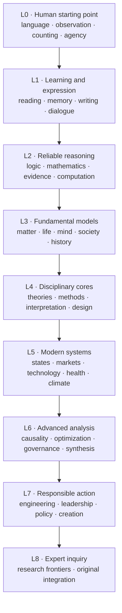
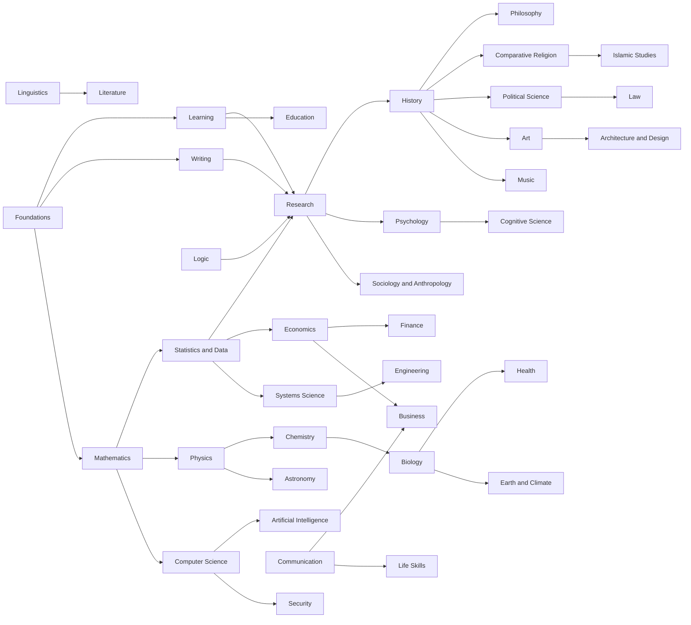

# Global Knowledge Graph

## Topological layers

The layers are a recommended order, not calendar years. Work within a layer may proceed
in parallel when its explicit prerequisites are met.

In prose: human starting capabilities open learning and expression, which open reliable
reasoning, fundamental models, disciplinary cores, modern systems, advanced analysis,
responsible action, and finally expert inquiry. An explicit prerequisite may delay a
unit even when its broad layer is already open.

## Cross-disciplinary backbone

In prose: foundations, learning, logic, writing, mathematics, statistics, research, and
computation supply widely reused capabilities. Natural sciences, human sciences,
institutions, humanities, arts, engineering, and practical life then branch and
recombine through the arrows shown. The diagram is illustrative; exact unit-level
prerequisites in discipline roadmaps are authoritative.

## Milestone gates

| Gate | Learner can reliably… | Opens |
|---|---|---|
| G0: Orientation | read ordinary prose, use numbers, observe, ask, and manage basic study | all beginner roots |
| G1: Claim literacy | distinguish claims, reasons, evidence, interpretation, and value judgment | disciplinary introductions |
| G2: Model literacy | use symbolic, statistical, computational, historical, and causal models | intermediate disciplinary work |
| G3: Method literacy | choose and critique empirical, formal, interpretive, and design methods | advanced work and research |
| G4: Systems literacy | reason about feedback, institutions, externalities, uncertainty, and trade-offs | policy, engineering, strategy |
| G5: Synthesis | integrate domains without erasing their different standards of evidence | capstones and expert inquiry |

## Canonical cross-domain prerequisites

| Capability | Canonical owner | Reused by |
|---|---|---|
| Reading comprehension | Foundations | every discipline |
| Learning strategy and memory | Learning | every discipline |
| Argument analysis | Logic | philosophy, law, research, media, theology |
| Prose composition and citation | Writing | every evidence-producing discipline |
| Quantitative reasoning | Mathematics | sciences, economics, finance, engineering, AI |
| Probability and uncertainty | Statistics and Data | research, medicine, AI, economics, policy |
| Scientific and scholarly method | Research | sciences, social sciences, humanities |
| Programming and computation | Computer Science | data, AI, sciences, engineering |
| Historical source criticism | History | religion, law, politics, art, literature |
| Ethical reasoning | Philosophy | research, technology, health, law, business |
| Spatial reasoning | Geography | history, climate, politics, economics, planning |
| Communication and negotiation | Communication | law, business, leadership, civic life |
| Feedback and complexity | Systems Science | climate, biology, economics, engineering, governance |

## Integration problems

These are not extra disciplines. They are late-stage problems whose prerequisite paths
cross many folders.

| Problem | Minimum prerequisite domains |
|---|---|
| Climate transition | Earth-climate-energy, physics, chemistry, statistics, economics, politics, law, ethics, engineering |
| AI and human agency | AI, computer science, statistics, cognitive science, philosophy, law, economics, security |
| Public health | biology, health, statistics, psychology, sociology, economics, politics, communication |
| Constitutional order | history, political science, law, philosophy, economics, communication |
| Sustainable cities | geography, architecture, engineering, climate, economics, politics, sociology |
| War, peace, and security | history, political science, law, economics, psychology, security, religion |
| Human flourishing | philosophy, psychology, health, relationships, economics, religion, art, civic life |
