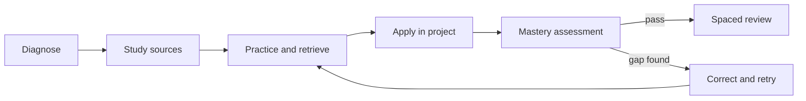

# Learner Guide

> [!IMPORTANT]
> This curriculum is a map and evidence system, not a credential, medical directive, or
> promise that a fixed number of hours produces mastery.

## Choose a route

| Route | Intended learner | Included knowledge | Planned load |
|---|---|---|---:|
| [10-year intensive Core](pathways.md#10-year-intensive-core) | learner able to sustain a demanding second vocation | all 544 Core units | 31 hours/week for 48 weeks/year |
| [15-year balanced Core plus specialization](pathways.md#15-year-balanced-core-plus-one-specialization) | learner combining study with work or care | all Core units and one Extension path | 23 hours/week for 48 weeks/year |
| [20-year full polymath](pathways.md#20-year-full-polymath) | learner pursuing the entire reference curriculum | all 634 Core and Extension units | 23 hours/week for 48 weeks/year |

The route tables are dependency-safe defaults. A diagnostic may move time between units,
but it does not waive a prerequisite that the learner cannot demonstrate.

## Start from zero

1. Begin with [`FND-B01`](Foundations/syllabus.md), the human starting point of
   observation, language, questions, and agency.
2. Use the Foundations, Learning, Logic, Writing, Communication, and Mathematics
   portals to establish reading, numeracy, self-regulation, and expression.
3. Attempt each unit's formative check before studying. If the unfamiliar summative
   task and oral explanation already meet the pass evidence, record the diagnostic
   exemption and schedule a retention check.
4. Follow explicit prerequisite IDs. Work in parallel only when every active unit's
   prerequisites are already mastered.

## Weekly learning loop

In prose: diagnose the unit, study and annotate its sources, practise retrieval and
problems, apply the knowledge in the assigned project, submit the declared mastery
evidence, correct failed components, and then enter the spaced-review sequence.

Use a 48-week study year:

- 40 teaching and project weeks;
- 4 consolidation and cumulative-assessment weeks;
- 4 leave, illness, access, or schedule-repair weeks.

## Work from the canonical unit record

For any unit ID, read the matching row across the discipline:

| Question | File |
|---|---|
| What comes first? | `roadmap.md` |
| What exactly do I learn and demonstrate? | `syllabus.md` |
| What should I read, watch, and practise? | `resources.md` |
| What terms must I command? | `glossary.md` |
| What do I make? | `projects.md` |
| What counts as a pass? | `assessment.md` |
| How much time and review should I plan? | `schedule.md` |
| How does it integrate with other fields? | `connections.md` |

Do not treat resource completion as mastery. The assessment's pass evidence, project
artifact, explanation, and later retention check are the evidence.

## Keep a lifelong portfolio

Maintain one durable record with:

- unit ID, attempt dates, and actual hours by activity;
- diagnostic result and prerequisite evidence;
- exercise samples and error log;
- project versions and feedback;
- summative artifact, rubric decision, and oral-defense notes;
- assistance disclosure, including AI use;
- review dates, retrieval result, and next interval;
- source edition and access date;
- accommodations or environmental constraints that affected the work.

Use the actual-hours record to replace the planning prior. Report interruptions and
access barriers instead of interpreting every delay as lack of ability.

## Use AI without outsourcing judgment

AI may provide examples, questions, feedback, translation support, simulations, or
alternative explanations when the assessment permits it. Record the system, date,
purpose, material prompts or transformations, and what was independently checked.

Do not submit generated prose, proofs, code, citations, interpretations, or calculations
as mastered work without verification and an oral or process-based authorship check.
Never place confidential, proprietary, clinical, or identifiable research data into an
unapproved system.

## Adapt access, not the target

Change format, pacing, assistive technology, response method, scheduling, or supervision
when needed. Preserve the intended construct: for example, speech-to-text may change
how an argument is entered, but it does not remove the requirement to construct the
argument. Record where a task unintentionally tests vision, hearing, motor speed,
language background, or equipment access rather than the declared outcome.

## Know when independent study is insufficient

Use qualified supervision for hazardous laboratories, clinical practice, structural or
electrical work, weapons or offensive-security exercises, human-subjects research, and
jurisdiction-specific legal practice. The curriculum teaches literacy and judgment; it
does not confer professional authorization.

## Review and revise

Use the [review system](review-system.md) after initial mastery. At the annual audit,
compare planned and actual hours, inspect forgotten prerequisites, revisit dated
resources, sample earlier work under unfamiliar conditions, and adjust the next year
without concealing the evidence that prompted the change.
